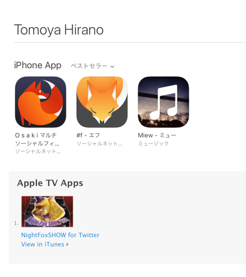
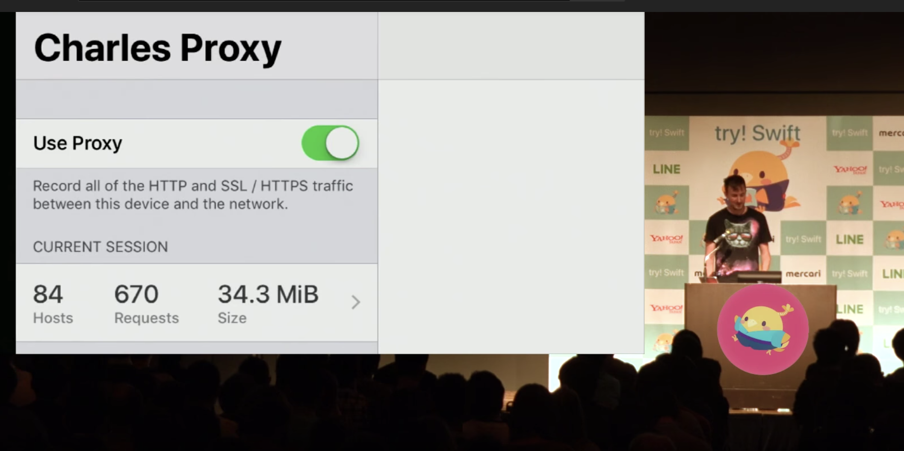
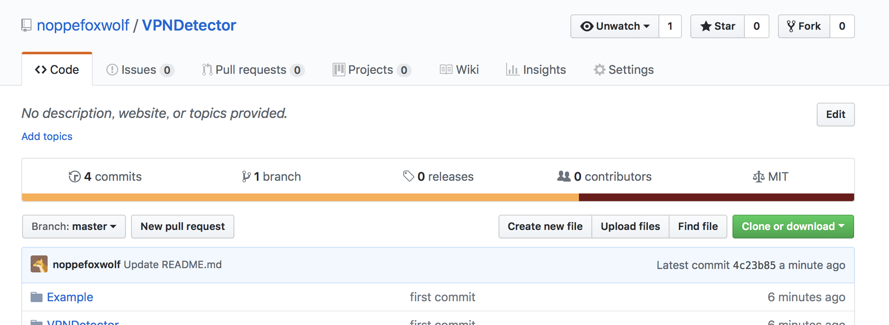

footer: 🦊 @noppefoxwolf, 2018
slidenumbers: true

# [fit] App Protection

---

# noppe

**@noppefoxwolf**

iOSアプリ開発者 ８年目

🦊 が好きです！

potatotips初参戦です！


---



---


---

# Charles for iOSが発売されましたね！

- CharlesはiOSからの HTTP と HTTPS のトラフィックをキャプチャできるアプリ

- 通信系の**デバッグ**にとても便利ですよね！

---

自分のアプリの通信を見ていたら…

---

自分のアプリの通信を見ていたら…

偶然CharlesをつけっぱなしでTwitterのアプリを開いてしまった。

---


タイムラインの更新が出来ませんでした。

---

# [fit] 今回はこの動作を実装しました。

---

# Charlesの実装

まずCharlesの実装を確認します。
try! Swift Tokyo 2018 - Introducing Charles for iOS[^1]



[^1]: https://www.youtube.com/watch?v=RWotEyTeJhc

---

# Charlesの実装

NetworkExtensionを使って、VPN[^2]コネクションを貼っている。

iOSのVPNの常時接続機能を使えばアプリからすべてのIPトラフィックがトンネリング出来る。[^3]


[^2]: Virtual private network 仮想プライベートネットワーク

[^3]: https://developer.apple.com/documentation/networkextension

---

# [fit] アプリからVPNが貼られているかチェック出来ればOKそう

---

# VPN検出

`CFNetworking.framework`を使うことで、検出できる。

`CFNetworkCopySystemProxySettings()`

↑でシステムのインターネットプロキシ設定を取得出来ます。

---

```
Swift.Unmanaged<__ObjC.CFDictionary>(_value: {
    "__SCOPED__" =     {
        utun4 =         {
            HTTPSPort = 8080;
            HTTPSProxy = "10.78.2.43";
        };
    };
})
```

`__SCOPED__`にプロキシ設定が入っている
`tun`が含まれる設定はトンネルなので弾いて良い…？

---



`VPNDetector`

https://github.com/noppefoxwolf/VPNDetector

---

# [fit]🦊 以上です！
# [fit]ありがとうございました
