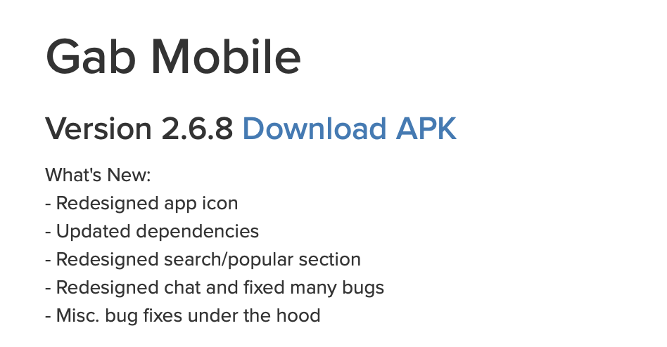

footer: 🦊
slidenumbers: true

# Introducing GabKit

### Otemachi.swift \#02 noppe (@noppefoxwolf)

---

#[fit] noppe

💻 iOS app developer
🏢 company of streaming apps
🦊 really like fox
🇯🇵 japanese


---

# What's Gab? 🤔

---

# gab.com

> A social network that champions free speech, individual liberty and the free flow of information online. All are welcome.[^1]

**In short, SNS like Twitter**

[^1]:https://gab.com

^ 自由な発言、個人の自由、情報の自由な流れをオンラインで支えるソーシャルネットワーク。 すべて歓迎です。

^ 要するにはTwitterのようなSNS

---

# What's different from Twitter?

---

# Difference between gab and Twitter

- censorship is yourself to use filter.

- legal pornography is permitted if mark as #NSFW.

- able to apply for approval users yourself

- PRO user subscription ($5.99/month)

---

#[fit] 😄

^ 良さそう

---


---



---

# no iOS app...🧐

---

# So, develop by myself.💻

---

# Official API

## https://developers.gab.com/

- Only PRO User

- Not fully. (ex: response example)

- Better than Twitter API in many ways.

---

# Better than Twitter API

- Rate limit are 60 / min

- Notification(activity) api

- Poll api

- Scopes (permission)

---

# GabKit
## A Gab.com framework written in Swift

---

# GabKit

- Simple to use

- Responses are simple model.

- support all api.

- Open source and MIT License.

---

## Setup

Add url scheme your Info.plist

```xml
<key>CFBundleURLTypes</key>
	<array>
		<dict>
			<key>CFBundleTypeRole</key>
			<string>Editor</string>
			<key>CFBundleURLSchemes</key>
			<array>
			<string>gabkit</string>
		</array>
	</dict>
</array>
```

---

## Setup

Handle URL in AppDelegate.

```swift
func application(_ app: UIApplication,
                open url: URL, 
                options: [UIApplicationOpenURLOptionsKey : Any] = [:]) -> Bool {
    Gab.handleURL(url)
    return true
}
```

---

# Authorize

```swift
let gab = Gab(clientID: Secret.clientID,
                clientSecret: Secret.clientSecret,
                scopes: .read, .notifications, .writePost)
gab.authorize(withPresentingFrom: self)
```

---

# Get Main feed

```swift
gab.getMainFeed(success: { (response) in
    // response.data.count
})
```

# Create Post

```swift
gab.createPost(body: "hello gab.")
```

---

# GabKit
## https://github.com/noppefoxwolf/GabKit

---

---

# One more think 🤔

---

# When SnakeCase JSON contains a kebab-case

```json
{
    "data": [
        {
            "picture_url" : "" //snake key
            ...
        }
    ],
    "no-more": false //kebab key
}
```

---

# Cannot decode to Decodable model

```swift
try! JSONDecoder().decode(Response.self, data: data)
```

> No value associated with key CodingKeys(stringValue: \"noMore\", intValue: nil) (\"noMore\").

---

# 

---