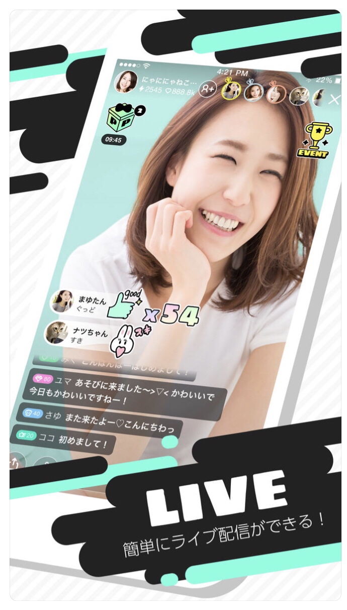
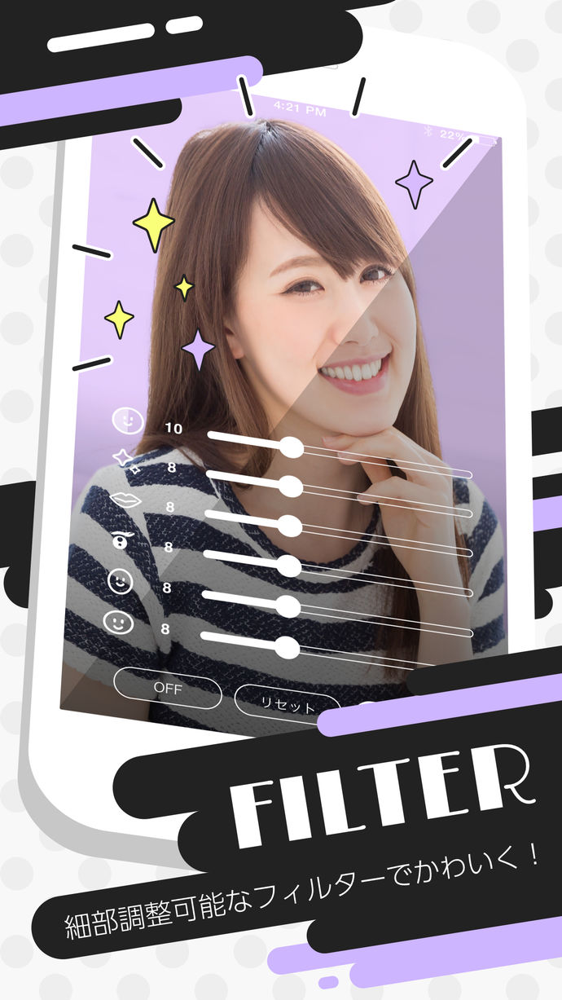
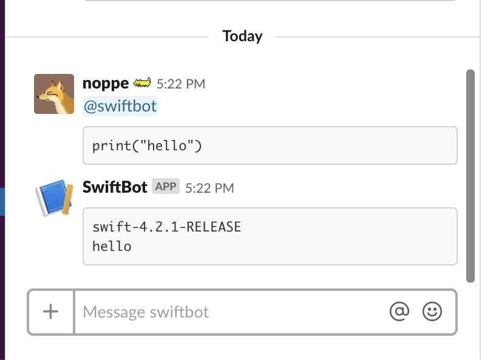
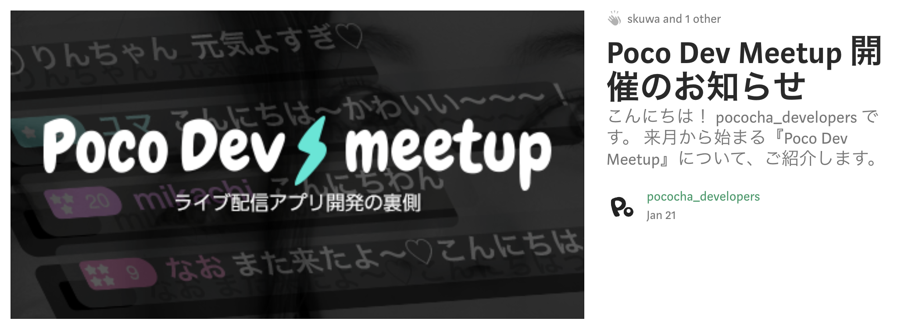
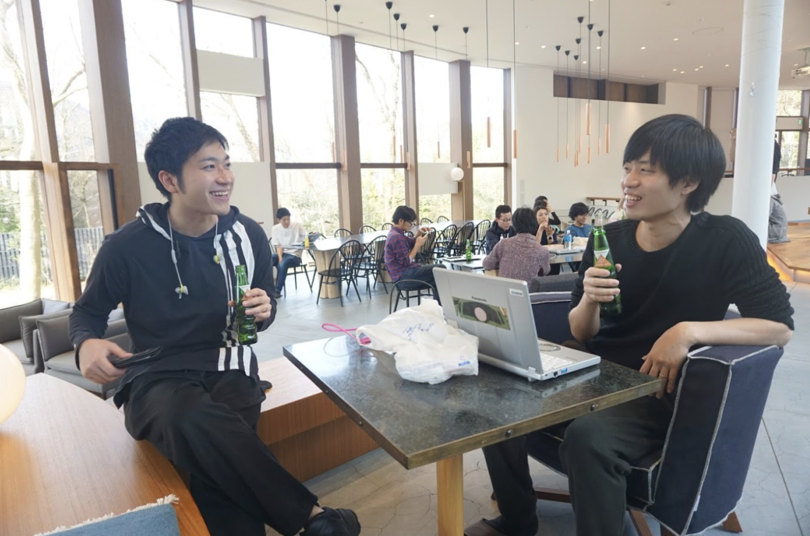

footer: 🦊
slidenumbers: true

# 立ち上げ時のライブ配信アプリに最適な開発環境・技術的ノウハウとは
## Poco Dev Meetup #1

---

#[fit] noppe

💻 Pococha iOSエンジニア
🦊 きつねかわいい
📱 iOSDCでPocochaの描画周りの話をしました
📖 技術書典６参加します！

---

[.autoscale: true]

# Pococha

- 誰でも気軽にライブ配信と視聴ができるアプリ
- チャットやアイテムで盛り上がる配信
- ランキングやイベントで上位を目指す仕組み
- 配信以外でもファミリーチャットでコミュニケーション

---

# このトークの目的

- ライブ事業の立ち上げを透明に
- ロンチのハードルを下げてライブ市場を盛り上げたい
- ~~あわよくばPocochaに来て欲しい~~

^ 弊社をはじめ、メルカリやLINEなど多くの企業がライブ事業に参戦していますが
^ 一方でベンチャーがライブ事業に参入しているのはまだまだ少ないと思います。
^ それはまだまだライブ事業がどのような技術で運用されているか不透明だからという点もあると思います。
^ 実際使われている技術の話をしながら興味を持っていただければと思います。

---

# 今日話すこと

- プロダクト周りについて
- 運用について
- 最近の取り組み

^ アプリとかサーバーの話
^ 運用の話
^ 最近の取り組み

---

# プロダクトの話

---

# 初期の構成

- 配信サーバー
- アプリサーバー
- iOSアプリ

AndroidアプリはiOSアプリが軌道に乗ってからリリース

^ iOSはSwift,Androidはkotlinです

---

# iOSに絞った理由

- SI部[^0]で開発された共通フレームワーク
- 施策の共通化が不要な点

→ 初期ははスピード重視で開発

[^0]:新規事業の開発部署、サービスインキュベーション事業部

---

# 配信サーバー

- wowza

一般的なストリーミングサーバー
SHOWROOMでの実績があって採用

---

# 新規でストリーミングサーバーを建てるなら？

需要の高まりに応じて各社サービスもアリ

- **GCP**ライブストリーミング
- **AWS** Media Services
- **Azure** Media Services

---

# アプリサーバー

- Ruby on Rails

これもSIで知見が溜まっていたため採用
ログやユーザー管理がセットアップされたテンプレートやgemがある

---

# チャットコミュニケーション

---

# チャット

ライブ中に視聴者はチャットでコミュニケーションが出来る

そのほか、ハートを送ったりするマイクロコミュニケーションも実装

---

# チャットの技術選定

WebSocketとかAction Cable自前で実装するとリトライとかオフライン処理大変そう

→ **firebase realtime database**を使うことで比較的簡単に実装できた

---

## NGワードとfirebase

firebaseとクライアントを直接繋ぐと当時はNGワードやコメントブロック機能を作る事が難しかった[^1]

→ アプリサーバーからfirebaseに書きこむ事にした

[^1]:当時はCloudFunctionもβだった

^ 結果的にfirebaseはアプリにイベント通知を送るためだけに利用されて、realtime DBに溜まるコメントは利用しなかった。

---

# 大量のリクエストの負荷対策

ハートは連打可能なので、1秒でバッファリング
毎回受け止めると塵積で結構キツくなる。

イベントの目標にハート数があると、異常な連打数で押されることもある。

---

# 配信周り

---

# クライアント

内製ライブラリを利用

rtmpで配信を行い、rtmp/hlsで視聴する

---

# 新規で実装するなら

- HaishinKit
https://github.com/shogo4405/HaishinKit.swift

- LFLiveKit
https://github.com/LaiFengiOS/LFLiveKit

---

# 配信サイズ

- 360x640

一般的なスマホ向けライブ配信サービスはこのくらい。
ここはコーデックの工夫などで改善予定。

---

# アイテム周り

---

# アイテム周り

ライブ中に有料のアイテムを利用出来る
全画面にエフェクトが表示されるものも

---

# アイテム再生周り

iOSDCで話しました
→ ライブ配信アプリのアイテム再生をMetalで実装する事になった話

https://speakerdeck.com/noppefoxwolf

---

# 演出における知見

- パフォーマンスをとにかく意識する

配信状態の端末は、CPUやGPUを潤沢に使っている状態
重い演出は配信品質を下げたり熱暴走の原因になる

---

# フィルタ周り

---

# フィルタ周り

輪郭補正や、デジタル化粧で前準備をせずに配信がはじめられる

---

# フィルタ周り

カメラから取得したフレームバッファにシェーダを適用して加工
画面の反転もここで行っている。

- GPUImage

---

# 運用の話

---

# リリース直後の不安定な動作

配信中にアプリが不定期に落ちる

→ GPUImageを複数のスレッドから利用していた

→ メインスレッドで動かすように

---

# リリース直後の不安定な動作

→ メインスレッドで動かすように

配信中にアプリが重い、熱くなって動作不能になる…

→ GPUImageをやめて、自前のフィルタライブラリを作って移行

---

# 配信の安定性の検証は難しい

・単純なUnitテストで担保しにくい
・実機やネットワーク環境が必要
・ネットワーク環境が多様
・物理時間がかかる

→ 現在は人力で実施。挑戦していきたい課題

---

# リッチなフィルタ体験

輪郭や目の大きさを補正するフィルタ

- SenseMeを導入

---

# 配信内容のチェック

- 24時間体制でチェック
- AWS Recognitionで配信チェックの効率化を予定

^ ここはスタートアップでやるには難しい箇所かも、ターゲットのクラスタ次第では非常に難しくなる

---

# CICD

circleCIを使っていた。

現在はbitriseを利用中。基本はfastlaneに全寄せ

fabricへInhouse版を配布したりします。

---

# 最近の取り組み

---

# 遅延

低遅延化の取り組みで0.2秒の遅延の内製サーバへ移行予定

https://www.slideshare.net/akirahiguchi/dena-112412583

---

# チャットのインフラ移行

firebaseの障害が発生することがあり、自前のSocket通信サーバと平行して運用中

---

# リアルイベントの実施

---

# 公式ラジオ番組の実施

ポコチャ公式ラジオ番組「Pocoっとchaンネル」が2/5放送開始👏
文化放送 毎週火曜26:00~26:15(水曜2:00〜2:15)

---

# チームの雰囲気とか

---

# SlackにSwiftbotを導入しました。

---

# TechBlogはじめたり

https://medium.com/pococha-engineering

---

# 合宿とかしています

^ コロニー箱根

---

# 一緒にライブ市場を盛り上げていきましょう！
## ありがとうございました！

