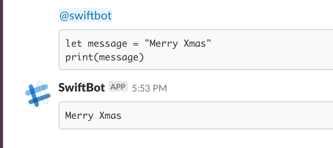

footer: 🦊
slidenumbers: true

# 今から理解するCVBuffer
## ROPPONGI.swift 第6回 望年会

---

#[fit] noppe

💻 ライブ配信アプリPococha
🦊 きつねかわいい
🌲 ROPPONGI.swift初参戦


---

# Pocochaの紹介


---

# 合宿しました
Discord Swiftで動いてるSwiftbotをチーム内でも使ってみたくてSwift製のSlackBot作ったりしてました。



---

# 動画を扱う機会の増加

- 動画配信アプリやh265の登場、CoreVideoに触れる機会が増えている
- CVBufferは目にするけどSOのコピペで乗り切ってる
- パフォーマンスを気にしないといけない箇所である事が多い
- CVBufferが何なのか何となく分かるとOpenGLESやMetalにも繋がるので紹介

---

# CVBuffer

- CVBufferのCVはCoreVideoのCV

データバッファを直接触らずに簡単に読み書きするためのベースクラス

---

# 代表的なCVBufferの派生

- CVImageBuffer
`public typealias CVImageBuffer = CVBuffer`
- CVPixelBuffer
`public typealias CVPixelBuffer = CVImageBuffer`
- CVOpenGLESTexture
`public typealias CVOpenGLESTexture = CVImageBuffer`

- CMSampleBuffer
`これは違う`
- CMBlockBuffer
`これも違う`

---

# CVPixelBuffer vs CVImageBuffer

CVPixelBufferはメモリ内のピクセルバッファにアクセスするためのクラス
CVImageBufferはメモリ内の画像にアクセスするためのクラス

アクセスする先は同じ、取る情報の種別が異なる

---

# CVPixelBuffer

ピクセル情報アクセスの例

- 縦横のサイズ
- データサイズ


---

# UIImage/CIImageなどとの比較

- CVBufferの利点
無駄なコピーやキャッシュは行われない
映像（画像）データをよく取り扱う
要するに画像データ

# CVImageBufferの構造

//画像
非常にシンプル

---

# どんな時に取得できるものか

ciImage.pixelBuffer
//CIImageでCVPixelBufferRef

let ib = CMSampleBufferGetImageBuffer(sb)

//自分で変換したり、作ったりする事もある

---

# 変換

-> CIImage
`CIImage(cvPixelBuffer: CVPixelBuffer)`

---

# メソッドの呼び方

`let size = CVImageBufferGetDisplaySize(ib)`

ib.displaySizeのようなIFはない

CVBuffer系はただのtypealiasなので上記メソッドにCVPixelBufferを入れても良い。

---

# どんな値が取得出来るのか

---

# アドレスのロック

CVBufferのデータバッファにCPUからアクセスする場合はアドレスをロックする必要がある

```
CVPixelBufferLockBaseAddress(pb, .readOnly)
defer { CVPixelBufferUnlockBaseAddress(pb, .readOnly) }
```

0 or CVPixelBufferLockFlags.readOnly(= 1)

GPUからのアクセスの場合はロック不要
おそらくCVOpenGLESTextureの事を指している

GPU/CPUのメモリが共有になったけど？ロック必要なの？
必要ないならOpenGL同様deplicatedになっていそう。
そもそもメモリアドレスなのでMetalのShared Memoryではない機構でアクセスしているのでは
仮にMetalの機構だったとしてもMetal非対応の環境下では内部的にOpenGLが使われる処理もあるため
OpenGLESの場合は共有されていない。

//http://dsas.blog.klab.org/archives/52168462.html

---

# 生のData bufferの取り方

---

# CMSampleBufferとは

名前は似ているが、構造は別物

---