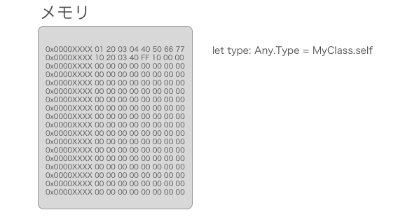
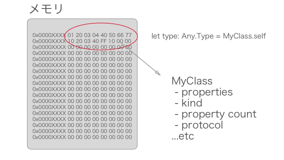
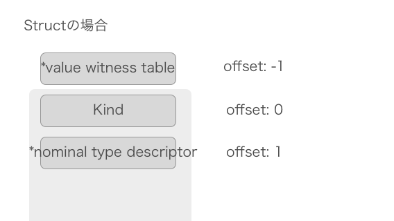
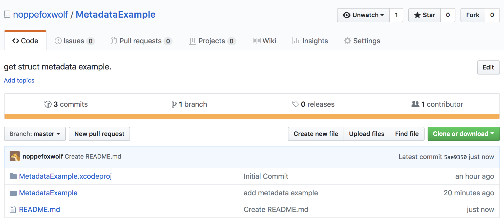

footer: 🦊 @noppefoxwolf, 2018
slidenumbers: true


> Swiftとメタデータ
-- 2018/06/20 - Swift愛好会vol32

---

#[fit] noppe

🦊 きつねが好き！！
📱 iOSアプリ開発8年目

Swift愛好会初参戦


---


---

# メタデータとは

メタ情報とは、すなわち**データについてのデータ**という意味で、あるデータが付随して持つそのデータ自身についての付加的なデータを指す。（Wiki調べ）[^1]

🤔

[^1]: https://ja.wikipedia.org/wiki/メタデータ

---

# メタデータとは

- クラス名
- クラスのプロパティ名
- 継承元
- 準拠しているプロトコル
...etc

---

# メタデータが必要な時

- 今見ているビューコントローラをログに吐きたい
- インスタンスをダンプして保存したい
- 詳細で分かりやすいエラーを表示したい
- いい感じのORM作りたいとか
...etc

---

#[fit] Swiftでメタデータを取得するにはどうすればいい？

---

#[fit] そういえばObjective-Cではどうしていたのか？

---

# プロパティ一覧を取得する

ObjectiveC-runtime API

```swift
class_copyPropertyList(_:_:)
```

https://developer.apple.com/documentation/objectivec/1418553-class_copypropertylist

---

# プロパティ一覧を取得する

```objc
unsigned int propertyCount = 0;
objc_property_t * properties = class_copyPropertyList([self class], &propertyCount);

NSMutableArray * propertyNames = [NSMutableArray array];
for (unsigned int i = 0; i < propertyCount; ++i) {
  objc_property_t property = properties[i];
  const char * name = property_getName(property);
  [propertyNames addObject:[NSString stringWithUTF8String:name]];
}
free(properties);
NSLog(@"Names: %@", propertyNames);
```

---

# プロパティ一覧を取得する

ObjC runtime APIはSwiftでも使うことができる。

```swift
import ObjectiveC
```

---

# プロパティ一覧を取得する

```swift
var count: UInt32 = 0
let properties = class_copyPropertyList(MyClass.self, &count)
for i in 0..<Int(count) {
  let prop = properties![i]
  let propName = String(cString: property_getName(prop))
  print(propName)
}
```

---

# プロパティ一覧を取得する

Swiftでclass_copyPropertyListを使うには制限がある

```swift
class MyClass: NSObject {
  @objc var prop1 = ""
  @objc var prop2 = ""
}
```

プロパティに`@objc`をつけること！[^※1]

[^※1]: @objcが必要であり、NSObjectを継承する必要はない。また@objcをつけるにはclassである必要がある

---

> @objcを付けずにプロパティ一覧を取得する方法はないでしょうか…？

---

# プロパティ一覧を取得する

## Encodable

```swift
class MyClass: Encodable {
  var prop1 = ""
  var prop2 = ""
}

let data = try! JSONEncoder().encode(MyClass())
let json = try! JSONSerialization.jsonObject(with: data, options: .allowFragments)
print((json as! [String : Any]).keys)
```

- ["prop1", "prop2"]


---

## reflection

```swift
let mirror = Mirror(reflecting: MyClass())
let propNames = mirror.children.compactMap({ $0.label })
```

---

> Objective-C runtime APIに相当するframeworkは無いのか…

---

# swift/docs/Runtime.md

**The final runtime interface is currently a work-in-progress;**[^3]

なさそう

[^3]:https://github.com/apple/swift/blob/master/docs/Runtime.md

---

# Third party runtime API

https://github.com/wickwirew/Runtime
https://github.com/Zewo/Reflection

---

# wickwirew/Runtime

```swift
var md = ClassMetadata(type: MyClass<Int>.self)
let info = md.toTypeInfo()
info.properties.compactMap { $0.name }
```

---

## Pros Cons

||@objc|instance|metadata|
|:---:|:---:|:---:|:---:|
|ObjC runtime|x|o|o|
|Encodable|o|x|x|
|reflection|o|x|△|
|third party api|o|o|o|

---

> ☺️
-- じゃあThird partyの使おう〜〜

---

> RuntimeやReflectionはどうやってメタデータを取得しているのか？

---

# Runtimeの処理

Typeが保持されているメモリを直接参照してメタデータを取得している。
これらを構造体に当て嵌めて使いやすいようにしたライブラリ
メモリのレイアウト構造はドキュメントがある

[^4]:https://github.com/apple/swift/blob/master/docs/ABI/TypeMetadata.rst#nominal-type-descriptor

---



---



---

## STEP1

```swift
var type: Any.Type = Kind.self
let typeAsPointer = unsafeBitCast(type, to: UnsafeMutablePointer<Int64>.self)
let metadataPointer = typeAsPointer.advanced(by: -1)
let metadataRawPointer = UnsafeMutableRawPointer(metadataPointer)
```

type自体のポインタから生ポインタを取得する

---



[^5]:https://github.com/apple/swift/blob/master/docs/ABI/TypeMetadata.rst

---

[補足]value witness table

関数を呼び出す時に経由するテーブル
Runtimeではこのサイズや順序を元にインスタンスのメモリ構造を作り出して無理やり生成する機能がある

---

## STEP 2

```swift
let layout = metadataRawPointer.assumingMemoryBound(to: StructMetadataLayout.self)
```

`assumingMemoryBound`でポインタをMetadataLayoutの構造へのポインタと解釈します。

---

## STEP 2

StructMetadataLayout.swift

```swift
struct StructMetadataLayout: NominalMetadataLayoutType {
    var valueWitnessTable: UnsafePointer<ValueWitnessTable>
    var kind: Int
    var nominalTypeDescriptor: UnsafeMutablePointer<NominalTypeDescriptor>
}
```

---

## STEP 2

```
structLayout.kind //1
enumLayout.kind //2
protocolLayout.kind //12
```

これでメモリの構造をstructにマッピングする事が出来た

---

## STEP 3

`Nominal Type Descriptor`の`offset: ４`が`field names`なのでそこの実体を参照すると、プロパティ名のCStringの配列が取得できる。

---

## STEP 3

```swift
struct Animal {
  var name: String
}
```

```swift
let cString = metadata.pointee.nominalTypeDescriptor.pointee.fieldNames.advanced()
String(cString: cString) → name
```

CStringの参照をStringに変換すると、プロパティ名が取得できる。

---

## STEP 4

あとはこのCStringの参照をプロパティ分ズラして取得していけば、全てのプロパティ名が取得できる。[^6]

[^6]:実際は他のポインタからプロパティの数を取得してその分を取得している

---

# Warning

この方法は当然Swiftの仕様変更でメモリのレイアウトが変わると使えなくなる。
Swift ABI Stability Manifesto[^7]

[^7]:https://github.com/apple/swift/blob/master/docs/ABIStabilityManifesto.md

---

# Example project



#[fit]https://github.com/noppefoxwolf/MetadataExample

---

# まとめ

- メタデータにアクセスする方法は複数あり一長一短である
- 純Swiftな構造体のMetadataを安全に得る方法はまだ無い。
- メモリを参照する事で、通常取得出来ない多くの情報にアクセスできる

