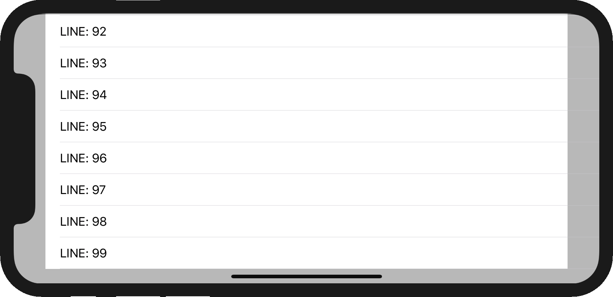
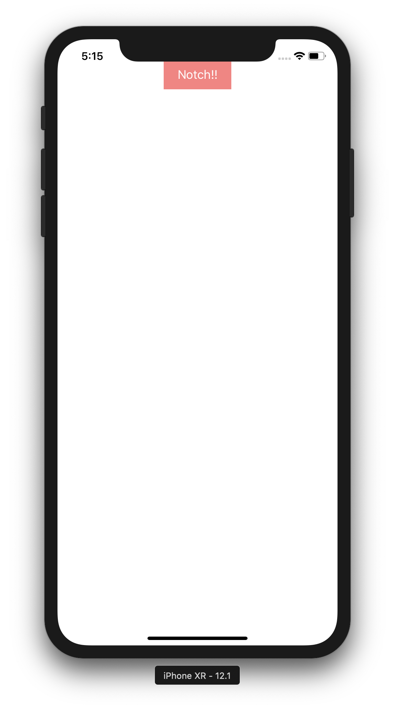
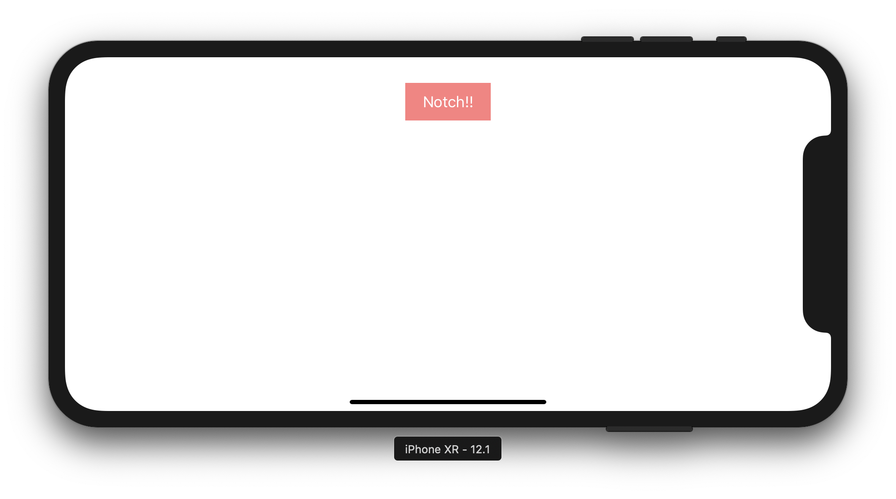

footer: 🦊
slidenumbers: true

# UILayoutGuideを活用する

### Swift愛好会 vol36

---

#[fit] noppe

🏢 ディー・エヌ・エー
💻 ライブ配信iOSアプリ
🦊 きつねかわいい


---

# UILayoutGuide

Autolayoutの機能を持った表示されないビューのようなもの
Anchorしか持たないシンプルなクラス

---

# UILayoutGuide



例：view.safeAreaLayoutGuide

[.footer: https://qiita.com/gentlejkov/items/a626263d452939378b07]

---

# UILayoutGuide

||UIView|UILayoutGuide|
|---|---|---|
|Anchor|`view.topAnchor`|`layoutGuide.topAnchor`|
|追加|`addSubView(view)`| `addLayoutGuide(layoutGuide)` |
|削除|`view.removeFromSuperview()`| `removeLayoutGuide(layoutGuide)` |
|subView|`view.addSubView(subView)`| なし |

---

# UILayoutGuide

||UIView|UILayoutGuide|
|---|---|---|
|Autolayout|○|○|
|レンダリングコスト|×|○|
|機能のシンプルさ|レイアウトに不要な機能が存在|最低限|
|ビューヒエラルキの更新|される|されない|

^ addSubViewなど、不要な機能が存在します
^ iOS9未満にはUILayoutGuideがないので、ワークアラウンドとしてビューを使う事もあったかもしれませんが、今は不要です

---

# 自作のUILayoutGuideを生やす

---

# 自作のUILayoutGuideを生やす

- safaAreaLayoutGuideなどデフォルト実装もあり
- UILayoutGuideは自分で追加することも可能

^ さきほど紹介したように、UILayoutGuideは自分で追加することが出来ます。

---

> **freshOS/KeyboardLayoutGuide**


キーボードの位置にLayoutGuideを生やすExtension

---

> **noppefoxwolf/TextContainerLayoutGuide**


textContainerにLayoutGuideを生やすExtension

---

> **noppefoxwolf/TextContainerLayoutGuide**


---

# 自作のUILayoutGuideを生やすメリット

- 動的な制約の変化をVCから隠蔽出来る
- ManualLayoutしがちな箇所を減らせる

^ スクロール量に応じて〜とかだとコードでレイアウト書くの大変になって、マニュアルレイアウトで乗り切ったりする。けど、数行書くだけでいいならそうする

---

# 動的な制約の変化を隠蔽出来る

```swift
let nc = NotificationCenter.default
        nc.addObserver(self,
                       selector: #selector(keyboardWillChangeFrame(_:)),
                       name: UIResponder.keyboardWillChangeFrameNotification,
                       object: nil)
~~

NotificationCenter.default.removeObserver(self)

~~

viewBottomConstraint.constant = height
view.layoutIfNeeded()

```

---

# 動的な制約の変化を隠蔽出来る

```swift
button.bottomAnchor.constraint(equalTo: view.keyboardLayoutGuide.topAnchor).isActive = true
```

---

> **静的なレイアウト**

→ Storyboard, XIB

> **動的なレイアウト**

→ UILayoutGuide

^ ViewControllerを太らせない

---

# LayoutGuideを自作する

---

# 例：NotchLayoutGuide

- Notchの場所にLayoutGuideを配置する

---

# 流れ

- UILayoutGuideのサブクラスを作る
- UIWindowに黒魔術でlayoutGuideを生やす
- 回転によって制約を更新する

---

# UILayoutGuideのサブクラスを作る

```swift
public class NotchLayoutGuide: UILayoutGuide {
  internal func setup() {
    guard let window = owningView else { return }
    NSLayoutConstraint.activate([
      topAnchor.constraint(equalTo: window.topAnchor),
      centerXAnchor.constraint(equalTo: window.centerXAnchor),
      widthAnchor.constraint(equalToConstant: 230),
      heightAnchor.constraint(equalToConstant: 30),
    ])
  }
}
```

※Notchのサイズは230x30くらい

^ このようなサブクラスを作る
^ ポイントは２つ、owningViewで自分がaddLayoutGuideされたビューが取れる
^ selfに生えているanchorはviewと同じように設定できる。

---

# UIWindowにlayoutGuideを生やす

```swift
public extension UIWindow {
  public var notchLayoutGuide: NotchLayoutGuide {
    if let obj = objc_getAssociatedObject(self, &AssociatedKeys.notchLayoutGuide) as? NotchLayoutGuide {
        return obj
    }
    let new = NotchLayoutGuide()
    addLayoutGuide(new)
    new.setup()
    objc_setAssociatedObject(self, &AssociatedKeys.notchLayoutGuide, new as Any, .OBJC_ASSOCIATION_RETAIN_NONATOMIC)
    return new
  }
}
```

### extensionにstored propertyを生やす黒魔術を使うと便利

^ addLayoutGuideでも良いが、これをしておくと`window.notchLayoutGuide`でアクセスできる。

---

# 動作の確認

```swift
let button = UIButton(frame: .zero)
button.translatesAutoresizingMaskIntoConstraints = false
view.addSubview(button)
NSLayoutConstraint.activate([
    button.topAnchor.constraint(equalTo: window.notchLayoutGuide.bottomAnchor),
    button.centerXAnchor.constraint(equalTo: window.notchLayoutGuide.centerXAnchor),
    button.widthAnchor.constraint(equalToConstant: 100),
    button.heightAnchor.constraint(equalToConstant: 44),
])
```

ボタンをNotchLayoutGuideの下に配置する制約をつける

---



---



---

# 回転によって制約を更新する

```swift
NotificationCenter.default.addObserver(self,
    selector: #selector(didRotate),
    name: .UIDeviceOrientationDidChange,
    object: nil)
~~
deinit {
    NotificationCenter.default.removeObserver(self)
}
```

^ UIDeviceOrientationDidChageを使って監視します。
^ これもNotichLayoutGuideクラスの中に書く

---

# 回転によって制約を更新する

```swift
private func update() {
    guard let window = owningView else { return }
    allConstraint.isActive = false //extension
    
    switch UIDevice.current.orientation {
    case .portrait:
      ...
    case .landscapeLeft:
      ...
.....
```

---


^ 常にnotchの下につき続けるようになった

---

# UILayoutGuideで出来ない事

- 短形領域でないものは生やせない
- Debug View Hieralcyで見えない

^ これはAutolayout自体の制約でもあるが、円形状のものなどには

---


