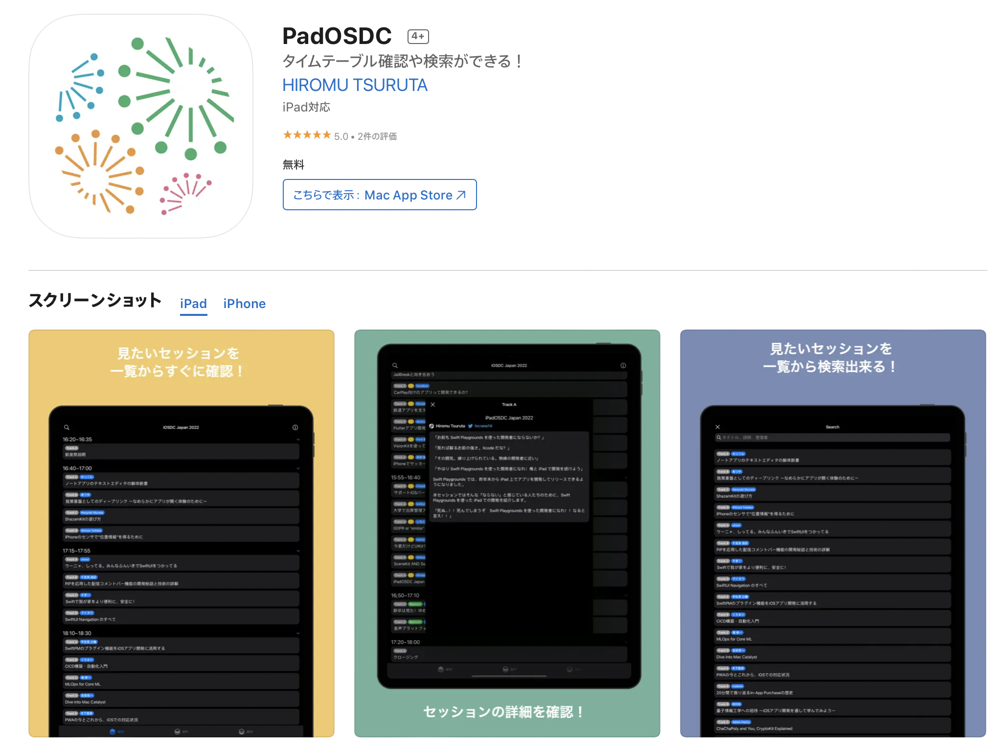
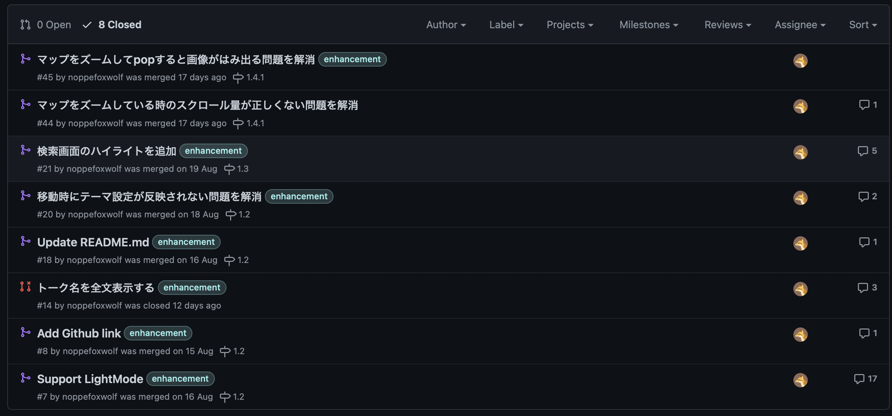
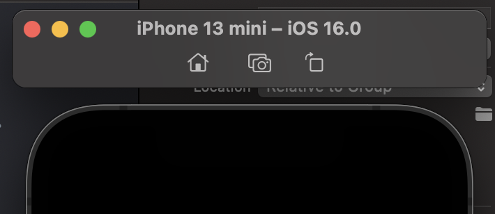
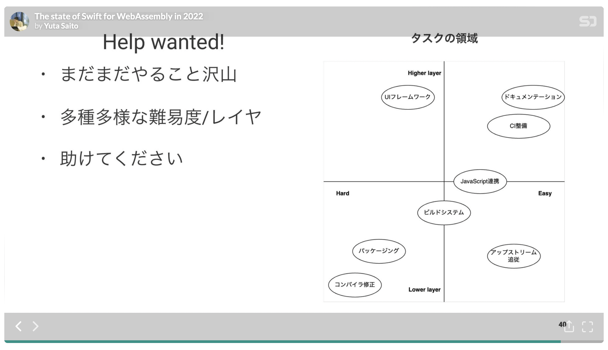
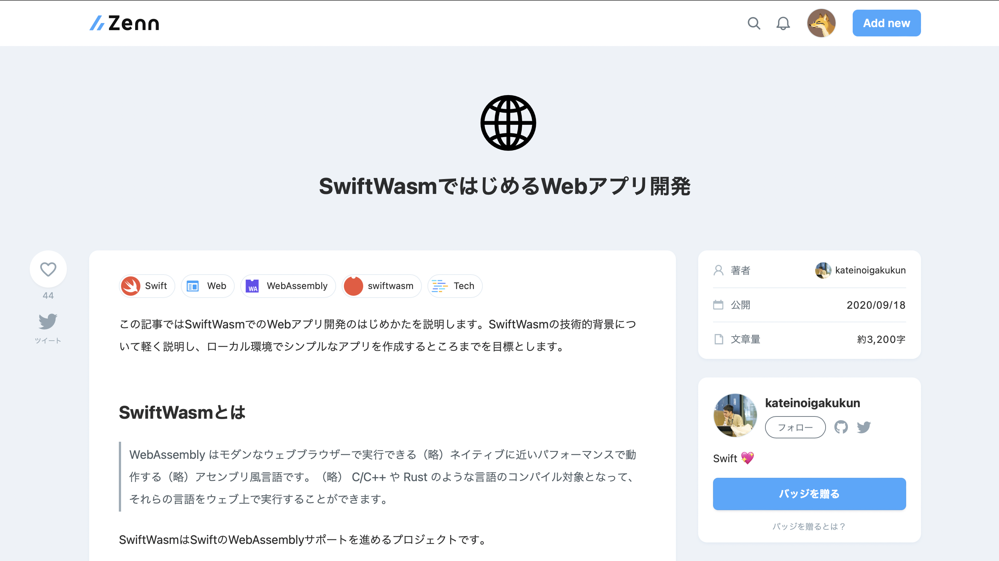
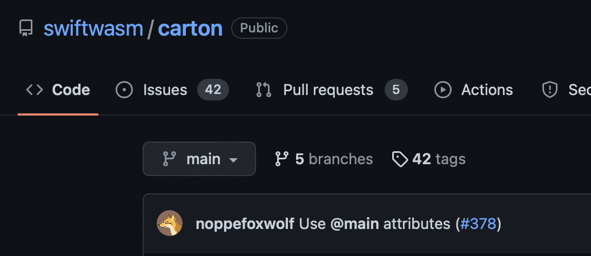
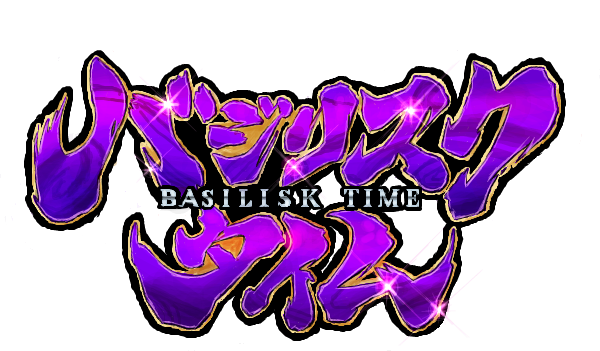

slidenumbers: true
autoscale: true

# iOSDC感想戦
## Swift愛好会 vol.70

---

# **noppe**

- 株式会社ディー・エヌ・エー
- iOSDC22
    - CoreGraphicsでドット絵を描く
    - ベストフィードバッカー賞
- きつねが好き


---

# 登壇駆動開発

---

# 登壇駆動勉強

- 登壇するために、勉強すること
- 先に登壇を決めて、それを理由に勉強する

---

# 聴講駆動勉強のススメ

---

# 聴講駆動勉強のススメ

- トークを聞いた上で、手を動かしてみる

---

# 今回やってみた聴講駆動勉強

- PadOSDCへのコントリビュート
- Safari Web Extensionsの開発
- SwiftWasmへのコントリビュート
- XCBBuildServiceProxyKitを動かしてみた
- ~~SlideKitへのコントリビュート~~

---

# PadOSDCへのコントリビュート

---

# PadOSDC

- iOSDC22の非公式アプリ



---

# PadOSDC

- くれいんさんのLT
- ２日目のLTラスト
- **crane-hiromu/PadOSDC_Japan_App**


---

# ８件のPR



---

# Support LightMode

- 元々ダークモード前提だったのでライトモードもサポートした
- 実はSwiftUIはダークモードオンリーは危険

^ ピックアップ

---

# SwiftUIでダークモードのみをサポートするのはなぜ良くないのか

---

# UIUserInterfaceStyle

- Info.plistで使えるキー
- Lightを指定することでダークモードを無効化できる
- **SwiftUIでは有効にならない**
→ ダーク・ライト両方対応する必要がある

---

# 嘘ダークモードをやると

- 背景色を黒にする
- テキストを白にする

→ ステータスバーの色が黒なので見えなくなる



---

# Safari Web Extensionsの開発

---

# Safari Web Extensionsの開発

- 前夜祭matsueさん「広まれSafari Web Extensions！Safari Web Extensions の始め方」
- fortee向けのSafari Web Extensionsを作った
- noppefoxwolf/FullFeedback

---

# FullFeedback

- たくさんフィードバックを送るための拡張

- 未フィードバックのボタンの色を赤にする
- フィードバック率を表示する


---

# SwiftWasmへのコントリビュート

---

# SwiftWasmへのコントリビュート

- ２日目kateinoigakukun「The state of Swift for WebAssembly in 2022」

---



---

# SwiftWasmへのコントリビュート

- 流石に本体にコントリビュートは出来ないけど、周辺ツールなら出来るかも
    - 結果として２件のPR
- とりあえずチュートリアルをやってみることに

---



https://zenn.dev/katei/articles/swiftwasm-web-tutorial

---

# SwiftWasmチュートリアル

```
brew install swiftwasm/tap/carton
carton init --template tokamak
carton dev
```

---

# carton init --template tokamak

main.swift

```swift
...
// @main attribute is not supported in SwiftPM apps.
// See https://bugs.swift.org/browse/SR-12683 for more details.
TokamakApp.main()
```

@mainを使いたそう

---

# @mainを使うには

- ファイル名がmain.swift以外でないといけない
- SwiftUIに倣って、App.swiftを生成するように変更
- cartonは内部で`swift package init`を叩くので、main.swiftを削除してApp.swiftを作るように変更

---



---

# XCBBuildServiceProxyKitを動かしてみた

---

# XCBBuildServiceProxyKitを動かしてみた

- ２日目niwさん「Xcode が遅い! とにかく遅い!! 遅い Xcode をなんとかする方法 」

---

# XCBBuildServiceProxyKit

- カスタムなXCBBuildServiceを作れる
- XCBBuildService
    - Xcodeの裏側で動いているプロセス
    - 環境変数を指定することで自前のXCBBuildServiceが使える

---

# **セットアップ**

- **bazeliskを入れる**
    - **bazelbuild/bazelisk**
    - **bazelのバージョン管理するランチャー**
- **brew install bazelisk**



---

# XCBBuildServiceProxyKitのビルド

- cd Examples/BazelXCBBuildService

- bazel build BazelXCBBuildService
    - 自動で全部やってくれる

- Examples/bazel-bin/BazelXCBBuildService/BazelXCBBuildService に生成される

---

# カスタムXCBuildServiceを噛ませる

**env XCBBUILDSERVICE_PATH=path/to/BazelXCBBuildService /Applications/Xcode.app/Contents/MacOS/Xcode**

これでXcodeを起動すると、カスタムXCBuildServiceで実装したswift-logのログが流れてくる。

とりあえず動いたのであとはなんとでもなりそう


---

# つまずいた所

- カスタムXCBuildServiceが吐くログを取り出せなかった
- console.appにはos_logのエラーだけ出てくる
- Examples/BazelXCBBuildService/write_shim.sh
    - いまいち使い方が分からない。Xcodeと別にプロセスが立ってしまう
    - 直接Xcodeから呼ぶようにしてもXCBBuild.BinaryReadErrorになってしまう
- 結局niwさんにtwitterで聞いて解決した

---

# つまずいた所2

- XcodeがXCBBuildServiceと会話するプロトコルがXcodeのバージョンごとに異なる
- ExamplesはXcode12用
- Xcode12がCatalinaだと動かない
- Xcode13.3向けにExample改修してビルドした

---

# めでたし

---

# まとめ

- 聴講駆動勉強のススメ
    - 実際に手を動かしてみると、難易度を身をもって知れる
    - 登壇直後は質問しやすい
    - そこから生まれるコミュニケーションもある