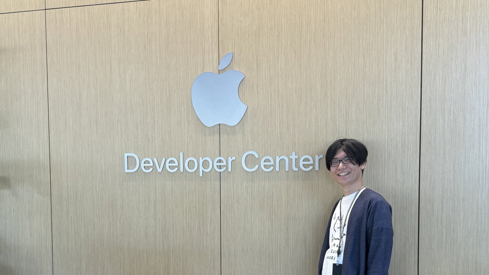
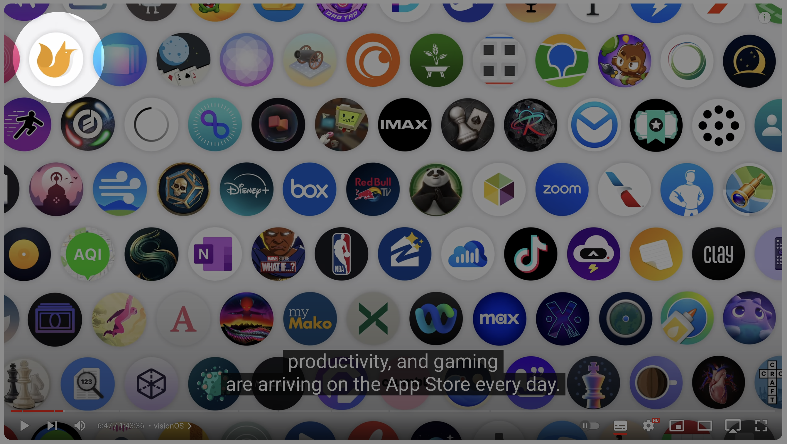
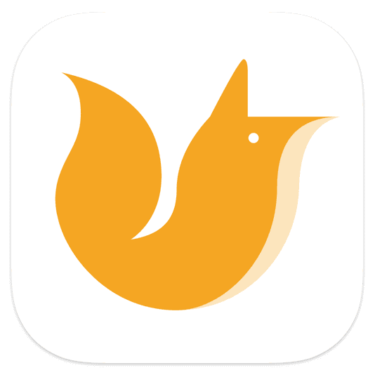
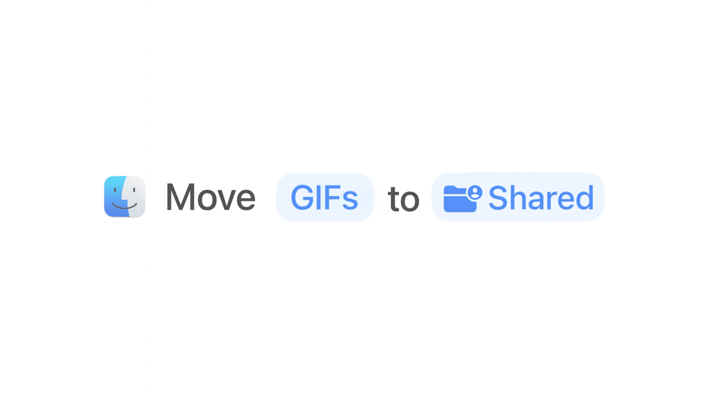
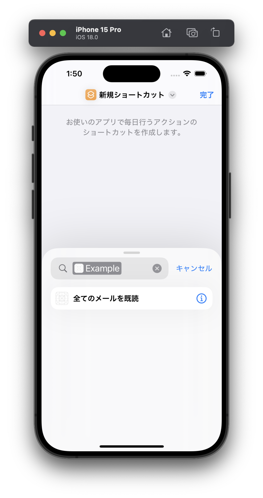

slidenumbers: true
slidecount: true
slide-transition: false
slide-dividers: #, ##, ###, ####

# App Intentで広がるアプリの活用

WWDC Recap 2024 (30min)
noppe

# 自己紹介

noppe

- 株式会社ディー・エヌ・エー
- 個人アプリ開発者
- キツネが好き


## WWDC24 行ってきました

- WWDC19 以来2回目
- DeNAはPococha事業部から２名参加



---

# 今年のWWDCは熱かった！！

---



---

#  DAWN for mastodon

- personal work
- 3rd party mastodon app
- 100% Swift Project
- iOS, iPadOS, macOS (Catalyst), visionOS
- Supports **App Intents**


# App Intent

- なぜ分かりにくいのか

## なぜ分かりにくいのか

1. SiriKitの存在
2. フレームワーク同士の連携を一緒くたに語られることがある
3. 魔法のような体験だから

# Agenda

- App Intentと周辺機能の立ち位置を再確認
- WWDC24で何が変わったのか
- App Intentを意識したアプリ開発
- まとめ

^ 今日は、AppIntentが何だか分からない、ふわっとしか分からない人に向けても分かる内容にしている
^ コピペで済ませてた人も。

## App Intentの基本

- 何か
- 何が嬉しいのか
- 何ができるのか

^ 一回アーキテクチャを見返してみましょう

## 何か

- アプリが出来ること、扱うデータについて表明すること



## 何か

- 例えば…
  - このアプリは、𝕏にポスト出来ます
  - このアプリは、コーヒの淹れ方を表示できます
  - このアプリは、メールを検索ができる
  - ...etc

^ AIで使うので全て表明するべき

## 表明をするには

- タイトル
- ロジック　

```swift
import AppIntent

struct MarkAsReadIntent: AppIntent {
    static let title = LocalizedStringResource("全てのメールを既読")
    
    func perform() async throws -> some IntentResult {
        // process
        .result()
    }
}
```

## 何が嬉しいのか

- システムが検出して勝手に統合してくれる
  - 表明している機能に応じて、適切な場所から実行できるようにする



^ isDiscoverableで見つからないようにもできる

## 適切な場所から実行出来るメリット

- ユーザーはアプリを行き交うことなく、滑らかな体験ができる

## App Intentの応用

- 特定の機能向けにApp Intentをラップすることができる

### AppShortcuts

- ショートカットを10件まで持てる

```swift
struct BookAppShortcuts: AppShortcutsProvider {
    static var appShortcuts: [AppShortcut] {
        AppShortcut(
            intent: OpenBookIntent(),
            phrases: [
                "\(.applicationName)を開いて"
            ],
            shortTitle: "Open Example App",
            systemImageName: "book"
        )
    }
}
```

### Widgets

- WidgetKitの中でApp Intentを呼び出すことで…
  - ウィジェットをタップした時のアクションとして使う
  - コントロールウィジェット
  - ライブアクティビティ

## 基本のまとめ

||||
|---|---|---|
|App Intent| Shortcuts | ワークフロー |
|App Intent + AppShortcutsProvider| Siri | ボイスコマンド |
|App Intent + WidgetKit| Widget | システムに統合されたUIによる実行 |
|App Intent + AssistantIntent| AI | 自然言語によるadhocワークフロー |

# WWDC24で何が変わったのか

## Apple Intelligenceの登場

- Apple IntelligenceがApp Intentを使うようになる
  - まだ使えないので色々想像は含むけど…
- Apple Intelligence = Siriではない
- ImagePlayground, Writing toolなどの


## App Intent domains

重複したらどうするの？

## Schema

- 自然言語をSiriに話す
- SiriがAIモデルに移譲する
- モデルがスキーマを構築
- スキーマのApp Intentを実行していく

- 要するに、自然言語からその場かぎりのワークフローを構築するってことで良さそう

## AppIntent protocols

- 元々あったやつ、全部App Intentでいいはずだけどなんで細分化されてるの？
  - https://developer.apple.com/documentation/appintents/app-intents

## Shape

- 入力と出力、必須パラメータなどの形式

## AssistantIntent


## Widgetの追加

- Control Widget
  - Control Center
  - Lock Screen

## Intentの追加

- CameraCaptureIntent
- OpenURLIntent
- URLRepresentableIntent
- SetValueIntent

- ControlConfigurationIntent

## AppEntityをSpotlightに出せるようになった

- IndexedEntity
  - CSSearchableItemとして昔からあったけど、AppEntityと統合されて便利になった
  - AIが自然言語でいい感じに検索してくれる

## AppEntityがTransferableをサポート

Intnent - Intentの話

## AppIntent, Entity, EnumがURLRepresentationをサポート

Intent -> Appの話

## パラメータ名を書かなくてよくなった

---

App Intentの目的
- アプリの起動動線を柔軟にする
  - 普通はアイコンをタップして起動する
    - でも、AppLibraryの登場でホーム画面にすら置いてもらえないこともあります
  - Siriで起動する
  - https://developer.apple.com/wwdc24/10210
  - Spotlight
  - Widget
  - Control Center
  - Shortcut
  - Apple Pencil Squize?
  - Action Button
  - ...etc
  - これらのベースにあるものがApp Intent。対応すれば全てに対応できる
  
- 起動を柔軟にできるということは、最初にどのタブを表示するかなども拡張できる

- アプリを起動するのではなく、機能を呼び出すのにも使える

https://developer.apple.com/jp/news/?id=jdqxdx0y
https://developer.apple.com/documentation/AppIntents

iOS 16で登場

アプリのコンテンツとアクションを外部公開するための機能

外部公開すると嬉しいところは？

- 適切な場所でアプリを使ってもらえる
  - アプリをわざわざ開くことが正しいUXではないケースもある
  - 例えば、ロック画面の懐中電灯をわざわざアプリを開くとすると…？
- ユーザーが処理を連携できる
- AppIntentsとして切り出すコツ

- アクセシビリティ関係ある？
- App Intents Package

アシスタントスキーマ

# 休憩


# まとめ

- iOS18が来る前から準備できる


