slidenumbers: true
slidecount: true
slide-transition: false
slide-dividers: #, ##, ###
autoscale: true
theme: Inter 2.0, 2
background-color: #F6F5F7
header: text-scale(0.6)

# 今から理解するApp Intentエコシステム

WWDC Recap (30min)
noppe

^ よろしくお願いします。

# noppe

株式会社ディー・エヌ・エー
ライブコミュニティ事業本部

- Pococha

個人アプリ開発者

- vear
- DAWN for mastodon


# WWDC24 行ってきました！


---

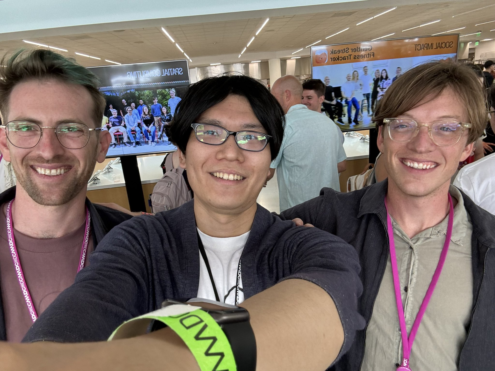

---

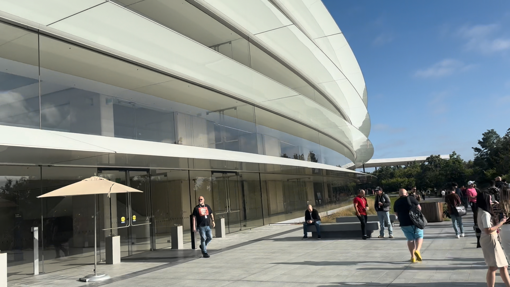

---

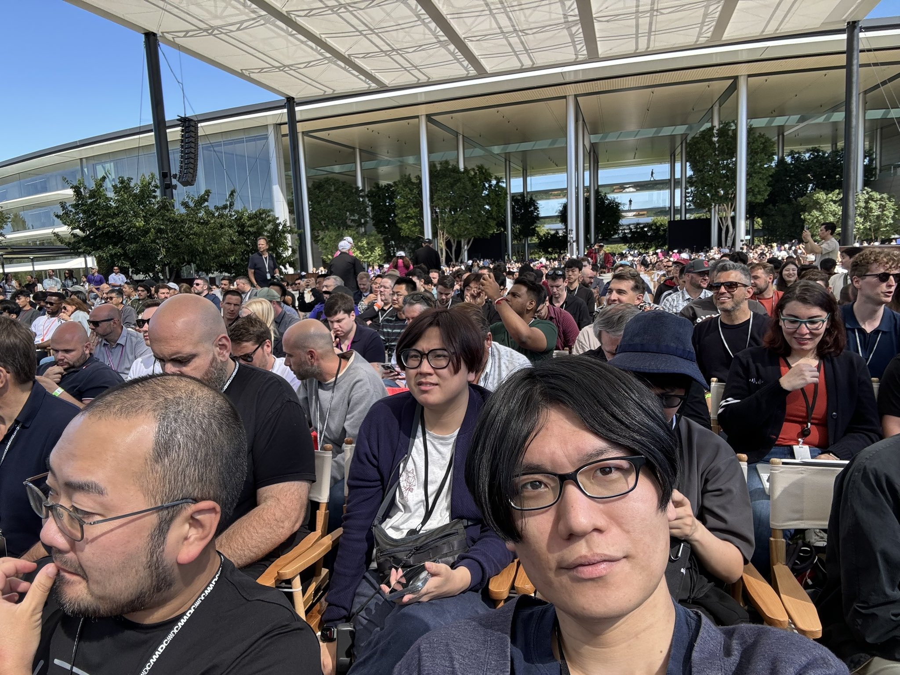

---

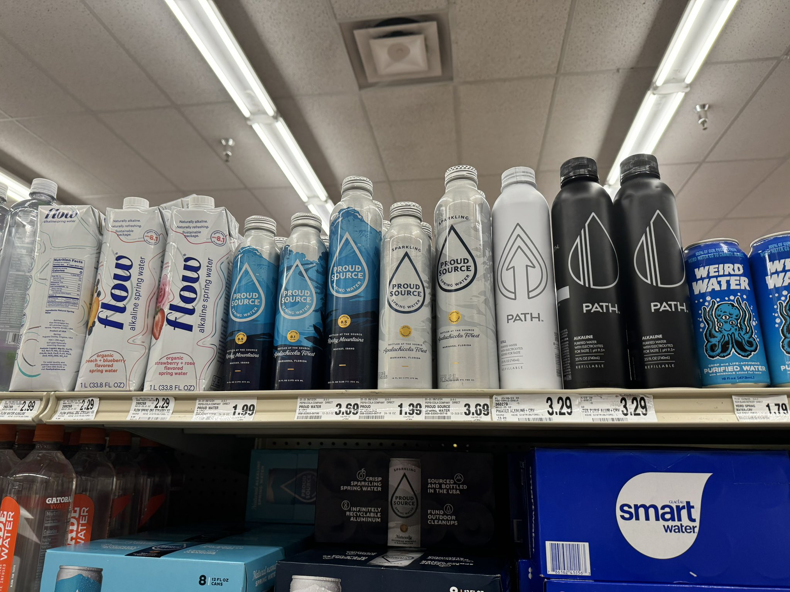

---

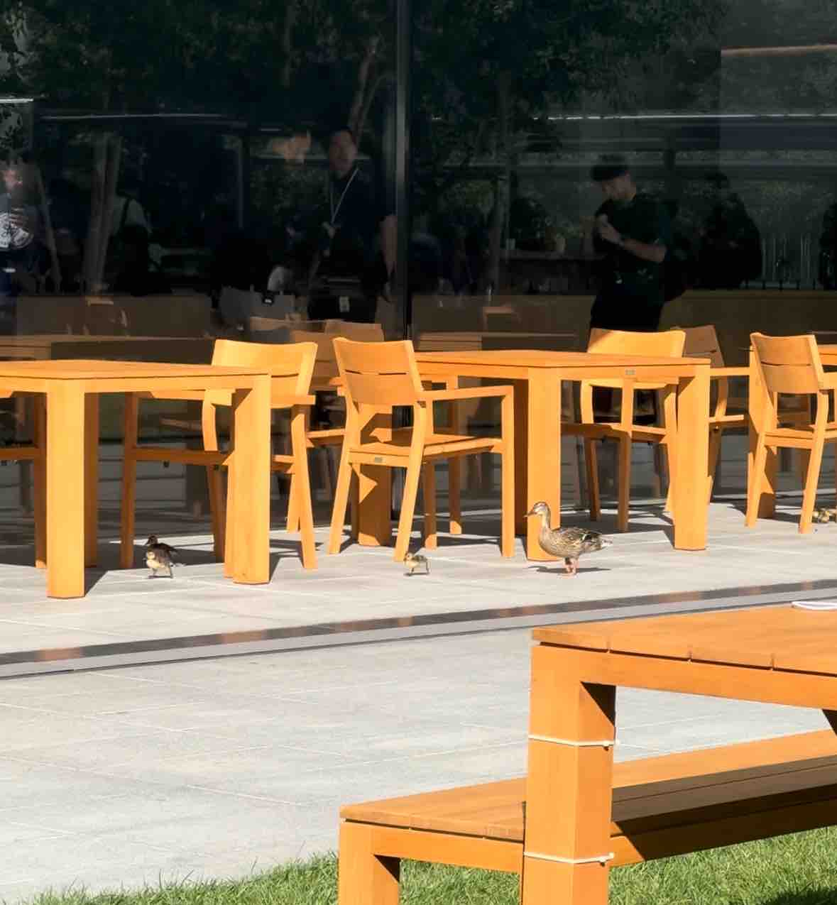

---


^ Keynoteで自分のアプリが映り込んだりしました。
^ これはvisionOSのロンチアプリ

# Agenda

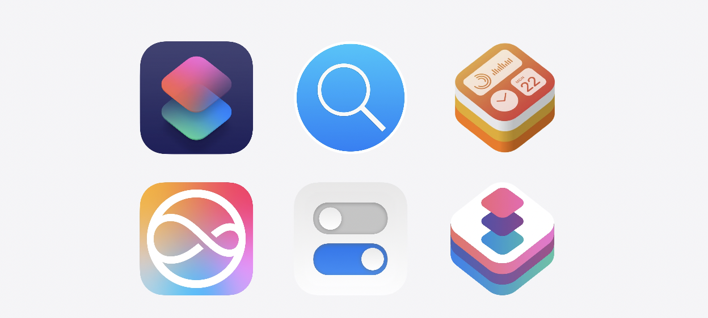

^ 今日はRecapイベントではありますが、30分と長めの時間をいただけたのでAppIntentを０からでも理解できる内容でいこうと思います。
^ App Intentのエコシステムは、便利である一方で他のフレームワークに比べてやや複雑で分かりにくいと思います。
^ その要因としては、iOS10から始まったSiriKitの歴史的な経緯や、App Intentが万能的に解説されがちであるという点、また、これまではあまり重要視されてこなかったという点にあると思います。
^ どうやったら、Appleと違う方法でApp Intentを解説できるか考えてみた。

# Agenda

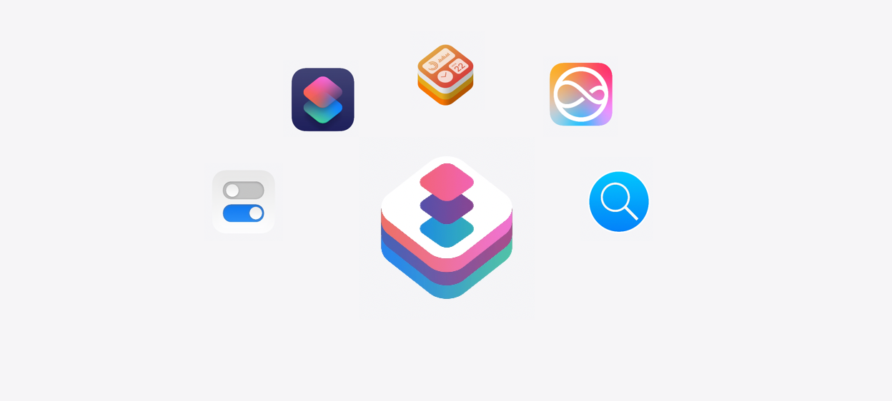

^ そこで今日は、これからのAppleプラットフォームにおける重要な要素であるApp Intentのエコシステムを、最小の単位から順に登場人物を徐々に増やして解説していきます。
^ このトークの後には、皆さんはApp Intentのエコシステムが頭の中で整理された状態になると思います。

# Agenda

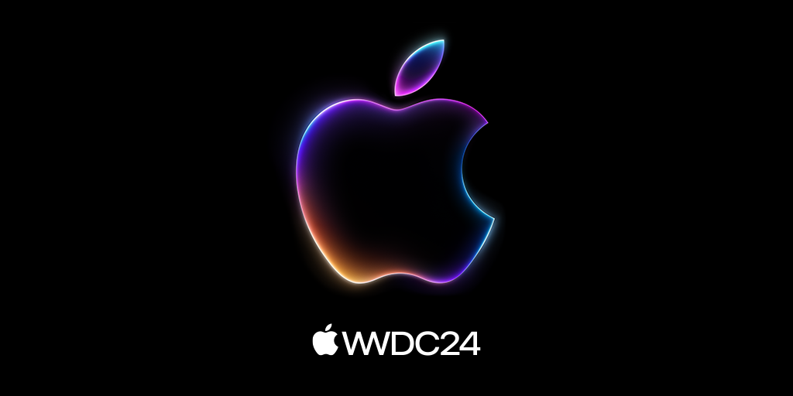

^ もちろん、解説しながら今年のアップデートも紹介していきます。

# App

アプリには、いくつものアクションがある

- ファイルを移動する
- 画像を回転する
- コーヒーを注文する

これは人間は理解できるが、システムからは分からない。


^ さて、我々が作るアプリは…のように、いくつものアクションで構成されています。
^ これらは人間にとって使いやすいUIで実装されていて、システムは画面を見ても理解することができません。

# AppIntent


Appに組み込まれたアクションを、外部に公開したもの

ただし、基本的には単体で何かが出来るわけではない

^ 今回のテーマのAppIntentは、そういったアクションたちをシステムに公開するもの。と捉えておくのが良いかと思います。
^ ただし、あくまで公開するだけです。
^ 基本的には、これ単体で何かができるわけではありません。
^ システムから実行するには、なんらか実行可能な状態にする必要がある

---


^ インテントは「アプリ」が「何」を「どうする」といった文章になるようにデザインします。
^ そして、「どうする」の部分が重複したインテントを作らないようにしましょう。
^ この例では、「何」にあたるリマインダーが変数のようになっています。
^ この変数部分は、AppIntentだけでは表現できないので、新しい登場人物が現れます。

# AppEntity

Appに組み込まれた要素や概念を、外部に公開したもの

App Intentのパラメータを定義するのに必要

- アカウント
- リマインダーのタイプ
- 曲


^ ここで登場するのが、AppEntityです。
^ AppEntityもAppIntent同様にアプリ内部の実装を外部に公開するためのものになります。
^ AppIntentと異なるのは、これ自体にロジックは無くアカウントや曲などのオブジェクトを指している点になります。
^ さて、これでアプリのロジックと要素を外部に公開できましたが、どうやって実行すれば良いのでしょうか。

# ショートカット


^ ここで、早速３人目の登場人物が現れます。ショートカットです。

# ショートカット

- AppIntentをラップして実行可能にしてくれる
- ショートカット.appでショートカットを作ることができる


^ ショートカットは、AppIntentをラップしたものでこれはシステムから実行可能になります。
^ ショートカットアプリで、ショートカットを作ることができます。
^ この画面は、ショートカットの中に「全てのメールを既読」インテントを詰め込んでいる様子です。

# ここまでのエコシステムの振り返り

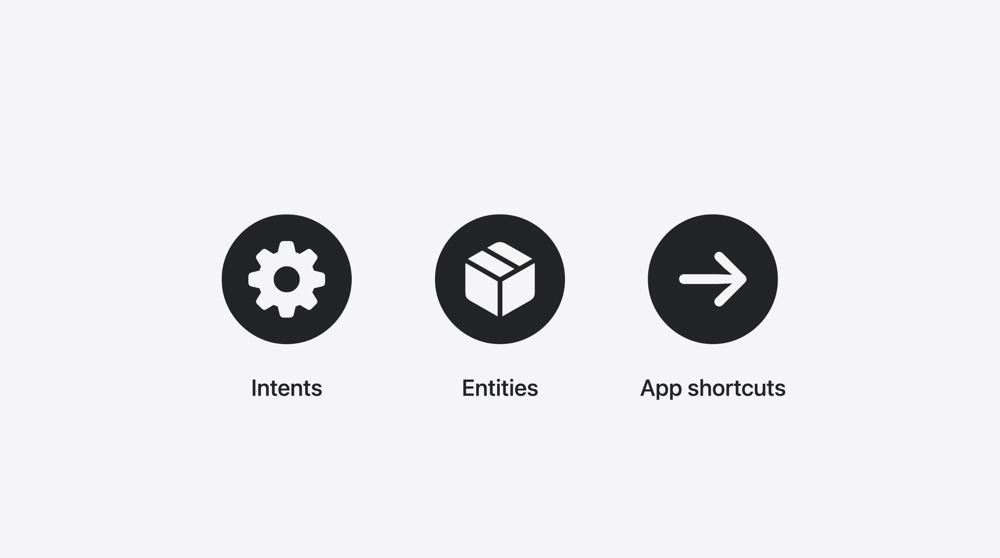

^ さて、ここまでのエコシステムを振り返ってみると非常にシンプルです。
^ アプリは、IntentとEntityを使って要素やアクションを公開することができます。
^ それらをショートカットの材料にしてもらい、システムからショートカットを実行してもらうことができます。

# AppIntentを作ってみる

```swift
import AppIntents

struct OpenAppIntent: AppIntent {
    static let title: LocalizedStringResource = "アプリを開く"
	
    func perform() async throws -> some IntentResult {
        // select tab
        .result()
    }

	static var openAppWhenRun: Bool = true

	@Parameter()
    var tabType: TabTypeAppEntity?
}
```

^ 先に進む前に、実際にApp Intentのコードを見てみましょう作ってみましょう。
^ このコードは指定したタブを選択してアプリを開くIntentです。
^ AppIntent protocolに準拠した構造体は、最低限titleとperformを持つ必要があります。
^ このタイトルが、ショートカットアプリからIntentを見た時のタイトルになります。
^ また今回は省略されていますが、performの中はIntentを実行したときの処理になります。
^ インテント実行時にアプリを開くにはopenAppWhenRunをtrueにします。
^ 最後に、今回はタブを指定できるようにするためにTabTypeEntityをパラメータとして持っています。

# AppIntentを作ってみる

```swift
struct TabTypeAppEntity: AppEntity {
    static var typeDisplayRepresentation = .init(name: "タブの種類")
    static var defaultQuery = TabTypeAppEntityQuery()
    
    let id: String
    let title: String
    
    var displayRepresentation: DisplayRepresentation {
        DisplayRepresentation(title: "\(title)")
    }
}
```

^ TabTypeAppEntityは、システムからインテントのパラメータとして選ぶ必要があるので、AppEntityを使って公開している
^ AppEntityは最低限、表示名と選択肢、各要素の表示名を実装する必要があります。

---


^ これでショートカットからタブを選べるApp Intentを作ることができました。
^ ところで、このAppIntentが実行されたときに実際に画面を遷移するにはどうすればいいでしょうか？

---

## 画面遷移の実装

```swift
func perform() async throws -> some IntentResult {
	Router.shared.navigate(.home)
    .result()
}
```

```swift
var body: some View {
	TabView { ... }
		.onReceived(router) { value in
			selection = value
		}
}
```

^ いくつか方法があるのですが、これまでは、この実装のようにperformの中で直接画面遷移を行なっていました。


## 画面遷移の実装 (iOS18)

- 🆕 URLRepresentableEntity
- 🆕 URLRepresentableEnum
- 🆕 URLRepresentableIntent

```swift
extension TabTypeAppEntity: URLRepresentableEntity {
    static var urlRepresentation: URLRepresentation {
        "https://example.com/tabs/\(.id)"
    }
}
```

既存のUniversal Linkの実装を使いまわせる

^ iOS18では、URLRepresentableIntentが登場しました。
^ 試せていないのですが、これを使うとApp IntentをURLとして実行することができるようです。
^ つまり、Universal Linkを実装しているアプリはその実装を使い回すことができます。

# ショートカット

- App Intent同士を組み合わせることができる

- AppEntityを違うアプリ同士でやり取りをする必要が出てくる

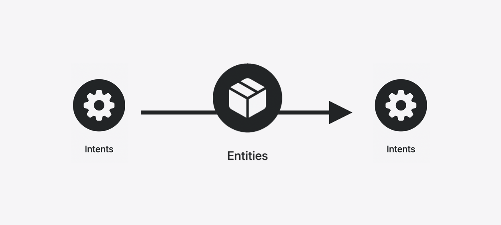

^ さて、ショートカットに話を戻しましょう。
^ 先ほどは１つのインテントをラップしてショートカットを作りました。
^ しかしショートカットは、複数のインテントを含めることができます。
^ つまり、インテントは次のインテントに値を渡したり、前のインテントから値を受け取ることができます。
^ そのため、自分のApp Intentに他の見知らぬアプリのApp Entityが渡されることがあります。
^ これまではAppEntityに含まれるStringやIntなどのシンプルな表現に対応していましたが、iOS18ではある仕組みによって互換性が向上しています。

# 🆕　Transferable AppEntity

- App Entityにエクスポート可能なタイプを指定できるようになった

[^]:https://developer.apple.com/documentation/coretransferable/transferable

^ それが、AppEntityのTransferableサポートです。
^ Transferableに適合することで、Entityを特定のファイル形式として扱ってもらうことができます。

# 🆕　Transferable AppEntity

```swift
extension GreetingAppEntity: Transferable {
    static var transferRepresentation: some TransferRepresentation {
        DataRepresentation(
			exportedContentType: .png,
			exporting: { entity in
            	entity.pngData()
        	}
		)
    }
}
```

^ Transferableは何かというと、iOS16から登場したCodableのファイル版みたいなものです。
^ 画像ファイルからモデルを作ったり、モデルから画像ファイルにしたりといったことができます。
^ このコードは、挨拶の文字列を持っているAppEntityなのですが、Transferableに適合することで、PNGの画像ファイルとして次のインテントに値を渡すことができるようになっています。

---

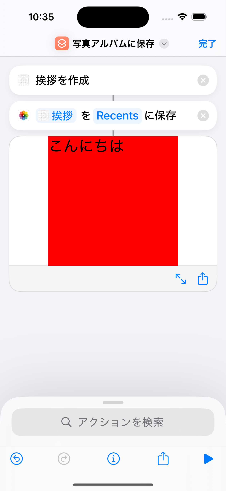

^ これによって、AppEntityを画像として解釈してもらうことが可能になりました。
^ このような連携の強化によって、自分のアプリのインテントと写真アプリのインテントを連結することができました。
^ もちろん実装次第では、音楽や動画、pdfなどの文書ファイルとして渡すこともできます。

---

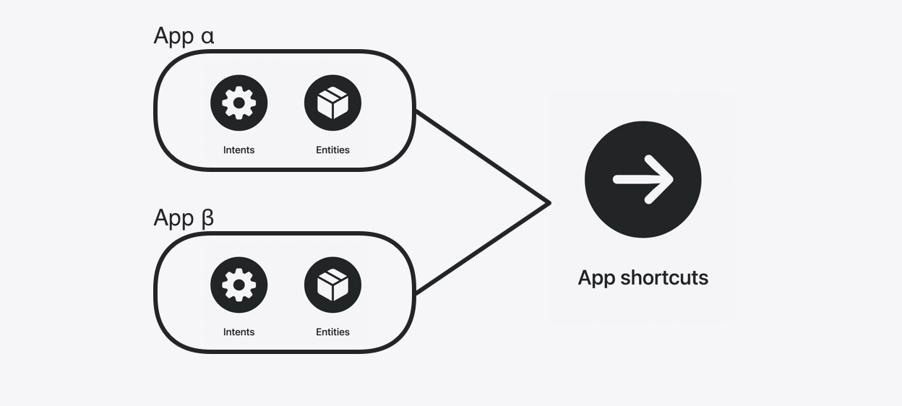

^ このように異なるアプリのAppIntentを組み合わせてショートカットを作ることによって、強力な連携ができるようになりました。
^ ここで、ショートカットを中心としたエコシステムの広がりについて解説します。

# ショートカットを中心としたエコシステム

作成したショートカットは、ショートカットアプリで活用できる

- ショートカットアプリ
- オートメーション
- ショートカットアプリ ウィジェット
- ...

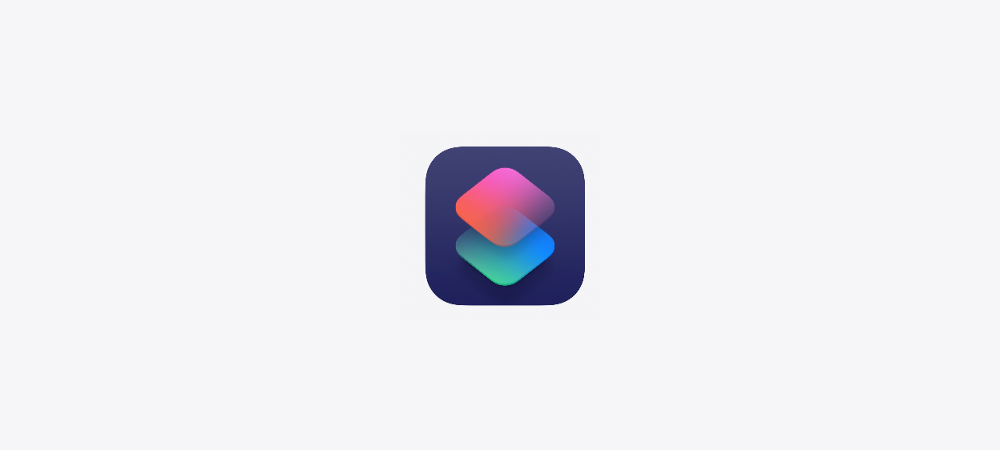

^ 先ほどショートカットは、ショートカットアプリで作成すると紹介しました。
^ ショートカットアプリでは、直接ショートカットを実行する以外にもオートメーション化したりショートカットアプリのウィジェットからショートカットを実行したりと
^ ショートカットアプリにはショートカットを活用する機能がたくさんあります。

# ショートカットを中心としたエコシステム

作成したショートカットは、ショートカットアプリ以外でも活用できる

- Action Button
- Apple Pencil Proのスクイーズ
- Assistive Touch
- Spotlight
- Siri
- ...

^ さらに、ショートカットはOSと密接に連携しており、多くの機能からショートカットを呼び出すことができます。

---

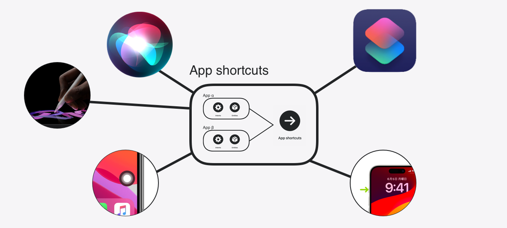

^ かなり登場人物が増えてきました。
^ ただ大事なのは、ほとんどの活用がショートカットを中心に広がっているということです。
^ なので、App Intentが色々できて一見複雑そうに見えるのは、ショートカットが色々なところから呼べてしまうから。というのが原因なのかなと思います。

# 特定の機能にApp Intentをラップして提供する

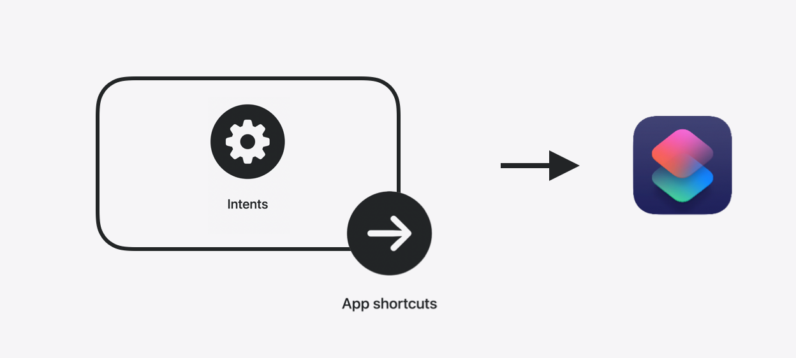

^ ここまでは、ショートカットを中心にエコシステムが広がりを見せていました。
^ 言い換えれば、これはインテントをショートカットでラップしてショートカットアプリで使えるようにしていたわけです。
^ 厳密にはショートカットは、インテントをラップしているだけではなく、Siriにどんなフレーズで呼び出せるようにするのか、だったり一覧するときのアイコンとかを与えています。
^ これは、持論ですが、AppIntentの利便性の本質は、特定の情報を付与することで、ショートカットなどの特定の機能に対してインテントを提供できる。というところにあります。

# App Intentを呼び出すためのフレーズを与える

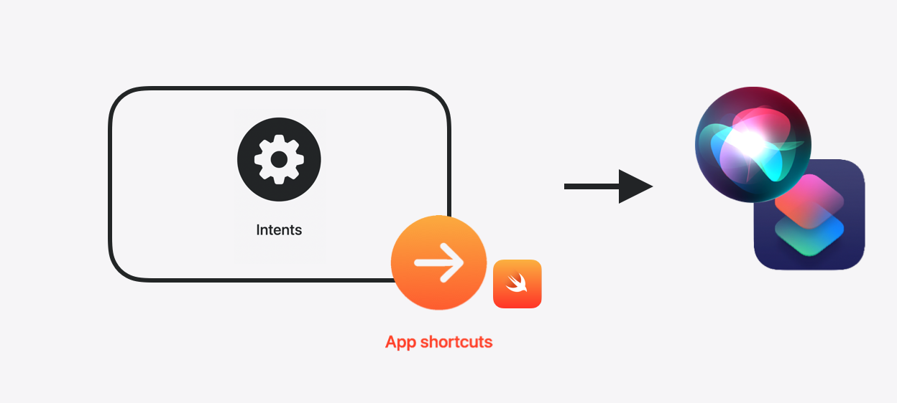

^ ちなみに、このショートカットの作成は、アプリ内のインテントだけであれば`AppShortcutsProvider`を使うことでSwiftで記述することもできます。

---

```swift
struct OpenBookShortcuts: AppShortcutsProvider {
    static var appShortcuts: [AppShortcut] {
        AppShortcut(
            intent: PerformIntent(),
            phrases: [
                "\(.applicationName)を開いて"
            ],
            shortTitle: "Open Example App",
            systemImageName: "apple.logo"
        )
    }
}
```

^ このAppShortcutsProviderでも、インテントに対してフレーズとタイトル、ロゴを与えてAppShortcutとしてラップしショートカットとして提供しています。


# App Intentを呼び出すためのUIを与える

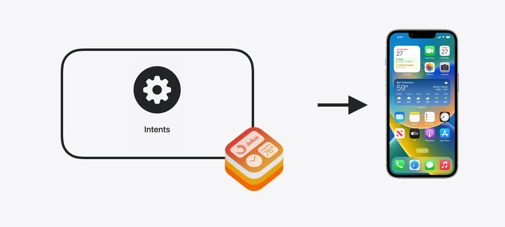

^ このようにインテントをラップして特定機能に提供する仕組みは他にもあります。
^ WidgetKitを使うと、App Intentを呼び出すためのウィジェットUIを自分で与えることができます。
^ これによって、ショートカットを介さずにユーザーにApp Intentを実行する場所を提供できます。

## 🆕 Control Widget

- コントロールセンター
- ロック画面

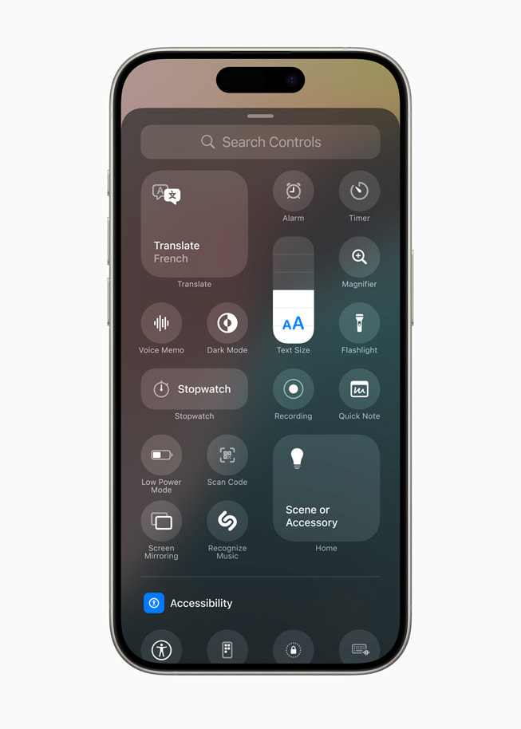

^ 今年は、ウィジェットが表示できる場所も増えました。
^ コントロールセンターやロック画面にシンプルなウィジェットを配置できるようになりました。

# App Intentを呼び出すためのスキーマを与える

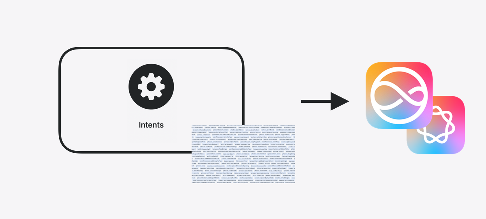

^ そして、Apple Intelligenceに対してもAppIntentを提供することができます。
^ このケースでは、開発者はApp Intentにスキーマと呼ばれる付加情報を与えます。
^ それをApple IntelligenceはIntentを実行するヒントにします。

# スキーマ


- 100種類の決められたアクションのこと

- 要するに、あまりにトリッキーな命令は出来ないのではないかと思う

例：昨日飲んだ水の量と同じ水を花にあげておいて

^ このスキーマというのは、メールを送るとか、写真を保存するという、あらかじめ決められたアクションのことです。
^ スキーマ自体は最初から種類が決まっていて、元々決まっているスキーマを組み合わせられるようにAIのモデルが学習されてます。
^ なので、現時点では「昨日飲んだ水の量と同じ量の水を花にあげておいて」みたいなトリッキーなことは仮にインテントがあってもできないと思われます。

# Apple Intelligence


^ Apple Intelligenceについても、解説しておきます。
^ Apple Intelligenceは、パーソナルな人工知能システムです。
^ 誤解を恐れずに言うなれば、Siriは直接的にはApple Intelligenceではありません。
^ Siriはあくまでユーザーと対話するインターフェースであり、ユーザーからリクエストをAIに伝え、AIからのレスポンスをユーザーに伝える事に使われます。
^ 特徴的なのは、AIはスキーマに紐づいたIntentを実行できるtoolboxという仕組みを持っている点です。
^ これがどのように動作するのか解説します。

## Apple Intelligence


^ 最初にSiriはApple Intelligenceにユーザーリクエストを投げます。
^ すると、Apple Intelligenceが文脈を理解してスキーマを選びます。
^ そして、このスキーマに対応するAppIntentの中から最適なものを選んで実行するということです。
^ これは自分の解釈ですが、Apple Intelligenceのこの動きは、要するにその場限りのショートカットをリアルタイムに構築していると理解していいんじゃないかなぁと思います。

# AssistantSchema 🆕

```swift
@AssistantIntent(schema: .system.search) // Add
struct ExampleSearchIntent: ShowInAppSearchResultsIntent {
    static var searchScopes: [StringSearchScope] = [.general]
    
    @Parameter()
    var criteria: StringSearchCriteria
    
    func perform() async throws -> some IntentResult {
        let searchString = criteria.term
        print("Searching for \(searchString)")
        // ...
        return .result()
    }
}
```

^ App Intentをスキーマと関連付けるには、AssistantIntentマクロを使います。
^ 仕組みとしては非常に簡単で、既にあるインテントにマクロを付けるだけで関連づけることができます。
^ ただ、AssistantIntentは持っているパラメータや返す型について制約があるのでそれに合致するインテントである必要があります。
^ Xcode16 beta2では合致しないときのエラーがまだ分かりにくいので、適合させるには少し慣れが必要です。

---

# まとめ

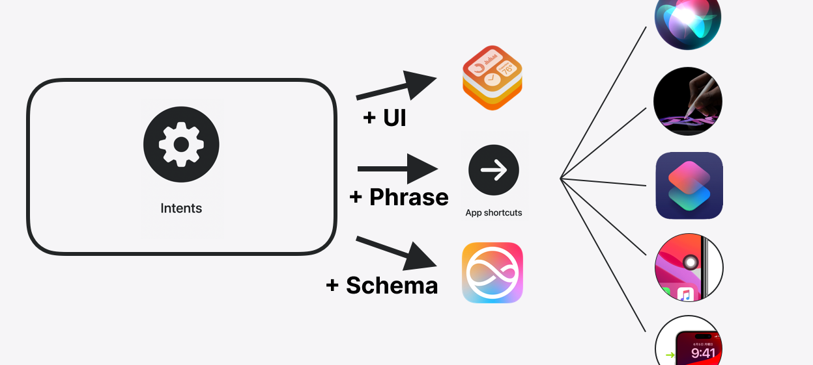

^ さて、最後にエコシステムを振り返りましょう。
^ まずAppIntentは、アプリのアクションを外部に公開したものでした。
^ これらをラップしたショートカットによって、インテントの活用範囲は非常に広がりました。
^ 一方で、Apple Intelligenceやウィジェットなど、直接インテントを活用するものに対しては、追加の実装が必要でした。それをどのようにデベロッパーが対応すれば良いかもわかりました。
^ これでApp Intentについて少しでも分かりやすくなったら嬉しいです。

---

以下時間あれば

- IndexedEntity
- これからのアプリ開発

---

# IndexedEntity 🆕

```swift
try await CSSearchableIndex.default()
    .indeAppEntities(entities)
```

```swift
extension FoodEntity: IndexedEntity {
    var attributeSet: CSSearchableItemAttributeSet {
        let attributes = CSSearchableItemAttributeSet()
        attributes.city = "Tokyo"
        attributes.keywords = ["Onion"]
        return attributes
    }
}
```

^ そして、最後にAppEntityが直接Spotlightで検索可能になりました。
^ 対応させるにはIndexedEntityに適合させて、CoreSpotlightフレームワークで登録する必要があります。
^ この検索機能自体は元々あったものですが、AppEntityに対応したことでAppIntentに対応する中で自然にSpotlightにも対応できるようになりました。

# 考察