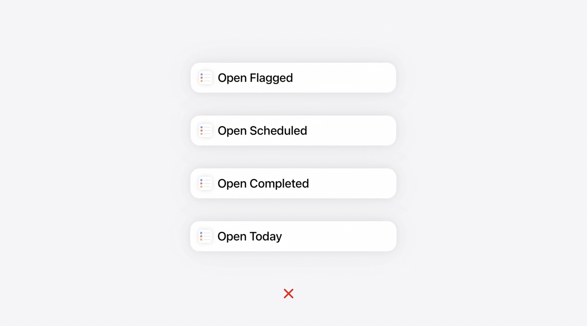
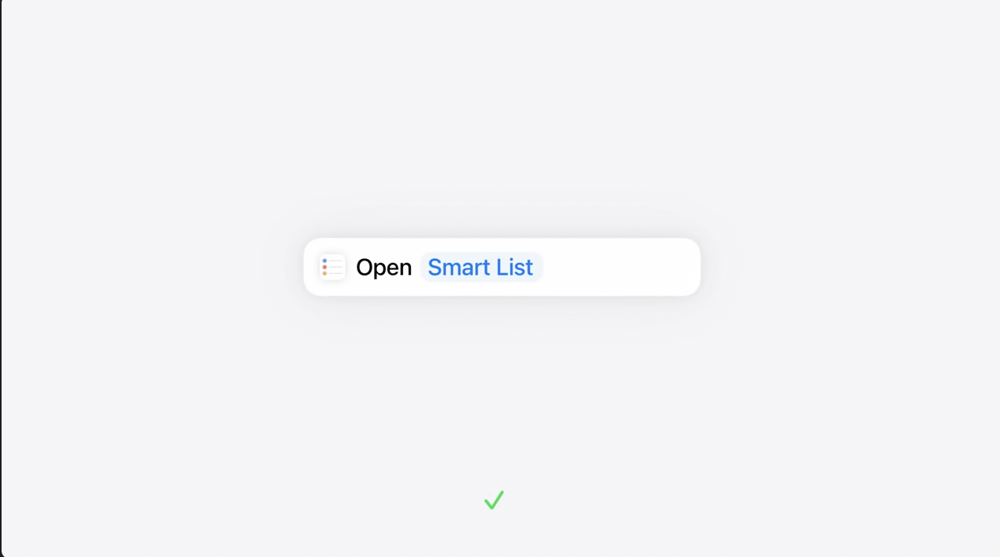

slidenumbers: true
slidecount: true
slide-transition: false
slide-dividers: #, ##, ###
autoscale: true

# WWDC Recap
App Intent

# 自己紹介

株式会社ディー・エヌ・エー
ライブコミュニケーション事業部
noppe

# Agenda

// ごちゃごちゃの図

^ 今日はRecapイベントではありますが、30分と長めの時間をいただけたのでAppIntentを０からでも理解できる内容でいこうと思います。
^ App Intentのエコシステムは、便利である一方で他のフレームワークに比べてやや複雑で分かりにくいと思います。
^ その要因としては、iOS10から始まったSiriKitの歴史的な経緯や、App Intentが万能的に解説されがちであるという点、また、これまではあまり重要視されてこなかったという点にあると思います。

# Agenda

// 小粒になるの図

^ そこで今日は、これからのAppleプラットフォームにおける重要な要素であるApp Intentのエコシステムを、最小の単位から順に登場人物を徐々に増やして解説していきます。
^ このトークの後には、皆さんはApp Intentのエコシステムが頭の中で整理された状態になると思います。

# Agenda

// NEWの図

^ もちろん、解説しながら今年のアップデートも紹介していきます。

# App Intent

// App Intentのアイコン

^ では、最初にApp Intentとは何かを端的に説明します。

# App Intent

Appに組み込まれたアクションを、外部に公開したもの

- ファイルを移動する
- 画像を回転する
- コーヒーを注文する

ただし、これ単体で何かが出来るわけではない

^ App Intentは、Appに組み込まれたアクションを指します。
^ 例えば、ファイルを移動したり、コーヒーを注文することをApp Intentとして公開することができます。
^ ただし、これ単体では公開しているだけで、何もすることはできません。

# ショートカット

// ショートカットのアイコン

^ ここで、早速２人目の登場人物が現れます。ショートカットです。

# ショートカット

- App Intentを実行するショートカットを作れる
  - アプリの外からアプリの機能を呼び出せるということ

^ ショートカットアプリは、アプリから取り出したApp Intentを実行するショートカットを作ることができます。
^ つまり、ショートカット経由でアプリの外からアプリの機能を呼び出せるということです。

# ショートカット

// ?の画像

- 特定のタブを開くショートカットを作るには

^ さて、ここで「アプリを開く時に、特定のタブを開く」ショートカットを作るとしましょう。

# ショーカット

[^]: https://developer.apple.com/wwdc24/10176?time=173

^ このように、タブごとにApp Intentを作るのは今年のWWDCの「システムの利便性を高めるApp Intentのデザイン」によると、よくない(補足入れる)

# ショートカット

# App Entity
	パラメータとして定義するのに必要

# App Entity for App 🆕
	URLRepresentableでUniversal Linkとして扱える

# Shortcuts
	App Intent同士を組み合わせることができる
	違うアプリ同士でやり取りをする必要が出てくる

# App Entity + transferable 🆕
	App Intent間を一般的なファイル形式でやり取りできる

# FileEntity
	ファイルを直接AppEntityにできる

# App Intentと連携する周辺機能
	Shortcuts

# Shortcutsが自動的に提供する機能
	Shortcutの作成
	Shortcuts Widget
	Action Button
	Apple Pencil Proのスクイーズ

# App Intentと連携する周辺機能
	各機能向けにラップすることができる
	Siri
	Widget

# Siri
	AppShortcutsProvider

# Widget
	WidgetConfiguration

# 新しいWidget
	Control Widget

# ここにもう一つ追加された
	Apple Intelligence + Siri

# Apple Intelligenceについて
	ユーザー目線では魔法のような動きをする

# Apple Intelligenceについて
	Siri ≠ AppleIntelではない
	Apple Intelに統合されたSiriはおそらくほとんど何もしない
	Apple Intelにユーザーリクエストを投げて、スキーマ群をビルドしてもらうだけ

# Apple Intelligenceは魔法ではない
	1000種類の決められたアクションから選択される
	App Intentが1000種類のうちどれに当たるのかを教えてあげる必要がある

# AssistantSchema 🆕
	
# App Entity for AI 🆕
	パラメータはどうやって指定するの？
	IndexedEntityに対応することでいい感じに探してくれる
	「昨日撮った娘の写真」とか

# IndexedEntity 🆕

# 考察
	何か
	
# まとめ
	App Intentを中心としたエコシステムについての振り返り
　	
	