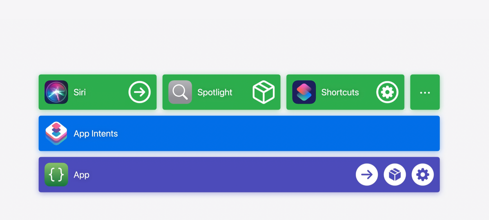

slidenumbers: true
slidecount: true
slide-transition: false
slide-dividers: #, ##, ###
autoscale: true
theme: Inter 2.0, 2
background-color: #F6F5F7
header: text-scale(0.6)

# 今から理解するApp Intentエコシステム

WWDC Recap (30min)
noppe

# noppe

株式会社ディー・エヌ・エー
ライブコミュニティ事業本部

個人アプリ開発者


# WWDC24 行ってきました！


---


# Agenda


^ 今日はRecapイベントではありますが、30分と長めの時間をいただけたのでAppIntentを０からでも理解できる内容でいこうと思います。
^ App Intentのエコシステムは、便利である一方で他のフレームワークに比べてやや複雑で分かりにくいと思います。
^ その要因としては、iOS10から始まったSiriKitの歴史的な経緯や、App Intentが万能的に解説されがちであるという点、また、これまではあまり重要視されてこなかったという点にあると思います。
^ どうやったら、Appleと違う方法でApp Intentを解説できるか考えてみた。

# Agenda


^ そこで今日は、これからのAppleプラットフォームにおける重要な要素であるApp Intentのエコシステムを、最小の単位から順に登場人物を徐々に増やして解説していきます。
^ このトークの後には、皆さんはApp Intentのエコシステムが頭の中で整理された状態になると思います。

# Agenda


^ もちろん、解説しながら今年のアップデートも紹介していきます。

# App

アプリには、いくつものアクションがある

- ファイルを移動する
- 画像を回転する
- コーヒーを注文する

これは人間は理解できるが、システムからは分からない。


^ さて、我々が作るアプリは…のように、いくつものアクションで構成されています。
^ これらは人間にとって使いやすいインターフェースで実装されていて、システムは理解することができません。

# AppIntent


Appに組み込まれたアクションを、外部に公開したもの

ただし、基本的には単体で何かが出来るわけではない

^ 今回のテーマのAppIntentは、そういったアクションたちをシステムに公開するもの。と捉えておくのが良いかと思います。
^ ただし、あくまで公開するだけです。
^ 基本的には、これ単体で何かができるわけではありません。

# ショートカット


^ ここで、早速２人目の登場人物が現れます。ショートカットです。

# ショートカット

- AppIntentをラップして実行可能にしてくれる
- ショートカット.appで作ることができる


^ ショートカットは、AppIntentをラップしたものでこれはシステムから実行可能になります。
^ 画面のスクショはショートカットアプリですが、このアプリが、ショートカットを作ることができます。

# 特定のタブを開くショートカットを作る

^ さて、ここで「特定のタブを開いた状態でアプリを起動する」ショートカットを作るとしましょう。

# 特定のタブを開くショートカットを作る


|||
|---|---|
|システムの利便性を高める App Intent のデザイン|WWDC24|

[^]: https://developer.apple.com/wwdc24/10176?time=173

^ アプリにはいくつものタブがあるので、タブごとにインテントを作ってみました。
^ しかし、これは良くないデザインです。

# 特定のタブを開くショートカットを作る


^ 代わりに、このようなフレキシブルなインテントにするのが良いと言えます。
^ ところで、このSmart Listと書かれた部分のように選択肢を提示するにはどうすれば良いのでしょうか？

# AppEntity

Appに組み込まれた要素や概念を、外部に公開したもの

App Intentのパラメータを定義するのに必要

- アカウント
- タブのタイプ
- 曲


^ ここで登場するのが、AppEntityです。
^ AppEntityもAppIntent同様にアプリ内部の実装を外部に公開するためのものになります。
^ AppIntentと異なるのは、これ自体にロジックは無くアカウントや曲などのオブジェクトを指している点になります。

# ここまでのエコシステムの振り返り


^ さて、ここまでのエコシステムを振り返ってみると非常にシンプルです。
^ アプリは、IntentとEntityを使って要素やロジックを公開することで、ショートカットの材料にしてもらい、システムからロジックを実行してもらうことができます。

# AppIntentを作ってみる

```swift
import AppIntents

struct OpenAppIntent: AppIntent {
    static let title: LocalizedStringResource = "アプリを開く"
	
    func perform() async throws -> some IntentResult {
        // select tab
        .result()
    }

	static var openAppWhenRun: Bool = true

	@Parameter()
    var tabType: TabTypeAppEntity?
}
```

^ 先に進む前に、App Intentを作ってみましょう。
^ 指定したタブを選択してアプリを開くIntentです。
^ AppIntent protocolに準拠した構造体は、titleとperformを最低限持つ必要があります。
^ このタイトルが、ショートカットアプリからIntentを見た時のタイトルになります。
^ また今回は省略されていますが、performの中はIntentを実行したときの処理になります。
^ インテント実行時にアプリを開くにはopenAppWhenRunをtrueにします。
^ 最後に、今回はタブを指定できるようにするためにTabTypeEntityをパラメータとして持っています。

# AppIntentを作ってみる

```swift
struct TabTypeAppEntity: AppEntity {
    static var typeDisplayRepresentation = .init(name: "タブの種類")
    static var defaultQuery = TabTypeAppEntityQuery()
    
    let id: String
    let title: String
    
    var displayRepresentation: DisplayRepresentation {
        DisplayRepresentation(title: "\(title)")
    }
}
```

^ TabTypeAppEntityは、パラメータなのでAppEntityに準拠しています。
^ ここでは最低限、AppEntityの表示名と選択肢、各要素の表示名を実装する必要があります。

---


^ これでショートカットからタブを選べるApp Intentを作ることができました。
^ ところで、このAppIntentが実行されたときに実際に画面を遷移するにはどうすればいいでしょうか？

---

## 画面遷移の実装

```swift
func perform() async throws -> some IntentResult {
	Router.shared.navigate(.home)
    .result()
}
```

```swift
var body: some View {
	TabView { ... }
		.onReceived(router) { value in
			selection = value
		}
}
```

^ // TODO onContinueUserActivityかも
^ これまでは、この実装のようにperformの中で直接画面遷移を行なっていました。

## 画面遷移の実装 (iOS18)

- 🆕 URLRepresentableEntity
- 🆕 URLRepresentableEnum
- 🆕 URLRepresentableIntent

```swift
extension TabTypeAppEntity: URLRepresentableEntity {
    static var urlRepresentation: URLRepresentation {
        "https://example.com/tabs/\(.id)"
    }
}
```

既存のUniversal Linkの実装を使いまわせる

^ iOS18では、URLRepresentableIntentが登場しました。
^ 試せていないのですが、これを使うとApp IntentをURLとして実行することができるようです。
^ つまり、Universal Linkを実装しているアプリはその実装を使い回すことができます。

# ショートカット

- App Intent同士を組み合わせることができる

- AppEntityを違うアプリ同士でやり取りをする必要が出てくる


^ さて、ショートカットに話を戻しましょう。
^ ショートカットには、複数のインテントを含めることができます。
^ 前後のインテントは値を渡したり、受け取ることができます。
^ そのため、自分のApp Intentに他の見知らぬアプリのApp Entityが渡されることがあります。
^ これまではAppEntityに含まれるStringやIntなどのシンプルな表現に対応していましたが、iOS18ではある仕組みによって互換性が向上しています。

# 🆕　Transferable AppEntity

- App Entityにエクスポート可能なタイプを指定できるようになった

[^]:https://developer.apple.com/documentation/coretransferable/transferable

^ それが、AppEntityのTransferableサポートです。
^ Transferableに適合することで、Entityを特定のファイル形式として扱ってもらうことができます。

# 🆕　Transferable AppEntity

```swift
extension GreetingAppEntity: Transferable {
    static var transferRepresentation: some TransferRepresentation {
        DataRepresentation(
			exportedContentType: .png,
			exporting: { entity in
            	entity.pngData()
        	}
		)
    }
}
```

^ このように、GreetingAppEntityをTransferableに適合してアートワークやタイトルといった物を取り出してもらえるようにサポートすることもできます。

---


^ これによって、AppEntityを画像として解釈してもらうことが可能になりました。
^ このような連携の強化によって、自分のアプリのインテントと写真アプリのインテントを連結することができました。

---


^ 異なるアプリのAppIntentを組み合わせてショートカットを作ることによって、強力な連携ができるようになりました。
^ ここで、ショートカットを中心としたエコシステムの広がりについて解説します。

# ショートカットを中心としたエコシステム

作成したショートカットは、ショートカットアプリで活用できる

- ショートカットアプリ
- オートメーション
- ショートカットアプリ ウィジェット
- ...


^ 作成したショートカットは、ショートカットアプリの機能で、ショートカットのウィジェットなどでも利用できます。

# ショートカットを中心としたエコシステム

作成したショートカットは、ショートカットアプリ以外でも活用できる

- Siri
- Action Button
- Apple Pencil Proのスクイーズ
- Assistive Touch
- Spotlight
- ...

^ さらに、ショートカットはOSと密接に連携しており、多くの機能からショートカットを呼び出すことができます。

---


^ かなり登場人物が増えてきましたが、ショートカットを中心に活用範囲が広がっていると考えると、理解しやすいのではないでしょうか

# 特定の機能にApp Intentをラップして提供する


^ ここまでは、ショートカットを中心にエコシステムが広がりを見せていました。
^ 言い換えれば、これはインテントをラップしてショートカットアプリで使えるようにしていたわけです。
^ ここでは、インテントにSiriで呼び出せるようにするタイトルやアイコンが与えられています。

# 特定の機能にApp Intentをラップして提供する


^ このショートカットの作成は、アプリ内のインテントだけであれば`AppShortcutsProvider`を使うことでSwiftで記述することもできます。

# 特定の機能にApp Intentをラップして提供する


^ WidgetKitを使うと、App Intentを呼び出すためのウィジェットUIを自分で与えることができます。
^ これによって、ショートカットを介さずにユーザーにApp Intentを実行する場所を提供できます。

## 🆕 Control Widget

- コントロールセンター
- ロック画面


^ 今年は、ウィジェットが表示できる場所が増えました。

# 特定の機能にApp Intentをラップして提供する


^ そして、Apple Intelligenceに対してもAppIntentを最適化することができます。
^ このケースでは、開発者はApp Intentにスキーマと呼ばれる付加情報を与えてApple IntelligenceがApp Intentを実行するヒントを与えます。
^ スキーマについての説明の前に一度Apple Intelligenceについて説明します。

# Apple Intelligence


^ Apple Intelligenceは、パーソナルな人工知能システムです。
^ 誤解を恐れずに言うなれば、Siriは直接的にはApple Intelligenceではありません。
^ SiriはあくまでUIの１つであり、ユーザーからリクエストをAIに伝え、AIからのレスポンスをユーザーに伝える事に使われます。
^ 特徴的なのは、AIはIntentを直接実行できるtoolboxという仕組みを持っている点です。
^ これがどのように動作するのか解説します。

# Siriの仕組み


^ SiriはApple Intelligenceにユーザーリクエストを投げます。
^ すると、Apple Intelligenceが文脈を理解してスキーマを構築します。
^ そして、このスキーマに対応するAppIntentの中から最適なものを選んで実行するということです。
^ これは自分の解釈ですが、その場限りのショートカットをリアルタイムに構築していると理解していいんじゃないかなぁと思います。

# スキーマ


- 100種類の決められたアクションのこと

- 要するに、あまりにトリッキーな命令は出来ないのではないかと思う

例：昨日飲んだ水の量と同じ水を花にあげておいて

^ このスキーマというのは、メールを送るとか、写真を保存するという、あらかじめ決められたアクションです。
^ スキーマ自体は最初から種類が決まっていて、元々決まっているスキーマを組み合わせられるようにAIのモデルが学習されてます。
^ なので、「昨日飲んだ水の量と同じ水を花にあげておいて」みたいなトリッキーなことはできないと思われます。

# AssistantSchema 🆕

```swift
@AssistantIntent(schema: .system.search) // Add
struct ExampleSearchIntent: ShowInAppSearchResultsIntent {
    static var searchScopes: [StringSearchScope] = [.general]
    
    @Parameter()
    var criteria: StringSearchCriteria
    
    func perform() async throws -> some IntentResult {
        let searchString = criteria.term
        print("Searching for \(searchString)")
        // ...
        return .result()
    }
}
```

^ App IntentをApple Intelligenceに対応させるには、インテントがどのスキーマに合致するかを見つけて関連付けてあげます。
^ スキーマはAssistantSchemaマクロを使うことで、AppIntentに付与することができます。

# IndexedEntity 🆕

- Spotlightから柔軟に検索可能にする
- attributeSetで情報を付与できる
- 多分「昨日撮った娘の写真」とかをAIに見つけさせることが可能になる

^ そして、AppIntentにはパラメータとしてAppEntityがありましたがiOS18でIndexedEntityというタイプが増えました。
^ これにサポートすると、AppEntityがSpotlightから柔軟に検索可能になるのですが、おそらく「昨日撮った娘の写真をメールで送って」みたいな文脈を処理する時にも使われると思うので対応しておくと良いかと思います。

---

# まとめ



^ さて、エコシステムを振り返りましょう。
^ AppIntentは、アプリのアクションを外部に公開したものでした。
^ 同じように、AppEntityはアプリの要素を外部に公開したものです。
^ これらをラップしたショートカットによって、インテントの活用範囲は非常に広がりました。
^ 一方で、Apple IntelligenceやSpotlightなど、直接インテントやエンティティを活用するものに対して、どのようにデベロッパーが対応すれば良いかもわかりました。
^ これでApp Intentについて少しでも分かりやすくなったら嬉しいです。
　	
---

# 時間があれば考察