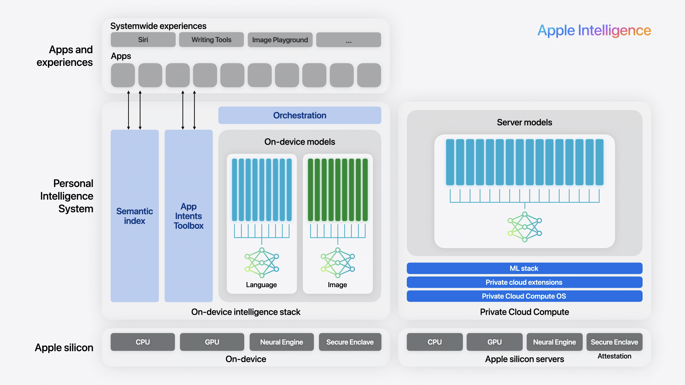
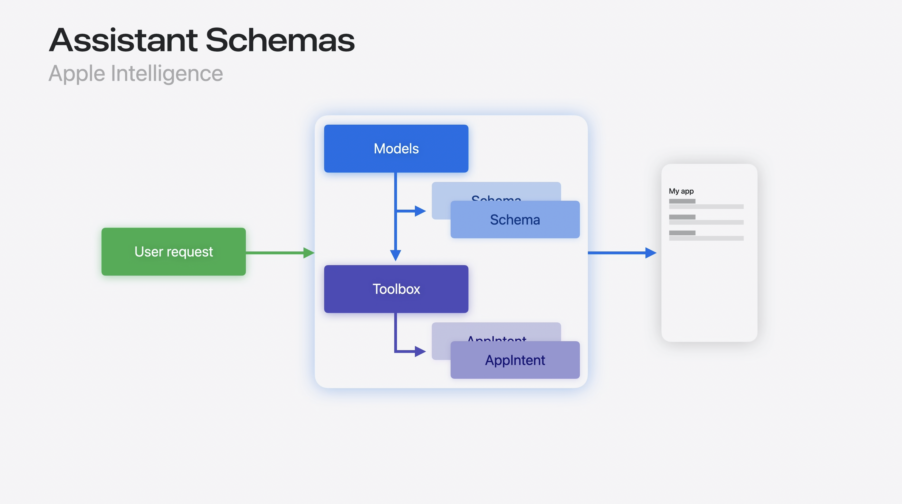

slidenumbers: true
slidecount: true
slide-transition: false
slide-dividers: #, ##, ###
autoscale: true

# WWDC Recap
App Intent

# 自己紹介

株式会社ディー・エヌ・エー
ライブコミュニケーション事業部
noppe

# Agenda

// ごちゃごちゃの図

^ 今日はRecapイベントではありますが、30分と長めの時間をいただけたのでAppIntentを０からでも理解できる内容でいこうと思います。
^ App Intentのエコシステムは、便利である一方で他のフレームワークに比べてやや複雑で分かりにくいと思います。
^ その要因としては、iOS10から始まったSiriKitの歴史的な経緯や、App Intentが万能的に解説されがちであるという点、また、これまではあまり重要視されてこなかったという点にあると思います。

# Agenda

// 小粒になるの図

^ そこで今日は、これからのAppleプラットフォームにおける重要な要素であるApp Intentのエコシステムを、最小の単位から順に登場人物を徐々に増やして解説していきます。
^ このトークの後には、皆さんはApp Intentのエコシステムが頭の中で整理された状態になると思います。

# Agenda

// NEWの図

^ もちろん、解説しながら今年のアップデートも紹介していきます。

# App Intent

// App Intentのアイコン

^ では、最初にApp Intentとは何かを端的に説明します。

# App Intent

Appに組み込まれたアクションを、外部に公開したもの

- ファイルを移動する
- 画像を回転する
- コーヒーを注文する

ただし、これ単体で何かが出来るわけではない


^ App Intentは、Appに組み込まれたアクションを指します。
^ 例えば、ファイルを移動したり、コーヒーを注文することをApp Intentとして公開することができます。
^ ただし、これ単体では公開しているだけで、何もすることはできません。

# ショートカット

// ショートカットのアイコン

^ ここで、早速２人目の登場人物が現れます。ショートカットです。

# ショートカット

- App Intentを実行するショートカットを作れる
  - アプリの外からアプリの機能を呼び出せるということ


^ ショートカットアプリは、アプリから取り出したApp Intentを実行するショートカットを作ることができます。
^ つまり、ショートカット経由でアプリの外からアプリの機能を呼び出せるということです。

# ショートカット

// ?の画像

- 特定のタブを開くショートカットを作るには

^ さて、ここで「アプリを開く時に、特定のタブを開く」ショートカットを作るとしましょう。

# ショーカット


[^]: https://developer.apple.com/wwdc24/10176?time=173

^ このように、タブごとにApp Intentを作るのは今年のWWDCの「システムの利便性を高めるApp Intentのデザイン」によると、よくない(補足入れる)

# ショートカット


^ このようなフレキシブルなインテントにするのが良い。

# AppEntity, AppEnum

Appに組み込まれた要素や概念を、外部に公開したもの

- App Intentのパラメータを定義するのに必要
- 例：アルバム・曲・タブのタイプ

^ ここで登場するのが、App EntityとApp Enumです。
^ これは、App Intentのパラメータとして扱う型が準拠する必要のあるprotocolで
^ このprotocolに準拠した型は、Intentのようにアプリの外からも扱うことができるようになります。

# ここまでのエコシステムの振り返り

// AppIntent, Entity, Shortcutsの図

^ さて、ここまでのエコシステムを振り返ってみると非常にシンプルです。
^ アプリは、AppIntentとAppEntityを使って要素やロジックを公開することで、アプリの外にあるショートカットからロジックを実行してもらうことができます。

# AppIntentを作ってみる

```swift
struct OpenAppIntent: AppIntent {
  ...
}
```

^ 先に進む前に、App Intentを作ってみましょう。

# AppIntentを作ってみる

```swift
struct TabType: AppEntity {
  ...
}
```

^ AppEntityはこんな感じ

# AppIntentを作ってみる

// ショートカットからの見た目

^ これでショートカットからタブを選べるApp Intentを作ることができました。

# AppIntentを作ってみる

// AppIntentが実行されてAppが動作する図

^ ところで、このAppIntentが実行されたときに実際にタブを選択するにはどうすればいいでしょうか？

# AppIntentを作ってみる

- 🆕 URLRepresentableEntity
- 🆕 URLRepresentableEnum
- 🆕 URLRepresentableIntent

^ iOS18では、URLRepresentableIntentが登場しました。
^ これを使うと、App IntentをURLとして実行することができます。
^ つまり、Universal LinkとしてアプリはApp Intentをハンドリングすることができます

# Shortcuts

- App Intent同士を組み合わせることができる
- AppEntityを違うアプリ同士でやり取りをする必要が出てくる

^ さて、ショートカットに話を戻しましょう。
^ ショートカットは、複数のインテントを組み合わせることができます。
^ そのため、自分のApp Intentに他の見知らぬアプリのApp Entityが渡されることがあります。
^ これまでは（調査）していましたが、iOS18ではある仕組みによって互換性が向上しています。

# 🆕　Transferable AppEntity

- App Entityにエクスポート可能なタイプを

[^]:https://developer.apple.com/documentation/coretransferable/transferable

^ それが、AppEntityのTransferableサポートです。
^ Transferableに適合することで、Entityを特定の形式として扱ってもらうことができます。

# 🆕　Transferable AppEntity

```swift
// transferable
```

^ このように、SongEntityをTransferableに適合してアートワークやタイトルといった物を取り出してもらえるようにサポートすることもできます。

# ここまでのエコシステムの振り返り

// 複数のApp, AppIntent, Entity, Shortcutsの図

^ 異なるアプリのAppIntentを組み合わせてショートカットを作ることによって、強力な連携ができるようになりました。
^ ここで、ショートカットを中心としたエコシステムの広がりについて解説します。

# ショートカットを中心としたエコシステム

- Shortcuts
- オートメーション
- Shortcuts ウィジェット

^ 作成したショートカットは、ショートカットアプリの他、ショートカットのウィジェットなどでも利用できます。

# ショートカットを中心としたエコシステム

- Siri
- Action Button
- Apple Pencil Proのスクイーズ
- Assistive Touch

^ さらに、ショートカットはOSと密接に連携しており、多くの機能からショートカットを呼び出すことができます。

# ここまでのエコシステムの振り返り

// 複数のApp, AppIntent, Entity, Shortcuts, ショートカットを使う機能たちの図

^ かなり登場人物が増えてきましたが、理解しやすいのではないでしょうか

# 特定の機能に対してApp Intentを最適化して提供する

- Siri (フェーズの追加)
- ウィジェット (UIの追加)
- Apple Intelligence (スキーマの追加)

^ ここまでは、ショートカットアプリを中心にエコシステムが広がりを見せていました。
^ さらに、App Intentの開発者は、特定の機能に対してApp Intentを最適化して提供することもできます。
^ どのように最適化するのかを見ていきましょう

# Siri

AppShortcutsProvider

- フェーズの追加

^ 先ほど説明した通り、ショートカットのアプリでショートカットを作ることでSiriから呼び出すことが出来ます。
^ AppShortcutsProviderでラップすることで、インストール直後からSiriでApp Intentを使ったり、自然な表現で呼び出させることができます。

# ウィジェット

WidgetConfiguration

- UIの追加

^ WidgetKitを使うと、App Intentを呼び出すためのウィジェットUIを自分で構築することができます。

# ウィジェットの活用

- 🆕 Control Widget
  - コントロールセンター
  - ロック画面

^ 今年は、ウィジェットが表示できる場所が増えました。

# Apple Intelligence

^ そして、Apple Intelligenceに対してもAppIntentを最適化することができます。

# Siri + Apple Intelligence

- 自然な話し方で処理を依頼できる
- 複雑な処理を依頼できる
- 画面上のコンテキストを理解できる

^ Siriは、AIによってとても進化しました。
^ これによってSiriは魔法のような動きをするが、開発者はその仕組みを理解する必要があると思います。

# Apple Intelligenceについて



- Siri ≠ AppleIntelではない

^ 誤解を恐れずに言うなれば、SiriはApple Intelligenceではありません。
^ SiriはあくまでUIの１つであり、一部の処理をAIに移譲する

# Siriの仕組み



- Apple Intelにユーザーリクエストを投げて、適切なスキーマを見つけて、紐づいたAppIntentを見つけて実行する
- 前の文脈も引き継いだりしていそう
- IMO: 要するに、その場限りのショートカットをリアルタイムに構築しているのでは？

^ 要するに、その場限りのショートカットをリアルタイムに構築していると理解していいんじゃないかなぁと思います。予想ですが。

# スキーマ


- 100種類の決められたアクションのこと

- App Intentが100種類のうちどれに当たるのかを教えてあげる必要がある

- 要するに、あまりにトリッキーな命令は出来ないのではないかと思う

例：冷蔵庫の写真から料理のレシピを作って、その材料をamazonで購入して

^ スキーマというのは、Apple Intelligenceが学習しているシナリオに含まれる動作。

# AssistantSchema 🆕

- 既存のAppIntentにスキーマを指定できる
- AssistantEntity 🆕

^ スキーマはAssistantSchemaマクロを使うことで、AppIntentに付与することができます。

# IndexedEntity 🆕

- 検索可能にする
- attributeSetで情報を付与できる
- 「昨日撮った娘の写真」とかをAIに見つけさせることが可能になる

# エコシステムの全貌

// 図

# 考察
	何か
	
# まとめ
	App Intentを中心としたエコシステムについての振り返り
　	
	