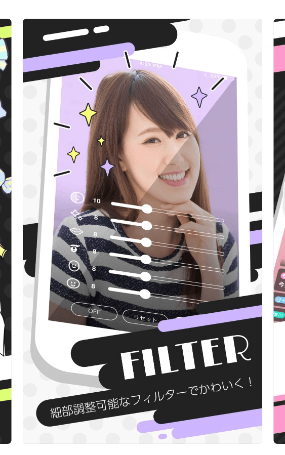
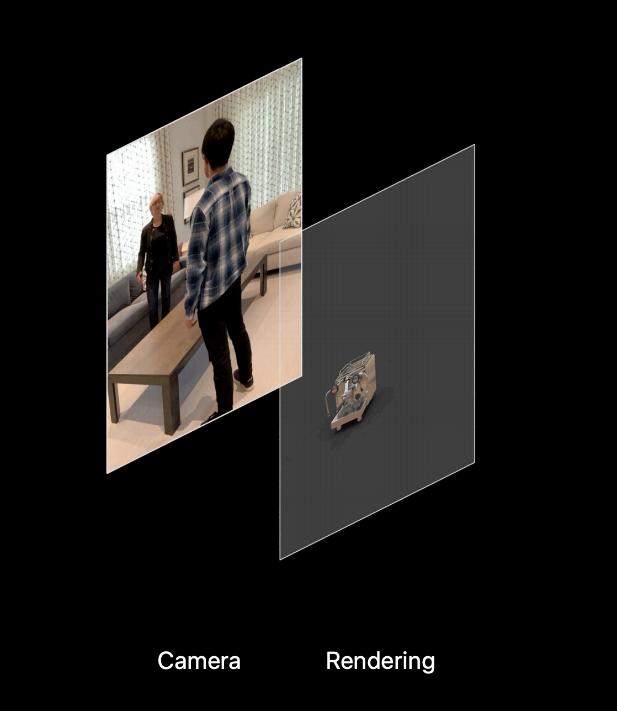
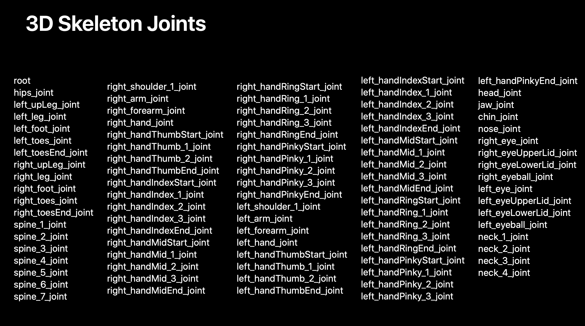
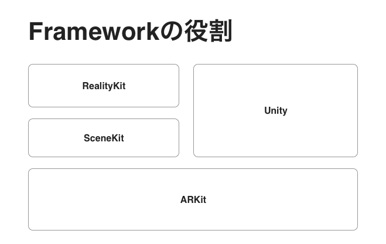

slidenumbers: true

# ソーシャルライブから見たWWDC
### iOS de KANPAI !【WWDC 2019 報告会】

[.footer: DeNAは、本イベントの内容、並びにお客様が本イベントを通じて入手した情報等について、その完全性、正確性、確実性、有用性等につき、いかなる責任も負わないものとします。]

---

# noppe

- きつねすきすきエンジニア
- ＷＷＤＣ初参戦
- HomePod買ってきました
- 小田原いちごイケル派


---


^ DeNAではソーシャルライブ「Pococha」
^ 誰でも気軽にライブ配信出来るサービス

---

# Pocochaで使われている技術

---

# GPUレンダリング

- カメラのフィルタやアイテムの再生にOpenGLESやMetalを利用

- iOSDC18でアイテム再生の話をしました


---

# AR

- 顔の輪郭補正や肌質の変更

- フェイスステッカー

- iOSDC19でCfP応募しました



---

# 今日の内容

- 映像周り
- ARKit周り

---

# 映像

---

# GPU

- 今年もOpenGLESがdeprecatedと念押し
- 分かってるけど、シミュレータでMetalは動かないんじゃ…

---

# Metalのシミュレータ対応！

---

# Metalのシミュレータ対応

- macOS 10.15, Xcode11 ~
- MTLGPUFamilyApple2相当のGPUとして実行される
- GPUアクセラレーションが効くようになった

^ UIKitとかMapKitとかもパフォーマンス向上している

---

# MTLGPUFamilyApple2

- Apple A8 GPU（iPhone 6）相当の機能が使える
- Metal3からより抽象的なfamily表現になった（以前はiOSやtvOSごとにfamilyがあった

[.footer: https://developer.apple.com/metal/Metal-Feature-Set-Tables.pdf]

---

# Metal on Simuratorの注意点

- Texture Storege

iOSのMetalはCPUとGPUのメモリを共有するが、Macは出来ない
シミュレータの時はStorageModeをprivateにする必要がある。

---


---

# Metal on Simuratorの注意点

```swift
#if targetEnvironment(simulator)
textureDescriptor.storageMode = .private
#else
textureDescriptor.storageMode = .shared
#endif
```

メモリを共有したい場合は、自前でコピーする必要あり

[.footer: https://developer.apple.com/documentation/metal/developing_metal_apps_that_run_in_simulator]

---

[.autoscale: true]

# デバイスの温度上昇が取れるようになった

- カメラやGPU/CPUを酷使するアプリは熱問題に悩まされていました

- 夏になると上がるクラッシュレート

- 冬になると布でくるみながら充電

- 排熱性の低いケース

- ...etc

---

`ProcessInfo.thermalStateDidChangeNotification`

NotificationCenter経由で取得可能

```
 ProcessInfo.ThermalState.nominal
 case .nominal:
 case .fair:
 case .serious:
 case .critical:
```

適宜stateに合わせてfps下げたりしましょう

---

# ARKit3

---

# ARKit 3

- People Occlusion
- Motion Capture

---

# People Occlusion

- 3Dオブジェクトを人が遮れるようになった

- A12 ~ (XS/iPadPro)


---

# Before

- 常にオブジェクトは手前だった



---

# After

- 常に人が前 or 奥行きを付けて遮る事ができるようになった
- 人以外のものは手前に置けない


---

# OcclusionMaterial

- RealityKitのコンポーネント

- MLとかVisionで輪郭取れれば自前のOcculusionもワンチャンあるかも


---

# People Occlusion

```swift
let configuration = ARWorldTrackingConfiguration()
configuration.frameSemantics = .personSegmentation
session.run(configuration)
```

比較的カンタンに実装できるっぽい

---

# Motion Capture

- 2次元および3次元のモーションキャプチャができるようになった
- A12 ~ 


---

# Motion Capture

```swift
let configuration = ARWorldTrackingConfiguration()
configuration.frameSemantics = .bodyDetection
session.run(configuration)
```

こちらもframeSemanticsを指定すればframeに情報が入った状態でdelegateが叩かれる

---

- リグの名称が揃っていればいい感じに動く

- SceneKitのSceneをRealityKitに持ってくるのはちょっと難しそう

- 自前でフレームから情報取ることもできる



---


---

# ARCoachingOverlayView

iPhoneをどうやって動かせばよいか教えるためのビューが追加！

```
coachingOverlay.session = sceneView.session
```


---

# RealityKit

---

# RealityKit

ARKitを軸に、SceneKitの表現を拡張するフレームワーク

---



---


---