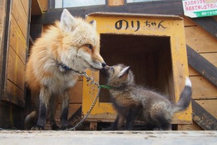

[.pagenumber: true]

きつね

---

自己紹介
DeNA16新卒
Pococha iOSエンジニア

---

プライベートでアプリ開発してる

---

アジェンダ
キツネ
Q
- イヌ科ネコ目
- トレンドときつね
- ソーシャルゲーム
キツネと日常生活
- 身近に動物の狐は少ない
    - 会えるところ
    - 稲荷神社（数・身近）
    - 映画
- キツネではないもの
    - firefox
    - gitlab
・キツネを愛でると何が良いか
    - お金がかからない
    - 論文を破壊できる
    - 

---

# Q 犬と猫、どちらが好きですか？

---

# イヌ派の人🙋‍♀️

---

# ネコ派の人🙋‍♀️

---

# ありがとうございます！

---

# 犬か猫か、悩みますよね

---

# イヌ科ネコ目の動物[^1]

[^1]:ネコ目は食肉目分類でありネコに意味はありません

---

# キツネ

## イヌ科ネコ目キツネ属

^ これは実質ここにいる全員がキツネ好きと言っても良いでしょう

---

# キツネ

# 犬の風格と猫の可愛さを持つ動物

^ 犬のかっこよさと猫の可愛さを秘めた動物

---

# きつねかわいい

---

# （もっと狐の良さを広めたいなぁ…）

### と思ってしまったはず

^ きつねが好きな皆さんは、次にこう思うはずです

---

# 全く恥ずかしい事ではありません

---

[.footer: Google トレンドより]

---

[.footer: Google トレンドより]

---

# [fit]世の中がきつねに関心を持ち始めている

---

# [fit]今、きつねに関心を持ったのは賢さの証拠

---

# きつねかわいい

---

# 要因

^ 物事が変化するには必ず要因があります

---

# ソーシャルゲーム

^ その一つがソシャゲだと僕は考えています

---

# URに相応しい動物

^ ソーシャルゲームのガチャには魅力的なキャラクターを用意する必要があります。
^ そして、モチーフのレアリティがキャラの価値を決めます。

---

# URに相応しい動物

- 神々しい
- 身近ではない
- 賢そう
- かわいい（美少女マーケティングとの折り合い）

---

# URに相応しい動物

^ キツネがレアリティの高いキャラクターとして立ち位置を確立

---

# UR = キツネ = 万能の象徴

^ 作る側も、積極的にキツネを採用するという好循環が生まれた

---

# きつねかわいい

---

# キツネと触れ合える場所

残念ながら猫カフェほど手軽に触れ合うことはできない

野生のキツネは触れるのは厳禁[^3]

[^3]:寄生虫がいるよ

---

# キツネと会える場所

---

# よこはま動物園
## ズーラシア

ホンドギツネのコウシロウさん

⭐️都内からでも近い

⭐️顔がかわいい

[^2]:http://www.hama-midorinokyokai.or.jp/zoo/zoorasia/details/post-688.php

---

# 宮城蔵王キツネ村[^4]

のりちゃんさん

⭐️美狐

⭐️100匹以上いる

⭐️触れ合える

[^4]:http://zao-fox-village.com

---

その他

- 北きつね牧場
放し飼い
なぜかタヌキがいる

- のんほいパーク
イナリとオアゲ

...etc

---

# もっと身近にキツネはいる

---

#[fit]⛩

---

# 稲荷神社

狐が祀られている

---

# 32000 

---

# Brevity is the soul of wit.

### - Shakespeare

^ 簡潔こそが英知の真髄である。

