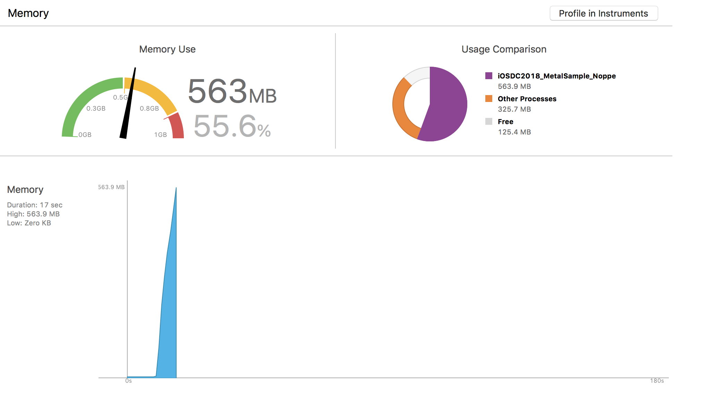
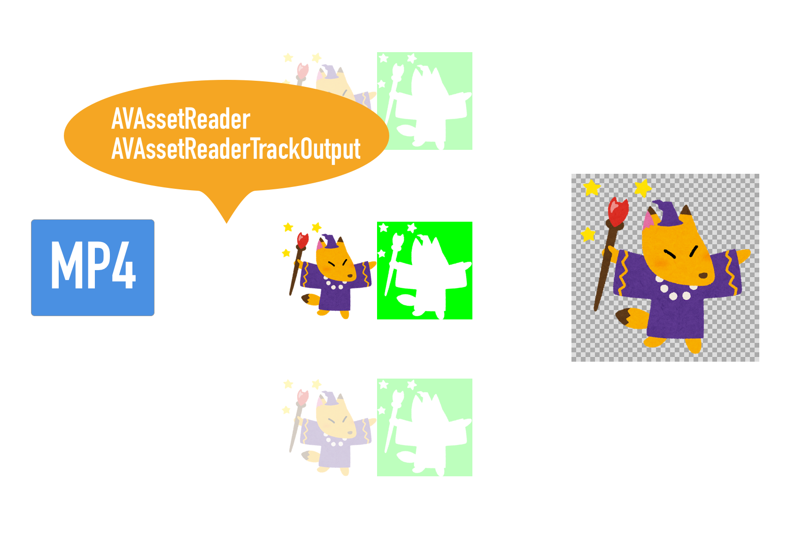
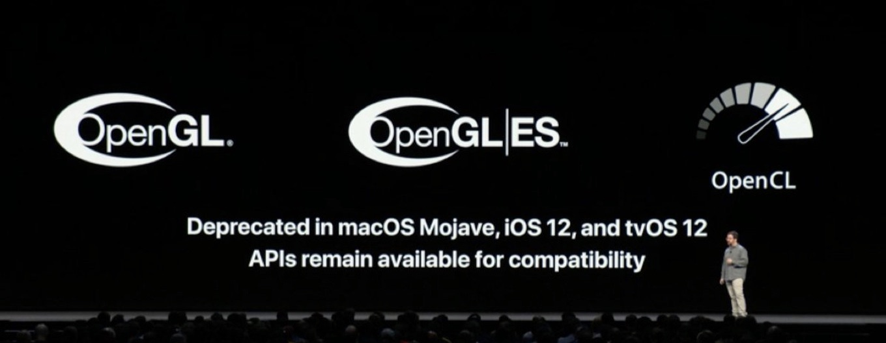
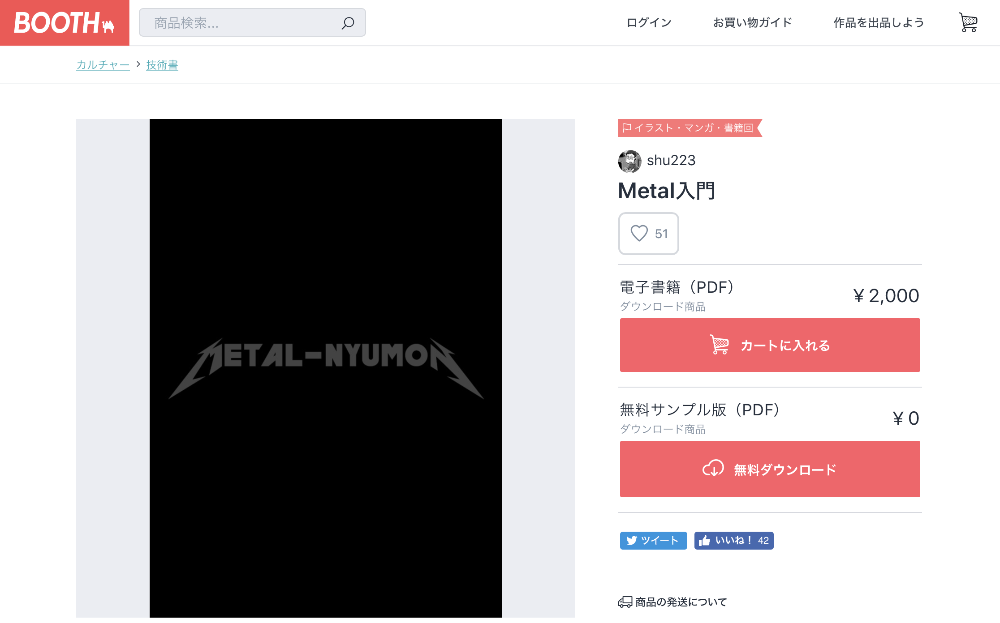
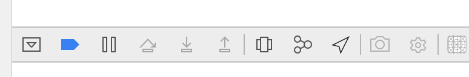
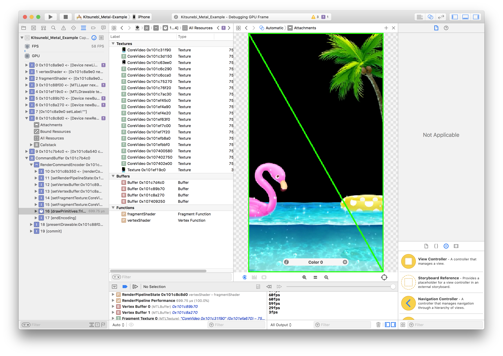
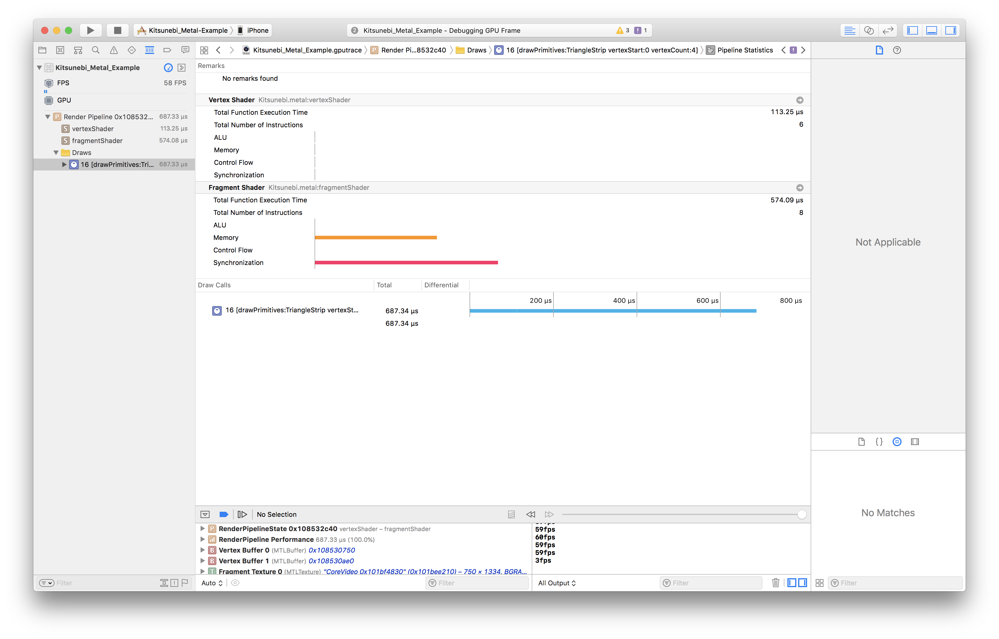
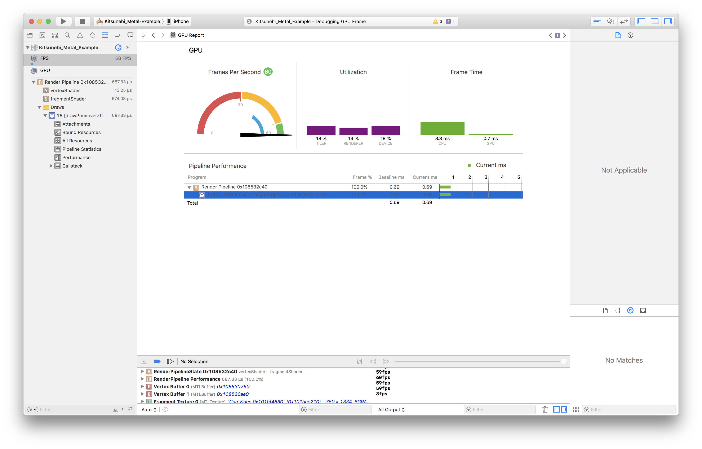
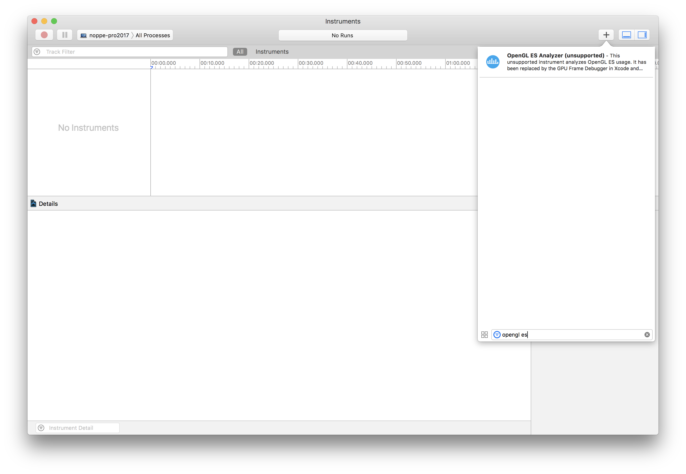

footer: \#iosdc \#b 🦊 < share!
slidenumbers: true

# ライブ配信アプリのアイテム再生をMetalで実装する事になった話
## iOSDC Japan Track B 2018/09/02

^ よろしくお願いします。
^ 「ライブ配信アプリのアイテム再生を、Metalで実装する事になった話。」というタイトルで発表します。
^ 本トークは、実際のユースケースを元に開発を追体験してもらいながら、動画像の編集・表示の領域に関して興味を持っていただくと
^ また、GPUを操作するOpenGLESやMetalなどのレイヤーを実装の選択肢として持っていただくことを目的としています。
^ ライブ配信技術自体に関する点については、本トークでは扱いませんのでご了承ください。
^ あとMetalの話はかなり終盤になります。Metalメインじゃなくてごめんなさい。

---

#[fit] noppe

🏢 株式会社ディー・エヌ・エー
🦊 きつねかわいい
💻 アプリ開発２０１０〜


^ まず、自己紹介をさせてください。
^ 株式会社ディー・エヌ・エーでiOSアプリエンジニアをしているnoppeと言います。
^ 動物の狐が好きで、プロフィール画像も狐です。きつねのシャツ着ているのがいたら話しかけてください。
^ アプリ開発は独学で2010年ごろから続けていて、今年で８年目です。
^ これまで個人のアカウントで、アドベンチャーノベルゲームやTwitterクライアントをAppStoreでリリースしてきました。
^ OpenGLやMetalなどのGPU周りは今年に入ってから触り始めました。
^ 既にMetalやOpenGL詳しいよという方は是非セッションの後で理解を深めさせてください。
^ 今回は、これらのGPU周りの学習に置いて手頃な事例を用意出来たと思うので触ったことの無い方も最後まで聴いていただければと思います。

---

今日の話
・Pocochaの紹介
・アイテムエフェクトの再生手法
・再生手法の実装比較
・まとめ

^ さて、今日お話する内容についてですが、最初に弊社でリリースしているライブ配信アプリのPocochaの紹介をします。
^ そのあとで、アプリで使われているアイテムのエフェクト再生手法を解説します。
^ 次に、それらの再生手法をCoreImage、OpenGLES、Metalでそれぞれ実装した結果について解説します。
^ 最後に今日のセッションのまとめをします。
^ なお今回のセッションでは、解説の関係上実際リリースされているアプリと仕様が異なる箇所があります。ご了承ください。
^ 本日は30分程度になりますが、ぜひ最後までよろしくお願いいたします。

---

#[fit] ライブ配信アプリPocochaの紹介

^ それでは最初に弊社からリリースされているライブ配信アプリPocochaを紹介させてください。

---

# Pococha

- ライブ配信アプリ

- 2017 〜

- 高性能な美肌・美顔フィルター

- アイテムによるコミュニケーション

<!-- //Pocochaの画像、できれば右側に動画でおいてもいいかも -->


^ Pocochaは、2017年初頭にリリースしたライブ配信アプリです。
^ どこでも手軽にスマホで縦型のライブ配信ができ、視聴者はコメントやアイテムを使って配信枠を盛り上げたりといったコミュニケーションが楽しめます。
^ また高機能な美顔・美肌フィルターを搭載していて、コンディションを問わず配信を始められるのも特徴です。
^ 今日はそんな機能の中でも、アイテムがどのような技術で再生されているのかの話をします。

---

#[fit] アイテムのエフェクトの再生手法

^ アイテムの話をする前に、Pocochaのアイテムがどのようなギミックなのかを見て見ましょう。

---

<!-- アイテムが再生される様子 -->


^ はい、このように視聴者はアイテムを選択して使うことができます。
^ アイテムを使用すると配信者・視聴者の両方の画面でエフェクトが再生されます。
^ 昨今のライブ配信アプリでは、このようなアイテムの概念が必ずと言っていいほど導入されておりアイテムの表現力もサービス差別化の上で重要になってきます。
^ Pocochaでは、多くのアイテムで画面全体を覆う派手なエフェクトを採用しています。

---

## アイテムのエフェクト

- 750 × 1334
- 60fps 
- 透過色あり
- 5秒


^ 先ほどのデモではどういった仕様のエフェクトが再生されているかというと
^ 750x1334の透過情報を持ったエフェクトが60fpsで再生されていました。
^ このようななめらかで、高解像度のアニメーションエフェクトが配信中や視聴中といった高負荷な状況やiPhone5cなどの低スペックな端末上でも再生されます。
^ アイテム素材は、AfterEffectsプロジェクトから任意の形式で書き出して実装します。

---

## [fit] アイテムのエフェクトをiOS上で再生するには

^ それでは、先ほどのような仕様のエフェクトをどうやって実装したのか。
^ 課題を踏まえながら解説します。

---

### ① AVPlayerで再生する

[.code-highlight: all]
[.code-highlight: 1-2]
[.code-highlight: 7]

```swift
let url = Bundle.main.url(forResource: "item_effect",
                          withExtension: "mov")!
let asset = AVURLAsset(url: url)
let item = AVPlayerItem(asset: asset)
let player = AVPlayer(playerItem: item)
let playerLayer = AVPlayerLayer(player: player)
playerLayer.backgroundColor = UIColor.clear.cgColor

view.layer.addSubLayer(playerLayer)
player.play()
```

^ 最初に試したのは、AVPlayerLayerに書き出したmovファイルを再生させる手法です。
^ movを試したのはQuickTimeフォーマットはRGB+Alphaのチャンネルをサポートしているからです。

^ AVPlayerはMOVファイルをサポートしているので、そのまま呼び出します。
^ ちなみにmovファイルはそのままでは500MBくらいありました。

^ 透過情報を持つmovなので、背景色を透過します。結果は

---

AVPlayerLayerでは、透過情報のある動画を扱う事ができない。

**Important**
The value of a player layer’s inherited contents property is opaque and should not be used.[^1] (AVPLayerLayerドキュメントより)


^ 実は、この方法では再生できません。
^ このように真っ暗になってしまいます。
^ ProRes4444も非圧縮のRGBA形式も試したけどダメでした。
^ このように透過情報が反映されません。
^ ドキュメントにも、レイヤーは不透過にして透過はしないでくれと書いてあります。

[^1]:https://developer.apple.com/documentation/avfoundation/avplayerlayer

---

### ② UIImageViewで再生する

[.code-highlight: all]
[.code-highlight: 5-6]

```swift
let imageView = UIImageView()
let images = (0...300).compactMap({
  UIImage(named: "\($0).png")
})
imageView.animationImages = images
imageView.startAnimating()
```

^ 次に試したのは、UIImageViewです。

^ UIImageViewには、animationImagesというプロパティがあり
^ ここにUIImageの配列を与えてstartAnimationを呼ぶことで
^ パラパラ漫画のようにアニメーションさせる事ができます。

---

### ② UIImageViewで再生する

```shell
$ ffmpeg -i input.mov images/output_%04d.png
```

^ 今回はffmpegを使って、movファイルを300枚のpng画像に分割しました。

---

### ② UIImageViewで再生する

```shell
$ ffmpeg -i input.mov images/output_%04d.png
```

```shell
$ du -sh ./images
302M    ./images
```

☺️

^ ちなみに、容量は300MB程度ありました。
^ では実行した結果を見てみましょう。

---

### ② UIImageViewで再生する

<!-- //pngシーケンスの動画 -->


^ アプリが落ちてしまいました…。

---

### ② UIImageViewで再生する

<!-- //メモリめっちゃ使っているの図 -->


`Message from debugger: Terminated due to memory issue`
でクラッシュ

^ これは、animationImagesを設定したタイミングで5秒分のpngファイルを読み込んでいるからだと思われます。
^ また、メモリを瞬時に500MB程度使っています。
^ これはこのコードの検証に利用したiPhoneXではギリギリ耐えられていますが、iPhone5sなどではアプリが「Message from debugger: Terminated due to memory issue」で落とされてしまいます。

---

## 検証から分かった２つの課題感

- 動画自体の容量
- 再生パフォーマンス

^ 検証からわかったことは、まず動画自体の容量をどうにかしないといけないことです。
^ そして、再生時にはメモリに大きく負荷がかかることです。
^ メモリを圧迫することでCPUやバッテリーに影響が出ます。
^ 端末は配信や視聴もしているのでそんなに余裕はない
^ Pocochaを出した当初は8fps程度までフレームレートを落としてanimationImagesを使って実装していました。
^ しかし表現力の点で、競合に引けを取らないためにも仕組みを変える必要がありました。

---

## 動画自体の容量

|||
|---|---|
|非圧縮movファイル|493MB|
|連番PNGファイル|302MB|

圧縮する必要がある

^ 容量が大きいと、アプリをダウンロードする時間が増えたり、
^ オンデマンドで取得する場合はモバイルデータ通信を使い過ぎてしまう問題があります。
^ そこで、これらのファイルを圧縮する事にしました。

---

### ファイルの圧縮で必須な要件

- 透過情報を持っている
- fpsを落とさない
- 縦横のサイズを変更しない

^ 圧縮するために必要な要件があります。
^ 透過情報を持っている
^ fpsを落とさない
^ 縦横のサイズを変更しない
^ これらをmovやpngで満たしつつ、大きくファイル容量を減らすのは不可能に近いです。
^ そのため、アニメーションをサポートした画像フォーマットや、圧縮率の高い動画フォーマットに変換する事に決めました。

---


|フォーマット|透過|圧縮結果|デコード負荷|
|:---:|:---:|:---:|:---:|
|apng|○|150MB|×[^3]|
|webp|○|49MB|×(0.097s/1f)|
|webm|○[^2]|387KB|×[^3]|
|mp4|×|1.2MB|○(h264)|

[^2]:vp9 with alpha

[^3]:APNGは容量の時点で不採用だったので未測定。WEBMはデコーダが無さそうなので未測定

<!-- ffmpeg -i M_sea60fps.mov  -strict -2 output.webm -->

<!-- ffmpeg -i M_sea60fps.mov output.mp4 -->

<!-- ffmpeg -i M_sea60fps.mov  -vcodec libwebp -lossless 1 -preset default -loop 0 -an -vsync 0 output.webp -->

^ 圧縮はffmepgを使って変換しました。オプション等は後日アップするスライドのコメントを参照してください。
^ まずはAPNGですが、あまり容量が減りませんでした。
^ 同様にWEBPも50MB程度の圧縮率でした。
^ アニメーション対応の画像フォーマットは圧縮率が低いようです。
^ また、apng/webpはiOSではデフォルトではサポートしていないためCPUを使ってデコードする必要があります。
^ 5cでは1フレームに0.1秒程度かかる結果になりました。またCPU使用率も90%前後と高くなりました。
^ webmでは、透過に対応したvp9 with alphaというコーデックを利用する必要があります。
^ iOSでは探した限りではデコーダを見つけることができませんでした。
^ webmもwebp同様CPUでのデコードが必要なので、適さないと思います。
^ しかしvp9の圧縮率は驚異的ですね
^ mp4のビデオコーデックであるh264は透過をサポートしていません。
^ ですが、iOSはh264をハードウェア的にデコードをサポートしているので高速に処理できます。

^ 色々検証してみたのですが、なかなか良いフォーマットがありません。
^ 透過できないことを除けば、全体的にはmp4(h264)が良さそう


---

# mp4をなんとか透過に対応出来ないか

ここで、昔ゲームを作っていた時のことを思い出す

---

<!-- // alpha maskの立ち絵の図 -->


^ 昔ゲームを作っていた時、
^ ゲームエンジンはこのような画像を用意すると、緑の箇所を透明として描画してくれていました。
^ この手法は今回も使えそうと思えました。

---

<!-- // 非透過のビデオA・非透過のビデオB毎フレーム透過合成していく、それを描画の図 -->


^ iOSには、MP4の毎フレームをCMSampleBufferで受け取れる高機能なデコーダであるAVAssetReaderとAVAssetReaderTrackOutputがあります。
^ これらを使って毎フレームの画像を取り出して透過合成して表示すれば、透過動画が再生出来るはずです。

---

# 透過合成と描画

ここからは、透過動画プレーヤーを実装していく話

- CoreImage
- OpenGLES
- Metal

をそれぞれ使って作った結果を比較します。

^ ここからは、先ほどのalpha maskの手法を使ってCoreImage/OpenGLES/Metalを使って合成・描画した結果を解説します。

---

# 透過合成と描画

- 1500 × 1334
- 60fps 
- 透過色なし
- 5秒
- mp4


^ ここまでをまとめると、横のサイズが２倍になるので、このような動画を再生することになります。

---

### CIFilterを使った合成

CIFilter
 - iOS 5.0+
 - 200以上のプリセットフィルタ
 - CPUかGPUで処理

^ まず最初に思いついたのは、CIFilterを使う方法です。
^ CIFilterは、CoreImageフレームワークに含まれている画像編集の機能です。
^ CIFilterは内部的にMetalとOpenGLES、またCPUでの処理を切り替えられるようになっています。

---

### CIFilterを使った合成

CIFilter[^4]
 - iOS 5.0+
 - 200以上のプリセットフィルタ
 - CPUかGPUで処理

CIBlendWithMask
 - アルファ値の画像を使って透過マスクをかける


^ また、プリセットのフィルタに`CIBlendWithMask`というalpha mask用のフィルタが存在します。
^ まずはこれを使って実装してみました。

[^4]:https://developer.apple.com/documentation/coreimage/cifilter

---

### CIFilterを使った合成

[.code-highlight: all]
[.code-highlight: 1-5]
[.code-highlight: 6-9]

```swift
let filter = CIFilter(name: "CIBlendWithMask")!
filter.setValue(baseCIImage,
                forKey: kCIInputImageKey)
filter.setValue(alphaCIImage,
                forKey: kCIInputMaskImageKey)
let filteredImage = filter.outputImage!

let image = UIImage(ciImage: filteredImage)
imageView.image = image
```

^ 実装は非常に簡単です。
^ フィルタ名を元に生成したCIFilterに対して、kCIInputImageKeyで非透過画像を
^ kCIInputMaskImageKeyでアルファ画像を指定します。

^ filter.outputImageでフィルタをかけ終わったCIImageを取得することが出来ます。
^ CIImage自体は元の画像をどのように描画するかの情報を持っているだけなので、outputImageを取得するまでは一瞬で行われます。
^ 描画自体はこのCIImageをUIImageに詰めてUIImageViewで描画するタイミングで行われます。
^ あとはこのフィルタで作った画像をUIImageViewで表示するという作業を0.016秒ごとに繰り返します。
^ 0.016秒は1秒間に60フレーム表示する場合の１フレームの時間です。
^ それでは実際の動作を見てみましょう。

---

<!-- // CIFilterで実装した動画 -->


iPhone5c / 24fps

^ これは、iPhone5cで動作させた様子です。
^ スローモーションのような動きになってしまいました。これは大体24fps程度です。
^ これは１フレームあたりの処理が0.016秒を超えてしまっているために発生した問題です。
^ iPhone5cはMetalに対応していないので、OpenGLESを使って処理されているはずですが非常に時間がかかっています。
^ ここは調査してみると、5cではCIImageをUIImageに入れてUIImageViewにセットするタイミングで30ms程度使っていました。

---

### OpenGLESを使った合成と描画

CAEAGLLayer
 - iOS 2.0–12.0
 - GPUで処理

^ そういったこともあって、CIFilterはリアルタイムの処理に向いてないのかもしれないと思いました。
^ そこで、CIFilterの内部で実装されているだろう合成と描画の処理をOpenGLESで書いてみる事にしました。
^ CAEAGLLayerは、OpenGLESのレンダリング先として利用できるレイヤーです。
^ 実際に利用するときはUIViewのlayerClassをoverrideする必要があります。

^ OpenGLESを直接使ったことのある人は、この会場内では分からないですがあまり多くないと思います。
^ 実際、Pocochaのエンジニアは十数名いますが当時触ったことがある人はいませんでした。
^ ゲームで使うものというイメージが強いですが、UIKitと組み合わせて使う事もできます。
^ OpenGLESと聞くと、何だか難しそうなイメージがあります。
^ 恐らくそのイメージは、ハローワールドを表示するまでの道のりが長いことや、そもそもUnityなどのおかげで触る必要が無いのでそれ以上触らないだけという話かもしれません。
^ 実際、私も初めてOpenGLESを触りましたが、暗中模索しながら始めました。

---

### OpenGLES TIPS

^ このセッションではOpenGLESのチュートリアルは行いませんが
^ コードリーディングのために、少しOpenGLESのクセのある記法を紹介します。

---

### OpenGLES TIPS

EAGLContext
 - テクスチャやエラー状態などを管理

^ まずは、EAGLContextです。
^ コンテキストは、テクスチャやエラー状態などを管理するものです。

---

### OpenGLES TIPS

```swift
// どのコンテキストで動作するか不定
glDisable(GLenum(GL_DEPTH_TEST))

// 利用するcontextを設定
EAGLContext.setCurrent(context)

// ↑で指定したcontextで実行される
glDisable(GLenum(GL_DEPTH_TEST)) 
```


^ このコンテキストを利用するには、EAGLContextのクラスメソッドであるsetCurrentを呼びます。
^ すると、setCurrentを呼んだ後の行からはコンテキストで管理されるようになります。
^ Swiftではあまりこういったインターフェイスは無いですよね。

---

### OpenGLES TIPS

```
glGetError()
```

例：`GL_INVALID_ENUM`
 - 無効なenum値を指定している。

^ また、エラーの取り方も独特です。
^ glGetError()は、この行が呼ばれたタイミングで発生していたエラーを取得します。
^ glの関数はほとんどがエラーを直接返さないので、おかしな動作をしているときは
^ 怪しい箇所に毎行このglGetErrorをチェックするコードを仕込みます。

^ ちなみに最初に見つけたエラーは`GL_INVALID_ENUM`です。
^ これは、異常なenumを渡した時に発生するエラーですが、OpenGLESはこのエラーが発生しても動作を停止しません。

---

### OpenGLES TIPS


Xcodeではブレークポイントを仕込むことも可

^ そして、幸いな事にXcodeではOpenGLESでエラーが発生した時に動作を中断するbreakpointを仕込む事ができます。
^ これらも合わせて使うと問題が早く解決します。

---

### OpenGLESを使った合成と描画

|**CoreImage**|**OpenGLES**|
|---|---|
|CIImage|テクスチャ|
|CIFilter|フラグメントシェーダ|
|UIImageView|レンダラ(CAEAGLLayer)|

^ さて、簡単なデバッグ手法を覚えた上で実装するわけですがCIFilterと違い
^ OpenGLESの場合は、描画するまでが少し複雑です。
^ 処理の中で色々な構造が出てくるのですが、重要な箇所だけを解説します。
^ 無理矢理当て込むと、この図のような対応になります。
^ テクスチャは、画像データのようなものです。
^ フラグメントシェーダは、どのような色で表示するかを決めるシェーダです。
^ レンダラは、処理が終わったものを描画する描画先を示します。

---

### OpenGLESを使った合成と描画

[.code-highlight: all]
[.code-highlight: 15-16]

```glsl
varying lowp vec2 textureCoordinate;
uniform sampler2D videoFrame;
void main() {
  // ベースの色のx
  lowp float x = textureCoordinate.x / 2.0;

  // ベース色の取得
  lowp vec2 baseCoord = vec2(x, textureCoordinate.y);
  lowp vec4 baseColor = texture2D(videoFrame, baseCoord);

  // alpha値の取得
  lowp vec2 alphaCoord = vec2(x + 0.5, textureCoordinate.y);
  lowp vec4 alphaColor = texture2D(videoFrame, alphaCoord);

  // RGBはベース色、Aはalpha値を利用する
  gl_FragColor = vec4(baseColor.r, baseColor.g, baseColor.b, alphaColor.r);
}
```

^ フラグメントシェーダは、受け取ったデータをどのように描画するのかを演算する機構です。
^ シェーダは、GLSL（OpenGL Shading Language）を使って書きます。
^ 実際の演算はGPU上で行われるので、このGLSLをコンパイルしGPUへ転送して演算を行います。
^ コンパイルはアプリケーション実行時に行います。

^ 透過を行なっているのは、この箇所でRGBの値は非透過画像の色を、Alphaはアルファ画像の明度を使っています。
^ そうすることで、アルファ画像の明るい箇所ほど透明に描画されるようになります。

---

#[fit] gl_FragColor = vec4(baseColor.r, baseColor.g, baseColor.b, alphaColor.r);


---

### OpenGLESを使った合成と描画


iPhone5c / ≒60fps

^ こうして最小構成のコードが書き終わりました。
^ ・・・という事で、OpenGLESを使う事で大きくパフォーマンスを向上させることができました。

---

# [fit] しかし…

---



^ 残念ながら、WWDC2018でOpenGLESはiOS12やmojave以降の環境では非推奨となってしまいました。
^ Metal使えよということですね

---

WWDC2018で突然のDeprecated。

ライブ配信アプリのアイテム再生を**Metalで実装する事になった**話

無事タイトル回収☺️

^ ここで無事タイトルが回収できました。

---

#[fit] Metalで書いてみました

^ ということで、Metalへの興味とDeplicateの対応もあってMetalで実装してみることにしました。

---

# Metalの利点

- シェーダーの事前コンパイル
- GPU/CPUの共有メモリ空間
- GPUへの命令をまとめて送れる
...etc

3Dをゴリゴリに使う人くらいしか喜ばない…🤔

^ Metalへの移植の前に、Metalの利点について知っておく必要があります。
^ まずはシェーダーの事前コンパイル機能です。
^ 先ほどOpenGLESの例で見た通り、OpenGLESは実行時にGLSLをコンパイルします。
^ MetalはXcode Buildの段階でMSL（Metal Shading Language）をコンパイルします。
^ これはXcode build phaseのCompile Sourcesの中にmetalファイルがある事からも分かります。
^ OpenGLESのようにデバイス上でコンパイルすることも出来ます。
^ 今回のケースでは、シェーダーは一つですしOpenGLESの場合でもシェーダーコンパイル後に動画を描画し始めるのであまりこの点の恩恵を預かることはできません。
^ 他にも色々利点があるのですが、これらの利点の多くは本格的な3D実装やパフォーマンスを気にするエンジニアが感じられる利点です。
^ 今回、Metalで実装してみた観点から自分なりに２つの利点を見つけました。

---

# Metalを使ってみて感じた利点

GPUプログラミング初心者に優しいMetal

- GPUを触る上で書きやすいI/F
- 理解を深める上でも重要なデバッガー

^ 一つはGPUを触る上で最も書きやすいコードということです。
^ MetalフレームワークはSwiftやObjective-Cで書きやすいモダンな設計です。

---

# Metalを使ってみて感じた利点

```swift
let desc = MTLRenderPipelineDescriptor()
desc.vertexFunction = library.makeFunction(name: vertexFunctionName)
desc.fragmentFunction = library.makeFunction(name: fragmentFunctionName)
desc.colorAttachments[0].pixelFormat = pixelFormat
```

Swift/ObjCでも書きやすいモダンなI/F
コンパイル時に問題が発覚しやすい。

^ 例えば、pixelFormatを指定する場面でも型があるので不正なenumを与えることもありません。
^ コンパイル時に問題が分かることで、初学者でも暗中模索にトライエラーを繰り返す必要が無くなります。

^ 各リソースも、プロパティを埋めていく感覚で実装できるのでどのリソースが依存した関係なのかもコードから学ぶことができます。

---

# Metalを使ってみて感じた利点


シェーダーのエラーもコンパイル時に教えてくれる

^ そして、シェーダーにコンパイルがかかるのも初心者に優しい点です。
^ OpenGLESでは、実行時にコンパイルされているため実際にアプリを実行してみないとシェーダを書き間違えているか分かりません。
^ しかし、Metalはコンパイルエラーをこのように分かりやすく表示してくれます。

---

# Metalを使ってみて感じた利点

- GPUを触る上で書きやすいI/F
- 理解を深める上でも重要なデバッガー

デバッガーについてはこの後紹介します。

^ そして、デバッガーの存在です。
^ これはMetalの利点というべきか怪しいですが、OpenGLESのInstrumentsやGPU frame captureなどのデバッガーはXcode8あたりから使えなくなっており、高機能なデバッガーを利用するにはMetalを使う必要があります。

---

# Metalで書いてみました

これらの利点を踏まえて、Metalで書いてみました。

堤さんのMetal入門が読みやすくておすすめです。



^ これらの利点を踏まえて、実際に透過動画の再生をMetalで実装してみました。
^ Metalでの実装は堤さんのMetal入門がとても参考になりました。

---


iPhone5s / ≒60fps

^ 実際の動作の様子です。
^ 5sでもOpenGLESと遜色無く動作しています。

---

# Metalで書いてみました



GPU Frame Capture

- カメラマークのボタン

---



^ このように、頂点の位置を確認したり
^ そのフレームで利用されているリソースを確認できます。

---


各テクスチャをpngやtiffで書き出す事もできます。

---





^ 描画関数がかけた時間や、fpsも見る事ができます。

---



OpenGLES版のGPU Frame CaptrueやInstrumentsは、自分の環境では動かなくなっていました😰

---


MetalのInstrumentsは当然利用できます。

---

# まとめ

---

## アプリエンジニアもMetalは触るべきか?

- 思ったよりも難しく無く、理解しやすい世界
- ARKitやCoreMLに繋がる技術

^ アプリエンジニアもMetalを触るべきか
^ これは普段UIKitを触っている人に向けてですが、
^ 興味があるのであれば、ぜひ触ってみてほしいです。
^ OpenGLを知らなくても、非常にモダンなインターフェイスで親しみやすいです。
^ MetalからOpenGLを理解しても良いですし、MetalからARKitやCoreMLといった新しいAPIに手を伸ばすこともできます。
^ オススメはシェーダーから触ってみる事かなと思います。

---

## Metalで実装する必要はあるのか?

- 画像編集ならばCIFilterをまずは検討
- Metalのデメリットを理解した上で採用するべき

^ そしてMetalで実装するべきかどうか、これは非常に悩ましい問題です。
^ 今回のような画像を加工する時は、まずはCIFilterを検討してみてください。
^ 今回の検証では5cも対象としましたが、6s程度の端末であればCIFilterでも十分なパフォーマンスで動作しました。
^ 大体の場合はCIFilterで事足りるでしょう。
^ CIFilterはCore Image Kernel LanguageやMetal Shader Languageを使って自分でカーネルを書くこともできます。

---

## Metalで実装する上での注意点

- iOS11未満のデバイスにはMetal非対応の端末があります
- シミュレータはMetal非対応です

```
MTLCreateSystemDefaultDevice() != nil
```

^ Metalを使うには、大きな制限があります。
^ まず、iOS11未満のOSはMetalに対応していない端末を含みます。
^ これらをサポートする場合は、Metalで実装する処理と同等の処理をOpenGLESなどで実装することになります。
^ そして、Metalを使う際に必要なMTLDeviceクラスのインスタンスは、シミュレータでは取得することができません。
^ いずれのケースも、MTLCreateSystemDefaultDeviceからインスタンスが返ってくるかどうかで判別する事ができます。

---

## Metalで実装する上での注意点

シミュレータでビルドできない事もあります
一部のヘルパーはシミュレータSDKに含まれません[^5]

- CAMetalDrawable
- CAMetalLayer
...etc

[^5]:https://gist.github.com/noppefoxwolf/8540f2a18a8a8268422947cbbddb1f93

^ また、CoreAnimationやCoreVideoの一部のフレームワークのMetalヘルパーは
^ i386やx86_64向けの宣言が存在しないのでビルドすることが出来ません。
^ シミュレータ向けにダミーの宣言をすれば回避可能です。

---

## Pocochaでは

[.autoscale: true]

Metalで実装しましたが…

- 今はOpenGLES版を使っています
    - iOS10もサポートするため
    - シミュレータ使っている

OpenGLESが廃止されたらどうするの？

→その頃にはiOS10も対応しないだろうし、シミュレータでもMetalが動くようになっています！！（多分ね）

---

[.autoscale: true]

## SourceCode

透過処理を施して再生するプレーヤーライブラリを作っています


---

## SourceCode

- noppefoxwolf/Kitsunebi

- noppefoxwolf/Kitsunebi_Metal

🌟 🦊 🌟

---

# 🦊 < ご静聴ありがとうございました！

|||
|---|---|
|Ask the speaker|12:00 - 12:15|
|DeNA Speaker Lounge|12:15 - 13:00|

