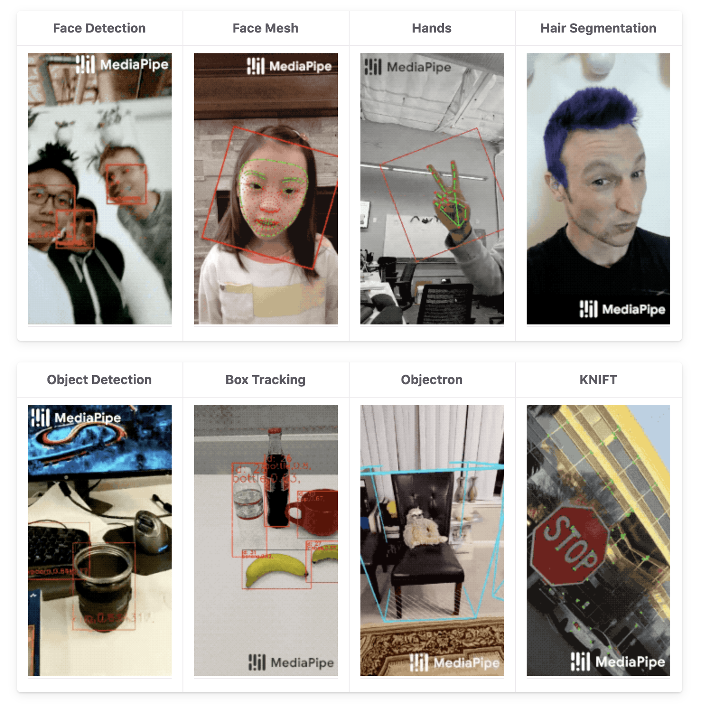

# google/mediapipe で始めるARアプリ開発

<!-- 
mediapipeって何？何ができるの？
もしかしてMLとかいうやつ？難しそう
デモ
他にもこんなことができます。
これからこんな解説をします。
・ビルドの仕方
・使ってみる
・ARKitとの連携
・できること、できないこと
ゴール
mediapipeとARKitを使ってアプリを作る
 -->

## レギュラートーク（20分）

### noppe

<!-- 今日はgoogle/mediapipeを使ったARアプリの開発についてトークをします。 -->
<!-- 私はnoppeという名前で、DeNAでライブ配信アプリのエンジニアをしていたり、個人でVTuber向けの自撮りアプリを開発しています。 -->
---

# What's mediapipe

---

# google/mediapipe

- クロスプラットフォームのMLパイプライン構築ソリューション

<!-- これ自体はiOSのフレームワークだったりするわけではなく、mediapipeを使って構築したパイプラインをビルドしてiosのフレームワークを作る事になります。 -->

---

# google/mediapipe

ML推論は１つで完結しないため、前後の処理を繋げる必要がある。
これらを簡単に記述できる。

---

# MLって難しいやつでしょ👋

<!-- こう思うと思います。 -->

---

# google/mediapipe

すぐに使えるパイプラインが実装されている

---

# デモ

---

# 豊富な実装

---

# アジェンダ

- mediapipeでのビルド方法
    - ハンドトラッカーのフレームワークを作る
- ARKitとの連携
- できる事・できない事

---

# mediapipeのビルド方法

- bazelbuild/bazel
ビルドツール

- bazelbuild/tulsi
xcodeproj生成ツール

<!-- bazel自体はmediapipe専用のツールというわけではなく、汎用的なビルドツール -->
<!-- bazelを実行するRunScriptを持つxcodeprojを生成する -->

---

# ハンドトラッカーフレームワークを作る

---

# bazelの簡単な使い方

- コードを書く
- BUILDファイルに成果物の情報や依存性などを記述する
- bazel buildする
- ipaやframeworkが出来上がる

---

# コードを書く

- HandTracker.h,mm

---

# BUILDファイル書く

---

# bazel buildする

---

# frameworkが出来上がる

- githubに置いておきました

---

# ARKitとの連携

RealityKitで

- arView.sessionを使ってcaptureImageを取り出す
- PixelFormatを変換
- HandTrackerの推論を利用する

---

# できる事出来ない事かまとめ

---
---

以下めも

---

<!-- mediapipeはgoogleによる、ternsorflowのパイプラインを提供するOSSプロジェクトです。 -->

<!-- mediapipeを使う事で、複雑なパイプライン処理を簡潔に記述することが出来ます。 -->

---

<!-- またmediapipeは一般的な課題を解決するためのパイプラインが事前に実装されており、次のような機能をすぐに利用することができます。 -->

---

# mediapipeで出来ること
- basic
普通のやつ
- advance
頑張ればこういうのも出来る
- technicue
応用すればARKitとも…

---

# mediapipeのセットアップ
- bazel
- tulsi
- 実行まで

---

# arkitとのインテグレーション
- ARKitの抜け道
- argbの変換
- mediapipeとの連結

---

# ハンドトラッキングの連携

x,y,zの説明
https://github.com/google/mediapipe/issues/742
全て正規化されている

landmarkの意味

問題点
    zが厄介、これ自体は手首の位置を表しているため
    回転も取れない
デプスを利用して解決出来る？

---

# OSSを公開します
終わり

---

https://fortee.jp/iosdc-japan-2020/proposal/10e8ee31-d3b9-493f-87a8-4cf6169dad5d