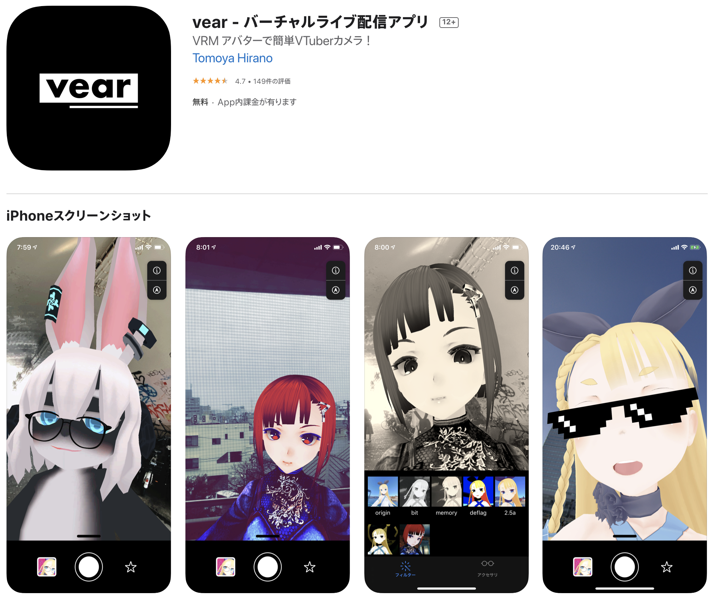
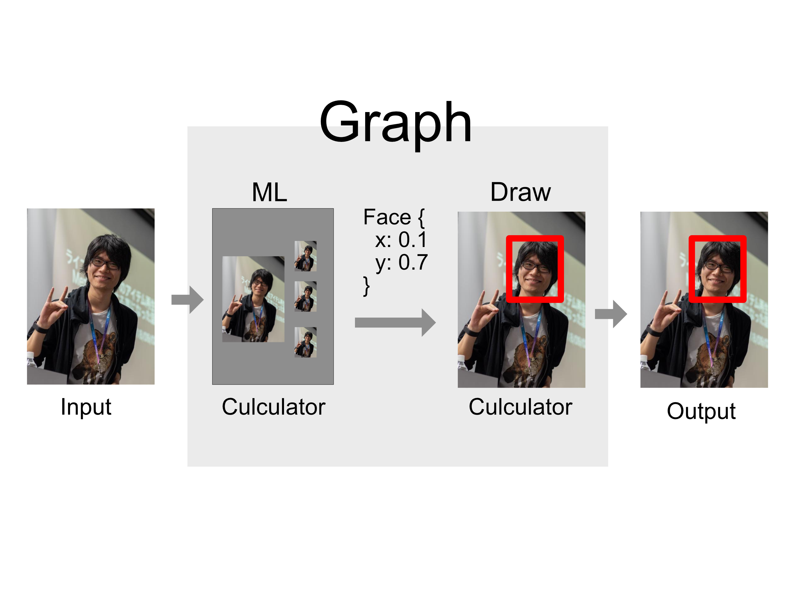
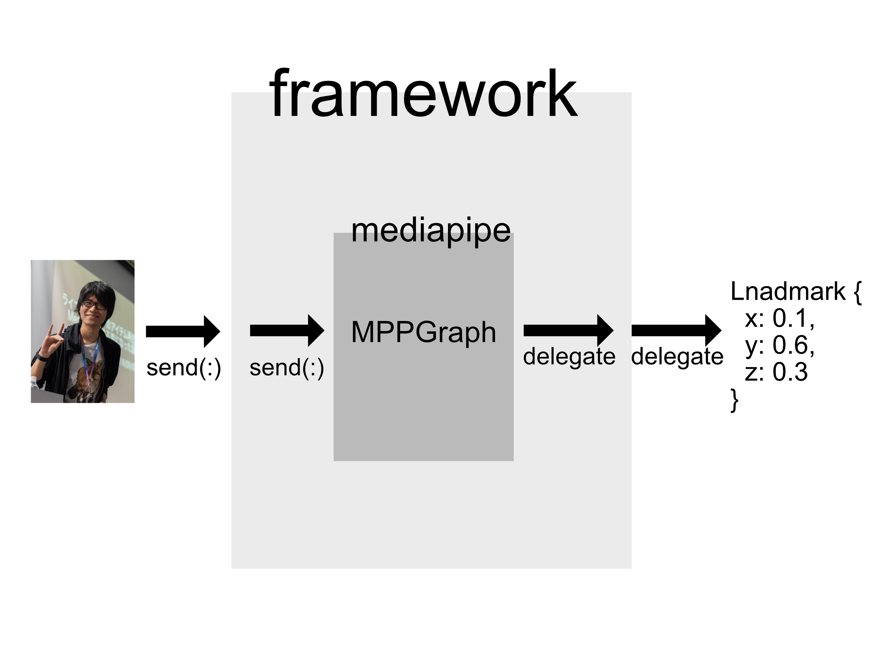
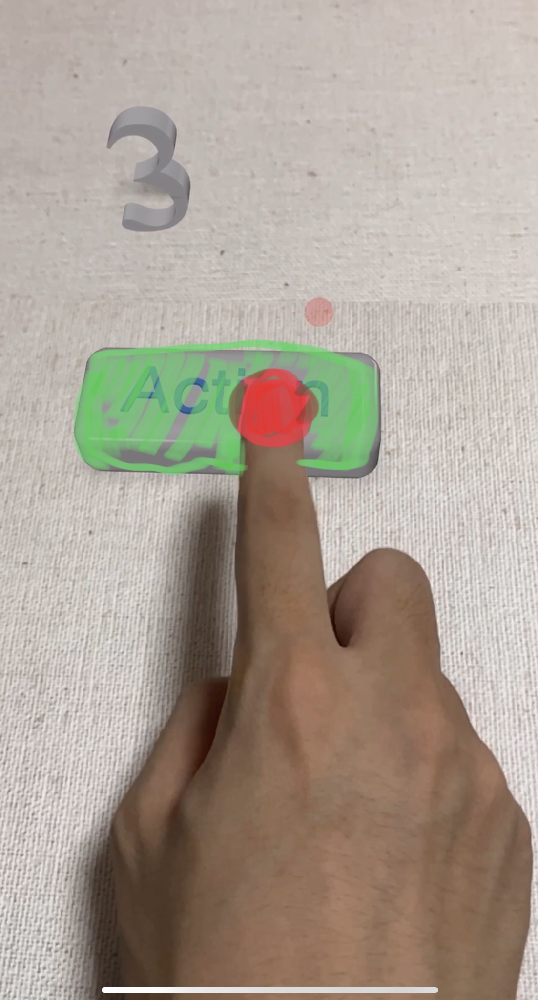
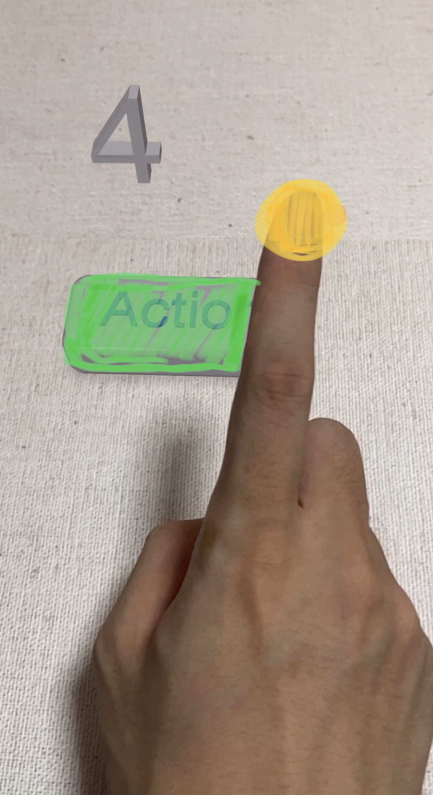

slidenumbers: true

# google/mediapipe で始めるARアプリ開発

## レギュラートーク（20分）

### noppe

^ はいこんにちは、こんばんはnoppeと言います。
^ 今日はgoogleのmediapipeというツールを使ったARアプリの開発についてトークをします

---

# 対象

- ARアプリに興味がある
- トラッキングに興味がある
- 機械学習分からなくても問題ありません。

^ 今日のトークの対象ですが
^ ARアプリに興味がある人やオブジェクトのトラッキングに興味が方は是非聞いていただければと思います。
^ また、mediapipeが機械学習に関するものだと知っている方は、難しい話をするのでは？と思っているかもしれませんが、今日は機械学習に関する話はしないので全く問題ありません。

---

# noppe

- 株式会社ディー・エヌ・エー
  - ソーシャルライブアプリ Pococha

- 個人開発者
  - vear
  ReplayKitでスマホから配信できるVTuberアプリ

- iOSDC18,19

- きつねが好き


^ 最初に自己紹介をさせてください。
^ 株式会社DeNAでiOSアプリエンジニアをしているnoppeと言います。

---


^ 普段はソーシャルライブアプリのPocochaというアプリを開発しています。
^ Pocochaでは、今回紹介するmediapipeは利用していませんが類似のMLエンジンを利用しています。
^ 興味のある方は是非トークのあとでお聞きいただければと思います。

---



^ また、個人開発でアバターを使ったVTuberアプリのvearを開発しています。
^ 今回のトークはこのvearでmediapipeが使えないかと試した際の共有になります。

---

# noppe

- 株式会社ディー・エヌ・エー
  - ソーシャルライブアプリ Pococha

- 個人開発者
  - vear
  ReplayKitでスマホから配信できるVTuberアプリ

- iOSDC18,19

- きつねが好き


^ あとはiOSDC18,19で透過動画の再生手法やデジタル化粧に関するトークをしました。
^ そしてきつねがとても好きで、今回は狐の姿で登壇します。

---

# mediapipe とは？

^ では早速本題に入りましょう、mediapipeとはなんでしょうか

---

# mediapipe

[github.com/google/mediapipe](github.com/google/mediapipe)

- 処理(Culculator)を繋げてパイプライン（Graph）を構築するツール

- 主に画像処理のパイプライン構築に使われる

- ML処理を混ぜ込む事が出来る

^ mediapipeは画像処理を繋げてパイプラインを構築するツールです。
^ 画像処理の部分をmediapipeではCulculator、パイプラインをGraphと言います。
^ 似たようなライブラリにGPUImageやCIFilterがありますが、mediapipeは中間処理としてMLのCulculatorを混ぜ込むことができるのが特徴です。

---



^ この図は顔の位置に赤い四角を描画するパイプラインを図解したものです。
^ このように、MLによる顔の位置推定を画像処理の間に挟み込むことで入力から出力までを完結に書く事ができます。


---


^ オブジェクト検出によっては複雑な処理分岐や合流、リトライなどが必要になります。
^ mediapipeのグラフはvisualizerを使う事でこのような図として出力する事ができ、処理の流れを把握しやすく出来る点も利点と言えます。

---

# mediapipe

Culculatorは、実装済みの物も使える

- LuminanceCalculator
RGBを受け取り、輝度画像を出力する

- SobelEdgesCalculator
Sobelフィルタをかけた画像を出力する

...etc

^ 組み合わせていくCulculatorは自分で書くことも当然出来ますが、mediapipeのリポジトリには実装済みのCulculatorがいくつかあります。
^ 例えばLuminanceCalculatorは...
^ ソーベルは1次微分フィルタともいって画像のエッジを際立たせるんですけど、そういったフィルタもリポジトリに入ってます。
^ ソーベルだけだとエッジ抽出微妙だなぁって時にその前段で輝度上げて補正するみたいなことができるわけですね

---


^ そんな感じで例えばこんなものを作ることもできます。
^ 左は上半身の関節位置の推定
^ 右は映像から手の位置と関節を推定して描画するGraphです。

---

# 実装済みのGraph

これらの実装はすぐに使える[^ios]

今日はこれを使う流れを解説


[^ios]:一部iOSでは実装がないものもある

^ さっきのは自分がGraphを組んだわけじゃなくて、mediapipeに含まれているグラフ実装です。
^ さっきの２つ以外にも構築済みのGraphがあるので、これらを使って入門するのがおすすめです。
^ 今日はこの構築済みGraphを使ってARアプリを作っていきます。

---

# アジェンダ

- グラフのビルド
- ARKitとの連携
- できる事・できない事

^ 今日のアジェンダです。
^ mediapipeをフレームワークとしてビルド際の方法が少し特殊なので、順を追って説明します。
^ 次に作ったフレームワークをARKitと連携する方法を解説
^ 最後にmediapipeで出来る事、出来ないことをまとめて終わろうと思います

---

# グラフのビルド

---

## github.com/noppefoxwolf/HandTracker

今回使うソースコード


^ 今回使うソースコードはgithubのnoppefoxwolf/HandTrackerに置いているので、是非コードをみながらトークを聞いてもらえればと思います。

---

# Graph

- 構築したGraphはバイナリとしてビルドすることができる

- バイナリをObjCから使う実装があるので、それらを使ってフレームワークを作る事ができる。

- 今日はデモで紹介したハンドトラッカーをフレームワークとしてビルド


^ 最初にmediapipeのGraphについて触れましたが、Graphはバイナリとしてビルドすることができます。
^ そして、そのバイナリをObjCから使う実装がmediapipeにはあるので、それらを使ってcocoaフレームワークを作る事ができます。
^ 今日はさっきデモしたハンドトラッカーをフレームワークとしてビルドしていきます。

---


^ みなさんOSSをビルドする時にxcodeprojを開こうとすると思いますが、mediapipeにはxcodeprojがないです。

---

# グラフのビルド

ビルドツールを使ってビルドを行う

- bazelbuild/bazel (ベイゼル)

  - KubernetesやTensorFlowで採用


Track E - Ryo Aoyama 
**Bazelを利用したMicro Modular Architecture**


^ じゃあどうやってビルドするかというと、bazelというビルドツールを使います。
^ bazelはこれまたgoogleが作っているビルドツールで、KubernetesやTensorFlowで採用されてたりします。
^ あとさっきTrack Eで青山さんが詳しい話をしてると思います。

---

# グラフのビルド

bazelのインストールはスクリプト落としてきて実行するだけ

```sh
curl -LO "https://.../bazel-3.2.0-installer-darwin-x86_64.sh"

chmod +x "bazel-3.2.0-installer-darwin-x86_64.sh"

./bazel-3.2.0-installer-darwin-x86_64.sh
```

^ インストールは簡単でbazelのスクリプト落としてきて実行するだけです

---

# グラフのビルド

Xcodeでもビルドができる[^tulsi]
- bazelbuild/tulsi

[^tulsi]:BuildPhaseScriptでbazelを叩くだけなので、必須ではない

^ で、じゃあXcodeで開発できないの？っていうとそうではなくて、tulsiというツールを使うことでXcodeを使うことができます。
^ tulsiはXcodeGenのように、bazelの設定ファイルをベースにXcodeprojを生成してくれます。が、実はBuildPhaseScriptのタイミングでbazelを呼んでるだけなので特に必須というわけでもなく、好みが分かれるところかなと思います。
^ 今回は使いません。

---

# グラフのビルド

tulsiはビルドスクリプト叩くだけでインストールできる（要bazel）

```sh
git clone git@github.com:bazelbuild/tulsi.git
./build_and_run.sh
```

^ tulsiはbazelを入れてあれば、cloneしてスクリプト叩くだけでインストールができます。簡単ですね

---

# そのほか必要なもの

- Xcode
- 時間
- ネットワーク

^ あとはXcodeと時間があれば大丈夫です、bazelはビルドのタイミングで依存性を取得してきたり、サブモジュールのビルドをしたりするので時間に余裕を持って作業にかかりましょう

---

# ビルドの流れ

1. フレームワークのコードを書く
2. BUILDファイルに成果物の情報や依存性などを記述する
3. bazelでbuildする
4. frameworkが出来上がる

^ 準備ができたら、ビルドの流れを確認します。
^ まずObjCでフレームワークのコードを書きます。グラフのバイナリを読み込んだり、画像を渡したりと言ったほとんどmediapipeのラッパーのような実装になりますが、mediapieはC++で書かれているため、ここでSwiftでも扱えるようにObjCの層を挟みます。
^ 次にBUILDファイルを書きます。BUILDファイルはbazelの設定ファイルみたいなやつです。
^ 最後にビルドしてフレームワークを生成します。

---

# フレームワークのコードを書く

---

# フレームワークのコードを書く

1. binarypbを読み込んでMPPGraphを作る
2. MPPGraphを開始する
3. MPPGraphに画像を送る
4. delegateで結果を受け取る

^ フレームワークはこんな感じのコードを書いていきます。
^ 構築したmediapipeのGraphはbinarypbという形式でフレームワークバンドルされるので
^ これを読み込んでMPPGraphクラスのインスタンスを作ります
^ あとはMPPGraphを初期化して、画像を渡して推定結果を受け取るという流れになってます。

---



^ これによって出来上がったフレームワークは図解するとこんな感じになります。
^ mediapipeのラッパーを書く事でC++を隠蔽出来るので、Swiftから使ったりアプリの開発からbazelを切り離す事ができます。
^ mediapipeのサンプルではアプリ自体もbazelで管理しているため、そのような開発方法が主流と思われがちですが、このようにフレームワークとしてビルドする事で通常のアプリに組み込みやすくなります。

---

# binarypbを読み込んでMPPGraphを作る

[.code-highlight: 2]
[.code-highlight: 3-5]
[.code-highlight: 6]

```objc
+ (instanceType) init {
  NSURL* url = [NSURL ...@"hand_landmarks.binarypb"];
  NSData* data = [NSData dataWithContentsOfURL:url options:0 error:nil];
  mediapipe::CalculatorGraphConfig config;
  config.ParseFromArray(data.bytes, data.length);
  self.graph = [[MPPGraph alloc] initWithGraphConfig:config];
}

```

^ ではまずはGraphを読み込んでいきます。
^ このコードはフレームワークのクラスの初期化のタイミングに行うと良いかと思います。
^ 手の検出に使われるhand_landmarkのグラフを読み込みます。グラフはbinarupb形式でバンドルされているのでBundle.mainなどから取り出します。
^ そしてNSDataとして読み込み、CalculatorGraphConfigにデータ配列を読ませます。
^ 最後にCalculatorGraphConfigを使ってMPPGraphのインスタンスを作ります。

---

# MPPGraphを開始する

Graph内で利用する各種コンポーネントの初期化が行われる

```objc
- (void)start {
  [graph startWithError: nil];
}

```

^ MPPGraphはインスタンス作っただけだと、内部の処理が初期化されないのでstartWithErrorというメソッドを呼んで初期化します。

---

# MPPGraphに画像を送る

```objc
- (void)sendPixelBuffer:(CVPixelBufferRef)pixelBuffer {
    [self.mediapipeGraph sendPixelBuffer:pixelBuffer
                              intoStream:@"input_video"
                              packetType:MPPPacketTypePixelBuffer];
}
```

^ 次に画像を渡すメソッドを定義します。
^ 画像と言ったんですけど、ここで使うのはUIImageではなくてCVPixelBufferです。
^ CVPixelBufferはカメラとかでよく使う画像のクラスです。
^ ここまで定義したメソッドは外部から呼べるようにヘッダにも書いておきましょう。

---

# delegateで結果を受け取る

```objc
- (void)mediapipeGraph:(MPPGraph*)graph
       didOutputPacket:(const ::mediapipe::Packet&)packet
            fromStream:(const std::string&)streamName
{
    const auto& timestamp = packet.Timestamp().Value();

    const auto& landmarks = packet.Get<::mediapipe::NormalizedLandmarkList>();

    NSArray *landmarkObjects = [self toObject: landmarks];

    [delegate didOutputLandmarks: landmarkObjects];
}
```

^ 最後にMPPGraphのDelegateで推論結果を受け取ります。
^ packetという型からタイムスタンプや推定結果の手の位置などが取れます。
^ ここで取れるのはC++の構造体なので、ここで一旦NSObjectを継承したクラスに詰め直したりして、Delegateで返してあげます。

---

# BUILDファイル書く

^ 次にBUILDファイルを書きます。

---

# BUILDファイルとは

bazelでビルドするファイルや依存関係を記述したファイル

^ BUILDファイルはbazelでビルドするファイルや依存関係を記述したファイルです。
^ 実際に見てみましょう

---

```py
objc_library(
    name = "HandTrackerLibrary",
    hdrs = ["HandTracker.h"],
    srcs = ["HandTracker.mm"],
    data = [
      "hand_tracking:hand_tracking_mobile_gpu_binary_graph",
      ...
    ],
    deps = [
        "//mediapipe/objc:mediapipe_framework_ios",
        "//mediapipe/objc:mediapipe_input_sources_ios",
        "//mediapipe/graphs/hand_tracking:mobile_calculators",
        "//mediapipe/framework/formats:landmark_cc_proto",
    ],
    ),
)
```

^ これはBUILDファイルを抜粋したものですが、なんとなく見ればわかると思います。
^ ヘッダとソースと指定して、dataはバンドルするものを指定してます。
^ あとdepsに依存関係を記述します。

---


^ ファイルの配置ですが、BUILDファイル、ObjCのファイルをこんな感じでmediapipeの中に配置します。
^ 別々にすることも出来るのですが、今回は書くものを減らしたいので依存先を取りに行きやすいようにこう言った構造にしています。

---

# bazelでビルドする

```
$ bazel build mediapipe/iosdc:HandTracker
```

^ 先ほどのように配置しておくと、ビルドのコマンドがすっきりします。
^ bazel buildに、pathの後にコロンを付けてBUILDファイルに書いたライブラリ名を渡して実行するとビルドされます。

---

# frameworkが出来上がる

githubに置いておきました

https://github.com/noppefoxwolf/HandTracker

^ 成功するとフレームワークをzipで固めたものが生成されます。
^ 今回は生成されたフレームワークをアップロードしておきました。Carthageで簡単に入れられるので是非試してみてください。
^ 機能を足したり改造したい場合は先ほどの解説を参考にしてもらえればと思います。

---

# ARKitとの連携

^ 次にARKitとの連携の仕方を紹介します。

---

# ARKitとの連携

ARKitの仕様上出来ない事をmediapipeで補うことで、表現力を解放できる

- AR空間上のオブジェクトを手で操作する
- 検出したオブジェクトの横にキャラクターを配置する
- 顔の骨格を補正しながら髪色を変える[^hair]

[^hair]:Hair Segmentationは現状iOS非対応ですが

^ そもそも、ARKitとmediapipeを一緒に使うと何が嬉しいのかということですが
^ ARKitの仕様上出来ない事をmediapipeで補うことで、表現力を解放することが出来ます。
^ やってること自体はvision.frameworkなどでARKitの補助をするというのと変わらないのですが、mediapipeの構築済みgraphがとにかく強力なので特に自分で学習モデルを作るのが難しい人にはおすすめの方法です。

---

# ARKitとの連携アプリ開発

こんなものを作ります

---


^ AR空間上にボタンを配置して、指で押すとカウントが増えるアプリを作ります。

---

# ARKit連携の流れ

1. ARFrameからcaptureImageを取り出す
2. PixelFormatを変換
3. Trackerへ送る
4. Delegateで結果を受け取る
5. RealityKitのボタンを上下・カウントを表示


^ 連携の流れですが、こんな感じになります。

---

# ARFrameからcaptureImageを取り出す

- captureImage = カメラからの映像

```swift
arSession.delegate = self
...
// ARSessionDelegate
func session(_ session: ARSession, didUpdate frame: ARFrame) {
  let captureImage: CVPixelBuffer = frame.capturedImage
}
```

^ ARSessionのDelegateを使うことで、カメラから取得した画像を取り出すことができます。

---

# PixelFormatを変換

画像データがどのように格納されているかを表している

- ARKitでは**YCbCr**形式
- mediapipeは**BGRA**のみを受け取れる
→変換の必要がある

^ このARKitから取り出したPixelBufferはYCbCrというpixelFormatで返ってきます。
^ PixelFormatは画像データがどのように格納されているのかを表しているのですが
^ mediapipeはBGRAのみを受け取れるようになっているので、画像を変換する必要があります。

---

# kCVPixelFormatType_32BGRA

1ピクセル32bitで表現するフォーマット

B:FF G:00 R:00 A:FF → 赤

^ BGRAは１ピクセルを32bitで表現するフォーマット

---

# kCVPixelFormatType_420YpCbCr8BiPlanarFullRange

- 2枚のY(8bit)+CbCr(16bit)の組み合わせで1フレームを表現するフォーマット

- 軽量なのでビデオデータで使われることが多い

<!-- Yが8bit、CbCrが半分のサイズの16bitなので軽量 -->

^ YCbCrは2枚のY+CbCrの組み合わせで1フレームを表現するフォーマットです。軽量なのでビデオデータで使われることが多いです。

---

# YCbCrからBGRAへの変換

- Accelerate
  - vImage
- Metal
  - MSL

GPUを使う分Metalの方が高速

^ iOSでこれらを変換する場合、２つ方法があってAccelerateのvImageを使う方法とMetalを使う方法があります。
^ 多分検索するとvImageの方も上に出てくるんですけど、これはCPUで計算するのであんまり早くないはずです。
^ 今回はMetalで実装しました

---

# YCbCrからBGRAへの変換

次の計算式で変換ができる

```
R = Y + 1.402 × Cr
G = Y - 0.344136 × Cb - 0.714136 × Cr
B = Y + 1.772 × Cb
A = 1
```

^ YCbCrからRGBへの変換はこの計算式でできます。
^ AlphaはYCbCrにはないので1を渡します。

---

# BlueDress

YCbCrからBGRAに高速コンバートするライブラリ

https://github.com/noppefoxwolf/BlueDress

^ 変換処理自体はそんなに難しくないのですが、Metalを使ったりするのでハードルを感じるかもしれません。
^ BlueDressというライブラリを作っておいたのでさくっと変換したいだけの人は使ってみてください。
^ Xcode12以上でSwiftPMを使って導入できます。

---

# Trackerへ送る

```swift
let captureImage = frame.capturedImage
let bgraCaptureImage = converter.convertToBGRA(captureImage)
handTracker.send(bgraCaptureImage)
```

^ 先ほどのBlueDressを使ってbgraのImageBufferを作り、トラッカーに送ります。

---

# Delegateで結果を受け取る

関節の位置はX,Y,Zで取れます…が、世界座標系では無く
X,Y: Screen座標系
Z: 手首からの奥行き
しか取れません。残念！

^ 最後にtrackerのdelegateからmediapipeから推定された関節位置を取るのですが、ここではまりどころがあります。
^ 位置はx,y,zを取ることが出来るのですが、これが所謂世界座標系ではありません。
^ x,yはそれぞれスクリーン座標系で、zは手首からの奥行きを表しています。
^ つまりカメラからどれくらいの距離に手があるのかというのは取れないわけです。

---





^ そのため、映像の中で指がボタンに重なっているか否かで判定を行うことにしました。
^ 極論とても手前に手があってボタンが凄い奥にあっても押せてしまいますが、今回はデモなのでよしとします。

---

# RealityKitのボタンを上下・カウントを表示

今回は人差し指の延長線上にEntityがあれば、isPressをtrueにする

```swift
func handTracker(_ handTracker: HandTracker!, didOutputLandmarks landmarks: [Landmark]!) {
  let indexFinderPosition = landmarks[8]
  let screenLocation: CGPoint = ...(indexFinderPosition)
  self.isPress = arView
    .entities(at: screenLocation)
    .contains(where: { $0.id == self.buttonEntity.id })
}
```

^ 重なりの判定は人差し指のx,yにentityがあるかどうかで判定します。
^ これはARViewのentities(at:Point)を使うと簡単に実装できます。
^ 今回はRealityKitを使っていますがSceneKitやUnityでも同じ仕組みで同じことができます。

---

# RealityKitのボタンを上下・カウントを表示

```swift
private func press() {
  self.scene.notifications.press.post()
  count += 1
  changeText("\(count)")
}
```

^ 人差し指の位置がentityに重なったら、RealityKitのpressを呼んでボタンを少し下に移動するアニメーションを実行します。
^ あとカウンターをインクリメントしてテキストを更新します。

---


^ RealityComposerはこんな感じで設定してます。
^ ここで設定したpressというメソッドをswiftから呼ぶ事ができます。

---


^ このような流れで、RealityKitを使いながらmediapipeのハンドトラッキングを合わせて、指で操作するカウンターアプリを作ることができました。

---

# できる事できない事

^ 最後に今回mediapipeを使ってみて感じた箇所を共有します。

---

# 気になるところ

- HandTrackerはカメラからの距離が取れるわけではない事に注意
→Irisでは奥行きが取れる

- 各関節の回転も取れない
→自分で計算して自然に見せる工夫が必要

- フレームワークサイズがまぁまぁでかい
→100MBくらい

^ まず気になる点ですが、先ほど解説した通り手までの距離は取れない点には注意です。
^ しかし、この点はirisという目の位置を推定するグラフでは取得できていたので今後のアップデートで取れるようになるかもしれません。

^ 二つ目は各関節の回転が取れないという点。
^ 例えばアバターなどに適用する場合に、微妙な関節の回転が必要になりますがこれは各関節の位置から自分で計算する必要があります。

^ またフレームワークのサイズにも注意する必要があります。
^ 今回の方法でビルドして100MB程度あったので、アプリサイズに対して大きなインパクトがあります。

---

# いいところ

- 実装済みのグラフが非常に質が高い

- OSS

- マルチプラットフォーム

^ 次にmeidapipeの良い点ですが、今回のトークを通して分かったように実装済みのグラフが非常に高い品質である事が挙げられます。
^ ハンドトラッカーSDKは世の中にいくつか存在しますが、その中でも精度が高く、fpsのスコアも良いと感じました。
^ また、OSSである点から自分の用途にあった処理を構築しやすいところも魅力的です。
^ mediapipeのブログでは、処理に関する記事も公開されているので非常に入門ハードルが低いとも言えます。
^ そして今回は紹介しませんでしたが、androidやwebでも同じグラフを動作させる事ができます。
^ firebaseのMLKitでも内部的に使われているようなので、安心して使う事ができるかと思います。

---

# やってみたいこと

- HairSegmentationなどをiOSに対応していないのは何故なのか調べたい
- NSObjectを経由しなければ高速化が望めるのでは
- ランドマークだけを出力するグラフを作ってみたい

^ 今後やってみたい事ですが、一部iOSに対応していないグラフがなぜ対応しないのかや、
^ フレームワークにした際のパフォーマンスを最適化すると言ったことをしてみたいと考えています。

---

# ご清聴ありがとうございました
