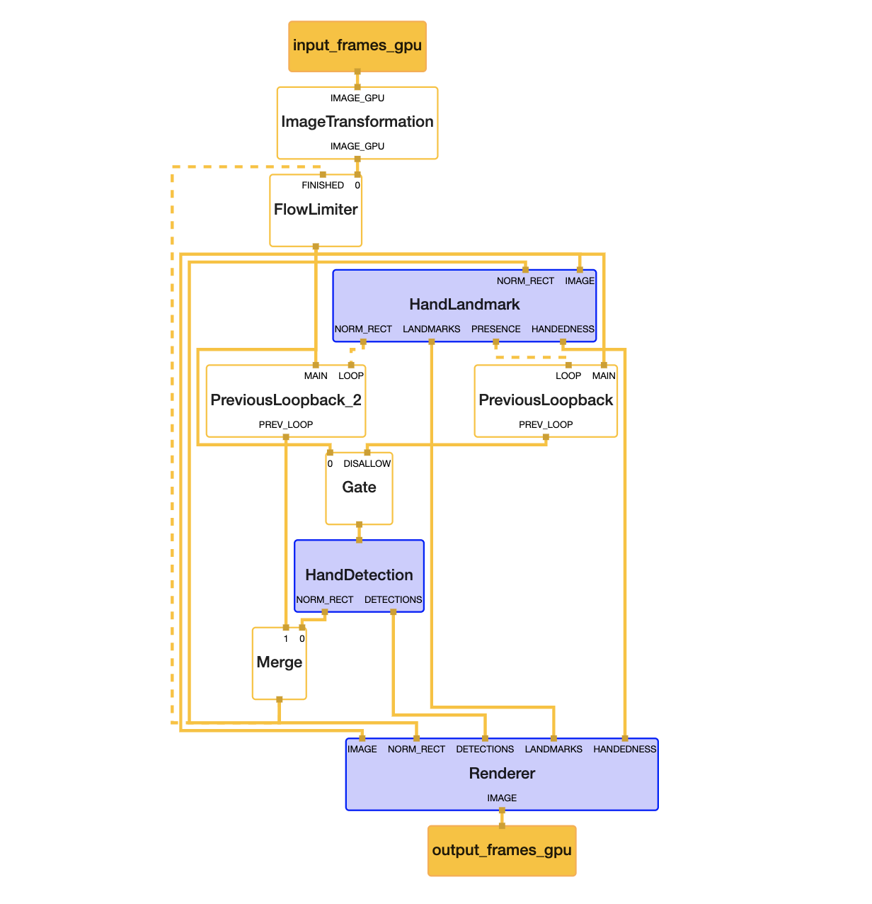
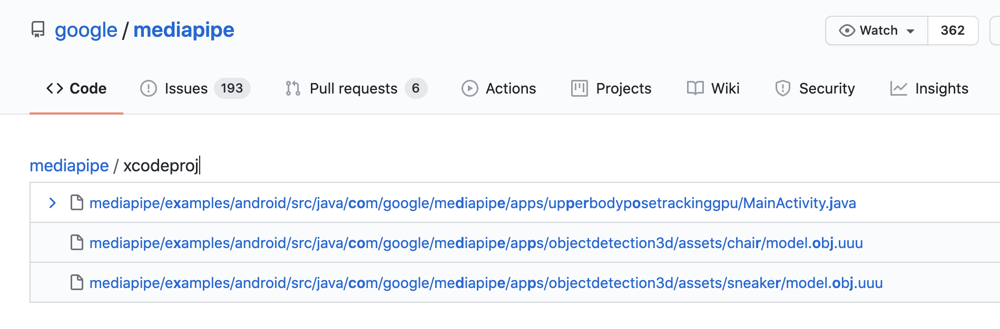
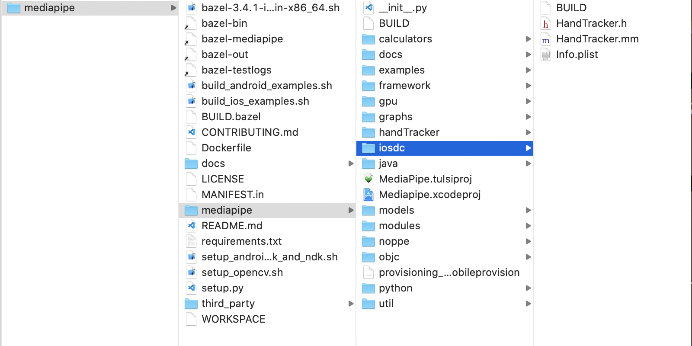
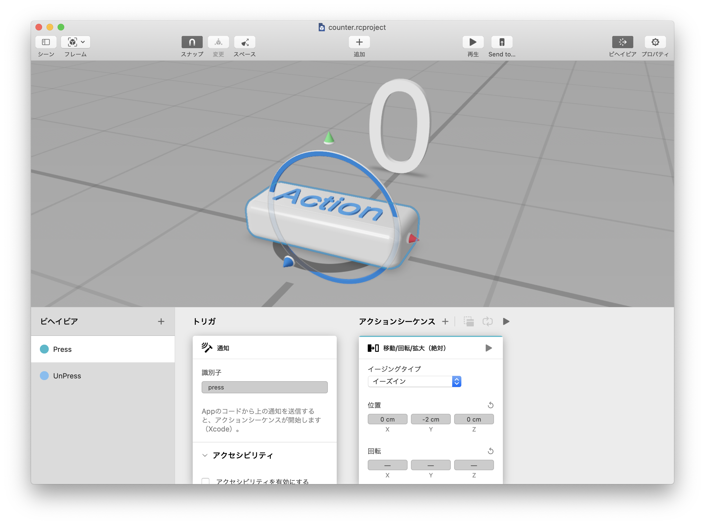

slidenumbers: true

# google/mediapipe で始めるARアプリ開発

## レギュラートーク（20分）

### noppe

^ はいこんにちは、こんばんはnoppeです
^ 今日はmediapipeというツールを使ったARアプリの開発についてトークをします

---

# 対象

- ARアプリに興味がある
- トラッキングに興味がある
- 機械学習分からない人も大歓迎

^ 今日のトークはARアプリに興味がある人、オブジェクトのトラッキングに興味がある人大歓迎です
^ そして、機械学習分からない人も大歓迎です。ちなみに機械学習は自分も分かってないです。

---

# noppe

- 株式会社ディー・エヌ・エー
  - ソーシャルライブアプリ Pococha

- 個人開発者
  - vear
  ReplayKitでスマホから配信できるVTuberアプリ

- iOSDC18,19


^ 株式会社DeNAでiOSアプリエンジニアをしているnoppeです


---

# mediapipe とは？

^ では早速本題に入りましょう、mediapipeとはなんでしょうか

---

# mediapipe

[github.com/google/mediapipe](github.com/google/mediapipe)

- 処理(Culculator)を繋げてパイプライン（Graph）を構築するツール

- MLの処理も連結出来る

- 手のトラッキングであれば
  "手のひらを見つける"→"指の関節を見つける"



^ 処理を繋げてパイプラインを構築するツールです。
^ CulculatorにはMLの処理を混ぜることもできます。
^ 例えばハンドトラッキングを作る場合に、いきなり画像の中から親指の位置を見つけるのは大変なので手のひらを見つけるモデルで推定して、その位置から親指を探したりします。
^ そういうのが完結に簡単にかけるっていうのがmediapipeの魅力です。
^ 構築したグラフはvisualizerに食わせることができて、右手の画像みたいに出力することもできます。

---

# mediapipe

繋げる処理（Culculator）は、実装済みの物も使える

- LuminanceCalculator
RGBを受け取り、輝度画像を出力する

- SobelEdgesCalculator
Sobelフィルタをかけた画像を出力する

...etc

^ で、組み合わせていくCulculatorは自分で書くことも当然できるんですけど、既に結構mediapipeのリポジトリに実装済みのものがあります。
^ 例えばLuminanceCalculatorは...
^ ソーベルは1次微分フィルタともいって画像のエッジを際立たせるんですけど、そういったフィルタもリポジトリに入ってます。
^ ソーベルだけだとエッジ抽出微妙だなぁって時にその前段で輝度上げて補正するみたいなことができるわけですね

---


^ そんな感じで例えばこんなものを作ることもできます。
^ 左は上半身の関節位置の推定
^ 右は映像から手の位置と関節を推定して描画するGraphです。

---

# 実装済みのGraph

これらの実装はすぐに使える[^ios]

今日はこれを使う流れを解説


[^ios]:一部iOSでは実装がないものもある

^ さっきのは自分がGraphを組んだわけじゃなくて、mediapipeに含まれている実装です。
^ さっきの２つ以外にも構築済みのGraphがあるので、これらを使って入門するのがおすすめです。
^ 今日はこの構築済みGraphを使ってARアプリを作っていきます。

---

# アジェンダ

- フレームワークのビルド
- ARKitとの連携
- できる事・できない事

^ 今日のアジェンダです。
^ フレームワークのビルド方法が少し特殊なので、順を追って説明します。
^ 次に作ったフレームワークをARKitと連携する方法を解説
^ 最後にまとめて終わろうと思います

---

# フレームワークのビルド

---

# github.com/noppefoxwolf/HandTracker/

今回使うソースコード

^ 今回使うソースコードはここに置いているので、保管しながら聞いてもらえればと思います。

---

# mediapipe

- 構築したGraphはフレームワークとしてビルドすることができる

→ 自分のアプリに組み込むことができる

- 今日はデモで紹介したハンドトラッカーをフレームワークとしてビルド


^ そして構築したGraphはビルドすることができます。
^ mediapipeのサンプルはアプリ自体をビルドするものしかないので、勘違いしがちなんですけど、ちゃんと設定すればフレームワークとしてビルドできます。
^ 今日はさっきデモしたハンドトラッカーをフレームワークとしてビルドしていきます。

---



^ みなさんOSSをビルドする時にxcodeprojを開こうとすると思いますが、mediapipeにはxcodeprojがないです。

---

# フレームワークのビルド

ビルドツールを使ってビルドを行う

- bazelbuild/bazel (ベイゼル)

  - KubernetesやTensorFlowで採用


Track E - Ryo Aoyama 
**Bazelを利用したMicro Modular Architecture**


^ じゃあどうやってビルドするかというと、bazelというビルドツールを使います。
^ bazelはこれまたgoogleが作っているビルドツールで、KubernetesやTensorFlowで採用されてたりします。
^ あとさっきTrack Eで青山さんが詳しい話をしてると思います。

---

# フレームワークのビルド

bazelのインストールはスクリプト落としてきて実行するだけ

```sh
curl -LO "https://.../bazel-3.2.0-installer-darwin-x86_64.sh"
chmod +x "bazel-3.2.0-installer-darwin-x86_64.sh"
```

^ インストールは簡単で~

---

# フレームワークのビルド

Xcodeでもビルドができる[^tulsi]
- bazelbuild/tulsi

[^tulsi]:BuildPhaseScriptでbazelを叩くだけなので、必須ではない

^ で、じゃあXcodeで開発できないの？っていうとそうではなくて、tulsiというツールを使うことでXcodeを使うことができます。
^ tulsiはXcodeGenのように、bazelの設定ファイルをベースにXcodeprojを生成してくれます。が、実はBuildPhaseScriptのタイミングでbazelを呼んでるだけなので特に必須というわけでもなく、好みが分かれるところかなと思います。
^ 今回は使いません。

---

# フレームワークのビルド

tulsiはビルドスクリプト叩くだけでインストールできる

```sh
git clone git@github.com:bazelbuild/tulsi.git
./build_and_run.sh
```

^ tulsiはbazelを入れてあれば、cloneしてスクリプト叩くだけでインストールができます。簡単ですね

---

# そのほか必要なもの

- Xcode
- 時間
- ネットワーク

^ あとはXcodeと時間があれば大丈夫です、bazelはビルドのタイミングで依存性を取得してきたり、サブモジュールのビルドをしたりするので余裕を持って作業にかかりましょう

---

# ビルドの流れ

- ObjCでコードを書く
- BUILDファイルに成果物の情報や依存性などを記述する
- bazelでbuildする
- ipaやframeworkが出来上がる

^ 準備ができたら、ビルドの流れを確認します。
^ ObjCでコードを書きます、mediapipeが定義している構造体がC++のものだったりするので、これはしょうがないです。
^ 次にBUILDファイルっていうのを書きます。bazelの設定ファイルみたいなやつです。
^ 最後にビルドして、アプリとかフレームワークが出来上がっておしまい

---

# ObjCでコードを書く

---

# ObjCでコードを書く

1. binarypbを読み込んでMPPGraphを作る
2. MPPGraphを開始する
3. MPPGraphに画像を送る
4. delegateで結果を受け取る

^ こんな感じのコードを書いていきます。
^ 構築したmediapipeのGraphはbinarypbという形式でバンドルされるので
^ これを読み込んでMPPGraphクラスのインスタンスを作ります
^ あとはMPPGraphを初期化して、画像を渡して推定結果を受け取るという流れになってます。

---

# binarypbを読み込んでMPPGraphを作る

[.code-highlight: 1]
[.code-highlight: 2-4]
[.code-highlight: 5]

```objc
NSURL* url = [NSURL ...@"hand_landmarks.binarypb"];
NSData* data = [NSData dataWithContentsOfURL:url options:0 error:nil];
mediapipe::CalculatorGraphConfig config;
config.ParseFromArray(data.bytes, data.length);
MPPGraph* graph = [[MPPGraph alloc] initWithGraphConfig:config];
```

^ まずはGraphを読み込んでいきます。
^ urlのコードは適当ですが、実際はBundle.mainとかから取ってくる感じになると思います。
^ そしてNSDataとして読み込んで、CalculatorGraphConfigにデータ配列を読ませます。
^ 最後にCalculatorGraphConfigを使ってMPPGraphのインスタンスを作ります。

---

# MPPGraphを開始する

Graph内で利用する各種コンポーネントの初期化が行われる

```objc
[graph startWithError: nil];
```

^ 実はMPPGraphはインスタンス作っただけだと、内部の処理が初期化されてなかったりするのでstartWithErrorというメソッドを呼んで初期化します。

---

# MPPGraphに画像を送る

```objc
- (void)sendPixelBuffer:(CVPixelBufferRef)pixelBuffer {
    [self.mediapipeGraph sendPixelBuffer:pixelBuffer
                              intoStream:@"input_video"
                              packetType:MPPPacketTypePixelBuffer];
}
```

^ 次に画像を渡すメソッドを定義します。今はフレームワークを作っているので、Swiftから見えるように、こんな感じで定義しました。
^ 画像と言ったんですけど、ここで使うのはUIImageではなくてCVPixelBufferです。
^ CVPixelBufferはカメラとかでよく使う画像のクラスです。
^ ヘッダにメソッドを書いておくのも忘れないようにしましょう。

---

# delegateで結果を受け取る

```objc
- (void)mediapipeGraph:(MPPGraph*)graph
       didOutputPacket:(const ::mediapipe::Packet&)packet
            fromStream:(const std::string&)streamName
{
    const auto& timestamp = packet.Timestamp().Value();

    const auto& landmarks = packet.Get<::mediapipe::NormalizedLandmarkList>();

    
}
```

^ 最後にMPPGraphのDelegateで推論結果を受け取ります。
^ packetという型からタイムスタンプや推定結果の手の位置などが取れます。
^ ここで取れるのはC++の構造体なので、ここで一旦NSObjectを継承したクラスに詰め直したりして、Delegateで返してあげます。

---

# NormalizedLandmarkListの構造

```protobuf
message NormalizedLandmarkList {
  repeated NormalizedLandmark landmark = 1;
}

message NormalizedLandmark {
  optional float x = 1;
  optional float y = 2;
  optional float z = 3;
  optional float visibility = 4;
}
```

^ ちなみにpacketから取れるNormalizedLandmarkListはこんな感じの構造になってます。

---

# BUILDファイル書く

^ 次にBUILDファイルを書きます。

---

# BUILDファイルとは

bazelでビルドするファイルや依存関係を記述したファイル

^ BUILDファイルはbazelでビルドするファイルや依存関係を記述したファイルです。
^ 実際に見てみましょう

---

```py
objc_library(
    name = "HandTrackerLibrary",
    hdrs = ["HandTracker.h"],
    srcs = ["HandTracker.mm"],
    data = [
      "hand_tracking:hand_tracking_mobile_gpu_binary_graph",
      ...
    ],
    deps = [
        "//mediapipe/objc:mediapipe_framework_ios",
        "//mediapipe/objc:mediapipe_input_sources_ios",
        "//mediapipe/graphs/hand_tracking:mobile_calculators",
        "//mediapipe/framework/formats:landmark_cc_proto",
    ],
    ),
)
```

^ これはBUILDファイルを抜粋したものですが、なんとなく見ればわかると思います。
^ ヘッダとソースと指定して、dataはバンドルするものを指定してます。
^ あとdepsに依存関係を記述します。

---



^ ファイルの配置ですが、こんな感じでmediapipeの中に配置します。
^ 別々にすることも出来るのですが、今回は書くものを減らしたいので依存先を取りに行きやすいようにこう言った構造にしています。

---

# bazelでビルドする

```
$ bazel build mediapipe/iosdc:HandTracker
```

^ 先ほどのように配置しておくと、ビルドのコマンドがすっきりします。
^ bazel buildに、pathの後にコロンを付けてBUILDファイルに書いたライブラリ名を渡して実行するとビルドされます。

---

# frameworkが出来上がる

githubに置いておきました

https://github.com/noppefoxwolf/HandTracker

^ 成功するとフレームワークをzipで固めたものが出来上がるのですが、今回は作っておいたものを事前にあげておきました。
^ Carthageで簡単に入れられるので是非試してみてください。機能を足したり改造したい場合は先ほどの解説を参考にしてもらえればと思います。

---

# ARKitとの連携

^ 次にARKitとの連携の仕方を紹介します。

---

# ARKitとの連携

ARKitの仕様上出来ない事をmediapipeで補うことで、表現力を解放できる

- ARKit非対応アプリも対応させる
- AR空間上のオブジェクトを手で操作する
- 検出したオブジェクトの横にキャラクターを配置する
- 顔の骨格を補正しながら髪色を変える[^hair]

[^hair]:Hair Segmentationは現状iOS非対応ですが

^ そもそも、ARKitとmediapipeを一緒に使うと何が嬉しいのかということですが
^ ARKitの仕様上出来ない事をmediapipeで補うことで、表現力を解放することが出来る
^ やってること自体はvision.frameworkなどでARKitのサポートをするというのと変わらないのですが、やっぱりmediapipeの構築済みgraphがとにかく強力なので、やり方を知っておいて損はないかなと思います。

---

# ARKitとの連携アプリ開発

こんなものを作ります

---

# 動画

---

# ARKit連携の流れ

- ARFrameからcaptureImageを取り出す
- PixelFormatを変換
- Trackerへ送る
- Delegateで結果を受け取って何かする

^ 連携の流れですが、こんな感じになります。

---

# ARFrameからcaptureImageを取り出す

ARSessionDelegateでカメラから取り込まれた映像を取り出せる

```swift
arSession.delegate = self
...
// ARSessionDelegate
func session(_ session: ARSession, didUpdate frame: ARFrame) {
  let captureImage: CVPixelBuffer = frame.capturedImage
}
```

^ ARSessionのDelegateを使うことで、カメラから取得した画像を取り出すことができます。

---

# PixelFormatを変換

画像データがどのように格納されているかを表している

- ARKitでは**YCbCr**形式
- mediapipeは**BGRA**のみを受け取れる
→変換の必要がある

^ このARKitから取り出したPixelBufferはYCbCrというpixelFormatで返ってきます。
^ PixelFormatは画像データがどのように格納されているのかを表しているのですが
^ mediapipeはBGRAのみを受け取れるようになっているので、画像を変換する必要があります。

---

# kCVPixelFormatType_32BGRA

1ピクセル32bitで表現するフォーマット

B:FF G:00 R:00 A:FF → 赤

^ BGRAは１ピクセルを32bitで表現するフォーマット

---

# kCVPixelFormatType_420YpCbCr8BiPlanarFullRange

2枚のY+CbCrの組み合わせで1フレームを表現するフォーマット

軽量なのでビデオデータで使われることが多い

<!-- Yが8bit、CbCrが半分のサイズの16bitなので軽量 -->

^ YCbCrはこの場で解説すると長くなるので割愛しますが、ビデオ向けのフォーマットみたいなものです。

---

# YCbCrからBGRAへの変換

- Accelerate
  - vImage
- Metal
  - MSL

GPUを使う分Metalの方が高速

^ iOSでこれらを変換する場合、２つ方法があってAccelerateのvImageを使う方法とMetalを使う方法があります。
^ 多分検索するとvImageの方が上に出てくるんですけど、これはCPUで計算するのであんまり早くないはずです。
^ 今回はMetalで実装しました

---

# YCbCrからBGRAへの変換

次の計算式で変換ができる

```
R = Y + 1.402 × Cr
G = Y - 0.344136 × Cb - 0.714136 × Cr
B = Y + 1.772 × Cb
```

^ YCbCrからRGBへの変換はこの計算式でできます。
^ AlphaはYCbCrにはないので1を渡します。

---

# BlueDress

YCbCrからBGRAに高速コンバートするライブラリ

https://github.com/noppefoxwolf/BlueDress

^ 変換処理自体はそんなに難しくないのですが、Metalを使ったりするのでハードルを感じるかもしれません。
^ ライブラリを作っておいたのでさくっと変換したいだけの人は使ってみてください。
^ Xcode12以上でSwiftPMを使って導入できます。

---

# Trackerへ送る

```swift
let captureImage = frame.capturedImage
let bgraCaptureImage = try! converter.convertToBGRA(imageBuffer: captureImage)
handTracker.send(bgraCaptureImage)
```

^ 変換したpixelBufferをトラッカーに送ります。

---

# Delegateで結果を受け取って何かする

関節の位置はX,Y,Zで取れます…が、世界座標系では無く
X,Y: Screen座標系
Z: 手首からの奥行き
しか取れません。残念！

^ 最後にdelegateからmediapipeから推定された関節位置を取るのですが、ここではまりどころがあります。
^ 位置はx,y,zを取ることが出来るのですが、これが所謂世界座標系ではありません。
^ x,yはそれぞれスクリーン座標系で、zは手首からの奥行きを表しています。
^ つまりカメラからどれくらいの距離に手があるのかというのは取れないわけです。

---

# Delegateで結果を受け取って何かする

今回は人差し指の延長線上にEntityがあれば、isPressをtrueにする

```swift
func handTracker(_ handTracker: HandTracker!, didOutputLandmarks landmarks: [Landmark]!) {
  let indexFinderPosition = landmarks[8]
  let screenLocation: CGPoint = ...(indexFinderPosition)
  self.isPress = arView
    .entities(at: screenLocation)
    .contains(where: { $0.id == self.buttonEntity.id })
}
```

^ なので今回は人差し指の位置にentityがあるかどうかでタップ判定を出しています。
^ 極論めっちゃ手前に手があってボタンが凄い奥にあっても押せてしまいますが、今回はデモなのでよしとします。
^ あとさらっとentityと言ったのですが、今回はRealityKitを使って書いています。
^ SceneKitやUnityでも同じ仕組みで同じことができます。

---

# Delegateで結果を受け取って何かする

```swift
private func press() {
  self.scene.notifications.press.post()
  count += 1
  changeText("\(count)")
}
```

^ 人差し指の位置がentityに重なったら、RealityKitのpressを呼んでボタンを少し下に移動するアニメーションを実行します。
^ あとカウンターをインクリメントしてテキストを更新します。

---



^ RealityComposerはこんな感じで設定してます。
^ おそらくあんまり使ったことないと思いますが、ここで設定したpressという文字列が直接Xcodeから補完して呼ぶことができます。

---


^ このような流れで、RealityKitを使いながらmediapipeのハンドトラッキングを合わせて、指で操作するカウンターアプリを作ることができました。

---

# できる事できない事

---

# 気になるところ

世界座標系で取れるわけではない事に注意
→Irisでは奥行きが取れる

各関節の回転も取れない
→自分で計算して自然に見せる工夫が必要

フレームワークサイズがまぁまぁでかい
→100MBくらい

---

# いいところ

OSS
  質の良いモデルや処理が公開されている
  処理に関する記事も公開されている

マルチプラットフォーム

^ やっぱりfpsがしっかり出たりこれだけ追従するのは、いろいろ似たようなものを漁っているけどmediapipeが一番なのでは

---

# やってみたいこと

HairSegmentationなどをiOSに対応していないのは何故なのか調べたい
リソースの問題なら自分で対応させてみたい

---