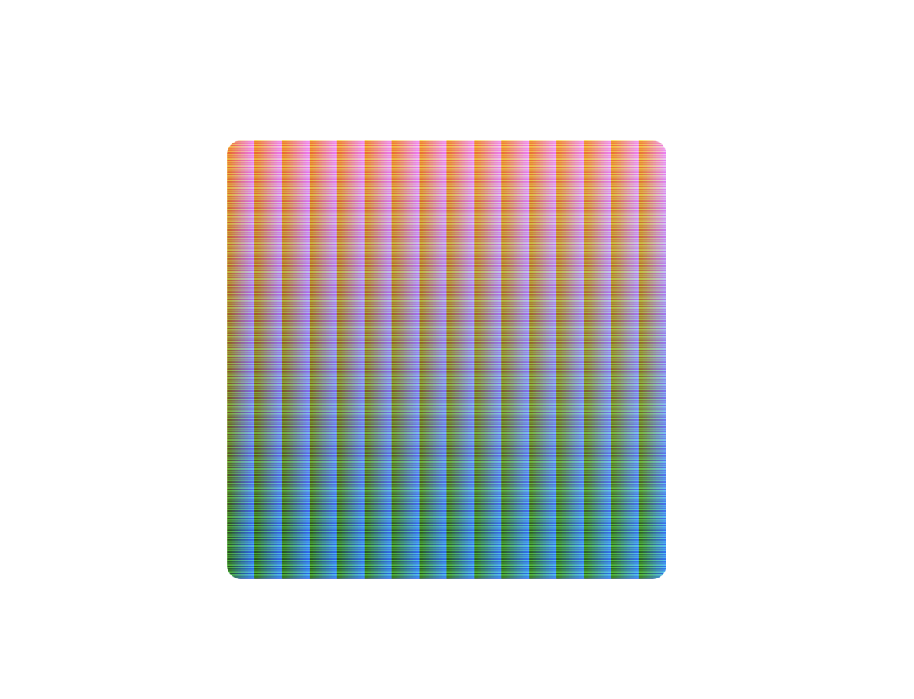

slidenumbers: true

# CoreGraphicsでドット絵を描こう
## Track C レギュラートーク（20分）

---

# noppe


- 株式会社ディー・エヌ・エー
    - Pococha
- 個人アプリ開発者
    - vear
    - **Editormode**
- iOSDC18~21 登壇
- きつねが好き

^ こんにちは、noppeです。株式会社ディー・エヌ・エーでソーシャルライブアプリPocochaのiOSアプリエンジニアをしています。
^ また、個人ではvearというバーチャル自撮りアプリや、Editormodeというドット絵向けのデジタルイラストレーションアプリを開発しています。
^ 今回でiOSDC４年目の登壇になります。

---


^ EditormodeはCoreGraphicsとUIKitで作られています。
^ デジタルイラストレーションのアプリは、一般的にメモリ上にキャンバスのデータを展開し、それを編集する作業を繰り返します。
^ CoreGraphicsは、画像データをメモリに展開・編集するAPIを提供しています。iOS2.0から存在する歴史の長いフレームワークですが一方で当初から非常にシンプルで使いやすいインターフェイスが提供されています。
^ 今日はこのようなドット絵を描くためのアプリを、CoreGraphicsのAPIでどのように実現しているのかを紹介します。

---

# Agenda

1. ドット絵エディタとは
2. シンプルなドット絵エディタを作る
3. CoreGraphicsの拡張
4. パフォーマンスの改善

^ まずは、ドット絵についての歴史やトレンドを確認してこれから扱うドット絵エディタとはどんなものなのかを理解します。
^ 続いて、実際にCoreGraphicsとUIKitを使ってシンプルなドット絵エディタを開発して、ワークフローやCoreGraphicsのベーシックな使い方を説明します。
^ その後、CoreGraphicsに存在しないAPIやよりドット絵を扱うアプリとしての完成度を上げるための方法を学びます。
^ 最後にMetalやCoreImageを使って、ドット絵アプリのパフォーマンスを向上させるコツについてお話しします。
^ それでは、ドット絵エディタについて見ていきましょう

---

# ドット絵エディタとは


^ 最近ドット絵が話題になった例として、今年のWWDCがあります。

---


^ 今年はデジタルラウンジでモノクロームピクセルアートチャレンジが開催されて、現代のアプリアイコンを白と黒の２色のアイコンに描き直すというチャレンジが開催されました。
^ 実際に私もEditormodeを使って参加しました。右上のマップアイコンがそれですね。
^ これらの作品はWWDCのデイリーダイジェストで見ることが出来ます。
^ これらの作品を観察すると分かるとおり、薄い色を白と黒のチェック模様で再現したり、重要で無い要素を省いたりと、有限なリソースの中で最大限表現するための工夫が散りばめられています。
^ こういったいくつかのドット絵の工夫をツールとして提供することも、ドット絵専用アプリの価値と言えるでしょう。

---


^ またドット絵は、このような小さな解像度の中で絵を描く表現方法です。
^ 描画に割けるメモリが小さいコンピューターや解像度の小さいゲーム機などで使われていました。

---


<!-- https://oldwindowsicons.tumblr.com/tagged/windows%2098 -->

^ デバイスの進化とともに、ドット絵は使われる色が増えたり、細かくなっていきます。

---


^ 現代で使われる画像のほとんどはベクターや写真といった画像が一般的になり、手作業で描かれたドット絵はアートの側面で使われることが多くなりました。
^ このように、ドット絵は地続きに姿を変えたこともあり、どれほど小さければドット絵なのか、色が少ないならドット絵なのか、定義が難しい表現方法でもあります。
^ しかし、解像度の制約の強い環境ほど、自然にドット絵らしく見えるので、ドット絵を扱うアプリは、この制約を再実装し再現することでドット絵であることに説得力を持たせようとします。
^ Editormodeのようなドット絵エディタの意義とは、こういった制約を付けた環境をユーザーに提供して、自然にドット絵をかけるような環境を用意することにあるとも考えられます。
^ では、実際にiPadにドット絵を表示して本来の解像度よりも低い解像度のように表示してみましょう。

---

```swift
imageView.contentMode = .center
imageView.image = UIImage(named: "watch")
```


^ これは、iPadに16x16のドット絵を等倍で表示した状態です。
^ UIImageViewを使って表示しています。
^ 現代のディスプレイは非常に高解像度なので非常に小さく表示されます。

---

```swift
imageView.contentMode = .scaleAspectFit
imageView.image = UIImage(named: "watch")
```


^ 次にUIImageViewのcontentModeをscaleAspectFitにして、画面いっぱいに表示してみます。
^ これで時計のアイコンが映っていることは分かりましたが、ぼやけてしまっています。
^ UIImageViewにはこのように、小さい画像を拡大する際にスムーズに補完する機能がデフォルトで設定されています。

---

```swift
// Use nearest magnificationFilter
imageView.contentMode = .scaleAspectFit
imageView.layer.magnificationFilter = .nearest
imageView.image = UIImage(named: "watch")
```

```swift
// SwiftUI
Image(...).interpolation(.none)
```

❌　画像自体のリサイズは重いのでNG


^ 拡大時の補完のアルゴリズムはCALayerのmagnificationFilterが担っており、これをnearestにすることでドット絵をクッキリと描画することができます。
^ SwiftUIではinterpolationをnoneにすることで同じ結果を得ることができます。
^ このように表示目的で拡大する際はUIImageViewやSwiftUIを利用します。
^ 実際の表示サイズにリサイズする処理は非常に重いので避けましょう。

---

# シンプルなドット絵エディタを作る

---


^ では、シンプルなアプリの開発に移りましょう。
^ ドット絵エディタは、ただ描画するだけでは成り立ちません。
^ タップした位置を塗りつぶすといった編集の機能も必要になります。
^ これらの一連の流れは非常にシンプルで、タップした位置を塗りつぶし、それを表示する繰り返しです。

---


^ この処理をCoreGraphicsとUIKitで実現するには、CGContextとUIImageViewを使います。
^ CGContextとは、絵を描くためのキャンバスのようなもので、このクラスに塗りつぶす領域を渡すことで塗りつぶしたり、イメージとして取り出すことが出来ます。

---

## ドット絵エディタのワークフロー

[.code-highlight: all]
[.code-highlight: 5]
[.code-highlight: 6]
[.code-highlight: 7]
[.code-highlight: 8]
[.code-highlight: all]

```swift
let imageView = UIImageView()
let context = CGContext()

func setup() {
	imageView.onTap = { point in // 1
		context.fill(point) // 2
        let image =  context.makeImage() // 3
		imageView.image = image // 4
	}
}
```


^ 疑似的なUIKitのコードにするとこのようになります。
^ ImageViewがタップされると
^ contextにタップした位置のピクセルを塗りつぶすことを要求します。
^ 最後にcontextから画像を取り出してImageViewに描画します。
^ 非常にシンプルですね。

---

## グレースケールのCGContextの初期化

[.code-highlight: all]
[.code-highlight: 2]
[.code-highlight: 3-4]

```swift
let context = CGContext(
    data: nil,
    width: 16,
    height: 16,
    bitsPerComponent: 8,
    bytesPerRow: 1 * 16,
    space: CGColorSpaceCreateDeviceGray(),
    bitmapInfo: CGImageAlphaInfo.none.rawValue
)
```

^ 疑似的なコードで省略しましたが、実際には次のようにしてCGContextを生成します。
^ 複雑なようですが、実は簡単なので１つづつ見てみましょう。
^ dataは、CGContextが扱う画像のメモリ領域です。nilを与えると他のパラメータを元に自動で領域を確保します。
^ width, heightは画像のサイズです。

---

## bitsPerComponent

- 1色を分解した時の1コンポーネントあたりのビット数

例

- フルカラー = 4コンポーネント（R,G,B,A）
- グレー = 1コンポーネント
- 256階調 = 8ビット

^ bitsPerComponentは、1色を分解した時の1コンポーネントあたりのビット数を指定します。
^ 例えばフルカラーならRGBAの４つのコンポーネントを、グレーならグレースケールの１つのコンポーネントを持っています。
^ 今回は256階調のグレースケールにするので、8ビットを指定します。

---

## bytesPerRow

- 画像の横一列が何バイトになるか

例

- 8 Bit = 1Byte
- フルカラー64x64 = 1Byte x 4Component x 64pixels = 256
- グレー16x16 = 1Byte x 1Component x 16 = 16

^ bytesPerRowは、画像の横一列が何バイトになるのかを指定します。
^ 今回は１ピクセルが１バイトになるので、横のピクセル分16をかけて、1x16で16を指定します。

---

## space

- カラースペース

例

- `CGColorSpaceCreateDeviceRGB()`
- `CGColorSpaceCreateDeviceGray()`


^ spaceは色空間の指定です。今回はグレースケールなのでCGColorSpaceCreateDeviceGrayを指定します。

---

## bitmapInfo

- アルファチャンネルの場所 | バイトオーダー | フォーマット　のビットマスク

例

- CGImageAlphaInfo.noneSkipLast.rawValue | CGImageByteOrderInfo.order32Little.rawValue | CGImagePixelFormatInfo.packed.rawValue
- CGImageAlphaInfo.none.rawValue

^ bitmapInfoには、アルファの位置やバイトオーダーなどを指定します。今回は透過度は無いのでnoneを指定します。

---


^ これで256色の色が使えるCGContextを作ることができました。
^ フルカラーのCGContextが使いたい場合は、次のように指定します。

---

## フルカラーのCGContextの初期化

```swift
let context = CGContext(
    data: nil,
    width: 16,
    height: 16,
    bitsPerComponent: 8,
    bytesPerRow: 4 * 16,
    space: CGColorSpaceCreateDeviceRGB(),
    bitmapInfo: CGImageAlphaInfo.noneSkipLast.rawValue
)
```

^ フルカラーの場合、４つのコンポーネントで構成されるのでbytesPerRowは4 * 16で64を指定します。
^ 色空間もRGBを指定します。
^ bitmapInfoは、不透明度が無い場合はskipLastを指定して４つ目のコンポーネントを無視するようにします。

---



^ これでフルカラーのCGContextを作ることが出来ました。

---

## contextの画像を描画する

```swift
let cgImage: CGImage = context.makeImage()!
let uiImage: UIImage = UIImage(
    cgImage: cgImage,
    scale: 1,
    orientation: .downMirrored
)

// UIKit
imageView.image = uiImage
// SwiftUI
Image(uiImage: uiImage)
```

^ 作ったcontextが持つ画像を描画するには、makeImage関数によって生成されたCGImageを経由します。
^ CGImageは実際のメモリ上の画像を参照するイメージクラスです。
^ そして、普段意識することはありませんが、UIImageはCGImageを始めとした様々な画像データをそのデータ構造を意識せずに使えるようにしたラッパークラスです。
^ UIImageは今回のように既にメモリ上に展開された画像を扱うこともあれば、ベクターデータを受け取って内部で展開することもあります。
^ UIImageにさえ出来てしまえば、UIImageViewやSwiftUIで簡単に描画することができます。

---

## タップ位置 → ドット絵の座標への変換

```swift
let imageSize = CGSize(width: 16, height: 16)
let targetView = tapGesture.view!
// ビューのタップ位置を取得
let location = tapGesture.location(in: targetView)
// 👍 UIImageViewとドット絵のアス比は揃えておくと計算しやすい
let x = Int(location.x * (imageSize.width / targetView.bounds.width))
let y = Int(location.y * (imageSize.height / targetView.bounds.height))
let point = CGPoint(x: x, y: y)
```

^ 画面上のタップ位置はUIGestureRecognizerのlocationInViewから得ることが出来ます。
^ それがドット絵上のどのポイントを指しているかを計算しやすくするために、UIImageViewのサイズは描画する画像と同じアスペクト比にしておくと良いでしょう。

---

# 色の塗りつぶし

```swift
let color = CGColor(gray: 0, alpha: 1)
context.setFillColor(color)
let rect = CGRect(origin: point, size: CGSize(width: 1, height: 1))
context.addRect(rect) // Pathの追加
context.fillPath()
```

```swift
// 他にも...
context.addArc(...) // 円
context.addEllipse(in: CGRect) //楕円
context.addLines(between: [CGPoint]) //線
context.path = UIBezierPath(...).cgPath //任意のパス
```

^ 最後にcontextで色を塗る処理を紹介します。
^ contextのsetFillColorを呼ぶと、それ以後の塗りつぶし色が指定した色になります。
^ 次に塗りつぶすパスを指定します。今回は1ドットを塗り潰したいのでaddRectで1x1の矩形を指定しました。
^ 最後にcontextのfillPathメソッドを呼ぶと、contextに追加されたpathが塗りつぶされます。
^ これでドット絵を描くアプリを作ることが出来ました。
^ それでは、次はこのアプリの完成度を上げていきましょう。

---

# CoreGraphicsの拡張

---


^ 先ほど作ったアプリの続きです
^ UIPanGestureRecognizerと楕円のパスを使って、楕円を描画する機能を追加してみました。

---


^ しかし、実行してみると違和感があることに気が付きます。
^ 円の縁に小さなドットが描画されてしまうのです。

---


^ Editormodeの円ツールと見比べると違和感が分かりやすいです。
^ これはcontextのアンチエイリアスを無効にすると発生する問題です。
^ これが、ドット絵のアプリを作る上で厄介なところです。
^ CGContextの描画関数は補完処理がかかることを前提として実装されています。
^ そのため、特に曲線部分では補完を無効にすると違和感のある見た目になることがあります。
^ これを防ぐには、独自に描画関数を実装する必要があります。

---

```swift
extension CGContext {
    func fillEllipseLine(in rect: CGRect) {
				let points = plotEllipse(in: rect)
        for point in points {
            let rect = CGRect(origin: point, size: CGSize(width: 1, height: 1))
            let path = UIBezierPath(rect: rect).cgPath
            addPath(path)
        }
        fillPath()
    }
}
```

^ CGContextに独自の関数を生やすのは難しいことではありません。
^ CGContextには、CGPathを塗り潰すfillPath関数が生えています。
^ なので、アルゴリズムを使って塗り潰すpointの配列さえ手に入ればそれらをaddPathすることで簡単に自作の描画関数を生やすことが出来ます。

---

// ブレゼンハム

^ ドット絵の円や線は、ブレゼンハムの線分描画アルゴリズムを使うことで綺麗に描くことが出来ます。
^ ここではアルゴリズムの詳しい説明は省きますが、このアルゴリズムはコンピュータの最初期に生まれたもので、多くの低解像度なモニターで使われてきた実績のあるアルゴリズムです。
^ 今回、このトークをするにあたってこのアルゴリズムをCGContextで扱えるようにしたライブラリを用意しました。

---

```diff
- context.fillEllipse(in: rect)
+ context.fillEllipsePlotLine(in: rect)
```

^ このように書き換えることで、ブレゼンハムの線分描画アルゴリズムに則った線を描くことが出来ます。
^ swift-bresenham-line-algorithmは、他にも単純な線や正円もサポートしています。

---

# CoreGraphicsの拡張2

---


^ 続いて、同じ色を塗り潰すバケツ機能を作ってみましょう。
^ CGContextは矩形に塗り潰すことしか出来ないため、これも自作の関数を作る必要があります。
^ フラッドフィルと呼ばれる方法で塗るポイントを探していきます。

---

^ フラッドフィルでは、横方向に同じ色が存在すれば指定した色で塗り、指定した色で塗り尽くしたら次の行に移動します。
^ そのため、この探索を実現するにはCGContextから指定した座標の色を取得・反映する処理が必要になります。

---

^ CGContextから色を取り出すAPIは生えていませんが、CGContext内のメモリを直接参照するためのdataというプロパティが生えています。
^ これを使って色を取り出すAPIを自作していきます。
^ 色を取り出す前に、CGContextの内部でどのように画像が配置されているかを見てみましょう。

---

```
(lldb) frame var -L ctxData
0x000000016d5379e8: (UnsafeMutableRawPointer) ctxData = 0x600000c51670
```

^ 2x2のCGContextに４色のグレーを付けて、lldbでメモリのアドレスを確認します。
^ Debug > Debug Workflow > View Memory
^ から、メモリ内を参照すると次のように色が並んでいることがわかります。
^ つまり、シンプルに左下から右上にかけての色が格納されていることが分かりました。
^ フルカラーの場合も同様に、RGBAの値が並んでいます。

---

```swift
struct RGBAColor {
  let red: UInt8
  let green: UInt8
  let blue: UInt8
  let alpha: UInt8
}

data.load(as: RGBAColor.self)
data.storeBytes(of: color, toByteOffset: offset, as: RGBAColor.self)
```

^ Swiftはload関数を使うことでポインタから型を指定して値を取り出すことが出来ます。
^ 型はメモリレイアウト上のサイズや並びを再現して宣言する必要があります。
^ fromByteOffsetに、型のサイズとindexをかけた値を渡すと任意のポイントの色を取得することが出来ます。
^ メモリへの書き込みも、storeBytesを使うことで型を使って行うことが出来ます。

---

^ ドット絵は解像度の低い画像ですが、フラッドフィルのような処理は反復して多くのfor-loopを行う可能性があります。
^ 処理を短時間で終わらせるためには、このようにメモリを直接操作したり余分な計算を減らす必要があります。
^ 最後にドット絵のパフォーマンスを向上させるための工夫を見てみましょう。

---

# パフォーマンスの改善

---


^ ドット絵は一般的に全体で使用する色数が少なくなります。
^ この特徴を利用して、メモリ上の画像サイズを減らす工夫をしてみます。

---

^ 作戦はこうです。
^ まず、グレースケールで画像を保持します。先ほど解説した通りグレースケールであれば画像のサイズは1/16になります。
^ グレースケールは256階調のグレーが使えますが、これに256色を対応させます。
^ レンダリングのタイミングでこの色を対応表通りに戻してあげることでディスプレイに表示されるタイミングでは色がついて見えるようになります。
^ これをインデックスカラーと言います。
^ 昔のゲームの2Pカラーなどがこの仕組みを使っていたりします。

---


^ 残念ながらCGContextにはインデックスカラーの機能が無いため、これも自前で実装することになります。
^ グレースケールのCGContextからCGImageを取り出して、それをCIFilterにかけて着色します。
^ CIFilterにはColorCubeというLookupTableのフィルタがあるのですが、これはカラーの画像に対してかけるフィルタなので、Metalで自作します。
^ 着色した画像をCIFilterから取り出して、UIImageViewに表示すれば完成です。

---

```
#include <metal_stdlib>
using namespace metal;
#include <CoreImage/CoreImage.h>

extern "C" { namespace coreimage {
    float4 lookupTable(sampler src, sampler lut) {
        float2 pos = src.coord();
        float4 pixelColor = src.sample(pos);
        int index = pixelColor.r * 255;
        int x = index % int(lut.size().x);
        int y = index / int(lut.size().y);
        float2 lutPos = float2(x, y);
        float4 lutColor = lut.sample(lutPos);
        return lutColor;
    }
}}
```

---

# Recap

---