slidenumbers: true

# **UIのブラックボックスを探る**

## iOSDC23 day1 Track B noppe

^ UIのブラックボックスを探るというタイトルで発表します。よろしくお願いします。

---

## **noppe** @noppefoxwolf

- DeNA Co., Ltd.
  - Pococha
- Indie app
  - vear
  - Editormode
  - Nightfox DAWN for mastodon


^ みなさん、こんにちは。株式会社ディーエヌエーのnoppeです。
^ ソーシャルライブアプリのPocochaや、個人開発ではVTuber向けの自撮りアプリvear、マストドンクライアントのNightfox DAWNなどを作っているエンジニアです。どうぞよろしくお願いします。

---

# 脳内プレビュー@DeNAブース

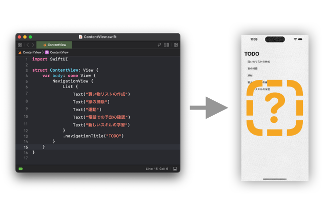

^ 今日はオフライン会場のDeNAブースで、私たちが主催する脳内プレビューイベントが開催されています。
^ このイベントでは、SwiftUIのコードから脳内で実行結果を予想し、解答用紙にUIを描くというクリエイティブなチャレンジがあります。ぜひ皆さん、お時間があれば遊びに来てください。楽しい時間をお約束します！

---

# 今日話すこと

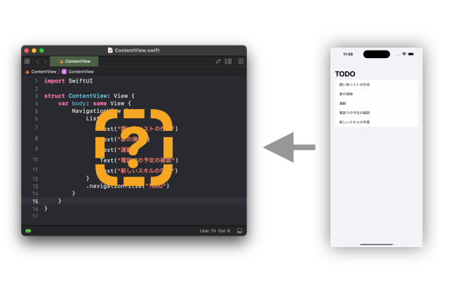

^ そして、今日話したいことは、脳内プレビューの逆！
^ 普段使っているUIから仕様を発掘する方法について説明します。
^ iOSアプリエンジニアはもちろん、デザイナーやプランナーの方にも聞いてほしい話があるかなと思います。 
^ UIに興味がある人が、より良いUIを作るためのヒントを得られるようなトークになればと思います。

---

# UIのブラックボックスとは

^ さて、本題に入る前にタイトルのブラックボックスとは何なのかについて説明します。

---

# UIのブラックボックス = 暗黙の仕様

^ 今回のトークで私が話したいのは、UIにおける暗黙の仕様について。
^ そこにあるのに、気が付きにくい、そんな仕様のことです。

---

# カスタムUIの必要性

- 特定の操作を最適化したい
  - カレンダー・画像ビューア
- アプリのアイデンティティを構築したい
  - 既存のUIのリデザイン

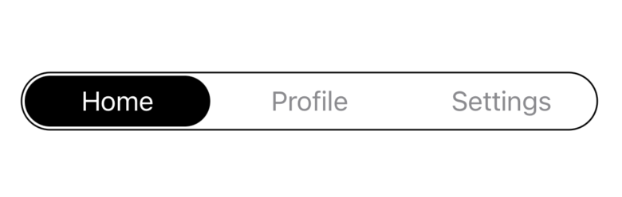

^ 我々がアプリを作るときに、ほぼ必ず独自のUIコンポーネントを作ります。ここでは、カスタムUIと呼ぶことにします。
^ これは、アプリのアイデンティティを構築するために必要だったり、既存のシステムコンポーネントに不足しているコントロールを補うために必要だったりします。
^ 例えば、カレンダーだったり、グラフだったり、画像ビューアだったり。自作した人も多いかと思います。

---

# カスタムUIの品質

- Apple製のUIと比べると悪くなりがち
  - バランスが悪い
  - 触り心地が悪い
  - 使いにくい
  - ...etc

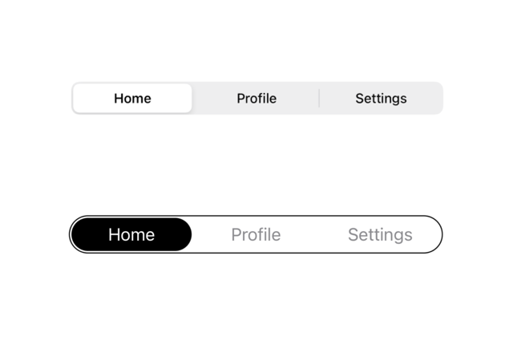

^ しかし、多くのケースで、我々が作るカスタムUIは、Apple製のUIと比べて品質が低いことが多いです。なんだか見た目のバランスが悪いとか、見た目が良くても触り心地が悪かったり、そもそも使いにくいとか。

---

# カスタムナビゲーションバーの例

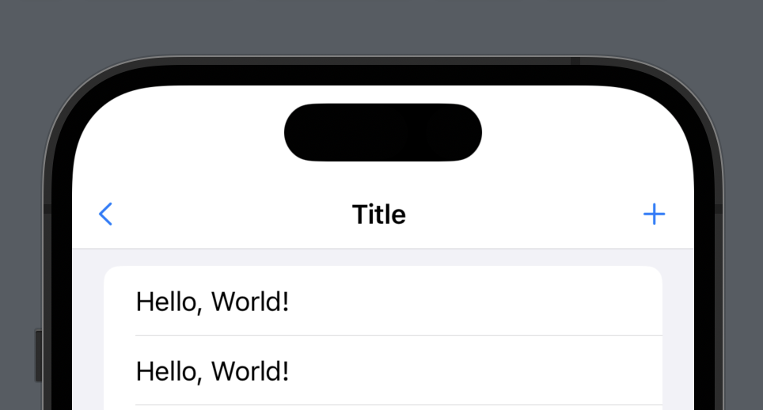

^ ちょっと具体的な例を挙げてみます。
^ これは、カスタムナビゲーションバーを作った例です。
^ なんだかんだでナビゲーションバーを自作したい事ってありますよね。
^ 一見すると、システムコンポーネントと同じように見えますが、

---


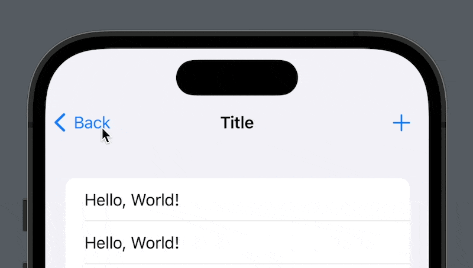

^ 実は、純正のナビゲーションバーと比較してシャドーの実装が違ったり、ブラーエフェクトが無かったり、端までスクロールした時の挙動が違ったり、ロングプレスジェスチャーの挙動が違ったり、などなどの違いがあります。
^ そんな小さな事、どうでも良い！と思うかもしれませんが、こういった要素の積み重ねがUIの触り心地に直結しているはずです。
^ それらを必要とするユーザーだっています。勝手に無くして良い理由を説明できないのなら、安易に捨てる要素ではないと思います。
^ しかし、我々はどうしてこういうUIを作ってしまうのか。

---

# Bad UIが出来てしまう理由

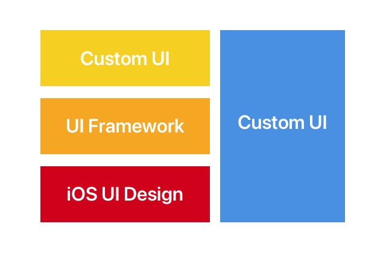

- システムのお作法を無視してしまうから
  - カスタムUIはシステムUIの上で作るべき（黄）
  - お作法を無視してUIを作る（青）と、違和感が発生

^ 理由は色々あると思いますが、ここでは、システムのお作法を無視してしまうからという理由について注目してみます。
^ ユーザーはiOSという巨大なお作法の上でアプリを使用しており、スクロールの慣性、タップエリア、アクセシビリティ、アニメーション、文字の大きさと太さなど、様々なお作法に慣れ親しんでいます。
^ カスタムUIがこれらのお作法を無視すると、ユーザーは違和感を感じてしまいます。
^ 逆にお作法をトレースし、それに乗っ取ったUIを作ることができれば、ユーザーは違和感なくアプリを使うことができます。

---

# お作法を知るには

^ お作法、どうすれば学べるでしょうか。
^ 実は、お作法全てがブラックボックスになっているわけではありません。

---

# お作法を知るには1

- Human Interface Guidelines
  - 基本的なお作法はこれ
  - フォントサイズ・ボタンサイズなどのベストプラクティス
  - UIKit, SwiftUIもこれに準拠している

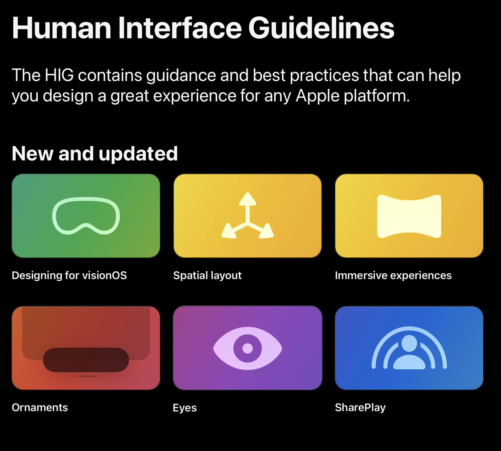

^ 公開されている情報で、一番簡単にアクセスできるのは、Human Interface Guidelinesです。
^ ここには、コンポーネントの使い方から、推奨されるフォントサイズや、ボタンのサイズなど、多くの基本情報が記載されています。
^ テキストビューや検索窓など、基本的なコンポーネントならUIKitやSwiftUIに含まれており、あまり意識せずともお作法に準拠したUIを作ることができます。
^ それを前提に…

---

# お作法を知るには2

- システムコンポーネントを分析する
  - HIGに書かれていないお作法
  - 品質の理想値

- システムコンポーネント
  - Apple製のアプリ
  - UIKitやSwiftUIのUIコンポーネント


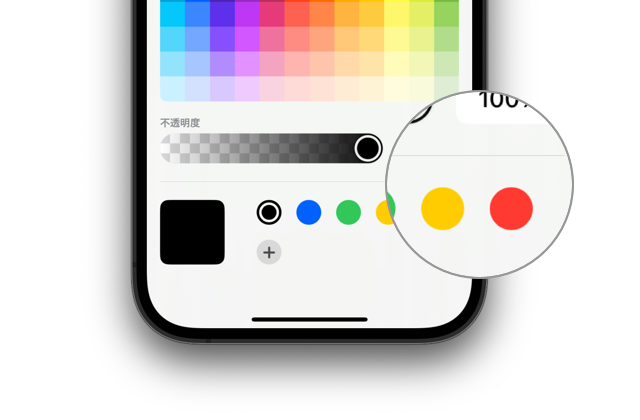

^ UIKitなどに無いUIが、実際にどういった値で実装されているのか、どんな挙動をするのかは、システムコンポーネントを分析して解明する必要があります。
^ ここでシステムコンポーネントと呼んでいるのは、Apple製のアプリや、UIKitやSwiftUIのUIコンポーネントのことです。
^ これらをターゲットとして分析するのは、システムコンポーネントがUIの品質の理想値と言えるからです。

---

# UIを分析する

^ では、実際にシステムコンポーネントを分析していきましょう。
^ 今回のトークでは、自分がよく行っている分析の仕方を紹介します。
^ 実際のケースでは、作ろうとしているカスタムUIに近い要素を探して取り組んでみてください。
^ 例えば、Tipsを表示するカスタムUIを作りたいのであれば、PopOverのUIを分析すると良いでしょう。

---

# UIを分析する観点

- ビジュアル􀋭
- インタラクション􀬁

^ UIを分析するとき、私はいくつかの角度から分析しています。
^ これは、見た目だけ真似ても、ハリボテが出来上がるからですね。figmaのデザインだけを見てUIを実装しても、ハリボテになってしまうのと同じです。
^ 私は、ビジュアルとインタラクションの２つの要素でUIを見ています。
^ それでは、一つずつ細かく見ていきましょう。

---

# ビジュアル

^ まずは一番基本的なビジュアルから見ていきましょう。

---

# ビジュアル

- サイズ・色・形など目に見えるもの
  - HIGに書かれているものもある

^ ビジュアルと一言に言っても、サイズや色、形など様々な要素があります。
^ 境界線は曖昧ですが、とにかく多くの観点を見つけるほど、解像度は上がるはずです。
^ これらは、ある程度の一貫性の上で設定されており、それを知ることで、よりiOSらしいUIを作ることができます。
^ HIGに書かれているものもあります。

---

# ビジュアルの適用例

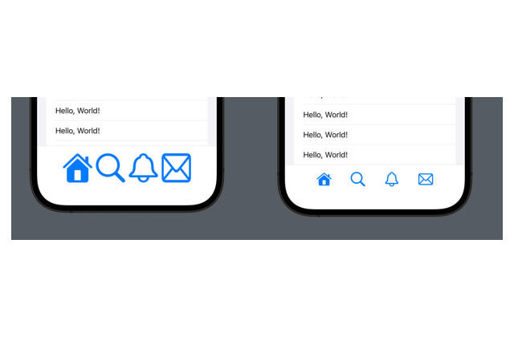

^ これは極端な例ですが、左が適当なアイコンサイズにしたカスタムタブバー、右が実際に使われているサイズを適用したカスタムタブバーです。
^ サイズを整えるだけで、それっぽい見た目になるということがわかるかと思います。
^ この辺りは、UIデザイナーが得意とする部分なので、エンジニアはあまり意識したことが無い人も多いかもしれません。
^ しかし、これが出来ると個人開発でかっこいいアプリが作れるようになります！
^ では要素を一つずつ見ていきましょう。

---

# サイズ

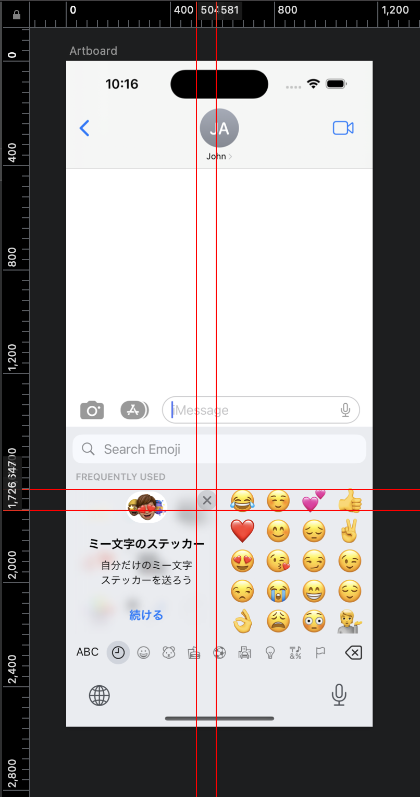

- アイコン・余白・文字サイズ・角丸
- スクショを撮影し測る
  - SketchやPhotoshopなどのRuler機能
- 文字サイズの場合は、スクショを半透明にして重ねて比較

^ まずはサイズを見ていきます。
^ アイコンのサイズや余白、文字サイズ、角丸などを見るのが良いでしょう。
^ 影の長さとかも見ておくと良いかもしれませんね。
^ 見方としては、スクショを撮影して、PhotoshopやSketchなどのルーラ機能を使って計測していきます。
^ いくつか見ていくと、31のような中途半端なサイズが無いことや、いくつかのサイズが共通して使われていることに気がつくことと思います。

---

# サイズとアクセシビリティ

- アクセシビリティや「拡大表示」設定によって、サイズが変化するので注意
- Dynamic Typeは最大最小値が決まっている場合もある

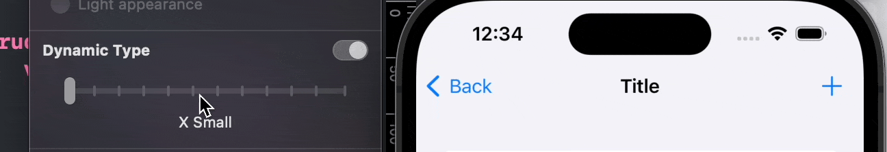

^ 計測するときは、アクセシビリティや拡大表示でどう変化するのかも見ておきましょう。
^ 特にフォントは固定値にしがちです。ちゃんとdynamic fontを使ってサイズを変えられるようにしましょう。
^ また、画像のNavigationbarのtitleのように、最大最小値が決まっている場合もあるので注意。

---

# カラー

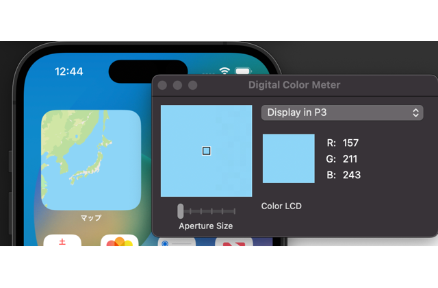

- 特定の意味を持つカラーに注目
- カラーピッカーを利用する
  - Digital Color Meter, Sip, ColorSlurp
  - カラースペースを合わせておく

^ 次はカラーについて。
^ カラーはUIColorなどにシステムの背景色や文字色があるので、基本的にはそれを使えば間違いないでしょう。
^ しかしUIの中には、特定の意味を持つカラーというのがあります。それを使うことで色を通してユーザーに意味を伝えることができます。
^ 計測するときは、macに最初から入っているDigital Color Meterの他、SipやColorSlurpなどのサードパーティアプリを使うと便利です。

---

# カラーの例

- ヘルスケアで使われている色を使う事で、HealthKitと連携するボタンであることを認識しやすくなる
- ユーザーに色で意味を伝える
  - 地図の海の青色
  - スイッチの緑色

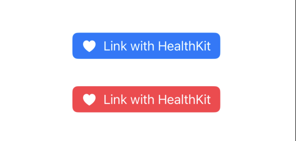

^ 意味を持つカラーについて、例を挙げてみます。
^ これはヘルスケアと連携するためのボタンですが、上はシステムカラー、下はヘルスケアで使われている色を抜いてきて使っています。
^ 下のボタンの方が、ヘルスケアと連携するボタンであることを認識しやすいと思います。
^ 同様に、地図の海の青色やスイッチの緑色などは自分で作らずに、システムコンポーネントから抜いてきた色を使うことで、ユーザーに意味を伝えることができます。

---

# ダークモードとカラー

- 条件によって色が変わることがある
  - ダークモード
  - 色反転
  - Smart invert
  - アクセントカラーの設定

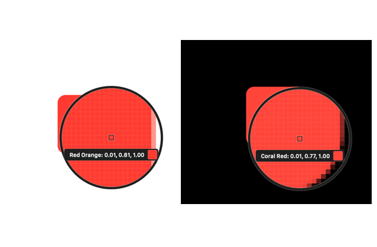

^ カラーは条件によって変わることがあるので注意しましょう。
^ 同じ色に見えてもダークモードだと微妙に違う色だったり、Smart invertで反転対象になっていない物などもあります。

---

# 単色でないケース

単色で無い場合は色を取り出せないので注意
広めに色を取り出して、ムラがないか確かめるのも良いでしょう

- ブラー, グラデーション, 透過度

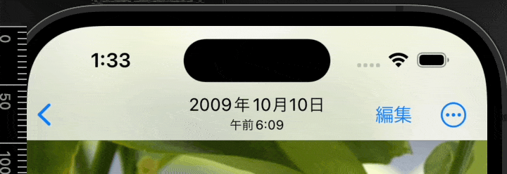

^ また、パッと見単色に見えて、単色でないものもあります。
^ 後ろにコンテンツを表示して見ると気がつきやすいです

---

# アニメーション

- duration, curve, timing
- iOS Simulator
  - Slow Animations
- スクリーンレコードをコマ送りして確認
  - QuickTime Player, iina

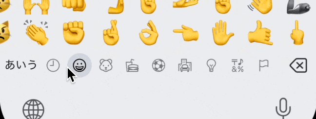

^ 続いて、アニメーションについて。
^ アニメーションは、完全に再現するのは難しいので、iOS SimulatorのSlow Animationsを使って、アニメーションの大まかな動きを確認するのが良いでしょう。
^ スクリーンレコードをして、QuickTime Playerでコマ送りにしてアニメーションを確認するのも良いですね。

---

# 高度なビジュアルの分析

^ ここまでは、スクリーンショットを使った基本的なビジュアルの分析方法を紹介しました。
^ ここからは、もう少し高度なビジュアルの分析方法を紹介します。

---

# View Hierachy Debugger

- 直接サイズを確認できる
- Xcode
- https://lookin.work
  - OSS
  - コンソール機能が優秀
- https://revealapp.com
  - Paid App
  - UIViewの構造も見れる

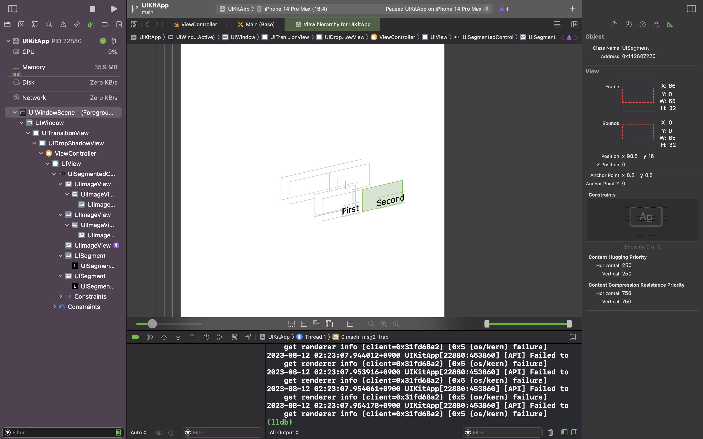

^ ビューの分析に欠かせないのが、View Hierachy Debuggerです。
^ これは、ビューの階層構造を可視化してくれるデバッグツールです。
^ Xcodeにも内蔵されていますが、LookinやRevealといったサードパーティのアプリもあります。
^ これらを使うことで、文字サイズや余白などを直接確認することができます。
^ つまり、ほぼ答えが見れます。

---

# Apple Map UI-Component Clone Challenge

- AppleのMapアプリを再現してみる
  - 右上のボタンのところ
- Revealを使って、UIを分析する

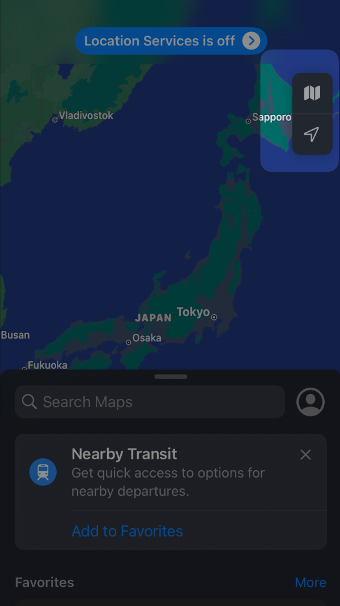

^ というわけで、ビューヒエラルキーデバッガーを使って、AppleのMapアプリのUIを再現してみましょう。
^ といっても、全部やるわけには行かないので、この右上のボタンだけ。
^ UIの分析には、Revealを使います。

---

# Revealの仕組み

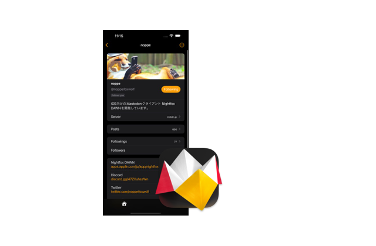

- アプリの中で動作するサーバーを立ち上げて、macのアプリと通信する
- アプリにRevealServer.frameworkを組み込む必要がある
- Lookinも同様の仕様
- 自前のアプリでしか動作できない

^ RevealやLookinは、直接プロセスにアタッチ出来ないので、アプリの中で動作するサーバーを立ち上げて、macのアプリと通信する仕組みになっています。
^ そのため、アプリにRevealServer.frameworkを組み込む必要があります。
^ ですが、これだとAppleのMapアプリで使うことができません。

---

# Reveal runs anywhere

- アプリ起動中に外からRevealServerをloadする
  - fridaを使うと簡単

^ そこで、アプリの起動中に外からRevealServerをロードしてみます。
^ 難しそうですが、fridaを使うと簡単にできます。

---

# Frida

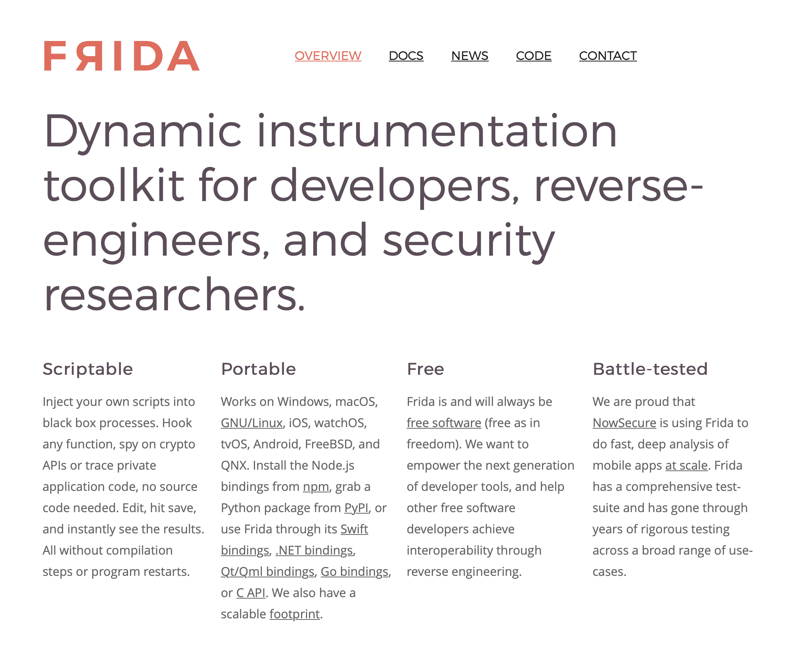

https://frida.re

- 汎用的なリサーチツール
  - スクリプトのインジェクト
  - メソッドコールの監視

- rootにインストール可能
  - iPhoneのrootが必要

^ Fridaは汎用的なリサーチツールで、iOSやAndroid、Windowsなど、様々なプラットフォームで動作します。
^ 今回はアプリの実行中にスクリプトをインジェクトするのに使います。
^ 今回はたまたまroot権限を持っていたiPhoneで実行します。

---

# Frida script

loader.js

```
let loaderPath = "~/RevealServer.framework/RevealServer"
Module.load(loaderPath)
```

^ fridaは、インジェクトする処理をjsで記述できます。
^ 事前に転送しておいたRevealServer.frameworkをロードする２行のスクリプトです。

---

# Load framework using Frida

```
# 1. frida-psでUSBで接続したiPhoneからプロセスIDを探す
$ frida-ps --usb | grep Map
2537  Maps

# 2. fridaでPIDに対してスクリプトを実行する
$ frida --usb --load loader.js --attach-pid 2537
```

^ 次に、iPhoneでマップアプリを立ち上げます。
^ frida-psコマンドを使って、MapアプリのプロセスIDを探します。
^ そして、fridaコマンドで、プロセスにスクリプトをインジェクトします。
^ これで、MapアプリでRevealServerが動作するようになりました。

---

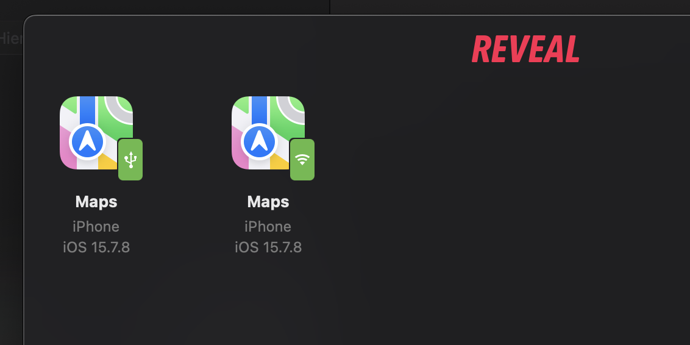

^ Revealが接続できるデバイス一覧に、このように表示されていれば成功です。
^ 早速接続して見ていきます。

---

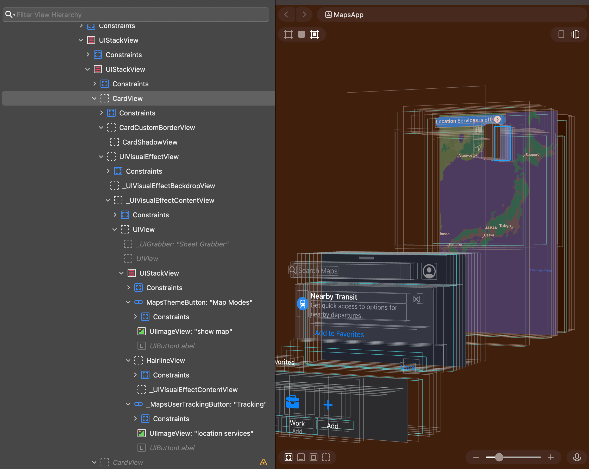

^ このように、Xcode View Hierarchy Debuggerと同じように、Mapアプリのビュー階層を見ることができます。
^ 上の方にある、このボタンにフォーカスします。

---

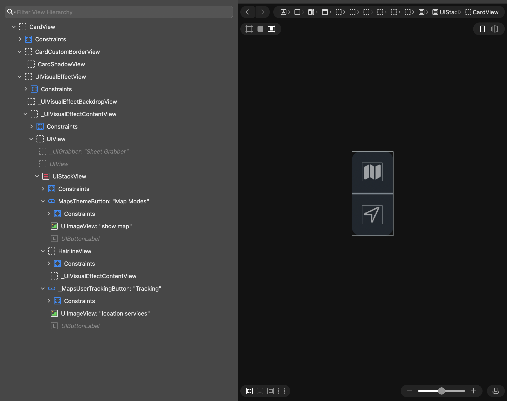

^ 左パネルに、ビュー階層が表示されます。
^ どうやら、このボタンは、CardViewという名前のビューのようです。
^ さらに、影の描画用のCardCustomBorderViewがあり、その上にボタンを乗せるUIVisualEffectViewがあるということも分かります。

---

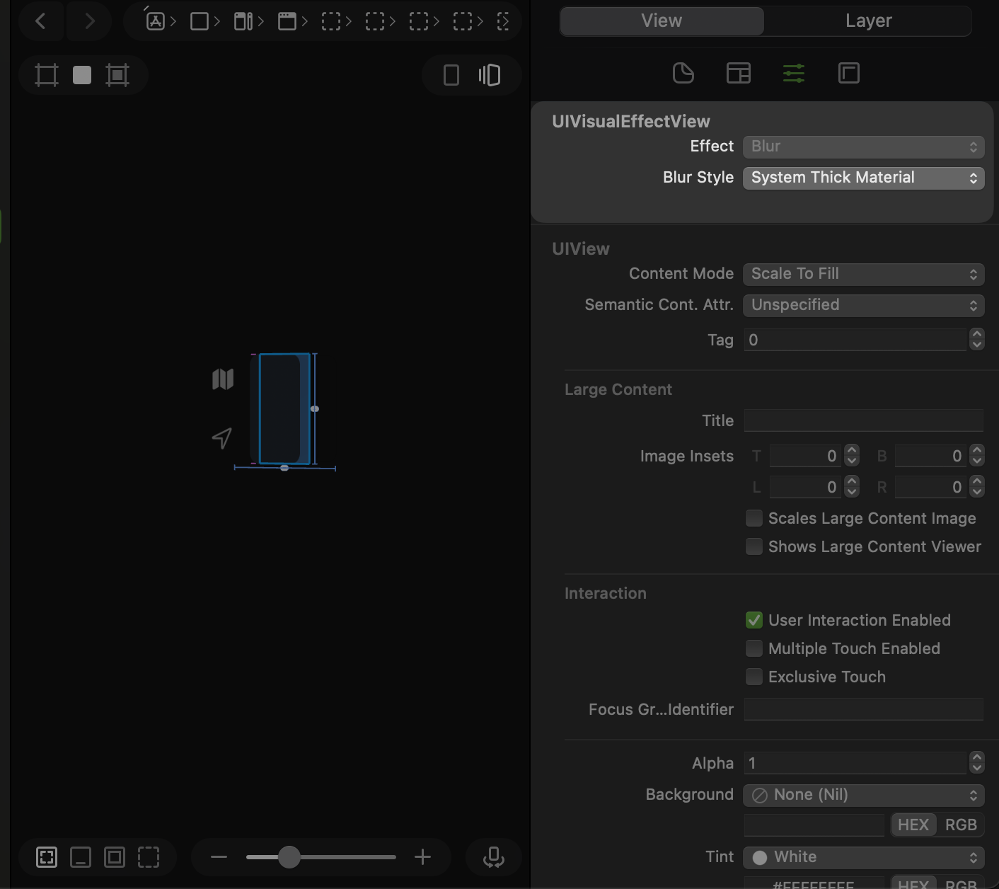

^ 右のパネルには、プロパティが表示されます。
^ このUIVisualEffectは、SystemThickMaterialであることも分かりました。

---

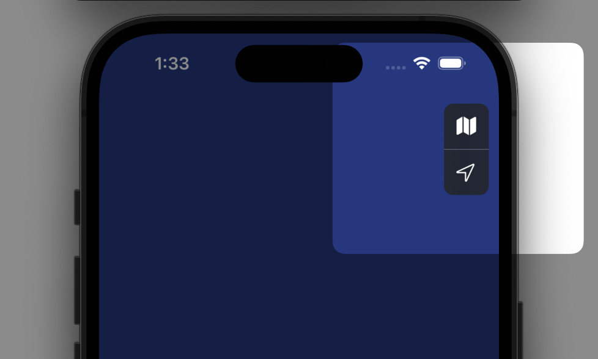

^ そして、これがプロパティやビュー階層を参考にして作ったCardViewです。
^ かなりそっくりに出来たと思います。
^ tintColorが再現できていませんが、これはカスタムボタンの実装によるものだと思います。
^ プロパティは真っ白だったのでポストエフェクトがかかっていそう。

---

# クラス名からヘッダーを探す

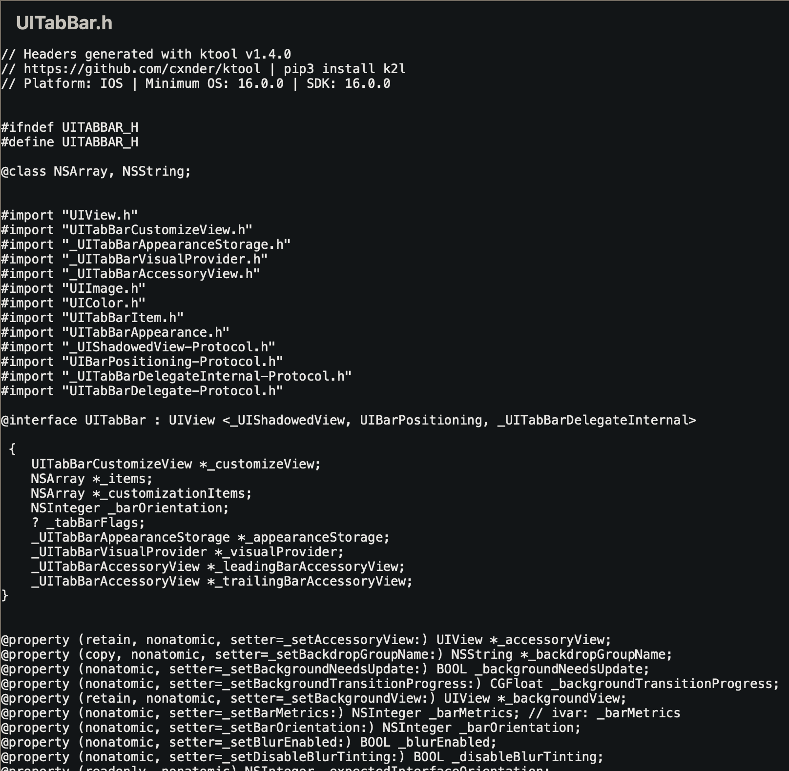

- ktool, DyldExtractor
  - https://github.com/0cyn/sdk-builder
- API設計を学ぶ
- FridaやLLDBでメソッドを実行して実験する

^ 今回はそこまで調査しませんでしたが、クラス名が分かったのなら、ヘッダーを見てさらに詳しい実装を追うことができます。
^ 具体的にはフレームワークからヘッダーをダンプすることができます。
^ Github Actionsで自動化しているプロジェクトがあるので、それを使うと簡単にできることかと思います。
^ また、メソッドが分かってしまえばFridaやLLDBから実行することも出来ます。
^ 先ほどのtintColorのようにプロパティだけでは分からない挙動を追うときに役立つことかと思います。

---

# UIを分析する観点

- ビジュアル􀋭
- **インタラクション􀬁**

^ これでビジュアルから、UIのお作法を知ることができました。
^ これだけで、だいぶiOSらしいカスタムUIが作れるようになったはずです。
^ ここからは、UIに状態や動きを与えてハリボテのUIからステップアップします。

---

# インタラクション

^ インタラクションとは、UIに対してユーザーが行う行動や、その反応を指します。
^ この観点では、何をしたらどうなるのかを徹底解剖していきます。

---

# インタラクションで大事なこと

当たり前の操作をしっかり提供する

- 自分にとっての当たり前ではなく、ユーザーにとっての当たり前を実装する
  - ジェスチャーによる入力
  - キーボードやポインターデバイスによる入力
  - フィードバック

^ インタラクションで大事なのは、当たり前の操作をしっかり提供することです。
^ 参考にするUIを触り尽くして、どんなインタラクションが設定されているかを確認しましょう。

---

# ジェスチャー

- ビューがどんなジェスチャーに対応しているか確認する
- 複数のジェスチャーを同時に使うこともある
  - 先入観を捨てて触ってみる
  - 見逃しがちなものをいくつか紹介

^ インタラクションの基本はジェスチャーです。タップしたり、スワイプしたり、ピンチしたり、などなど。
^ 操作する時は、先入観に捉われずに触れることが大事です。
^ 自分にとっては知らなかったり、滅多に使わない操作でも、あるユーザーにとっては当たり前の操作かもしれません。
^ 見逃しがちなジェスチャーをいくつか紹介します。

---

# Case1. 補助ジェスチャー

- タップでOn,Offの切り替え
- パンでも補助的に切り替えができる

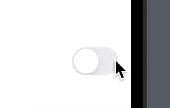

^ ケース１、補助ジェスチャー。
^ これは、本来の目的に対して補助的なジェスチャーを設定することで、ユーザーの操作を誘導するためのものです。
^ 例えば、UISwitchでは、タップでOn,Offの切り替えができる以外に、パンでも補助的に切り替えができます。
^ これは、ユーザーがスイッチの見た目通りの操作をしても、スイッチの切り替えが出来るように誘導するものです。

---

# Case2. 不可視トリガー


- ある程度見た目で使い方が分かるものがほとんど
- しかし、不可視のトリガーもある
  - シェイク、マルチタップ、3Dタッチなど

^ ケース２、不可視トリガー。
^ これは、ビジュアルからは読み解けないジェスチャーです。
^ 長押しでメニューを出したり、Shake to Undoが表示されるのがこれに当たります。
^ 基本的にはショートカットのようなものなので、使っている人からすると無いと不便に感じます。

---

# Case3. 閾値

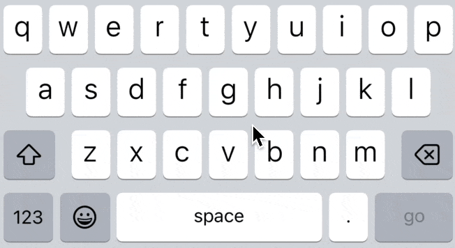

- 実際の見た目よりもズレた位置に判定がある場合もある

^ ケース３、閾値。
^ キーボードのボタンなど、少し見た目よりズレた位置に判定があったり、大きく判定を取っていることがあります。
^ 小さなボタンや密集したUIで採用されることが多いので、注意深く見てみると良いでしょう。

---

# 外部デバイスからの入力

- ハードウェアキーボード
  - ショートカットに対応しているか
- ポインターデバイス
  - ポインタがホバーした時の挙動

^ ジェスチャーと同じく、外部デバイスを接続した時の挙動についてもよく観察しておきましょう。
^ UIがショートカットに対応している事もよくあります。
^ 最近ではトラックパッドやApple Pencilも入力デバイスとして使えるようになりました。この辺りも注目しておきましょう。

---

[.autoscale: true]

# フィードバック

- ビジュアルフィードバック
- サウンド
- ハプティクス
- ボイスオーバー

^ そして、UIが返すフィードバックも忘れずに確認しておきましょう。
^ ここまでトレースしていれば、ハイライトやアニメーションによるフィードバックは自然と実装されていると思いますが、サウンドやハプティクスについても意識を向けてみましょう。

---

# サウンド

- 送信音、通知音、クリック音など
  - 音の長さ、音の大きさが参考になる

- ipaを解凍して、aifファイルを取り出す

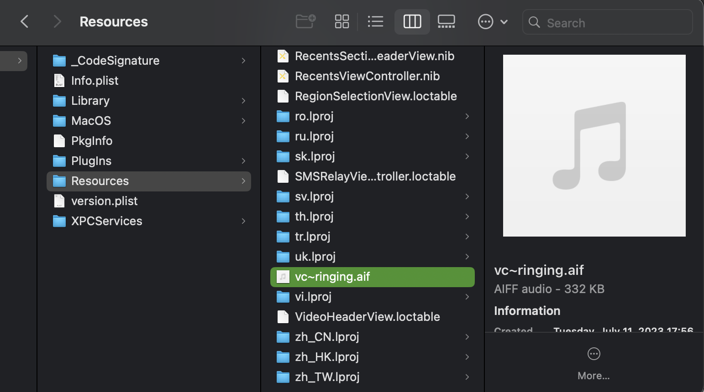

^ アプリによっては、サウンドを使ってフィードバックを行っていることがあります。
^ 音はaifファイルとしてアプリにバンドルされている事もあるので、取り出してみることで、音の長さや大きさから気持ちの良い音の作り方を学ぶことができるかもしれません。

---

# ハプティクス

- コンテキストメニュー、Pull to Refresh
- **付けてないところ**を意識する
  - タブの移動など

^ ハプティクスは、iPhoneのバイブレーションや、Apple WatchのHapticなど、触覚によるフィードバックです。
^ 意外とAppleの純正アプリは、ハプティクスを付けていないところが多いので、そこを意識してみると良いでしょう。
^ タブの移動など、無駄に付けているアプリがとても多いです。気をつけましょう。

---

# ボイスオーバー

- 設定 → アクセシビリティ → ボイスオーバー
- ボイスオーバーが読み上げる文章を確認する
- HIGも参照[^2]

[^2]: https://developer.apple.com/jp/design/human-interface-guidelines/accessibility#VoiceOver

^ そしてボイスオーバー。基本的には書いてある文章が読み上げられますが、画像や色などはカスタムな読み上げが実装されていることがあります。
^ 例えばカラーピッカーなどは選択した色の名前をOrange 26のように読み上げます。
^ ボイスオーバーが読み上げる文章はHIGのアクセシビリティの項目に記載されていますが、実際にどういった内容が設定されているのかを確認しておくと良いでしょう。

---

# カスタムUIを作る上でのヒント

^ これで、UIの分析に関する観点の紹介は以上になります。
^ 最後に、カスタムUIを作る上でのヒントを紹介します。

---

# UIの解釈は一致するとは限らない

- 参考にしたUIや色には設計思想がある
  - 明確な意図の上で実装されている
- 安易に真似しても、本来の思想とは異なる使い方になることもある
  - アプリ内通知にAirPodsのようなHUDを使うと、ユーザーは勘違いしないか？

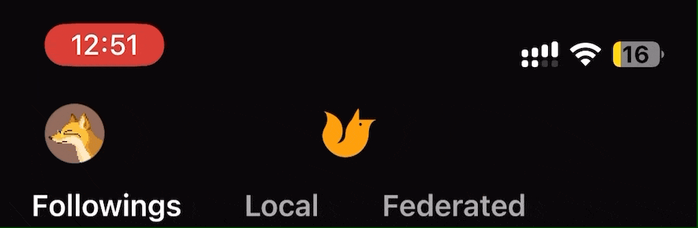

^ 今回、既存のUIを参考にしてカスタムUIを作るという話をしましたが、参考にしたUIやカラーには明確な設計思想や意図があります。
^ 例えば、AirPodsの接続HUDを真似して、アプリ内通知に使うとユーザーはシステムが出したHUDなのかアプリのものなのか区別しにくくなります。
^ 安易に真似せず、ユーザーに伝わるカスタムUIなのか意識しましょう。

<!-- ---

# ブランドカラーは乱用しない

- 音楽のアプリだからApple Musicの赤色を使う
  - その色は音楽を表す赤色ではなく、Apple Musicを表している！

^ そして解釈は、カラーについても同じことが言えます。
^ 特定の色は、ブランドを表していることがあります。音楽のアプリだからといって、Apple Musicの赤色を使うと、ユーザーは操作しているのがApple Musicの情報なのか、無関係のアプリなのか混乱する元になります。 -->

---

# 実装に最適なUIやAPIを選ぶ

- UIKitに既にあるものを再実装しない
  - スクロールの慣性を実装しない。UIScrollViewを使う
  - ボタンで良いならTapGestureで実装しない

^ 今回、UIの細部まで観察しましたが、なるべく既存のUIやAPIに頼ることをおすすめします。
^ 例えば、スクロールビューの慣性を再現するためにスクロールビューを１から作るなんて必要はありません。
^ 既存のAPIを最大限使って開発することで、標準的な動作を実装せずに済みます。

---

# デザインの追従コスト

- OSのアップデートによってデザインが変わる
- せっかく実装したUIが古臭く見えることも
  - デザインの追従コストが発生する

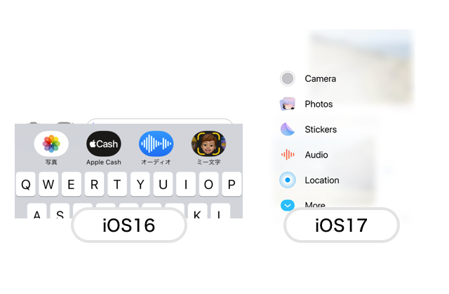

^ デザインの追従に関しても気にかけておきましょう。
^ Appleミュージックのバナーや、メッセージのメニューのように、OSのアップデートによってデザインが変わることがあります。
^ UIKitのコンポーネントなどは自動的にデザインが追従されますが、カスタムUIは自分で追従する必要があります。
^ せっかく実装したUIが古臭く見えることもあるので、デザインの追従コストが発生することも覚えておきましょう。

<!-- 
尺が足りないのでカット
---

# マルチプラットフォームの対応

- macOSやtvOSなどの対応も考える
- iOSの見た目のまま表示しない

^ そしてCatalystやtvOSで動作するコンポーネントもあります。
^ iOSの見た目のまま表示するとおかしなケースもありますから、プラットフォームごとに見た目を変える必要も出てくるかもしれません。 -->

---

# オフに出来ることも忘れずに

- アクセシビリティで無効に出来ることも
  - Shake to Undo
  - Reduce Motion

- 自前で実装したら、切り替えも考慮すること

^ また一部の機能はアクセシビリティで無効に出来ることも忘れずに。
^ 自前で実装したShake to Undoやアニメーションなどは、アクセシビリティで無効に出来るようにしましょう。

---

# 現実的に出来ないこともある

- カスタムUIは品質が落ちることを前提に
- **トレードオフを意識して、無駄にカスタムUI作らない**のがコツ
- 一回見た目の良いものを作ってからは戻せない
- アプリのコアバリューに絞って実装してみては

^ と、まぁ。ここまで紹介してきたことは、現実的には出来ないことも多いです。
^ カスタムUIをちゃんと作るって、結構大変なんですよね。
^ そういうわけで、全部を知らなくても勝手に色々やってくれるシステムUIコンポーネントをそのまま使うのが現状は一番良いかなと思います。
^ 大事なのは、カスタムUIを作るコストとトレードオフをしっかり理解して、取り組むこと。そこにアクセシビリティはあるのか、考えた上で本当に必要なところをカスタムUIで実装出来ると良いですね。

---

# See also

- https://github.com/scenee/FloatingPanel
- https://github.com/iDevelopper/PBPopupController
- https://github.com/omaralbeik/Drops
- https://github.com/SvenTiigi/WhatsNewKit
- https://github.com/usagimaru/FloatingSwitch
- https://github.com/noppefoxwolf/ColorPicker

^ 以上になります。最後に完成度の高いオープンソースのUIライブラリをいくつか掲載しておきます。
^ これらを参考にして、カスタムUIを作ってみたり、不足した機能をPRしてみたりしてみてはいかがでしょうか。

---

# おわり
