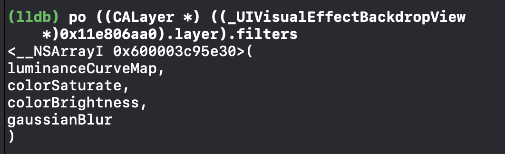
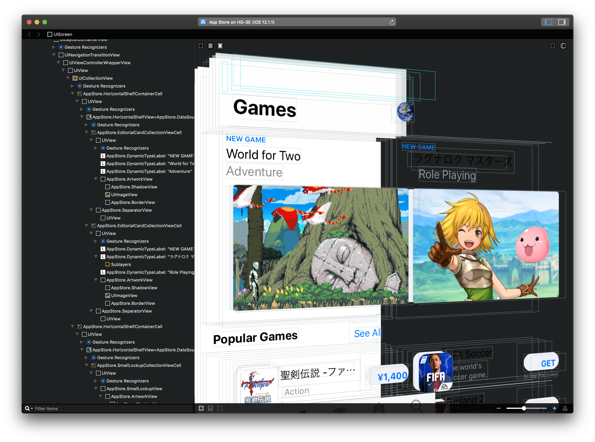

slidenumbers: true

# **UIのブラックボックスを探る**

## iOSDC23 day1 Track B noppe

^ UIのブラックボックスを探るというタイトルで発表します。よろしくお願いします。

---

## **noppe** @noppefoxwolf

- iOS app dev
- Love 🦊
- DeNA Co., Ltd.
  - Pococha
- Indie app
  - vear
  - Editormode
  - Nightfox DAWN for mastodon

^ みなさん、こんにちは。株式会社ディーエヌエーでiOSアプリのエンジニアをしているnoppeです。
^ 個人開発ではVTuber向けの自撮りアプリvearや、マストドンクライアントのNightfox DAWNを作っています。
^ また2018年から毎年iOSDCで発表させていただいています。ありがとうございます。
^ ８月頭に、第２子が生まれて２児の父でもあります。

---

# 脳内プレビュー@DeNAブース

^ さらに、現在オフライン会場ではDeNAブースで、私たちが主催する脳内プレビューイベントが開催されています。このイベントでは、SwiftUIのコードから脳内で実行結果を予想し、提出するために紙にUIを描くというクリエイティブなチャレンジがあります。ぜひ皆さん、お時間があれば遊びに来てください。楽しい時間をお約束します！

---

# 今日話すこと

^ そして今日は脳内プレビューとは逆に、既存のUIからコードや仕様を予測する方法について説明します。

---

# UIのブラックボックスとは

^ さて、まずはUIのブラックボックスとは。
^ 繰り返しになりますが、これはこのトークのための言葉なので、一般的な定義ではないことを断っておきます。

---

^ 我々がアプリを作るときに、ほぼ必ず独自のUIコンポーネントを作ります。ここでは、カスタムUIと呼ぶことにします。
^ これは、アプリの世界観やアイデンティティを構築するために必要だったり、既存のシステムコンポーネントに不足しているコントロールを補うために必要だったりします。
^ 例えば、カレンダーだったり、グラフだったり、画像ビューアだったり。

---

# カスタムUIの品質

- Apple製のUIと比べると悪くなりがち
  - バランスが悪い
  - 触り心地が悪い
  - 使いにくい
  - ...etc

^ しかし、多くのケースで、我々が作るカスタムUIは、Apple製のUIと比べて品質が低いことが多いです。なんだか見た目のバランスが悪いとか、見た目が良くても触り心地が悪かったり、そもそも使いにくいとか。
^ どうしてこの問題が起きてしまうのか

---

# Bad UIが出来てしまう理由

- システムのお作法を無視してしまうから
  - カスタムUIはシステムUIの上で作るべき（黄）
  - お作法を無視してUIを作る（青）と、違和感が発生

^ カスタムUIの品質の低さは、システムのお作法に乗っていないことが主な要因です。
^ ユーザーはiOSという巨大なお作法の上でアプリを使用しており、スクロールの慣性、タップエリア、アクセシビリティ、アニメーション、文字の大きさと太さなど、様々なお作法に慣れ親しんでいます。
^ カスタムUIがこれらのお作法を無視すると、ユーザーは違和感を感じてしまいます。
^ ゲームエンジンなどの上で起こりやすい問題というと分かりやすいと思いますが、ネイティブアプリでも同じ問題が起きています。
^ 逆にお作法をトレースし、それに乗っ取ったUIを作ることができれば、ユーザーは違和感なくアプリを使うことができます。

---

# UIのブラックボックスとは

- UIKit, SwiftUIを使うとある程度はお作法に乗っ取ったUIを作ることができる
- それ以外の暗黙のお作法は頑張るしかない
- 暗黙のお作法 = **ブラックボックス**
  - UIの違和感の正体

^ UIKitやSwiftUIを利用することで、ある程度はお作法に従ったUIを作ることができます。
^ しかし、標準アプリやプラットフォームの持つ細かなお作法については、手作業で頑張って実装していく必要があります。
^ この暗黙のお作法こそが、ユーザーに違和感を与える要因であり、UIにおけるブラックボックスと言えます。
^ 余談ですが、SwiftUIを使えば、かなりお作法に乗っ取ったUIを作ることが出来るのですが、そのせいで最近はむしろカスタムビューの品質の低さが目立つようになってしまいました。

---

# カスタムナビゲーションバーの例

^ ちょっと分かりにくい話だと思うので一つ、例を挙げてみます。
^ これは、カスタムナビゲーションバーを作った例です。
^ 一見すると、システムコンポーネントと同じように見えますが、

---

^ 実は、純正のナビゲーションバーと比較してシャドーの実装が違ったり、ブラーエフェクトが無かったり、端までスクロールした時の挙動が違ったり、ロングプレスジェスチャーの挙動が違ったり、などなどの違いがあります。
^ そんな小さな事、どうでも良い！と思うかもしれませんが、こういった要素の積み重ねがUIの触り心地に直結します。
^ それらを必要とするユーザーだっているわけですから。

---

# お作法を知るには1

- Human Interface Guidelines
  - 基本的なお作法はこれ
  - フォントサイズ・ボタンサイズなどのベストプラクティス

^ お作法の基本的な部分はHIGを読むのが良いでしょう。
^ 例えば、フォントサイズや、推奨されるボタンのサイズなど、基本的なお作法はHIGに書かれています。

---

# お作法を知るには2

- システムコンポーネントを分析する
  - HIGに書かれていないお作法
  - 品質の理想値

- システムコンポーネント
  - Apple製のアプリ
  - UIKitやSwiftUIのUIコンポーネント

^ それを前提に、実際にどういった値で実装されているのか、エッジケースの場合の挙動はどうなっているのかは、システムコンポーネントを分析して解明する必要があります。
^ システムコンポーネントと呼んでいるのは、Apple製のアプリや、UIKitやSwiftUIのUIコンポーネントのことです。
^ これらを分析するのは、システムコンポーネントが品質の理想値だからです。

---

# UIの分析

- ビジュアル􀋭
- インタラクション􀬁
- フィードバック􀜣

^ では、実際にどうやってシステムコンポーネントを分析するのか。
^ 今回のトークでは、自分がよく行っている分析の仕方を紹介します。
^ 実際のケースでは、自分が作ろうとしているカスタムビューに近い要素を探して取り組んでみてください。
^ UIは、ビジュアル、インタラクション、フィードバックの3つの要素で構成されています。
^ UIを分析するときは、この3つの要素を分析することで、お作法を知ることができます。

---

# ビジュアル

^ まずは一番基本的なビジュアルから見ていきましょう。

---

# ビジュアル

- サイズ・色・形など目に見えるもの
- 基本はスクショや画面録画をして計測、実装して比較

^ ビジュアルと一言に言っても、サイズや色、形など様々な要素があります。
^ これらは、ある程度の一貫性の上で設定されており、それを知ることで、よりiOSらしいUIを作ることができます。

---

# ビジュアルの適用例

^ 極端な例ですが、実際に使われているサイズを適用するだけでそれっぽい見た目になるということがわかるかと思います。
^ では要素を一つずつ見ていきましょう。

---

# サイズ

- アイコン・余白・文字サイズ・角丸
- スクショを撮影し測る
  - SketchやPhotoshopなどのRuler機能
- RocketSim Pro
- 文字サイズの場合は、スクショを半透明にして重ねて比較

^ まずはサイズを見ていきます。
^ アイコンや余白、文字サイズ、角丸などを見るのが良いでしょう。
^ 見方としては、スクショを撮影して、PhotoshopやSketchなどのルーラ機能を使って計測するのが良いでしょう。
^ また、RocketSim Proというアプリを使うと、スクショを撮影しなくても、シミュレータにルーラを表示して計測することができたりもします。

---

# サイズとアクセシビリティ

- アクセシビリティや「拡大表示」設定によって、サイズが変化するので注意
- Dynamic Typeは最大最小値が決まっている場合もある

---

# カラー

- 背景色・文字色・ボタンの色など
- カラーピッカーを利用する
  - Digital Color Meter, Sip, ColorSlurp
  - カラースペースを合わせておく

^ 色も見ることでも、お作法を知ることができます。

---

# カラーの例

- ヘルスケアで使われている色を使う事で、HealthKitと連携するボタンであることを認識しやすくなる
- カスタムなトグルの色をUISwitchと揃えることで、スイッチであることを認識しやすくなる

^ 実用的な例では、作ろうとしている類似のコンポーネントの色を見て、それを参考にすることができます。
^ 例えば、UISwitchの色と揃えることでユーザーはそれがスイッチであることを認識しやすくなります。また、ヘルスケアの色を揃えることでHealthKitと連携するボタンであることを認識しやすくなります。

---

# ダークモードとカラー

- Dynamic Colorは条件によって色が変わるので注意
  - ビューの階層
  - ダークモード

---

# 単色でないケース

単色で無い場合は色を取り出せないので注意

- ブラー, グラデーション, 透過度

---

# アニメーション

- duration, curve, timing
- iOS Simulator
  - Slow Animations
- スクリーンレコードをコマ送りして確認
  - iina

^ アニメーションはスクリーンレコードをして、フレームをコマ送りに確認することで、お作法に触れることができます。

---

# ビジュアルの変化

- インタラクションや環境によって変化する
  - 値の切り替え
  - ダークモード
  - アクセシビリティ

^ ビジュアルはインタラクションなどによって変化する
^ 変化したら、その変化についても観察することで、お作法を知ることができます。

---

# 高度なビジュアルの分析

---

# View Hierachy Debugger

- Lookin, Reveal, Xcode 
- 直接サイズを確認できる
- ビュー構造の理解にも役立つ

---

# Method invoke

- 直接プロパティを確認
- ビューをhiddenや色付け
- サイズ変更

単純で無いビューの調査に役立つ

---

# クラス名からメソッドリストを探す

- Objective-Cの場合は、クラス名からメソッドリストを探す
- https://developer.limneos.net/

^ クラス名が分かったのなら、Githubやlimneosなどで検索するとプライベートメソッドを含んだヘッダファイルを見つけることができます。
^ これによって、API設計などを学ぶことができます。

---

# Run Debugger globally

- rootにRevealやLookinのクライアントをインストールすることでFirst party appでも動かすことができる[^1]

[^1]: https://hackinggate.com/2019/06/11/inspect-the-view-hierarchy-of-any-ios-apps-on-ios-12.html

---

# Breakpoint globally

- Frida
  - 実行プロセスをフックして、任意のコードを実行することができる

^ Frida（フリーダ）

---

# UIの分析

- ビジュアル􀋭
- **インタラクション􀬁**
- フィードバック􀜣

---

# インタラクション

^ ひとまず見ることで、UIの構造を知ることができました。
^ これだけで、だいぶiOSらしいカスタムUIが作れるようになったはずです。
^ ここからは、UIに状態や動きを与えてハリボテのUIからステップアップします。

---

# ジェスチャー

- ビューがどんなジェスチャーに対応しているか確認する
- 複数のジェスチャーを同時に使うこともある
  - 先入観を捨てて触ってみる
  - 見逃しがちなものをいくつか紹介

^ 操作する時は、先入観に捉われずに触れることが大事です。
^ 自分にとっては知らなかったり、滅多に使わない操作でも、あるユーザーにとっては当たり前の操作かもしれません。

---

# Case1. 補助ジェスチャー

- タップでOn,Offの切り替え
- パンでも補助的に切り替えができる

---

# Case2. 不可視トリガー

- ある程度見た目で使い方が分かるものがほとんど
- しかし、不可視のトリガーもある
  - シェイク、マルチタップ、3Dタッチなど

^ 例えば、テキストビューはシェイクすることで入力を元に戻すアラートが表示されます。
^ もしテキスト入力のUIを作る時は、同じような機能を付けることでより自然な振る舞いになります。

---

# Case3. 閾値

- 実際の見た目よりもズレた位置に判定がある場合もある

---

# 外部デバイスからの入力

- ハードウェアキーボード,ポインターデバイス
  - ショートカットに対応しているか
  - ポインタがホバーした時の挙動

^ ジェスチャーと同じく、外部デバイスを接続した時の挙動についてもよく観察しておきましょう。

---

# UIの分析

- ビジュアル􀋭
- インタラクション􀬁
- **フィードバック􀜣**

---

# フィードバック

---

# フィードバック

- ビジュアルによるフィードバック
  - ハイライト、アニメーションなど
- サウンド
  - タップ音、スワイプ音、アラート音など
- 感覚フィードバック
  - バイブレーション、Hapticなど

^ ここまでトレースしていれば、ハイライトやアニメーションによるフィードバックは自然と実装されていると思いますが、サウンドや感覚フィードバックについても意識を向けてみましょう。

---

# ビジュアルによるフィードバック

UIの状態を意識する

- ハイライト
- ローディング
- プログレス

---

# サウンド

- ipaを解凍して、aifファイルを取り出す
- cafファイル
  - 波形や音の長さ、音の大きさ

---

# アクセシビリティ

- VoiceOver
  - ボイスオーバーが読み上げる文章を確認する
  - ボイスオーバーが読み上げる文章はHIGに記載されている[^2]

[^2]: https://developer.apple.com/jp/design/human-interface-guidelines/accessibility#VoiceOver

^ ボイスオーバーが読み上げる文章はHIGのアクセシビリティの項目に記載されていますが、実際にどういった内容が設定されているのかを確認しておくと良いでしょう。

---

# UI分析のヒント

---

# 法則を知識で補強する

- お作法の中に法則性を見ることがある
  - 応用力が付く

---

# UIの解釈は一致するとは限らない

- 参考にしたUIには設計思想がある
  - 明確な意図の上で実装されている
- 安易に真似しても、本来の思想とは異なる使い方になることもある

---

# １から実装するべきか

- UIKitに既にあるものを再実装しない

---

# デザインの追従コスト

- OSのアップデートによってデザインが変わる
- せっかく実装したUIが古臭く見えることも
  - デザインの追従コストが発生する

---

# まとめ

---

# 参考になるライブラリ

- https://github.com/scenee/FloatingPanel
- https://github.com/iDevelopper/PBPopupController
- https://github.com/omaralbeik/Drops

---

# おわり
