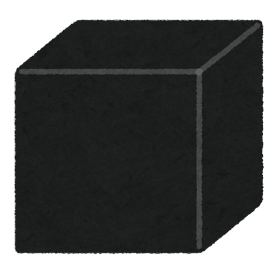
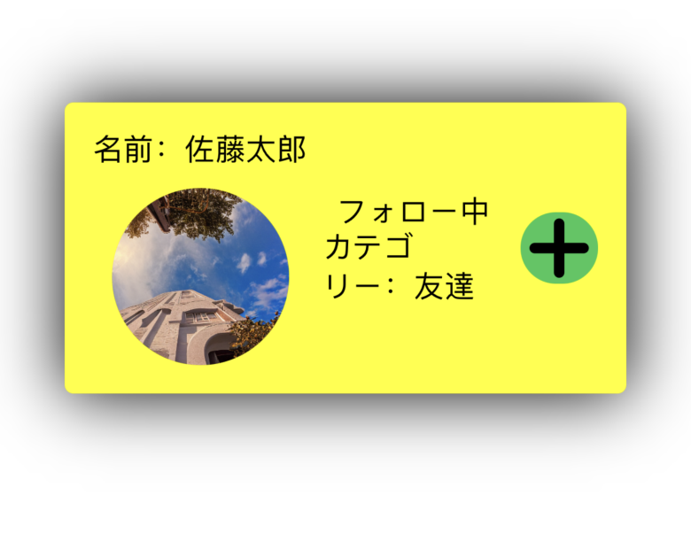

slidenumbers: true

# **UIのブラックボックスを探る**

## iOSDC23 day1 Track B noppe

^ UIのブラックボックスを探るというタイトルで発表します。よろしくお願いします。

---

## **noppe** @noppefoxwolf

- iOS app dev
- Love 🦊
- DeNA Co., Ltd.
  - Pococha
- Indie app
  - vear
  - Editormode
  - Nightfox DAWN for mastodon

^ 株式会社ディーエヌエーでiOSアプリのエンジニアをしているnoppeと言います
^ 個人開発ではVTuber向けの自撮りアプリvearや、マストドンクライアントのNightfox DAWNを作っています。
^ あと、きつねが好きです。
^ ８月頭に、第２子が生まれました。

---

# 脳内プレビュー@DeNAブース

^ そして、現在オフライン会場ではDeNAブースで脳内プレビューイベントを開催しています。このイベントは、SwiftUIのコードから、脳内で実行結果を予想し、紙にUIを描いて提出するというものです。ぜひ、遊びに来てください。

---

# 今日話すこと

^ そして先に紹介しておくと、今日は脳内プレビューと逆に既にあるUIからコードや仕様を予測するにはどうすれば良いのかということについて話します。お楽しみに

---

# Agenda

- UIのブラックボックスとは
- システムコンポーネントの分析
- まとめ

^ さて、今日は、このような流れで話します。
^ まず、タイトルにもなっているブラックボックスとは。これはこのトークのための言葉ですが、何なのか、どうしてそれを知る必要があるのかについて話します。
^ 次に、そのブラックボックスの中身を明らかにし、理解するための実践的なテクニックを色々な角度から紹介します
^ 最後に、まとめとなります。
^ だいたい20分くらいですが、途中で質問があれば、どんどん聞いてください。

---

# UIのブラックボックスとは

^ さて、まずはUIのブラックボックスとは。
^ 繰り返しになりますが、これはこのトークのための言葉なので、一般的な定義ではないことを断っておきます。

---

# UIのブラックボックスとは

^ 我々がアプリを作るときに、ほぼ必ず独自のUIコンポーネントを作ります。ここでは、カスタムUIと呼ぶことにします。
^ これは、アプリの世界観やアイデンティティを構築するために必要だったり、既存のシステムコンポーネントに不足しているコントロールを補うために必要だったりします。
^ カレンダーだったり、グラフだったり、画像ビューアだったり。

---

# UIのブラックボックスとは

^ しかし、多くのケースで、我々が作るカスタムUIは、システムコンポーネントと比べて品質が低いことが多いです。なんだかバランスが悪いとか、誰かにとって使いづらいとか、そもそも使いにくいとか。
^ どうしてこの問題が起きてしまうのか

---

# UIのブラックボックスとは

- システムのUIが全てのベース
- UIKitやSwiftUIによってその一部分は開発者に提供されている
- カスタムUIもその延長線上にあるべき
- iOSのお作法を無視してUIを作ってしまう（青い部）と、使いにくく違和感のあるものになってしまう

^ それは、システムのお作法に乗っ取っていないから。
^ ユーザーは、iOSという巨大なお作法の上に則って、アプリを使っています。
^ スクロールの慣性や、タップエリア、アクセシビリティ、アニメーション、文字の大きさ、太さなどなど。
^ これらのお作法を無視して、独自のUIコンポーネントを作ると、ユーザーは違和感を感じてしまいます。
^ 逆にお作法をトレースし、それに乗っ取ったUIを作ることができれば、ユーザーは違和感なくアプリを使うことができます。

---

# UIのブラックボックスとは

暗黙のお作法 = **ブラックボックス**

- UIの違和感の正体

^ しかし、仕様定義やUIデザインの作成の中で、こういったお作法が考慮されることほとんどありません。
^ このお作法こそ、UIにおけるブラックボックスになっているという事です。
^ 特に最近はSwiftUIを使えば、暗黙的にお作法に乗っ取ったUIを作ることができるため、独自のUIコンポーネントとの差が顕著になる傾向があります。
<!-- 時間あまりそうなら、なぜブラックボックスになってしまうのかを解説する -->
<!-- 組織で関心が持てるのがエンジニアだけだから、デザインをそのまま実装してハリボテを通してしまうから -->

---

# カスタムナビゲーションバーの例

^ ちょっと分かりにくい話だと思うので一つ、例を挙げてみます。
^ これは、カスタムナビゲーションバーを作った例です。
^ 一見すると、システムコンポーネントと同じように見えますが、

---

Left: CustomNavigationBar, Right: UINavigationBar

^ 実は、シャドーの実装が違ったり、ブラーエフェクトが無かったり、端までスクロールした時の挙動が違ったり、ロングプレスジェスチャーの挙動が違ったり、などなどの違いがあります。
^ そんな小さな事、どうでも良い！と思うかもしれませんが、システムコンポーネントにあるこれらの要素がなぜあるのかを知らずに省くのは、あまりお行儀が良いとは言えません。
^ それらを必要とするユーザーだっているわけですから。

---

# お作法を知るには

- Human Interface Guidelines
  - 基本的なお作法はこれ
  - フォントサイズ・ボタンサイズなどのベストプラクティス

^ お作法の基本的な部分はHIGを読むのが良いでしょう。
^ 例えば、フォントサイズや、推奨されるボタンのサイズなど、基本的なお作法はHIGに書かれています。

---

# お作法を知るには

- システムコンポーネントを分析する
  - HIGに書かれていないお作法
  - 品質の理想値

- システムコンポーネント
  - Apple製のアプリ
  - UIKitやSwiftUIのUIコンポーネント

^ それを前提に、実際にどういった値で実装されているのか、エッジケースの場合の挙動はどうなっているのかは、システムコンポーネントを分析して解明する必要があります。
^ これは、システムコンポーネントが品質の理想値だからです。

---

# UIの分析

- ビジュアル􀋭
- インタラクション􀬁
- フィードバック􀜣

^ UIは、ビジュアル、インタラクション、フィードバックの3つの要素で構成されています。
^ UIを分析するときは、この3つの要素を分析することで、お作法を知ることができます。

---

# ビジュアル􀋭

^ まずは皆さんに馴染みのあるビジュアルから見ていきます。

---

# ビジュアル

- サイズ・色・形など目に見えるもの
- 基本はスクショや画面録画をして計測、実装して比較

^ UIを見て観察することは、基本中の基本です。
^ ここで得られるお作法を知ることで、不恰好なUIを作らないようにすることができます。

---

# サイズ

- アイコンサイズ・余白・文字サイズ
- スクショを撮影し測る
  - SketchやPhotoshopなどのRuler機能
- RocketSim Pro
- 文字サイズの場合は、スクショを半透明にして重ねて比較

^ まずはサイズを見ていきます。
^ これは、スクショを撮影して、測ることで、実際の値を知ることができます。
^ また、RocketSim Proというアプリを使うと、スクショを撮影しなくても、シミュレータにルーラを表示して計測することができます。
^ スクリーンショットの場合は、ただ、スケールがあるので、そのスケールを割った値が、実際にCGRectで指定する値になります。

---

サイズの調整例

^ 極端な例ですが、こうした方法でUIのサイズや余白を調整することで、よりシステムコンポーネントに近いUIを作ることができます。

---

# アクセシビリティとサイズ

- アクセシビリティや「拡大表示」設定によって、サイズが変化するので注意
- Dynamic Typeは最大最小値が決まっている場合もある

---

# カラー

- 背景色・文字色・ボタンの色など
- カラーピッカーを利用する
  - Digital Color Meter, Sip, ColorSlurp
  - カラースペースを合わせておく

^ 色も見ることでも、お作法を知ることができます。

---

# カラーの例

- ヘルスケアで使われている色を使う事で、HealthKitと連携するボタンであることを認識しやすくなる
- カスタムなトグルの色をUISwitchと揃えることで、スイッチであることを認識しやすくなる

^ 実用的な例では、作ろうとしている類似のコンポーネントの色を見て、それを参考にすることができます。
^ 例えば、UISwitchの色と揃えることでユーザーはそれがスイッチであることを認識しやすくなります。また、ヘルスケアの色を揃えることでHealthKitと連携するボタンであることを認識しやすくなります。

---

# ダークモードとカラー

- Dynamic Colorは条件によって色が変わるので注意
  - ビューの階層
  - ダークモード

---

# 単色でないケース

単色で無い場合は色を取り出せないので注意

- ブラー, グラデーション, 透過度

---

## アニメーション

- duration, curve, timing
- iOS Simulator
  - Slow Animations
- スクリーンレコードをコマ送りして確認
  - iina

^ アニメーションはスクリーンレコードをして、フレームをコマ送りに確認することで、お作法に触れることができます。

---

# 高度なビジュアルの分析

---

# View Hierachy Debugger

- Lookin, Reveal, Xcode 
- 直接サイズを確認できる
- ビュー構造の理解にも役立つ

---

# Method invoke

- 直接プロパティを確認
- ビューをhiddenや色付け
- サイズ変更

単純で無いビューの調査に役立つ

---

# Run Debugger globally

- rootにRevealやLookinのクライアントをインストールすることでFirst party appでも動かすことができる[^1]

[^1]: https://hackinggate.com/2019/06/11/inspect-the-view-hierarchy-of-any-ios-apps-on-ios-12.html

---

# Breakpoint globally

- Frida
  - 実行プロセスをフックして、任意のコードを実行することができる

^ Frida（フリーダ）

---

# UIの分析

- ビジュアル􀋭
- **インタラクション􀬁**
- フィードバック􀜣

---

# インタラクション

^ ひとまず見ることで、UIの構造を知ることができました。
^ これだけで、だいぶiOSらしいカスタムUIが作れるようになったはずです。
^ ここからは、UIに状態や動きを与えてハリボテのUIからステップアップします。

---

# ジェスチャー

- ビューがどんなジェスチャーに対応しているか確認する
- 複数のジェスチャーを同時に使うこともある
  - 先入観を捨てて触ってみる

---

# Case1. 補助ジェスチャー

- タップでOn,Offの切り替え
- パンでも補助的に切り替えができる

---

# Case2. 不可視トリガー

- ある程度見た目で使い方が分かるものがほとんど
- しかし、不可視のトリガーもある
  - シェイク、マルチタップ、3Dタッチなど

---

# Case3. ジェスチャーの閾値

- 実際の見た目よりもズレた位置に判定がある場合もある

^ ほとんどのUIは操作の出来るコントロールとして存在しています。
^ そのため、実際に操作してみることで、お作法を知ることができます。

---

### インタラクション・ジェスチャー

- 先入観に捉われずに触れることが大事

^ 操作する時は、先入観に捉われずに触れることが大事です。
^ 自分にとっては知らなかったり、滅多に使わない操作でも、あるユーザーにとっては当たり前の操作かもしれません。
^ 例えば、テキストビューはシェイクすることで入力を元に戻すアラートが表示されます。
^ もしテキスト入力のUIを作る時は、同じような機能を付けることでより自然な振る舞いになります。

---

## ハードウェアキーボード・ショートカット・ポインターデバイス

- キーボードアクセサリの挙動
- ポインタがホバーした時の挙動

^ ジェスチャーと同じく、外部デバイスを接続した時の挙動についてもよく観察しておきましょう。

---

## 動的な要素

- ボタンの有効無効や、セルの表示・非表示など
  - 状態を見つけたら、再度観察をする

^ ところで、UIに触れているとUIの見た目が変化することがあります。
^ 変化は段階的に行われることもあるので、スクリーンレコードで記録しておくと良いでしょう。
^ 状態を見つけたら、再度アニメーションや色などを観察してみましょう。

---

## アクセシビリティ

- VoiceOverなどのアクセシビリティ機能を使う
- アクセシビリティ機能は、UIを変化させる

^ アクセシビリティ機能も同様に、UIを変化させることがあります。
^ 文字のサイズなどはアクセシビリティによって変化する場合でも最大サイズが設定されていたりします。
^ また、SmartInvertでは例外的に色反転を行わないようにすることができます。
^ 参考にするUIを表示した状態で一通りのアクセシビリティ機能を試してみましょう。

---

## 聞く

---

## 効果音 / haptic feedback

- タップ音、スワイプ音、アラート音など

^ iOSではあまり採用されませんが、効果音がなっているかにも注目してみましょう。
^ また、haptic feedbackもUIによっては採用されていることがあります。

---

## アクセシビリティ

https://developer.apple.com/jp/design/human-interface-guidelines/accessibility#VoiceOver

^ ボイスオーバーが読み上げる文章はHIGのアクセシビリティの項目に記載されていますが、実際にどういった内容が設定されているのかを確認しておくと良いでしょう。

---

# 構造を分析する

^ ここまでで、UIを観察して、UIの特性を理解することができました。
^ しかし、これをSwiftのコードに落とし込むには、もう少しヒントが欲しいところです。
^ 例えば、どんなビューの分け方をしているのか、ボタンのサブクラスなのか、ジェスチャーなのか、APIの設計の仕方で実装が大きく変わることもあります。
^ なるべく手戻りしたくないですから、なるべく答えに近づきたいですよね。

---

## subview探索

- subviewsプロパティを使う

^ もし、実行コードの中でUIを操作しているならsubviewsプロパティでsubviewを探索してみましょう。
^ これは、UIの構造を理解するのに役立ちます。

---

## subview探索

- lookin, Reveal, XcodeのDebug View Hierarchyなどのツールを使う
- これらのツールは、アプリのUIを解析して、UIの構造を可視化する
- これで直接答えを得ることができる

^ ビューのインスペクターアプリを使うと、さらに細かい情報を得ることができます。
^ 序盤で解説したサイズや色については、これらを使うことでほぼ直接答えを得ることができます。

---

# デモ

- lookin

---

## クラス名を知る

- subviewで手に入れたビューのクラス名を調べる
- クラス名を知ることで、ビューの目的が分かる

^ さて、UIの構造が理解出来たら、次はそのビューたちが何をしているのかを理解する必要があります。
^ クラス名を知ることで、だいたいそのビューが何をしているのかが分かります。

---

## クラス名からメソッドリストを探す

- Objective-Cの場合は、クラス名からメソッドリストを探す
- https://developer.limneos.net/

^ クラス名が分かったのなら、Githubやlimneosなどで検索するとプライベートメソッドを含んだヘッダファイルを見つけることができます。
^ これによって、API設計などを学ぶことができます。

---

## invoke method

- なんでもできる

^ インスタンスアドレスを取得することで、直接メソッドコール出来るようになります。
^ 余分なUIを消したり、状態を変えて理解を深めることができます。

---

# まとめ

カスタムUIとシステムコンポーネントの間には、大きな差があります。
システムコンポーネントを観察することで、その差を理解することができます。
観察の過程で、システムコンポーネントの意図や設計を理解することができます。
  - 解釈が一致するとは限らない
理解した上で、カスタムUIを実装するとよりiOSらしいUIを作ることができます。
  - ただしOSによって表現は異なることに注意

---

## 参考になるライブラリ

- https://github.com/scenee/FloatingPanel
- https://github.com/iDevelopper/PBPopupController
- https://github.com/omaralbeik/Drops

---

## まとめ

こんなにめんどい事をしないとカスタムUIは作れないなら、多少カスタマイズ出来なくても我慢して標準UIを素直に使いましょう。そう、SwiftUIならね。

---

## おわり
