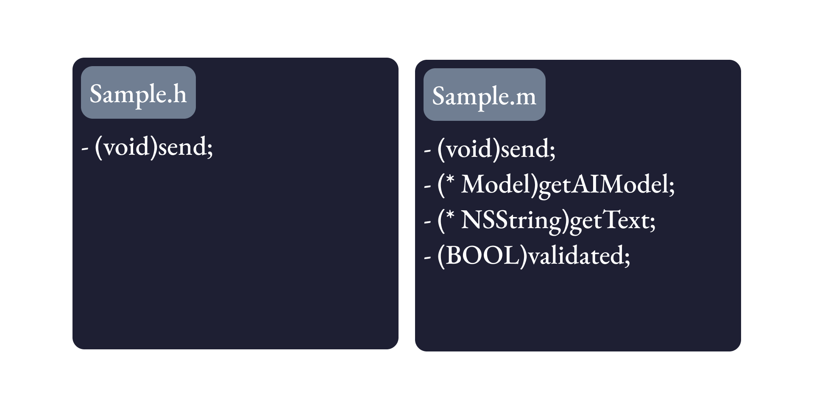
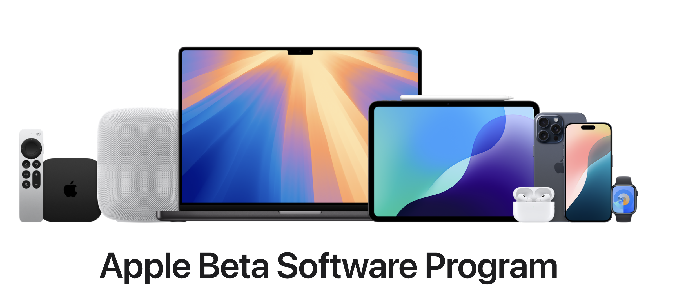
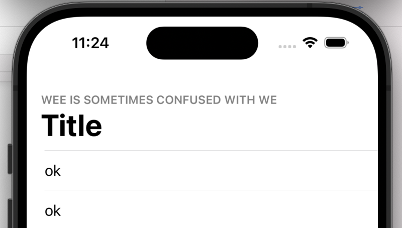
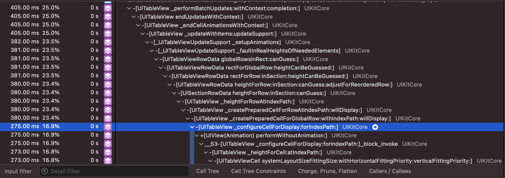
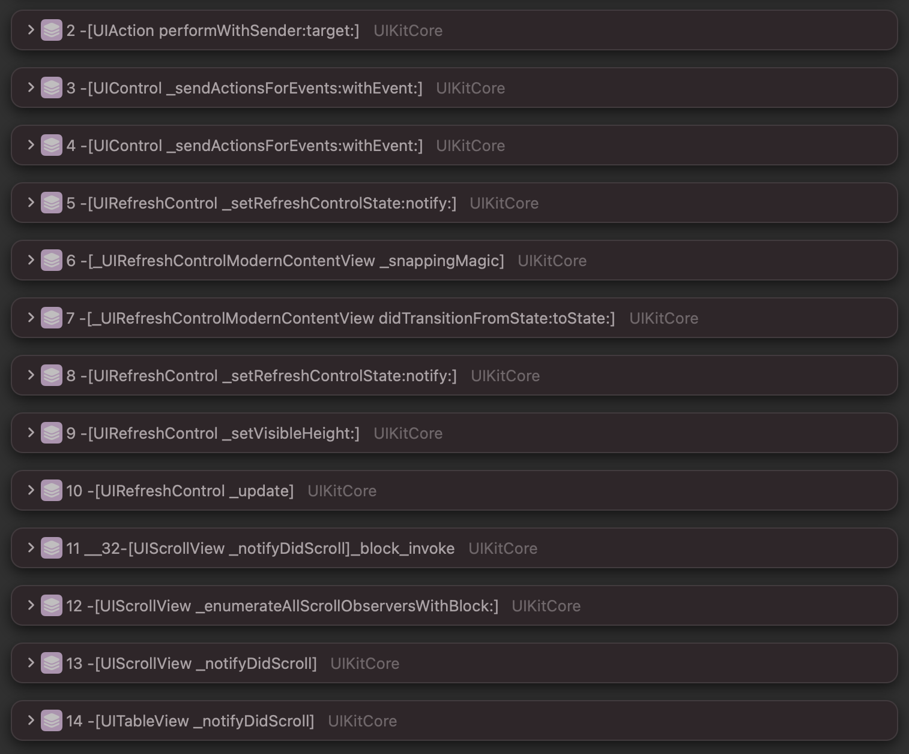
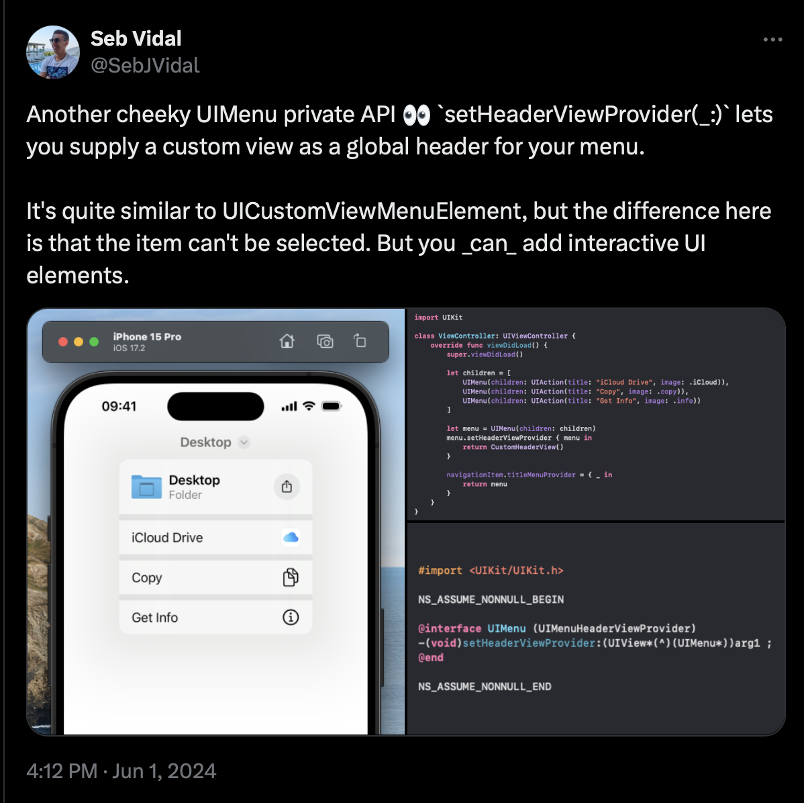
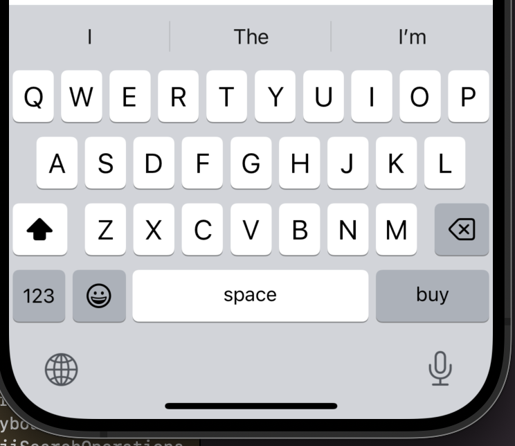

slidenumbers: true
slidecount: true
slide-transition: false
slide-dividers: #, ##, ###, ####
autoscale: true
theme: Inter 2.0, 2
background-color: #F6F5F7
header: text-scale(0.6)

# How to access hidden iOS APIs and enhance development efficacy.

2024/08/23 10:50〜
Track B
Regular talk（20 min）

# noppe

- Indie app developer
    - DAWN for mastodon
    - vear - VTuber camera app


^ こんにちは、noppeと言います。
^ 個人でmastodonのサードパーティアプリや、Vtuber向けのカメラアプリを開発しています。
^ きつねが好きで、このアイコンで活動していますのでSNSで見かけた際はぜひ話しかけてください。

# DeNA Co., Ltd.,

- iOS Engineer
    - 2016〜
- Pococha

^ また、2016年からDeNAでライブアプリのPocochaを開発しています。
^ 8年目になりますが、どんどんメンバーも増え新しいことに日々チャレンジしています。

# Enjoy my talk!

- Talking is Japanese
- Slide is English

^ なお、トークは日本語で行いますが、日本のエンジニアイベントに興味を持ってくれた海外の方にも楽しんでいただけるように、英語でスライドを表示しています。
^ 今日のトークでは「iOSの隠されたAPIを解明し、開発効率を向上させる方法」をお話しします。

---


^ 我々が日々アプリ開発をする際には、SwiftやObjCなどのプログラミング言語や、SwiftUIやUIKitなどのフレームワークを使ってアプリを構築しています。
^ フレームワークは特定の用途に特化していて、それらの開発を快適に進められるようにしたり、開発者が多くを学ばずともプロダクトの開発に集中できるようなAPIを提供しています。

---


^ 一方で、そういったフレームワークを構築するためのAPIは隠されており、公開されていません。
^ これらのAPIは非公開APIと呼ばれ、もちろん通常の開発では利用することができません。
^ しかし、非公開APIを上手に活用して、開発効率を向上させることが出来るのではないかと考えました。
^ 今日は、そんな非公開APIとの上手な付き合い方についてお話ししたいと思います。

# Agenda

- Perform
- Usecase
- Find


^ 本日のアジェンダです。
^ まずは、非公開APIを実行するデモンストレーションをしましょう。
^ 非公開APIには色々な種類があり、それぞれ実行する方法が異なります。今日はベーシックな方法を紹介します。
^ デモンストレーションの後に、非公開APIの最適なユースケースとリスクについて考えてみます。
^ これが、このトークのメインテーマです。
^ 最後に、非公開APIを見つける方法についてお話しします。
^ 全てのトピックに共通するのは、手段とリスクを理解することです。
^ このトークを通じて、自分なりの非公開APIの使いどころを見つけられればと思います

## Agenda

- **Perform**
- Usecase
- Find

^ それでは、最初に非公開APIを実行する方法について理解していきましょう。
^ 非公開APIは、公開されていないAPIなので、通常の方法では呼び出すことができません。

### ObjC Private API



^ まずはObjCのAPIについて見ていきましょう。
^ ObjCでは、ヘッダーファイルと実装ファイルに定義が分かれています。
^ ヘッダーファイルにメソッドやクラスを書くことで、他のクラスにクラスの持つ機能を知らせることができます。
^ つまり、ヘッダーファイルに書かれていない実装ファイルのメソッドは非公開APIということになります。

### ObjC Private API

```ObjC
Sample *object = [Sample new];

// Success
[object send]; 

// Error
[object validate]; 
```

^ 例えば、先ほどのSampleクラスでは、sendメソッドはヘッダーファイルに書かれているので呼び出すことができます。
^ しかし、validateメソッドはヘッダーファイルに書かれていないので呼び出すことができません。
^ このような非公開APIを呼び出すためには、別の方法を使う必要があります。

### ObjC Private API

Add header file.

```ObjC
@interface Sample (Private)
- (BOOL)validate;
@end
```

```ObjC
// Success
[objcect validate];
```

^ 方法の一つは、自分でヘッダーファイルを拡張し、メソッドの宣言を追加することです。
^ これにより、実装を後から公開することができ、他のクラスから呼び出すことができるようになります。

### ObjC Private API

Manually dynamic dispatch

```ObjC
[object performSelector:NSSelectorFromString(@"validate")];
```

^ もう一つの方法は、Dynamic Dispatchを使うことです。
^ ObjCでは、各実装はメソッド名によって識別されるため、メソッド名を直接指定することで呼び出すことができます。
^ これを使うことで、非公開APIでもメソッド名と引数の構造がわかれば呼び出すことができます。
^ ObjCで一般的に使われているNSObjectには、performSelectorメソッドが用意されているので、これを使うことで文字列からメソッドを直接指定して簡単に呼び出すことができます。

### ObjC Private API

```ObjC
object.isValidate = YES;
```

```ObjC
object.performSelector(
    NSSelectorFromString(@"setIsValidate:"), 
    withObject: @(YES)
);
```

^ プロパティの場合も、同様にperformSelectorを使って呼び出すことができます。
^ ObjCではプロパティは内部的にsetter/getterメソッドが呼び出されるため、これを使ってプロパティを操作することができます。
^ setterのように引数がある場合は、performSelector:withObjectを使って引数を渡すこともできます。

### Swift Hidden API

- Swift does not have header file
- Dynamic Link Framework has Swift module data

^ 次にSwiftのAPIについて見ていきましょう。
^ Swiftにはヘッダーファイルがないため、非公開APIを呼び出す方法限られます。
^ 現状では、Swiftで書かれたDynamic Link Frameworkに限って呼び出す方法が分かっています。
^ Dynamic Link FrameworkはSwiftモジュールの定義ファイルを持っており、非公開のAPIを見つけることができます。

### Swift Hidden API

- tbd
    - dynamic library stub for Eager linking [^4]
    - public and internal api list

- swiftinterface
    - public api list

[^4]: https://developer.apple.com/jp/videos/play/wwdc2022/110364/

^ Swiftモジュールの定義ファイルは、tbdファイルとswiftinterfaceファイルがあります。
^ tbdファイルには、publicとinternalのAPIリストが含まれています。
^ swiftinterfaceファイルには、publicのAPIリストが含まれています。

### Swift Hidden API

```
/Applications
    /Xcode.app
        /Contents
            /Developer
                /Platforms
                    /iPhoneSimulator.platform
                        /Developer
                            /SDKs
                                /iPhoneSimulator.sdk
                                    /System
                                        /Library
                                            /Frameworks
                                                /SwiftUI.framework
```

^ 実際にSwiftUIのフレームワークを見てみましょう。
^ SwiftUIのフレームワークは、XcodeにバンドルされているSDKの中にあります。
^ 少しパスが長いので、私はクリップボードヒストリーなどに保存して呼び出せるようにしています。

### Swift Hidden API

[.code-highlight: all]
[.code-highlight: 8, 10, 12]

```
SwiftUI.framework
├── Headers
│   ├── SwiftUI.h
│   └── SwiftUI_Metal.h
├── Modules
│   ├── SwiftUI.swiftmodule
│   │   ├── arm64-apple-ios-simulator.swiftdoc
│   │   ├── arm64-apple-ios-simulator.swiftinterface
│   │   ├── x86_64-apple-ios-simulator.swiftdoc
│   │   └── x86_64-apple-ios-simulator.swiftinterface
│   └── module.modulemap
└── SwiftUI.tbd
```

^ フレームワークは次のような構造になっています。
^ APIのリストが含まれたファイルは、このswiftinterfaceとtbdファイルです。
^ まずはswiftinterfaceファイルを見てみましょう。

### Swift Hidden API

arm64-apple-ios-simulator.swiftinterface

```swift
...
@_Concurrency.MainActor
open class UIHostingController<Content> : UIKit.UIViewController 
where Content : SwiftUICore.View {
    @_Concurrency.MainActor @preconcurrency 
    public var _disableSafeArea: Swift.Bool {
        get
        set
    }
}
...
```

^ swiftinterfaceファイルは、通常のswiftと同じように読めるテキストファイルです。
^ 実装は含まれていないので、protocolのようにメソッドの宣言だけが含まれています。
^ この例は、swiftinterfaceの一部を抜粋したものですが、UIHostingControllerに_disableSafeAreaというプロパティがあることがわかります。
^ このように、ドキュメントには載っていない隠されたAPIが実は公開されているということが分かりました。

### Swift Hidden API

```swift
let vc = UIHostingController(rootView: ContentView())
vc._disableSafeArea = true
```

^ 実際に、この_disableSafeAreaプロパティを使ってUIHostingControllerのsafeAreaを無効にすることができます。

### Swift Hidden API

SwiftUI.tbd

```
--- !tapi-tbd
tbd-version:     0
targets:         [ i386-ios-simulator, x86_64-ios-simulator, arm64-ios-simulator ]
install-name:    '/System/Library/Frameworks/SwiftUI.framework/SwiftUI'
current-version: 0.0.0
swift-abi-version: 0
exports:
  - targets:         [ i386-ios-simulator, x86_64-ios-simulator, arm64-ios-simulator ]
    symbols:         [ ... ]
```

^ 次に、tbdファイルを見てみましょう。
^ tbdファイルは、publicとinternalのAPIのリストが含まれているファイルです。
^ exportsのsymbolsには、公開されているAPIのリストが含まれています。

### Swift Hidden API

SwiftUI.tbd (exports/symbols)

```
...
'_$s7SwiftUI4ViewPAAE12userActivity...', 
'_$s7SwiftUI4ViewPAAE12userActivity...', 
'_$s7SwiftUI4ViewPAAE12userActivity...', 
'_$s7SwiftUI4ViewPAAE12userActivity...', 
'_$s7SwiftUI4ViewPAAE12variableBlur...',
'_$s7SwiftUI4ViewPAAE12variableBlur...',
...
```

^ これが、exportsのsymbolsに含まれるAPIのリストです。
^ APIのリストは、マングリングされたシンボル名で記述されています。

### Swift Hidden API

```swift
swift demangle '_$s7SwiftUI4....'

_$s7SwiftUI4.... --->
View.variableBlur(maxRadius: CGFloat, mask: Image, opaque: Bool) -> some
```

^ swiftコマンドには、demangleというサブコマンドがあります。
^ `swift demangle`でマングリングされたシンボル名をデマングルすると、元のメソッド名と引数がわかります。
^ 実は、このvariableBlurというメソッドは、SwiftUIのinternal APIで、swiftinterfaceには記述されていません。
^ そのため、このメソッドを使うことはできません。

### Swift Hidden API

modify swiftinterface

```swift
@available(iOS 17.0, macOS 14.0, watchOS 10.0, tvOS 17.0, *)
extension SwiftUICore.View {
    nonisolated public func variableBlur(
        maxRadius: CoreFoundation.CGFloat,
        mask: SwiftUI.Image,
        opaque: Swift.Bool
    ) -> some SwiftUI.View
}
```

^ しかし、このデマングルしたメソッドを、先ほどのswiftinterfaceファイルに記述することで、internal APIをpublic APIとして定義した改造フレームワークを作ることができます。
^ 実際に、このメソッドを使ってみましょう。

### Swift Hidden API


^ このように、variableBlurメソッドを使って、ビューに段階的なぼかしをかけることが出来ました。

#### UnderscoredAttributes[^1] [^5]

```swift
extension View {
    @_disfavoredOverload
    func badge(_ count: Int) -> some View {
        // ...
    }
}
```

[^1]:https://github.com/swiftlang/swift/blob/main/docs/ReferenceGuides/UnderscoredAttributes.md

[^5]:https://github.com/swiftlang/swift/pull/37854

^ 最後は、SwiftのUnderscoredAttributesについて見ていきましょう。
^ Swiftには、_で始まるAttributesがいくつか存在します。
^ 例えば、@_disfavoredOverloadは同名のメソッドがある場合に、自身の呼ばれる際の優先度を下げることができます。
^ Appleのドキュメントには記載されていない隠れたAPIですが、2021年にSwiftのリポジトリにドキュメントが追加されました。
^ これらのAPIは特別な設定なしに使うことができますが、ドキュメントによるとUnderscoredAttributesは言語機能開発のためのものであり、通常の開発での利用は強くお勧めしないとのことです。

# Agenda

- Perform
- **Usecase**
- Find

^ これで、非公開APIがどんなもので、どうすれば実行できるのかについて基本的な部分を理解できました。
^ 続いて、メインテーマである開発効率を向上させるための非公開APIの最適なユースケースについて考えていきましょう。
^ その前に、一度非公開APIを使うことのリスクについて考えてみましょう。

### Hidden API's risk ⚠️

- semantics are subject to change
- side-effect is not controllable
- AppStore rejection
    - Uncompliance in review guildeline 2.5.1[^2]

[^2]:https://developer.apple.com/jp/app-store/review/guidelines/

^ 非公開APIを使うことには、いくつかのリスクが伴います。
^ まず、非公開APIはいつでも変更される可能性があります。
^ そのため、OSやフレームワークのアップデートの際に挙動が変わったり、API自体が無くなる可能性があることを覚えておきましょう。
^ また、非公開APIにはドキュメントが基本的にはありません。メソッドの名前から挙動を推測するしかないため、意図しない副作用が発生する可能性が付き纏います。
^ 最後に、非公開APIを使うことでAppStoreの審査基準に違反する可能性があります。
^ これらのリスクを理解した上で、非公開APIを使うことが重要です。
^ せっかくなので、これらのリスクを下げるための方法も考えてみましょう。

### Lowering risk

- E2E testing is lowering changing and side-effect risk

```swift
func testPrivateMethod() {
    let object = Sample()
    object.performSelector(
        #Selector("setUserName:"),
        withObject: "noppe"
    )
    #expect(object.userName == "noppe")
}
```

^ まずメソッドの挙動が変わることや、副作用に関しては、定期的に実行するテストの中でE2Eテストを書くことで変更を早期に検知することができます。

### Lowing risk

- Use beta for early detection changes



^ またOSやフレームワークのベータ版でテストを行うことでも、早期に変更を検知することができます。

## What's the best usecase?

|Development Phase|Suitable|
|---|---|
|Concept Development| :+1: |
|Testing| :warning: |
|Product Development| :bomb: |

^ それでは、これらのリスクを理解した上で、隠されたAPIをどのような場面で使うのが最適なのか考えてみましょう。
^ 開発フェースには、コンセプト開発、テスト、製品開発の3つのフェーズが含まれています。
^ コンセプト開発では、アイデアを形にするために短いサイクルで開発を進めるため、隠されたAPIを使うことで開発にかかる時間を短縮することができるかもしれません。
^ テストでの利用は、実機テストやUIテストの際に隠されたAPIを使うことで、便利な機能を使うことができます。
^ 製品開発フェーズでは、隠されたAPIを使うことは避けるべきですが、隠されたAPIから設計やデザインを学ぶことはできます。
^ それでは、それぞれのフェーズでのユースケースを掘りさげていきましょう。

### Concept Development

- Concept Development, Hackathon, UI Design
    - Troublesome implementation
    - Difficult implementation
    - Complex visual effect

^ コンセプト開発やハッカソン、UIデザインなどの場面は、隠されたAPIの使い所です。
^ 時間のかかる実装や、先ほどのVariableBlurのようにデザインツールでは表現が難しい複雑なビジュアルエフェクトを短時間で実装することができます。
^ いくつか、面白いユースケースを紹介します。

#### UITextView.setAttributedPlaceholder:[^8]

```swift
extension UITextView {
    func setPlaceholder(_ placeholder: String?) {
        let string = placeholder.map(NSAttributedString.init)
        let selector = Selector(("setAttributedPlaceholder:"))
        if responds(to: selector) {
            perform(selector, with: string)
        }
    }
}
```

[^8]:https://gist.github.com/AdamWhitcroft/c6ffc0323b9ce227588df7145685ae26#file-wrappeduitextview-swift-L41

^ UITextViewには、UITextFieldと異なりplaceholderを設定するAPIがありません。
^ しかし、setAttributedPlaceholderというAPIが内部的に存在しているため、これを使ってplaceholderを設定することができます。

---


^ これが実際に動作している様子です。
^ 文字数の監視処理や、プレースホルダー用のラベルを追加することなく、UITextViewにプレースホルダーを表示することができています。

#### UINavigationItem._setWeeTitle:[^7]

```swift
extension UINavigationItem {
    func setWeeTitle(_ title: String) {
        let selector = Selector(("_setWeeTitle:"))
        if responds(to: selector) {
            perform(selector, with: title as NSString)
        }
    }
}
```

[^7]:https://github.com/feedback-assistant/reports/issues/506

^ 次に紹介するのは、UINavigationItemの_weeTitleというAPIです。
^ weeというのは小さなという意味で、タイトルの上に小さなタイトルを表示することができます。

#### UINavigationItem._setWeeTitle:



^ フィットネスのアプリなどで見かけるスタイルです。
^ 最終的にプロダクトを作る際は、自分で実装することになりますが、このようなデザインもコンセプト開発の段階で実際に動く状態で試すことができます。

#### _UIHostingView

```swift
let view = _UIHostingView(rootView: ContentView())
```

^ 最後に紹介するのは、_UIHostingViewです。
^ これは、UIHostingViewControllerのUIView版とも言えるクラスです。
^ SwiftUIのViewをUIKitのViewとして簡単に扱うことができます。

### Testing

^ 続いて、アプリのテストフェーズでのユースケースを紹介します。
^ 過去には、スクリーンショットを撮ったり、iOSのホーム画面を操作したりするテクニックがあったのですが、現在では普通に出来るようになったので、非公開APIを使うことは少なくなりました。

### Testing 

UIDebuggingInformationOverlay

- iOS10+
- iOS11+ needs some changes


^ 実機テストや、シミュレータでアプリをテストする際には、UIDebuggingInformationOverlayという非公開APIが有名です。
^ この機能はiOS10に導入された非公開APIで、アプリのUIをデバッグする際に役立ちます。
^ UIDebuggingInformationOverlayを実行すると、画面上にデバッグウィンドウが現れ、アプリ上でビューヒエラルキーを見たり、ビューの詳細を表示したりできます。
^ iOS10で発見されたAPIですが、翌年のiOS11以降では、実行にいくつかの変更が必要になりました。
^ このように、非公開APIはOSのバージョンによって挙動が変わることがあるため、便利であっても依存しないようにする注意が必要です。
^ 特にテストライブラリ内部で非公開APIが使われているケースもあるので、テストライブラリを使う際には出来るだけ仕組みを理解しておくと良いでしょう。

#### Instruments



^ また、知識としてどんな非公開APIがあるのかを知っておくと、Instrumentやスタックトレースを使ってデバッグする際に役立ちます。
^ スタックトレースには、非公開APIのメソッド名が含まれており、どのような挙動をしているのかを推測することができます。
^ 特に最近はSwiftUIのシンボルがないことで、Instrumentsのスタックトレースから得られる情報も少なくなってきているので、これらの知識が役立つ場面が増えたように感じます。

### Product Development

Using hidden API is risky.

But, You can learn design from hidden API.

^ 最後に製品開発フェーズでのユースケースです。
^ 繰り返しになりますが、隠されたAPIを使うことはリジェクトリスクもあるため避けるべきです。
^ しかし、隠されたAPIからAPIのデザインを学ぶことはできます。

#### API naming

Can find official SDK naming rule from header

```ObjC
-(void)_endScrollingCursorOverrideIfNecessary;
-(UIOffset)_firstPageOffset;
-(id)_frameLayoutGuideIfExists;
```

ObjC is Dynamic Dispatch. Don't override method name.

^ 例えば、Appleがどのような命名規則があるのかをヘッダーファイルから見つけることができます。
^ これによって、クラスやメソッド名を決める時にどんな単語を使うべきかを参考にすることができます。
^ また、ObjCはDynamic Dispatchなので、実装したメソッド名が実装名と被ると意図せずに呼び出されることがあります。
^ これを避けるために、どんなメソッドを持っているのかを知るのも重要です。

#### API design

Can learn UI scructure, architecture

```ObjC
@interface UITextView : UIScrollView {
    _UITextContainerView* _containerView;
    ...
}
...
@end
```

^ 同様に、APIの設計やクラスの分け方なども学ぶことができます。
^ 自作のUIControlを作る際に、参考にしてみるのも良いでしょう。

## How to find hidden APIs?

- Read swiftinterface, tbd, headers
- Get Method name list
- Read Stacktrace
- Find SNS Posts
- Send feedback to Apple

^ 最後に、非公開APIを見つける方法についてお話しします。
^ ここまでの話で、swiftinterfaceやtbdを読むことで非公開APIを見つけることができることはわかりました。
^ それに関連して、いくつかの隠れたAPIを見つけるテクニックを紹介します。

### Get Method name list

_methodDescription (UIKitCore)

```swift
import UIKit

let selector = Selector("_methodDescription")
let names = scrollView.perform(selector)
print(names)
```

^ ObjCで書かれたフレームワークの場合、インスタンスに_methodDescriptionを実行することで、クラスが持つ全てのメソッド名を取得することができます。
^ 実質ヘッダーダンプのような情報が簡単に得られるので、非公開APIを探す際には非常に便利です。
^ このメソッドはUIKitのコアフレームワークによってNSObjectの拡張として実装されているため、macOSのAppKitなどでは使うことができない点には注意が必要です。

### Get Method name list

- Runtime Header
- p-x9/swift-objc-dump**[^9]


^ メソッドリストなどのクラス情報の取得は、他にもいくつかの方法ですることができます。
^ GitHubなどで情報を探すほか、p-x9さんが作成したswift-objc-dumpというツールを使うことで、クラス情報を取得することができます。
^ 今回のスライドに関しても、p-x9さんにレビューをいただきました。この場でお礼を述べさせていただきます。

### Read Stacktrace



^ また、特定の動作に関連するメソッド名を見つけるために、スタックトレースを読むこともオススメです。
^ 特にUIスレッドのスタックトレースを読むことで、UIの挙動に関連するメソッド名を見つけることができます。
^ 例えば、UIRefreshControlの挙動を調べる際に、アクションがトリガーされるところまでのスタックトレースを読むとスクロール周りの内部ハンドラを一気に見つけることができます。

### Find SNS Posts

- Survey in SNS, gist and more.



^ そして、SNSでは非公開APIに関する情報が共有されていることがあります。
^ 例えば、𝕏やGitHubなどで非公開APIに関する情報を共有している人がいれば、フォローしてみるのも良いでしょう。
^ 具体的なメソッド名や使い方だけでなく、テクニックや考え方を学ぶこともできます。

#### UIReturnKeyType(rawValue: 126)

textField.returnKeyType = UIReturnKeyType(rawValue: 126)!



^ 私も隠されたAPIを先日見つけました。
^ UIReturnKeyTypeなどのrawValueを受け取るクラスでは、公開されていない値を入れることで隠された挙動をすることがあります。
^ この例では、returnKeyTypeに126という値を入れることで、購入ボタンをキーボードに出すことができます。
^ これが実際に役に立つとは思えませんが、隠された機能を探しても見つかるのはほとんどがこのようなものです。
^ その中から、便利なものを見つけるのも非公開API探しの一興です。宝探しのように楽しむことも、非公開APIを見つけるコツと言えると思います。

### Send feedback to Apple

- Send feedback to Apple
- Usecase, API request

^ 最後に、便利な非公開APIを見つけた際には、Appleにフィードバックを送ることも重要です。
^ どんなユースケースがあるのか、どのようなAPIが欲しいのかをAppleに伝えることで、APIが公開される可能性があります。

# Recap

- Perform
- Usecase
- Find

^ これで、非公開APIを実行する方法、最適なユースケース、非公開APIを見つける方法について理解できました。
^ 手段とリスクを理解した上で、適切な場所で非公開APIを使うことが重要です。
^ 色々な活用方法を見出して、開発効率を向上できるか試してみてください。
^ このトークを通じて、みなさんの開発に少しでも役立てば幸いです。

# Next steps

- Thinking about backend everytime

^ 最後に、普段からフレームワークの裏側に興味を持つことは重要だと私は思います。
^ 隠れているものを探したり、制御するためには多くの時間がかかります。
^ 必要な瞬間に、すぐに使えるような知識を普段から蓄えておくことが大切です。
^ 隠されたAPIに限らす、積極的な情報交換をiOSDCでしてみてください。

# Thank you

- Special thanks
    - @p_x9


^ 以上になります。ありがとうございました。

--- 

# References

https://www.jacklandrin.com/2018/05/16/method-in-objective-c-messgae-passing/

https://xta0.me/2023/06/28/Swift-modules-1.html

https://www.kodeco.com/295-swizzling-in-ios-11-with-uidebugginginformationoverlay/