slidenumbers: true
background-color: #272729
theme: Fraunces, 4
text: #FFF, SF Pro
text-emphasis: SF Pro
text-strong: SF Pro
autoscale: true
header: #FFF, alignment(left), text-scale(0.5), SF Pro Text
header-emphasis: SF Pro Text
header-strong: SF Pro Text
slidenumber-style: SF Pro Text
footer-style: SF Pro Text
code: SF Mono

# High-performance GIF playback
## iOSDC25 day1 Track D noppe

^ はい、では本日はよろしくお願いします。今日は「ハイパフォーマンスなGIFアニメ再生を実現する工夫」というテーマでお話しさせていただきます。

^ スライドは広く見てもらうために英語で表記していますが、トークは日本語で行います。この発表では、実際のiOSアプリ開発で直面したパフォーマンス課題とその解決策について、具体的な事例を交えながらご紹介します。

---

# Who am I


**noppe** 🦊

- iOSDC Speaker (8 years)
- Senior iOS Developer at DeNA
- Indie App Developer

^ まず自己紹介をさせていただきます。noppeと申します。狐のアイコンで活動しています。

^ iOSDCには2018年から毎年登壇させていただいており、今年で8年連続となります。普段はDeNAでiOSアプリの開発をしており、個人でも趣味でアプリを作っています。

^ 今日お話するDAWN for Mastodonも、そんな個人開発アプリの一つです。このアプリの開発を通じて得た知見を、皆さんと共有できればと思います。

---

# DAWN for Mastodon
My indie app for Mastodon


- Normal iOS design
- Animation images (GIF, APNG, WebP)
- High-performance scrolling
- Multi-instance support

^ 2023年に私が個人開発したアプリ、それがDAWN for Mastodonです。DAWN for Mastodonは、名前の通りMastodonというSNSのためのアプリです。

^ Mastodonはまだ一般に広く普及しているとは言えませんが、このアプリではMastodonを誰もが快適に使えるように「ふつうのアプリ」を目指して開発しました。

^ つまり、Mastodonの特殊性を、UIデザインとエンジニアリングで一般化しようというのが、このアプリの目指すところです。特に重要視したのは、リアクションなどのコミュニケーション機能と、滑らかなタイムラインのスクロール体験です。

---

# What is Mastodon?


Decentralized social network

- Open-source platform (2016)
- Anyone can run a server
- Servers form federated network
- Compatible with Threads, Misskey

^ Mastodonをご存知ない方のために、まず簡単に説明させていただきます。

^ Mastodonは2016年にドイツのオイゲン氏によって開発されたSNSのオープンソースソフトウェアです。Ruby on Railsで構築されています。ただし、Mastodon自体は特定のサービスを指しているわけではありません。

^ 企業や個人が、Mastodonを自分のサーバーにデプロイすると、自分のサーバーの中でSNSを運用することができるようになります。これが分散型ソーシャルネットワークプラットフォームと言われるものです。

---

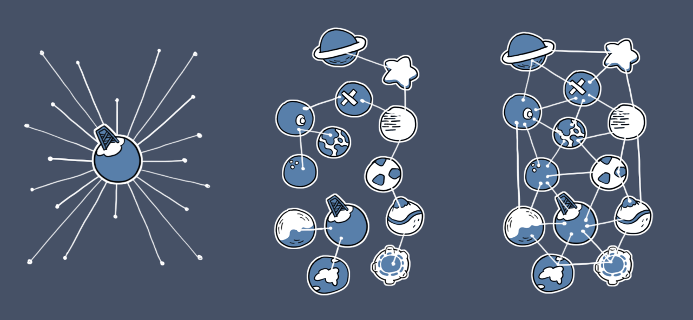

^ 特徴的なのは、サーバー間で投稿を交換し合うことで、他のサーバーの投稿もタイムラインに表示される点です。

^ つまり、ユーザーはどこか一つのサーバーでアカウントを作れば、そこから複数のサーバーの投稿を見ることができます。DAWNは、Mastodonサーバーに接続してiPhoneで快適に使えるUIを提供しています。

^ なお、現在は同様のプロトコルをInstagramのThreadsや、Misskeyなども採用しているため、これらの投稿もMastodonから見ることができます。

[.footer: https://en.wikipedia.org/wiki/Mastodon_%28social_network%29]

---

# Custom Emojis
User-uploaded animated emojis

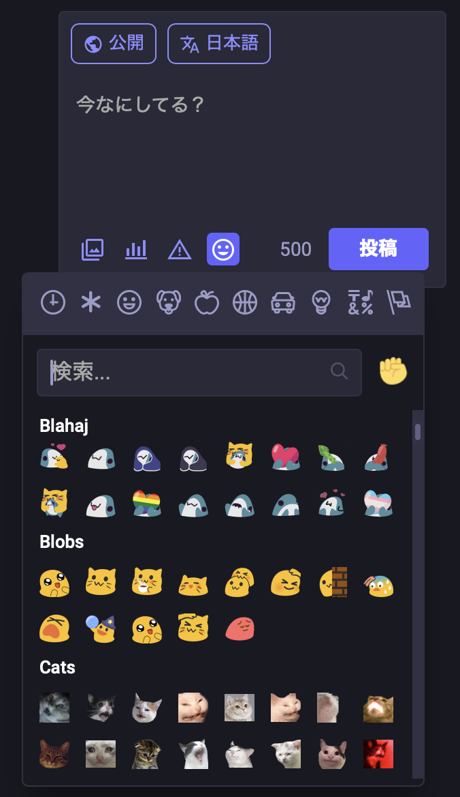

- Like Slack custom emojis
- Each server has unique collection
- GIF, APNG, WebP support
- Used in posts and reactions

^ そして、Mastodonの特徴的な機能の一つが、カスタム絵文字です。

^ これは、SlackやDiscordなどにもある、ユーザーが登録できる絵文字セットのことです。各サーバーが独自の絵文字コレクションを持つことができ、GIF、APNG、WebPなど様々なフォーマットに対応しています。

^ これらの絵文字は、タイムラインの投稿に使用できるほか、一部のサーバーではリアクションとしても利用できます。

---

# The Challenge
Timeline filled with animated emojis


- Dozens of GIFs simultaneously
- Mixed formats & frame rates
- **Performance nightmare** 😱

[.footer: Beware of flashing lights / 点滅にお気をつけください]

^ これはつまり、タイムラインに数十個の絵文字、しかもGIFアニメーションが溢れる可能性があるということです。

^ 実際に、同時に数十個のGIFアニメーションが再生される状況も珍しくありません。これが、私が直面した課題の本質です。

---


^ 実際に表示してみると、このようにスクロールが非常に重たくなってしまいます。

^ さらに問題なのは、メモリ使用量とCPU使用率が高くなることです。その結果、デバイスが熱くなり、バッテリーもすぐに減ってしまいます。これでは、快適な体験とは程遠い状態です。

---

# DAWN's Solution


## ✅ Smooth scrolling with dozens of animated emojis
## ✅ Memory efficient rendering
## ✅ Support for GIF, APNG, WebP
## ✅ Responsive UI under heavy load

^ しかし、DAWNではこの問題を解決することができました。

^ 現在は、カスタム絵文字が大量に表示されても、大きくパフォーマンスを損なうことなく動作しています。今日は、これらをどのように実現したか、その具体的な手法をご紹介します。

---

# Agenda

1. How to show GIF animation in UIKit.
2. How to improve performance.

^ 今日のお話は、大きく分けて２つのテーマに分かれます。

^ まず１つ目は、一般的な方法でどのようにしてGIFを再生するかについてです。そして２つ目は、そこで発生するパフォーマンス上の課題をどのように対処するかということです。

^ では、順番に見ていきましょう。

---

# How to show GIF animation in UIKit.

^ まず最初に、UIKitでGIFを再生する一般的な方法について振り返ってみます。

---

```swift
// try to show GIF image.

let image = UIImage(named: "sample.gif")
let imageView = UIImageView(image: image)
view.addSubview(imageView)
```

^ いつものように、ファイルからUIImageを作ってUIImageViewに入れてみましょう。ここでは、sample.gifというGIFファイルを読み込んでいます。

---

# Not Working!


UIKit doesn't support animated images

^ この実装では画像として表示することはできますが、アニメーションしません。

^ そこで、まずGIFファイルの構造について振り返ってみましょう。

---

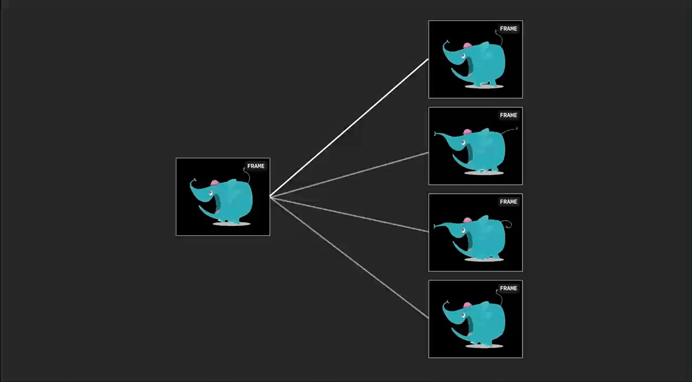

[.footer: https://www.nyan.cat]

^ GIFは、このスライドのように複数のフレーム画像を持ったファイルです。

^ つまり、GIFが持つ全てのフレーム画像を取り出して、順番に表示することでアニメーションを実現することができます。

---

```swift

// Extract Frame Images

// GIF, APNG, WEBP file
let fileURL = ...
let source = CGImageSourceCreateWithURL(
    fileURL as CFURL,
    nil
)
let count = CGImageSourceGetCount(gifSource)
var images: [UIImage] = []
for index in 0..<count {
    let cgImage = CGImageSourceCreateImageAtIndex(
        source,
        index,
        nil
    )
    images.append(UIImage(cgImage: cgImage))
}
```

^ この仕組みを実現するには、まずフレーム画像を取り出す必要があります。

^ CoreGraphicsフレームワークのCGImageSourceを使うことで、画像データのメタデータに簡単にアクセスできます。これによって、GIFが持っているフレーム画像の枚数や表示時間、各フレーム画像を取り出すことが可能になります。

^ なお、GIFと似たような構造を持つファイルに、APNGやWebPという形式があります。CGImageSourceはこれらの形式にも対応しているので、ファイルタイプを気にする必要がありません。

^ こうして、すべてのフレーム画像のUIImageを作ることができました。

---

```swift
// Playback animation images

let imageView = UIImageView()
imageView.animationImages = images
imageView.startAnimating()
```

^ 作成したUIImageの配列をUIImageViewにセットしてみましょう。

^ 実は、UIImageViewは古くからanimationImagesというプロパティを持っています。ここに取り出したUIImageの配列をセットします。アニメーションを開始するには、startAnimatingメソッドを呼びます。

---


^ はい、これでGIFアニメーションが再生されました。

^ ただし、今回のトークはパフォーマンスチューニングがテーマです。つまり、この方法には大きな問題があります。

---

# Memory Usage Problem
340KB GIF = 25MB RAM!

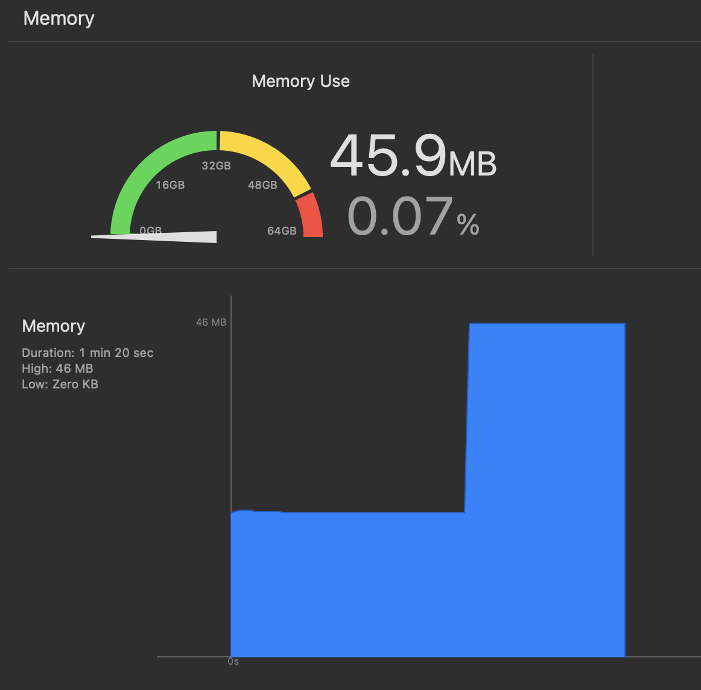

- Same as 8K JPEG memory usage
- Exponential memory growth
- App crashes with multiple GIFs

^ そうです、メモリ使用量が指数的に増加し、アプリがクラッシュしてしまうという問題があります。

^ 実際に測定してみると、たった340KB程度の1つのGIFを再生するのに25MB程度のメモリを使用していました。25MBといえば、8Kの高解像度JPEG画像と同じくらいの容量です。

^ では、この25MBという大きなメモリ使用量はどこから来るのでしょうか。

---

# Memory Calculation

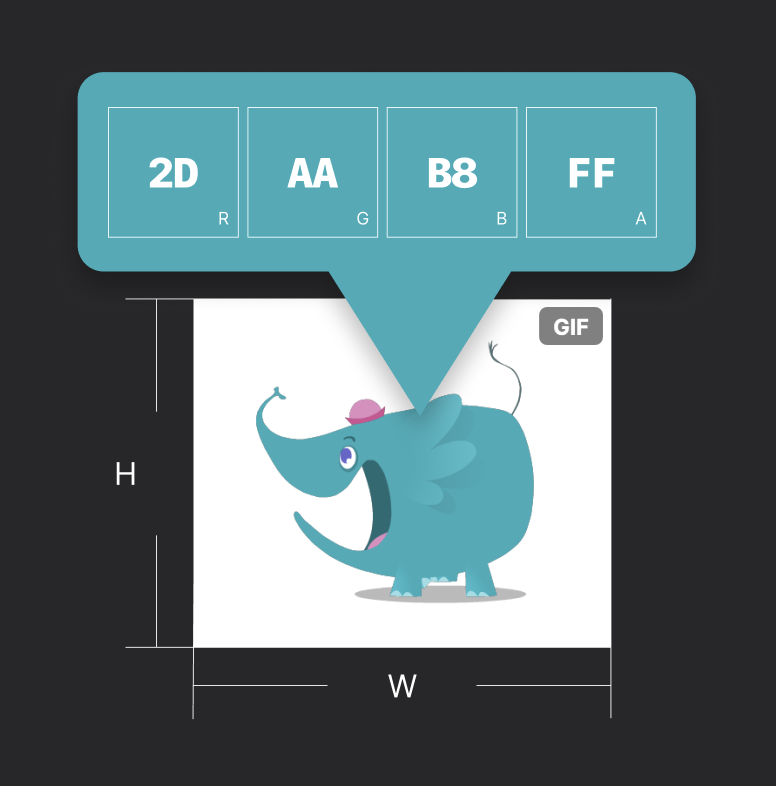

## Formula for memory usage:

$$M_{\text{bytes}} = W \times H \times C \times N$$

```
480×400×4×34 
= 25,958,400Byte ≈ 25MB
```

- **W**: Width in pixels (480)
- **H**: Height in pixels (400) 
- **C**: Color (4 for ARGB)
- **N**: Number of frames (34)

[.footer: 8bit, ARGB image case]

^ メモリ使用量は、一般的な画像の場合、M=W×H×C×Nという式で計算できます。

^ Wは横ピクセル数、Hは縦ピクセル数、Cは1ピクセルあたりの色成分数でARGBなら4、Nはフレーム数です。この例では34フレームのGIFだったため、約25MBになったということになります。

^ 先ほどの実装では、34フレームのGIFを表示するということは、34枚分の非圧縮画像をメモリ上に展開していることを意味します。つまり、フレーム数が多いほど、解像度が高いほど、メモリ使用量が増加します。

---

# Performance Tuning

^ このままでは、複数のGIFがあるとすぐにメモリ不足になってしまうことが予想できます。

^ ここで、パフォーマンスチューニングの必要性が明確になってきます。

---

# My Approach
Performance optimization methodology

^ ただし、一言にパフォーマンスチューニングと言っても、何をすれば良いのでしょうか。例えば、今回の場合、メモリ使用量を減らすことが本当の目的でしょうか。

^ 私は、パフォーマンスチューニングを行う際に、まず最初に「何が大事か」を考えることが重要だと考えています。

^ そこで、私が普段使っているパフォーマンスチューニングのアプローチをご紹介したいと思います。

---

# 1. Identify User Pain
Start with user experience


- What issues are users facing?
- Where do they struggle?
- What frustrates them?

^ 最も重要なのは、まずユーザーの体験から考えることです。

^ ユーザーが何を不都合に感じているのかを考えたり、実際にヒアリングしたりします。技術的な指標よりも、実際のユーザーが困っていることから始めることが重要です。

---

# 2. Define Core Value
What's your app's mission?


- What makes it irreplaceable?
- What would users miss most?

^ 次に重要なのは、アプリが提供するコアな価値を明確にすることです。

^ 例えば、天気アプリなら素早く天気予報を確認できることが重要ですし、ショッピングアプリなら欲しい商品を簡単に見つけられることが重要です。

^ このようにアプリのコアバリューを定義することで、パフォーマンスチューニングの優先順位をつけやすくなります。

---

# 3. Measure Everything
Quantify with profiling tools


- Use Instruments, Xcode
- Memory, CPU, frame rate
- Identify bottlenecks
- Evaluate improvements

^ そして３つ目は、可能な限り数値で測定することです。

^ 例えば、メモリ使用量やCPU使用率、フレームレートなど、アプリのパフォーマンスに関する指標を測定します。これにより、問題箇所の特定が容易になり、改善効果も定量的に評価できます。

---

# Tips: Instruments
Profile specific tests

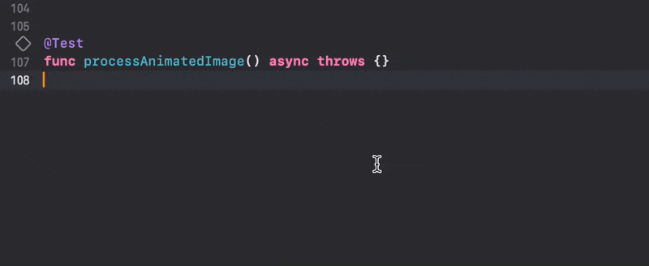

Right-click test → "Profile"

^ ここで、Instrumentsの便利な使い方を一つご紹介します。

^ パフォーマンスチューニングでは、アプリ全体を実行してプロファイルすると他の処理も入ってきてしまい、問題を特定するのが難しくなることがあります。しかし、特定のテストだけをプロファイルする方法があります。

^ このスライドのようにテストを右クリックして「Profile」を選択するだけで、Instrumentsが起動します。これにより、特定機能のパフォーマンスを簡単に測定できます。

---

# 4. Smart Trade-offs
A puzzle of priorities

- Lower quality of unimportant things
- Raise quality of what matters

^ 最後に重要なのは、パフォーマンスチューニングは「トレードオフのパズル」であるということです。

^ 当然、処理が軽くなるのが理想ですが、突き詰めると重要でないものの品質を落とし、重要なものの品質を上げるという話になります。このとき、「ユーザー体験」と「アプリのコアバリュー」を軸に取捨選択を行います。

^ つまり、いくらメモリやCPUが使われても、ユーザーが快適と感じるなら問題ありません。エンジニアは見えているパフォーマンス問題を解決したくなりますが、それを直す意味があるのかを考えると、優先度をつけやすくなります。

---

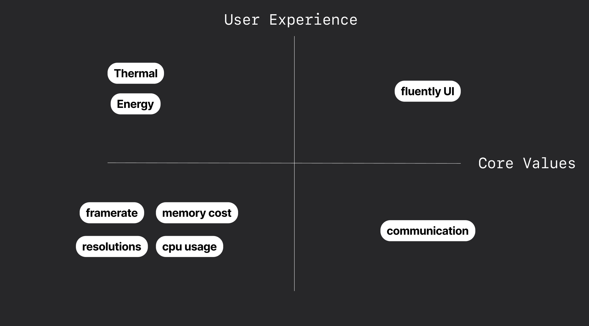

^ では、DAWNでは何が重要なのでしょうか。

^ DAWNはSNSアプリです。絵文字リアクションを介したコミュニケーションが重要なバリューになります。またユーザーは、ほとんどの時間をスクロールに費やしています。そのときにタイムラインのスクロールが引っかかると、質の悪い体験になってしまいます。

^ そのため、大量の絵文字が表示されていても、スクロールに影響を与えないことを最重要としました。一方で、絵文字のフレームごとの画質やフレームレートは、ユーザーが絵文字の意味を理解できる程度であれば、多少犠牲にしても良いと考えました。

^ 幸いなことに、これらを犠牲にすることで、メモリ使用量とCPU使用率を大幅に削減でき、アプリの安定性や発熱、バッテリー持ちの改善につながります。

---

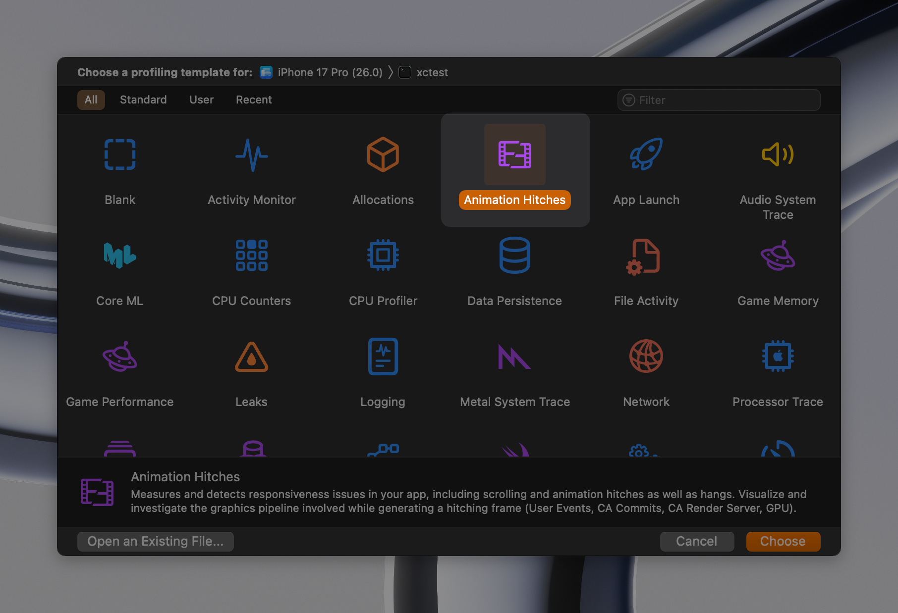

^ なお、スクロールの引っ掛かりは、InstrumentsのAnimation Hitchesで確認するとわかりやすいです。

^ アニメーションヒッチが発生した箇所のメインスレッドの処理から、何が原因で引っ掛かっているのかを特定できます。WWDCでも多くのセッションで紹介されているので、ぜひ活用してみてください。

---

# AnimatedImage

github.com/noppefoxwolf/AnimatedImage

- Specialized UIKit component for high-performance GIF playback
- Supports GIF, APNG, WebP formats
- Memory-efficient frame caching
- Background processing pipeline

^ さて、今日ご紹介する最適化手法は、AnimatedImageというOSSライブラリとして公開しています。

^ これは、高パフォーマンスなGIF再生に特化したUIKitコンポーネントです。複数のアニメーション形式に対応し、メモリ効率的なフレームキャッシュとバックグラウンド処理パイプラインを提供しています。

^ では、この実装の詳細を見ていきましょう。

---

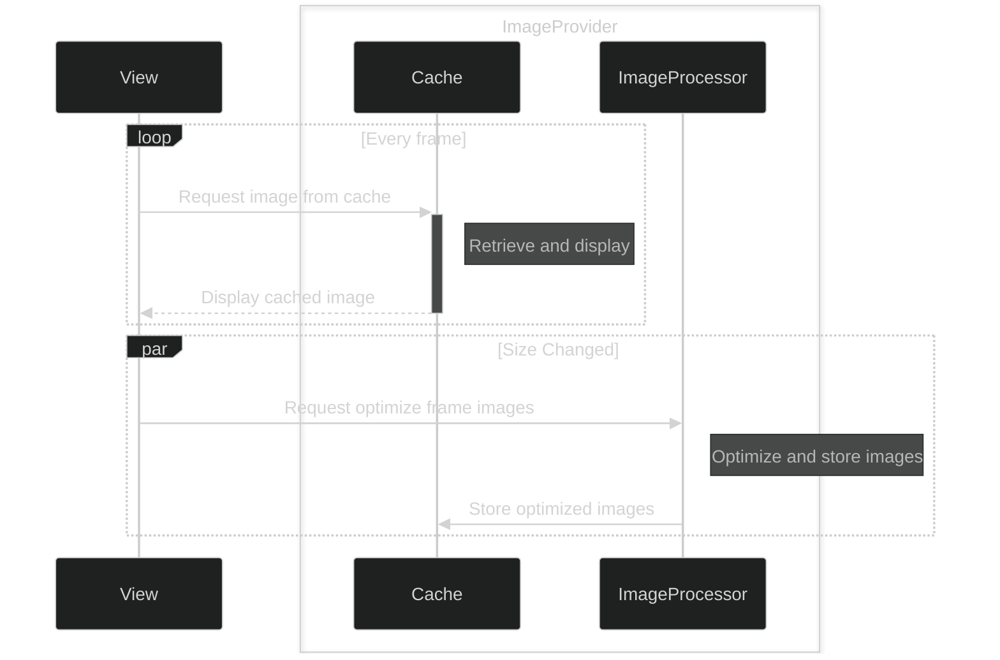

^ まず、最初に全体の流れを見てみましょう。
^ 大きく分けて、ViewとImageProviderがあります。
^ ImageProviderは、画像最適化のためのImageProcessorと、最適化された画像を保存するCacheを持っています。
^ ViewとImageProviderは、大きく分けて２つのタスクを行います。
^ 1つ目は、現在表示するべき画像がキャッシュに存在するかを確認し、存在すればそれを表示することです。
^ 2つ目は、ビューのサイズが変わったときに、ImageProviderに最適化された画像を生成することをリクエストすることです。
^ こうすることで、Viewは常に最適化された画像を表示できるようになります。
^ Cacheを介しているのは、GIFがループ再生をすることが多いと言う特性に合わせて、同じフレーム画像を何度も短期間に表示することを想定したためです。
^ では、細かい実装について見ていきましょう。

---

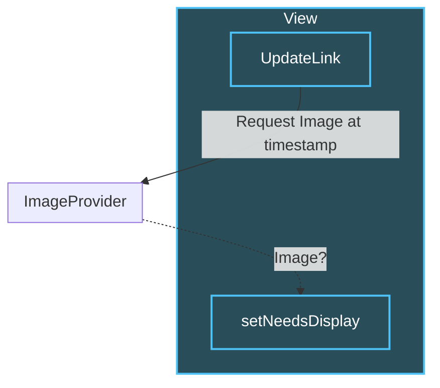

^ まずは、現在表示するべき画像がキャッシュに存在するかを確認し、存在すればそれを表示する部分を見てみましょう。
^ ビューはUpdateLinkというタイマーを使って、60fpsで画面の更新タイミングに合わせてキャッシュの確認を行います。
^ キャッシュにフレーム画像があればViewに画像を返却し、ビューに描画をします。
^ この仕組みの良いところは、ImageProviderが画像を返すか否かによってビューの描画をコントロールできる点です。これにより、重複したフレーム画像をスキップしたり、フレームレートを落としたりすることができます。

---

# Synchronization

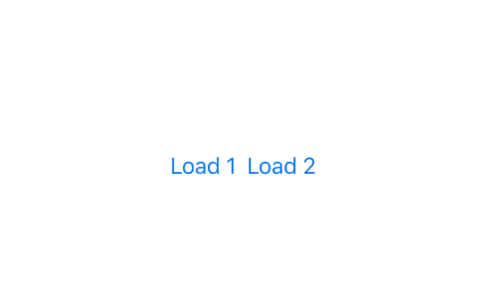

^ また、副次的なメリットとしてUpdateLinkのタイムスタンプを元にフレーム画像を取得するので、同じGIF画像を複数表示した場合に、それぞれのアニメーションが同期して動作します。
^ これにより、スライドのように複数のアニメーション絵文字が同じタイミングで動作するようになります。
^ ミーム系のGIF画像など、複数の同じ画像が表示される場合や、並べることで意味がある画像の場合に効果的な効果を得ることができました。

---

# UIUpdateLink 🆕

- iOS17+
- An object you use to observe, participate in, and affect the UI update process.

```swift
// Update y every frame.

let updateLink = UIUpdateLink(view: view)
updateLink.addAction { link, info in 
    // Code that runs each UI update, after processing input events, 
    // but before `CADisplayLink` callbacks.
    self.view.center.y = sin(info.modelTime) * 100 + self.view.bounds.midY
}
```

^ 先ほど紹介したUpdateLinkですが、内部的にはUIUpdateLinkを利用しています。
^ UIUpdateLinkは画面の更新タイミングに合わせてコードを実行できるiOS17の新機能です。
^ 時間の経過をベースにしているタイマーと違って、画面描画と同期するため、よりスムーズなアニメーションが実現するのに向いています。
^ AnimatedImageではiOS16以前も対応しており、そちらではCADisplayLinkを利用しています。

---

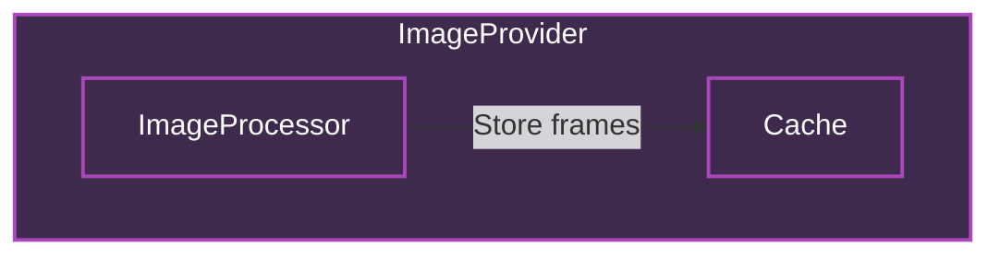

^ 次にImageProviderの内部構造を見ていきましょう。
^ 先ほど紹介した通り、ImageProviderはImageProcessorとCacheを持っており、ImageProcessorが最適化したフレーム画像をCacheに保存します。
^ CacheはNSCacheで実装しており、スレッドセーフなことを活かしてビューからの呼び出しと、ImageProcessorからのスレッドからの保存に対応しています。
^ では、この実装の中核であるImageProcessorの実装を見ていきましょう。

[.footer: https://developer.apple.com/documentation/Foundation/NSCache]

---

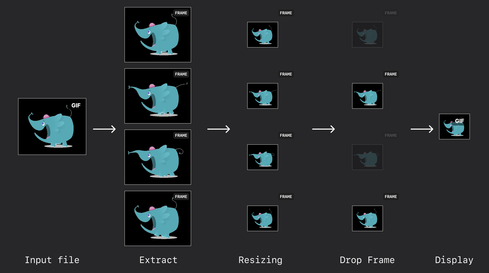

^ ImageProcessorでは、４つの事をしています。
^ 画像からフレーム画像を取り出すこと・フレーム画像のリサイズ・フレームの間引き・そしてレンダリングです。
^ 画像からフレーム画像を取り出す部分は、先ほど紹介したCGImageSourceを使った実装と同じです。
^ では、順番に見ていきましょう。

---

# Resizing

^ まずはリサイズです。

---

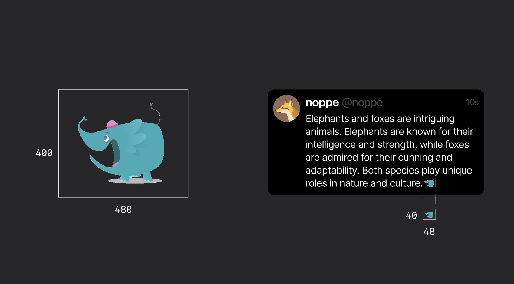

^ 最初に解説した通り、フレーム画像のサイズが大きいとメモリ使用量が増えます。
^ そこで、ビューのサイズに合わせてフレーム画像をリサイズします。
^ 画面に表示する以上のサイズをメモリに保持するのは無駄なので、実際に画面にレンダリングするサイズまで小さくします。
^ これによって、メモリ使用量を大幅に削減できます。特に絵文字リアクションでは、表示サイズが小さいので効果が大きいです。
^ リサイズの処理コストが高いため、実際にはこの工程ではサイズだけを決めて、実際のリサイズは行わずに次の工程に進みます。

---

# Drop Frames

^ 次は、描画フレームを間引く工程です。

---

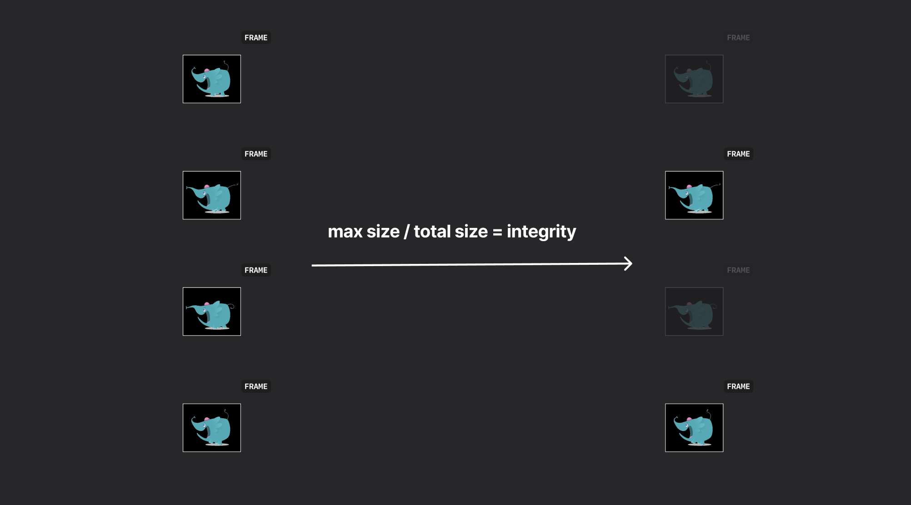

^ この時点で、全てのフレームをデコードすると使われるメモリの量が判明しているので、それが大きすぎる場合はフレームを間引いて調整します。
^ 例えば、毎秒10フレームのgifをキャッシュするのに必要なメモリが10MBで、5MBに抑えたい時は、フレーム数を半分にするという感じですね。

---


^ ただ、同じフレーム数を半分にする場合でも、どのフレームを残すかによってアニメーションの滑らかさが変わります。
^ この２つの動画は、どちらもフレーム数を半分にしたものですが、間引き方が違います。
^ 単純にフレームを間引くと、左のようにアニメーションの滑らかさが損なわれます。
^ そこで、AnimatedImageでは均一にフレームを間引けるように工夫しています。
^ こうすることで、アニメーションのカクつきを抑えることができます。
^ 計測上のパフォーマンスは変化しませんが、このような体感のパフォーマンスを改善する工夫も重要です。

---


^ 実際に調整している様子がこちらです。
^ integrityを調整することで、フレームレートが変化していますが、アニメーションの連続性は保たれています。

---

# Rendering

^ そして、最後にレンダリングです。
^ これまでの工程で、フレーム画像のサイズとフレーム数が決まっているので、実際にフレーム画像をレンダリングします。

---

# Is Rendering Necessary?

^ ところで、ここで一つ問題があります。
^ CGImageSourceからはオリジナルのフレーム画像が取り出せます。
^ リサイズの必要が無いフレームでも、必ず各フレームをレンダリングする必要はあるのでしょうか？
^ 答えは、YESです。
^ 実は次のような理由があります。

---

# Lazy Decompression Issue
DGifDecompress runs on main thread

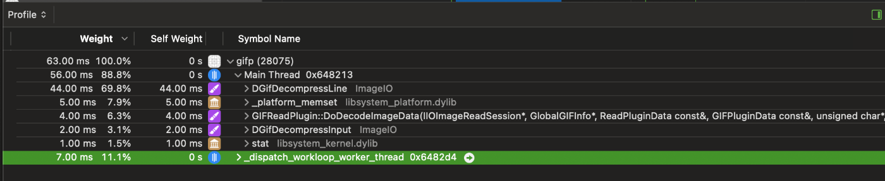

Blocks smooth scrolling!

^ CGImageSourceから取り出したGIFのCGImageは圧縮されており、そのままでは描画に使用できません。
^ しかし、デフォルトの挙動では、UIImageは描画の直前までフレームを復元しません。
^ 描画の直前ということは、メインスレッドで行われるということです。
^ これはInstrumentsで確認することができます。
^ これではメインスレッドが影響を受け、スムーズなスクロールに影響を与える可能性があります。

---

# Solution: Pre-decompress
Decompress on background thread

```swift
// UIKit
let decompressedImage = await uiImage.byPreparingForDisplay()

// CoreGraphics
let context = CGContext(...)!
context.draw(image, in: rect)
let decodedImage = context.makeImage()
```

^ この問題を解決するには、事前にバックグラウンドスレッドでフレームを復元しておく必要があります。
^ UIImageの場合は、byPreparingForDisplayメソッドを使うことで任意のタイミングでフレームを復元することができます。
^ このメソッドは非同期なので、メインスレッドに影響を与えないところもポイントです。
^ また、CGImageの場合は、CGContextにdrawすることで復元されたフレームでCGImageを得ることができます。
^ どちらもバックグラウンドスレッドで実行できるため、画面に表示される瞬間に重い処理が走ってスクロールがカクつくのを防げます。

---


^ これらの最適化を実施した結果、１画面に50を超えるアニメーション画像を表示しても、クラッシュすることなく100MB以下のメモリ使用に抑えることができました。

^ そして最も重要なスクロールの滑らかさも維持できています。一方で、ビューの表示とアニメーションの表示の間に若干の遅延が発生したり、フレームレートや解像度が低下しています。この辺りは、トレードオフの結果です。

^ AnimatedImageでは、これらのトレードオフをパラメータで調整できるようにしています。

---

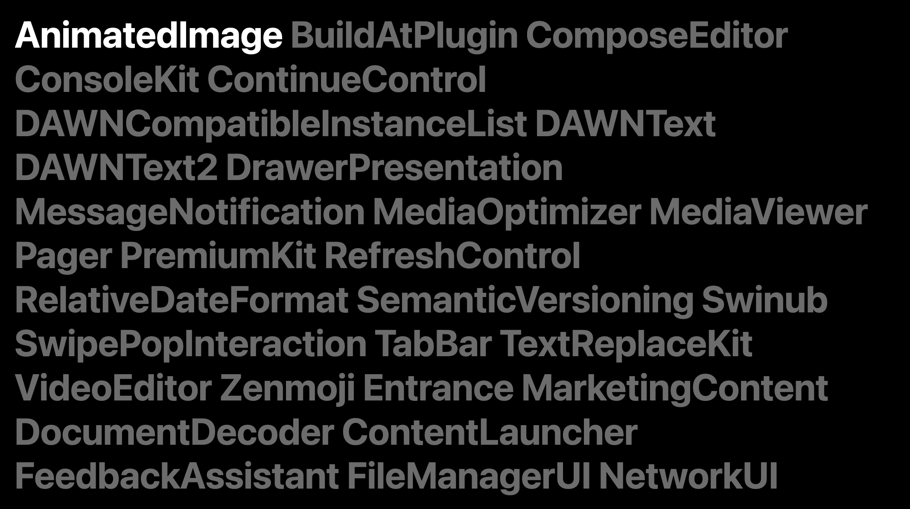

^ 本日ご紹介したAnimatedImageをはじめ、DAWN for Mastodonは主要な機能を30を超えるOSSとして公開しています。

^ もしよろしければ、ぜひ他のOSSもご覧いただければと思います。

---

# Next steps

- Explore AnimatedImage features
- Try AnimatedImage in your projects
- Deep dive into WebP

|||
|---|--:|
|作って学ぶWebP入門|day1 13:00 Track A|

^ また、今回登場したWebP自体の細かい仕様については、午後の「作って学ぶWebP入門」をご覧いただくと、より理解が深まるのではないでしょうか。

^ 以上が、本日のお話でした。ご清聴ありがとうございました。
