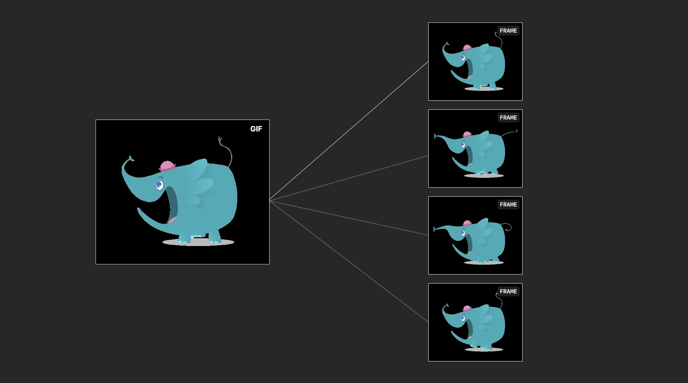
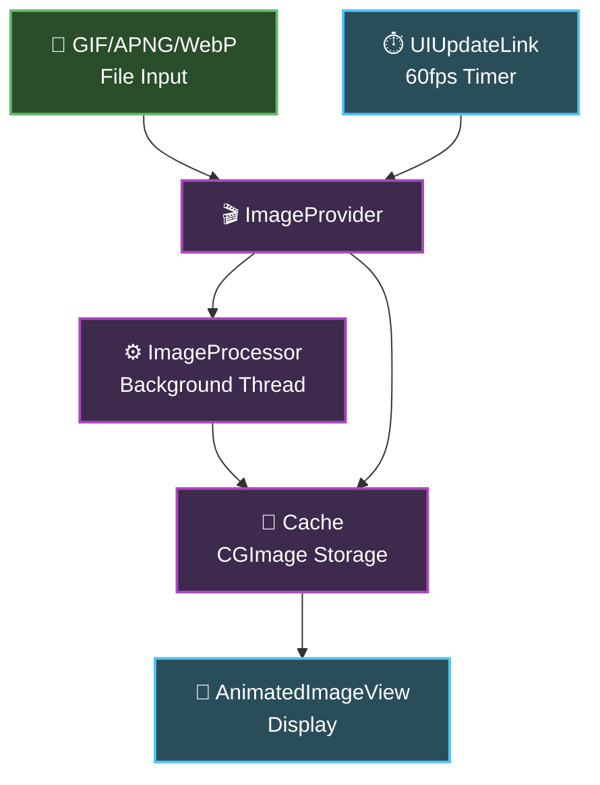
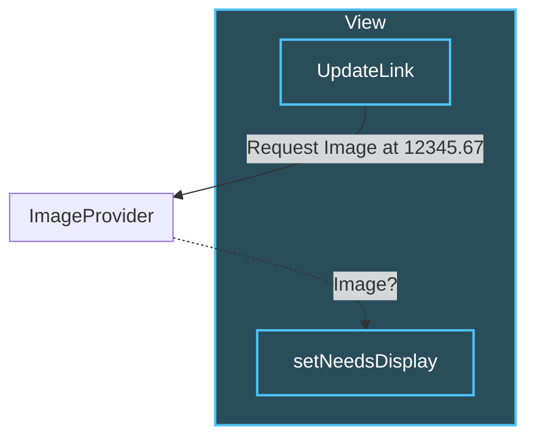
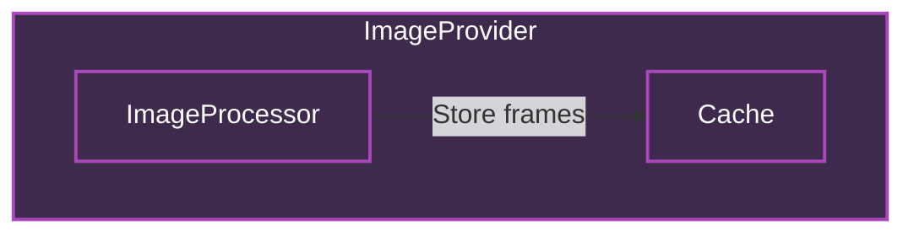

slidenumbers: true
background-color: #272729
theme: Fraunces, 4
text: #FFF, SF Pro
text-emphasis: SF Pro
text-strong: SF Pro
autoscale: true
header: #FFF, alignment(left), text-scale(0.5), SF Pro Text
header-emphasis: SF Pro Text
header-strong: SF Pro Text
slidenumber-style: SF Pro Text
footer-style: SF Pro Text
code: SF Mono

# High-performance GIF playback
## iOSDC25 day1 Track D noppe

^ はい、では本日はよろしくお願いします。
^ 「ハイパフォーマンスなGIFアニメ再生を実現する工夫」というタイトルで20分ほど話させていただければと思います。
^ スライドは広く見てもらうために英語になりますが、トークは日本語で行います。

---

# Who am I

- **noppe** 🦊
- iOSDC 18~25 Speaker
- Senior iOS App Developer at DeNA
- Indie App Developer


^ まず、自己紹介です。noppeと言います。狐のアイコンで活動しています。
^ iOSDCには2018年から毎年登壇させていただいており、今年で8年連続となります。
^ 普段はDeNAでiOSアプリの開発をしており、個人でも趣味でアプリを作っています。
^ 今日お話しするDAWN for Mastodonも、そんな個人開発アプリの一つです。

---

# DAWN for Mastodon

## Features
- Beautiful, familiar iOS design
- Animation image support (GIF, APNG, WebP)
- High-performance timeline scrolling
- Multi-instance support


^ 2023年、私は個人開発でアプリを開発していました。それが、DAWN for Mastodonです。
^ DAWN for Mastodonは、名前の通りMastodonというSNSのためのアプリです。
^ Mastodonはまだ一般に普及しているとは言えませんが、このアプリはMastodonを誰もが快適に使えるように、「ふつうのアプリ」を目指して開発されています。
^ Mastodonの特殊性を、UIデザインとエンジニアリングで一般化しようというのが、このアプリの目指すところです。
^ 特に、リアクションなどのコミュニケーションの基点になる部分と、滑らかなタイムラインのスクロールに力を入れています。

---

# What is Mastodon?


- Decentralized social networking platform
- First released in 2016 by Eugen Rochko
- Open-source software built with Ruby on Rails
- Anyone can deploy their own server
- Servers connect to form a federated network

^ Mastodonをご存知ない方のために、少しMastodonについても説明します。
^ Mastodonは2016年にドイツのオイゲン氏によって開発されたオープンソースソフトウェアです。Ruby on Railsで書かれています。
^ Mastodon自体は特定のサービスを指しているわけではなく、企業や個人は、Mastodonを自分のサーバーにデプロイしてTwitterのようなSNSを運用することができます。
^ つまり、分散型のソーシャルネットワークプラットフォームということですね。

[.footer: https://en.wikipedia.org/wiki/Mastodon_%28social_network%29]

---

# Decentralization


## Key Benefits
- No single point of failure
- User choice of servers/policies
- Cross-server communication
- Compatible with Threads, Misskey, etc.

[.footer: https://blog.joinmastodon.org/2018/12/why-does-decentralization-matter/]

^ 特徴的なのは、そのサーバー間で投稿を交換し合うことで他のサーバーの投稿もタイムラインに表示されることです。
^ つまり、ユーザーはどこかで一つのアカウントを作れば、そこから複数のサーバーの投稿を見ることができます。
^ DAWNは、このネットワークに接続してMastodonをiPhoneで快適に使うUIを提供しています。
^ 現在、同様のプロトコルをInstagramのThreadsや、Misskeyなどが採用しているため、これらの投稿もMastodonから見ることができます。

---

# Custom Emojis


## What are Custom Emojis?
- User-uploaded emoji sets (like Slack!)
- Each server has its own emoji collection
- Support for GIF, APNG, WebP formats

^ そして、Mastodonの特徴の一つにカスタム絵文字という機能があります。
^ Slackなどにもある、ユーザーが登録できる絵文字セットのことですね
^ 各サーバーが独自の絵文字コレクションを持つことができ、GIF、APNG、WebPなど様々なフォーマットに対応しています。
^ そして、これらをタイムラインの投稿や一部のサーバーでは、リアクションとして使うことができます。

---


# The Challenge


## Timeline can be filled with animated emojis!
- Dozens of GIFs playing simultaneously
- Different formats (GIF, APNG, WebP)
- Various sizes and frame rates
- **Performance nightmare** 😱

[.footer: Beware of flashing lights / 点滅にお気をつけください]

^ これはつまり、タイムラインに数十個の絵文字、しかもGIFが溢れる可能性があるということです。
^ 同時に数十個のGIFアニメーションが再生される状況も珍しくありません。
^ これは明らかにパフォーマンス上の大きな課題となります。

---

# DAWN's Solution

## ✅ Smooth scrolling with dozens of animated emojis
## ✅ Memory efficient rendering
## ✅ Support for GIF, APNG, WebP
## ✅ Responsive UI under heavy load

^ DAWNでは、これをやってのけました
^ GIFの絵文字が大量に表示されても、大きくパフォーマンスを損なうことなく動作します。
^ 今日は、これらをどうやって実現しているか紹介します。
^ 具体的には、滑らかなスクロール、メモリ効率、複数フォーマット対応、そして高負荷時でもレスポンシブなUIを実現する方法についてです。

---

# Agenda

1. How to show GIF animation in UIKit.
2. How to improve performance.

^ 今日は大きく分けて２つになります。
^ まずは、一般的な方法でどのようにしてGIFを再生するか。
^ そして、そこで発生するパフォーマンス上の課題をどのように対処するか。です。
^ では、早速見ていきましょう。

---

# How to show GIF animation in UIKit.

^ まずは、UIKitでGIFを再生する方法について振り返ります。

---

```swift
// try to show GIF image.

let image = UIImage(named: "sample.gif")
let imageView = UIImageView(image: image)
view.addSubview(imageView)
```

^ いつものように、gifファイルからUIImageを作ってUIImageViewに入れてみましょう。

---


UIKit not supported any animation image.

^ これは、表示することはできますが、残念ながらこれではアニメーションしません。
^ ここで、一度GIFファイルの構造を振り返りましょう。

---



[.footer: https://www.nyan.cat]

^ GIFはパラパラ漫画のように複数の画像を持ったファイルであると考えることができます。
^ 実際にmacのプレビューで開くと、各フレームの画像を確認することができます。
^ つまり、これらのすべてのフレームを取り出して、一定時間ごとに表示をすればいいわけですね。

---

```swift

// Extract Frame Images

// GIF, APNG, WEBP file
let fileURL = ...
let source = CGImageSourceCreateWithURL(
    fileURL as CFURL,
    nil
)
let count = CGImageSourceGetCount(gifSource)
var images: [UIImage] = []
for index in 0..<count {
    let cgImage = CGImageSourceCreateImageAtIndex(
        source,
        index,
        nil
    )
    images.append(UIImage(cgImage: cgImage))
}
```

^ CoreGraphicsのCGImageSourceを使うと、画像データのメタデータに簡単にアクセスすることができます。
^ これによって、GIFが持っている画像の枚数や表示時間、各画像を取り出すことができます。
^ なお、このCGImageSourceはAPNGやWEBPにも対応しているので、ファイルタイプを気にする必要がありません。便利ですね。
^ こうして、すべてのフレームのUIImageを作ることができました。

---

```swift
// Playback animation images

let gifImageData = ...
let imageView = UIImageView()
imageView.animationImages = images
imageView.startAnimating()
```

^ 実はUIImageViewはanimationImagesというプロパティを持っているので、ここに取り出したUIImageの配列をセットしてみましょう。
^ アニメーションを始めるにはstartAnimatingメソッドを呼びます。

---


^ やった、動きました。なので、今回のトークは以上になります。ありがとうございました。

---

# Memory Usage Problem


## 😱 25MB for a single GIF!
- Same as an 8K JPEG image
- Memory usage grows exponentially
- App crashes with multiple GIFs

^ しかし、この方法。数が増えていくとアプリがどんどん重くなります。
^ たった１枚のGIFを再生するのに25MBほど使っていました。
^ 25MBといえば、8Kのjpegと同じくらいです。
^ この25MBはどこから来たのでしょうか
^ 複数のGIFを表示すると、メモリ使用量が指数的に増加し、アプリがクラッシュしかねません。

---

# Memory Calculation


## Formula for memory usage:

$$M_{\text{bytes}} = W \times H \times C \times N$$

```
480×400×4×34 
= 25,958,400Byte ≈ 25MB
```

- **W**: Width in pixels (480)
- **H**: Height in pixels (400) 
- **C**: Channels (4 for ARGB)
- **N**: Number of frames (34)


^ メモリがどれくらい使われるかは、次の計算式で予想することができます。
^ Wは横ピクセル数、Hは縦のピクセル数、Cはチャンネル数でARGBなら4が入ります。
^ これが34枚分のGIFだったということで、25MB程度になります。
^ 34フレームのGIFを表示するというのは34枚分の画像をメモリ上に展開しているということになります。
^ 当然メモリも食い潰します。どうしたものか
^ こういうときにやることは一つ。

---

# Performance tuning

^ そう、パフォーマンスチューニングです。

---

# Performance Tuning Framework

## My approach to performance optimization

^ ですが、一言にパフォーマンスチューニングと言ってもどう進めたら良いのか分かりませんよね。
^ ここで、私のパフォーマンスチューニングの勘所、効率的に問題に取り組むための体系的なアプローチをご紹介します。

---

# 1. Identify User Pain

## 🎯 Start with user experience
- What specific issues are users facing?
- Where do they struggle the most?
- What makes them frustrated?

^ まずは、何よりユーザーの体験から考えること。
^ 最初は、ユーザーが何を不都合に感じるのかを考えたり、ヒアリングをしたりします。
^ 技術的な指標よりも、実際のユーザーが困っていることから始めることが重要です。

---

# 2. Define Core Value

## 🎯 What is your app's primary mission?
- What makes your app irreplaceable?
- What would users miss most if removed?

^ 次に、アプリの提供するコアな価値は何か。
^ 天気のアプリなら、いち早く天気予報が見れることが大事です。

---

# 3. Measure Everything

- How does it *feel* to users?
- Are metrics matching user perception?

^ そして、計測すること。
^ ここでの計測は、定量的なものも、定性的なものもです。
^ 先ほども言いましたが、大事なのはユーザーの体験です。
^ 定量的な数値が悪くても、体験はそこまで悪くないこともあります。
^ 一方で、変更の影響の判断材料に定性的な数字はとても効果的です。
^ パフォーマンスが改善したのか、リファクタリングでパフォーマンスが悪化していないのかが分かれば、効率的にチューニングを行うことができます。

---

# 4. Smart Trade-offs

## ⚖️ Performance tuning is about choices
- You can't optimize everything
- Focus resources on what matters most
- Sacrifice less important aspects for core value

^ 最後に、忘れてはいけないのがパフォーマンスチューニングとは「トレードオフのパズルである」ということです。
^ 当然、処理が軽くなるのが理想ですが、突き詰めるところ大事でないものの品質を落とし、大事なものの品質を上げるという話になりがちです。
^ このときに、「ユーザー体験」「アプリの提供価値」を軸に取捨選択を行います。
^ なので、いくらメモリやCPUが使われても、ユーザーが快適と感じるならヨシ。
^ それくらい割り切ってしまっていいでしょう。
^ エンジニアは、ついつい見えているパフォーマンスの問題を解決したくなってしまいますが、それを直して意味があるのか。考えると優先度がつけやすいかと思います。

---

# DAWN's Requirements

## 🎯 Primary goal: Smooth scrolling
- Users spend most time browsing timeline
- Jerky scrolling kills user experience
- Must maintain 60fps even with many animated emojis

^ では、DAWNでは何が大事なのでしょうか。
^ DAWNはSNSのアプリです。ユーザーはほとんどの時間をスクロールしています。そのときにタイムラインのスクロールが引っかかると嫌になりますよね。
^ なので、大量に絵文字が表示されていても、スクロールに影響を与えないことを重要としました。
^ そして、Mastodonならではの要件としてGIF以外にもAPNGやWEBPもサポートすることにしました。
^ これはMastodonが分散型であるが故、必ず絵文字がGIFであるという保証がないからですね。

---

# AnimatedImage Library

github.com/noppefoxwolf/AnimatedImage

- Specialized UIKit component for high-performance GIF playback
- Supports GIF, APNG, WebP formats
- Memory-efficient frame caching
- Background processing pipeline

^ 今日紹介する最適化手法は、AnimatedImageというOSSライブラリとして実装しています。
^ これは高パフォーマンスなGIF再生に特化したUIKitコンポーネントです。
^ 複数のアニメーション形式に対応し、メモリ効率的なフレームキャッシュとバックグラウンド処理パイプラインを提供しています。
^ github.com/noppefoxwolf/AnimatedImageで公開しており、誰でも利用できます。
^ では、この実装の詳細を見ていきましょう。

---

# DAWN's Trade-offs

## ⚠️ What we can sacrifice:
- **Image quality** (slightly compressed)
- **Frame rate** (30fps → 15fps for heavy GIFs)
- **Perfect color accuracy**

^ では、逆にトレードオフはなんでしょうか
^ ユーザーは絵文字のコンテキストさえ分かれば良いので、気にならない程度でフレームごとの画質を劣化させたり、フレームレートを落としてもそんなに問題にはならないはずです。
^ では、今のポイントを抑えてアーキテクチャを考えてみましょう

---



^ どん
^ こんな感じです。簡単ですね
^ ImageProviderとViewがあります。
^ Viewは60fpsでImageProviderに現在表示するべき画像があるかを問い合わせます。もし画像が返ってくればレンダリングします。
^ 一方で、ImageProviderはバックグラウンドスレッドで、全てのフレームをキャッシュします。
^ こうすることで、ImageProviderで最適化した画像を作りつつ、Viewは最小限のレンダリングだけに専念することができます。
^ では、細かい実装について見ていきましょう。

---



^ ビューはUpdateLinkを持っています。
^ UpdateLinkは画面が更新されるたびにImageProviderに表示するべきフレーム画像のキャッシュがあるかを問い合わせます。
^ 画像があればViewに画像を返却し、ビューに描画をします。
^ この仕組みの良いところは、ImageProviderが画像を返すか否かによってビューの描画をコントロールできる点です。これにより、ImageProviderの設計によってパフォーマンスのチューニングがやりやすくなります。

---

# UIUpdateLink 🆕

- iOS17+
- An object you use to observe, participate in, and affect the UI update process.

```swift
// Update y every frame.

let updateLink = UIUpdateLink(view: view)
updateLink.addAction { link, info in 
    // Code that runs each UI update, after processing input events, 
    // but before `CADisplayLink` callbacks.
    self.view.center.y = sin(info.modelTime) * 100 + self.view.bounds.midY
}
```

^ UIUpdateLinkは画面の更新タイミングに合わせてコードを実行できるiOS17の新機能です。
^ 従来のタイマーと違って、画面描画と同期するため、よりスムーズなアニメーションが実現できます。
^ 60fpsでImageProviderに画像がキャッシュされているかを確認します。
^ AnimatedImageではiOS16以前も対応しており、そちらではCADisplayLinkを利用しています。

---



^ ImageProviderはImageProcessorとCacheを持っています。
^ ImageProcessorはこの後解説しますが、画像の最適化をします。
^ CacheはNSCacheで実装しており、スレッドセーフなことを活かしてビューからの呼び出しと、ImageProcessorからのスレッドからの保存に対応しています。

[.footer: https://developer.apple.com/documentation/Foundation/NSCache]

---


^ これまでのアーキテクチャをまとめると、このような構造になります。
^ お気づきの通り、ImageProcessorがこの最適化の要です。
^ では、続いてImageProcessorを見ていきます。

---


^ ImageProcessorでは、３つの事をしています。
^ フレーム画像のリサイズ・フレームの間引き・レンダリングです。

---

# Resizing

- Resize frame images to minimize memory usage

---


^ 画面に表示する以上のサイズをメモリに保持するのは無駄なので、実際に画面にレンダリングするサイズまで小さくします。
^ つまり、ビューのサイズが変更されるたびにキャッシュを捨てて作り直します。
^ 実際には、リサイズ結果のサイズだけを決めて、次の工程に進みます。

---

# Drop Frames

- adjust integrity by max memory limit.

^ 次は、描画フレームを間引く工程です。
^ この時点で、全てのフレームをデコードすると使われるメモリの量が判明しているので、それが大きすぎる場合はフレームを間引いて調整します。
^ 例えば、毎秒10フレームのgifをキャッシュするのに必要なメモリが10MBで、5MBに抑えたい時は、フレーム数を半分にするという感じですね。

---


^ 実際に調整している様子がこちらです。integrityを調整することで、フレームレートが変化しています。

---

# Rendering

## Avoid main thread blocking
- **Problem**: UIImage uses lazy decompression
- **Solution**: Force decompression on background thread
- **Result**: Smooth rendering without frame drops

^ そして、最後にレンダリングです。
^ リサイズの必要が無いフレームでも、必ず各フレームをレンダリングします。
^ その理由として、特にGIF画像などの場合、UIImageが描画のギリギリまで最終的に描画する画像データを保持しないという挙動があります。
^ アニメーションのフレームデータは圧縮されており、前のフレームとの差分などを使って完全なフレームを復元します。

---

- DGifDecompressLine run on Main Thread.


^ この処理が、標準の挙動だとメインスレッドで行われてしまいます。
^ これではメインスレッドが影響を受け、スムーズなスクロールに影響を与える可能性があります。

---

# Decompress

```swift
// UIKit decompress

let decompressedImage = await uiImage.byPreparingForDisplay()
```

```swift
// CoreGraphics decompress

let context = CGContext(...)!
context.draw(image, in: rect)
let decodedImage = context.makeImage()
```

^ この問題を解決するには、事前にバックグラウンドスレッドでフレームを復元しておく必要があります。
^ UIImageの場合は、byPreparingForDisplayメソッドを使うことで任意のタイミングでフレームを復元することができます。
^ このメソッドは非同期なので、メインスレッドに影響を与えないところもポイントです。
^ また、CGImageの場合は、CGContextにdrawすることで復元されたフレームでCGImageを得ることができます。
^ つまり、画面に表示される瞬間に重い処理が走ってスクロールがカクつくのを防げるということです。

---


^ これらの最適化をした結果、１画面に50を超えるアニメーション画像を表示しても、クラッシュすることなく100MB以下のメモリ使用に抑えることができました。
^ そして最も重要なスクロールの滑らかさも維持できています。

---

# Recap

1. Performance tuning is trade-off. 
2. メインスレッドとメモリの依存を減らす

^ 今日の要点をまとめます。
^ 1つ目、パフォーマンスチューニングはトレードオフです。ユーザー体験を最優先に、何を犠牲にするかを明確に決めることが重要です。
^ 2つ目、メインスレッドへの負荷とメモリ使用量、この2つの観点から最適化を進めることで大幅な改善が期待できます。
^ 以上が今日のお話です。詳細はOSSのリポジトリをご覧ください。

---


^ 本日のAnimatedImageをはじめ、DAWN for Mastodonは主要な機能を30を超えるOSSとして公開しています。
^ ぜひ他のOSSも覗いてみてください。

---

# Next steps

|||
|---|--:|
|作って学ぶWebP入門|day1 13:00 Track A|

^ また。今回登場したWebP自体の細かい仕様については、午後の「作って学ぶWebP入門」を見ると良いと思います。
^ では、以上になります。ありがとうございました。
