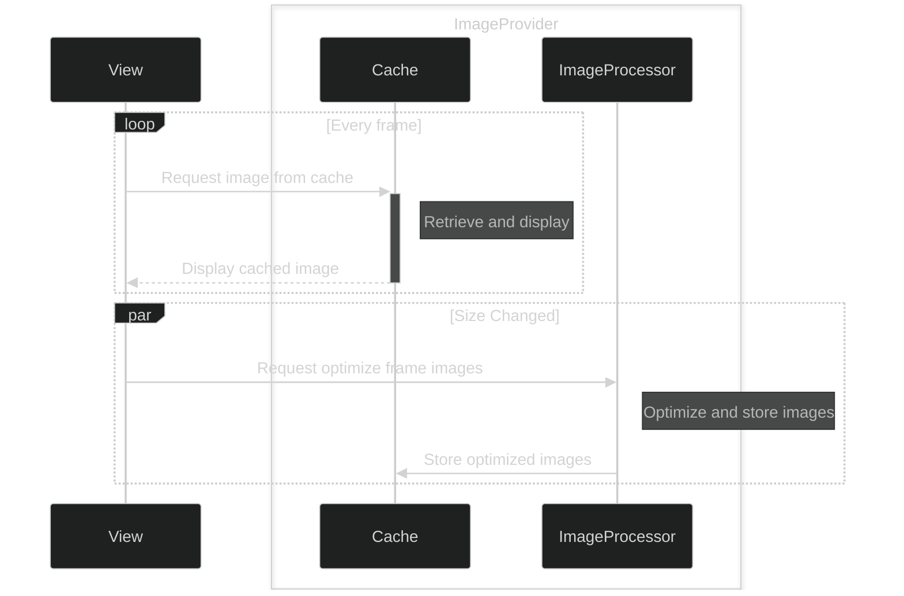
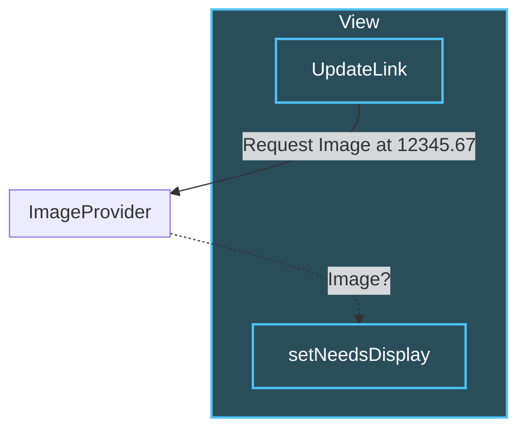
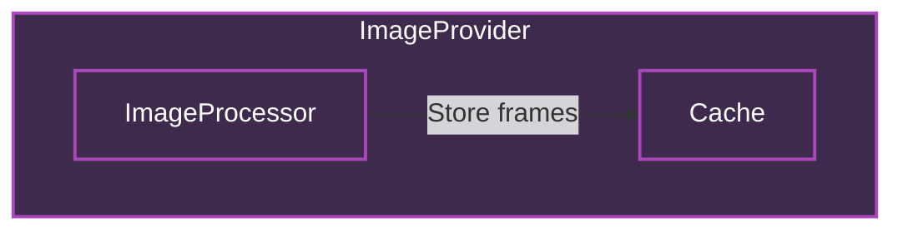

slidenumbers: true
background-color: #272729
theme: Fraunces, 4
text: #FFF, SF Pro
text-emphasis: SF Pro
text-strong: SF Pro
autoscale: true
header: #FFF, alignment(left), text-scale(0.5), SF Pro Text
header-emphasis: SF Pro Text
header-strong: SF Pro Text
slidenumber-style: SF Pro Text
footer-style: SF Pro Text
code: SF Mono

# High-performance GIF playback
## iOSDC25 day1 Track D noppe

^ はい、では本日はよろしくお願いします。
^ 今日は「ハイパフォーマンスなGIFアニメ再生を実現する工夫」というテーマでお話しさせていただきます。
^ スライドは広く見てもらうために英語で表記していますが、トークは日本語で行います。

---

# Who am I

- **noppe** 🦊
- iOSDC 18~25 Speaker
- Senior iOS App Developer at DeNA
- Indie App Developer


^ まず、自己紹介です。noppeと言います。狐のアイコンで活動しています。
^ iOSDCには2018年から毎年登壇させていただいており、今年で8年連続となります。
^ 普段はDeNAでiOSアプリの開発をしており、個人でも趣味でアプリを作っています。
^ 今日お話するDAWN for Mastodonも、そんな個人開発アプリの一つです。

---

# DAWN for Mastodon

## Features
- Beautiful, familiar iOS design
- Animation image support (GIF, APNG, WebP)
- High-performance timeline scrolling
- Multi-instance support


^ 2023年、私は個人開発でアプリを開発していました。それが、DAWN for Mastodonです。
^ DAWN for Mastodonは、名前の通りMastodonというSNSのためのアプリです。
^ Mastodonはまだ一般に普及しているとは言えませんが、このアプリはMastodonを誰もが快適に使えるように、「ふつうのアプリ」を目指して開発されています。
^ Mastodonの特殊性を、UIデザインとエンジニアリングで一般化しようというのが、このアプリの目指すところです。
^ 特に、リアクションなどのコミュニケーションの基点になる部分と、滑らかなタイムラインのスクロールに力を入れています。

---

# What is Mastodon?


- Decentralized social networking platform
- First released in 2016 by Eugen Rochko
- Open-source software built with Ruby on Rails
- Anyone can deploy their own server
- Servers connect to form a federated network

^ Mastodonをご存知ない方のために、少しMastodonについても説明させていただきます。
^ Mastodonは2016年にドイツのオイゲン氏によって開発されたオープンソースソフトウェアです。Ruby on Railsで構築されています。
^ ただし、Mastodon自体は特定のサービスを指しているわけではありません。企業や個人が、Mastodonを自分のサーバーにデプロイしてTwitterのようなSNSを運用できるということになります。
^ つまり、これが分散型ソーシャルネットワークプラットフォームと言われるものです。

[.footer: https://en.wikipedia.org/wiki/Mastodon_%28social_network%29]

---

# Decentralization


## Key Benefits
- No single point of failure
- User choice of servers/policies
- Cross-server communication
- Compatible with Threads, Misskey, etc.

[.footer: https://blog.joinmastodon.org/2018/12/why-does-decentralization-matter/]

^ 特徴的なのは、そのサーバー間で投稿を交換し合うことで他のサーバーの投稿もタイムラインに表示されることです。
^ つまり、ユーザーはどこかで一つのアカウントを作れば、そこから複数のサーバーの投稿を見ることができます。
^ DAWNは、Mastodonサーバーに接続してiPhoneで快適に使うUIを提供しています。
^ 現在、同様のプロトコルをInstagramのThreadsや、Misskeyなどが採用しているため、これらの投稿もMastodonから見ることができます。

---

# Custom Emojis


## What are Custom Emojis?
- User-uploaded emoji sets (like Slack!)
- Each server has its own emoji collection
- Support for GIF, APNG, WebP formats

^ そして、Mastodonの特徴の一つにカスタム絵文字という機能があります。
^ これは、SlackやDiscordなどにもある、ユーザーが登録できる絵文字セットのことです。
^ 各サーバーが独自の絵文字コレクションを持つことができ、GIF、APNG、WebPなど様々なフォーマットに対応しています。
^ そして、これらをタイムラインの投稿に使ったり、一部のサーバーではリアクションとして使うことができます。

---

# The Challenge


## Timeline can be filled with animated emojis!
- Dozens of GIFs playing simultaneously
- Different formats (GIF, APNG, WebP)
- Various sizes and frame rates
- **Performance nightmare** 😱

[.footer: Beware of flashing lights / 点滅にお気をつけください]

^ これはつまり、タイムラインに数十個の絵文字、しかもGIFが溢れる可能性があるということです。
^ 同時に数十個のGIFアニメーションが再生される状況も珍しくありません。

---


^ 実際に表示をしてみると、このようにスクロールは非常に重たくなってしまいます。
^ また、メモリ使用量もCPU使用率も高くなり、デバイスは熱くなって、バッテリーもすぐに減ってしまいます。

---

# DAWN's Solution


## ✅ Smooth scrolling with dozens of animated emojis
## ✅ Memory efficient rendering
## ✅ Support for GIF, APNG, WebP
## ✅ Responsive UI under heavy load

^ しかしDAWNでは、この問題を解決することができました。
^ 現在はカスタム絵文字が大量に表示されても、大きくパフォーマンスを損なうことなく動作しています。
^ 今日は、これらをどうやって実現しているか、その手法をご紹介します。

---

# Agenda

1. How to show GIF animation in UIKit.
2. How to improve performance.

^ 今日のお話は、大きく分けて２つのテーマに分かれます。
^ まずは、一般的な方法でどのようにしてGIFを再生するか。
^ そして、そこで発生するパフォーマンス上の課題をどのように対処するか、ということについてです。
^ では、順番に見ていきましょう。

---

# How to show GIF animation in UIKit.

^ まずは、UIKitでGIFを再生する方法について振り返ります。

---

```swift
// try to show GIF image.

let image = UIImage(named: "sample.gif")
let imageView = UIImageView(image: image)
view.addSubview(imageView)
```

^ いつものように、ファイルからUIImageを作ってUIImageViewに入れてみましょう。
^ ここでは、sample.gifというGIFファイルを読み込んでいます。

---


UIKit not supported any animation image.

^ この実装だと表示することはできますが、アニメーションしません。
^ ここで、一度GIFファイルの構造を振り返りましょう。

---


[.footer: https://www.nyan.cat]

^ GIFはこのスライドのように複数のフレーム画像を持ったファイルであると考えることができます。
^ つまり、GIFの持つ全てのフレーム画像を取り出して、順番に表示することでアニメーションを実現できます。

---

```swift

// Extract Frame Images

// GIF, APNG, WEBP file
let fileURL = ...
let source = CGImageSourceCreateWithURL(
    fileURL as CFURL,
    nil
)
let count = CGImageSourceGetCount(gifSource)
var images: [UIImage] = []
for index in 0..<count {
    let cgImage = CGImageSourceCreateImageAtIndex(
        source,
        index,
        nil
    )
    images.append(UIImage(cgImage: cgImage))
}
```

^ この仕組みを実現するには、まずフレームを取り出す必要があります。
^ CoreGraphicsフレームワークのCGImageSourceを使うと、画像データのメタデータに簡単にアクセスすることができます。
^ これによって、GIFが持っているフレーム画像の枚数や表示時間、各フレーム画像を取り出すことができます。
^ GIFと似たような構造を持つファイルに、APNGやWEBPという形式があります。
^ CGImageSourceはこれらの形式にも対応しているので、ファイルタイプを気にする必要がありません。便利ですね。
^ こうして、すべてのフレーム画像のUIImageを作ることができました。

---

```swift
// Playback animation images

let imageView = UIImageView()
imageView.animationImages = images
imageView.startAnimating()
```

^ 作ったUIImageの配列をUIImageViewにセットしてみましょう。
^ 実はUIImageViewは古くからanimationImagesというプロパティを持っているので、ここに取り出したUIImageの配列をセットします。
^ アニメーションを始めるにはstartAnimatingメソッドを呼びます。

---


^ はい、これでGIFアニメーションが再生されました。
^ ですが、今回のトークはパフォーマンスチューニングがテーマです。
^ つまり、この方法には大きな問題があります。

---

# Memory Usage Problem


## 25MB for a single GIF!
- Same as an 8K JPEG image
- Memory usage grows exponentially
- App crashes with multiple GIFs

^ そう、メモリ使用量が指数的に増加し、アプリがクラッシュしてしまうことがあります。
^ 実際に測定してみると、たった340KBほどの１枚のGIFを再生するのに25MBほど使っていました。
^ 25MBといえば、8Kの高解像度JPEG画像と同じくらいの容量ということになります。
^ では、この25MBはどこから来るのでしょうか。

---

# Memory Calculation


## Formula for memory usage:

$$M_{\text{bytes}} = W \times H \times C \times N$$

```
480×400×4×34 
= 25,958,400Byte ≈ 25MB
```

- **W**: Width in pixels (480)
- **H**: Height in pixels (400) 
- **C**: Color (4 for ARGB)
- **N**: Number of frames (34)

[.footer: 8bit, ARGB image case]

^ メモリがどれくらい使われるかは、一般的な画像であればM=W×H×C×Nという式で計算することができます。
^ Wは横ピクセル数、Hは縦のピクセル数、Cは1ピクセルあたりの色成分の数でARGBなら4が入ります。
^ これが34枚分のGIFだったということで、25MB程度になります。
^ 先ほどの実装だと、34フレームのGIFを表示するというのは34枚分の非圧縮の画像をメモリ上に展開しているということになります。
^ つまり、GIFのフレーム数が多いほど、解像度が高いほど、メモリ使用量が増えることになります。

---

# Performance tuning

^ このままでは、複数のGIFがあるとすぐにメモリが足りなくなってしまうと予想できます。
^ ここで、パフォーマンスチューニングの必要性が出てきます。

---

# Performance Tuning

## My approach to performance optimization

^ ただし、一言にパフォーマンスチューニングと言っても、何をすれば良いのでしょうか。
^ 例えば、今回であればメモリ使用量を減らすことが本当の目的でしょうか。
^ 私は、パフォーマンスチューニングを行う際に、まず最初に「何が大事か」を考えることが重要だと考えています。
^ そこで、私が普段使っているパフォーマンスチューニングのアプローチをご紹介したいと思います。

---

# 1. Identify User Pain

## Start with user experience
- What specific issues are users facing?
- Where do they struggle the most?
- What makes them frustrated?


^ まずは、何よりユーザーの体験から考えること。
^ 最初は、ユーザーが何を不都合に感じるのかを考えたり、ヒアリングをしたりします。
^ 技術的な指標よりも、実際のユーザーが困っていることから始めることが重要です。

---

# 2. Define Core Value

## What is your app's primary mission?
- What makes your app irreplaceable?
- What would users miss most if removed?


^ 次に、アプリの提供するコアな価値は何か。
^ 天気のアプリなら、いち早く天気予報が見れることが大事です。
^ ショッピングのアプリなら、欲しい商品が簡単に見つかることが大事です。
^ こうした、アプリのコアバリューを定義することで、パフォーマンスチューニングの優先順位をつけやすくなります。

---

# 3. Measure Everything

- Use profiling tools (Instruments, Xcode)
- Quantify performance metrics (memory, CPU, frame rate)


^ そして、可能な限り数値で測定すること。
^ 例えば、メモリ使用量やCPU使用率、フレームレートなど、アプリのパフォーマンスに関する指標を測定します。
^ これにより、どこに問題があるのかを特定しやすくなります。
^ また、改善の効果を定量的に評価することもできます。

---

# Tips: Instruments

- Profile specific tests directly in Xcode 26


^ パフォーマンスチューニングでは、１つのテストだけをプロファイルできるようになりました。
^ テストを右クリックして、「Profile」を選択するだけで、Instrumentsが起動します。
^ これにより、特定の機能のパフォーマンスを簡単に測定できるようになりました。
^ 例えば、今回のGIFアニメーションの表示に関しても、テストを作成しておき、Instrumentsで測定することができます。

---

# 4. Smart Trade-offs

- Lowering the quality of unimportant things
- Raise the quality of what matters

^ 最後に、忘れてはいけないのがパフォーマンスチューニングとは「トレードオフのパズルである」ということです。
^ 当然、処理が軽くなるのが理想ですが、突き詰めると大事でないものの品質を落とし、大事なものの品質を上げるという話になります。
^ このときに、「ユーザー体験」「アプリのコアバリュー」を軸に取捨選択を行います。
^ なので、いくらメモリやCPUが使われても、ユーザーが快適と感じるなら問題ありません。それくらい割り切ってしまっていいでしょう。
^ エンジニアは、ついつい見えているパフォーマンスの問題を解決したくなってしまいますが、それを直して意味があるのかを考えると、優先度をつけやすくなります。

---


^ では、DAWNでは何が大事なのでしょうか。
^ DAWNはSNSのアプリです。絵文字のリアクションを介したコミュニケーションが重要なバリューになります。
^ またユーザーはほとんどの時間をスクロールしています。そのときにタイムラインのスクロールが引っかかると質の悪い体験になりますよね。
^ なので、大量に絵文字が表示されていても、スクロールに影響を与えないことを重要としました。
^ 一方で、絵文字のフレームごとの画質やフレームレートは、ユーザーが絵文字の意味を理解できる程度であれば、多少犠牲にしても良いと考えました。
^ 幸いなことに、これらを犠牲にすることで、メモリ使用量とCPU使用率を大幅に削減でき、アプリの安定性や発熱、バッテリー持ちの改善に繋がります。

---

# AnimatedImage

github.com/noppefoxwolf/AnimatedImage

- Specialized UIKit component for high-performance GIF playback
- Supports GIF, APNG, WebP formats
- Memory-efficient frame caching
- Background processing pipeline

^ 今日紹介する最適化手法は、AnimatedImageというOSSライブラリとして公開しています。
^ これは高パフォーマンスなGIF再生に特化したUIKitコンポーネントです。
^ 複数のアニメーション形式に対応し、メモリ効率的なフレームキャッシュとバックグラウンド処理パイプラインを提供しています。
^ では、この実装の詳細を見ていきましょう。

---



^ まず、最初に全体の流れを見てみましょう。
^ 大きく分けて、ViewとImageProviderがあります。
^ ImageProviderは、画像最適化のためのImageProcessorと、最適化された画像を保存するCacheを持っています。
^ ViewとImageProviderは、大きく分けて２つのタスクを行います。
^ 1つ目は、現在表示するべき画像がキャッシュに存在するかを確認し、存在すればそれを表示することです。
^ 2つ目は、ビューのサイズが変わったときに、ImageProviderに最適化された画像を生成することをリクエストすることです。
^ こうすることで、Viewは常に最適化された画像を表示できるようになります。
^ では、細かい実装について見ていきましょう。

---



^ まずは、現在表示するべき画像がキャッシュに存在するかを確認し、存在すればそれを表示する部分を見てみましょう。
^ ビューはUpdateLinkというタイマーを使って、60fpsで画面の更新タイミングに合わせてキャッシュの確認を行います。
^ キャッシュにフレーム画像があればViewに画像を返却し、ビューに描画をします。
^ この仕組みの良いところは、ImageProviderが画像を返すか否かによってビューの描画をコントロールできる点です。これにより、重複したフレーム画像をスキップしたり、フレームレートを落としたりすることができます。

---

# Synchronization


^ また、副次的なメリットとしてUpdateLinkのタイムスタンプを元にフレーム画像を取得するので、同じGIF画像を複数表示した場合に、それぞれのアニメーションが同期して動作します。
^ これにより、スライドのように複数のアニメーション絵文字が同じタイミングで動作するようになります。

---

# UIUpdateLink 🆕

- iOS17+
- An object you use to observe, participate in, and affect the UI update process.

```swift
// Update y every frame.

let updateLink = UIUpdateLink(view: view)
updateLink.addAction { link, info in 
    // Code that runs each UI update, after processing input events, 
    // but before `CADisplayLink` callbacks.
    self.view.center.y = sin(info.modelTime) * 100 + self.view.bounds.midY
}
```

^ 先ほど紹介したUpdateLinkですが、内部的にはUIUpdateLinkを利用しています。
^ UIUpdateLinkは画面の更新タイミングに合わせてコードを実行できるiOS17の新機能です。
^ 時間の経過をベースにしているタイマーと違って、画面描画と同期するため、よりスムーズなアニメーションが実現するのに向いています。
^ AnimatedImageではiOS16以前も対応しており、そちらではCADisplayLinkを利用しています。

---



^ 次にImageProviderの内部構造を見ていきましょう。
^ 先ほど紹介した通り、ImageProviderはImageProcessorとCacheを持っており、ImageProcessorが最適化したフレーム画像をCacheに保存します。
^ CacheはNSCacheで実装しており、スレッドセーフなことを活かしてビューからの呼び出しと、ImageProcessorからのスレッドからの保存に対応しています。
^ では、この実装の中核であるImageProcessorの実装を見ていきましょう。

[.footer: https://developer.apple.com/documentation/Foundation/NSCache]

---


^ ImageProcessorでは、４つの事をしています。
^ 画像からフレーム画像を取り出すこと・フレーム画像のリサイズ・フレームの間引き・そしてレンダリングです。
^ 画像からフレーム画像を取り出す部分は、先ほど紹介したCGImageSourceを使った実装と同じです。
^ では、順番に見ていきましょう。

---

# Resizing

^ まずはリサイズです。

---


^ 最初に解説した通り、フレーム画像のサイズが大きいとメモリ使用量が増えます。
^ そこで、ビューのサイズに合わせてフレーム画像をリサイズします。
^ 画面に表示する以上のサイズをメモリに保持するのは無駄なので、実際に画面にレンダリングするサイズまで小さくします。
^ これによって、メモリ使用量を大幅に削減できます。特に絵文字リアクションでは、表示サイズが小さいので効果が大きいです。
^ リサイズの処理コストが高いため、実際にはこの工程ではサイズだけを決めて、実際のリサイズは行わずに次の工程に進みます。

---

# Drop Frames

^ 次は、描画フレームを間引く工程です。

---


^ この時点で、全てのフレームをデコードすると使われるメモリの量が判明しているので、それが大きすぎる場合はフレームを間引いて調整します。
^ 例えば、毎秒10フレームのgifをキャッシュするのに必要なメモリが10MBで、5MBに抑えたい時は、フレーム数を半分にするという感じですね。

---

TODO

^ 単純にフレームを間引くと、アニメーションがカクついてしまいます。
^ そこで、AnimatedImageではフレームの間引き方を工夫しています。
^ 具体的には、フレームの表示時間を考慮して、表示時間の長いフレームを優先的に残すようにしています。
^ 例えば、1秒間に10フレームのgifで、1フレームだけ0.5秒表示されるフレームがある場合、そのフレームを残すようにします。
^ こうすることで、アニメーションのカクつきを抑えることができます。

---

// TODO: もう少し見やすい動画にする


^ 実際に調整している様子がこちらです。integrityを調整することで、フレームレートが変化しています。

---

# Rendering

^ そして、最後にレンダリングです。
^ これまでの工程で、フレーム画像のサイズとフレーム数が決まっているので、実際にフレーム画像をレンダリングします。

---

# Is Rendering Necessary?

^ ところで、ここで一つ問題があります。
^ CGImageSourceからはオリジナルのフレーム画像が取り出せます。
^ リサイズの必要が無いフレームでも、必ず各フレームをレンダリングする必要はあるのでしょうか？
^ 答えは、Noです。
^ 実は次のような理由があります。

---

# UIImage lazy decompress issue

- DGifDecompressLine, DGifDecompressInput run on Main Thread.


^ CGImageSourceから取り出したGIFのCGImageは圧縮されており、そのままでは描画に使用できません。
^ しかし、デフォルトの挙動では、UIImageは描画の直前までフレームを復元しません。
^ 描画の直前ということは、メインスレッドで行われるということです。
^ これはInstrumentsで確認することができます。
^ これではメインスレッドが影響を受け、スムーズなスクロールに影響を与える可能性があります。

---

# Decompress

```swift
// UIKit decompress

let decompressedImage = await uiImage.byPreparingForDisplay()
```

```swift
// CoreGraphics decompress

let context = CGContext(...)!
context.draw(image, in: rect)
let decodedImage = context.makeImage()
```

^ この問題を解決するには、事前にバックグラウンドスレッドでフレームを復元しておく必要があります。
^ UIImageの場合は、byPreparingForDisplayメソッドを使うことで任意のタイミングでフレームを復元することができます。
^ このメソッドは非同期なので、メインスレッドに影響を与えないところもポイントです。
^ また、CGImageの場合は、CGContextにdrawすることで復元されたフレームでCGImageを得ることができます。
^ どちらもバックグラウンドスレッドで実行できるため、画面に表示される瞬間に重い処理が走ってスクロールがカクつくのを防げます。

---


^ これらの最適化をした結果、１画面に50を超えるアニメーション画像を表示しても、クラッシュすることなく100MB以下のメモリ使用に抑えることができました。
^ そして最も重要なスクロールの滑らかさも維持できています。
^ 一方で、ビューの表示とアニメーションの表示の間に若干の遅延が発生したり、フレームレートや解像度が落ちています。この辺りは、トレードオフの結果ですね。
^ AnimatedImageでは、これらのトレードオフをパラメータで調整できるようにしています。

---


^ 本日ご紹介したAnimatedImageをはじめ、DAWN for Mastodonは主要な機能を30を超えるOSSとして公開しています。
^ よろしければ、ぜひ他のOSSもご覧いただければと思います。

---

# Next steps

- Explore AnimatedImage features
- Try AnimatedImage in your projects
- Deep dive into WebP

|||
|---|--:|
|作って学ぶWebP入門|day1 13:00 Track A|

^ また、今回登場したWebP自体の細かい仕様については、午後の「作って学ぶWebP入門」をご覧いただくとより理解が深まるのではないでしょうか。
^ 以上、本日のお話でした。ご清聴ありがとうございました。
