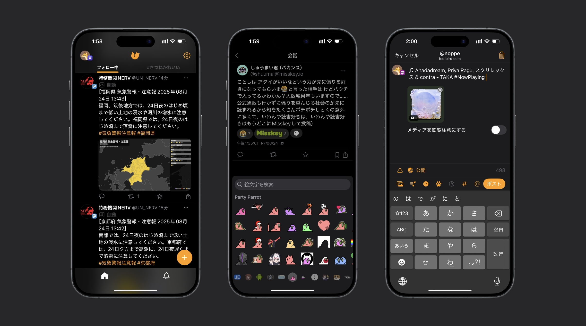
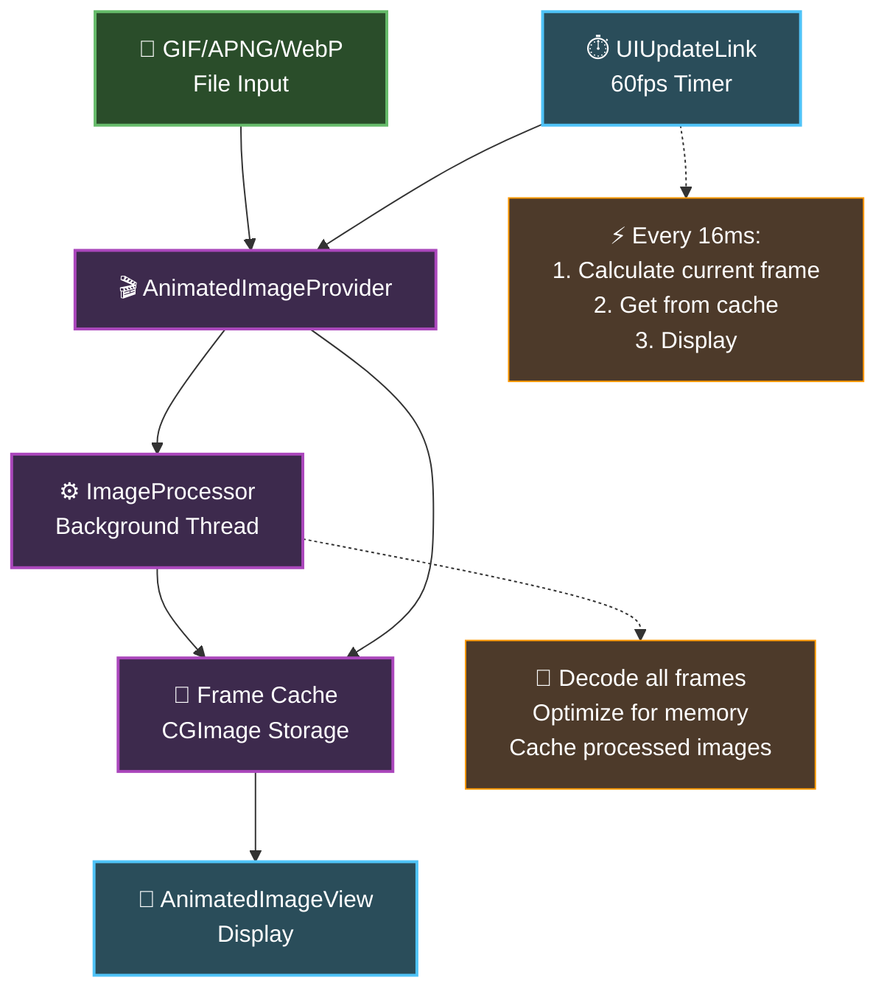
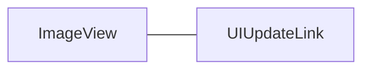
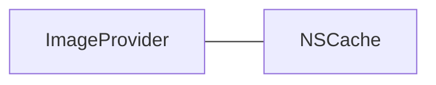

slidenumbers: true
background-color: #272729
theme: Fraunces, 4
text: #FFF, SF Pro
text-emphasis: SF Pro
text-strong: SF Pro
header: #FFF, alignment(left), text-scale(0.5), SF Pro Expanded Regular
header-emphasis: SF Pro
header-strong: SF Pro
slidenumber-style: SF Pro
footer-style: SF Pro
code: SF Mono

# High-performance GIF playback

```
iOSDC25 day1 Track D noppe
```

^ はい、では本日はよろしくお願いします。
^ 「ハイパフォーマンスなGIFアニメ再生を実現する工夫」というタイトルで20分ほど話させていただければと思います。
^ スライドは広く見てもらうために英語になりますが、トークは日本語で行います。

---

# Who am I

- **noppe**

- iOSDC 18~25 Speaker
- Senior iOS App Developer at DeNA
- Indie App Developer


^ まず、自己紹介です。noppeと言います。狐のアイコンで活動しています。
^ 以下略

---



^ 2023年、私は個人開発でアプリを開発していました。それが、DAWN for Mastodonです。
^ DAWN for Mastodonは、名前の通りMastodonというSNSのためのアプリです。
^ Mastodonはまだ一般に普及しているとは言えませんが、このアプリはMastodonを誰もが快適に使えるように、「ふつうのアプリ」を目指して開発されています。
^ Mastodonの特殊性を、UIデザインとエンジニアリングで一般化しようというのが、このアプリの目指すところです。

---


- First released in 2016 by Eugen Rochko


^ Mastodonをご存知ない方のために、少しMastodonについても説明します。
^ Mastodonは2016年にドイツのオイゲン・ロチコによって開発されたオープンソースソフトウェアです。Ruby on Railsで書かれています。
^ Mastodon自体は特定のサービスを指しているわけではなく、企業や個人は、Mastodonを自分のサーバーにデプロイしてTwitterのようなSNSを運用することができます。

[.footer: https://en.wikipedia.org/wiki/Mastodon_%28social_network%29]

---


[.footer: https://blog.joinmastodon.org/2018/12/why-does-decentralization-matter/]

^ 特徴的なのは、そのサーバー間で投稿を交換し合うことで他のサーバーの投稿もタイムラインに表示されることです。
^ つまり、ユーザーは一つのアカウントを使って複数のサーバーの投稿を見ることができます。
^ DAWNは、このネットワークに接続してMastodonをiPhoneで快適に使うUIを提供しています。
^ 現在、同様のプロトコルをInstagramのThreadsや、Misskeyなどが採用しているため、これらの投稿もMastodonから見ることができます。

---

# Custom Emojis


- Users can use custom-emojis in following situation.
    - Sending post
    - Reaction to announcement
    - Reaction to post (forked instance only)

^ そして、Mastodonの特徴の一つにカスタム絵文字という機能があります。
^ Slackなどにもある、ユーザーが登録できる絵文字セットです。
^ これらをタイムラインの投稿やリアクションとして使うことができます。

---


[.footer: Beware of flashing lights / 点滅にお気をつけください]

^ これはつまり、タイムラインに大量の絵文字、しかもGIFが溢れる可能性があるということです。

---

Image of dawn

^ DAWNでは、これをやってのけました。GIFの絵文字が大量に表示されても、大きくパフォーマンスを損なうことなく動作します。
^ 今日は、これらをどうやって実現しているか紹介します。

---

# Agenda

1. How to show GIF animation in UIKit.
2. How to improve performance.

^ 今日は大きく分けて２つになります。
^ まずは、一般的な方法でどのようにしてGIFを再生するか。
^ そして、そこで発生するパフォーマンス上の課題をどのように対処するか。です。
^ では、早速見ていきましょう。

---

# How to show GIF animation in UIKit.

^ まずは、UIKitでGIFを再生する方法について振り返ります。

---

```swift
// try to show GIF image.

let image = UIImage(named: "sample.gif")
let imageView = UIImageView(image: image)
view.addSubview(imageView)
```

^ いつものように、UIImageを作ってUIImageViewに入れてみましょう。

---

- UIKit not supported any animation image.


^ 表示することはできますが、残念ながらこれではアニメーションしません。
^ ここで、一度GIFファイルの構造を振り返りましょう。

---


[.footer: https://www.nyan.cat]

^ GIFはパラパラ漫画のように複数の画像を持ったファイルであると考えることができます。
^ 実際プレビューで開くと、各フレームの画像を確認することができます。

---

```swift

// Building animation images

// GIF, APNG, WEBP file
let fileURL = ...
let source = CGImageSourceCreateWithURL(
    fileURL as CFURL,
    nil
)
let count = CGImageSourceGetCount(gifSource)
var images: [UIImage] = []
for index in 0..<count {
    let cgImage = CGImageSourceCreateImageAtIndex(
        source,
        index,
        nil
    )
    images.append(UIImage(cgImage: cgImage))
}
```

^ CoreGraphicsを使うことで、GIFが持っている画像の枚数や表示時間、各画像を取り出すことができます。
^ なお、このAPIはAPNGやWEBPにも対応しているのでGIFかどうかを考える必要がありません。便利ですね。
^ こうして、すべてのフレームのUIImageを作ることができました。

---

```swift
// Playback animation images

let gifImageData = ...
let imageView = UIImageView()
imageView.animationImages = images
imageView.startAnimating()
```

^ 実はUIImageViewはanimationImagesというプロパティを持っているので、ここに取り出したUIImageの配列をセットしてみましょう。
^ アニメーションを始めるにはstartAnimatingメソッドを呼びます。

---


^ やった、動きました。以上になります。

---


^ しかし、この方法。数が増えていくとアプリがどんどん重くなります。
^ たった１枚のGIFを再生するのに25MBほど使っていました。
^ 25MBといえば、8Kのjpegと同じくらいです。
^ この25MBはどこから来たのでしょうか

---

$$
M_{\text{bytes}} = W \times H \times C \times N
$$

$$
25MB ≒ 26,112,000byte = 480 \times 400 \times 4 \times 34
$$


^ メモリがどれくらい使われるかは、次の計算式で予想することができます。
^ Wは横ピクセル数、Hは縦のピクセル数、Cはチャンネル数でARGBなら4が入ります。
^ これが34枚分のGIFだったということで、25MB程度になります。
^ 当然のことを言いますが、34フレームのGIFを表示するというのは34枚分の画像を展開しているということ。
^ メモリも食い潰します。これでは大量に表示するとクラッシュしかねません。どうしたものか
^ こういうときにやることは一つ。

---

# Performance tuning

^ そう、パフォーマンスチューニングです。

---

# Planning

^ ですが、一言にパフォーマンスチューニングと言ってもどう進めたら良いのか分かりませんよね。
^ ここで、私のパフォーマンスチューニングの勘所を紹介します。

---

# 1. User pain

- What is bothering users?

^ まずは、何よりユーザーの体験から考えること。
^ 最初は、ユーザーが何を不都合に感じるのかを考えたり、ヒアリングをしたりします。

---

# 2. Service Value

- What is the most important value your app provides?

^ 次に、アプリの提供するコアな価値は何か。
^ 天気のアプリなら、いち早く天気予報が見れることが大事です。

---

# 3. Measurement

- What do you think about the app?
- Putting the problem into numbers.

^ そして、計測すること。
^ ここでの計測は、定量的なものも、定性的なものもです。
^ 先ほども言いましたが、大事なのはユーザーの体験です。
^ 定量的な数値が悪くても、体験はそこまで悪くないこともあります。
^ 一方で、変更の影響の判断材料に定性的な数字はとても効果的です。
^ パフォーマンスが改善したのか、リファクタリングでパフォーマンスが悪化していないのかが分かれば、効率的にチューニングを行うことができます。

---

# Trade-off

- adjust benefit

^ 最後に、忘れてはいけないのがパフォーマンスチューニングとは「トレードオフのパズルである」ということです。
^ 当然、処理が軽くなるのが理想ですが、突き詰めるところ大事でないものの品質を落とし、大事なものの品質を上げるという話になりがちです。
^ このときに、「ユーザー体験」「アプリの提供価値」を軸に取捨選択を行います。
^ なので、いくらメモリやCPUが使われても、ユーザーが快適と感じるならヨシ。
^ それくらい割り切ってしまっていいでしょう。
^ 逆にそれ以外なら劣化してもOK！
^ エンジニアは、ついつい見えているパフォーマンスの問題を解決したくなってしまいますが、それを直して意味があるのか。考えると優先度がつけやすいかと思います。

---

# Case of DAWN

1. Context
1. Smooth scrolling

^ では、DAWNでは何が大事なのでしょうか。
^ DAWNはSNSのアプリです。ユーザーはほとんどの時間をスクロールしています。そのときにタイムラインのスクロールが引っかかると嫌になりますよね。
^ なので、大量に絵文字が表示されていても、スクロールに影響を与えないことを重要としました。
^ そして、Mastodonならではの要件としてGIF以外にもAPNGやWEBPもサポートすることにしました。
^ これはMastodonが分散型であるが故、必ず絵文字がGIFであるという保証がないからですね。

---

# Trade-off

- image quality
- framerate

^ では、逆にトレードオフはなんでしょうか
^ ユーザーは絵文字のコンテキストさえ分かれば良いので、多少、画質を劣化させたり、GIFのフレームレートを落としてもそんなに問題にはならないはずです。
^ では、今のポイントを抑えてアーキテクチャを考えてみましょう

---



^ どん
^ こんな感じです。簡単ですね
^ ImageProviderとViewがあります。
^ Viewは60fpsでImageProviderに現在表示するべき画像があるかを問い合わせます。もし画像が返ってくればレンダリングします。
^ 一方で、ImageProviderはバックグラウンドスレッドで、全てのフレームをキャッシュします。
^ こうすることで、ImageProviderで最適化した画像を作りつつ、Viewは最小限のレンダリングだけに専念することができます。
^ では、細かい実装について見ていきましょう。

---

# ImageView



^ ビューはUIUpdateLinkを持っています。
^ UIUpdateLinkは登録されたアクションを、決まったタイミングで何度も呼び出すクラスです。
^ タイマーと異なるのは、画面の描画に合わせて呼ばれる点です。
^ タイマーだと開始したタイミング次第で、次のフレームまでの猶予時間がバラバラになりますが、UIUpdateLinkなら毎回一定の猶予時間で呼ばれます。
^ また、UIUpdateLinkはビューが表示されている間だけ動作するのでビューが非表示になったりすると自動的に画面の更新に係る処理が停止します。

---

# ImageProvider



^ ImageProviderはNSCacheを持っています。
^ NSCacheはスレッドセーフなので、ビューからの呼び出しと、バックグラウンドスレッドからの保存に対応しています。

[.footer: https://developer.apple.com/documentation/Foundation/NSCache]

---

# ImageProvider

^ では、続いてImageProviderについて深掘りします。
^ ImageProviderは、ImageProcessorとCacheを持っています。
^ ImageProvderは、Viewのサイズなど最適化に関わる要素が変わるたびにキャッシュを作り直します。
^ ImageProcessorはアニメーション画像から各フレームを最適化してCacheに保存します。

---

# TBD

^ これまでのアーキテクチャをまとめると、このような構造になります。
^ お気づきの通り、ImageProcessorがこの最適化の要です。
^ では、続いてImageProcessorを見ていきます。

---

# ImageProcessor

1. Resizing
2. Drop frames
3. Decompress

^ ImageProcessorでは、３つの事をしています。
^ フレーム画像のリサイズ・フレームの間引き・デコードです。

---

# Image Resizing Rule

1. Final Size <= Rendering Size

^ 画面に表示する以上のサイズをメモリに保持するのは無駄なので、実際に画面にレンダリングするサイズまで小さくします。
^ つまり、ビューのサイズが変更されるたびにキャッシュを捨てて作り直します。

---

# Drop Frame

1. Memory Status Assessment
    - Calculate memory usage using image size x number of frames x 4 bytes
2. VSync Synchronization Selection
    - 12 frame rate options from 60fps to 1fps
3. Frame Selection
    - Thin out frames evenly along VSync boundaries

^ フレームドロップは特殊なロジックでやります

---

# Decompress


^ 仮にリサイズが不要な場合でも必ず画像をレンダリングし直す。
^ GIFの場合は、UIImageで遅延デコードされてメインスレッドが重くなるケースがあるので気を付ける

---

# UIImage decompress

```swift
let decodedImage = await uiImage.byPreparingForDisplay()
```

^ UIImageの場合は、byPreparingForDisplayメソッドを呼ぶことで任意のタイミングでデコンプレスすることができます。

---

# CGImage decompress

```swift
let context = CGContext(...)!
context.draw(image, in: rect)
let decodedImage = context.makeImage()
```

^ CGImageの場合は、単純にCGContextにdrawしてあげればこの問題が発生しません。

---

## Recap

- UI blocking prevention, smoothness, and stability.
- Overall optimization through abstraction and gradual degradation.
- AnimatedImage is suitable for a variety of media.

^ 本日の要点は、滑らかさ、安定性、そして全体最適の三点です。つまり、メインを塞がず、負荷時は段階的に劣化し、抽象で違いを吸収するということになります。Actor境界、非同期キャッシュ、間引き、事前デコードの組み合わせが鍵でした。以上が今日のお話です。詳細はOSSのリポジトリをご覧ください。

---


^ 本日はAnimatedImageに焦点を当てて説明します。多くのOSSの中でも、体感に直結する領域であり、設計判断が成果に直に反映されます。事例とともに設計の勘所を押さえていきます。以上が前置きです。

---

# Next steps

|||
|---|--:|
|作って学ぶWebP入門|day1 13:00 Track A|

^ 今回登場したWebP自体の細かい仕様については、午後の「作って学ぶWebP入門」を見ると良いと思います。
^ では、以上になります。ありがとうございました。
