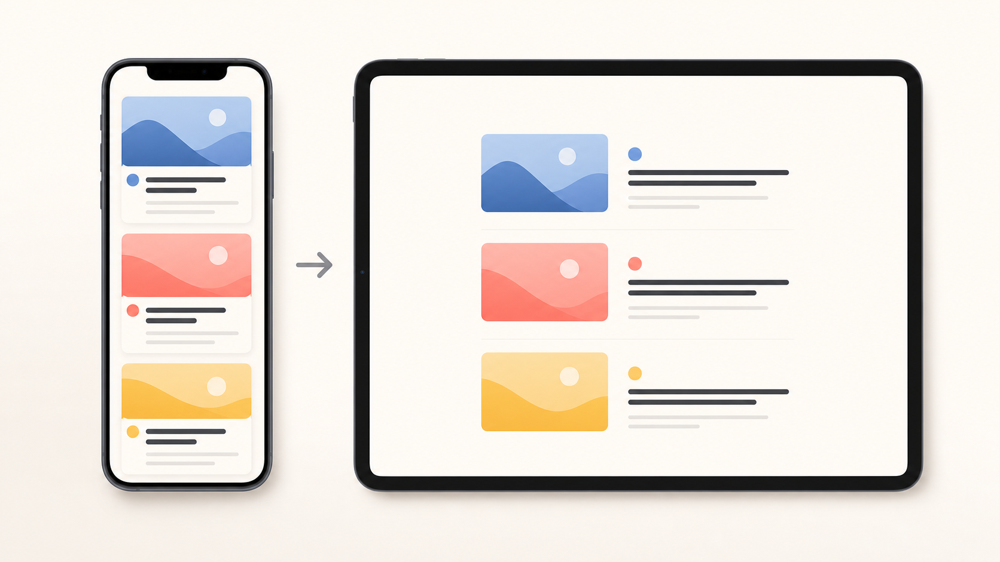
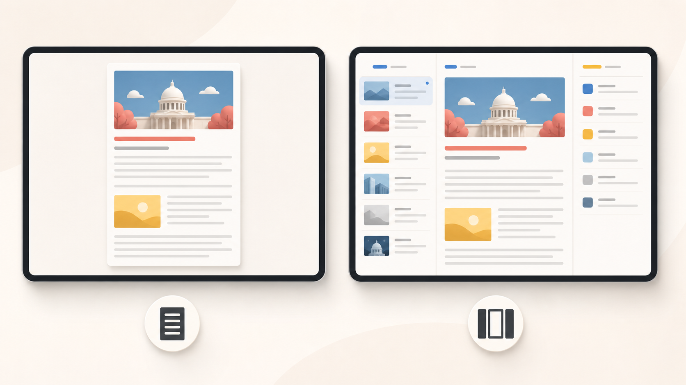
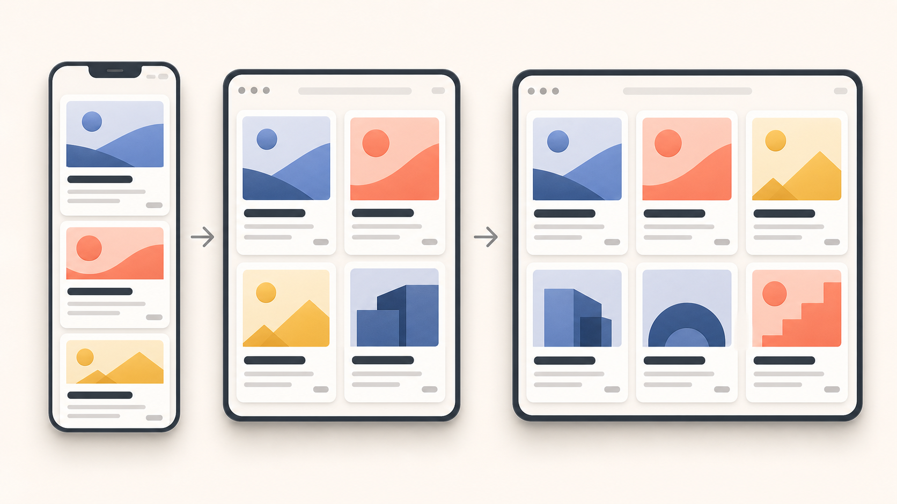
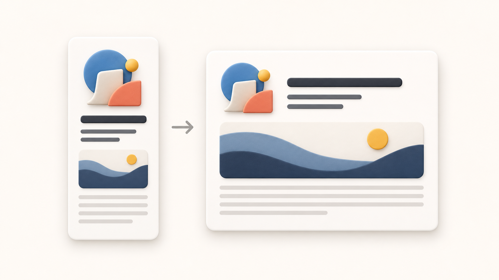
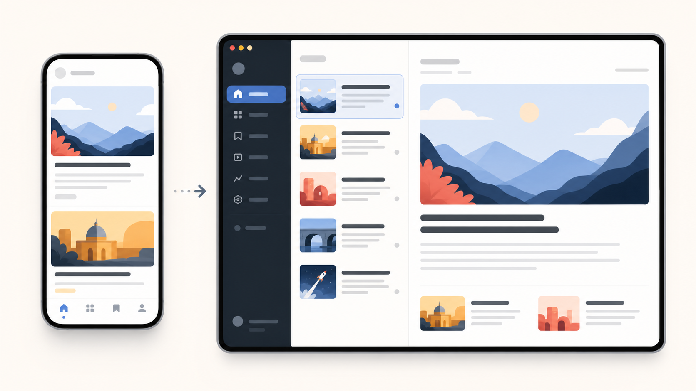
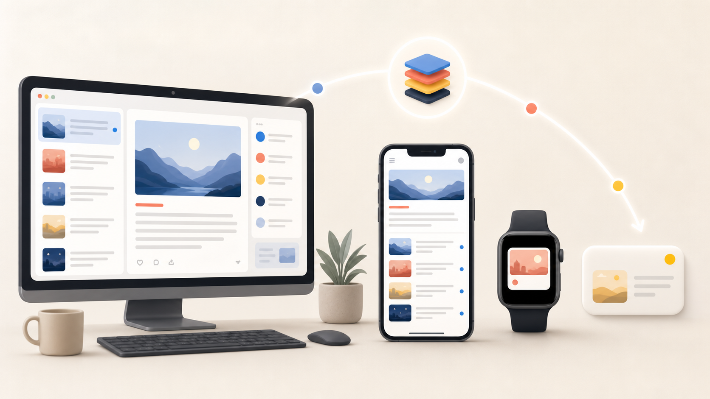

slidenumbers: true

# 柔軟性のあるUIで、多くの環境でアプリを活躍させる

^ こんにちは、Pocochaのデザインエンジニアのnoppeです。今日は「柔軟性のあるUIで、多くの環境でアプリを活躍させる」をテーマに、まずは環境に応じてUIを設計する考え方からお話しします。

<!-- 計画メモ：最終的な登壇時間の目標は約45分。初稿は広く書き、後から編集・削減する。Ask the speakerは登壇時間外。 -->
<!-- 構成メモ：ニュースアプリは実装済みアプリではなく、概念を具体化する柔軟な題材。Markdownはスライド単位で整理し、各スライドに完全な話者スクリプトを記載する。 -->
<!-- 例の設計要件：カード型コンテンツからタブ、ナビゲーション、サイドバー、複数カラム／分割ペインへ展開できる題材にする。 -->

---

# 全体構成

| 章 | 内容 | 時間 |
|---|---|---:|
| イントロダクション | 自己紹介、デザイン、トークの目的 | 4分 |
| 第1章 柔軟性とは何か | HIG、利用環境、柔軟性の定義 | 5分 |
| 第2章 UIの構造とモデル | 画面・コンポーネント・モデル、ユースケース、デザインデータ | 13分 |
| 第3章 サイズに連続的に適応する | セルフサイジング、スクロール、グリッド、余白 | 8分 |
| 第4章 UIの構成を変化させる | タブ、サイドバー、複数カラム、情報量、異なる環境での表現 | 9分 |
| 第5章 適応するコンポーネントを実装する | モデル共有、レイアウト切り替え、抽象化、意味を表すAPI | 5分 |
| まとめ | マインドセット、組織、チェックリスト | 1分 |

^ まず環境が変わるとUIに何が起きるかを確認します。そこからモデル、サイズ適応、構成変更、意味を表すAPIの順に見ていきます。具体的な題材は、考え方を整理したあとで紹介します。

---

# イントロダクション

## 自己紹介

^ 改めまして、Pocochaのデザインエンジニアのnoppeです。iOSアプリの設計と実装の両方に関わっています。

## 目的説明

^ 今日は、画面サイズや環境が変わっても破綻しないUIの設計を、ひとつの題材を使って段階的に見ていきます。同じモデルが異なる表現へ変化する過程を確認します。題材の紹介は、この考え方を共有したあとに行います。

---

## このトークで作るもの


^ このトークでは、ひとつのモデルを共通の題材として、環境に応じてサイズ、配置、情報量、操作方法を変えて表現します。最初は小さな画面から始め、最後には広い画面や異なるプラットフォームまで同じモデルを展開します。題材そのものより、どの判断を共通化し、どこで表現を変えるかに注目してください。

- iPhoneの小さな画面
- iPhoneの大きな画面
- 横向き
- iPad
- ウインドウのリサイズ
- iPhoneミラーリング
- Widget
- Apple Watchのコンプリケーション

---

## iPhoneの縦向きだけを基準にする問題

^ 最初からiPhoneの縦向きの画面だけを基準にしてUIを設計すると、環境が変わったときに次のような問題が起こります。

- Dynamic Typeで文字が大きくなると、固定サイズのビューからテキストがあふれる。
- iPhone向けのレイアウトをiPadで開くと、広い画面に対して情報量が少なく、まばらに見える。
- 比率を主な基準にしたレイアウトは、横向きにしたときに過度に大きくなる。

---

## 広い画面に一つの正解はない

- 読みやすい幅で中央に置く
- 複数カラムで情報を並べる
- 補助情報を必要に応じて見せる

^ 広いiPadの画面に対する答えは、ひとつに決まっているわけではありません。例えば、メインコンテンツの幅を制限して中央に配置する方法、複数カラムで情報を並べる方法、サイドバーやインスペクタで補助的な情報を見せながら主要なコンテンツは読みやすい幅に保つ方法があります。ただし、どれを選ぶべきかを決める普遍的なルールもありません。製品の領域や文脈によって適切な選択は変わるため、このトークでは一般的なUIの適応例として扱い、ひとつの正解であるかのようには扱いません。

---

## 題材としてのニュースアプリ

- 一覧、記事、媒体、保存、読み上げを扱える
- 同じモデルから複数のユースケースを考えられる
- 完成品ではなく、設計判断を具体化する例

^ これらは個別の端末に対応する分岐を増やせば解決するとは限りません。最初から環境の変化を前提に、コンテンツとコンテナの関係を設計する必要があります。
^ 今日の題材としてニュースアプリを使うのは、一覧、記事、媒体、保存、読み上げなど、同じモデルから複数のユースケースを考えやすいからです。実装済みのアプリを完成させる話ではなく、設計判断を具体的にするための共通の例として使います。

---

## アジェンダ

- UIの構造とモデル
- サイズへの連続的な適応
- UIの構成変更
- 異なるコンテキストでの表現
- 適応するコンポーネントとAPI
- Ask the speaker

^ まずUIの構造とモデルを定義します。次に、同じ構成のままサイズへ連続的に適応する方法を見ます。その後、タブバーをサイドバーに変えるような構成変更と、異なるコンテキストでの表現を扱い、最後に適応するコンポーネントとAPIへつなげます。

---

# 第1章 柔軟性とは何か

## 柔軟性

^ HIGにも柔軟性という考え方があります。ここでは背景として短く触れるだけにして、具体的なUIの例から考えていきます。
^ この発表でいう柔軟なUIとは、環境が変わってもユーザーの目的を保ち、表現と操作をその環境に合わせて変えられるUIです。
^ 変わる環境として、コンテナのサイズやウインドウの特性、プラットフォームの能力、入力方法を見ていきます。
^ 例えば、同じ幅でもApple Watchと小さなウインドウでは、持ち方や周囲の情報、利用できる操作が違います。指でのタップとマウスのクリックでも、必要な余白やフィードバックは同じではありません。
^ ですから、柔軟性を「どの画面でも同じものを縮めること」と考えると、重要な差を取りこぼします。保つべきなのはユーザーの目的で、表現と操作は条件に応じて変わってよい、という出発点です。

---

## このトークの中心となる考え方


^ ビューの見た目は、ひとつのデザインデータだけでは決まりません。

```text
表示されるUI = モデル × コンテナ × 環境
```

- モデル：何を表現するか
- コンテナ：ウインドウやビューなど、表示に利用できる領域
- 環境：プラットフォーム、入力方法、アクセシビリティ、利用できる機能

^ このトークでは、環境の変化を前提としてUIコンポーネントを設計します。
^ 考慮する環境の変数には、例えば次のようなものがあります。

- コンテナのサイズ：ウインドウやビューの大きさ
- プラットフォームの特性：同程度のサイズでも、Apple Watchと小さなウインドウでは異なる制約や文脈がある
- 入力方法：指でのタップと、マウスでのクリックなどの違い

^ サイズが同じであることだけでは、同じUIを表示する理由にはなりません。
^ これらの条件に応じて、視覚的な表現とインタラクションの両方を適応させる必要があります。

---

## 何を保ち、何を変えるか

- 保つもの：モデルとユースケース
- 変えるもの：表現、レイアウト、操作方法
- 判断する文脈：コンテナとプラットフォーム

^ 同じモデルでも、コンテナや環境が変われば、最適な見た目は変わります。
^ ここで環境を前提にするとは、未来に起こるすべての組み合わせを列挙することではありません。モデルとユースケースを明確にし、コンテナの制約に対して成立するルールを用意する、という意味です。

---

## 柔軟性の定義

- 同じ見た目を保つことではない
- 同じ目的を達成できること
- 表現と操作は環境に合わせて変える

^ 柔軟なUIとは、すべての環境で同じ見た目を維持するUIではありません。

---

## 柔軟性を二つの変化に分ける

- 同じ構成のまま、サイズや内部配置を変える
- しきい値を越えたら、構成自体を変える
- どちらもモデルと目的は保つ

^ 環境が変化しても、ユーザーが同じ目的を果たせるUIです。
^ この定義を、これから二つの種類の変化に分けて見ていきます。まずは同じ構成のままサイズや内部配置を変える連続的な適応です。
^ そのあとで、幅が大きく変わったときに、タブバーをサイドバーにするような構成変更を扱います。二つを分けることで、いつ単にリサイズし、いつ別のモードを用意するかを考えやすくなります。
^ この原則はUIKitとSwiftUIのどちらにも適用できます。コード例は、原則を明確にできる場面だけSwiftUIで示します。

---

# 第2章 UIの構造とモデル

## UIの構造化

^ UIの構造にはいくつかの捉え方があります。ここでは、画面フロー、画面、コンポーネントの3つの粒度で整理します。
^ アプリは、画面フローと画面、そしてそれらを構成するコンポーネントの組み合わせとして捉えられます。
^ 特に重要なのは、画面を一枚の絵ではなく、組み替えられるコンポーネントの集まりとして見ることです。

---

## 画面を組み替えられる単位で考える

- 画面を一枚の絵として固定しない
- 役割を持つブロックとして捉える
- 環境に応じて組み直せるようにする

^ コンポーネントを考えるときは、現在のスクリーンショットに写っている矩形ではなく、ユーザーが認識する対象や操作のまとまりを見ます。
^ 画面を絵として固定してしまうと、環境が変わるたびに別の画面を作ることになります。
^ 個々の要素を役割を持つブロックとして捉え、組み直せるようにすることが柔軟なUIの基本です。

---

## 役割からコンポーネントを見つける

^ ここでいう分解は、単にViewを細かく切り出すという意味ではありません。ユーザーがどこからどこへ進み、各画面で何を見て、どの操作を行うのかを、流れとして捉え直します。
^ その流れの中で、複数の場所に現れ、別の配置でも意味を保てるものをコンポーネントとして見つけます。絵の一部をコピーするのではなく、役割を持った単位として扱うことがポイントです。
^ 例えばニュース一覧から記事詳細へ進む流れでは、カードは記事の識別と選択、詳細画面は読むという役割を持ちます。流れと役割を先に捉えると、構成を変えても目的が途切れにくくなります。

---

## UIの3つの粒度

### 画面フロー

^ 画面フローは、ユーザーが目的を達成するまでの移動を表します。

^ まず、画面フローの例を見てみます。

```text
ニュース一覧
↓
記事詳細
↓
保存・共有
```

### 画面

^ ある時点でユーザーに提供する情報と操作のまとまり。

^ 次に、画面という単位の例です。

- ニュース一覧画面
- 記事詳細画面
- 保存した記事の画面

### コンポーネント

^ 特定の意味や役割を持ち、異なる画面や構成で再利用できる単位。

^ 最後に、画面を構成するコンポーネントの例です。

- 記事
- カテゴリ
- メディア
- 保存ボタン
- 音声再生コントロール

---

## 柔軟性を持つ単位


^ 画面全体をひとつの完成した絵として扱うと、画面サイズが変わるたびに別の画面を作る必要があります。

^ コンポーネントに分解すれば、同じ情報を保ちながら、並べ方や表示方法を変えられる。

```text
小さい画面
記事
記事
記事
```

```text
広い画面
記事 記事
記事 記事
```

^ コンポーネントは同じで、構成だけが変化している。

---

## コンポーネントの境界を決める

- 何を表す単位かを先に決める
- 配置ではなく意味を境界にする
- 表現が変わっても目的を保つ

^ 小さい画面では記事が縦に並び、広い画面では同じ記事を複数列に並べられます。ここで変わったのは記事そのものではなく、コンテナの中での関係です。
^ このように、構成を変えられる単位を作るには、その単位が何を表すかを先に決めておく必要があります。見た目だけを部品にすると、別の配置にした瞬間に意味が分からなくなります。

---

## データモデリング

^ UIがどんなモデルで構成されているかを知ることは、柔軟なUIを作るうえで重要です。
^ 画面ごとに別の情報を扱っているのではなく、異なる表現を通して同じ意味を扱っているからです。
^ 例えば同じ記事が、一覧のカード、詳細画面、保存した記事のリストに現れるとします。見た目や情報量は違っても、そこには「記事」という共通の意味があります。

---

## モデルから表示の優先順位を決める

- 同じ意味を異なる表現で扱う
- 何を残し、何を省略できるかを比べる
- 画面ごとに別の判断を作らない

^ まずモデルを見つけると、どの表示で何を残し、何を省略できるかを議論できます。逆に、画面ごとに見た目の部品だけを持つと、同じものを別の場所で使うときに毎回別の判断になってしまいます。
^ モデルを決めることは、表示を一つに固定することではありません。むしろ複数の表現を比べるために、変えてはいけない意味の境界を作ることです。

---

## モデル設計

^ 見た目を決める前に、UIが何を表し、ユーザーが何を達成するかを定義します。記事カードなら、titleやdescriptionなどの見た目の部品ではなく、Articleという意味のモデルを考えます。
^ 見た目の部品をAPIにすると、現在の表示方法がインターフェースに焼き付きます。Articleなら、環境ごとに階層や表現を選びながら、記事を表す意味を保てます。モデルはプロダクトやドメインに合う単位に留めます。
^ 変えてはいけないのは、タイトルという文字列の表示位置ではありません。ユーザーが記事を識別して選択し、詳細へ進めることが不変条件です。画像中心の表現でも、この目的を支えられます。
^ 「記事の詳細を開く」はユースケースで、タップ、クリック、キーボード操作は環境に応じたインタラクションです。目的を保ったまま、具体的な表現と操作を委譲します。

---

## Articleのモデルを具体化する

### ニュース記事のモデル

```text
Article
- headline
- summary
- image
- source
- publishedAt
- category
- author
- content
```

^ ただし、プロパティを定義するだけでは、UIの判断基準にはなりません。

---

## ユースケースで優先順位を決める

### ニュース記事のユースケース

```text
ユーザーは、何の記事か分かることができる
ユーザーは、読むべき記事か判断できる
ユーザーは、記事を開くことができる
ユーザーは、あとで読むために保存できる
```

^ ユースケースを定義すると、コンテナが狭い場合に何を残すべきか判断できます。
^ これはデザインの後付けチェックではなく、表現を選ぶための基準です。狭い場所で情報を減らすときも、何を残すべきかをユースケースから説明できます。

---

## 省略の判断もユースケースから行う

- 識別に必要な情報は残す
- 判断に必要な情報は代替手段を考える
- 余白だけを理由に情報を削らない

^ 例えば、「ユーザーは、何の記事か分かる」という目的がある場合、記事を識別できる情報を完全に非表示にはできません。
^ ただし、これは「タイトルという文字列を必ず同じ位置に置く」という意味ではありません。タイトルが読める形でも、記事を示す画像と媒体名の組み合わせでも、ユーザーが識別できれば目的を支えられます。

^ 一方で、サムネイルや要約は、他の情報で目的を達成できる場合には省略できます。
^ 反対に、要約を省略したことで「読むべき記事か判断する」目的が失われるなら、別の情報を残す必要があります。省略の判断は、画面の空きではなく、ユースケースに対して行います。

---

## すでにビジュアルデザインがある場合

<!-- 編集メモ：AI／LLMによる抽出は短い補助例。章の時間が厳しい場合はこのスライドをカット候補にする。 -->

---

## AIを補助に使う

- 画面から表現しているものを探す
- レイアウトや装飾と意味を分ける
- 最終的なモデルとユースケースは人が決める

^ 本来は、このようにモデルやユースケースからコンポーネントを設計するべきです。
^ しかし、UIデザインの過程で無意識に扱われていることも多く、実際の現場ではプロトタイピングやビジュアル表現が先行し、絵としてのUIがデザイナーやAIの最終アウトプットという現場も多いのではないでしょうか。
^ すでにビジュアルが決定している場合でも、モデルの定義を決めておくことは重要です。
^ これは既存のデザインを否定する話ではありません。そのデザインがどのモデルと目的を前提にしているかを言葉にできれば、別のコンテナへ展開するときの判断材料になります。
^ UIの構造を見抜き、意味のあるモデルへ分解するには、経験の中で身につく難しい技術が必要です。この発表だけで、その技術をすべて身につけることはできません。

---

## AIの出力を設計判断につなげる

- 画面からモデルの候補を出す
- ユースケースの候補を出す
- 最終的な意味と境界はチームで決める

^ だからこそ、AIやLLMに画面を分析させ、何を表しているかの候補を出してもらうことは、今日からこの考え方を試すための実用的な方法になります。
^ ただし、候補から最終的なモデルとユースケースを決めるのはプロダクトチームです。AIの分析を使いながら、人が目的と意味を判断します。
^ AIに期待しているのは、最終的な設計判断を置き換えることではありません。画面の中に繰り返し現れる対象や、操作のまとまりを見つける最初の分析を速くすることです。
^ 例えば「これはArticleの一覧か」「この操作は詳細を開くためか」といった候補を複数出してもらい、チームがプロダクトの境界に合うモデルへ整理します。難しい分析を始めるきっかけとして、今すぐ使える実用性があります。

---

## 変わらないものと変わるもの

^ モデルとユースケースを保ったまま、コンテナや環境に合わせてビュー、レイアウト、情報量、操作方法を変えます。モデルの値が不変という意味ではなく、意味と目的を維持するということです。
^ ここまでの話を、これからサイズ適応の具体例に落とし込みます。ArticleをiPhone用とiPad用に別のモデルへ分けるのではなく、同じ意味を異なる幅の中で成立させます。

---

## デザインデータは仕様書ではない

- 特定のモデル・コンテナ・環境で得られた結果
- 座標ではなく、優先順位と維持する関係を読む
- 別のコンテナへ展開するための判断材料

^ デザインデータは、特定のモデル・コンテナ・環境で得られた結果であり、すべての環境の仕様書ではありません。座標ではなく、優先順位や維持する関係を読み取ります。


---

## ニュースアプリのモデルを定義する


^ ここで、このトークのニュースアプリを画面からモデルへ分解してみます。

```text
NewsFeed
- featuredArticles
- latestArticles
- categories
- savedArticles

Article
- headline
- summary
- image
- source
- publishedAt
- category
- content
```

^ ここでは、まだiPhone用やiPad用のモデルには分けません。
^ 先に端末ごとのモデルを作ると、同じ記事を扱っているのに、環境ごとに別のデータ構造と判断が生まれます。まず意味を共有し、必要な違いは表現の層で扱います。

^ どの環境でも、同じニュースと同じユーザーの目的を扱います。
^ コンポーネントを組み直せる単位にするには、まずそのコンポーネントが何を表し、どのユースケースを支えるのかをモデルとして定義します。
^ モデルとユーザーの目的が決まったので、次は同じArticleを異なるコンテナで成立させるために、サイズの変化へ連続的に適応する方法を見ていきます。

---

# 第3章 サイズに連続的に適応する

<!-- 編集メモ：この章は初心者向けの約8分。技法は多くても、代表的で分かりやすい少数に絞り、10分を超える網羅的な紹介には広げない。 -->

## iPhone向けUIを広い画面で開く



- iPhoneの縦向きでは自然に見える
- iPadや横向きでは余白が増える
- 情報密度が低く、画面を活かせない

^ まず、iPhone向けに作ったニュースUIをiPadや横向きで開いてみます。
^ ここで最初に起こる問題は、コンテンツが入りきらないことではありません。画面が広くなったのに、情報量が増えず、余白ばかりが目立つことです。
^ このように、サイズが大きくなったときは、単純にビューを引き伸ばすだけでは十分ではありません。
^ まず問題を、狭いから入りきらないという話と取り違えないようにします。iPadや横向きで起きているのは、空間が増えたのに、iPhoneの一列の情報量と関係性をそのまま残していることです。
^ その結果、文字やカードは大きくなっていないのに、左右の空白だけが広がります。利用可能な領域をどう使うかは、端末名への分岐ではなく、コンテンツと読み方から考えます。

---

## 広い画面への2つの適応



### 読みやすさを保つ

- コンテンツに最大幅を設ける
- 中央に配置する
- 左右に余白を残す

^ 広い画面への対応には、少なくとも2つの考え方があります。
^ ひとつは、メインコンテンツに読みやすい最大幅を設けて中央に配置する方法です。余った空間を無理に情報で埋めず、読みやすさを守ります。

---

## 空間を情報に使う

- 複数カラムにする
- 補助情報を並べる
- 一覧と詳細を同時に見せる

^ もうひとつは、空間を使って複数カラムにしたり、補助情報を並べたりする方法です。
^ どちらが正しいということではありません。コンテンツの性質と、ユーザーが何をしたいかによって選びます。
^ 長文を集中して読むサービスなら、中央に読みやすい幅で置く方が自然です。記事を選びながら関連情報も確認する作業なら、一覧、詳細、ソースを複数カラムで同時に見せる方が役に立つかもしれません。
^ サイドバーやインスペクタを使う場合も、補助情報を常に見せるのか、必要なときだけ開くのかで選択が変わります。ここでは可能な適応を示しますが、一般のUIに一つの正解を押し付ける話ではありません。

---

## 補助領域を常設するか

- 常に見せる：比較や参照を続ける作業
- 必要なときだけ開く：本文への集中を優先する作業
- 目的に応じて表示方法を選ぶ

^ ここでは中央配置、複数カラム、補助領域を可能な適応として示しています。補助情報を常に見せるのか、必要なときだけ開くのかも、ユーザーの目的に合わせて選びます。普遍的な正解を決める話ではありません。

---

## 幅に応じてグリッドを変える



- 狭いときは1列
- 広いときは複数列
- アイテムの最小幅は保つ

^ 例えばニュースのカードを並べる場合、狭い画面では1列にします。
^ 幅が増えたら、カードを横に引き伸ばすのではなく、カードが読みやすい幅を保ったまま列数を増やします。
^ 画面を広げたのにカード一枚の幅だけを増やしても、ユーザーが得られる情報は増えません。何を同時に見せると目的に役立つかを考え、その結果として中央配置や複数カラムを選びます。
^ カードを画面いっぱいに引き伸ばすと、一枚の中のタイトルと画像の関係が間延びし、かえって比較しにくくなることがあります。最小幅を制約にして列数を変えると、一枚の読みやすさと画面全体の密度を両立できます。
^ これは「iPadなら二列」のような端末ごとのルールではありません。カードの内容、文字サイズ、補助情報の有無によって、同じ幅でも成立する列数は変わります。

---

## 列数を選ぶ条件

- カードの最小幅
- 文字サイズと情報量
- 利用可能なコンテナ幅

^ SwiftUIでは、利用可能な幅に応じて成立するグリッドやレイアウトを選ぶAPIを使えます。ここではAPI名を覚えることより、画面の種類ではなく、アイテムの制約から列数を決めることが重要です。
^ 記事カードのコレクションでは、カード一枚が読める最小の幅を先に考えます。その幅を維持できるなら、余った空間を列数に使い、各カードも許される範囲で広がります。
^ これは「iPadなら二列」のような端末ごとのルールではありません。同じウインドウでも、カードの内容、文字サイズ、補助情報の有無が変われば、成立する列数も変わります。
^ 大切なのは、グリッドを使うこと自体ではなく、アイテムの意味と読みやすさを壊さない制約を置き、その制約の範囲で空間を使うことです。

---

## 列数は端末名ではなく制約から決める

- カードの最小幅を守る
- 文字サイズと情報量を考慮する
- 余った空間を列数に使う

^ ここで列数を決める基準を整理します。まず、記事カード一枚が読みやすい最小幅を決めます。
^ そのうえで、Dynamic Typeによる文字サイズや、要約を表示するかどうかを含めて、実際に成立する列数を選びます。
^ 端末名を条件にするのではなく、カードとコンテナの制約から決めるので、iPadの狭いウインドウや将来の新しいサイズにも同じ考え方を適用できます。

---

## コンポーネントの内部も適応する



- 同じ記事カード
- 狭い幅：タイトルとアイコンを縦に配置
- 広い幅：タイトルとアイコンを横に配置

^ 適応するのは、画面全体の構成だけではありません。ひとつのコンポーネントの内部も、利用できる幅に合わせて変えられます。
^ 例えば、狭いときはタイトルとアイコンを縦に並べ、幅があれば横に並べます。表現は変わっても、記事を表すという意味は変わりません。

---

## 表現の候補を選ぶ

```swift
ViewThatFits(in: .horizontal) {
    HStack {
        Image(systemName: "newspaper")
        Text(article.headline)
    }
    VStack {
        Image(systemName: "newspaper")
        Text(article.headline)
    }
}
```

- 収まる候補を順に試す
- 広い幅では横配置を選ぶ
- 狭い幅では縦配置へフォールバックする

^ ここではViewThatFits(in: .horizontal)を使い、横配置を先に、縦配置を次に指定しています。SwiftUIは、制約された軸で理想サイズが収まる最初の子を選びます。
^ そのため、コンポーネントは記事を表すというひとつの意味を保ったまま、利用可能な幅に応じて配置だけを変えられます。

---

## 幅が変わっても意味を保つ

- 記事を表す意味は変えない
- 文字サイズを極端に縮めない
- 内部の配置だけを置き換える

^ ここで、狭いときに文字を小さくする必要はありません。文字サイズを保ったまま、アイコンとタイトルの関係を縦に置き換え、記事を識別するための情報を読める形で残しています。
^ 画面全体を端末ごとに作り直すのではなく、このような小さなコンポーネント内部の選択も積み重ねます。意味を持つ単位だからこそ、内部の表現だけを変えられます。
^ ViewThatFitsは、順序付けた候補から収まるレイアウトを選ぶ便利な例のひとつです。必須の方法でも唯一の方法でもなく、コンポーネントに合うなら手動の幅計測やカスタムの切り替えを使っても構いません。

---

## ViewThatFitsを使う意味

- 候補を順序づける
- 収まる表現を選ぶ
- 意味と表現の選択を分離する

^ ここでも、横向きと縦向きは別の意味を持つコンポーネントではありません。記事を示し、記事を選べるという目的は同じで、内部の配置だけを変えています。
^ こうした内部の適応を積み重ねると、画面全体を端末ごとに作り直さずに済みます。反対に、ひとつの横配置を固定して、狭い幅で文字を極端に縮めると、コンポーネントの意味に必要な情報まで失われます。

---

## 本当に入りきらないときはスクロールする

- 文字量が増える
- 記事の数が増える
- 表示領域を超える
- スクロールで続きへ進む

^ 最後に、コンテンツや文字量そのものが増えて、本当に表示領域に入りきらない場合を考えます。
^ このときは、すべてを一画面に押し込めるのではなく、スクロールで続きへ進めるようにします。
^ スクロールは最初に選ぶ万能な解決策ではありません。広い画面の余白を扱う問題と、コンテンツが増えてあふれる問題を分けて考えることが大切です。

---

## 問題を分けて解決する

- 余白の問題：中央配置や複数カラム
- 列数の問題：カードの最小幅を守るグリッド
- 内部配置の問題：ViewThatFitsなどの候補選択
- 情報量の問題：スクロール

^ 逆に、コンテンツが増えていないのにスクロールを追加すると、広い画面の余白を隠しているだけになります。まず空間の使い方を決め、その後に本当にあふれる内容へスクロールを使います。
^ スクロールを使うときも、どこまでが同じ流れで、どこからが別の情報なのかを考えます。記事の本文なら一つの読み進める流れとして扱えますが、一覧と設定項目を無理に同じスクロールへ入れる必要はありません。
^ こうして、余白の問題、カードの列数の問題、内部配置の問題、内容があふれる問題を分けます。問題が違えば解決策も違うので、すべてを固定サイズやスクロールで片付けないことが重要です。

---

## Dynamic Typeと情報量

- 固定した高さに押し込めない
- 増えた内容を読めるようにする
- 表示領域を超える一覧はスクロールする

^ Dynamic Typeで文字が大きくなった場合も、固定した高さに押し込むのではなく、内容が増えた分を読めるようにします。記事の数が増えた一覧も同じで、表示領域を超えること自体が問題なら、スクロールが自然な選択になります。
^ ただし、余白があるのに一列のままという問題をスクロールで解決することはできません。スクロールは情報量の増加への応答であり、空間の使い方を決める方法とは別に考えます。
^ サイズを変えても目的を支えきれないときは、次にレイアウトではなくUIの構成自体を変える必要があります。ここからは、タブバーをサイドバーにするようなモード変更を見ていきます。

---

# 第4章 UIの構成を変化させる

<!-- 編集メモ：前半のサイズ適応例はiPhone／iPadのウインドウサイズと利用可能な幅に絞る。後半の動的コンポーネントでは、同じ目的がプラットフォームやコンテナ文脈によって異なる表現になる概念例としてWatch、Mac、Widgetにも触れる。ただし一般的なプラットフォーム一覧にはしない。 -->

## サイズ変更だけでは足りない

- 余白や幅は連続的に変化する
- しかし、情報の関係や操作の流れは変わることがある
- そのときはUIの構成やモードを変える

^ ここまでは同じ構造をサイズに合わせて変化させました。しかし、空間が大きく変わると、情報の関係や操作の流れそのものを変えた方がよい場合があります。
^ 連続的な適応は、同じ構成の中で余白、幅、列数、内部配置を調整する方法でした。これは、少しずつウインドウを動かしても破綻しないことが大切です。

---

## 構成を変える理由

- タブバーは主要な行き先の切り替えに向く
- サイドバーは一覧と詳細の関係を見せやすい
- 目的に合う構成を幅に応じて選ぶ

^ 一方で、ある幅を越えると、操作の関係を保つために構成そのものを変える方がよい場合があります。ここでは、その境目を単純な端末名ではなく、利用可能な幅とユーザーの目的から考えます。
^ 例えば、タブバーは少ない主要な行き先へ移動するのに向いていますが、広い領域で一覧と詳細を同時に扱うにはサイドバーの方が関係を見せやすいかもしれません。これはサイズ調整ではなく、ナビゲーションの構成を選び直す判断です。
^ モード変更は見た目を豪華にするためではありません。同じニュースを選び、記事の詳細を開くというユースケースを、その幅で無理なく達成できる構成にするための判断です。
^ そして、構成が変わったからといって別のアプリになるわけではありません。ナビゲーションの位置や情報の並びが変わっても、ユーザーが達成する目的がつながっているかを確認します。

---

## 連続変化とモード変更

### Before / After



| 狭いウインドウ | 広いウインドウ |
|---|---|
| タブバーで画面を切り替える | サイドバーで画面を選ぶ |
| ひとつの目的に集中する | 一覧と詳細を並べて扱う |

^ 狭いウインドウでは、画面下のタブバーから主要な画面を切り替えます。
^ ウインドウが広くなると、サイドバーを常に見せながら、一覧と詳細を同時に扱える構成へ変えられます。
^ 見た目や操作の構成は変わっていますが、ユーザーがニュースを選び、記事の詳細を開くという目的は同じです。
^ 狭いウインドウでサイドバーを常設すると、本文を読む場所や操作が窮屈になるかもしれません。逆に、広いウインドウでタブだけを残すと、利用できる空間や一覧と詳細の関係を活かせません。
^ つまり、モード変更は見た目を豪華にするためではなく、同じユースケースを、その幅で無理なく達成できる構成にするための判断です。

---

### モードの中

- 余白や幅を連続的に変える
- テキストを折り返す
- グリッドの列数を調整する

### しきい値を越えたら

- タブバーをサイドバーにする
- ナビゲーションの位置を変える
- 一覧と詳細を同時に表示する

^ モード内では連続的に変化させ、意味のあるしきい値を越えたら構成を切り替えます。タブバーをサイドバーにするのは、同じ目的に適した構成を選ぶ例です。

---

## サイズ変更と構成変更を使い分ける

- 余白やサイズは連続的に適応する
- 目的や操作関係が変わるときは構成を変える
- 切り替えの根拠をコンテナとユースケースに置く


---

## 構成を変える条件

- 実際に利用できる幅
- ウインドウやビューの特性
- 情報と操作の関係
- Size Classなどの環境情報も候補

^ 構成はプラットフォーム名ではなく、実際の利用可能幅やウインドウの特性を中心に選びます。iPadでも狭いウインドウなら、iPhoneに近い構成が適切な場合があります。Size Classは手がかりの一つで、普遍的なルールではありません。
^ 同じiPadでも、全画面で使うときと別のアプリと並べた狭いウインドウでは、利用できる幅も読み方も変わります。「iPadだからサイドバー」と決めるのではなく、その時点でユーザーが何を同時に扱えるかを見ます。

---

## 連続適応と構成変更を区別する

### 連続的なサイズ変更

- 余白が変わる
- テキストが折り返す
- カードの幅が変わる
- グリッドのカラム数が変わる

### 構成変更

- タブがサイドバーになる
- 一覧と詳細を同時に表示する
- モーダルがInspectorになる
- 縦方向の配置が横方向の配置になる
- 一部の操作が常設される

^ 構成が変わっても、モデルとユースケースは維持します。
^ ここでモデルまで変えてしまうと、同じ記事なのに環境ごとに別の意味を持つことになります。必要なのはモデルを分裂させることではなく、同じモデルをその環境の目的へ投影することです。
^ 幅だけを見て機械的に切り替えるのではなく、ArticleListからArticleを選ぶという流れが、その構成で成立しているかを確認します。Size Classのような環境情報は手がかりになりますが、それだけで正解が決まるわけではありません。

---

## 同じ目的、異なる表現



- 広い文脈：ArticleList、Article、ArticleSourceを同時に扱う
- iPhone：ArticleListから記事を選び、Articleの詳細を読む
- Watchのコンプリケーション：新着ニュースの件数だけを表示する
- Watchアプリ：関連する1件の記事、または読み上げ向けの表示に絞る
- Widget：物理的なサイズが近くても、別の情報の見せ方を選べる

^ 同じArticleとArticleListを使っていても、広いMacの文脈ではArticleList、Article、ArticleSourceの関係を同時に見せ、iPhoneでは一覧から詳細を読む流れに集中できます。
^ Watchでは、アプリなら関連する一件や読み上げ、コンプリケーションなら新着件数だけというように、目的に必要な情報へ絞ります。Widgetとコンプリケーションはサイズが近くても、目的や表示場所が違うため表現も変わります。
^ 小さいほど必ず抽象化するのではありません。モデルとユースケースを保ちながら、コンテナとプラットフォームを文脈として、必要な情報と操作の関係を投影します。

---

# コンポーネントの表示バリエーション

^ モデルを共有すれば、ビューは複数のバリエーションを持つことができます。

---

## 表示バリエーションを用意する

- Compact：最小限の情報
- Regular：標準的な情報量
- Wide：広い空間を活かした情報量


^ 同じ記事モデルを、異なる表示形状で表現します。

```text
CompactArticleView
- タイトル
- メディア名
```

```text
RegularArticleView
- サムネイル
- タイトル
- メディア名
- 要約
```

```text
WideArticleView
- 大きなサムネイル
- タイトル
- メディア名
- 要約
- 操作
```

^ ビューを無理にひとつの形へ統一するのではなく、意味を共有した複数の表現バリエーションを用意します。
^ 重要なのは型名ではなく役割です。どの形もArticleを表し、同じユースケースにつながることを確認したうえで、環境に合う情報量を選びます。
^ ここで複数の形を用意するのは、画面ごとに別の意味を作るためではありません。Articleという同じモデルを受け取り、利用可能な領域と情報の優先順位に合わせて、見せる形だけを選ぶためです。

---

## 表現を選ぶ責任を閉じ込める

- 呼び出し側：モデルと意図を渡す
- コンポーネント側：環境に合う表現を選ぶ
- 追加の環境：既存の呼び出しを壊さずに対応する

^ ここまでで、同じモデルと目的を保ったまま、環境に応じて構成を選べることを見ました。次は、その選択を呼び出し側に漏らさず、意味と環境適応をインターフェースに閉じ込める方法を考えます。
^ 表現の候補が増えるほど、呼び出し側がその選択を直接知る設計は複雑になります。ここからは、モデルと意図を境界に置き、適応の責任をコンポーネント側へ集めます。

---

# 第5章 適応するコンポーネントを実装する

## 実装の層を分ける


^ 柔軟なコンポーネントの実装を、次の層に分けます。

```text
モデル
↓
表示バリエーション
↓
レイアウトの選択
↓
プラットフォームのビジュアル
```

### モデル

^ モデルの層は、コンポーネントが表現する意味を持ちます。

### 表示バリエーション

^ 表示バリエーションの層は、Compact、Regular、Wideなどの異なる表示形状を持ちます。

### レイアウトの選択

^ レイアウトの選択の層は、利用可能なサイズや環境から、どのバリエーションを使うか決めます。

### プラットフォームのビジュアル

^ 最後に、プラットフォームの慣習に合う装飾や操作を適用します。

---

## 実装

^ 実装では、まず表示形状ごとにコンポーネントを作ります。次にモデルを共通化し、最後にレイアウトを切り替える層を設けます。
^ ここでは、コンテナの変化に応じた再レイアウトを説明しやすいため、SwiftUIのコードで示します。考え方自体はUIKitでも同じです。


### 形状ごとのコンポーネント

```swift
struct CompactArticleView: View {
    let article: Article
}

struct RegularArticleView: View {
    let article: Article
}

struct WideArticleView: View {
    let article: Article
}
```

---

## モデルを共有し、レイアウトを選ぶ

### モデルを共通化する

^ すべてのViewが同じArticleを受け取ります。

^ 見た目は異なっていても、表現する意味は変わりません。

### レイアウト切り替えの層を設ける

```swift
struct AdaptiveArticleView: View {
    let article: Article

    var body: some View {
        ViewThatFits {
            WideArticleView(article: article)
            RegularArticleView(article: article)
            CompactArticleView(article: article)
        }
    }
}
```

^ コンポーネント自身がデバイス名を知る必要はありません。

^ 親から与えられたコンテナの中で成立する構成を選択します。
^ この層を置くと、各表示バリエーションが端末名を見て分岐する必要がなくなります。親から渡されたコンテナの幅と、Articleを読むという目的をもとに、成立する形を選べます。
^ 実装でも、意味を受け取る入口、候補となる表示形状、候補を選ぶ層を分けると、それぞれを小さく検証できます。すべてを一つのViewに詰め込み、端末名の条件分岐を散らばらせる必要はありません。

---

## APIデザインと抽象化


^ 柔軟性を高めるために、コンポーネントへ大量のピクセル値を渡しません。

```swift
ArticleView(
    imageWidth: 120,
    imageHeight: 80,
    titleLines: 2,
    spacing: 12,
    isHorizontal: true
)
```

^ このAPIでは、呼び出し側が内部のレイアウトを知る必要があります。

^ 代わりに、モデルの意味やユーザーの目的を渡します。

```swift
ArticleView(
    article: article,
    emphasis: .featured
)
```

```swift
ArticleView(
    article: article,
    purpose: .browsing
)
```

^ Articleを渡すAPIなら、呼び出し側は記事を表示したいという意味を表せます。imageWidthやtitleLinesのような現在の見た目を渡さず、カードか一覧と詳細の一部か、画像中心かはコンポーネント側で選びます。

---

## 意味を表すインターフェース

^ ここで大切なのは、呼び出し側が現在の見た目をAPIに焼き付けないことです。Articleモデルの例では、呼び出し側は記事という意味と目的を渡し、環境に合う階層やレイアウトはコンポーネント側が選びます。
^ これにより、同じ呼び出しをiPhoneのカード、iPadの一覧と詳細、Macの広い文脈で再利用できます。呼び出し側は環境ごとの見た目を知る代わりに、記事を扱うという意図を表現します。

---

## Inspectorも意図で表す

^ 同じ考え方を、表示を担うラッパーやインターフェースにも適用できます。例えば、補助情報を表示するInspectorです。
^ ある環境では右側から、iPhoneでは下側から表示するとしても、呼び出し側が環境ごとに別のAPIを選ぶ必要はありません。

```swift
ArticleView(article: article)
    .inspector(isPresented: $showInspector) {
        ArticleDetails(article: article)
    }
```

^ Articleと同じ考え方をInspectorにも適用できます。呼び出し側は補助情報をInspectorとして表示したいという意図だけを渡し、右側かiPhoneの下側かは環境側に任せます。
^ こうして、ArticleとInspectorのどちらも、現在の見た目を呼び出し側へ漏らさず、意味と目的をインターフェースにします。新しい環境を追加しても、利用側を端末ごとのAPIに分割せずに済みます。

### 抽象化するもの

- モデル
- ユースケース
- 表示の優先順位
- サイズの制約
- レイアウトを選択するルール

### 抽象化しすぎないもの

- すべてのプラットフォームの見た目
- 意味の異なるコンポーネント
- 偶然同じピクセル値になっている要素
- 個別の表現に必要な固有の実装

---

# 第6章 まとめ

## 最後のチェックリスト

^ 最後に、実装や設計を見直すための3つの質問にまとめます。
^ ここまでの話を、細かなAPIや特定の画面の作り方として覚える必要はありません。環境が変わったときに、何を保ち、何を変えるかを順番に確認するための質問として持ち帰ってください。


---

## 3つの質問

1. これは何を表し、どんな目的を支えるか？
2. 空間が変わったとき、サイズ・余白・レイアウトを連続的に変えるか、構成自体を変えるか？
3. APIは現在の見た目ではなく、意味や意図を表しているか？

^ ひとつ目は、このコンポーネントが何を表し、ユーザーのどんな目的を支えるのかです。
^ ふたつ目は、空間が変わったときの判断です。今の構成をサイズや余白で適応するのか、それともタブバーをサイドバーに変えるように、構成自体を変えるのかを考えます。
^ みっつ目は、APIが現在の見た目を固定していないかです。意味や意図を表すインターフェースなら、環境に合った表現を後から選べます。

---

## この順番で考える

- まず意味と目的を定義する
- 次に連続適応か構成変更かを選ぶ
- 最後に判断をAPIへ閉じ込める

^ この3つを確認するだけでも、画面を絵として再現するのではなく、変化する環境で目的を保つUIへ近づけます。
^ 今日の例はニュースアプリでしたが、確認する順番は他のUIにも使えます。まず意味と目的を置き、次に同じ構成の中で連続適応できるか、構成変更が必要かを考え、最後にその判断をAPIへ閉じ込めます。
^ 画面を一枚の完成図として固定するのではなく、変化する条件の中で目的が成立するルールを設計する。これが今日持ち帰ってほしい考え方です。

---

## 実装前の確認項目

### モデリング

- [ ] このコンポーネントが何を表現するか定義されている
- [ ] ユーザーが達成する目的が定義されている
- [ ] モデルにレイアウトや装飾の情報が混ざっていない
- [ ] 見た目が異なっても、同じ意味を持つUIを共通化できている

### サイジング

- [ ] 理由のない固定サイズを使用していない
- [ ] コンテンツに応じてサイズを決められる
- [ ] 最小・理想・最大サイズを考えている
- [ ] コンテンツが入りきらない場合を設計している
- [ ] コンテナが広すぎる場合を設計している
- [ ] Dynamic Typeや多言語でも成立する

### レイアウト

- [ ] デバイス名だけでレイアウトを切り替えていない
- [ ] 実際のコンテナサイズを基準にしている
- [ ] 狭い画面では情報の優先順位を維持できている
- [ ] 広い画面では単純に引き伸ばしていない
- [ ] 必要に応じてグリッドや複数カラムを利用している
- [ ] 構成が変化してもユースケースが維持されている

### 実装

- [ ] モデルとViewを分離している
- [ ] 表示形状ごとにコンポーネントを分けている
- [ ] レイアウトを選択する層を設けている
- [ ] Viewの内部に端末判定が散らばっていない
- [ ] ピクセル値ではなく、意味をAPIとして渡している
- [ ] 新しい画面サイズでも既存のルールで適応できる

---

# Ask the speaker

<!-- 登壇時間外 -->

- 実際のプロダクトでのコンポーネント設計
- UIKitとSwiftUIの使い分け
- デザイナーとの協業方法
- iPadやウインドウリサイズへの対応
- WidgetやWatchとのモデル共有
- 新しいデバイスを想定した設計
- AIを使ったUIモデリング

<!-- 編集メモ：本編外の補助候補。HIGのFlexibility、plain/grouped list、モデルとデータの用語差。話者ノートにはしない。 -->
