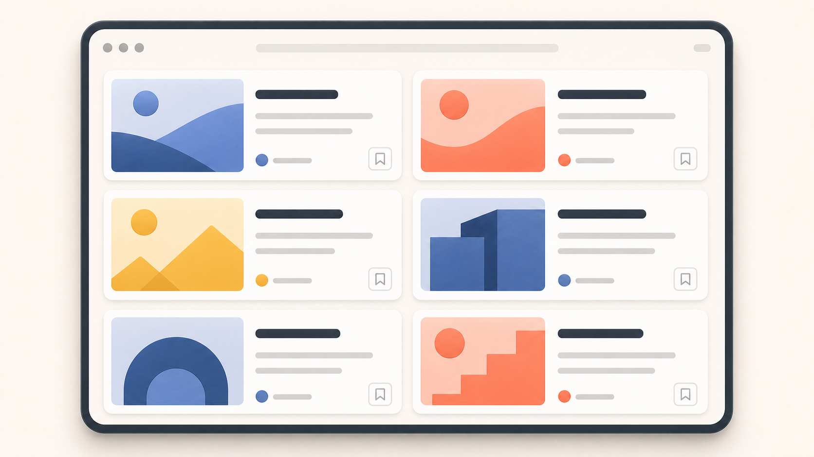
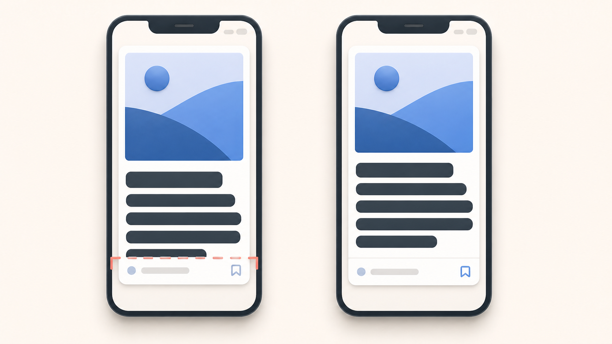
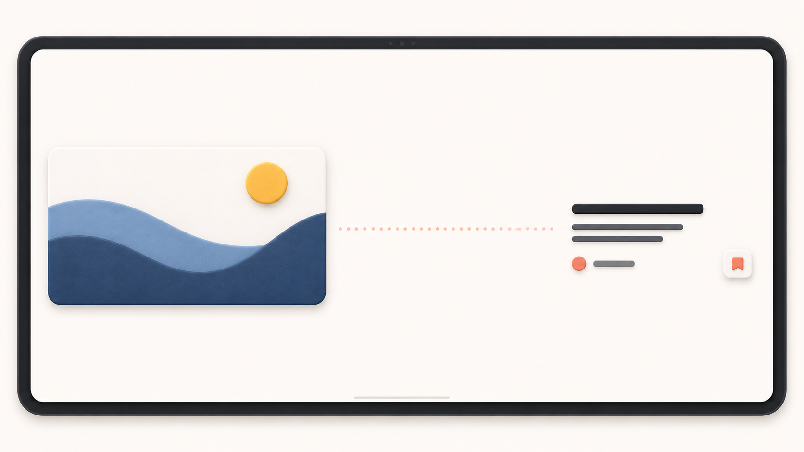

slidenumbers: true
background-color: #272729
theme: Fraunces, 4
text: #FFF, SF Pro
text-emphasis: SF Pro
text-strong: SF Pro
autoscale: true
header: #FFF, alignment(left), text-scale(0.5), SF Pro Text
header-emphasis: SF Pro Text
header-strong: SF Pro Text
slidenumber-style: SF Pro Text
footer-style: SF Pro Text
code: SF Mono

# 柔軟性のあるUIで、多くの環境でアプリを活躍させる
## iOSDC Japan 2026 / noppe

^ よろしくお願いします。今日は、柔軟性のあるUIで、多くの環境でアプリを活躍させるための設計についてお話しします。

---

# noppe

- iOSアプリの設計と実装
- Mastodonクライアントを個人開発
- iOSDC Speaker

^ まずは自己紹介をします。noppeといいます。普段はiOSアプリの設計と実装に関わり、個人ではMastodon向けのクライアントアプリなどを作っています。
<!-- TODO: TSもう少し増やす -->

---

# 表示する場所が変わると、UIの前提が変わる

- 画面の広さや向きが変わる
- ウインドウの中で使われる
- WidgetやWatchへ広がる

^ 今回のトークはひとつのUIを、iPhone、iPad、Macなど、さまざまな表示先でも柔軟に表示できるようにするということを考えていきます。
^ 特にiPadではウインドウを自由にリサイズでき、同じアプリの表示領域が狭くも広くもなります。また、WidgetやWatchへ機能を届けることもあります。
^ まだまだ多くのアプリはiPhoneでしか動く想定をしていないことが多く、想定されていない環境で使いにくい問題は広く起きているかと思います。

---


^ まず、iPhoneで自然に見えていたニュースアプリを、広いウインドウで開いてみます。
^ 壊れてはいません。文字も読めますし、ボタンも押せます。それでも、左右に余白が増え、画面全体が間延びして見えます。
^ ただ、「表示できる」と「その表示先で使いやすい」は同じではありません。
^ さて、すぐに具体的な対策をする前に、iPhone向けの画面で何を前提にしていたのかを確認します。
^ このように表示先が広がると、それまで考慮していなかった前提が見えてきます。

---

# 画面が広くなっても、一覧は一列のまま

- カードの横幅だけが広がる
- 一度に見える記事は増えない
- 一覧と詳細は別画面のまま

^ iPhoneでは、一列の一覧を画面いっぱいに表示しても自然でした。広いウインドウでは、その構成を保ったままカードの幅と余白だけが増えています。
^ 画面は広くなったのに、記事を比べやすくなったわけでも、一覧と詳細を行き来しやすくなったわけでもありません。
^ 「一覧は一列」という実装が、広い表示領域では使いにくさとして現れました。

---



^ これが、先ほどのアプリをiPadに最適化した例です。
^ カードの幅を保ちながら、二列に並べています。広い空間を活かして、同時に比較できる記事が増えました。

---

# 見た目が変わってもできることを変えない

| 変わらないもの | 表示条件に合わせて変えるもの |
|---|---|
| 記事の表示 | 一度に見せる情報 |
| 記事を探す・読む・保存する | レイアウト |
| 選択できること | 操作方法 |

^ この最適化では見た目が変わっても、できることは変えませんでした。
^ どの表示先でも記事を探し、読み、保存できるようにするべきです。
^ 一方で、それを使いやすく届けるために、一度に見せる情報、レイアウト、操作方法は表示条件に合わせます。
^ この区別をすることで、環境ごとに画面を作り直すのではなく、見せ方を選ぶだけで、同じ目的を達成できるようになります。
^ 今日は、この区別を意識して、表示する条件が変わったときに何を変えるのかを判断する方法を紹介します。

---

# 今日持ち帰る5つの流れ

1. どの部分が使いにくくなったか
2. ユースケースを再確認する
3. モデルと目的から見せ方を決める
4. レイアウトを調整するか、構成を変えるか
5. コンテナとプラットフォームの差を吸収する

^ コンテナやプラットフォームなどの環境が変わったときに、何を確認し、どこで実装するかを、この5つの流れに沿って見ていきます。
^ まずは、先ほどのように、環境を変えて、どの部分が使いにくくなったかを特定し、次にUIが何を表し、ユーザーが何をしたいかを確認します。
^ それを元にレイアウト調整か構成変更かを選び、コンテナとプラットフォームの差を吸収する場所まで決めると、分岐を広げずに実装できます。
^ 例えば、文字がカードからあふれているなら、すぐ二列にするのではなく高さや情報の優先順位を見直します。一覧と詳細の往復が負担なら、そこで初めて構成変更を検討します。
^ 具体例を交えながら、この5つの流れを順に見ていきましょう。

---

# 1. どの部分が使いにくくなったか

^ 一つ目の判断は、どの部分が使いにくくなったかです。表示する条件が変わったときは、UIのどこでユーザーが困るのかを先に特定します。
^ 「iPadなら二列にする」とか「Dynamic Typeなら文字を小さくする」などと解決策から入る前に、今のUIで困っていることを具体的にします。
^ いくつかの例を見てみましょう。

---

# Case 1 必要な情報が欠ける

- テキストの途中が切れる
- 内容を区別できない
- 必要な操作が押し出される



^ 一つ目の例は、必要な情報が欠けることです。ニュースアプリなら、記事を見分けるための見出しや媒体名が欠ける状態です。
^ この画像のようにDynamic Typeや言語の違いで文字量が増えると、固定した高さや行数の前提が崩れます。
^ 左では、文字が増えたことで固定したカードの下端が切れ、媒体名と保存操作が見えません。右では、カードの高さを内容に合わせて伸ばし、記事の識別と保存に必要な情報を残しています。
^ ここで起きているのは、必要な情報が欠けてしまい、ユーザーが記事を識別しにくくなることです。

---

# Case 2 広い空間を活かせない

- 要素だけが横に伸びる
- 同時に見える情報は増えない
- 一覧の読みやすさは変わらない

^ 二つ目は、広い空間を活かせないことです。ニュースアプリなら、一覧で比較できる記事が増えない状態です。iPadや横に広いウインドウでは、内容が入りきらないのとは反対に、利用できる空間に対して情報が少ないことがあります。
^ カード一枚を横に伸ばしても、同時に比較できる記事は増えません。余白の問題は、スクロールや縮小では解決できません。
^ ここで起きているのは、空間が増えても、同時に比較できる記事が増えないことです。

---

# Case 3 関連する情報が離れて見える

- 主な情報と補助情報が離れる
- 対応関係が分かりにくい
- 一つのまとまりとして認識しにくい

^ 三つ目は、関連する情報が離れて見えることです。ニュースアプリなら、同じ記事の画像、見出し、媒体名がまとまって見えない状態です。横向きでは、画面の面積だけでなく比率が大きく変わります。
^ 縦向きの配置をそのまま横へ引き伸ばすと、画像だけが大きくなったり、タイトルと補助情報が離れたりします。画面全体を均等に広げるのではなく、コンテンツ同士の距離を見直します。
^ 同じ面積でも縦横比が変われば、要素同士の関係は崩れます。
^ ここで起きているのは、同じ記事に属する情報が一つのまとまりとして見えなくなることです。

---



^ 大きな画像を左へ置いただけでは、見出し、媒体名、保存操作が右へ離れます。ひとつの記事に属する情報を、目で往復しなくてもまとまりとして認識できる距離に保つ必要があります。

---

# Case 4 一覧と詳細を何度も往復する

- 記事を開くたびに一覧から離れる
- 次の記事を探すには戻る
- 比較が続かない

^ 四つ目は、一覧と詳細を何度も往復することです。記事を読みながら次の記事を選びたいのに、毎回一覧へ戻る必要がある状態です。
^ ここではカード内部の配置ではなく、一覧と詳細が別の画面に分かれていることが負担になっています。

---

# 使いにくさに合わせて、変える範囲を決める

| 起きていること | 主な選択肢 |
|---|---|
| 必要な情報が欠ける | セルフサイジング、情報の優先順位 |
| 広い空間を活かせない | 最大幅、複数カラム |
| 関連する情報が離れて見える | 間隔、内部配置 |
| 一覧と詳細を何度も往復する | UIの構成変更 |

^ ここまでの四つの問題は、どれも「表示条件に合わせる」だけでは同じ対応になりません。
^ 必要な情報が欠けているなら、内容に合わせてサイズや情報量を調整します。空間を活かせないなら、読みやすい幅を保ちながら同時に扱う情報を増やします。情報の関係が崩れているなら、間隔やコンポーネント内部の配置を見直します。画面の往復が負担なら、画面の構成まで見直します。
^ ただし、何を変えてもよいかは、ユーザーがそのUIで何をしたいかによって決まります。次に、どの表示先でも守るユースケースを確認します。

---

# 2. ユースケースを再確認する

^ 二つ目は、このUIでユーザーは何をしたいかを再確認します。その目的から、見せ方を変えても保ちたいものを決めます。
^ ここでも、モデルやコンポーネントの設計にはまだ進みません。まず、表示先が変わってもユーザーが達成したいことを言葉にします。
^ 具体的な例を見てみましょう。

---

# ニュースアプリでユーザーがしたいこと

- 記事を見つける
- 読むべき記事か判断する
- 記事を読む
- あとで読むために保存する
^ たとえば、ニュースアプリでは、記事を見つけ、読むか判断し、読み、あとで読むために保存します。
^ ここで確認したいのは、カードや画面の形ではなく、ニュースを使って何を達成するかです。
^ 画面サイズや表示される場所が変わっても、この目的を達成できることを共通の基準にします。

---

# どの表示先でも共通するものを先に決める

| どの表示先でも共通 | 表示条件に合わせて変える |
|---|---|
| 記事を探せること | カード、リスト、詳細ペイン |
| 記事を読めること | 1列、グリッド、複数カラム |
| 記事を保存できること | タップ、ポインタ、キーボード |

^ ニュースアプリで共通するのは、記事を探し、読み、保存できることです。
^ カードかリストか、何列にするか、タップとポインタのどちらで操作するかは、コンテナやプラットフォームに合わせて変えられます。
^ 「記事の詳細を開く」がユースケースで、タップ、クリック、キーボードは、そのための操作方法です。この二つを分けておけば、入力方法が変わっても、記事を開けることを共通の確認項目にできます。

---

# 3. モデルと目的から見せ方を決める

^ 三つ目では、第2章で確認したユースケースを、モデルと表現の判断へつなげます。
^ 構成が変わっても責務を保てる単位へ、画面を分けるところから始めます。

---

# 3.1 UIを組み替えられる単位に分ける

^ 一覧を別の構成にも組み替えられるように、画面を目的と責務を持つ部品に分けます。
^ 記事そのものはArticleというモデル、記事を表示して開く部品はArticleViewとして区別します。
^ どこまでを一つの部品として扱うかを決めることで、コンテナに合わせて組み替えられるようになります。

---

# 画面は責務を持つ部品でできている

```text
ニュース一覧
├─ ArticleView(article: Article)
├─ ArticleView(article: Article)
├─ ArticleView(article: Article)
└─ Filter
```

^ コンテナに合わせて見せ方を変えるには、画面を組み替えられる単位として捉えます。
^ 一覧全体を一つのViewにすると、幅が変わるたびに画面全体を作り直すことになります。
^ ArticleViewとFilterを責務で分ければ、同じArticleを一列、グリッド、詳細の関連項目に組み替えられます。
^ 分割の目的は行数を減らすことではなく、構成が変わっても責務を保つことです。

---

# UIを3つの粒度で見る

```text
画面フロー：一覧 → 詳細 → 保存
    画面：ニュース一覧、記事詳細
コンポーネント：ArticleView、保存ボタン
```

^ UIは、画面フロー、画面、コンポーネントの3つの粒度で見ます。
^ 画面フローは、ユーザーがやりたいことを終えるまでの移動です。画面は、その時点で扱う情報と操作のまとまりです。コンポーネントは、異なる画面や構成でも同じ責務で使える単位です。
^ 例えば、記事カードの画像と見出しが窮屈なら、コンポーネント内部を横並びから縦並びへ変えます。一方、記事を比べるたびに一覧と詳細を往復しているなら、画面の組み合わせを変えます。この粒度を分けると、変更する範囲を選べます。

---

# 境界は矩形ではなく責務で決める

- 何を表すのか
- ユーザーは何をしたいのか
- 別の画面でも同じ責務で使えるか

^ コンポーネントの境界は、デザイン上の矩形だけで決めません。
^ 何を表し、ユーザーがそこで何をしたいのか、別の画面でも同じ責務で使えるか。この三つから境界を決めます。
^ 例えばArticleViewは、Articleを表示し、読むか判断し、詳細へ進むための部品です。この責務が決まると、カード以外の表現も選べます。
^ 例えば画像・見出し・媒体名を別々のViewとして公開すると、呼び出し側が毎回その組み合わせを決めることになります。すると、一覧と詳細でArticleの見せ方がばらばらになります。
^ 再利用したいのは部品の数ではなく、Articleを識別して開くという責務です。一番小さなViewまで分けるのではなく、ArticleViewとして扱いたいまとまりを一つの境界にします。

---

# AIでモデルとコンポーネントの候補を洗い出す

- 画面に繰り返し現れる対象
- ひとまとまりの操作
- レイアウトとは独立した情報

^ すでに画面がある場合、ArticleのようなモデルやArticleViewのようなコンポーネントの候補を見つける段階でAIを補助に使えます。
^ 画面から、繰り返し現れる対象や、ひとまとまりの操作を見つけるのは難しいものです。
^ AIに画面を見せて、繰り返し現れる対象や操作のまとまりを候補として出してもらうと、分析を始めやすくなります。
^ AIが担うのは、分析の出発点になる候補の洗い出しです。最終的なモデルとユースケース、その区切りがプロダクトに合うかはチームで判断します。

---

# 3.2 モデルから見せる情報を決める

^ ArticleViewのように責務のある部品を決めたら、次は、その中心となるArticleをモデルとして定義します。
^ ここからは、モデルを基準に、コンテナとプラットフォームに応じてどの情報を見せるかを決めます。

---

# モデルの例：Article

```swift
struct ArticleSource {
    let name: String
}

struct Article: Identifiable {
    let id: UUID
    let headline: String
    let summary: String
    let image: URL?
    let source: ArticleSource
    let publishedAt: Date
    let content: AttributedString
}
```

^ モデルには、見た目の座標ではなく、扱う対象として必要な情報を持たせます。
^ ここではニュース記事をArticleとして、見出し、要約、画像、媒体、公開日時、本文を持たせています。
^ `imageWidth`や`titleLines`は、記事そのものの情報ではありません。画像の幅やタイトルの行数は、置かれた場所に合わせてView側が決める情報です。
^ モデルを共有することで、カード、詳細画面、Widgetが同じ対象を、それぞれに合う形で表示できます。
^ 必要なプロパティはプロダクトによって変わります。著者が重要なサービスもあれば、地域や緊急度が重要なサービスもあります。モデルは画面の都合ではなく、プロダクトが扱う対象に合わせて決めます。

---

# モデルの情報をユースケースに結びつける

```text
ユーザーは…
何の記事か識別できる
読むべき記事か判断できる
記事を開ける
あとで読むために保存できる
```

^ プロパティを並べただけでは、狭い場所で何を残すかは決まりません。
^ そこで、モデルのユースケースを言葉にします。Articleの例では、似た見出しの記事が並ぶと、媒体名や公開時刻がないと記事を識別できません。「識別する」「読むか判断する」「開く」「保存する」と分けると、情報を省いた影響を話し合えます。
^ ユースケースを先に決めると、どの情報を見せ、どの操作を近くに置くかを判断できます。デザイナーとエンジニアが同じ言葉で優先順位を話し合うためにも使えます。

---

# モデルの情報に優先順位をつける

| 目的 | 情報の候補 |
|---|---|
| 記事を識別する | 見出し、画像、媒体名 |
| 読むか判断する | 要約、カテゴリ、公開時刻 |
| 記事を開く | 開く操作、画面遷移 |
| 保存する | 保存ボタン、保存済みの表示 |

^ 情報を省く順番は、ユーザーの目的から決めます。狭い場所では、すべての情報を見せられません。
^ 見出しだけで記事を見分けられないなら、媒体名や公開時刻を残します。画像が装飾に近いなら、先に省略できます。
^ 要約を消しても判断できるか、保存操作を別の場所へ移しても状態が分かるかを確認します。
^ この優先順位が決まると、次に同じモデルから、コンテナとプラットフォームに合う複数の見せ方を用意できます。

---

# 4. レイアウトを調整するか、構成を変えるか

^ ここまでで、使いにくさとユースケースを確かめ、Articleが何を表し、どの情報を残すかを決めました。
^ 次は、その判断をコンテナとプラットフォームへ重ね、同じ構成で調整するか、構成まで変えるかを選びます。

---

# 見せ方を決める3つの文脈

| モデルとユースケース | コンテナ | プラットフォーム |
|---|---|---|
| 何を表し、何をしたいか | 実際に使える表示領域 | 入力方法と慣習 |
| Articleを識別して選ぶ | ウインドウ、サイドバー | iPhone、iPad、Mac、Widget |

^ 見せ方は、モデルとユースケース、コンテナ、プラットフォームの三つを分けて考えます。
^ モデルとユースケースは、何を表し、ユーザーに何をしてほしいかです。コンテナは、UIが実際に使える幅や高さです。プラットフォームは、入力方法や操作の慣習が異なる表示先です。
^ 例えばiPadのウインドウ全体と、その中の狭いサイドバーは、同じプラットフォームでもコンテナが異なります。Widgetは、表示する場所とユースケースも変わります。
^ そのうえで、同じ構成のままレイアウトを調整するのか、画面の構成まで変えるのかを選びます。

---

# 同じモデルに複数の見せ方を用意する

| Compact | Regular | Wide |
|---|---|---|
| 見出し | 画像 | 大きな画像 |
| 媒体名 | 見出し | 見出し |
|  | 媒体名 | 要約・操作 |

^ モデルは共通のまま、情報量の異なる見せ方を用意します。ここではArticleを例にします。
^ Compactでは見出しと媒体名、Regularでは画像、見出し、媒体名、Wideでは大きな画像に要約や操作まで見せています。
^ Compact、Regular、Wideという名前よりも、どの候補でも記事を見分け、詳細へ進めることの方が重要です。
^ 見せ方ごとに情報の優先順位を明示しておくと、狭い場所で偶然消えたのか、意図して省略したのかを区別できます。
^ この名前をSize Classと一対一に結びつける必要もありません。見せ方はデバイス全体ではなく、実際に置かれたコンテナから選びます。

---

# デザインデータは特定の条件での完成例

- 特定のコンテンツ
- 特定のコンテナ
- 特定のプラットフォーム

^ CompactやWideなどの表示バリエーションは、元のデザインを単純に伸縮して作るものではありません。デザインデータは、特定のコンテンツ、コンテナ、プラットフォームに対する完成例です。すべての表示先で同じ座標を使うための仕様書ではありません。
^ 別のコンテナへ展開するときは、座標を拡大しません。
^ 何を目立たせ、どの情報を近くに置いたのかを読み取ります。
^ その判断を情報の優先順位として取り出せれば、見た目が変わってもデザインの意図を引き継げます。
^ 例えば、見出しと画像が近い理由まで読み取れば、別の配置でも二つを同じ記事として見せられます。

---

# 見せ方の変更には2つの範囲がある

| 同じ構成のまま調整 | 画面の構成を変更 |
|---|---|
| 余白、幅、折り返し | タブバー、サイドバー |
| グリッドの列数 | 一覧と詳細の同時表示 |
| コンポーネント内部の配置 | 補助領域の常設 |

^ 変更の範囲は、大きく二つあります。例えば、記事カードを縦並びから横並びへ変えるのは、同じ構成の中での調整です。一覧と詳細を同時に見せるのは、画面の組み合わせを変える構成変更です。
^ まず、同じ構成のまま幅に合わせる方法から見ていきます。

---

# 4.1 同じ構成のまま幅に合わせる

^ まずは、同じ構成のまま幅に合わせます。連続的な適応では、ウインドウを少しずつリサイズしても、急に別の画面へ飛んだように感じさせません。
^ 余白、幅、列数、コンポーネント内部の配置を調整します。
^ iPhoneの幅とiPadの幅だけを確認するのでは足りません。
^ その間でウインドウを動かしても、コンテンツを読んで操作できるようにします。

---


^ 導入で見た広い一覧を、同じ構成のまま調整する例としてもう一度見ます。
^ 構成を変える前に、コンテンツの読み方に合う幅を保つのか、空間を使って同時に見せる情報を増やすのかを考えます。
^ iPadだから二列という決め方ではなく、このニュース一覧で比較できる記事が増えることに価値があるかを基準にします。
^ 例えば、記事詳細の本文なら行が長くなりすぎないよう最大幅を置く方が自然です。一覧なら、もう一件を同時に見せることで比較しやすくなります。同じアプリの中でも、コンポーネントの責務によって広い空間の使い方は変わります。

---

# 余白とあふれを混同しない

| 余白が増えた | 内容があふれた |
|---|---|
| 最大幅 | セルフサイジング |
| グリッド | スクロール |
| 補助領域 | 情報の優先順位 |

^ この画面のように余白が増えた問題と、文字や記事が増えて内容があふれた問題は、反対の状態です。使う技法を選ぶ前に、どちらが起きているかを分けます。
^ 余白には最大幅やグリッドを使い、あふれにはセルフサイジングやスクロールを使います。
^ 余白があるのにスクロールを増やしても、空間は活かせません。逆に、内容があふれているのに列数だけを増やすと、さらに読みにくくなることがあります。
^ スクロールも、内容を一画面へ押し込まないための重要な選択肢です。
^ 寸法を調整しても、目的の異なる内容を同じ移動にまとめると扱いにくくなることがあります。
^ 本文のように一つの流れとして読むものと、一覧や設定のように目的が違うものを、同じスクロールへ無理に入れないようにします。

---


^ 広い空間の使い方は、少なくとも二つあります。
^ 長い本文を読むなら、最大幅を設けて読みやすさを保ち、余白を残す方法があります。一覧から記事を探すなら、カードの幅を保って列数を増やし、比較できる情報を増やす方法があります。
^ 余白をすべて埋める必要はありません。ユーザーの作業に合う方を選びます。
^ 余った空間に関連情報を置く補助領域を設ける方法もあります。ただし、空いているから何かを置くのではありません。本文を読みながら参照する価値があるのか、必要なときだけ開く方が集中できるのかを判断します。

---


^ ニュース一覧では、カードを引き伸ばす代わりに列数を変えます。
^ 狭いときは一列、幅が増えると複数列になります。カード一枚の読みやすさを保ちながら、画面全体の情報密度を上げられます。
^ 列数が変わる境目は端末名ではなく、カードを無理なく読める最小幅から決まります。

---

# 列数はカードを読める最小幅から決める

```swift
let card = GridItem(
    .adaptive(minimum: 280, maximum: 420)
)

LazyVGrid(columns: [card]) {
    ForEach(articles) { ArticleCard(article: $0) }
}
```

^ 列数は、カードを読める最小幅から決めます。`adaptive`なGridItemを使うと、利用可能な幅の中で、指定した最小幅を守れる列数を選べます。
^ 大切なのは、280という数字を先に置かないことです。
^ 見出し、画像、要約を無理なく読め、操作もしやすい幅から決めます。
^ プロダクトの内容や文字サイズが変われば、この制約も見直します。
^ 最大幅は、列数が増える直前に一枚だけが極端に広くなることを防ぎます。数字を決めるときは、間隔や余白も含めて読みやすさを確認します。

---

# 最小幅は内容とコンテナで変わる

- 文字サイズ
- ローカライズ後の文字量
- 表示する情報
- 操作に必要な領域

^ カードの最小幅は、どのコンテナでも同じ数字とは限りません。
^ Dynamic Typeで文字が大きくなれば、同じ情報を見せるために必要な幅や高さも変わります。ローカライズや操作の数によっても変わります。
^ 「iPadなら三列」とは決めません。
^ そのときの内容を無理なく読める幅を基準にすれば、想定していなかったウインドウサイズにも対応できます。
^ 特に大きな文字では、列数を保つより一列へ戻した方が読みやすいことがあります。列数が減っても、記事を見分けて選べるなら問題ありません。制約はレイアウトを縛るためではなく、読みやすさと操作しやすさを守るために置きます。

---


^ 幅に合わせるのは、画面全体だけではありません。
^ 同じ記事カードでも、広いときは画像とテキストを横に並べ、狭いときは縦に並べられます。
^ どちらの配置でも記事を見分けて選べるようにしながら、コンポーネント内部の並び方だけを切り替えます。
^ 画面全体に「横幅が何ポイントなら横並び」という分岐を書くと、そのカードを狭いサイドバーへ移したときに使えません。カード自身が、親から渡された幅に収まる配置を選べるようにします。

---

# 収まる配置を優先順に選ぶ

```swift
ViewThatFits(in: .horizontal) {
    HStack {
        ArticleThumbnail(article: article)
        ArticleSummary(article: article)
    }

    VStack(alignment: .leading) {
        ArticleThumbnail(article: article)
        ArticleSummary(article: article)
    }
}
```

^ 収まる配置を、望ましい順に選びます。`ViewThatFits`は、指定した軸で理想サイズが収まる最初の子Viewを選びます。
^ この例では横配置を優先し、収まらなければ縦配置へフォールバックします。文字を極端に小さくする代わりに、同じ情報を読める配置へ置き換えます。
^ 候補は、望ましい順に並べます。
^ `in: .horizontal`としているので、横方向に収まるかだけを比べます。高さは親の通常のレイアウトへ任せます。両方の軸を同時に制約すると意図しない候補が選ばれることもあるため、何を基準に切り替えるのかを明示します。
^ [Sources]
^ - https://developer.apple.com/documentation/swiftui/viewthatfits

---

# ViewThatFitsが決めるのは収まるかどうか

- どの情報を残すかは決めない
- どの配置を優先するかは設計者が決める
- 各候補の理想サイズを確認する

^ `ViewThatFits`が判断できるのは、候補が収まるかどうかだけです。どの情報を残し、どの候補を優先するかは、Articleとユースケースをもとに設計します。
^ 柔軟に縮められる子Viewは、常に収まると判断されることがあります。そのため、各候補の理想サイズが意図どおりかを確認します。
^ APIにはサイズの判定を任せ、情報の優先順位は自分たちで決めます。
^ 子Viewが柔軟に縮みすぎると、最初の候補が狭い場所でも選ばれ続けます。連続リサイズして、候補が切り替わる地点を確認します。
^ [Sources]
^ - https://developer.apple.com/documentation/swiftui/viewthatfits

---

# 操作の流れが変わらなければレイアウト調整で足りる

```text
レイアウト調整で解決できる
= 画面が担う作業と操作の流れを保てる
```

^ 余白、折り返し、列数、コンポーネント内部の配置を変えても、画面が担う作業と操作の流れは変わりません。
^ この調整だけで使いやすくできるなら、別の構成を増やす必要はありません。
^ 一方、一覧から詳細へ何度も往復するなど、画面の組み合わせそのものが使いにくくなったら、レイアウト調整では足りません。

---

# 4.2 レイアウト調整で足りなければ構成を変える

^ レイアウト調整で足りなければ、構成を変えます。余白や列数を調整しても使いにくさが残るなら、画面の組み合わせを変えます。
^ タブバーをサイドバーへ変える、一覧と詳細を同時に見せる、補助情報用の領域を置く。こうした変更では、要素の大きさではなく、画面の組み合わせを変えます。
^ コンポーネントの中で収まる配置を選ぶだけではなく、複数のコンポーネントを組み合わせ直し、一覧と詳細の並べ方やナビゲーションを変えます。

---

# サイズを調整しても操作の往復は減らない

```text
一覧 → 詳細 → 戻る → 一覧 → 詳細
```

^ 広い画面で一覧の幅を広げても、記事を比較するたびに一覧と詳細を往復する流れは変わりません。
^ この場合、問題はカードのサイズではなく、一覧と詳細が別の画面に分かれている構成です。
^ 利用できる空間が増えて二つを同時に扱えるなら、一覧と詳細を並べた方が使いやすくなります。
^ 選択した記事を読みながら次の記事へ移りたい場合、一覧が見え続けることに価値があります。一方で、一件の記事へ集中して読むことが中心なら、詳細を大きく保ち、一覧を隠せる構成が自然です。広さだけでなく、作業の往復から判断します。

---


^ 狭いウインドウでは、タブバーで主要な行き先を切り替え、ひとつの内容に集中します。
^ 広いウインドウでは、サイドバー、一覧、詳細を同時に見せ、選択肢と現在の内容の関係を保てます。
^ 見た目は大きく変わっていますが、どちらでもニュースを選び、記事を読めます。
^ 広い側が上位版で、狭い側が簡易版というわけではありません。狭い側は一つの記事に集中しやすく、広い側は比較や参照を続けやすい。どちらも、その幅でニュースを選んで読むための構成です。

---

# レイアウト調整と構成変更の違い

| レイアウト調整 | 構成変更 |
|---|---|
| 画面が担う作業は変えない | 画面の組み合わせを変える |
| 幅に沿って少しずつ変わる | 境目で切り替える |
| 列数、余白、内部配置 | ナビゲーション、ペイン |

^ レイアウト調整では、画面が担う作業を変えずに、幅に合わせて列数や余白を変えます。構成変更では、一覧と詳細のような画面の組み合わせを変えます。
^ ウインドウの幅は連続的に変わりますが、構成は、一覧と詳細を並べた方が使いやすくなる幅など、作業の仕方が変わる境目で切り替えます。
^ 境目の近くで何度も構成が行き来すると、選択やスクロール位置が不安定に見えます。切り替えたあとも現在のArticleや操作の状態を保ち、必要ならアニメーションで関係をつなぎます。構成が変わっても、ユーザーの文脈は切らないようにします。

---

# 構成を変える条件

- 一覧と詳細を同時に見たい
- 画面の往復が作業を妨げている
- 主要な行き先が増えた
- 補助情報を見ながら作業したい

^ 「iPadだから」という理由だけでは、構成を変える幅は決まりません。
^ 一覧と詳細を同時に見たい、往復が作業を妨げている、主要な行き先が増えた、補助情報を見ながら作業したい。このような操作がしやすくなる境目を探します。
^ 同じiPadでも、狭いウインドウならiPhoneに近い構成が自然な場合があります。実際に利用できる領域で、どちらの構成が使いやすいかを見ます。
^ Size Classは手がかりの一つですが、同じSize Classでもコンテナの幅や内容は変わります。独自の構成が必要なら、使いにくくなる幅を測ります。
^ [Sources]
^ - https://developer.apple.com/design/human-interface-guidelines/layout
^ - https://developer.apple.com/design/human-interface-guidelines/windows

---

# TabViewで主要な行き先を示す

```swift
TabView {
    Tab("Top", systemImage: "house") {
        TopStories()
    }
    Tab("Saved", systemImage: "bookmark") {
        SavedStories()
    }
}
.tabViewStyle(.sidebarAdaptable)
```

^ TabViewで、TopやSavedといった主要な行き先を示します。SwiftUIの`sidebarAdaptable`を使うと、同じTabViewを、プラットフォームに合うタブバーやサイドバーとして表示できます。
^ 呼び出し側が「iPhoneなら下、Macなら左」と位置を指定する代わりに、これがトップレベルのナビゲーションであることを伝えます。
^ 主要な行き先をTabViewとして宣言しておけば、プラットフォームごとの慣習や将来の変化をシステム側で反映できます。
^ iPhoneでは下部のタブバー、Macではサイドバーとして現れ、iPadではタブバーとサイドバーを切り替えられます。二つのナビゲーションを別々に実装して同期するより、選択状態とアクセシビリティを一か所で扱いやすくなります。
^ [Sources]
^ - https://developer.apple.com/documentation/swiftui/tabviewstyle/sidebaradaptable

---

# 一覧と詳細の関係を表す

```swift
NavigationSplitView {
    ArticleList(selection: $selection)
} detail: {
    ArticleDetail(article: selection)
}
```

^ `NavigationSplitView`は、一覧で選んだ項目を詳細へ表示する関係を表します。
^ 幅に余裕のあるコンテナでは複数列になり、狭いSize Classでは単一のスタックへ折りたたまれます。呼び出し側は列の座標ではなく、一覧で選んだ項目を詳細に表示することを宣言します。
^ 必要なら、コンパクト時にどの列を優先するかも指定できます。
^ 自動的に折りたたまれても、決めることは残ります。
^ 選択がないときに何を見せるかを決めます。コンパクトになったときは、一覧と詳細のどちらを前面にするかを決めます。
^ 広い表示へ戻ったときに、選択を保てるかも確認します。APIの構造と、アプリが持つ選択状態を揃えます。
^ [Sources]
^ - https://developer.apple.com/documentation/swiftui/navigationsplitview

---

# 関係を表すAPIならプラットフォームに合わせて表示できる

- `TabView`：主要な行き先
- `NavigationSplitView`：選択と詳細
- `Inspector`：現在の内容を補う情報

^ 表示している三つのAPIは、それぞれ異なるUIの関係を表します。
^ TabViewは主要な行き先を表します。
^ NavigationSplitViewは一覧と詳細の関係を表します。Inspectorは現在の内容を補う情報を表します。
^ UIの関係をAPIへ伝えると、右か下か、何列かといった表示方法の一部をシステムへ任せられます。
^ 例えばTopとSavedは主要な行き先なのでTabViewにし、選んだ記事と本文はNavigationSplitViewで関係づけます。記事の媒体や公開日時は、本文を補うInspectorにできます。アプリが関係を決め、プラットフォームごとの表現をシステムへ任せます。

---

# 5. コンテナとプラットフォームの差を吸収する

^ 最後の判断は、コンテナとプラットフォームの差をどこで吸収するかです。呼び出し側はArticleとユースケースを渡し、コンテナに合う見せ方はコンポーネント側で選びます。
^ ウインドウ内のレイアウトや構成だけでなく、WidgetやWatchのようにプラットフォームが変わる場合も考えます。

---


^ 表示される場所そのものが変わると、同じArticleから選ぶ情報も変わります。
^ 広いウインドウでは一覧、記事、媒体を同時に扱えます。iPhoneでは一覧から詳細を読む流れに集中します。Widgetでは、今見る価値のある一件へ絞れます。
^ ここまでは同じウインドウ内で、記事を探して読むという中心となるユースケースを保ちながら、レイアウトと構成を変えました。表示場所まで変わる場合は、その場所でユーザーが何をしたいかも改めて考えます。
^ Articleモデルは共通です。
^ その場所のユースケースが、どの記事を選ぶかを決めます。
^ 見せる情報と提供する操作も、同じユースケースから決めます。

---

# 小さいほど情報を減らすとは限らない

| 表示される場所 | 優先するユースケース |
|---|---|
| ニュース一覧 | 比較して選ぶ |
| 記事詳細 | 集中して読む |
| Widget | いま見る一件に気づく |
| Watchアプリ | 短時間で確認する |

^ 小さいほど情報を減らすとは限りません。ニュース一覧では比較して選び、記事詳細では集中して読み、Widgetでは今見る一件に気づき、Watchアプリでは短時間で確認します。
^ 画面が小さくても、元の画面から順に情報を削ればよいとは限りません。
^ Widgetでは記事一覧の縮小版ではなく、いま見る一件へ気づくことが中心になるかもしれません。Watchアプリでは、短時間で確認する目的へ絞れます。
^ 同じArticleを使っていても、ユースケースが違えば、優先する情報も操作も変わります。
^ 逆に、小さくても詳細な数値が必要な場所はあります。大きくても、集中のために情報を絞る画面があります。「小さいほど情報を減らす」と決めず、その場所で必要な判断ができる情報を選びます。
^ [Sources]
^ - https://developer.apple.com/design/human-interface-guidelines/widgets

---

# 実装を4つの層に分ける

```text
モデル
  ↓
表示バリエーション
  ↓
レイアウトと構成の選択
  ↓
プラットフォームの表現
```

^ 表示先ごとに選ぶArticle、情報、操作を、呼び出し側へ散らさないようにします。
^ 実装は、モデル、表示バリエーション、選択、プラットフォームの表現という4層に分けます。
^ 例えば一つのArticleから、見出し中心のCompactと、画像や要約も見せるWideを用意します。狭いサイドバーではCompactを選び、Macではその表現へポインタ操作を加えます。
^ この境界があれば、情報、見せ方、選択条件のどこを見直すべきかを切り分けられます。

---

# 見せ方が変わってもArticleは共通

```swift
struct CompactArticleView: View {
    let article: Article
}

struct RegularArticleView: View {
    let article: Article
}

struct WideArticleView: View {
    let article: Article
}
```

^ 見せ方ごとにViewを分けても、受け取るArticleは共通です。
^ Compact、Regular、Wideは、別の種類の記事を表すViewではありません。同じArticleを、異なる情報量と配置で見せる候補です。
^ それぞれを小さく検証でき、コンテナやプラットフォームの判定を各Viewへ散らさずに済みます。
^ それぞれのViewで同じレイアウトを使う必要もありません。Compactはテキスト中心、Wideは画像中心でも構いません。ただし、どちらでも記事を見分けて選べるようにします。共通にするのはコードの形ではなく、Articleとユースケースです。

---

# 呼び出し側はArticleと用途だけを渡す

```swift
ArticleView(
    article: article,
    purpose: .browsing,
    prominence: .featured
)
```

^ 呼び出し側はArticleと、必要なら強調度や利用目的を渡します。
^ `featured`は画像を何ポイントにするかではなく、この記事を周囲より目立たせたいことを伝えます。`browsing`は、記事を比較して選ぶ場面であることを伝えます。
^ `prominence`には、プロダクト内で本当に使い分ける用途だけを定義します。使う場所がない値を、将来のために増やす必要はありません。
^ 用途らしい名前でも、内部レイアウトを操作するためだけに値を増やせば、見た目を指定するAPIへ戻ります。プロダクトに実在する用途だけを公開します。

---

# 見た目を渡すAPIは表示条件を固定する

```swift
ArticleView(
    imageWidth: 120,
    imageHeight: 80,
    titleLines: 2,
    spacing: 12,
    isHorizontal: true
)
```

^ 反対に、画像サイズ、行数、余白、横並びかどうかを呼び出し側から渡すAPIは、今の見た目を固定します。
^ 別のコンテナやプラットフォームへ移ると、呼び出し側が新しい正解を知る必要があり、同じ条件分岐が画面ごとに増えていきます。
^ ピクセル値が必要なこと自体は問題ではありません。その値を、ArticleViewを使うすべての画面へ公開する必要があるかを考えます。
^ 余白や画像サイズは、表示バリエーションの内部では必要です。デザイントークンとして管理することもあります。問題は、その詳細をArticleを使うすべての画面が知り、コンテナやプラットフォームが変わるたびに指定し直すことです。見た目の詳細は、ArticleViewの中で扱います。

---

# ArticleViewが見せ方を選ぶ

```swift
enum ArticlePurpose: Equatable {
    case browsing, related
}

enum ArticleProminence: Equatable {
    case standard, featured
}

struct ArticleView: View {
    let article: Article
    let purpose: ArticlePurpose
    let prominence: ArticleProminence

    var body: some View {
        switch (purpose, prominence) {
        case (.browsing, .featured):
            ViewThatFits(in: .horizontal) {
                WideArticleView(article: article)
                RegularArticleView(article: article)
                CompactArticleView(article: article)
            }
        default:
            ViewThatFits(in: .horizontal) {
                RegularArticleView(article: article)
                CompactArticleView(article: article)
            }
        }
    }
}
```

^ 見せ方を選ぶ処理は、ArticleViewの中へ集めます。
^ 呼び出し側はArticleとユースケース、必要なら強調度を渡します。ArticleViewは、その意味に合う候補から、与えられた領域に収まるものを選びます。
^ 実際には、各候補の理想サイズや情報量を設計し、`ViewThatFits`が適切か、明示的なレイアウト値が必要かを選びます。重要なのは、同じ選択処理を呼び出し側へ散らさないことです。
^ WideArticleViewが柔軟に縮むと、最初の候補が常に選ばれる可能性があります。候補ごとの制約を明確にし、必要ならLayoutプロトコルやコンテナ値を使って選択します。抽象化より先に、実際のレイアウト挙動を確認します。

---

# Inspectorも表示位置ではなく補助情報として示す

```swift
ArticleDetail(article: article)
    .inspector(isPresented: $showInspector) {
        ArticleMetadata(article: article)
    }
```

^ Inspectorでは、現在の記事を補う情報であることを呼び出し側から伝えます。
^ 水平方向にRegularなサイズクラスでは末尾の列として表示され、CompactなサイズクラスではSheetへ適応できます。呼び出し側が右側か下側かを選ぶ必要はありません。
^ 現在の記事を補う情報だという意味をAPIへ渡すと、表示位置をプラットフォームへ任せられます。
^ 先ほど構成変更の例として挙げた補助情報用の領域を、ここではInspectorというAPIで表します。プラットフォームごとの差を呼び出し側へ漏らさない設計です。
^ Modifierを付ける階層によって、InspectorがNavigationの内側か画面全体の末尾列かは変わります。現在のArticleを補うなら、詳細Viewとの関係を確認します。
^ [Sources]
^ - https://developer.apple.com/documentation/swiftui/view/inspector(isPresented:content:)

---

# 抽象化するものを選ぶ

| 抽象化する | 無理に共通化しない |
|---|---|
| モデル | 責務の違うコンポーネント |
| ユースケース | 各プラットフォームに固有の操作 |
| 情報の優先順位 | 偶然同じピクセル値 |
| 見せ方を選ぶルール | すべての見た目 |

^ 柔軟性のために、すべてを一つへ統合する必要はありません。
^ 共通化するのは、モデル、ユースケース、情報の優先順位、見せ方を選ぶルールです。
^ 責務の違うコンポーネントや、そのプラットフォームに固有の操作まで、無理に同じViewへ押し込むと条件分岐が増えます。
^ 偶然同じになったピクセル値や、すべての見た目も共通化する必要はありません。変わらないものだけを共有します。
^ すべてのプラットフォームで同じ外観にする必要もありません。ポインタで使いやすいホバー表示や、Watchで短時間に終えられる操作は、そのプラットフォームに固有で構いません。Articleとユースケースは共有しながら、操作方法や細かな見せ方は各プラットフォームに合わせます。

---

# 点ではなく変化の途中を確認する

- 最小幅から最大幅までリサイズする
- Dynamic Typeを大きくする
- 縦向きと横向きを切り替える
- タッチ、ポインタ、キーボードで操作する

^ 実装したら、代表的な端末のスクリーンショットだけでなく、変化の途中を確認します。
^ iPadのウインドウを最小幅から最大幅まで動かし、列数や構成が不自然に揺れないかを見ます。文字を大きくし、向きを変え、タッチ、ポインタ、キーボードのどれでも同じ操作を完了できるかを確認します。
^ Appleのガイドラインでも、ウインドウのリサイズ中に予期しない変化を減らし、複数のサイズで確認することが勧められています。
^ [Sources]
^ - https://developer.apple.com/design/human-interface-guidelines/layout

---

# 持ち帰る5つの質問

1. どの部分が使いにくくなったか？
2. このUIで、ユーザーは何をしたいか？
3. このUIは何を表し、どの情報を残すか？
4. レイアウトを調整するか、構成を変えるか？
5. コンテナとプラットフォームの差をどこで吸収するか？

^ 新しいデバイスやウインドウに出会ったときは、この5つを順に確認します。
^ 例えば広いウインドウで、カードが横へ伸びても比較できる記事が増えないなら、Articleには識別に必要な情報を残し、ArticleViewではカード幅を保って列数を増やします。
^ 問題、ユースケース、モデルと情報、変更範囲、吸収する場所を順に決めれば、使いたいAPIではなく、困っていることに合う方法を選べます。
^ デザインレビューでも、この順に「この情報がないと何を判断できないか」を確認できます。

---

# コンテナとプラットフォームに合う表現を選ぶ

^ 柔軟なUIを作るのは、すべてのコンテナとプラットフォームで同じ見た目にすることではありません。Articleモデルとユースケースを共通にし、置かれた条件に合う表現を選びます。コンテナとプラットフォームの差は、ArticleViewと選択APIの中へ集めます。
^ 新しいコンテナやプラットフォームが増えても、画面ごとに分岐を足すのではなく、この5つの質問に答えながら、必要な表現と選択ルールを加えられます。
^ 次に新しい画面サイズへ対応するときは、先に、このUIは何を表し、ユーザーは何をしたいのかを考えてみてください。
^ 変えたくないことが分かれば、コンテナとプラットフォームに合わせて変えてよいところも見つけやすくなります。ありがとうございました。
