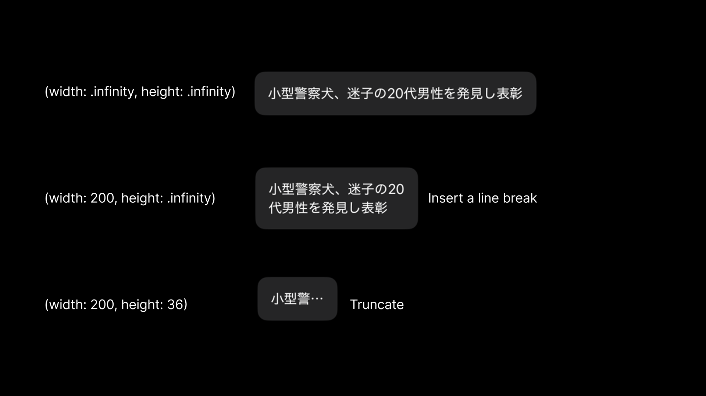

slidenumbers: true
background-color: #272729
theme: Fraunces, 4
text: #FFF, SF Pro
text-emphasis: SF Pro
text-strong: SF Pro
autoscale: true
header: #FFF, alignment(left), text-scale(0.5), SF Pro Text
header-emphasis: SF Pro Text
header-strong: SF Pro Text
slidenumber-style: SF Pro Text
footer-style: SF Pro Text
code: SF Mono


^ 「柔軟性のあるUIで、多くの環境でアプリを活躍させる」というタイトルでお話しします。よろしくお願いします。

---

# noppe

- DAWN for Mastodon
- Pococha at DeNA


^ noppeといいます。キツネのアイコンで活動しています。
^ そして、DeNAでPocochaというアプリの開発をしています。

---


^ また、個人開発者としてDAWN for Mastodonという、Mastodon向けのアプリを作っています。

---

# iOSDC 18,19,20,21,22,23,24,25,26

^ iOSDCには2018年から毎年登壇させていただいております。
^ これまでは毎年、パフォーマンスの話だったり、グラフィックの話だったり、技術や開発の話をしてきました。
^ そして、みなさんご存知の通り、ここ数年というのはAIがコードを書いてくれる時代になりました。
^ コードを書くこと自体は、AIに任せられるようになってきていますが、どう書かせるかというのは、依然として人間が考えているように思います。
^ これは「ハーネス」と言い換える事も出来ると思いますが、要するにAIの出力を人間の意図に沿うように制御することが、これからの開発者の仕事になっているからという事ですね。
^ そういう世界になっていくと、共通言語というものが欲しくなってくるわけです。
^ みんながなんとなく共通の意識として持っている概念を、定義して、名前をつけていくと。

---


^ そうすると、これまで「斜め上から見下ろした感じのイラストを生成して」ではなく、「アイソメトリックのイラストを生成して」と言えるようになるわけです。
^ そして、技術の分野では比較的、こういう共通言語が生まれやすいのですが、UIの分野では共通言語が少ないように思います。
^ これは、まだまだUIというのが、人間の感覚に依存しているからなんじゃないかなと思います。
^ ただ、今の私の感覚としては、UIには明らかに感覚的な部分と、構造的な部分があって、構造的な部分は共通言語として定義できるんじゃないかなと思っています。
^ だからこそ、こういった場でUIの話をするというのは、今、意味があるんじゃないかなと思っています。

---

# ライフステージの変化とUIの柔軟性

^ そして昨日で34歳になりました。自分でもびっくりするくらい絵に描いたような人生をやっているなと思います。
^ 若い頃というのは、スマホがあればだいたい何でもできると思っていました。時々、タブレットとかを持っている人を見ると、「なんでそんなものを持っているんだろう」と思っていました。
^ でも子育てをしていると、スマホを手に取れない場面が本当に多いです。子供を保育園に送った後に車を運転しながらCarPlayでニュースを読んでもらう。両手がふさがっているときにSiriで家電を操作する。Apple Watchで予定だけ確認する。
^ 実際に、自分の身になってみると、スマホ以外のデバイスで同じアプリが使えることのありがたみを感じます。
^ これが、UIの柔軟性を考えるきっかけになりました。

---

# UIの柔軟性とは？

状況を問わずに価値を提供すること

^ 今日は、主にレイアウトの話をしますが、本質的にはUIの柔軟性とは、単に画面が伸び縮みすることではありません。
^ ユーザーの状況を問わず、アプリの提供する価値を届けられることです。
^ まず、身近な例から見てみます。

---


^ 例えば天気アプリです。
^ iPadで、「今の天気を知りたい」と思ったときに、iPadで天気アプリを開くと、天気の情報が表示されます。

---


^ iPhoneやApple Watchでも、同じ天気アプリを開くと、同じ天気の情報が表示されます。

---


^ さらに、ウィジェットでも同じように、天気の情報が表示されます。
^ 同じ価値を、使える環境に合わせて届けている。これが今日扱う柔軟性ということです。

---

# アプリの前提が変わっている

環境に合わせて見た目を変えるもの

^ ここまでは、ハードウェアや利用場面の話でしたが、これらの柔軟性を実現するために、OSの側もアプリを「環境に合わせて見た目を変えるもの」として扱う前提に変わってきています。

---


^ 例えば、iPadOSはUIRequiresFullScreenが非推奨になり、ウィンドウベースのOSになりました。
^ 固定のウィンドウサイズではなく、ユーザーが自由にウィンドウサイズを変えられるようになりました。

---


^ これは、iPadOSだからというわけではなく、iOSのアプリも、iPhone MirroringやiPadOSなどの環境で、ウィンドウサイズが変化することが前提になってきています。

---


^ さらに、UISceneDelegateの移行により、アプリが複数のシーンを扱うことも前提になってきました。

---


^ そして、これまで縦長だったiPhoneの画面も、iPhone Ultraの登場により、スマホが縦長という前提は崩れつつあります。

---

# アプリは「どの環境でも柔軟に見た目を変えてくれるもの」に

- iPadOSがウィンドウシステムのOSになった
- iPhone Mirroringがリサイズ対応
- 同じアプリから複数の環境にシーンを出せるように

^ つまり、iPhone専用のアプリとして作ってきたとしても、これからOSはアプリを「どの環境でも柔軟に見た目を変えてくれるもの」として扱うようになってきています。
^ 当然、そのような前提に合わせて、ユーザーの期待値というのも変わってきます。

---

# UIの柔軟性とは？

- 状況を問わずに価値を提供すること

- ハードウェアはAppleが提供している
- アプリはそのハードウェアに合わせて、価値を届ける

^ このように、今日題材となっている「UIに柔軟性を持たせる」とは、ユーザーが置かれた状況によらず「やりたい」に応えることです。
^ 先ほど紹介したようにAppleプラットフォームには、ユーザーとの接点になるハードウェアや仕組みがすでにたくさんあります。
^ アプリ側がその接点ごとに、価値を届けられるようにすることで、これを実現できるようになります。

---

# 柔軟性の正体

- 全く別のものに変化するというわけではない
- 柔軟性は、どこかが変化することを許容するということ
- UIを観察して、どこが変化できるのかを考える必要がある

^ ここまでの話で、なんとなく今日のテーマの「柔軟性」という言葉の意味は伝わったと思います。
^ しかし、気をつけなければいけないのは、柔軟性とは全く別のものに変化するというわけではない、ということです。
^ そうだとしたら、こうやってトークをする意味もなくなってしまいます。
^ 柔軟性は手足の関節のように、どこかが変化することを許容する、ということです。
^ そして、その変化のルールを学ぶことで、感覚に頼らずに柔軟性のあるUIを作れるようになります。
^ まずは、UIにおいて、それがどこにあるのかを観察していきます。

---

# UIを観察する

^ では、早速UIを観察していきましょう。

---


^ まず、ユーザーは何らかの「目的」を実現するために、アプリを使います。
^ そして、アプリに対してインタラクションをしたり、フィードバックを受け取ったりすることで、アプリと対話をします。
^ この時、アプリとユーザーの仲介役として、User Interfaceが存在しています。

---


^ ここで、関連する要素を抜き出してみると、「目的」「インターフェース」「コンテキスト」の3つに分けられます。

---

## 目的

「何を・どうしたい」

- 例： 音楽を再生したい

^ 目的というのは、ユーザーが実現したいことです。たとえば「音楽を再生したい」といったことです。

---

## コンテキスト

ユーザーやデバイスの状況

- iPadを使っている
- 怪我をしている
- 車を運転している

^ そしてコンテキストは、ユーザーやデバイスの状況です。iPadを使っている、怪我をしている、車を運転している、といった状況です。

---

## インターフェース

最終的にユーザーが目的を実現するための手段

- ボタンを押す
- 音声で呼び出す
- 画面をスワイプする

^ 最後にインターフェースは、最終的にユーザーが目的を実現するための手段です。ボタンを押す、音声で呼び出す、画面をスワイプする、といった方法です。

---

# 例：ホーム画面

- 目的：アプリを起動する
- コンテキスト：iPhoneを使っている
- インターフェース：グリッドにアプリのボタンが並ぶ

^ これらを、実際のケースに当てはめてみます。
^ たとえばホーム画面です。目的は「アプリを起動すること」、コンテキストは「iPhoneを使っていること」、インターフェースは「グリッドにアプリのボタンが並ぶこと」です。
^ このように、UIを３つの要素で説明することができます。

---

# どれが柔軟性のある要素なのか

- 目的とインターフェースが固定
    - コンテキストを変える必要がある
    - 車を止めて、iPhoneを手に取る
- 目的とコンテキストが固定
    - インターフェースを変える必要がある
    - 車を運転しながら、Siriでアプリを起動する
- インターフェースとコンテキストが固定
    - 目的を変える必要がある
    - 今出来ることしか出来ない

^ 次に、これらの要素のうち、２つを固定したときに、残りの１つは柔軟性を要求されることが分かります。
^ 例えば〜
^ ユーザーの目線から見た時に、一番快適なのは、インターフェースに柔軟性があることだと分かりました。

---

# 柔軟性は、インターフェースに持たせる

^ 柔軟性はインターフェースに持たせることは分かりましたが、具体的にはどういうことなのでしょうか。

---

# インターフェースは複数存在することができる

^ ここで大事なのは、インターフェースは複数存在することができる、ということです。

---


^ Apple Musicを例に上げてみましょう。目的は「プレイリストを選ぶこと」です。
^ この時、インターフェースはグリッドでもリストでも目的を満たすことができます。
^ そして、それはユーザーが置かれている状況、例えば「アートワークで覚えている」だったり、「プレイリスト名で覚えている」というコンテキストによって決定します。

---


^ もう一つの例として、ホーム画面を見てみましょう。目的は「アプリを選ぶこと」です。
^ ユーザーのアクセシビリティによって、アシスティブアクセスのような大きなボタンのインターフェースが選ばれることもあります。
^ この場合でも、ユーザーは「アプリを選ぶ」という同じ目的を達成できます。

---


^ このように、インターフェースに柔軟性を持たせることで、ユーザーは現在のコンテキストを維持したまま、目的を達成することができます。

---


^ こう言い換えることもできます。インターフェースは目的とコンテキストが分かれば、自然に定まるということです。

---

# 余談

^ 今日は40分もあるので、少し余談も入れたいと思います。

---


^ 我々は、普段アプリを実装するときに、デザインデータを見ながら作ることが多いかなと思います。
^ 特に最近では、AIで直接デザインデータから実装に落とすこともできるようになってきています。
^ この時、皆さんはデザインデータをどう見ていますか。設計図として見ている人も多いのではないでしょうか。
^ 先ほどの式に当てはめると、「デザインデータ」に描かれているインターフェースとは、ある特定のコンテキストの中で、ある特定の目的を達成するためのインターフェースの一つに過ぎません。
^ だから、デザインデータをそのまま実装すると、柔軟性がないUIになってしまうのです。
^ でも皆さんは多分無意識にそれを解決しているはずです。402×874固定で作ることはないですよね。多少の解像度の違いがあっても壊れないように実装しているはずです。
^ その無意識にやっている行為に、少し意識を向けてみると良いんじゃないかなと思います。

---

# インターフェースはコンテキストによって決定する

- ユーザーの特徴
- 置かれている状況
- アクセシビリティ設定
- デバイス
- ウィンドウのサイズ・ダークモード ...etc

^ さて、先ほど話した通り、目的というのは変わらないわけですから、インターフェースというのは、コンテキストによって決定されると言えます。
^ コンテキストというのは、ユーザーの特徴や置かれている状況といった、アプリと無関係なものもあれば、アクセシビリティ設定、デバイス、ウィンドウのサイズのような、アプリと関係するものもあります。
^ たとえば、Dynamic Typeは文字の大きさを変え、デバイスやウィンドウは使える空間を変えます。

---

# 現実コンテキストの多くはハードとOSが吸収する

- 周囲の明るさ
    - True Tone
- ユーザーのアクセシビリティ設定
    - Dynamic Type
    - VoiceOver
- デバイスの種類
    - iPhone, iPad, Apple Watch, Mac

^ このうち、ユーザーの特徴や置かれている状況のような、アプリと無関係なコンテキストは、ハードウェアやOSが吸収してくれることが多いです。
^ たとえば、周囲の明るさはTrue Toneが吸収してくれますし、ユーザーのアクセシビリティ設定はDynamic TypeやVoiceOverが吸収してくれます。

---


^ 現実コンテキストも、多くはウィンドウサイズと同様にアプリから取得できるAPIとして提供されています。
^ こうしたコンテキストの多くは、Environment ValuesやUITraitCollectionなどのAPIとして取得できます。UIは、それらの状態を入力にして決められます。

---

# 全部のパターンを用意する？

^ ここまでの話で、アプリはコンテキストに応じてインターフェースを切り替える必要があることが分かりました。
^ では、実際にアプリを作るときは、コンテキストの組み合わせごとに、全部違うUIを用意すれば解決ですね。

---


^ しかし、考えうるコンテキストというのは、無限に存在します。たとえば、ユーザーのアクセシビリティ設定、デバイス、ウィンドウのサイズ、ダークモードなどだけでも、組み合わせは無限にあります。そして、まだ考慮されていないコンテキストにも対応できません。
^ コンテキストごとに個別の画面を作る方法は、現実的ではありません。

---

# コンテキストを分類する

- 段階的コンテキスト（Adaptation）
    - iPhoneとiPadのように、性質が変わる境目があるもの
- 連続的コンテキスト（Flexibility）
    - 幅や文字量のように連続的に変化するもの

^ そこで、コンテキストを分類します。段階的コンテキストと連続的コンテキストです。
^ 段階的コンテキストは、iPhoneとiPadのように、性質が変わる境目があるものです。
^ 連続的コンテキストは、幅や文字量のように連続的に変化するものです。
^ この分類を使うことで、ざっくりとした状態の変化は段階的に対応し、その間の変化を連続的に繋ぐことで、多くのコンテキストを表現できるようになります。

---

# 段階的コンテキスト

---


^ 段階的コンテキストは、コンテキストに応じて構造や表現そのものを切り替えることです。
^ たとえば、iPhoneとiPadのように、性質が変わる境目があるものは、Adaptationで切り替えます。

---


^ 画面に映るGUIなのか、音声で操作するVUIなのかも、このような段階的コンテキストの例です。どちらも同じ目的を達成できますが、インターフェースは大きく変わります。

---


^ 連続的コンテキストは、同じ構造のまま変化を受け止めることです。
^ たとえば、幅や文字量のように連続的に変化するものです。

---

# 休憩

---

# 連続的レイアウトと段階的レイアウト

^ 後半は、GUIに注目して、連続的レイアウトと段階的レイアウトの話をします。

---

# 多様化するiPhoneライクデバイス

- iPhone
- iPhone e
- iPhone Pro
- iPhone Pro Max
- iPad
- iPad mini ...etc


^ 先日も新製品が発表されましたが、iPhoneの類似デバイスは多様化しています。
^ これらのデバイスは細かい特徴が異なるものの、現時点ではWatchOSやmacOSと比べると類似性が高く、柔軟性を持たせる上での最初のステップとして良い題材になります。

---


^ 例えば、iPhone17eとiPhone17 Pro Maxは同じ世代のiPhoneですが、主に画面サイズに違いがあります。
^ 17eのコンテキストだけを想定したUIを作ると、このように変な余白が生まれます。
^ また、サンプルのコンテンツだけを想定したUIにすると、テキスト量が変化するとテキストが切れてしまうと言ったことも発生します。

---

# 連続的なレイアウトのパターン

コンテナビューのサイズが変化する

1. コンテナに合わせる
2. コンテナに合わせたスクロールビューを挟む
    - 固定サイズ
    - コンテンツに合わせる

^ 連続的なコンテナビューのサイズの変化に応じて、ビューが柔軟に変化する必要があります。
^ そして、その変化の受け止め方は、２つしかありません。コンテナビューのサイズに合わせるか、コンテナに合わせたスクロールビューを挟むかです。

---

# コンテナビューのサイズに合わせる


- Image, Color

^ まず、コンテナビューのサイズに合わせる方法です。SwiftUIの`Image`や`Color`のようなビューは、常にコンテナのサイズを満たすように伸縮します。

---

# コンテナビューに合わせたスクロールビューを挟む

- ScrollView, List


^ もう一つは、コンテナビューに合わせたスクロールビューを挟む方法です。SwiftUIの`ScrollView`や`List`のようなビューは、コンテナのサイズに合わせてスクロール可能な領域を作ります。
^ こうすることで、ビューのサイズを尊重しつつ、コンテナのサイズ変化に柔軟に対応できます。

---


^ ただし、スクロールビューにビューを入れる場合でも、ビュー自体のサイズを固定にするのは注意しましょう。ビューのサイズを固定にしてしまうと、コンテンツのサイズが変化したときに、ビューが切れてしまうことがあります。
^ 例えば、このようにテキストはローカリゼーションによって長さが変化することがあります。ビューのサイズを固定にしてしまうと、テキストが切れてしまいます。

---


^ コンテンツ自身のサイズは、内容に応じて変化します。
^ 極力、ビューのサイズはコンテンツに合わせて変化するようにしましょう。

---

# レイアウトの変化は目的とコンテキストに影響を与えない

^ このようにビューのレイアウトを変化させると、見た目が変わります。しかし、前半で話した通り、インターフェースの変化は、ユーザーの目的やコンテキストを変えることはありません。

---


^ 連続的なレイアウトを使えば、どんなに極小な画面でも、巨大な画面でも、同じUIを使うことができます。
^ ただし、連続的なレイアウトの変化だけでは足りない場面もあります。
^ これは、私のアプリの例ですが、iPhoneとiPadで同じUIを使っています。
^ この画面のように、コンテナビューのサイズによっては、比率を保ったヘッダーや、余白が過剰になってしまうことがあります。

---

# 段階的なレイアウト

^ そんなときは伸ばし続けるのではなく、段階的なレイアウトで構造や表現そのものを切り替えます。

---

# 段階的なレイアウトのパターン

状況に応じて、構造や表現そのものを切り替える

- 表示する情報の量を変える
- 同じ情報群を格納・展開する
- レイアウトの構造を変える

^ 段階的なレイアウトのパターンは、状況に応じて構造や表現そのものを切り替えることです。
^ これには、表示する情報の量を変えたり、同じ情報群を格納・展開する、レイアウトの構造を変える、といった方法があります。
^ これもひとつづつ見ていきましょう。

---


^ 例えば、このように音楽オブジェクトを表示するビューがあったとします。広い画面ではアートワーク、曲名、アーティスト名まで見せることができます。

---

## 表示する情報の量を変える

- 優先度の高いプロパティを残す
- 優先度は目的から逆算する

^ 表示する情報の量を変えるとは、優先度の高いプロパティを残すことです。
^ ここでの優先度は、目的から逆算して決めます。たとえば、音楽オブジェクトの目的は「曲を選ぶこと」です。曲名、アーティスト名、アルバム名の中で、どれが最も重要かを考えます。

---


^ こうすることで、コンテナビューのサイズが小さくなっても、目的を達成するために必要な情報は残すことができます。

---

## 同じ情報群を格納・展開する

- セクション化して、格納・展開できるようにする。

^ 同じ情報群を格納・展開する方法では、類似の情報のまとまりに名前をつけて、セクション化します。セクション化することで、状況に応じて格納・展開できるようになります。

---


---

## 状態によって、レイアウトを切り替える

少しコードの話も入れると、SwiftUIにはViewThatFitsというビューがある。
このビューは、複数のビューを受け取り、コンテナのサイズに応じて最適なビューを選択して表示する。

```swift
ViewThatFits {
    label
        .labelStyle(.titleAndIcon)
    label
        .labelStyle(.titleOnly)
    label
        .labelStyle(.iconOnly)
}
```

この時、各要素にプライオリティを持たせるのが大事。

^ コードでいうと、SwiftUIには`ViewThatFits`があります。複数の候補を渡すと、コンテナに収まる最初のビューを選んで表示してくれます。
^ 大切なのは、候補を並べる順番です。何を残し、何を省略するかには優先順位があります。曲名、アーティスト名、アルバム名なら、どれを最優先にするかをオブジェクトの性質として先に決めておきます。

---

## 折り畳み・展開


セクション化して、状況に応じて折り畳む・展開する。

^ 繰り返しの要素は、セクションにして折り畳むこともできます。
^ 広い画面では一覧を展開し、小さな画面では「フォロワー」のような見出しに畳んで、必要なときだけ開いてもらう。
^ 情報の出し方は変わっても、小さな画面で同じユースケースを満たせます。

---


---


---


---

# コラム： Generative UI

これまで省略が難しかったUGCのタイトルなどを圧縮する事ができるようになった。
オブジェクトの内容をそのままUIに反映することが多かったが、オブジェクトの内容を要約してUIに反映することができるようになった。
写真の重要な箇所を切り出してサムネにするとか

^ 最近の例としては、Generative UIもあります。
^ UGCのタイトルのように、どれくらい長くなるか制御しにくいものは、従来は扱いづらい対象でした。
^ いまはAIがオブジェクトの内容を要約してUIに反映できます。会話から短いタイトルを作る、写真の重要な箇所をサムネイルに切り出す、といった方法です。
^ 省略できなかったものを、内容を保ちながらコンパクトに表現できるようになっています。

---



---


---

## これらを組み合わせてUIは柔軟性を持つ

- スケーリング
    - どこかで切り離す
- 比率
    - どこかで切り離す

^ 実際のUIは、ここまでの組み合わせで作ることが多いです。
^ 途中までは比率や余白をFlexibilityで受け止め、過剰になったところで最大サイズに止める、または別のレイアウトへ切り替える。そこにAdaptationを使います。

---


---

# Adaptationはビュー内で完結するものに限らない

ビュー内で完結するものに限らず、Adaptationの「状況に応じて構造や表現そのものを切り替える」という考え方は、ナビゲーションを含む構造の切り替えにも活用できる。

^ Adaptationは、ビューの中だけの話ではありません。ナビゲーションを含む、もっと大きな構造の切り替えにも使えます。

---

## ナビゲーションを伴う切り替え


- iPhoneのタブバー
- Watchのタブバー

これらは同じユースケース・オブジェクトを満たすインターフェースであるが、状況に応じて構造や表現そのものを切り替えることで、柔軟性を持たせている。

^ たとえばiPhoneとApple Watchの項目切り替えです。
^ どちらも「見たい項目を選ぶ」というユースケースは同じです。ただ、Apple Watchでは一覧で項目を選び、次の画面で内容を見せることがあります。
^ iPhoneと同じ目的を、別のナビゲーション階層で実現している例です。

---

# コンテナビューコントローラ


UIKitでは、このような高度なAdaptationを持たせたコンテナビューコントローラーを標準で提供している。

[Make your UIKit app more flexible](https://developer.apple.com/jp/videos/play/wwdc2025/282)

^ UIKitには、構造レベルのAdaptationを持つコンテナビューコントローラが標準で用意されています。
^ ここからは、同じユースケースを環境に合わせてどう見せ替えるか、具体例で見ていきます。

---


---
    
## コンテナビューコントローラの例: UISplitViewController

^ `UISplitViewController`は、iPadではサイドバーとコンテンツを並べて見せられます。
^ iPhoneでは各カラムを画面いっぱいに表示して、必要に応じて遷移します。できることは同じで、最適な構造だけを切り替えています。

---


---

## コンテナビューコントローラの例: inspector

^ Inspectorも同じです。MacやiPadでは右側のカラムとして見せられます。
^ iPhoneで同じものを右から出すと画面が埋まってしまうため、下からシートのように出せます。内容は同じでも、提示方法を変えています。

---

## コンテナビューコントローラの例: UITabBarController


^ `UITabBarController`も、環境に応じてタブの位置や表現を変えられます。
^ コンテナビューコントローラは、こうした構造のAdaptationを自分で実装するときのよいお手本になります。

---

# 状態はサイズだけではない


コンテナサイズの柔軟性を担保すると、どんな大きさの画面にもアプリが表示できるようになる。
しかし、CarPlayなど特徴的なハードウェアはサイズだけで語れないものがある。
考え方は同じ、ユースケースは変えずに構造や表現を切り替えることで対応する。

^ ここまでは主にサイズの話でした。コンテナサイズへの柔軟性を担保すれば、さまざまな大きさの画面に表示できます。
^ ただしCarPlayのような特徴的なハードウェアは、サイズだけでは語れません。仮にiPadと同じ大きさでも、運転中に使う画面にiPadと同じUIが最適とは限りません。
^ それでも考え方は同じです。ユースケースを保ちながら、構造や表現を切り替えます。

---

## ソフトウェアキーボード：WatchOSとiOS


同じ文字を入力するというユースケース
音声入力が代用される。
ユースケースを見直すことも大事。元々のソフトウェアキーボードを「キーを押すことができる」というユースケースにしていては、音声入力などの代替手段を考慮できない。

^ watchOSとiOSの文字入力は分かりやすい例です。
^ どちらも「文字を入力する」というユースケースを満たしますが、Watchでは音声入力などが中心になり、iPhoneではソフトウェアキーボードが出ます。
^ もしユースケースを「キーを押すこと」と狭く定義していたら、音声入力という代替手段にはたどり着けません。状況に合わせるには、ユースケースを適切な粒度で捉えることも大切です。

---

## macOSのボタン、iOSのボタン


サイズ感は大きく変わらないが、プラットフォームのトンマナを採用している。

^ macOSとiOSのボタンも同じです。大きさ自体は極端に変わらなくても、各プラットフォームのトーン&マナーに合わせています。
^ 指で触るのか、ポインタで操作するのか。入力方法や利用環境に合わせて表現を変えています。

---

# 柔軟性の判断フロー

1. ユースケースが独立したビューを決める
2. そのユースケースと提供したい環境のパターンを出す
3. パターン内の連続性をFlexibilityを使って解決する
4. パターンの中にさらなるパターンを見つける
5. サブパターンの境界でAdaptationを使って解決する

^ 最後に、柔軟性を判断する流れをまとめます。
^ まず、独立したビューとして扱うユースケースを決めます。次に、そのユースケースを提供したい環境の大きなパターンを出します。
^ パターンの中で連続的に変わるものはFlexibilityで受け止めます。たとえば、近い画面サイズの差です。
^ さらに性質の変わる境界を見つけたら、そこでAdaptationを使います。iPhoneとiPadだけでなく、iPhoneの縦横で切り替えてもよい、ということです。

---

# ここまで

状態ごとのUIと、Flexibility／Adaptationを理解した

^ ここまでで、状態によってインターフェースが決まり、FlexibilityとAdaptationで柔軟性を作る、という話をしました。
^ 最後に、これを実装へ落とすときのポイントを少しだけ見ます。

---

# 実装について

動的に変更することを考慮する必要がある
ただし、今のところ動作中にプラットフォームが変化することは無い

^ 実装では、UIが動的に変わることを前提にします。
^ 一方で、動作中にiPhoneが突然Apple Watchになることはありません。プラットフォームごとの構造と、実行中に変化し得る状態を分けて設計します。

---

# 動的な環境変化に対応する

起動時の状態が常に保たれるわけではない
状態駆動レイアウトで実装する必要がある

^ 起動時の状態が、ずっと保たれるとは限りません。
^ ウィンドウサイズ、Dynamic Type、アクセシビリティ設定は実行中にも変わります。状態を入力としてUIを更新する、状態駆動のレイアウトとして実装する必要があります。

---

# カスタムUIを作る覚悟

１つの状態を視覚化した１つのグラフィックを見て、これを作るのが簡単だと思うのは浅はか
実際は今日説明した通り、ユースケースとオブジェクトは同じでも、状態ごとにインターフェースが変化することを考慮する必要がある
多くの状態を想定し、複雑な状態であっても成り立つUIを想定出来るのが良質なUIデザイナーである
ネイティブUIコンポーネントを使うことで、その大部分の状態をカバーできる。

^ 一つの状態だけを描いたグラフィックを見て、「これなら簡単に作れそう」と考えるのは危険です。
^ 実際には、同じユースケースとオブジェクトでも、状態によってインターフェースが変わります。多くの状態で成り立つUIまで想像して初めて、実装の見積もりができます。
^ ネイティブのUIコンポーネントを使うことは、その多くを最初からカバーする有力な選択肢です。

---

# 最後に

UIは「状態」を入力に、「インターフェース」を出力する

ユースケースは保ち、状況に応じて表現を変える

^ 最後に。UIは静的な絵ではなく、状態によって変化するものです。
^ FigmaやSketchにあるデザインは、ある状態における一枚の絵です。それをそのまま実装するだけでは、柔軟性は生まれません。
^ UIは状態を入力にして、見た目を出力する関数のようなものです。ただし、必ずモデルからUIを生成しなければいけない、という話ではありません。絵から始めることで、自然にユーザーの期待へ応えられる場面もあります。
^ 大事なのは、状況を問わずユーザーの「やりたい」に応えることです。そのために、UIのどこを変化させられるかを観察してみてください。ありがとうございました。
^ ユーザがそれぞれ個性的であるように、ソフトウェアの利用方法もひとり一人異なります。デザインでこれを意識すればするほど、ユーザは気軽に使えるようになります。自分以外の経験にも目を向け、できるだけ多くのデバイス、操作の種類、および視点に対応するよう努めてください。

<!--
# memo

- ハードウェアの特徴を活かす
- iPadはHIGでは「fluidly resizable」
- navigation が adaptive なら “reflow to any width” できる
- 画面の回転もウィンドウのサイズ変更も結局scene sizeの変更として考えられる
    https://developer.apple.com/jp/videos/play/wwdc2025/282
    Make your UIKit app more flexible
    この考え方ができるようになったのも、全てのOSでトンマナが統一され始めたから
- HIGと同じように「状態」と言う言葉を使いたい
- コンテナVCの話はWWDCの話をして、これを自分でも作るという話にしていく　
- ウィンドウシーン・コンテナVC・コンポーネントで分離してもいいかも
- 実装観点
    - トップレベルに行くほど抽象的になるべき
- 宣言的UIは努力なしでこのバインディングを行える　
- 子供のブロックを作例にしたいかも？
- AdaptationはFigmaにない

- Apple MusicのMirroringの例を見たりすると良い

- 余白の多さに対しては、畳み込んでいるものを展開することで対応することができる

## コンテナビューコントローラの例: compact-adaptation


https://swift.mackarous.com/posts/2024/10/modifiers-presentation-compact-adaptation/

^ compactな環境では、提示方法を自動で変える`presentationCompactAdaptation`もあります。
^ サイズが変わったときに、見た目だけではなく、提示の構造まで変える例です。
^ 発明をせず、標準を選ぶ
^ 前半のまとめを入れてもいいかも
-->
