slidenumbers: true
background-color: #272729
theme: Fraunces, 4
text: #FFF, SF Pro
text-emphasis: SF Pro
text-strong: SF Pro
autoscale: true
header: #FFF, alignment(left), text-scale(0.5), SF Pro Text
header-emphasis: SF Pro Text
header-strong: SF Pro Text
slidenumber-style: SF Pro Text
footer-style: SF Pro Text
code: SF Mono

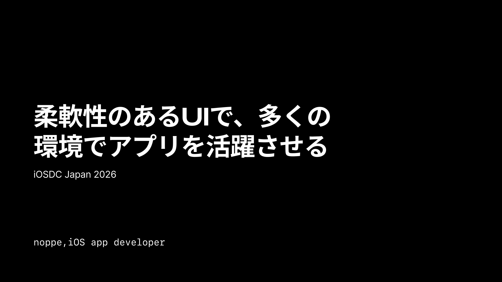

^ 「柔軟性のあるUIで、多くの環境でアプリを活躍させる」というタイトルでお話しします。よろしくお願いします。

---

# noppe

- DAWN for Mastodon
- Pococha at DeNA

^ まず自己紹介です。noppeといいます。キツネのアイコンで活動しています。
^ 仕事では、DeNAで、ライブ配信を通じてユーザー同士が交流するアプリ、Pocochaを開発しています。

---

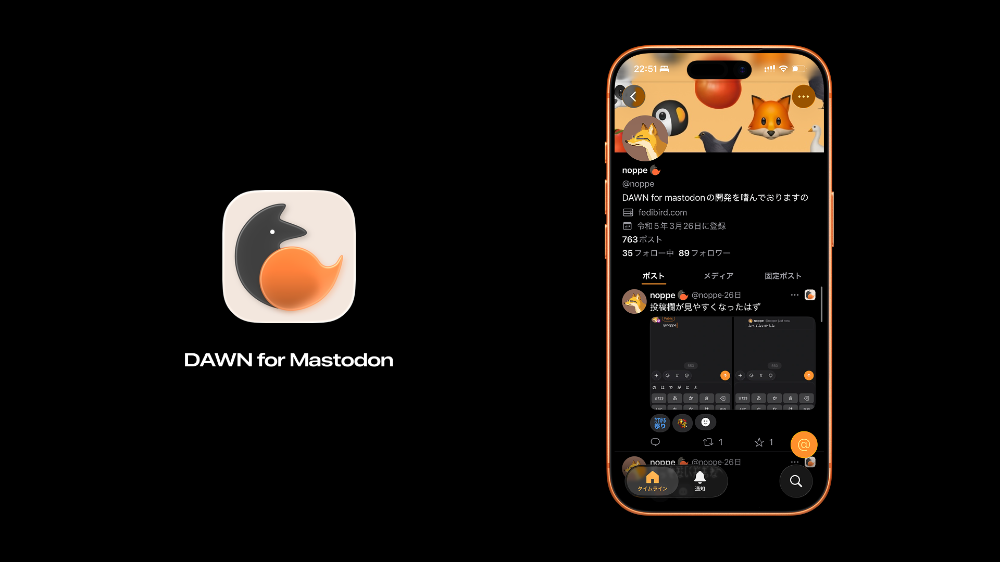

^ 個人では、分散型のSNSであるMastodon向けに、DAWN for Mastodonというアプリも作っています。

---

# iOSDC 18,19,20,21,22,23,24,25,26

^ iOSDCには2018年から毎年登壇させていただいております。
^ これまでは毎年、パフォーマンスの話だったり、グラフィックの話だったり、技術や開発の話をしてきました。
^ そして、みなさんご存知の通り、ここ数年というのはAIがコードを書いてくれる時代になりました。
^ コードを書くこと自体は、AIに任せられるようになってきていますが、どう書かせるかというのは、依然として人間が考えているように思います。
^ これは「ハーネス」と言い換える事も出来ると思いますが、要するにAIの出力を人間の意図に沿うように制御することが、これからの開発者の仕事になっているからという事ですね。
^ そういう世界になっていくと、共通言語というものが欲しくなってくるわけです。
^ みんながなんとなく共通の意識として持っている概念を、定義して、名前をつけていくと。

---

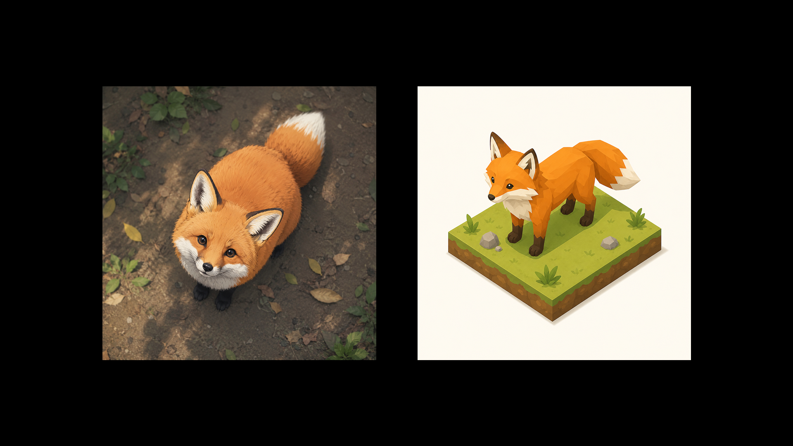

^ そうして、共通言語が生まれると、これまで「斜め上から見下ろした感じのイラストを生成して」ではなく、「アイソメトリックのイラストを生成して」と言えるようになるわけです。
^ そして、技術の分野では比較的、こういう共通言語が生まれやすいのですが、UIの分野では共通言語が少ないように思います。
^ これは、まだまだUIというのが、人間の感覚に依存しているからなんじゃないかなと思います。
^ ただ、今の私の感覚としては、UIには明らかに感覚的な部分と、構造的な部分があって、構造的な部分は共通言語として定義できるんじゃないかなと思っています。
^ だからこそ、こういった場でUIの話をするというのは、今、意味があるんじゃないかなと思っています。

---

# ライフステージの変化とUIの柔軟性

^ そして昨日で34歳になりました。自分でもびっくりするくらい絵に描いたような人生をやっているなと思います。
^ 若い頃というのは、スマホがあればだいたい何でもできると思っていました。時々、タブレットとかを持っている人を見ると、「なんでそんなものを持っているんだろう」と思っていました。
^ でも子育てをしていると、スマホを手に取れない場面が本当に多いです。子供を保育園に送った後に車を運転しながらCarPlayでニュースを読んでもらう。両手がふさがっているときにSiriで家電を操作する。Apple Watchで予定だけ確認する。
^ 実際に、自分の身になってみると、スマホ以外のデバイスで同じアプリが使えることのありがたみを感じます。
^ これが、UIの柔軟性を考えるきっかけになりました。

---

# UIの柔軟性とは？

状況を問わずに価値を提供すること

^ 今日は、主にレイアウトの話をしますが、本質的にはUIの柔軟性とは、単に画面が伸び縮みすることではありません。
^ ユーザーの状況を問わず、アプリの提供する価値を届けられることです。
^ まず、身近な例から見てみます。

---

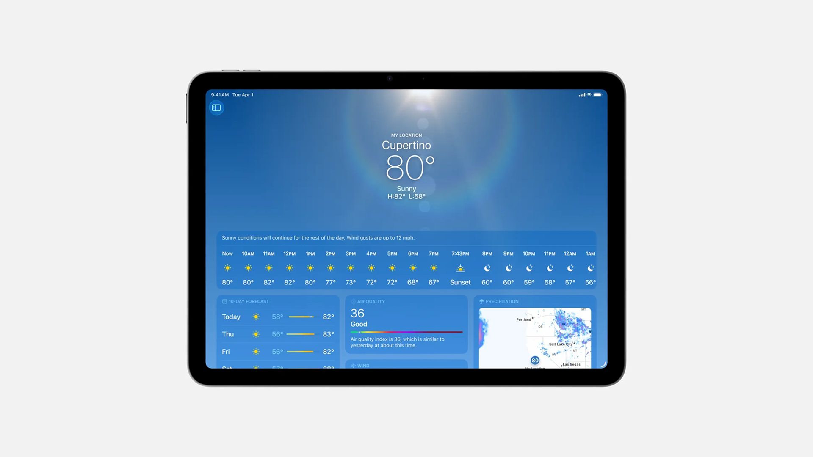

^ 例えば天気アプリです。
^ iPadで、「今の天気を知りたい」と思ったときに、iPadで天気アプリを開くと、天気の情報が表示されます。

---

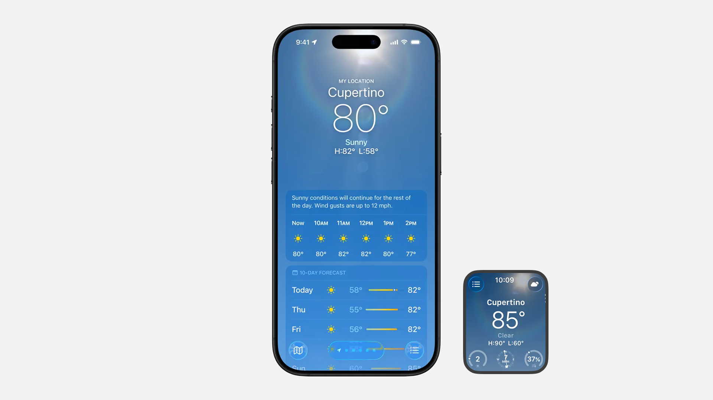

^ iPhoneやApple Watchでも、同じ天気アプリを開くと、同じ天気の情報が表示されます。

---

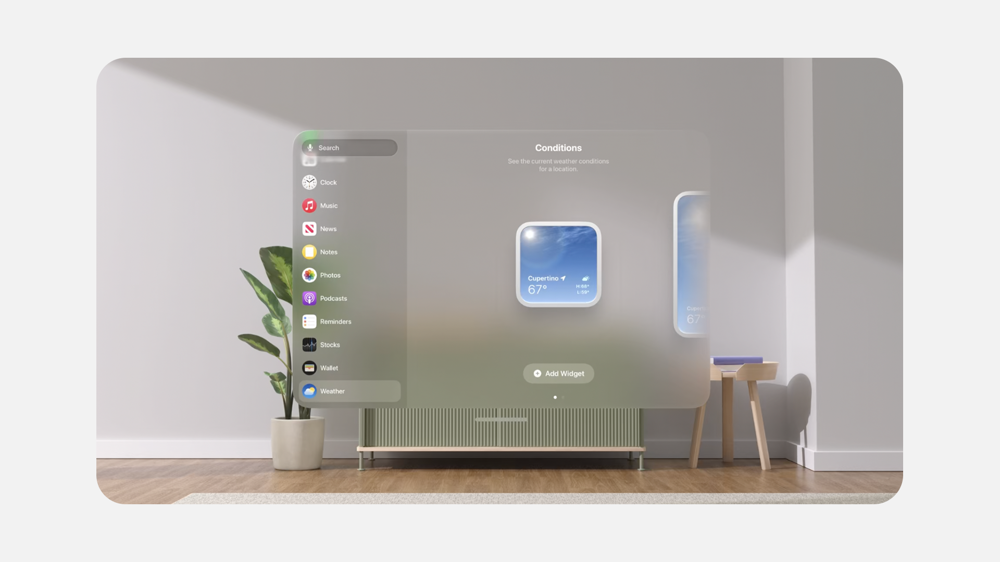

^ さらに、ウィジェットでも同じように、天気の情報が表示されます。
^ 同じ価値を、使える環境に合わせて届けている。これが今日扱う柔軟性ということです。

---

# アプリの前提が変わっている

単一の画面サイズを前提にできなくなっている

^ ここまでは、ハードウェアや利用場面の話でした。
^ 一方でOS側でも、アプリを単一の画面サイズに固定されたものとして扱わない方向に変わってきています。

---

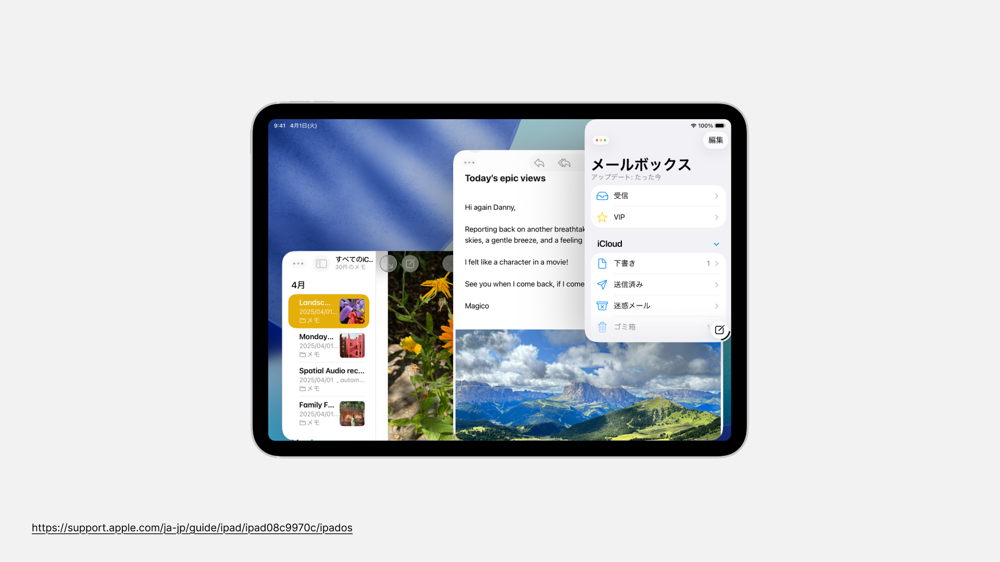

^ 例えば、iPadOSはUIRequiresFullScreenが非推奨になり、ウィンドウベースのOSになりました。
^ 固定のウィンドウサイズではなく、ユーザーが自由にウィンドウサイズを変えられるようになりました。

---

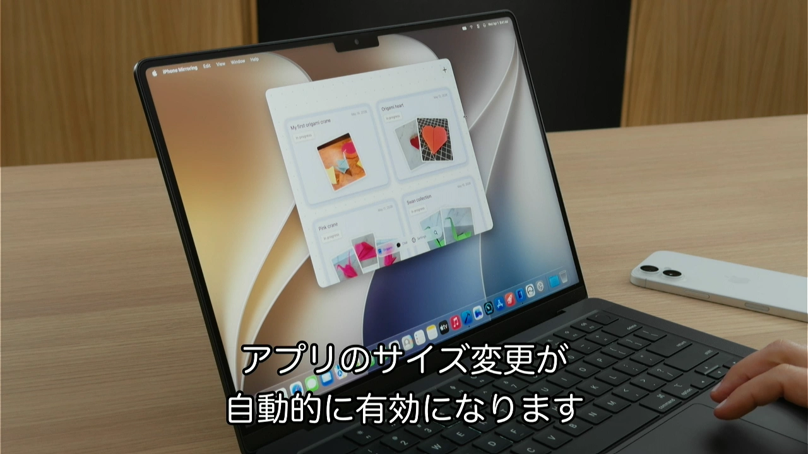

^ これはiPadOSに限った話ではなく、macOS Golden GateからはiPhone Mirroring上のiOSアプリもリサイズできるようになりました。

---

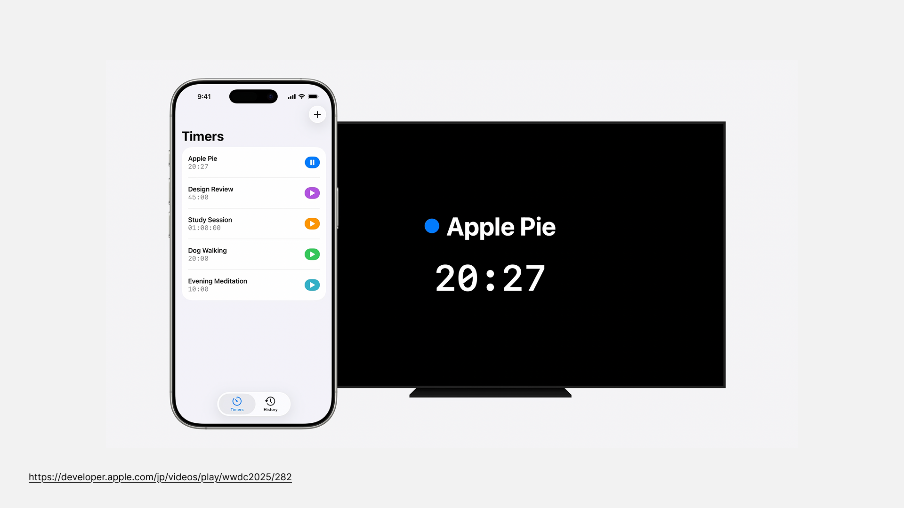

^ さらに、UISceneDelegateへの移行によって、アプリが単一の固定された画面だけを持つ、という前提も薄れています。

---

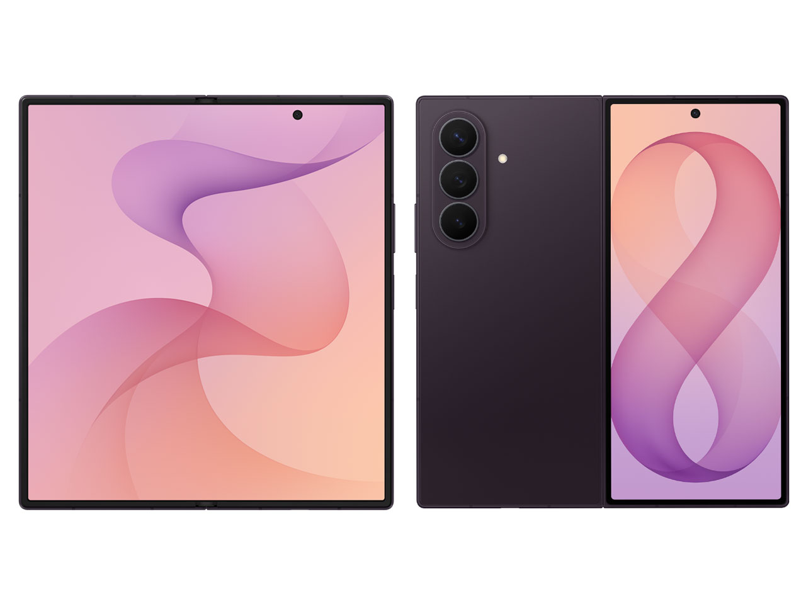

^ そして、これまで縦長だったiPhoneの画面も、先日登場したiPhone Ultraによって、「iOSアプリは縦長」という前提だけでは考えにくくなってきました。

---

# 環境の変化が前提になった

- ウィンドウサイズが変わる
- 同じアプリが異なる環境に表示される
- 画面の形そのものも変わる

^ つまり、これからのアプリは一つの固定された画面を作るのではなく、環境の変化を前提に作る必要があります。

---

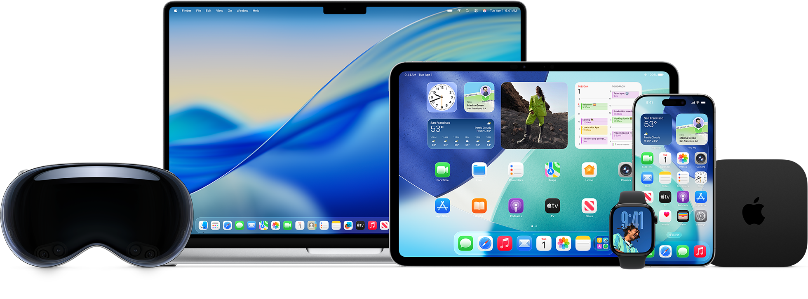

^ ここまで見てきたように、Appleプラットフォームには、ユーザーとの接点になるハードウェアや仕組みがすでにたくさんあります。
^ 同じアプリでも、こうした接点や環境に応じて、見た目や操作のあり方は変わります。
^ では、柔軟性を持たせるとき、具体的にUIのどこを変えればよいのでしょうか。

---

# 変わる場所を決める

- 全く別のものに変化するというわけではない
- 柔軟性は、どこかが変化することを許容するということ
- UIを観察して、どこが変化できるのかを考える必要がある

^ ここまでの話で、なんとなく今日のテーマの「柔軟性」という言葉の意味は伝わったと思います。
^ しかし、気をつけなければいけないのは、柔軟性とは状況ごとに全く別のものに変化するというわけではない、ということです。
^ そうだとしたら、何も再現性はないわけで、こうやってトークをする意味もなくなってしまいます。
^ 私は、柔軟性というのは「手足の関節のように、どこかが変化することを許容する」ということなんじゃないかなと思います。
^ そして、その変化のルールを学ぶことで、感覚に頼らずに柔軟性のあるUIを作れるようになるんじゃないかなと思っています。
^ まずは、UIにおいて、それがどこに当たるのかを観察していきます。

---

# UIを観察する

^ では、早速UIを観察していきましょう。

---

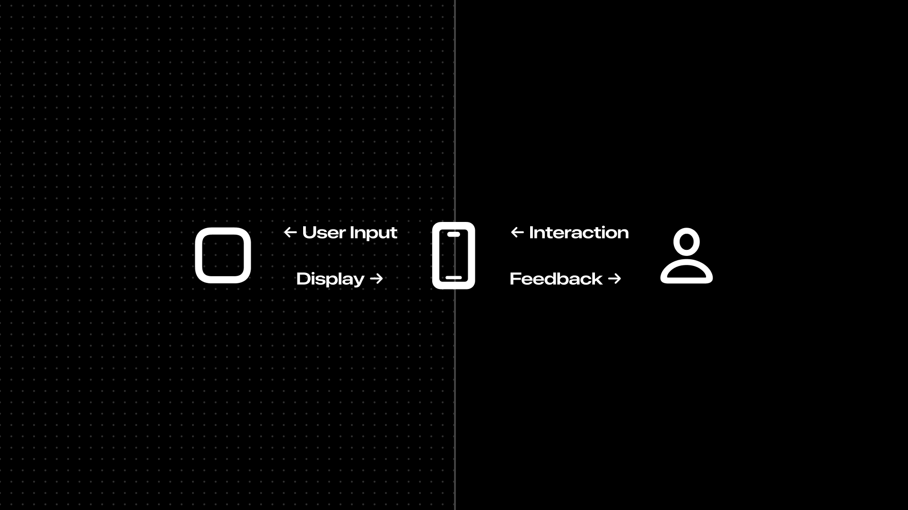

^ まず、UIとユーザーの関係を考えてみます。
^ 右にいるユーザーはこの図のようにUIを通して左側のアプリにアクセスします。
^ メンタルモデルとしては、ユーザーはアプリと直接やり取りしているように思っていますが、実際には必ずUIを通してアプリとやり取りしています。

---

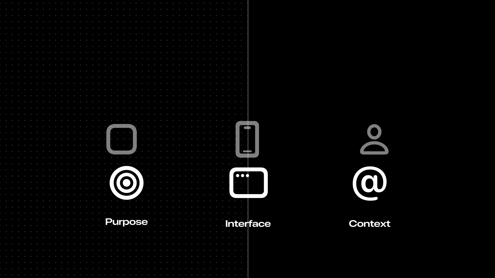

^ この時、アプリにはユーザーが達成したい「目的」が、ユーザーには取り巻く環境である「コンテキスト」があります。
^ つまりユーザーが行うアプリの操作には「目的」「コンテキスト」「インターフェース」の3つが関係していることが分かります。

---

## 目的

ユーザーが実現したいこと

- 例： 音楽を再生したい、写真を撮りたい

^ 「目的」というのは、ここではユーザーが実現したいことです。
^ たとえば「音楽を再生したい」とか「写真を撮りたい」といったことです。

---

## コンテキスト

ユーザーが置かれている状況

- iPadを使っている
- 怪我をしている
- 車を運転している
- 周囲が暗い など

^ そしてコンテキストは、ユーザーが置かれている状況です。
^ 例えば、iPadを使っている、怪我をしている、車を運転している、周囲が暗い、といった情報です。

---

## インターフェース

最終的にユーザーが目的を実現するための手段

- ボタンがある
- 音声で呼び出せる
- 画面をスワイプできる
- など

^ 最後にインターフェースは、最終的にユーザーが目的を実現するための手段です。ボタンがある、音声で呼び出せる、画面をスワイプできる、といった手段です。

---

# 例：ホーム画面

- 目的：アプリを起動する
- コンテキスト：iPhoneを使っている
- インターフェース：グリッドにアプリのボタンが並ぶ

^ これらを、実際のケースに当てはめて考えてみましょう。
^ たとえばホーム画面です。目的は「アプリを起動すること」、コンテキストは「iPhoneを使っていること」、インターフェースは「グリッドにアプリのボタンが並ぶこと」です。
^ このように、UIを３つの要素で説明することができます。

---

# 何を柔軟にするのか

^ 次に、これらの要素のうち、アプリ開発者が実際にコントロールできるものはどれなのかを考えてみます。
^ そのために、３つの要素のうち２つを固定して、残りの１つにどんな柔軟性が要求されるのかを観察してみます。

---

# 目的とインターフェースが固定

コンテキストを変える必要がある

- 目的：アプリを起動する
- インターフェース：グリッドにアプリのボタンが並ぶ

- コンテキスト：車を運転している → 車を止めて、スマホを操作する

^ 目的とインターフェースが固定されている場合、コンテキストを変える必要があります。
^ 例えば、ユーザーが車を運転していたとします。
^ ここで目的は「アプリを起動すること」、インターフェースは「グリッドにアプリのボタンが並ぶこと」と固定されている場合、ユーザーは「車を運転している」というコンテキストを変えて、目的を達成する必要があります。

---

# 目的とコンテキストが固定

インターフェースを変える必要がある

- 目的：アプリを起動する
- コンテキスト：車を運転している

- インターフェース：ボイスコマンドでアプリを起動できる

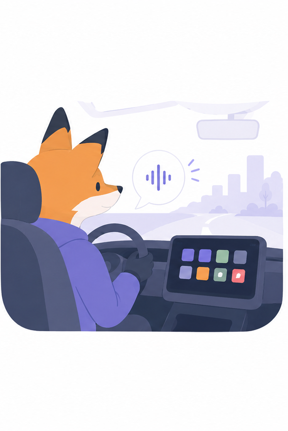

^ 次に目的とコンテキストが固定されている場合を考えてみましょう。
^ ユーザーの目的は「アプリを起動すること」、コンテキストは「車を運転している」と固定されている場合、今度はアプリがインターフェースを変える必要があります。
^ 例えば、インターフェースを「ボイスコマンドでアプリを起動できる」と変えることで、ユーザーは運転中でも目的を達成することができます。

---

# インターフェースとコンテキストが固定

目的を変える必要がある

- コンテキスト：車を運転している
- インターフェース：グリッドにアプリのボタンが並ぶ

- 目的：アプリを起動する → 断念・延期する

^ 最後に、インターフェースとコンテキストが固定されている場合を考えてみましょう。
^ ユーザーの目的は「アプリを起動すること」、コンテキストは「車を運転していること」、インターフェースは「グリッドにアプリのボタンが並ぶこと」です。
^ この場合、コンテキストもインターフェースも変えられないので、ユーザーはそのままでは目的を達成できません。
^ そのため、「アプリを起動する」という目的自体を断念したり、後回しにしたりする必要があります。
^ つまり、コンテキストとインターフェースを固定すると、ユーザー側の目的にしわ寄せがいくことになります。

---

|固定する要素|柔軟性が求められる要素|
|---|---|
|目的とインターフェース|コンテキスト|
|目的とコンテキスト|インターフェース|
|インターフェースとコンテキスト|目的|

^ このように、UIの３つの要素のうち、どれを固定するかによって、柔軟性を持たせるべき要素が決まります。
^ さて、皆さんはどの要素を柔軟にするのが良いと思いますか。
^ はい、目的とコンテキストは、ユーザーが決めたり、ユーザーが変えることが難しいことなので、インターフェースを柔軟にするのが良い、ということになります。

---

# 柔軟性は、インターフェースに持たせる

^ 柔軟性はインターフェースに持たせることは分かりましたが、具体的にはどういうことなのでしょうか。

---

# 同じ目的に、複数のインターフェースを持てる

^ ここで大事なのは、インターフェースは複数存在することができる、ということです。

---

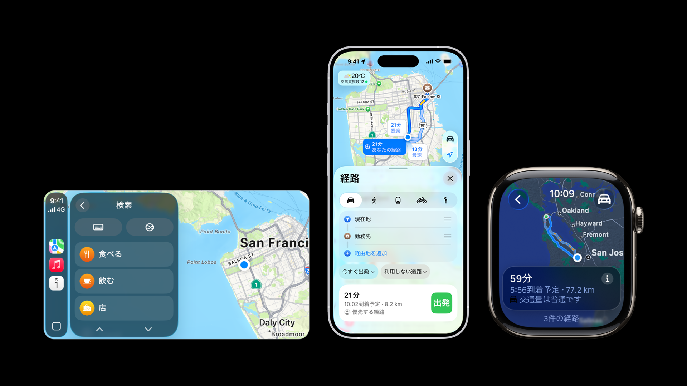

^ Apple Mapを例に上げてみましょう。このアプリの目的は「目的地にたどり着くこと」です。
^ この時、インターフェースは地図の表示、音声、触覚をユーザーのコンテキストに応じて提供しています。
^ これはユーザーの手にiPhoneを持っている場合、車を運転している場合、歩いている場合など、コンテキストに応じてインターフェースが切り替わる、ということです。

---

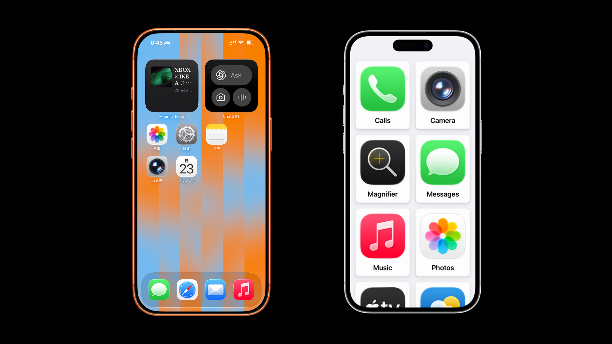

^ もう一つの例として、ホーム画面を見てみましょう。目的は「アプリを選ぶこと」です。
^ ユーザーのアクセシビリティによって、右の画面のようなアシスティブアクセスの大きなボタンのインターフェースが選ばれることもあります。
^ そしてこの場合でも、ユーザーは「アプリを選ぶ」という同じ目的を達成できます。

---

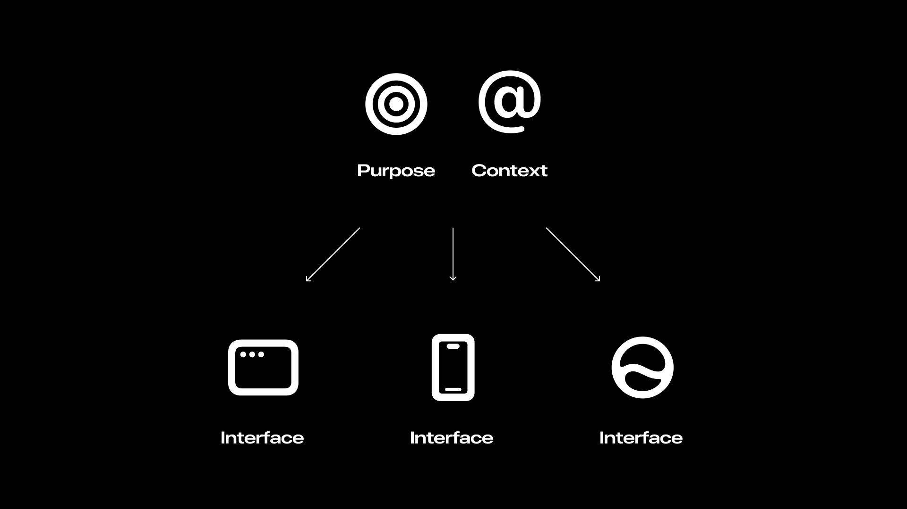

^ このように、複数のインターフェースを提供することで、ユーザーは目的とコンテキストを変えずに目的を達成することができます。

---

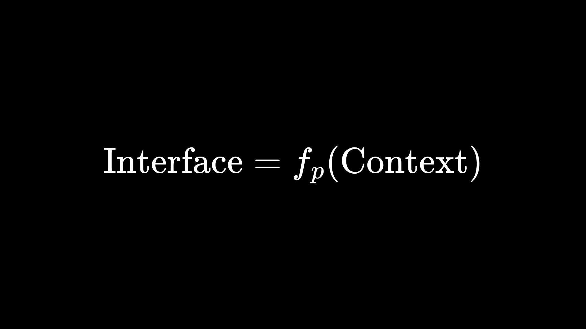

^ Apple Mapやホーム画面の例を見ると、目的が同じでも、コンテキストが変われば適したインターフェースが変わることが分かります。
^ つまり、考え方としては理想のインターフェースを目的とコンテキストから導出できる、と捉えることができます。
^ 実際には、ケースごとに実装していくことにはなりますが、こう考えておくことで、コンテキストのバリエーションを見たときに、インターフェースには別の姿があるのではないかと疑えるようになるのではないかなと思います。

---

# デザインデータは「ある条件での正解」

^ 今日は40分もあるので、少し余談も入れたいと思います。

---

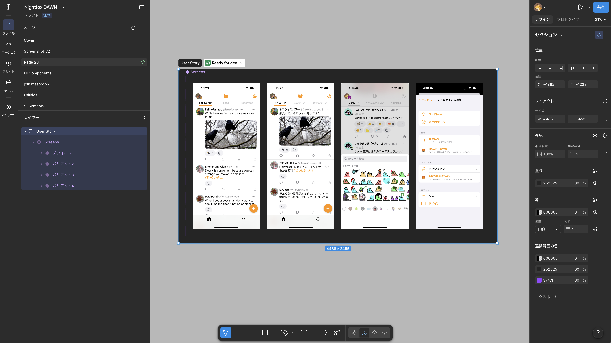

^ みなさん、普段アプリを実装するときに、デザインデータを見ながら作ることが多いかなと思います。
^ この時、皆さんはデザインデータをどう見ていますか。
^ 特に最近では、デザインデータから直接AIで実装に落とすことも増えてきていて、デザインデータをある種の設計図として見ている人も多いのではないでしょうか。
^ 先ほどの式に当てはめると、「デザインデータ」に描かれているインターフェースとは、ある特定のコンテキストの中で、ある特定の目的を達成するためのインターフェースの一つに過ぎません。
^ だから、デザインデータをそのまま実装すると、柔軟性がないUIになってしまうのです。
^ でも皆さんは多分無意識にそれを解決しているはずです。402×874固定で作ることはないですよね。多少の解像度の違いがあっても壊れないように実装しているはずです。
^ その無意識にやっている行為に、少し意識を向けてみると良いんじゃないかなと思います。

---

# インターフェースは目的とコンテキストによって決定する

- 現実世界のコンテキスト
    - ユーザーの特徴
    - 置かれている状況
- ソフトウェアのコンテキスト
    - ウィンドウのサイズ
    - ダークモードなど

^ ここでは、ユーザーの目的を変えさせないことを前提にすると、インターフェースは目的とコンテキストに応じて決定されると言えます。
^ 同じ目的でも、コンテキストが変われば、それに適したインターフェースも変わります。
^ コンテキストには、ユーザーの特徴や置かれている状況といった、現実世界のものもあれば、ウィンドウのサイズや、ダークモードのような、ソフトウェアのコンテキストもあります。

---

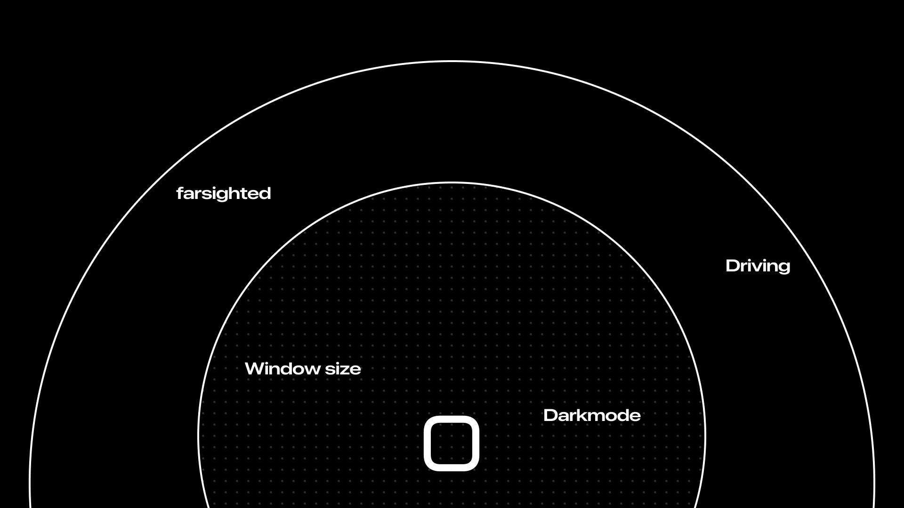

^ ところが、困ったことにアプリからはソフトウェアのコンテキストは取れても、現実世界のコンテキストの多くは取ることができません。
^ たとえば、ユーザーが車を運転しているかどうかや老眼かどうかなどは、アプリからは分かりません。
^ これでは、現実世界のコンテキストに応じたインターフェースの切り替えができません。

---

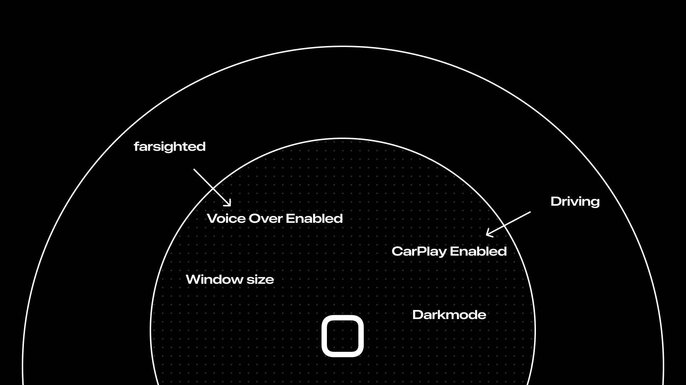

^ そこで、デバイスとOSが、現実世界のコンテキストを抽象化します。
^ 例えば、具体的に「ユーザーが車を運転しているかどうか」という情報は、アプリからは取得できませんが、「アプリがCarPlayで動作しているか」や「どのフォントサイズの拡大率を要求されているか」といった抽象化されたコンテキストは、アプリから取得できます。
^ アプリは、抽象化されたコンテキストを受け取ることで、現実世界のコンテキストに応じたインターフェースの切り替えができるようになります。
^ これらの現実コンテキストの中にはアプリが考慮する必要のないものもあります。
^ 例えばTrue ToneやNight Shiftは、OSが自動で画面の色味を調整してくれるので、アプリが考慮する必要はありません。

---

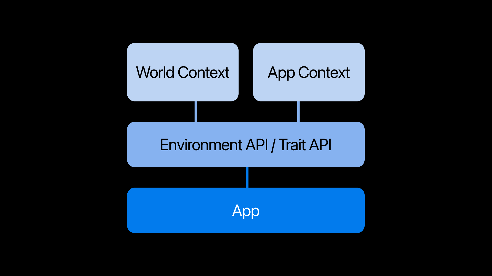

^ 現実コンテキストのうち、アプリで考慮すべきものは、ソフトウェアコンテキストと同じようにアプリから取得できるAPIとして提供されます。
^ こうしたコンテキストの多くは、Environment ValuesやUITraitCollectionなどのAPIとして取得できます。UIはそれらの状態に適したインターフェースを提供します。

---

# 全部のパターンを用意する？

^ ここまでの話で、アプリはコンテキストに応じてインターフェースを切り替える必要があることが分かりました。
^ では、実際にアプリを作るときは、コンテキストの組み合わせごとに、全部違うUIを用意すれば解決ですね。

---

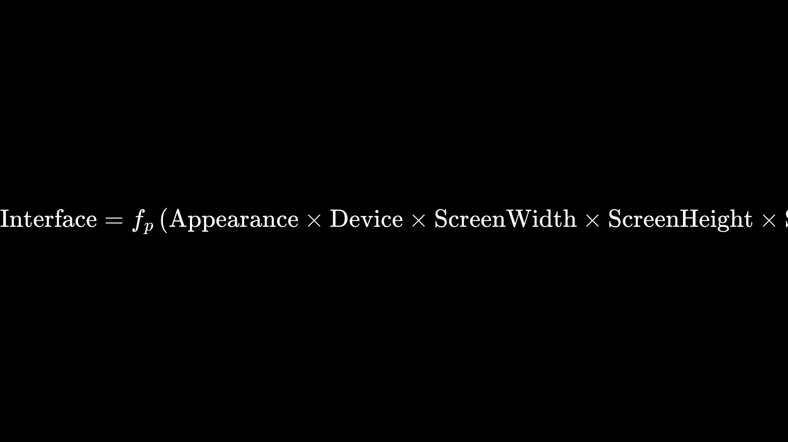

^ しかし、考えうるコンテキストというのは、無限に存在します。たとえば、ユーザーのアクセシビリティ設定、デバイス、ウィンドウのサイズ、ダークモードなどだけでも、組み合わせは無限にあります。そして、まだ考慮されていない条件にも対応できません。
^ コンテキストごとに個別のインターフェースを作る方法は、現実的ではありません。

---

# コンテキストの変化にどう応答するか

- 連続的な適応
- 段階的な適応

^ ここまでで、コンテキストに応じてインターフェースを変える必要があることが分かりました。
^ では、その変化のさせ方を２つに分けて考えてみます。
^ コンテキストの変化に対して、同じ構造や表現のまま連続的に追従する方法と、ある境界で構造や表現そのものを切り替える方法です。

---

連続的な適応

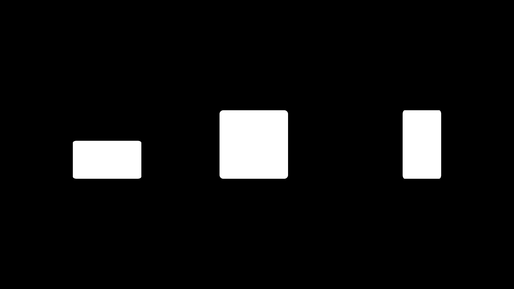

^ 同じインターフェースのまま目的を十分に達成できる範囲では、構造や表現を変えずに連続的に適応します。
^ たとえば、ビューのサイズや文字量が変化しても、伸縮やスクロールによって同じ構造のまま目的を達成できる場合があります。

---

段階的な適応

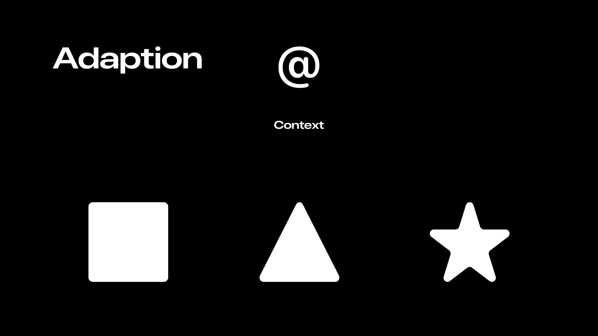

^ 一方で、同じインターフェースのままでは目的を十分に達成できなくなる場合は、構造や表現そのものを切り替えます。
^ この切り替えが必要になる地点を、ここでは境界と呼びます。

---

境界でインターフェースを切り替える

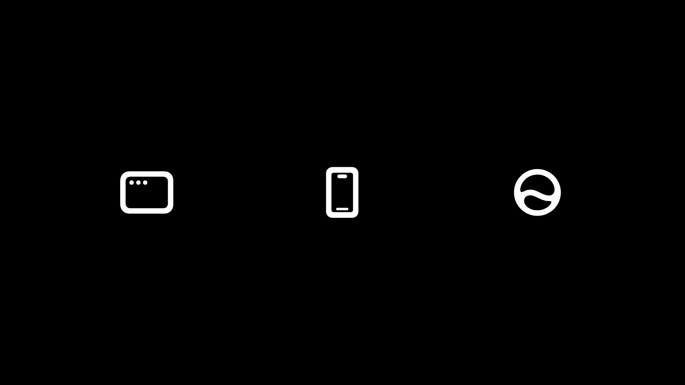

^ 例えば、ある幅までは1カラムで目的を十分に達成できても、さらに広くなると2カラムの方が目的達成に適する場合があります。
^ このとき、画面幅そのものが2種類に分かれるわけではなく、同じインターフェースで目的を達成できる範囲に境界がある、と考えます。
^ 画面に映るGUIなのか、音声で操作するVUIなのかも同じです。どちらも同じ目的を達成できますが、コンテキストに応じて適したインターフェースは大きく変わります。

---

# 境界の見つけ方

- 同じインターフェースのまま、目的を十分に達成できるか

- 例えば
    - ある幅までは1カラムで十分に目的を達成できる
    - さらに広くなり、2カラムの方が目的達成に適するなら、そこが切り替えの境界になる
    - iPhoneしかない状況では、カーソル操作のUIは適さない
    - ユーザーの身長は、UIの構造や表現に影響を与えないので同じUIを使える

^ 例えば、画面幅が変わっても、ある範囲までは1カラムのままで十分に目的を達成できます。
^ しかし、さらに広くなって2カラムの方が目的達成に適するようになったなら、その切り替え地点を境界と考えることができます。
^ このように、境界があるかどうかは、同じインターフェースのまま目的を十分に達成できるかで判断します。
^ 例えば、iPhoneしかない状況ではカーソル操作のUIは適さないので、別のインターフェースへ切り替える境界があります。
^ 一方で、目的に寄りますがユーザーの身長はUIの構造や表現に影響を与えないので、同じインターフェースのまま対応できます。
^ つまり境界とは、コンテキストそのものにあるものではなく、あるインターフェースが目的を十分に達成できる範囲の境目です。

---

# 休憩

^ はい、ということで、ここまでで前半の話は終わりです。少し休憩を挟みましょう。
^ かなり概念的な話になってしまいましたが、後半はGUIに注目して、このコンテキストへの応答の考え方をレイアウトの話に落とし込んでいきます。

---

# 連続的レイアウトと段階的レイアウト

^ ここからは、前半で整理した考え方を、実際のUIのレイアウトに適用してみましょう。

---

# 多様化するiPhoneライクデバイス

- iPhone
- iPhone 17e
- iPhone 17 Pro
- iPhone 17 Pro Max
- iPad
- iPad mini ...etc

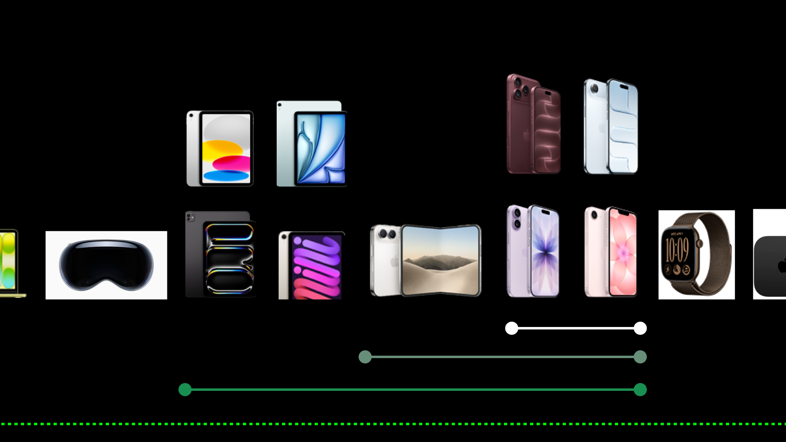

^ 先日も新製品が発表されましたが、iPhoneの類似デバイスは多様化しています。
^ これらのデバイスは細かい特徴が異なるものの、現時点ではWatchOSやmacOSと比べると類似性が高く、柔軟性を持たせる上での最初のステップとして良い題材になります。

---

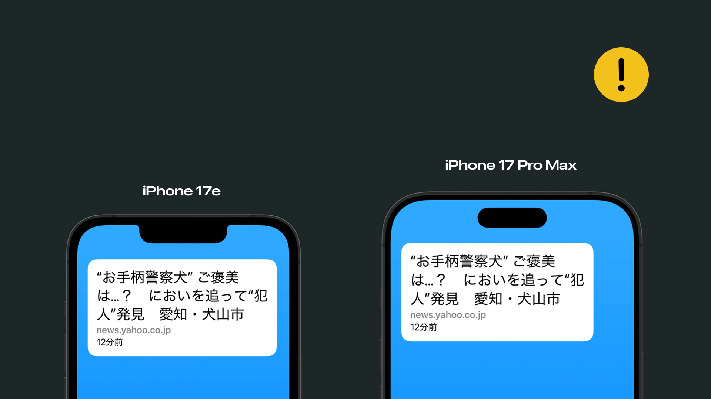

^ 例えば、iPhone17eとiPhone17 Pro Maxは同じ世代のiPhoneですが、主に画面サイズに違いがあります。
^ 17eのコンテキストだけを想定したUIを作ると、このように変な余白が生まれます。
^ また、サンプルのコンテンツだけを想定したUIにすると、テキスト量が変化するとテキストが切れてしまうと言ったことも発生します。

---

# 連続的なレイアウトのパターン

コンテナビューのサイズが変化する時の対応

1. コンテナビューにサイズを合わせる
2. ビューのサイズを優先する
    - 場合によってスクロールビューを挟む

^ 連続的なコンテナビューのサイズの変化に応じて、ビューが柔軟に変化する必要があります。
^ そして、その変化の受け止め方は、２つしかありません。コンテナビューのサイズに合わせるか、ビュー自身のサイズを優先するかです。

---

コンテナビューのサイズに合わせる

^ まず、コンテナビューのサイズに合わせる方法です。SwiftUIの`Rectangle`や`Color`のようなビューは、常にコンテナのサイズを満たすように伸縮します。

---

コンテナビューに合わせたスクロールビューを挟む

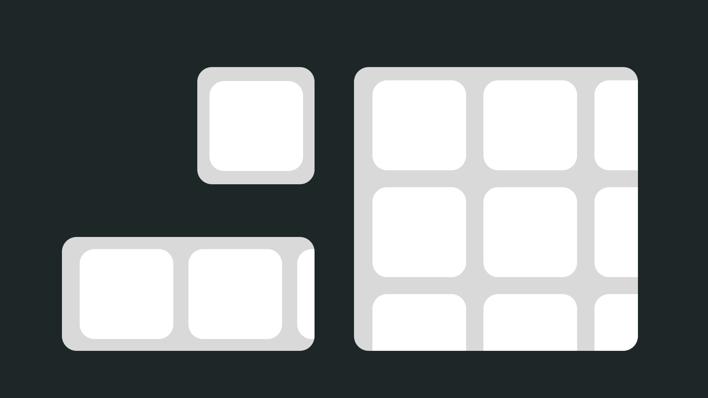

^ もう一つは、コンテナビューに合わせたスクロールビューを挟む方法です。SwiftUIの`ScrollView`や`List`のようなビューは、コンテナのサイズに合わせてスクロール可能な領域を作ります。
^ こうすることで、ビューのサイズを尊重しつつ、コンテナのサイズ変化に柔軟に対応できます。

---

固定サイズは問題が起きやすい

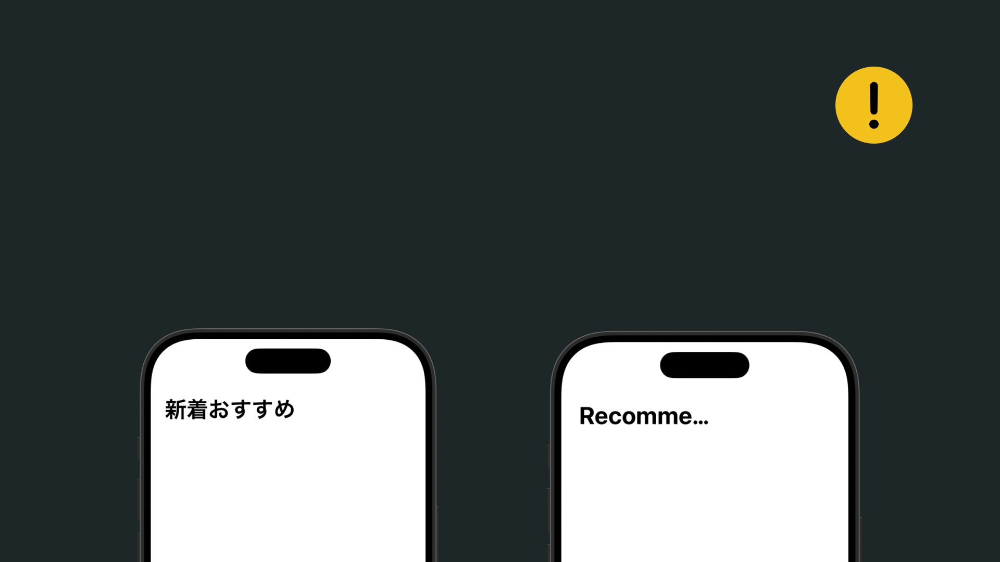

^ ただし、スクロールビューにビューを入れる場合でも、ビュー自体のサイズを固定にしてしまうと、コンテンツのサイズが変化したときに、ビューが切れてしまうことがあります。
^ 例えば、このようにテキストはローカリゼーションによって長さが変化することがあります。ビューのサイズを固定にしてしまうと、テキストが切れてしまいます。

---

ビュー自身のサイズを優先する

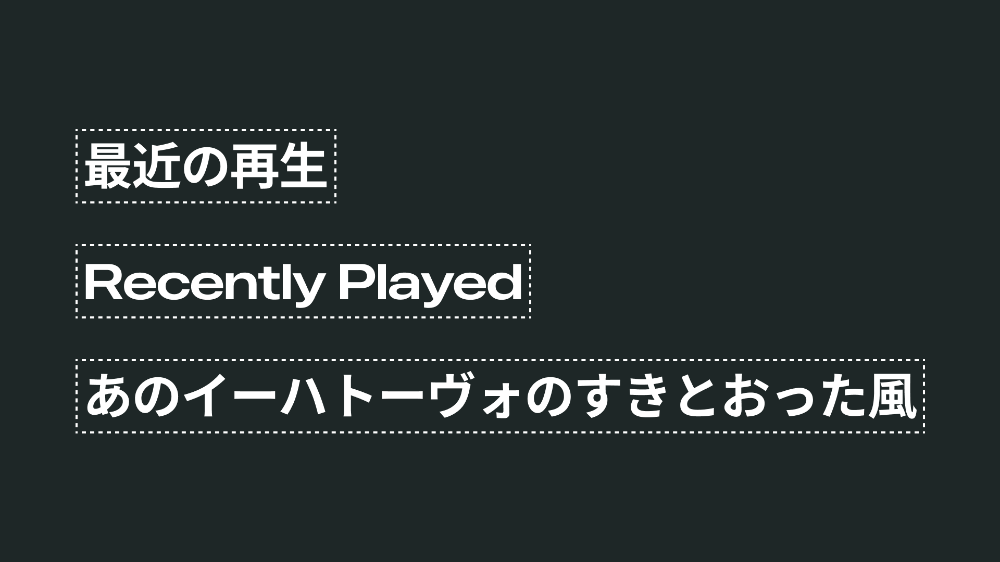

^ コンテンツ自身のサイズは、内容に応じて変化します。
^ 極力、ビューのサイズはコンテンツに合わせて変化するようにします。

---

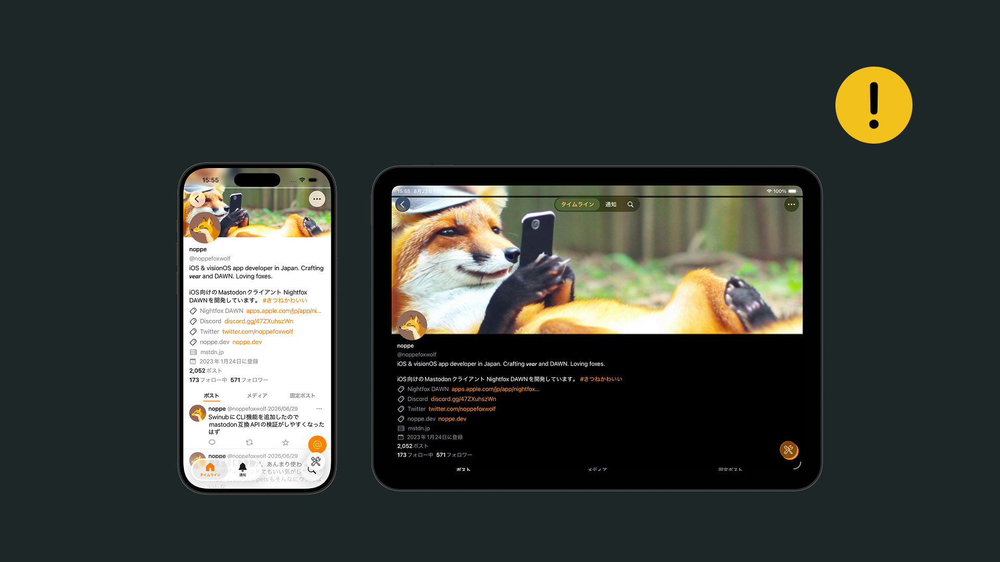

^ 連続的なレイアウトを使えば、どんなに極小な画面でも、巨大な画面でも、同じUIを使うことができます。
^ ただし、連続的なレイアウトの変化だけでは足りない場面もあります。
^ これは、私のアプリの例ですが、iPhoneとiPadで同じUIを使っています。
^ この画面のように、コンテナビューのサイズによっては、比率を保ったヘッダーや、余白が過剰になってしまうことがあります。

---

# 段階的なレイアウト

^ そんなときは伸ばし続けるのではなく、構造や表現そのものを切り替えます。

---

# 段階的なレイアウトのパターン

境界に応じて、構造や表現そのものを切り替える

- 表示する情報の量を変える
- 同じ情報群を格納・展開する
- レイアウトの構造を変える

^ 具体例を見ていきましょう。

---

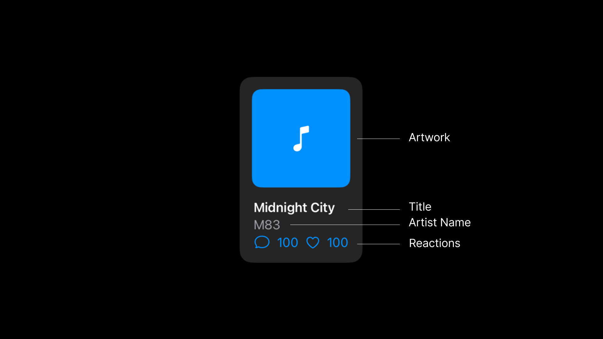

^ 例えば、このように音楽オブジェクトを表示するビューがあったとします。広い画面ではアートワーク、曲名、アーティスト名まで見せることができます。
^ しかし、ディスプレイのサイズなどのコンテキストによっては、全てを表示することができない場合があります。

---

## 表示する情報の量を変える

- 優先度の高いプロパティを残す
- 優先度は目的から逆算する

^ そこで、優先度の高いプロパティだけを表示して、表示する情報の量を変えてみます。
^ 連続的なレイアウトと異なり、段階的なレイアウトでは、構造や表現そのものを切り替えます。
^ ここでの優先度は、目的から逆算して決めます。たとえば、音楽オブジェクトの目的は「曲を選ぶこと」とした時に、曲名、アーティスト名、アルバム名の中で、どれが最も重要かを考えます。

---

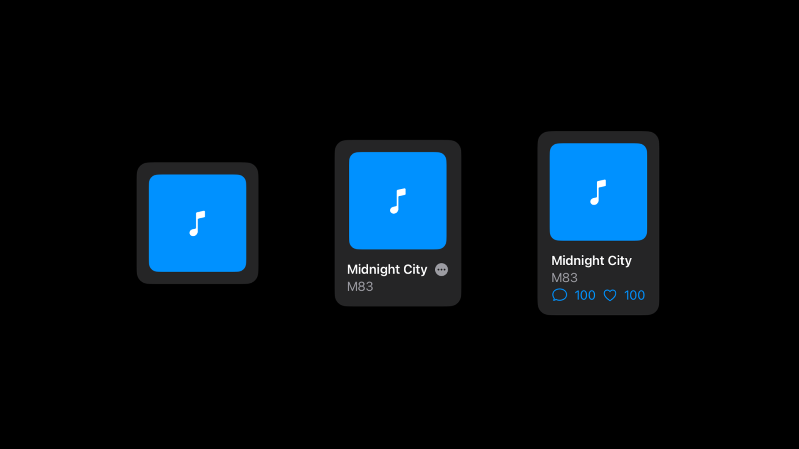

^ こうすることで、コンテナビューのサイズが小さくなっても、目的を達成するために必要な情報は残すことができます。
^ 実装面では、SwiftUIの`Layout`や`ViewThatFits`を使うことで、コンテキストに応じてレイアウトを切り替えることができます。

---

## 同じ情報群を格納・展開する

- セクション化して、格納・展開できるようにする。

^ 次に、同じ情報群を格納・展開する方法では、類似の情報のまとまりに名前をつけて、セクション化します。セクション化することで、状況に応じて格納・展開できるようになります。

---

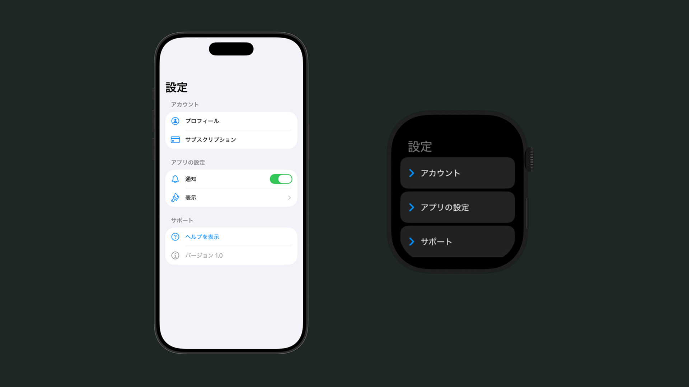

^ 例えば、このようにiPhoneでは全ての項目が表示されている設定画面があります。
^ 同じ設定画面をWatchOSで表示すると、画面が小さいため、全ての項目を表示することができません。そこで、セクション化して格納・展開できるようにします。
^ こうすることで、コンテナビューのサイズが小さくなっても、必要な情報を格納・展開することで、目的を達成するために必要な情報は残すことができます。
^ 逆に、画面が広くなる際は、アイコンなどで省略していた情報をラベル付きにするなど、この考え方は、情報の量を増やす場合にも応用できます。

---

# AIによる新しい段階的レイアウトのパターン

^ ところで、項目をセクション化するには、格納される情報が事前に分かっている場合に限られます。
^ では、事前に分からない情報、例えばユーザーが入力した文章や、ユーザーがアップロードした写真のような情報はどうでしょうか。
^ 最近は、オンデバイスで動作するAIが登場したことで、柔軟性の面でも新しい段階的レイアウトのパターンが生まれています。

---

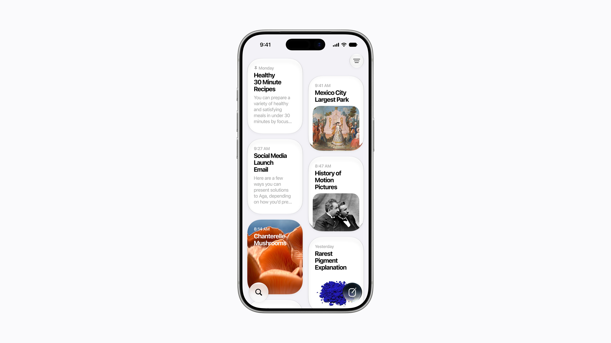

^ これは、iOS27のSiriアプリの例です。
^ ユーザーがSiriとした会話がそれぞれカードになっています。

---

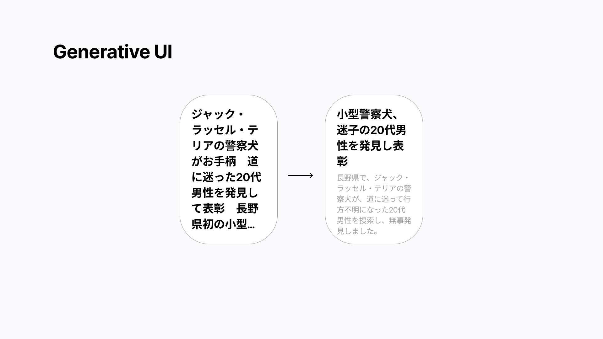

^ 実は、このカードのタイトルは、ユーザーがした会話の内容を要約して表示しています。
^ ユーザーの入力をそのまま表示すると左のように長くなってしまいますが、AIが要約することで右のように短く表示できます。
^ これによって、小さな画面や、限られたスペースでも、ユーザーの目的を達成するために必要な情報を残すことが出来るようになりました。
^ レイアウトだけでなく、AIを活用することで、コンテンツ自体の情報量を変化させることができるようになり、段階的なレイアウトのパターンが広がってきているのかなと思います。

---

連続的レイアウトと段階的レイアウトを組み合わせて柔軟性を実現する

^ さて、連続的と段階的なレイアウトを紹介しました。
^ 実際のプロダクトでは、この２つのレイアウトを組み合わせて柔軟性を実現していきます。
^ この動画のように、連続的なレイアウトでビューのサイズを変化させつつ、段階的なレイアウトで構造や表現そのものを切り替えることで、柔軟性のあるUIを実現できます。

---

# 段階的レイアウトの発展系

段階的なレイアウトはビュー内で完結するものに限らない
ナビゲーションを含む構造の切り替えにも活用できる

^ 段階的なレイアウトについて、もう少し深掘りしてみましょう。
^ 段階的なレイアウトは、ビュー内で完結するものに限らず、ナビゲーションを含む構造の切り替えにも活用できます。

---

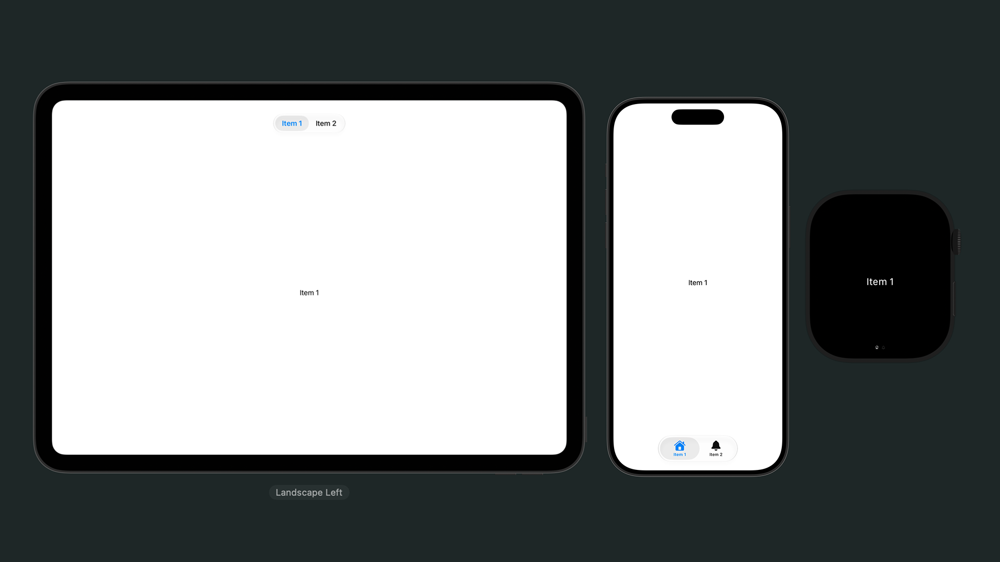

^ 例えば、このスライドのように、iPhoneとiPadではタブとして表示しているものを、Watchではカルーセルとして表示しています。
^ どちらも同じ目的を達成できますが、ナビゲーションを含む構造の切り替えをしています。
^ このように、構造の組み替えはその画面の中だけで解釈せず、アプリ全体の構造として捉えることで、より柔軟性のあるUIを発見できます。

---

# コンテナビューコントローラ

UIKitやSwiftUIでは、このような高度な段階的レイアウトを持たせたコンテナビューコントローラーを標準で提供している。

^ UIKitやSwiftUIでは、このような高度な段階的レイアウトを持たせたコンテナビューコントローラーを標準で提供しています。
^ いくつか例を見てみましょう。

---

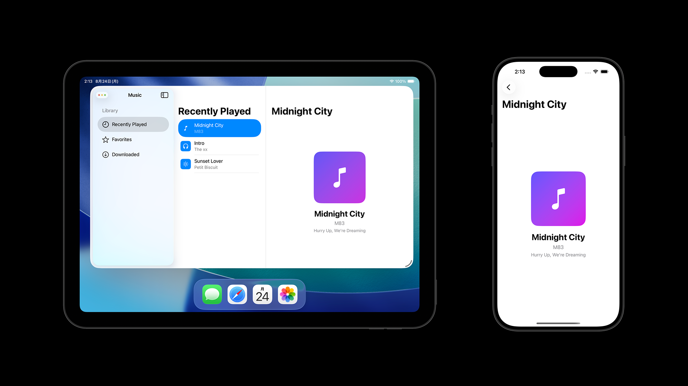

^ `UISplitViewController`は、iPadではサイドバーとコンテンツを並べて見せられます。
^ iPhoneでは各カラムを画面いっぱいに表示して、必要に応じて遷移します。できることは同じですが、ナビゲーション構造が変化しています。

---

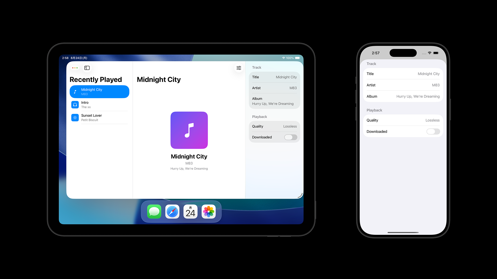

^ Inspectorも同じです。MacやiPadでは右側のカラムとして見せられます。
^ iPhoneで同じものを右から出すと画面が埋まってしまうため、下からシートのように出せます。

---

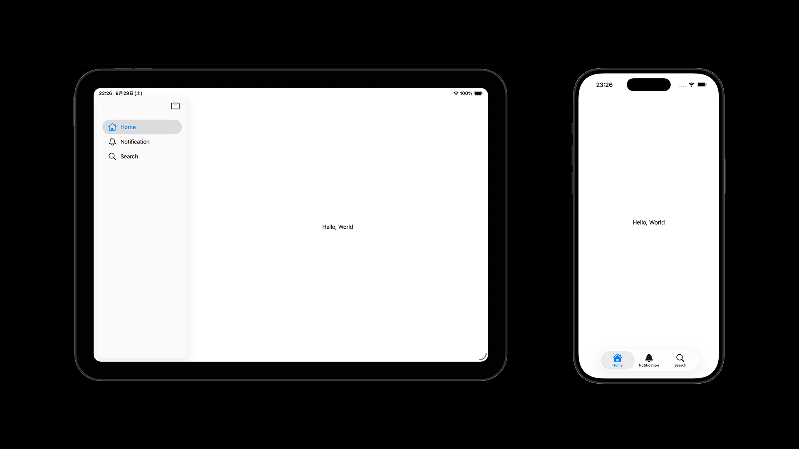

^ `UITabBarController`も、iPhoneでは下部にタブバーが、iPadではサイドバーのように表示されます。

---

# 標準UIは柔軟性においてベストプラクティス

- 複雑なコンテキストの変化に対応するためには、標準APIを使うのがベストプラクティス

- カスタム実装は、作り手が意識したコンテキストにしか対応できない

- 標準APIと同レベルの柔軟性を自作するなら、それなりの*覚悟*が必要

^ このように、標準のコンテナビューコントローラは、複雑なコンテキストの変化を吸収しています。
^ 今紹介した以外にも、私たちが意識しないコンテキストの変化や、将来的に発生する未知のコンテキストにも対応できるように実装されています。
^ 標準UIを使おうとよく言われるのは、こういう理由があるからです。
^ もし、標準APIと同レベルの柔軟性を自作するなら、それなりの覚悟を持って臨む必要があるんじゃないかなと思います。

---

# まとめ：アプリの柔軟性

---

# 絵としてのUIを作るのではなく、ユーザーの目的とコンテキストから導出されるUIを作る

---

# コンテキストをどこまで考慮できるかの勝負

---

# 自分以外の経験、異なる視点のユーザーの声に耳を傾ける

---

# 無限に存在するコンテキストの組み合わせに対して、作るべきものを見抜く

---

# ご清聴ありがとうございました
