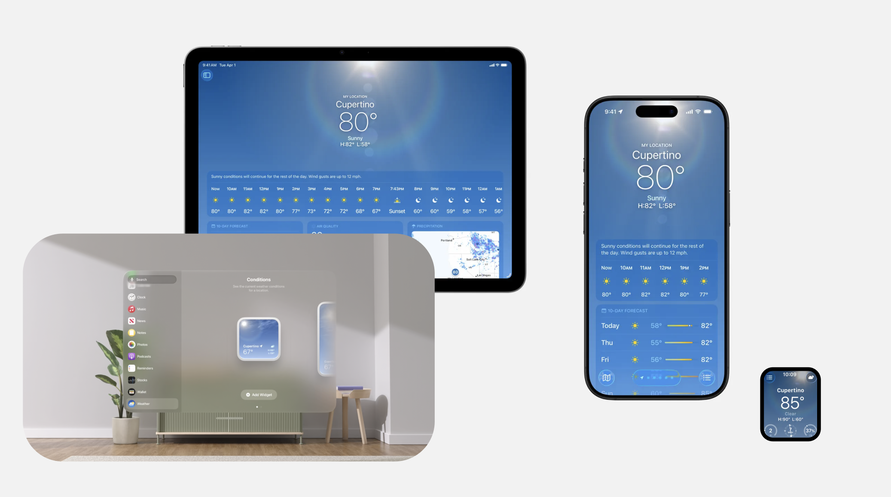

slidenumbers: true
background-color: #272729
theme: Fraunces, 4
text: #FFF, SF Pro
text-emphasis: SF Pro
text-strong: SF Pro
autoscale: true
header: #FFF, alignment(left), text-scale(0.5), SF Pro Text
header-emphasis: SF Pro Text
header-strong: SF Pro Text
slidenumber-style: SF Pro Text
footer-style: SF Pro Text
code: SF Mono

# 柔軟性のあるUIで、多くの環境でアプリを活躍させる
## iOSDC Japan 2026 / noppe

^ 「柔軟性のあるUIで、多くの環境でアプリを活躍させる」というタイトルでお話しします。よろしくお願いします。

---

# 自己紹介

## noppe

- DAWN for Mastodon
- Pococha at DeNA
- iOSDC 2018~


^ noppeといいます。DAWN for Mastodonという、Mastodon向けのアプリを作っています。
^ 仕事ではDeNAでPocochaの開発に携わっています。
^ iOSDCには2018年から毎年登壇しています。これまでは技術の話が多かったのですが、最近は「UIをどう環境に合わせるか」を考える時間が増えました。今日はその考え方を共有します。

---

# エピソード

^ 昨日で34歳になりました。子どもが2人いて、家と車も買って、ちゃんと人生をやっています。
^ その一方で、これまではずっとスマホの画面を中心に見てきました。スマホさえあれば、だいたい何でもできると思っていました。
^ でも子育てをしていると、画面を手に取れない場面が本当に多いです。送迎の車内でニュースを読んでもらう。両手がふさがっているときに家電を操作する。Apple Watchで予定だけ確認する。
^ スマホ以外にも、アプリがユーザーに届く入口が増えています。そこに柔軟に応えられることは、とても便利だと感じています。

---

# UIの柔軟性とは？

状況を問わずに価値を提供すること

^ 今日いうUIの柔軟性とは、単に画面が伸び縮みすることではありません。ユーザーの状況を問わず、必要な価値を届けられることです。
^ まず、身近な例から見てみます。

---



^ 例えば天気です。iPhone、iPad、Mac、Apple Watch、ウィジェット、Siri、CarPlay、StandBy。入口は違っても、「いまの天気を知りたい」という目的に応えています。
^ 同じ価値を、使える環境に合わせて届けている。これが今日扱う柔軟性です。

---

# アプリの前提が変わっている

- iPadOSがウィンドウシステムのOSになった
    - UIRequiresFullScreenが非推奨になる
- iPhone Mirroringがリサイズ対応に
    - DeviceHubでもリサイズ対応
- SceneDelegate移行の必須化
    - 同じアプリから複数の環境にシーンを出せるように

アプリは「どの環境でも柔軟に見た目を変えてくれるもの」という前提に。    

^ ここまでは、ハードウェアや利用場面の話でした。OSの側も、アプリを「環境に合わせて見た目を変えるもの」として扱う前提に変わってきています。
^ iPadOSはウィンドウを扱うOSになり、iPhone MirroringやDeviceHubではリサイズも起きます。さらに、複数のシーンを扱うことも前提です。
^ つまり、画面サイズに追従するだけでは足りません。状況に応じて価値を届けるためのUIとして、柔軟性を考えていきます。

---

## 柔軟性を持たせるとは

ユーザーの状況によらずに「やりたい」に応えること

^ 言い換えると、柔軟性を持たせるとは、ユーザーが置かれた物理的な状況によらず「やりたい」に応えることです。
^ Appleプラットフォームには、ユーザーとの接点になるハードウェアがすでにたくさんあります。Vision Proを外さずにメッセージを送る。泳いでいる最中にApple Watchで時間を確認する。アプリ側がその入口に応えられれば、価値を届けられる場面が増えます。

---

# UIに柔軟性を持たせるには

- 柔軟性を持つというのは、UIのどこかが変化することを許容するということ
- UIを観察して、どこが変化できるのかを考える必要がある

^ では、UIに柔軟性を持たせるにはどうすればよいでしょうか。
^ 柔軟性とは、UIのどこかが変化することを許容することです。足がどこでも曲がるのではなく、関節があるから動けるように、UIにも変化を受け止める「関節」があります。
^ まずは、それがどこにあるのかを観察します。

---

# UIを観察する

^ では、早速UIを観察していきましょう。

---

# UIを取り巻く要素

- 目的
- コンテキスト
- インターフェース

^ 全てのUIは、目的・コンテキスト・インターフェースの3つの要素が関係しています。

---

## 目的

「誰が・何を・どうしたい」

- 例： ユーザーはアプリを起動したい

^ 目的はUIの目的です。「誰が、何を、どうしたい」と言い換えてもよいです。

---

## コンテキスト

ユーザーやデバイスの状況

- iPadを使っている
- 怪我をしている
- 車を運転している

^ コンテキストは、ユーザーやデバイスの状況です。iPadを使っている、怪我をしている、車を運転している、といった状況です。

---

## インターフェース

最終的にユーザーが目的を実現するための手段

- ボタンを押す
- 音声で呼び出す
- 画面をスワイプする

^ インターフェースは、最終的にユーザーが目的を実現するための手段です。ボタンを押す、音声で呼び出す、画面をスワイプする、といった方法です。

---

# 例：ホーム画面

- 目的：ユーザーはアプリを選択して起動できる
- コンテキスト：iPhoneを使っている
- インターフェース：グリッドにアプリのボタンが並ぶ

^ たとえばホーム画面です。目的は「アプリを選択して起動すること」、コンテキストは「iPhoneを使っていること」、インターフェースは「グリッドにアプリのボタンが並ぶこと」です。

---

# インターフェースは複数存在することができる

^ ここで大事なのは、コンテキストによってインターフェースは複数存在することができる、ということです。

---

## インターフェース例：Apple Music

- ユースケース：ユーザーはApple Musicで音楽を選ぶことができる
- オブジェクト：音楽
- インターフェース
    - グリッドで音楽が並んでいる
    - リストで音楽が並んでいる

ユースケースとオブジェクトは同じだが、インターフェースは複数存在することができる。

^ Apple Musicなら、ユースケースは「音楽を選ぶこと」、オブジェクトは「音楽」です。
^ それをグリッドで見せるか、リストで見せるかは、インターフェースの選択です。目的と対象は変えずに、見せ方だけを変えられます。

---

## インターフェース例：ホーム画面

- ユースケース：ユーザーはアプリを選択して起動できる
- オブジェクト：アプリ
- インターフェース
    - グリッドでアプリボタンが並んでいる
    - アシスティブアクセス
        - 大きなボタンで表現される

インターフェースは必ずしも目にみえるUIである必要はない。

^ ホーム画面も同じです。通常はグリッドですが、アシスティブアクセスでは大きなボタンになり
^ どれも「アプリを選んで起動する」という同じ目的に応えています。

---


^ この図のように、中心にあるユースケースとオブジェクトは保ったまま、周囲のインターフェースは複数に分岐できます。
^ 今日の主題は、このインターフェースをどう柔軟に選ぶかです。

---

## コラム： デザインデータには柔軟性がない

- デザインデータは、特定の状態における正解の絵でしかない

^ ここで、デザインデータの見え方も変わります。デザインデータは、特定のデバイス・文字サイズ・コンテンツ量における「正解の一枚」です。
^ その一枚を忠実に再現するだけでは、別の状態でどう振る舞うかは決まりません。柔軟性は、絵の外側まで考えて初めて作れます。

---

# インターフェースは何によって決定するのか

- ユーザーの設定
- アクセシビリティ設定
- デバイス
- ウィンドウ・ビューコンテナのサイズ

^ 最終的にどのインターフェースが選ばれるかは、多くの状態によって決まります。ユーザー設定、アクセシビリティ設定、デバイス、ウィンドウやコンテナのサイズです。
^ たとえば、Dynamic Typeは文字の大きさを変え、デバイスとウィンドウは使える空間を変えます。

---

## 状態の多くはAPIとして提供されている

- Environment Values
- UITraitCollection
- UIScreen

^ こうした状態の多くは、Environment ValuesやUITraitCollectionなどのAPIとして取得できます。UIは、それらの状態を入力にして決められます。

---

# 全部のパターンを用意する

^ では、状態の組み合わせごとに、全部違うUIを用意すればよいのでしょうか。少し数えてみます。

---

2x10x2=40

^ ライト／ダークの2通りと、Dynamic Typeの10段階で、すでに20通りです。さらにiPhoneとiPadを掛けると40通りになります。
^ 向き、任意のウィンドウサイズ、アクセシビリティ設定まで含めれば、組み合わせはすぐに発散します。まだ存在しないデバイスにも対応できません。
^ 状態ごとに個別の画面を作る方法は、現実的ではありません。

---

# インターフェースに柔軟性を持たせる上で大事なこと

柔軟性は、`Adaptation`と`Flexibility`に分けられる。

^ そこで、個別の画面を増やす代わりに、二つの性質を使います。AdaptationとFlexibilityです。
^ Flexibilityは日本語でも柔軟性なので紛らわしいですが、ここでは「同じ構造のまま、伸び縮みして変化を受け止める力」とします。

---

# AdaptationとFlexibilityの違い

- Adaptation
    - コンテキストに応じて、構造や表現そのものを切り替える
- Flexibility
    - 同じ構造のまま、変化を受け止める

ざっくりとした状態の変化はAdaptationで対応し、連続的な状態変化はFlexibilityで対応することができる。

^ Adaptationは、コンテキストに応じて構造や表現そのものを切り替えることです。
^ Flexibilityは、同じ構造のまま変化を受け止めることです。
^ たとえば幅や文字量のように連続的に変わるものはFlexibilityで扱えます。一方、iPhoneからiPadのように性質が変わる境目では、Adaptationで切り替えます。

---

## コラム：画面に表示されないものも、同じ考え方ができる。

SiriやVoiceOverなど、GUIではないインターフェースも存在する。
今日はGUIの話をメインにするが、これらも状況に応じて切り替えられるインターフェースであることを忘れてはいけない。
特別なインターフェースなのではなく、状況に応じて切り替えられるインターフェースの一つである。

^ 少し余談ですが、画面に出てくるGUIも、選ばれたインターフェースの一つです。
^ 音声で操作したい状況ならSiri、画面を読む状況ならVoiceOverがあります。今日はGUIを中心に見ますが、これらも同じ考え方の延長にあります。

---

# Flexibilityを持たせるテクニック


GUIにおけるFlexibilityについて考える時は

- そのビューが置かれるコンテナのサイズが変化すること
- そのビューのコンテンツのサイズが変化すること

この２つが変化することを許容する必要がある。

^ GUIでFlexibilityを考えるときは、変化を二種類に分けると分かりやすいです。
^ 一つは、ビューが置かれるコンテナのサイズ。もう一つは、テキストの量のようなコンテンツ自身のサイズです。どちらの変化も受け止められるようにします。

---

## コラム：Flexibilityの無いUIの例


固定値のサイズを持つビュー
コンテナサイズをiPhone18から18 Pro変えると余白が生まれた。柔軟性がないので違和感がある。
また、コンテンツのテキストが変化してもビューのサイズは変化しないので、テキストが切れてしまう。柔軟性がないので違和感がある。

^ まず、Flexibilityがない例です。固定値のサイズを持つビューを考えます。
^ 想定より広いコンテナに置くと、不自然な余白が残ります。逆に、ユーザー入力やローカライズで文字が増えてもサイズが変わらなければ、内容が切れてしまいます。
^ どちらも、変化を許容していないことから生まれる違和感です。

---

## コンテナのサイズ変化に適応する

SwiftUIのColorなどがそう。
常にコンテナのサイズを満たすように広がる。
コンテナがどんなサイズでも適応できる。

^ まずコンテナのサイズ変化です。SwiftUIの`Color`のようなビューは、親のサイズを満たすように広がります。
^ 色を塗るという目的は変えずに、ウィンドウやデバイスに合わせてレイアウトだけが伸び縮みします。

---

## コンテナのサイズ変化に適応する

コンテンツがある場合はscaleで対応することもある。
TextやImageなどがそう。

^ 中身があるビューでは、画像の表示サイズや、要素どうしの比率を変えて受け止めることもあります。
^ ただし、縮めれば解決とは限りません。読めること、操作できることを保つ範囲で、伸縮させます。

---

## コンテナのサイズ変化に適応する2

コンテナの中に擬似的に無限のコンテナ空間を作ることで、入りきらない問題を解決してFlexibilityを持たせることができる。

^ もう一つはスクロールです。
^ 見えているコンテナが小さくても、その内側には必要なだけの空間を作れます。入り切らない問題を、ユースケースや構造を変えずに受け止められます。

---

## コンテンツのサイズ変化に適応する

SwiftUIのTextなどがそう。
テキストの内容に応じてサイズが変化する。
中身がどんなに変化しても、ビューのサイズは中身に応じて変化する。

^ 次はコンテンツ自身のサイズ変化です。SwiftUIの`Text`は、内容に応じて自分のサイズを変えます。
^ 表示する文字が増えれば、必要な大きさへ自然に広がります。ユーザー入力や翻訳文のように、事前に長さを決めにくいものほど重要です。

---

# Flexibilityを持たせてもユースケースは変わらない

- 伸縮
- スクロール
- コンテンツによるサイズ変化

いずれも、ユースケースは変わらない。

^ 伸縮、スクロール、コンテンツに応じたサイズ変化。見た目は変わりますが、ユースケースは変わりません。
^ 目的を保ったまま、連続的な変化を受け止める。これがFlexibilityです。

---

# Flexibilityだけでは不十分な場合がある


- コンテナのサイズによっては過剰なサイズになってしまうことがある

そこでAdaptationを持たせることで、状況に応じて構造や表現そのものを切り替えることができる。

^ ただし、Flexibilityだけでは足りない場面もあります。
^ たとえばApple Watch向けの密度のUIをiPadでそのまま伸ばすと、余白が過剰になり、画面を活かせません。
^ そんなときは伸ばし続けるのではなく、Adaptationで構造や表現そのものを切り替えます。

---

# Adaptationを持たせるテクニック

- 省略・拡張
- 折り畳み・展開
- レイアウトの切り替え

状況に応じて、構造や表現そのものを切り替える

^ Adaptationの代表的な手段は、省略・拡張、折り畳み・展開、そしてレイアウトの切り替えです。ここでも、ユースケースとオブジェクトは保ちます。

---

## 省略・拡張


オブジェクトは同じだが、表示するプロパティを省略する。

^ 省略・拡張では、オブジェクトは同じまま、表示するプロパティを変えます。
^ 広い画面ではアートワーク、曲名、アーティスト名まで見せる。小さなコンテナではアートワークを中心にする。何を残すかを選ぶことで、同じ対象にアクセスできます。

---

## 状態によって、レイアウトを切り替える

少しコードの話も入れると、SwiftUIにはViewThatFitsというビューがある。
このビューは、複数のビューを受け取り、コンテナのサイズに応じて最適なビューを選択して表示する。

```swift
ViewThatFits {
    label
        .labelStyle(.titleAndIcon)
    label
        .labelStyle(.titleOnly)
    label
        .labelStyle(.iconOnly)
}
```

この時、各要素にプライオリティを持たせるのが大事。

^ コードでいうと、SwiftUIには`ViewThatFits`があります。複数の候補を渡すと、コンテナに収まる最初のビューを選んで表示してくれます。
^ 大切なのは、候補を並べる順番です。何を残し、何を省略するかには優先順位があります。曲名、アーティスト名、アルバム名なら、どれを最優先にするかをオブジェクトの性質として先に決めておきます。

---

## 折り畳み・展開


セクション化して、状況に応じて折り畳む・展開する。

^ 繰り返しの要素は、セクションにして折り畳むこともできます。
^ 広い画面では一覧を展開し、小さな画面では「フォロワー」のような見出しに畳んで、必要なときだけ開いてもらう。
^ 情報の出し方は変わっても、小さな画面で同じユースケースを満たせます。

---

# コラム： Generative UI

これまで省略が難しかったUGCのタイトルなどを圧縮する事ができるようになった。
オブジェクトの内容をそのままUIに反映することが多かったが、オブジェクトの内容を要約してUIに反映することができるようになった。
写真の重要な箇所を切り出してサムネにするとか

^ 最近の例としては、Generative UIもあります。
^ UGCのタイトルのように、どれくらい長くなるか制御しにくいものは、従来は扱いづらい対象でした。
^ いまはAIがオブジェクトの内容を要約してUIに反映できます。会話から短いタイトルを作る、写真の重要な箇所をサムネイルに切り出す、といった方法です。
^ 省略できなかったものを、内容を保ちながらコンパクトに表現できるようになっています。

---

## 状態によって、レイアウトを切り替える


Textはとても良いお手本。
基本的にコンテンツのサイズを満たすように広がるが、コンテナのサイズが小さくなった場合は、改行を行う。
コンテナの縦のサイズも小さくなった場合は、truncationを行う。
このように、状況に応じて構造や表現そのものを切り替えることで、柔軟性を持たせている。
この場合でもユースケースやオブジェクトは変わらない。

^ `Text`はとてもよいお手本です。まず内容に合わせて広がります。
^ 幅が足りなくなると改行して高さを増やし、さらに高さも足りなくなると末尾を省略します。
^ 状況に応じて表現を切り替えているので、ここにはAdaptationがあります。それでも、伝えたいテキストというオブジェクトとユースケースは変わりません。

---

## これらを組み合わせてUIは柔軟性を持つ


- スケーリング
    - どこかで切り離す
- 比率
    - どこかで切り離す

^ 実際のUIは、ここまでの組み合わせで作ることが多いです。
^ 途中までは比率や余白をFlexibilityで受け止め、過剰になったところで最大サイズに止める、または別のレイアウトへ切り替える。そこにAdaptationを使います。

---

# Adaptationはビュー内で完結するものに限らない

ビュー内で完結するものに限らず、Adaptationの「状況に応じて構造や表現そのものを切り替える」という考え方は、ナビゲーションを含む構造の切り替えにも活用できる。

^ Adaptationは、ビューの中だけの話ではありません。ナビゲーションを含む、もっと大きな構造の切り替えにも使えます。

---

## ナビゲーションを伴う切り替え


- iPhoneのタブバー
- Watchのタブバー

これらは同じユースケース・オブジェクトを満たすインターフェースであるが、状況に応じて構造や表現そのものを切り替えることで、柔軟性を持たせている。

^ たとえばiPhoneとApple Watchの項目切り替えです。
^ どちらも「見たい項目を選ぶ」というユースケースは同じです。ただ、Apple Watchでは一覧で項目を選び、次の画面で内容を見せることがあります。
^ iPhoneと同じ目的を、別のナビゲーション階層で実現している例です。

---

# コンテナビューコントローラ


UIKitでは、このような高度なAdaptationを持たせたコンテナビューコントローラーを標準で提供している。

[Make your UIKit app more flexible](https://developer.apple.com/jp/videos/play/wwdc2025/282)

^ UIKitには、構造レベルのAdaptationを持つコンテナビューコントローラが標準で用意されています。
^ ここからは、同じユースケースを環境に合わせてどう見せ替えるか、具体例で見ていきます。

---
    
## コンテナビューコントローラの例: UISplitViewController


^ `UISplitViewController`は、iPadではサイドバーとコンテンツを並べて見せられます。
^ iPhoneでは各カラムを画面いっぱいに表示して、必要に応じて遷移します。できることは同じで、最適な構造だけを切り替えています。

---

## コンテナビューコントローラの例: inspector


^ Inspectorも同じです。MacやiPadでは右側のカラムとして見せられます。
^ iPhoneで同じものを右から出すと画面が埋まってしまうため、下からシートのように出せます。内容は同じでも、提示方法を変えています。

---

## コンテナビューコントローラの例: compact-adaptation


https://swift.mackarous.com/posts/2024/10/modifiers-presentation-compact-adaptation/

^ compactな環境では、提示方法を自動で変える`presentationCompactAdaptation`もあります。
^ サイズが変わったときに、見た目だけではなく、提示の構造まで変える例です。

---

## コンテナビューコントローラの例: UITabBarController


^ `UITabBarController`も、環境に応じてタブの位置や表現を変えられます。
^ コンテナビューコントローラは、こうした構造のAdaptationを自分で実装するときのよいお手本になります。

---

# 状態はサイズだけではない


コンテナサイズの柔軟性を担保すると、どんな大きさの画面にもアプリが表示できるようになる。
しかし、CarPlayなど特徴的なハードウェアはサイズだけで語れないものがある。
考え方は同じ、ユースケースは変えずに構造や表現を切り替えることで対応する。

^ ここまでは主にサイズの話でした。コンテナサイズへの柔軟性を担保すれば、さまざまな大きさの画面に表示できます。
^ ただしCarPlayのような特徴的なハードウェアは、サイズだけでは語れません。仮にiPadと同じ大きさでも、運転中に使う画面にiPadと同じUIが最適とは限りません。
^ それでも考え方は同じです。ユースケースを保ちながら、構造や表現を切り替えます。

---

## ソフトウェアキーボード：WatchOSとiOS


同じ文字を入力するというユースケース
音声入力が代用される。
ユースケースを見直すことも大事。元々のソフトウェアキーボードを「キーを押すことができる」というユースケースにしていては、音声入力などの代替手段を考慮できない。

^ watchOSとiOSの文字入力は分かりやすい例です。
^ どちらも「文字を入力する」というユースケースを満たしますが、Watchでは音声入力などが中心になり、iPhoneではソフトウェアキーボードが出ます。
^ もしユースケースを「キーを押すこと」と狭く定義していたら、音声入力という代替手段にはたどり着けません。状況に合わせるには、ユースケースを適切な粒度で捉えることも大切です。

---

## macOSのボタン、iOSのボタン


サイズ感は大きく変わらないが、プラットフォームのトンマナを採用している。

^ macOSとiOSのボタンも同じです。大きさ自体は極端に変わらなくても、各プラットフォームのトーン&マナーに合わせています。
^ 指で触るのか、ポインタで操作するのか。入力方法や利用環境に合わせて表現を変えています。

---

# 柔軟性の判断フロー

1. ユースケースが独立したビューを決める
2. そのユースケースと提供したい環境のパターンを出す
3. パターン内の連続性をFlexibilityを使って解決する
4. パターンの中にさらなるパターンを見つける
5. サブパターンの境界でAdaptationを使って解決する

^ 最後に、柔軟性を判断する流れをまとめます。
^ まず、独立したビューとして扱うユースケースを決めます。次に、そのユースケースを提供したい環境の大きなパターンを出します。
^ パターンの中で連続的に変わるものはFlexibilityで受け止めます。たとえば、近い画面サイズの差です。
^ さらに性質の変わる境界を見つけたら、そこでAdaptationを使います。iPhoneとiPadだけでなく、iPhoneの縦横で切り替えてもよい、ということです。

---

# ここまで

状態ごとのUIと、Flexibility／Adaptationを理解した

^ ここまでで、状態によってインターフェースが決まり、FlexibilityとAdaptationで柔軟性を作る、という話をしました。
^ 最後に、これを実装へ落とすときのポイントを少しだけ見ます。

---

# 実装について

動的に変更することを考慮する必要がある
ただし、今のところ動作中にプラットフォームが変化することは無い

^ 実装では、UIが動的に変わることを前提にします。
^ 一方で、動作中にiPhoneが突然Apple Watchになることはありません。プラットフォームごとの構造と、実行中に変化し得る状態を分けて設計します。

---

# 動的な環境変化に対応する

起動時の状態が常に保たれるわけではない
状態駆動レイアウトで実装する必要がある

^ 起動時の状態が、ずっと保たれるとは限りません。
^ ウィンドウサイズ、Dynamic Type、アクセシビリティ設定は実行中にも変わります。状態を入力としてUIを更新する、状態駆動のレイアウトとして実装する必要があります。

---

# カスタムUIを作る覚悟

１つの状態を視覚化した１つのグラフィックを見て、これを作るのが簡単だと思うのは浅はか
実際は今日説明した通り、ユースケースとオブジェクトは同じでも、状態ごとにインターフェースが変化することを考慮する必要がある
多くの状態を想定し、複雑な状態であっても成り立つUIを想定出来るのが良質なUIデザイナーである
ネイティブUIコンポーネントを使うことで、その大部分の状態をカバーできる。

^ 一つの状態だけを描いたグラフィックを見て、「これなら簡単に作れそう」と考えるのは危険です。
^ 実際には、同じユースケースとオブジェクトでも、状態によってインターフェースが変わります。多くの状態で成り立つUIまで想像して初めて、実装の見積もりができます。
^ ネイティブのUIコンポーネントを使うことは、その多くを最初からカバーする有力な選択肢です。

---

# 最後に

UIは「状態」を入力に、「インターフェース」を出力する

ユースケースは保ち、状況に応じて表現を変える

^ 最後に。UIは静的な絵ではなく、状態によって変化するものです。
^ FigmaやSketchにあるデザインは、ある状態における一枚の絵です。それをそのまま実装するだけでは、柔軟性は生まれません。
^ UIは状態を入力にして、見た目を出力する関数のようなものです。ただし、必ずモデルからUIを生成しなければいけない、という話ではありません。絵から始めることで、自然にユーザーの期待へ応えられる場面もあります。
^ 大事なのは、状況を問わずユーザーの「やりたい」に応えることです。そのために、UIのどこを変化させられるかを観察してみてください。ありがとうございました。
^ ユーザがそれぞれ個性的であるように、ソフトウェアの利用方法もひとり一人異なります。デザインでこれを意識すればするほど、ユーザは気軽に使えるようになります。自分以外の経験にも目を向け、できるだけ多くのデバイス、操作の種類、および視点に対応するよう努めてください。

<!--
# memo

- ハードウェアの特徴を活かす
- iPadはHIGでは「fluidly resizable」
- navigation が adaptive なら “reflow to any width” できる
- 画面の回転もウィンドウのサイズ変更も結局scene sizeの変更として考えられる
    https://developer.apple.com/jp/videos/play/wwdc2025/282
    Make your UIKit app more flexible
    この考え方ができるようになったのも、全てのOSでトンマナが統一され始めたから
- HIGと同じように「状態」と言う言葉を使いたい
- コンテナVCの話はWWDCの話をして、これを自分でも作るという話にしていく　
- ウィンドウシーン・コンテナVC・コンポーネントで分離してもいいかも
- 実装観点
    - トップレベルに行くほど抽象的になるべき
- 宣言的UIは努力なしでこのバインディングを行える　
- 子供のブロックを作例にしたいかも？
- AdaptationはFigmaにない

- Apple MusicのMirroringの例を見たりすると良い

- 余白の多さに対しては、畳み込んでいるものを展開することで対応することができる
-->
