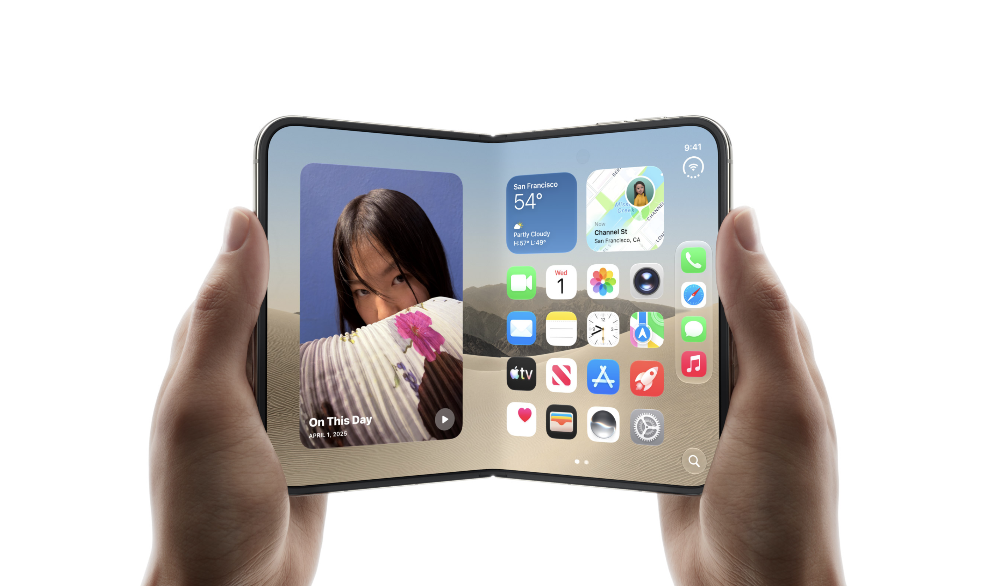
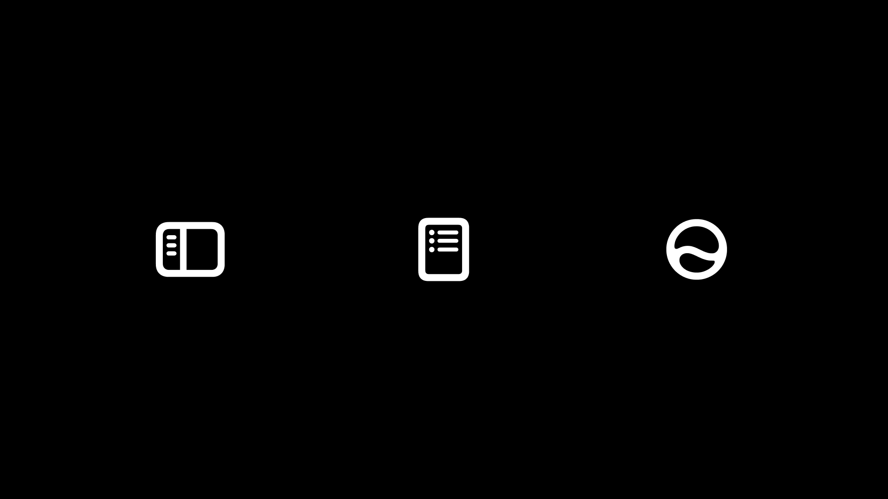

slidenumbers: true
background-color: #272729
theme: Fraunces, 4
text: #FFF, SF Pro
text-emphasis: SF Pro
text-strong: SF Pro
autoscale: true
header: #FFF, alignment(left), text-scale(0.5), SF Pro Text
header-emphasis: SF Pro Text
header-strong: SF Pro Text
slidenumber-style: SF Pro Text
footer-style: SF Pro Text
code: SF Mono

^ 「柔軟性のあるUIで、多くの環境でアプリを活躍させる」というタイトルでお話しします。よろしくお願いします。

---

# noppe

- DAWN for Mastodon
- Pococha at DeNA

^ まず自己紹介です。noppeといいます。このキツネのアイコンで活動しています。
^ 仕事では、DeNAという会社で、ライブ配信を通じてユーザー同士が交流するアプリ、Pocochaを開発しています。

---

^ 個人では、分散型のSNSであるMastodon向けに、DAWN for Mastodonというクライアントアプリも作っています。

---

# iOSDCでUIの話をする

^ iOSDCには2018年から記憶が正しければ、毎年登壇させていただいているかなと思います。
^ これも聞いてくださる皆さんのおかげだと思います、本当にありがとうございます。
^ さて、昨年まではiOSDCでパフォーマンスやグラフィックスなど、技術的な話をしてきました。
^ しかし、今年はUIについての話をします。ここの心境の変化というか、私が考えていることについて最初にお話しします。

---

# UIについて考えていること

^ みなさんご存知の通り、最近はAIを使ってアプリを作ることがかなり簡単になってきています。
^ そうなると、コードにせよUIにせよ、「何を良いとするか」という人間の判断が、より重要になると思っています。
^ そして「コードの良し悪し」というのは、昔から議論され、言語化されてきました。
^ 一方で、UIの良し悪しは、まだまだ言語化されていない部分が多いと感じています。
^ もちろんUIには、センスや感覚で判断する部分もあります。
^ でも、だからといって全部を「センス」で済ませていると、UIに関わる部分が全体のボトルネックになります。
^ そこで、言語化できる判断は言語化して、機械的に判断できるようにする。そのうえで、最後に残るものを人間が判断するというのがいいのかなと思います。
^ 今日のトークを聞いて、UIをこう解釈した人がいるんだ。自分はどう考えてるかな。と、少しでも考えるきっかけになれば嬉しいです。

---

# ライフステージの変化とUIの柔軟性

^ もう一つ、UIの柔軟性を考えるようになった個人的なきっかけがあります。
^ 昨日で34歳になりました。若い頃というのは、スマホがあればだいたい何でもできると思っていました。時々、タブレットとかを持っている人を見ると、「なんでそんなものを持っているんだろう」と思っていました。
^ でも子育てをしていると、スマホを手に取れない場面が本当に多いです。子供を保育園に送った後に車を運転しながらCarPlayでニュースを読んでもらう。両手がふさがっているときにSiriで家電を操作する。Apple Watchで予定だけ確認する。
^ 実際に、自分の身になってみると、スマホ以外のデバイスで同じアプリが使えることのありがたみを感じます。
^ これが、UIの柔軟性を考えるきっかけになりました。

---

# UIの柔軟性とは？

状況を問わずに価値を提供すること

^ 今日は、後半にレイアウトの話をしますが、本質的にはUIの柔軟性とは、単に画面が伸び縮みすることでは無いかなと思います。
^ 柔軟性というのは、ユーザーの状況を問わず、アプリの提供する価値を届けられることです。
^ どういうことか、まず、身近な例から見てみます。

---

^ 例えば天気アプリです。
^ 「今の天気を知りたい」と思ってiPadで天気アプリを開くと、このように天気や予報を一覧できます。

---

^ iPhoneやApple Watchでも、天気を確認できます。画面の大きさも表示する情報の量も違いますが、「天気を知りたい」という目的は同じです。

---

^ さらに、ウィジェットでも同じように、天気の情報が表示されます。
^ 柔軟性があるアプリっていうのは、同じ価値を、使える環境に合わせて届けているということかなと思います。

---

# アプリの前提が変わっている

単一の画面サイズを前提にできなくなっている

^ そして、一方でOS側も、アプリを単一の画面サイズに固定されたものとして扱わない方向に変わってきています。

---

^ 例えば、iPadOSはUIRequiresFullScreenが非推奨になり、ウィンドウベースのOSになりました。
^ 固定のウィンドウサイズではなく、ユーザーが自由にウィンドウサイズを変えられるようになりました。

---

^ これはiPadOSに限った話ではなく、macOS Golden GateからはiPhone Mirroring上のiOSアプリもリサイズできるようになりました。

---

^ さらに、UISceneDelegateへの移行によって、アプリが単一の固定された画面だけを持つ、という前提も薄れています。

---

^ そして、これまで縦長だったiPhoneの画面も、先日登場したiPhone Ultraによって、「iOSアプリは縦長」という前提だけでは考えにくくなってきました。

---

# 環境の変化が前提になった

- ウィンドウサイズが変わる
- 同じアプリが異なる環境に表示される
- 画面の形そのものも変わる

^ つまり、iPhone専用のアプリとして作ってきたとしても、これからOSはアプリを「どの環境でも柔軟に見た目を変えてくれるもの」として扱うようになってきています。
^ 当然、そのような前提に合わせて、ユーザーの期待値というのも変わってきます。
^ 要するに、環境を問わずアプリが柔軟に見た目を変えてくれることが、特別なことではなく、当たり前のことになっていく、ということです。

---

^ そして、ここまで見てきたように、Appleプラットフォームには、ユーザーとの接点になるハードウェアや仕組みがすでにたくさんあります。
^ ユーザーはこれらすべての接点を通じてアプリとやり取りしようとします。
^ ただ、気をつけなければいけないのは、柔軟性とはプラットフォームや環境ごとに全く別のものに変化するというわけではない、ということです。
^ どういうことか、UIの構造を整理してみると分かりやすいです。

---

# UIを観察する

^ まず、UIとユーザーの関係から見ていきましょう。

---

^ この図では、左がアプリ、中央がUI、右がユーザーです。
^ 右にいるユーザーはこの図のようにインターフェースを通して左側のアプリと対話をしています。

---

^ この関係を、ユーザーの目線から見ると、アプリにはユーザーが達成したい「目的」があり、ユーザーには取り巻く環境である「コンテキスト」があります。
^ つまりユーザーがアプリを使うという行為のには「目的」「コンテキスト」「インターフェース」の3つが関係していることが分かります。

---

## 目的

ユーザーが実現したいこと

- 例： 音楽を再生したい、写真を撮りたい

^ 「目的」というのは、ユーザーが実現したいことです。
^ たとえば「音楽を再生したい」とか「写真を撮りたい」といったことです。

---

## コンテキスト

ユーザーが置かれている状況

- iPadを使っている
- 怪我をしている
- 車を運転している
- 周囲が暗い など

^ そしてコンテキストは、ユーザーが置かれている状況です。
^ 例えば、iPadを使っている、怪我をしている、車を運転している、周囲が暗い、といった情報です。

---

## インターフェース

最終的にユーザーが目的を実現するための手段

- ボタンがある
- 音声で呼び出せる
- 画面をスワイプできる
- など

^ 最後にインターフェースは、ボタンがある、音声で呼び出せる、画面をスワイプできる、など、最終的にユーザーが目的を実現するための手段です。

---

# 例：ホーム画面

- 目的：アプリを起動する
- コンテキスト：iPhoneを使っている
- インターフェース：グリッドにアプリのボタンが並ぶ

^ これらを、実際のケースに当てはめて考えてみましょう。
^ たとえばホーム画面を例にすると、
^ ユーザーの目的は「アプリを起動すること」、コンテキストは「iPhoneを使っていること」、インターフェースは「グリッドにアプリのボタンが並ぶこと」です。
^ このように、UIを３つの要素で説明することができます。

---

# Q.３つの要素のうち、何を柔軟にするのか

^ 次に、これらの要素のうち、アプリ開発者が実際にコントロールできるものはどれなのかを考えてみます。
^ そのために、３つの要素のうち２つを固定して、残りの１つにどんな柔軟性が要求されるのかの思考実験をしてみます。
^ 先ほどの「アプリを起動する」という例で、ユーザーが車を運転している場面を考えます。何を固定すると、何を変える必要があるのかに注目してください。

---

# 目的とインターフェースが固定

コンテキストを変える必要がある

- 目的：アプリを起動する
- インターフェース：グリッドにアプリのボタンが並ぶ

- コンテキスト：車を運転している → 車を止めて、スマホを操作する

^ 最初は、目的とインターフェースを固定します。「アプリを起動したい」「画面に並んだボタンで操作する」という２つは変えません。
^ 運転中にはその操作ができないので、安全な場所に車を止めてからスマホを操作する必要があります。
^ つまり、ここで変えることになるのは、ユーザーのコンテキストです。

---

# 目的とコンテキストが固定

インターフェースを変える必要がある

- 目的：アプリを起動する
- コンテキスト：車を運転している

- インターフェース：ボイスコマンドでアプリを起動できる

^ 次は、固定する組み合わせを変えます。目的とコンテキスト、つまり「アプリを起動したい」「運転中である」を固定します。
^ 今度は車を止めて操作する、という変え方はできません。そこで、インターフェースを変える必要があります。
^ 例えば、インターフェースを「ボイスコマンドでアプリを起動できる」と変えることで、ユーザーは運転中でも目的を達成することができます。

---

# インターフェースとコンテキストが固定

目的を変える必要がある

- コンテキスト：車を運転している
- インターフェース：グリッドにアプリのボタンが並ぶ

- 目的：アプリを起動する → 断念・延期する

^ 最後は、インターフェースとコンテキストを固定します。「画面に並んだボタンで操作する」「運転中である」という２つは変えません。
^ この状態ではスマホを操作できないので、「アプリを起動したい」という目的をそのまま達成することはできません。
^ 安全な運転を優先して、アプリの起動を断念するか、後回しにする必要があります。
^ つまり、ここで変わるのは、ユーザーの目的です。

---

|固定する要素|柔軟性が求められる要素|
|---|---|
|目的とインターフェース|コンテキスト|
|目的とコンテキスト|インターフェース|
|インターフェースとコンテキスト|目的|

^ このように、UIの３つの要素のうち、どれを固定するかによって、柔軟性を持たせるべき要素が決まります。
^ さて、皆さんはどの要素を柔軟にするのが良いと思いますか。
^ 目的はユーザーが決めるものですし、置かれた状況も簡単に変えられるとは限りません。その２つを受け止めるために、アプリ自身がインターフェースを柔軟に変化させる、ということになります。

---

# A.インターフェースを柔軟にする

^ 柔軟性はインターフェースに持たせることは分かりました。
^ しかし、アプリ自身がインターフェースを柔軟に変化させるとは、具体的にはどういうことなのでしょうか。

---

# 同じ目的に、複数のインターフェースを持てる

^ ここで重要なのは、インターフェースは複数存在することができる、ということです。
^ 実際のアプリで見てみましょう。

---

^ Apple Mapを例に上げてみましょう。このアプリの目的は「目的地にたどり着くこと」です。
^ この時、インターフェースは地図の表示、音声、触覚をユーザーのコンテキストに応じて提供しています。
^ これはユーザーの手にiPhoneを持っている場合、車を運転している場合、歩いている場合など、コンテキストに応じてインターフェースが切り替わる、ということです。

---

^ もう一つの例として、ホーム画面を見てみましょう。目的は「アプリを選ぶこと」です。
^ ユーザーのアクセシビリティによって、右の画面のようなアシスティブアクセスの大きなボタンのインターフェースが選ばれることもあります。
^ そしてこの場合でも、ユーザーは「アプリを選ぶ」という同じ目的を達成できます。

---

^ このように、複数のインターフェースを提供することで、ユーザーは目的とコンテキストを変えずに目的を達成することができます。

---

[.footer: p=purpose]

^ Apple Mapやホーム画面の例を見ると、目的が同じでも、コンテキストが変われば適したインターフェースが変わることが分かりました。
^ つまり、考え方としてはこの式のように、理想のインターフェースというのは目的とコンテキストから導出できる、と捉えることができます。
^ 実際には、CarPlayに「対応する」とか、VoiceOverに「対応する」という感じで、ケースごとに実装していくことにはなりますが、こう考えておくことで、コンテキストの差を見つけたときに、インターフェースには別の姿があるのではないかと疑えるようになるのではないかなと思います。

---

# デザインデータは「ある条件での正解」

^ 余談ですが、この考え方で、普段見ているデザインデータも捉え直してみます。

---

^ みなさん、普段アプリを実装するときに、デザインデータを見ながら作ることが多いかなと思います。
^ この時、皆さんはデザインデータをどう見ていますか。
^ 特に最近では、デザインデータから直接AIで実装に落とすことも増えてきていて、デザインデータをある種の設計図として見ている人も多いのではないでしょうか。
^ 先ほどの式に当てはめると、「デザインデータ」に描かれているインターフェースとは、ある特定のコンテキストの中で、ある特定の目的を達成するためのインターフェースの一つに過ぎません。
^ なので、デザインデータをそのまま実装すると、柔軟性がないUIになってしまいます。
^ 大事なのは、描かれている画面をそのまま再現することではなくその画面が、どんな条件から導かれたのかを読み取ることです。
^ デザインデータは設計図というより、ある条件に対する一つの出力例として見るとよいかなと思います。

---

# インターフェースは目的とコンテキストによって決定する

- 現実世界のコンテキスト
   - 車を運転している
   - 老眼である
- ソフトウェアのコンテキスト
   - ウィンドウのサイズ
   - ダークモードなど

^ ここまで、インターフェースはコンテキストによって変わる、という話をしてきました。
^ では実際にアプリがコンテキストに応じてインターフェースを変えるには、まずそのコンテキストを知る必要があります。
^ ただ、コンテキストなら何でもアプリから分かるわけではありません。
^ そこで一度、コンテキストを「どこで生まれているか」という観点で分けて考えてみます。
^ 大きく分けると、ユーザー自身や周囲の環境に由来する現実世界のコンテキストと、アプリやOSの中で生まれるソフトウェア上のコンテキストがあります。
^ たとえば、車を運転している、老眼である、といったものは現実世界のコンテキストです。
^ 一方で、ウィンドウのサイズやダークモードといったものは、ソフトウェア上のコンテキストです。

---

^ ところが、困ったことにアプリからはソフトウェアのコンテキストは取れても、現実世界のコンテキストの多くは取ることができません。
^ たとえば、ユーザーが車を運転しているかどうかや老眼かどうかなどは、アプリからは分かりません。
^ これでは、現実世界のコンテキストに応じたインターフェースの切り替えができません。

---

^ そこで、OSやデバイスは、現実世界の状況に対応する情報を、アプリから扱える形で提供します。
^ たとえば、「ユーザーが車を運転している」という情報そのものは取得できませんが、「CarPlay上で動作している」という利用環境は分かります。
^ 同じように、「ユーザーが老眼である」ということは分かりませんが、「ユーザーがどの文字サイズを要求しているか」は分かります。
^ アプリはこうした情報を受け取ることで、現実世界のさまざまな状況に適したインターフェースを提供できます。
^ ちなみに、アプリ側で対応する必要のないコンテキストは渡ってこないこともあります。
^ たとえばTrue ToneやNight Shiftのように、OSやデバイス自身が表示を調整してくれるものについては、基本的にアプリ側で意識する必要は無いので取得することができません。

---

^ 現実コンテキストのうち、アプリで考慮すべきものは、ソフトウェアコンテキストと同じようにアプリから取得できるAPIとして提供されます。
^ こうしたコンテキストの多くは、SwiftUIのEnvironment ValuesやUITraitCollectionなどのAPIとして取得できます。UIはそれらの状態に適したインターフェースを提供します。

---

# 全部のパターンを用意する？

^ ここまでの話で、アプリはコンテキストに応じてインターフェースを切り替える必要があることが分かりました。
^ では、取得したコンテキストの組み合わせごとに、全部違うUIを用意すればよいのでしょうか。

---

^ しかし、考えうるコンテキストというのは、無限に存在します。たとえば、ユーザーのアクセシビリティ設定、デバイス、ウィンドウのサイズ、ダークモードなどだけでも、組み合わせは無限にあります。そして、まだ考慮されていない条件にも対応できません。
^ コンテキストごとに個別のインターフェースを作る方法は、現実的ではありません。

---

# コンテキストの変化にどう応答するか

- 連続的な適応
- 段階的な適応

^ 次は、コンテキストが変化した際にどうすればコスパよくインターフェースを変化させられるかを考えてみます。
^ コンテキストの変化に対して、同じ構造や表現のまま連続的に追従する方法と、ある境界で構造や表現そのものを切り替える方法に分けて考えてみましょう。

---

連続的な適応

^ 同じインターフェースのまま目的を十分に達成できる範囲では、構造や表現を変えずに連続的に適応します。
^ たとえば、ビューのサイズや文字量が変化しても、伸縮やスクロールによって同じ構造のまま目的を達成できる場合があります。

---

段階的な適応

^ コンテキストが変化していくと、ある地点から、別のインターフェースの方が目的を達成しやすくなることがあります。
^ そのときは、同じインターフェースを伸縮させ続けるのではなく、構造や表現そのものを段階的に切り替えます。
^ 連続的な適応と異なり、明確に切り替えが起こるブレークポイントが存在します。

---

^ 例えば、この動画のように、ある幅を境にサイドバーUIに切り替わるようなUIは、段階的な適応の例です。
^ ブレークポイントを境に、インターフェースを切り替えています。

---

^ ちなみにこの考え方は、画面を見て操作するGUIと、音声で操作するVUIのように、コンテキストによって適したインターフェースそのものが大きく変わる場合にも、同じ考え方ができます。

---

# ブレークポイントの見つけ方

- 増えすぎると実装パターンが増えてしまう
- 少なすぎるとインターフェースが十分に適応できない
- 同じインターフェースのまま、目的を十分に達成できるかどうか

^ ブレークポイントが増えすぎると、実装パターンが増えてしまい実装コストが上がります。
^ また、少なすぎると、インターフェースが十分に適応できず、ユーザーの目的を達成しにくくなります。
^ ブレークポイントを設定する際は、同じインターフェースのまま、目的を十分に達成できるかどうかを基準に考えるとよいでしょう。

---

# 休憩

^ はい、ということで、ここまでで前半の話は終わりです。少し休憩を挟みましょう。
^ 前半はかなり概念的な話になってしまいましたが、後半はGUIに注目して、このコンテキストへの応答の考え方をレイアウトの話に落とし込んでいきます。

---

# 連続的レイアウトと段階的レイアウト

^ ここからは、前半で整理した考え方を、実際のUIのレイアウトに適用してみましょう。
^ 同じ構造のまま伸縮させるのが連続的なレイアウト、境界で構造や表現を切り替えるのが段階的なレイアウトです。まずは画面サイズの違いから見ていきます。

---

# 多様化するiPhoneライクデバイス

- iPhone
- iPhone 17e
- iPhone 17 Pro
- iPhone 17 Pro Max
- iPad
- iPad mini ...etc

^ 先日も新製品が発表されましたが、iPhoneの類似デバイスは多様化しています。
^ これらのデバイスは細かい特徴が異なるものの、現時点ではWatchOSやmacOSと比べると類似性が高く、柔軟性を持たせる上での最初のステップとして良い題材になるかなと思います。

---

^ 例えば、iPhone17eとiPhone17 Pro Maxは同じ世代のiPhoneですが、主に画面サイズに違いがあります。
^ 17eのコンテキストだけを想定したUIを作ると、このように変な余白が生まれます。
^ また、サンプルのコンテンツだけを想定したUIにすると、テキスト量が変化するとテキストが切れてしまうと言ったことも発生します。

---

# 連続的なレイアウトのパターン

枠のサイズが変化する時の対応

1. 枠にサイズを合わせる
2. ビューのサイズを優先する

^ この余白の問題は、枠のサイズ変化にどう対応するか、という点にあります。
^ ここでいう枠は、中のビューを収める枠のことです。
^ 枠のサイズが変わったとき、中身を枠に合わせるのか、それとも中身のサイズを優先するのか。この２つを見ていきます。

---

枠のサイズに合わせる

^ まず、枠のサイズに合わせる方法です。この例では、異なる枠の大きさに対して画像が常に満たすように伸縮しています。
^ こうすることで、枠のサイズが変化しても、余白が生まれず、枠いっぱいにビューを表示できます。

---

枠に合わせたスクロールビューを挟む

^ もう一つは、枠に合わせたスクロールビューを挟む方法です。SwiftUIの`ScrollView`や`List`のようなビューは、枠のサイズに合わせてスクロール可能な領域を作ります。
^ こうすることで、中に入れるビューのサイズを尊重しつつ、枠のサイズ変化に柔軟に対応できます。

---

固定サイズは問題が起きやすい

^ ただし、スクロールビューにビューを入れる場合でも、ビュー自体のサイズを固定にしてしまうと、コンテンツのサイズが変化したときに、ビューが切れてしまうことがあります。
^ 例えば、このようにテキストはローカリゼーションによって長さが変化することがあります。ビューのサイズを固定にしてしまうと、テキストが切れてしまいます。

---

ビュー自身のサイズを優先する

^ そこで、ビュー自身のサイズを優先するときも、固定の数値ではなく、内容に必要なサイズを基準にします。
^ この文字を囲む枠のように、内容が変われば、それを収めるビューも変わるようにしておきます。

---

^ ここまでの方法で、同じUIを画面サイズの変化に追従させられます。
^ ただし、連続的なレイアウトの変化だけでは足りない場面もあります。
^ これは、私のアプリの例ですが、iPhoneとiPadで同じUIを使っています。
^ この画面のように、枠のサイズによっては、比率を保ったヘッダーや、余白が過剰になってしまうことがあります。

---

# 段階的なレイアウト

^ そんなときは伸ばし続けるのではなく、構造や表現そのものを切り替えます。

---

# 段階的なレイアウトのパターン

境界に応じて、構造や表現そのものを切り替える

- 表示する情報の量を変える
- 同じ情報群を格納・展開する
- レイアウトの構造を変える

^ 具体例を見ていきましょう。

---

^ 例えば、このように音楽オブジェクトを表示するビューがあったとします。広い画面ではアートワーク、曲名、アーティスト名まで見せることができます。
^ しかし、ディスプレイのサイズなどのコンテキストによっては、全てを表示することができない場合があります。

---

## 表示する情報の量を変える

- 優先度の高いプロパティを残す
- 優先度は目的から逆算する

^ そこで、優先度の高いプロパティだけを表示して、表示する情報の量を変えてみます。
^ 連続的なレイアウトと異なり、段階的なレイアウトでは、構造や表現そのものを切り替えます。
^ ここでの優先度は、目的から逆算して決めます。たとえば、音楽オブジェクトの目的は「曲を選ぶこと」とした時に、曲名、アーティスト名、アルバム名の中で、どれが最も重要かを考えます。

---

^ こうすることで、コンテナビューのサイズが小さくなっても、目的を達成するために必要な情報は残すことができます。
^ 実装面では、SwiftUIの`Layout`や`ViewThatFits`を使うことで、コンテキストに応じてレイアウトを切り替えることができます。

---

## 同じ情報群を格納・展開する

- セクション化して、格納・展開できるようにする。

^ 次に、同じ情報群を格納・展開する方法では、類似の情報のまとまりに名前をつけて、セクション化します。セクション化することで、状況に応じて格納・展開できるようになります。

---

^ 例えば、このようにiPhoneでは全ての項目が表示されている設定画面があります。
^ 同じ設定画面をWatchOSで表示すると、画面が小さいため、全ての項目を表示することができません。そこで、セクション化して格納・展開できるようにします。
^ こうすることで、コンテナビューのサイズが小さくなっても、必要な情報を格納・展開することで、目的を達成するために必要な情報は残すことができます。
^ 逆に、画面が広くなる際は、アイコンなどで省略していた情報をラベル付きにするなど、この考え方は、情報の量を増やす場合にも応用できます。

---

# AIによる新しい段階的レイアウトのパターン

^ ところで、項目をセクション化するには、格納される情報が事前に分かっている場合に限られます。
^ では、事前に分からない情報、例えばユーザーが入力した文章や、ユーザーがアップロードした写真のような情報はどうでしょうか。
^ 最近は、オンデバイスで動作するAIが登場したことで、柔軟性の面でも新しい段階的レイアウトのパターンが生まれています。

---

^ これは、iOS27のSiriアプリの例です。
^ ユーザーがSiriとした会話がそれぞれカードになっています。

---

^ 実は、このカードのタイトルは、ユーザーがした会話の内容を要約して表示しています。
^ ユーザーの入力をそのまま表示すると左のように長くなってしまいますが、AIが要約することで右のように短く表示できます。
^ これによって、小さな画面や、限られたスペースでも、ユーザーの目的を達成するために必要な情報を残すことが出来るようになりました。
^ レイアウトだけでなく、AIを活用することで、コンテンツ自体の情報量を変化させることができるようになり、段階的なレイアウトのパターンが広がってきているのかなと思います。

---

連続的レイアウトと段階的レイアウトを組み合わせて柔軟性を実現する

^ さて、連続的と段階的なレイアウトを紹介しました。
^ 実際のプロダクトでは、この２つのレイアウトを組み合わせて柔軟性を実現していきます。
^ この動画のように、連続的なレイアウトでビューのサイズを変化させつつ、段階的なレイアウトで構造や表現そのものを切り替えることで、柔軟性のあるUIを実現できます。

---

# 段階的レイアウトの発展系

段階的なレイアウトはビュー内で完結するものに限らない
ナビゲーションを含む構造の切り替えにも活用できる

^ 段階的なレイアウトについて、もう少し深掘りしてみましょう。
^ 段階的なレイアウトは、ビュー内で完結するものに限らず、ナビゲーションを含む構造の切り替えにも活用できます。

---

^ 例えば、このスライドのように、iPhoneとiPadではタブとして表示しているものを、Watchではカルーセルとして表示しています。
^ どちらも同じ目的を達成できますが、ナビゲーションを含む構造の切り替えをしています。
^ このように、構造の組み替えはその画面の中だけで解釈せず、アプリ全体の構造として捉えることで、より柔軟性のあるUIを発見できます。

---

# コンテナビューコントローラ

UIKitやSwiftUIでは、このような高度な段階的レイアウトを持たせたコンテナビューコントローラーを標準で提供している。

^ UIKitやSwiftUIでは、このような高度な段階的レイアウトを持たせたコンテナビューコントローラーを標準で提供しています。
^ いくつか例を見てみましょう。

---

^ `UISplitViewController`は、iPadではサイドバーとコンテンツを並べて見せられます。
^ iPhoneでは各カラムを画面いっぱいに表示して、必要に応じて遷移します。できることは同じですが、ナビゲーション構造が変化しています。

---

^ Inspectorも同じです。MacやiPadでは右側のカラムとして見せられます。
^ iPhoneで同じものを右から出すと画面が埋まってしまうため、下からシートのように出せます。

---

^ `UITabBarController`も、iPhoneでは下部にタブバーが、iPadではサイドバーのように表示されます。

---

# 標準UIは柔軟性においてベストプラクティス

- 複雑なコンテキストの変化に対応するためには、標準APIを使うのがベストプラクティス

- カスタム実装は、作り手が意識したコンテキストにしか対応できない

- 標準APIと同レベルの柔軟性を自作するなら、それなりの*覚悟*が必要

^ このように、標準のコンテナビューコントローラは、複雑なコンテキストの変化を吸収しています。
^ 今紹介した以外にも、私たちが意識しないコンテキストの変化や、将来的に発生する未知のコンテキストにも対応できるように実装されています。
^ 標準UIを使おうとよく言われるのは、こういう理由があるからです。
^ もし、標準APIと同レベルの柔軟性を自作するなら、それなりの覚悟を持って臨む必要があるんじゃないかなと思います。

---

# まとめ：アプリの柔軟性

---

# 絵としてのUIを作るのではなく、ユーザーの目的とコンテキストから導出されるUIを作る

---

# コンテキストをどこまで考慮できるかの勝負

---

# 自分以外の経験、異なる視点のユーザーの声に耳を傾ける

---

# 無限に存在するコンテキストの組み合わせに対して、作るべきものを見抜く

---

# ご清聴ありがとうございました
