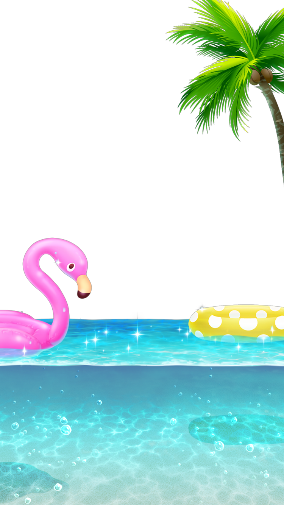

footer: 🦊 @noppefoxwolf, 2018
slidenumbers: true

> ライブ配信アプリのアイテム再生をMetalで実装する事になった話
-- iOSDC Japan Track B 2018/09/02 11:20〜

^ よろしくお願いします。
^ 「ライブ配信アプリのアイテム再生を、Metalで実装する事になった話。」というタイトルで発表します。
^ 本トークは、実際のユースケースを元に動画像の編集・表示の領域に関して興味を持っていただくこと
^ また、GPUを操作するOpenGLESやMetalなどのレイヤーを実装の選択肢として持っていただくことを目的としています。
^ ライブ配信技術自体に関する点については、本トークでは扱いませんのでご了承ください。

---

#[fit] noppe

🏢 株式会社ディー・エヌ・エー
🦊 きつね好き
💻 ２０１０〜


^ まず、自己紹介をさせてください。
^ 株式会社ディー・エヌ・エーでiOSアプリエンジニアをしているnoppeと言います。
^ 動物の狐が好きで、プロフィール画像も狐です。きつねのシャツ着ているのがいたら話しかけてください。
^ アプリ開発は独学で2010年ごろから続けていて、今年で８年目です。
^ これまで個人のアカウントで、アドベンチャーノベルゲームやTwitterクライアントをAppStoreでリリースしてきました。
^ OpenGLやMetalなどのGPU周りは今年に入ってから触り始めました。
^ 既に//TODO
^ 今回は、これらのGPU周りの学習に置いて手頃な事例を用意出来たと思うので触ったことの無い方も//TODO

---

今日の話
・Pocochaの紹介
・アイテムのエフェクトの再生手法
・再生手法の実装比較
・まとめ

^ さて、今日お話する内容についてですが、最初に弊社でリリースしているライブ配信アプリのPocochaの紹介をします。
^ そのあとで、アプリで使われているアイテムのエフェクト再生手法を解説します。
^ 次に、それらの再生手法をUIKit、OpenGLES、Metalでそれぞれ実装した結果について解説します。
^ 最後に今日のセッションのまとめをします。
^ なお今回のセッションでは、解説の関係上実際リリースされているアプリと仕様が異なる箇所があります。ご了承ください。
^ 本日は30分程度になりますが、ぜひ最後までよろしくお願いいたします。

---

#[fit] ライブ配信アプリPococha（ポコちゃ）の紹介

^ それでは最初に弊社からリリースされているライブ配信アプリPocochaを紹介させてください。

---

# Pococha (ポコちゃ)

- ライブ配信アプリ

- 2017 〜

- 高性能な美肌・美顔フィルター

- アイテムによるコミュニケーション

<!-- //Pocochaの画像、できれば右側に動画でおいてもいいかも -->


^ Pocochaは、2017年初頭にリリースしたライブ配信アプリです。
^ どこでも手軽にスマホで縦型のライブ配信ができ、視聴者はコメントやアイテムを使って配信枠を盛り上げたりといったコミュニケーションが楽しめます。
^ また高機能な美顔・美肌フィルターを搭載していて、コンディションを問わず配信を始められるのも特徴です。
^ 今日はそんな機能の中でも、アイテムがどのような技術で再生されているのかの話をします。

---

#[fit] アイテムのエフェクトの再生手法

^ アイテムの話をする前に、Pocochaのアイテムがどのようなギミックなのかを見て見ましょう。

---

<!-- アイテムが再生される様子 -->


^ はい、このように視聴者はアイテムを選択して使うことができます。
^ アイテムを使用すると配信者・視聴者の両方の画面でエフェクトが再生されます。
^ 昨今のライブ配信アプリでは、このようなアイテムの概念が必ずと言っていいほど導入されておりアイテムの表現力もサービス差別化の上で重要になってきます。
^ Pocochaでは、多くのアイテムで画面全体を覆う派手なエフェクトを採用しています。

---

## アイテムのエフェクト

- 750 × 1334
- 60fps 
- 透過色あり
- 5秒

<!-- アイテムエフェクトの動画 -->


^ 先ほどのデモではどういった仕様のエフェクトが再生されているかというと
^ 750x1334の透過情報を持ったエフェクトが60fpsで再生されていました。
^ このようななめらかで、高解像度のアニメーションエフェクトが配信中や視聴中といった高負荷な状況やiPhone5cなどの低スペックな端末上でも再生されます。
^ アイテム素材は、AfterEffectsプロジェクトから任意の形式で書き出して実装します。

---

## [fit] アイテムのエフェクトをiOS上で再生するには

^ それでは、先ほどのような仕様のエフェクトをどうやって実装したのか。
^ 課題を踏まえながら解説します。

---

### ① AVPlayerで再生する

```swift
let url = Bundle.main.url(forResource: "item_effect",
                          withExtension: "mov")!
let asset = AVURLAsset(url: url)
let item = AVPlayerItem(asset: asset)
let player = AVPlayer(playerItem: item)
let playerLayer = AVPlayerLayer(player: player)
playerLayer.backgroundColor = UIColor.clear.cgColor

view.layer.addSubLayer(playerLayer)
player.play()
```

^ 最初に試したのは、AVPlayerLayerに書き出したmovファイルを再生させる手法です。
^ movを試したのはQuickTimeフォーマットはRGB+Alphaのチャンネルをサポートしているからです。

---

### ① AVPlayerで再生する

[.code-highlight: 1-2]

```swift
let url = Bundle.main.url(forResource: "item_effect",
                          withExtension: "mov")!
let asset = AVURLAsset(url: url)
let item = AVPlayerItem(asset: asset)
let player = AVPlayer(playerItem: item)
let playerLayer = AVPlayerLayer(player: player)
playerLayer.backgroundColor = UIColor.clear.cgColor

view.layer.addSubLayer(playerLayer)
player.play()
```

^ AVPlayerはMOVファイルをサポートしているので、そのまま呼び出します。
^ ちなみにmovファイルはそのままでは500MBくらいありました。

---

### ① AVPlayerで再生する

[.code-highlight: 7]

```swift
let url = Bundle.main.url(forResource: "item_effect",
                          withExtension: "mov")!
let asset = AVURLAsset(url: url)
let item = AVPlayerItem(asset: asset)
let player = AVPlayer(playerItem: item)
let playerLayer = AVPlayerLayer(player: player)
playerLayer.backgroundColor = UIColor.clear.cgColor

view.layer.addSubLayer(playerLayer)
player.play()
```

^ 透過情報を持つmovなので、背景色を透過します。結果は

---

<!-- //AVPlayerを透過した結果の動画 -->


^ このように透過情報が反映されません。

---

### ② UIImageViewで再生する

```swift
let imageView = UIImageView()
let images = (0...300).compactMap({
  UIImage(named: "\($0).png")
})
imageView.animationImages = images
imageView.startAnimating()
```

^ 次に試したのは、UIImageViewです。

---

### ② UIImageViewで再生する

[.code-highlight: 5-6]

```swift
let imageView = UIImageView()
let images = (0...300).compactMap({
  UIImage(named: "\($0).png")
})
imageView.animationImages = images
imageView.startAnimating()
```

^ UIImageViewには、animationImagesというプロパティがあり
^ ここにUIImageの配列を与えてstartAnimationを呼ぶことで
^ パラパラ漫画のようにアニメーションさせる事ができます。

---

### ② UIImageViewで再生する

```shell
$ ffmpeg -i input.mov images/output_%04d.png
```

^ 今回はffmpegを使って、movファイルを300枚のpng画像に分割しました。

---

### ② UIImageViewで再生する

```shell
$ ffmpeg -i input.mov images/output_%04d.png
```

```shell
$ du -sh ./images
289M    ./images
```

☺️

^ ちなみに、容量は300MB程度ありました。
^ では実行した結果を見てみましょう。

---

### ② UIImageViewで再生する

<!-- //pngシーケンスの動画 -->


^ 一見すると、うまく動いているように見えます。
^ しかし実はstartAnimationを読んでから数秒経ってから再生されています。
^ これは、animationImagesを設定したタイミングで5秒分のpngファイルを読み込んでいるからだと思われます。

---

### ② UIImageViewで再生する

<!-- //メモリめっちゃ使っているの図 -->


^ また、メモリを瞬時に1GB程度使っています。
^ これはこのコードの検証に利用したiPhoneXではギリギリ耐えられていますが、iPhone5sなどではアプリが「」で落とされてしまいます。
<!-- ^ 極端なことをするのは無駄ではない、勉強になった -->
<!-- ^ パフォーマンスを意識する上で気にかけることができる -->

---

## 検証から分かった２つの課題感

- 動画自体の容量
- 再生パフォーマンス

^ 検証からわかったことは、まず動画自体の容量をどうにかしないといけないことです。
^ そして、再生時にはメモリに大きく負荷がかかることです。
^ メモリを圧迫することでCPUやバッテリーに影響が出ます。
^ 端末は配信や視聴もしているのでそんなに余裕はない
^ Pocochaを出した当初は8fps程度までフレームレートを落としてanimationImagesを使って実装していました。
^ しかし表現力の点で、競合に引けを取らないためにも仕組みを変える必要がありました。

---

## 動画自体の容量

|||
|---|---|
|movファイル|493MB|
|連番PNGファイル|302MB|

^ 容量が大きいと、アプリをダウンロードする時間が増えたり、
^ オンデマンドで取得する場合はモバイルデータ通信を使い過ぎてしまう問題があります。
^ そこで、これらのファイルを圧縮する事にしました。

---

### ファイルの圧縮で必須な要件

- 透過情報を持っている
- fpsを落とさない
- 縦横のサイズを変更しない

^ 圧縮するために必要な要件があります。
^ 透過情報を持っている
^ fpsを落とさない
^ 縦横のサイズを変更しない
^ これらをmovやpngで満たしつつ、大きくファイル容量を減らすのは不可能に近いです。
^ そのため、アニメーションをサポートした画像フォーマットや、圧縮率の高い動画フォーマットに変換する事に決めました。

---

// いきなり表にしていいかも

^ なかなか良いフォーマットがありません。
^ 透過できないことを除けば、全体的にはmp4(h264)が良さそう


<!-- MOV
Webm VP8 with alpha
https://www.reddit.com/r/explainlikeimfive/comments/2p4a6c/eli5_the_difference_between_html5_video_webm_and/
GIF
APNG
WEBP

残念ながらmp4は透過に対応していない

---

- WEBM
https://github.com/brion/OGVKit

透過対応してなかったりする、あと不安定
ハードウェアデコーダとソフトウェアデコードの観点
h265の圧縮効率

---

- PNG/JPG
ネイティブサポート

---

- GIF
https://github.com/kirualex/SwiftyGif
GIFを1フレームごとにUIImageに変換して、独自のループの中でUIImageView.imageを差し替えている
一般的な非対応フォーマットの対応の仕方
普通はUIImageViewを使うので使い勝手が良い

---

- APNG
https://github.com/onevcat/APNGKit
libpng
APNGImageView: UIView
一度UIImageに変換してからCGImageをlayer.contentsに設定
これはUIImageViewと同じ仕組み

---

- WEBP
libWEBP

---

- MP4
h264
透過情報持てない
デフォで対応

---

- MOV
透過情報が持てる

---

表
|iOSで再生できるか|圧縮率|透過|

^計測
^なかなか良さげなフォーマットがない -->

---

// alpha maskの立ち絵の図

^ 昔ゲームを作っていた時
^ 透過PNGが使えなかった当時、jpgでalpha maskして透過していた。
^ この手法は今回使えそう。

---

<!-- // 非透過のビデオA・非透過のビデオB毎フレーム透過合成していく、それを描画の図 -->


^ 容量比較

^ 以上が、透過情報を持った動画を再生する手法です。

---

# 透過合成と描画

^ ここからは、先ほどのalpha maskの手法を使っていくつかの方法で実装した結果を解説します。

---

## 

---

### CIFilterを使った合成

CIFilter
 - iOS 5.0+
 - 200以上のプリセットフィルタ
 - CPUかGPUで処理

^ まず最初に思いついたのは、CIFilterを使う方法です。
^ CIFilterは、CoreImageフレームワークに含まれている画像編集の機能です。
^ CIFilterは内部的にMetalとOpenGLES、またCPUでの処理を切り替えられるようになっています。

---

### CIFilterを使った合成

CIFilter
 - iOS 5.0+
 - 200以上のプリセットフィルタ
 - CPUかGPUで処理

CIBlendWithMask
 - アルファ値の画像を使って透過マスクをかける

^ また、プリセットのフィルタに`CIBlendWithMask`というalpha mask用のフィルタが存在します。
^ まずはこれを使って実装してみました。

[^1]:https://developer.apple.com/documentation/coreimage/cifilter

---

### CIFilterを使った合成

[.code-highlight: 1-5]

```swift
let filter = CIFilter(name: "CIBlendWithMask")!
filter.setValue(baseCIImage,
                forKey: kCIInputImageKey)
filter.setValue(alphaCIImage,
                forKey: kCIInputMaskImageKey)
let filteredImage = filter.outputImage!

let image = UIImage(ciImage: filteredImage)
imageView.image = image
```

^ 実装は非常に簡単です。
^ フィルタ名を元に生成したCIFilterに対して、kCIInputImageKeyで非透過画像を
^ kCIInputMaskImageKeyでアルファ画像を指定します。

---

### CIFilterを使った合成

[.code-highlight: 6-9]

```swift
let filter = CIFilter(name: "CIBlendWithMask")!
filter.setValue(baseCIImage,
                forKey: kCIInputImageKey)
filter.setValue(alphaCIImage,
                forKey: kCIInputMaskImageKey)
let filteredImage = filter.outputImage!
let image = UIImage(ciImage: filteredImage)
imageView.image = image
```

^ filter.outputImageでフィルタをかけ終わったCIImageを取得することが出来ます。
^ CIImage自体は元の画像をどのように描画するかの情報を持っているだけなので、outputImageを取得するまでは一瞬で行われます。
^ 描画自体はこのCIImageをUIImageに詰めてUIImageViewで描画するタイミングで行われます。
^ あとはこのフィルタで作った画像をUIImageViewで表示するという作業を0.016秒ごとに繰り返します。
^ 0.016秒は1秒間に60フレーム表示する場合の１フレームの時間です。
^ それでは実際の動作を見てみましょう。

---

<!-- // CIFilterで実装した動画 -->


^ これは、iPhone5cで動作させた様子です。
^ スローモーションのような動きになってしまいました。
^ これは１フレームあたりの処理が0.016秒を超えてしまっているために発生した問題です。
^ iPhone5cはMetalに対応していないので、OpenGLESを使って処理されているはずですが非常に時間がかかっています。
^ ちなみに、Metalに対応したiPhone5sでもややフレームが落ちてしまっています。
^ 5cでは、`maskFilter?.setValue(mainCI, forKey: kCIInputImageKey)`のタイミングで0.01秒程度消費している。

---

### OpenGLESを使った合成と描画

CAEAGLLayer
 - iOS 2.0–12.0
 - GPUで処理

^ そういったこともあって、CIFilterはリアルタイムの処理に向いてないのかもしれないと思いました。
^ そこで、CIFilterの内部で実装されているだろう合成と描画の処理をOpenGLESで書いてみる事にしました。
^ CAEAGLLayerは、OpenGLESのレンダリング先として利用できるレイヤーです。
^ 実際に利用するときはUIViewControllerのlayerClassをoverrideする必要があります。

^ OpenGLESを直接使ったことのある人は、この会場内では分からないですがあまり多くないと思います。
^ 実際、Pocochaのエンジニアは十数名いますが当時触ったことがある人はいませんでした。
^ OpenGLESと聞くと、何だか難しそうなイメージがあります。
^ 恐らくそのイメージは、ハローワールドを表示するまでの道のりが長いことや、そもそもUnityなどのおかげで触る必要が無いのでそれ以上触らないだけという話かもしれません。
^ 実際、私も初めてOpenGLESを触りましたが、暗中模索しながら始めました。

---

### OpenGLES TIPS

^ このセッションではOpenGLESのチュートリアルは行いませんが
^ コードリーディングのために、少しOpenGLESのクセのある記法を紹介します。

---

### OpenGLES TIPS

EAGLContext
 - テクスチャやエラー状態などを管理

^ まずは、EAGLContextです。
^ コンテキストは、テクスチャやエラー状態などを管理するものです。

---

### OpenGLES TIPS

```swift
// どのコンテキストで動作するか不定
glDisable(GLenum(GL_DEPTH_TEST))

// 利用するcontextを設定
EAGLContext.setCurrent(context)

// ↑で指定したcontextで実行される
glDisable(GLenum(GL_DEPTH_TEST)) 
```


^ このコンテキストを利用するには、EAGLContextのクラスメソッドであるsetCurrentを呼びます。
^ すると、setCurrentを呼んだ後の行からはコンテキストで管理されるようになります。
^ Swiftではあまりこういったインターフェイスは無いですよね。

---

### OpenGLES TIPS

```
glGetError()
```

^ また、エラーの取り方も独特です。
^ glGetError()は、この行が呼ばれたタイミングで発生していたエラーを取得します。
^ glの関数はほとんどがエラーを直接返さないので、おかしな動作をしているときは
^ 怪しい箇所に毎行このglGetErrorをチェックするコードを仕込みます。

---

### OpenGLES TIPS

```
glGetError()
```

例：`GL_INVALID_ENUM`
 - 無効なenum値を指定している。

^ ちなみに最初に見つけたエラーは`GL_INVALID_ENUM`です。
^ これは、異常なenumを渡した時に発生するエラーですが、OpenGLESはこのエラーが発生しても動作を停止しません。

---

<!-- // xcodeでbreak point仕込む方法 -->


^ そして、幸いな事にXcodeではOpenGLESでエラーが発生した時に動作を中断するbreakpointを仕込む事ができます。
^ これらも合わせて使うと問題が早く解決します。

---

### OpenGLESを使った合成と描画

|**CoreImage**|**OpenGLES**|
|---|---|
|CIImage|テクスチャ|
|CIFilter|フラグメントシェーダ|
|UIImageView|レンダラ(CAEAGLLayer)|

^ さて、簡単なデバッグ手法を覚えた上で実装するわけですがCIFilterと違い
^ OpenGLESの場合は、描画するまでが少し複雑です。
^ 処理の中で色々な構造が出てくるのですが、重要な箇所だけを解説します。
^ 無理矢理当て込むと、この図のような対応になります。
^ テクスチャは、画像データのようなものです。
^ フラグメントシェーダは、どのような色で表示するかを決めるシェーダです。
^ レンダラは、処理が終わったものを描画する描画先を示します。

---

### OpenGLESを使った合成と描画

```swift
var texture: CVOpenGLESTexture? = nil

CVOpenGLESTextureCacheCreateTextureFromImage(
    kCFAllocatorDefault,
    textureCahce,
    pixelBuffer,
    nil,
    GLenum(GL_TEXTURE_2D),
    GL_RGBA,
    width,
    height,
    GLenum(GL_BGRA),
    GLenum(GL_UNSIGNED_BYTE),
    0,
    &texture
)
```

^ まずは、動画から取り出したCMSampleBufferからOpenGLESのテクスチャを作ります。
^ 各引数の解説は省きますが、これを呼ぶ事で渡したtextureのポインタへCMSampleBufferの内容が焼かれたテクスチャが生成されます。

---

### OpenGLESを使った合成と描画

#### fragment_shader.fsh

```glsl
varying highp vec2 textureCoordinate;
uniform sampler2D baseVideoFrame;
uniform sampler2D alphaVideoFrame;
void main() {
    highp vec4 color = texture2D(baseVideoFrame, textureCoordinate);
    highp vec4 colorAlpha = texture2D(alphaVideoFrame, textureCoordinate);
    gl_FragColor = vec4(color.r, color.g, color.b, colorAlpha.r);
}
```

^ フラグメントシェーダは、受け取ったデータをどのように描画するのかを演算する機構です。
^ シェーダは、GLSL（OpenGL Shading Language）を使って書きます。
^ 実際の演算はGPU上で行われるので、このGLSLをコンパイルしGPUへ転送して演算を行います。
^ コンパイルはアプリケーション実行時に行います。

---

### OpenGLESを使った合成と描画

#### fragment_shader.fsh

[.code-highlight: 7]

```glsl
varying highp vec2 textureCoordinate;
uniform sampler2D baseVideoFrame;
uniform sampler2D alphaVideoFrame;
void main() {
    highp vec4 color = texture2D(baseVideoFrame, textureCoordinate);
    highp vec4 colorAlpha = texture2D(alphaVideoFrame, textureCoordinate);
    gl_FragColor = vec4(color.r, color.g, color.b, colorAlpha.r);
}
```

^ 透過を行なっているのは、この箇所でRGBの値は非透過画像の色を、Alphaはアルファ画像の明度を使っています。
^ そうすることで、アルファ画像の明るい箇所ほど透明に描画されるようになります。

---

### OpenGLESを使った合成と描画

```swift
glViewport(0, 0, backingWidth, backingHeight)
glUseProgram(displayProgram)
    
glActiveTexture(GLenum(GL_TEXTURE0))
glBindTexture(GLenum(GL_TEXTURE_2D), texture)
    
glActiveTexture(GLenum(GL_TEXTURE1))
glBindTexture(GLenum(GL_TEXTURE_2D), alphaTexture)
    
glUniform1i(baseUniformLocation, 0)
glUniform1i(alphaUniformLocation, 1)
```

^ ここは毎フレーム行われる描画の直前処理を抜粋したものです。
^ 特にここのコードを理解する必要はありませんが、GPUへ何度も命令を送っている事がわかります。
^ どんな広さを描画するのか、どのシェーダを使うのか、どのテクスチャに今からアクセスするのかなど
^ 毎回GPUへ送ります。

---

### OpenGLESを使った合成と描画


^ こうして最小構成のコードが書き終わりました。
^ ・・・という事で、OpenGLESを使う事で大きくパフォーマンスを向上させることができました。

---

# [fit] しかし

---


^ 残念ながら、WWDC2018でOpenGLESはiOS12やmojave以降の環境では非推奨となってしまいました。

---

# ライブ配信アプリのアイテム再生を**Metalで実装する事になった**話

無事タイトル回収☺️

^ ここで無事タイトルが回収できました。

---

<!-- ^ OpenGLESで直接表示したら早いのでは無いかと思い、やって見た。
^ CIFilterよりも優れている点として、//
^ ここは仕組みを解説したい
^ CVPixelBufferを直接OpenGLESのテクスチャにできる
CIFilterのoutputが遅いということは、CGImageがどこかで作られている？（デモとしてCGImage作って適用でもいいかも）
OpenGL使ってみた
^ 理由は？
^ シェーダー上で合成を行えば、その結果を表示すればいいだけなので効率的かもしれないと思った.
^ CIFilterは連続して利用されるときに辛い？
^ そもそもビデオのpixelBufferをCIImageに入れて処理するタイミングでCGImageへの変換が走っているかも
^ CIFilter遅いって言われていた（2013ごろ
^ この時点でMetalの選択肢もあったが、iPhone5cやiPad 3rdをアプリがサポートしていた
^ CPU GPU間の転送は非常にコストが大きい。
^ wwdcで効率的な事言ってたけどiOS10だとまだ最適化されてないのかも
https://developer.apple.com/videos/play/wwdc2018/719/ -->

<!-- とりあえず実際に実装してみた
OpenGLESはUIKitでアプリを開発するエンジニアには馴染みがないかもしれない。
僕もなかった。初めて触る、早い印象。高い互換性
そして、ハローワールドが難しい。
GPUImageでも利用されている。
昔からある、
OpenGLESは簡単に言えば、渡された画像をどのように表示するか＆表示を担う。
これはCIFilterとUIImageViewの両方

GLKitを利用すると簡単に作れる
GLKViewやGLKViewController
OpenGLESで

透過する際のシェーダーのコード

実際に実装して表示してみました。
早い？遅い？
早い！
^ なんでだろう
^ OpenGL/Metalの分岐が重い？
^ リアルタイム処理には最適化されていない
^ 中間バッファの生成コストがある
^ 効率化の為にキャッシュしているから遅い

Instrumentsでみてみましょう。
GPU Driverがいい。
Xcode7をダウンロードしよう。 -->

---

# Metalとは

- シェーダーの事前コンパイル
- GPU/CPUの共有メモリ空間
- GPUへの命令をまとめて送れる

^ 非推奨というだけで、Metalへの乗り換えを準備する理由としては十分ですが//TODO
^ Metalへの移植の前に、Metalの利点について知っておく必要があります。
^ まずはシェーダーの事前コンパイル機能です。
^ 先ほどOpenGLESの例で見た通り、OpenGLESは実行時にGLSLをコンパイルします。
^ MetalはXcode Buildの段階でMSL（Metal Shading Language）をコンパイルします。
^ これはXcode build phaseのCompile Sourcesの中にmetalファイルがある事からも分かります。
^ OpenGLESのようにデバイス上でコンパイルすることも出来ます。
^ 今回のケースでは、シェーダーは一つですしOpenGLESの場合でもシェーダーコンパイル後に動画を描画し始めるのであまりこの点の恩恵を預かることはできません。

^ 次に、GPU/CPUのメモリ空間が共有されている点です。
^ 
^ ただし、メモリ共有はハードウェア的な制約がありこれがA7以降のチップセットという事になります。
^ なお、Metal for Macではこのメモリ共有は使えず代わりにメモリのミラーリングがこの機能の代替をしています。

^ そして、GPUへの命令をまとめて送れるという点です。
^ OpenGLESでは命令を個別で送っていましたが、MetalではCommandBufferにまとめて送ることができます。

^ しかし、これらの利点の多くは本格的な3D実装やパフォーマンスを気にするエンジニアが感じられる利点です。
^ 今回、Metalで実装してみた観点から自分なりに２つの利点を見つけました。

//よくこういう図を見ますが、もっと細分化しようとかいうかも

---

Metal

- 分かりやすいインターフェイス
- デバッガー

^ まず、分かりやすいインターフェイスが備わっている事です。
^ OpenGLESと同じレイヤーということや、GPUを操作するという観点から難しいものと思い込んでいましたがMetalを使うのはOpenGLESと比べて圧倒的に簡単です。
^ OpenGLESを利用するには、//TODO
^ これは、CGGraphicsのコードに似ているかもしれません。//TODO

^ そして、デバッガーの存在です。
^ これはMetalの利点というべきか怪しいですが、OpenGLESのInstrumentsやGPU frame captureなどのデバッガーはXcode8あたりから使えなくなっており、高機能なデバッガーを利用するにはMetalを使う必要があります。

---

合成の方法③

^ これらの利点を踏まえて、実際に透過動画の再生をMetalで実装してみます。
^ Metalでの実装は堤さんのMetal入門がとても参考になりました。

---

実際の動作の様子です。
OpenGLESと遜色無く動作しています。

---

デバッガーの様子です。

---

<!-- 

^ Metalの描画の流れを知って置く必要があります。

^ そこで、このコードをMetalへ移植する事にしました。
^ 実際にコードを書いてみると、私がMetalを色々と勘違いしている事に気がつきました。
^ ここからはMetalの話です
^ OpenGLESのコードをMetalへ移植する上で、

---

OpenGLESがdeplicatedになったのでMetal使って行きましょう
toolsetでシェーダー書ける
OpenGLESがなんとなく分かれば、Metalはもっとわかりやすい。
なぜなら、Metalはリッチなinterfaceだから

---

Metalを使う上でまだ辛いところ
iOS9/10などのMetal非対応機種を含むOSではOpenGLESと一緒に実装が必要
→デバッグ工数が増える
シミュレータビルドができない

いいところ
OpenGLESよりも効率的にGPUへデータを転送できる
高機能なデバッガーが利用できる
シェーダを書くときにコンパイラが走る
圧倒的に分かりやすいインターフェイス（もはや低レイヤーではない） -->

---

# まとめ

## Metalで実装する必要はあるのか

結局Metalで実装する必要はあるの？

```
UIImage(ciimage:)
```
使えば不要かも

適切にUIImageを利用することで不要になる
CIFilterで十分かもしれない。
CIFilterは早いぞ
でもさ、Metalを知っていることで、書くことで
低いレイヤーを使うことの利点
Metalは機械学習で使えるかも

---

----------------------------------

# サービスの紹介

ライブ配信知ってますか
ライブ配信サービスの最近の動向
配信するだけではなく、アイテムを使って配信を盛り上げる流れに
アイテムの派手さや楽しさが差別要素に
DeNAで自分はPocochaというサービスをやっている
アイテムとはどんなものなのか

---

具体的にイメージしてもらうために動画
Pocochaのアイテムを見て欲しい
[動画]
これをどのように実装したかを順を追って解説

---

このように、アニメーションを表示させる

# 要件の確認
どんな手法があるか
・動画プレイヤーのレイヤーを重ねる
・描画
・映像のエンコードに混ぜちゃうとか
・配信をしながらなので、低燃費に動作する必要がある

アイテム再生＝画面全体にアニメーションを表示する
//動画の仕様
750 × 1334 60fps
実際はもう少し低いが比較のためにこのスペック

一番最初に実装したのはUIImageViewのanimateImages
ffmpeg -i M_sea30fps.mov M_sea30fps/output_%04d.png

du -h
288M    ./M_sea60fps

animateImagesが悪い？（ドキュメントみる
movを連番pngに変換します
再生
[動画]
ダメでした。
animateImagesのタイミングでメモリが確保される？
//始まるまで遅い
    //メモリ使用量とfps
    //シミュレータだと意外と動く...
    //そもそもシーケンスの容量


//パフォーマンス測定
描画周りのパフォーマンス計測は非常に難しい
Instrumentなどがあるが…
目で見てやるのが良い
実際の環境で行うのが良い
古い端末、古いOSでやろう
今回は5s
最初はこうしていた
こういう実装のアプリもあるんじゃないでしょうか

次に毎フレームimageを切り替えていく
これはどうかな

ここまでで二つの問題
・容量の問題
・描画の問題

# 容量の問題
圧縮する必要がある。
アニメーションする画像に最適なフォーマット=動画
動画から毎フレーム画像を取り出せば、サイズは軽いままバンドルできる
GIF/APNG/WEBP/MP4/MOV
透過できるか、仕組み、公式に対応しているか、デコード負荷、容量、表現力

- PNG/JPG
ネイティブサポート

- GIF
https://github.com/kirualex/SwiftyGif
GIFを1フレームごとにUIImageに変換して、独自のループの中でUIImageView.imageを差し替えている
一般的な非対応フォーマットの対応の仕方
普通はUIImageViewを使うので使い勝手が良い

- APNG
https://github.com/onevcat/APNGKit
libpng
APNGImageView: UIView
一度UIImageに変換してからCGImageをlayer.contentsに設定
これはUIImageViewと同じ仕組み

- WEBP
libWEBP

- MP4
h264
透過情報持てない
デフォで対応

- MOV
透過情報が持てる

対応しているものも対応していないものも基本は同じ
ファイルをデコード→ピクセル単位の色情報→描画
デコード処理はCPUで行われる
https://developer.apple.com/videos/play/wwdc2018/219/
https://github.com/koher/EasyImagy
容量とトレードオフにデコード
drawinrect使うと最適化の恩恵が受けられない

# iOSでは再生できない話
movが一番良さそう。
再生してみる、iOSではできない。

透過出来るのが良さそうだけど…
そもそもデコードは毎フレーム画像作っている
容量と画質のバランスが良いものを選んで後から透過すればいい
どうすれば透過出来るのか
今回はmp4を選んだ
・デコーダが公式提供されている


# 透過動画の再生手法の紹介
alpha maskを行う CIFilter
二つのmp4をデコードしながらマスク
デフォルトでFilterがある

UIImageView.imageへ描画

MP4 -> SampleBuffer -> CIImage -> CIFilter -> UIImage -> 描画（UIImageView）
重い
オーバーヘッドが大きい
CIImageはレシピのようなものでイメージでは無い
レンダリングのタイミングで初めて処理が走る
CIFilterのoutputを待ってからになってしまう
CIIMahgeは実態を持たない、UIImageViewでレンダリングされるタイミングでGPUによって処理される

MP4 -> SampleBuffer -> CIImage -> CIFilter -> UIImage -> 描画（EAGLView）
変わらない？
シェーダーとは
UIImageViewは十分に高速、OpenGLESを直接使う意味は？
シェーダーを使うことに意味がある

CIFilterはoutputImageを受け取って、UIImageViewへ渡す
GPU->CPU->GPU
メモリが共存しているから良い？OpenGLESは共存していない。
シェーダーならGPUから帰ってこない

MP4 -> SampleBuffer -> CIImage -> シェーダーで描画（EAGLView）
早くなった！これで良いじゃん！
CIFilter使うならメタル非対応機種のパフォーマンスも確認しておくべき
Kitsunebi

OpenGLES deplicated!!

MP4 -> SampleBuffer -> CIImage -> シェーダーで描画（MTLView）
OpenGLESのシェーダから書き直す
早くなった、大きいテクスチャ使えるようになった。
オーバーヘッドが少ないらしい
Kitsunebi_Metal

シミュレータビルド出来ないので注意
対応OSによっては辛い

これはシェーダーを使ったMetalの良いサンプルになるかもしれない

# まだ効率化できる箇所はあります
AVAssetReader -> 低レイヤーで実装してみよう
オレオレAVPlayer
俺コン、技術書展で発表

---
めも

DeNAのライブ配信アプリPocochaで実装した画面全体に再生されるエフェクトの実装の話をします。
iOSでは再生出来ない透過動画の再生を行う実装や、それらの実装の中で利用した巨大なシーケンス画像群の再生に最適なアーキテクチャをAPNG/WEBPなどのフォーマットやUIImageView/OpenGLES/Metalなどのパフォーマンス比較から読み解きます。

70枚前後にしたい


CPU/GPUのメモリは同じ場所にあるが、OpenGLESでは共有されていない
http://dsas.blog.klab.org/archives/52168462.html

https://developer.apple.com/documentation/metal/fundamental_lessons/cpu_and_gpu_synchronization

60fpsの大きめのやつ用意出来るか

Metalファミリー

mov -> mp4 alpha
ffmpeg -i sample.mov -vf alphaextract,format=yuv420p output.mov

mov -> 連番png
OpenGLよりもMetalのが簡単

PyCoreImage
CoreImage Kernel langはdeplicated
