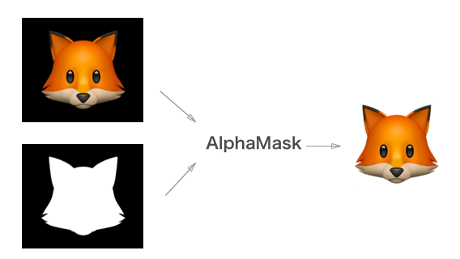
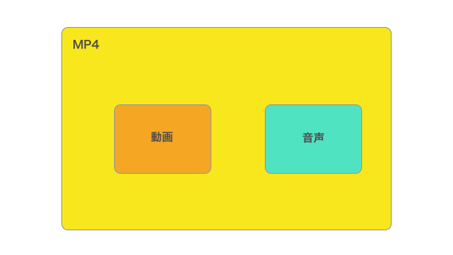
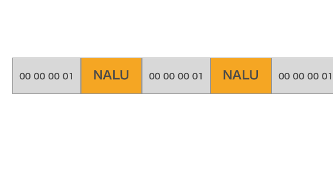
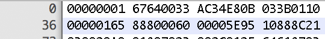
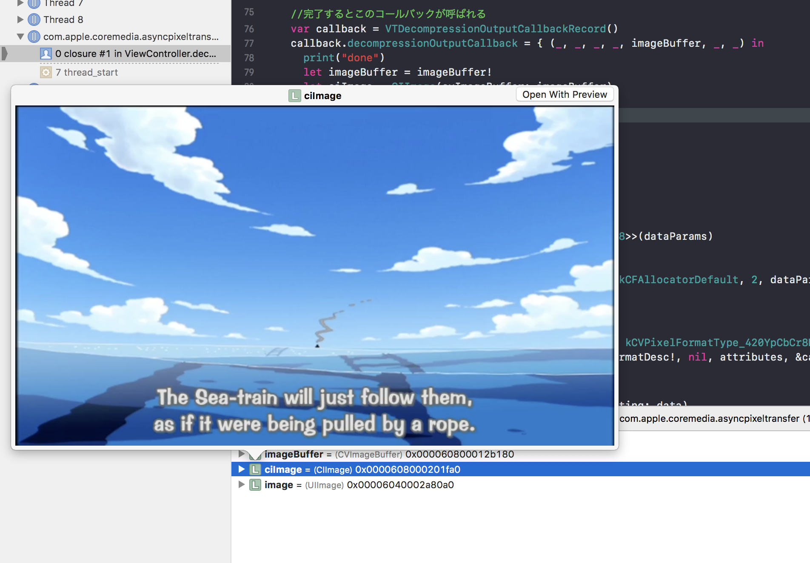
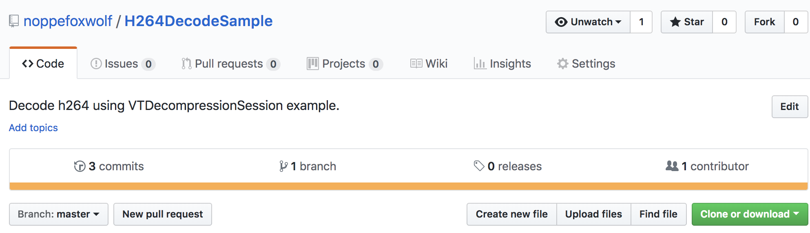
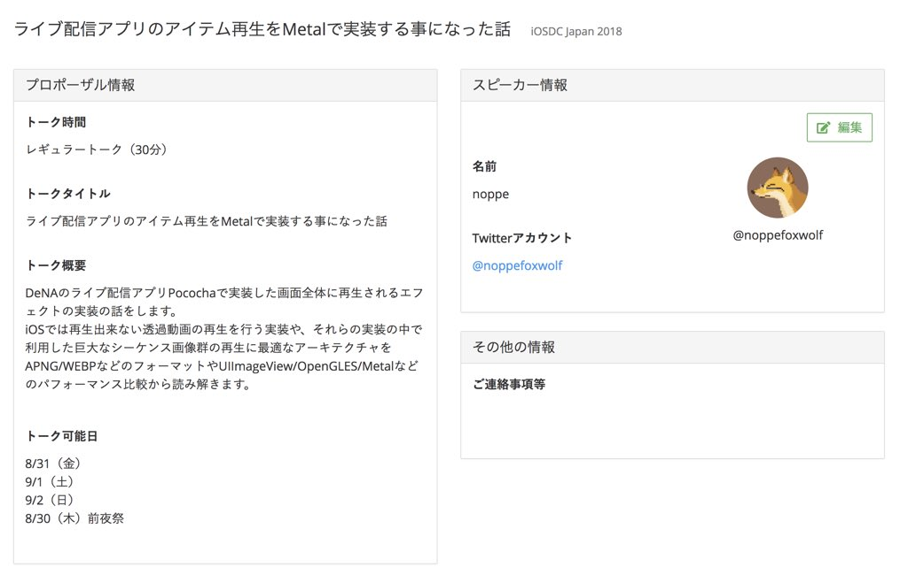

> Video decode on iOS
-- potatotips#52

---

# [fit] noppe

- 🦊 きつね好き
- iOSアプリ開発８年目
- DeNA3年目
- ソーシャルライブ事業部
- @noppefoxwolf


---

# ライブ配信アプリ - Pococha Live


---

# noppefoxwolf/Kitsunebi

透過動画再生ビューライブラリ[^1]


[^1]:https://github.com/noppefoxwolf/Kitsunebi

---


---

# Kitsunebiの仕組み

ビデオのデコード → マスク合成 → 描画



---

# Kitsunebiの仕組み

**ビデオのデコード** → マスク合成 → 描画

今日はこの辺の話をします

---

# ビデオファイル

例えば、mp4 mov wmv...

複数の**コンテナの集まり**、主に動画と音声が格納されているのが一般的なフォーマット
他にも字幕や静止画のコンテナが含まれることもある

---

# ビデオファイル



---

# ビデオファイルのデコードとは

メディアコンテナを再生出来る状態に復元する

- ビデオコンテナから１フレームごとの画像を取得
- 音声コンテナから音波情報を取得
- 字幕コンテナから文字列を取得
...etc

これらを行って動画として再生する

---

# ビデオファイルのデコードとは

今回はこの中でも**h264/avcコーデックをデコード**する方法に絞って解説

---

# iOSでのビデオコンテナのデコード方法

- AVAssetReader
- VTDecompressionSession

---

# AVAssetReader

```swift
let reader = try! AVAssetReader(asset: asset)
let output = AVAssetReaderTrackOutput(track: videoTrack)
reader.add(output)
reader.startReading()

output.copyNextSampleBuffer()
output.copyNextSampleBuffer()
output.copyNextSampleBuffer()
...
```

とても簡単

---

# VTDecompressionSessionの特徴

VideoToolbox.frameworkのデコード用の機能
**ビデオフレームの復元**ができる

---

# VTDecompressionSessionの流れ

1. h264/avcを分割
2. 映像が含まれるチャンクを取り出す
3. VTDecompressionSessionを生成
4. チャンクをSessionに渡す
5. デコード済みのImageBufferがコールバックに返される

---

# h264/avcを分割

NAL file format



---



---

# 映像が含まれるチャンクを取り出す

NALのヘッダを参照して0x05のものが基準となるフレームを持っている。


---

# VTDecompressionSessionを生成

```swift
VTDecompressionSessionCreate(_:, _:, _:, _:, _:, _:)
```

引数にはコールバック先やフレームの情報(pixelFormatやH264のパラメータ)が必要

---

# チャンクをSessionに渡す

```swift
CMSampleBufferCreateReady(sampleBuffer)
VTDecompressionSessionDecodeFrame(_:, _:, _:, _:, &sampleBuffer)
```

byte配列を直接渡す事は出来ないので、byte配列から作ったBlockBufferを元にSampleBufferを作り渡す。

---

# デコード済みのImageBufferがコールバックに返される

```swift
callback.decompressionOutputCallback = { (_, _, _, _, imageBuffer, _, _) in
  // imageBuffer
}
```

Sessionに登録したcallbackへデコードされたimageBufferが返ってくる

---



---

# Pros Cons

||Easy|Streaming|Performance|Customize|
|:---:|:---:|:---:|:---:|:---:|
|AVAssetReader|o|x|o|△|
|VTDecompressionSession|x|o|o|o|

---

# VTDecompressionSession

- ストリーミングでもキャプチャが取れる
- AVAssetReaderにバグがあっても大丈夫
- 分散してエンコードしたい時とかに便利
- エラーチェックとかちゃんとしないといけない

---

> H264DecodeSample



##[fit]https://github.com/noppefoxwolf/H264DecodeSample

---

# noppefoxwolf/Kitsunebi


`VTDecompressionSession`は未サポート :cry:
パフォーマンスに一定の効果がありそうであれば実装予定

---

# CfPの話

iOSDC2018のCfP出してみました。



今回の話のほか、Metal対応でどうなるのかとか比較してみたいと思っています 🦊

---

# Note

https://mntone.hateblo.jp/entry/2013/09/03/180431