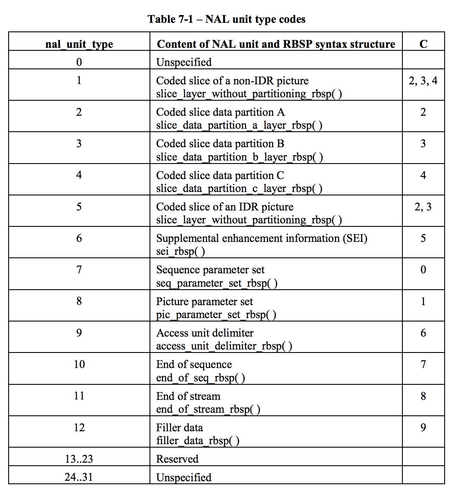

footer: 🦊 @noppefoxwolf, 2018
slidenumbers: true

> Video decode on iOS
-- potatotips#52

---

# [fit] noppe

- 🦊 きつね好き
- iOSアプリ開発８年目
- DeNA3年目
- ソーシャルライブ事業部
- @noppefoxwolf


---

# ライブ配信アプリ - Pococha Live


---

# noppefoxwolf/Kitsunebi

透過動画再生ビューライブラリ[^1]


[^1]:https://github.com/noppefoxwolf/Kitsunebi

---


---

# Kitsunebiの仕組み

ビデオのデコード → マスク合成 → 描画


---

# Kitsunebiの仕組み

**ビデオのデコード** → マスク合成 → 描画

今日はこの辺の話をします

---

# ビデオファイル

例えば、mp4 mov wmv...

複数の**メディアコンテナの集まり**、主に動画と音声が格納されているのが一般的なフォーマット
他にも字幕や静止画のコンテナが含まれることもある

---

# ビデオファイル


---

# ビデオファイルのデコードとは

メディアコンテナを再生出来る状態に復元する

- ビデオコンテナから１フレームごとの画像を取得
- 音声コンテナから音波情報を取得
- 字幕コンテナから文字列を取得
...etc

これらを行って動画として再生する

---

# iOSでのビデオコンテナのデコード方法

- AVAssetReader
- VTDecompressionSession

---

# 対応コーデックの確認

これらのフレームワークは内部で**OS/端末のデコーダの実装を利用**している。

同じmp4でもH.264かH.265みたいなコーデックの違いがあり、OSや端末によってサポートが異なるので注意。

---

# 対応コーデックの確認

公式サイトのSpecみればサポートしているコーデックがわかる。[^2]

対応コーデックを取得するメソッドは見つからなかった。😕

[^2]:https://www.apple.com/jp/iphone-x/specs/ とか

---

# AVAssetReader

```swift
let reader = try! AVAssetReader(asset: asset)
let output = AVAssetReaderTrackOutput(track: asset.videoTrack)
reader.add(output)
reader.startReading()

output.copyNextSampleBuffer()
output.copyNextSampleBuffer()
output.copyNextSampleBuffer()
...
```

とても簡単
copyNextSampleBufferを呼ぶたびに取れるフレームのタイムスタンプが進む

---

# AVAssetReaderの特徴

- 対応コーデックであればコーデックを気にせずにデコードできる
- 非常に簡単なインターフェイス
- 次のsampleBufferしか取れない

---

# VTDecompressionSessionの特徴

低レイヤーのビデオデコード用フレームワーク
多分AVAssetReader/AVAssetReaderTrackOutputはこれを使っている？
やや複雑で面倒な代わりに柔軟性が高い

---

# VTDecompressionSessionの流れ

1. h264/avcを分割
2. 映像が含まれるチャンクを取り出す[^3]
3. VTDecompressionSessionを生成
4. チャンクをSessionに渡す
5. デコード済みのImageBufferがコールバックに返される

[^3]:サンプルでは例としてキーフレームを取り出している

---

# h264/avcを分割

NAL file format


---


---

# 映像が含まれるチャンクを取り出す

NALのヘッダを参照して0x05のものがキーフレーム[^4]を持っている。


[^4]:差分情報が不要な完全なフレーム

---

# nal unit type

ISO/IEC 14496で定義[^5]



[^5]:http://www.staroceans.org/e-book/ISO-14496-10.pdf

---

# VTDecompressionSessionを生成

```swift
VTDecompressionSessionCreate(_:, _:, _:, _:, _:, _:)
```

引数には**コールバック先**やフレームの情報(pixelFormatやH264のパラメータ)が必要

---

# チャンクをSessionに渡す

```swift
CMSampleBufferCreateReady(sampleBuffer)
VTDecompressionSessionDecodeFrame(_:, _:, _:, _:, &sampleBuffer)
```

byte配列を直接渡す事は出来ないので、byte配列から作ったBlockBufferを元にSampleBufferを作り渡す。

---
# デコード済みのImageBufferがコールバックに返される

```swift
callback.decompressionOutputCallback = { (_, _, _, _, imageBuffer, _, _) in
  // imageBuffer
}
```

Sessionに登録したcallbackへデコードされたimageBufferが返ってくる

---


---

# Pros Cons

||Easy|Streaming|Performance|Customize|
|:---:|:---:|:---:|:---:|:---:|
|AVAssetReader|o|x[^6]|o|△|
|VTDecompressionSession|x|o|o|o|

[^6]:リモートのアセットのpixelBufferは取れない

---

# VTDecompressionSession

- ストリーミングでもキャプチャが取れる
- AVAssetReaderにバグがあっても大丈夫
- 分散してエンコードしたい時とかに便利
- エラーチェックとかちゃんとしないといけない

---

> H264DecodeSample


##[fit]https://github.com/noppefoxwolf/H264DecodeSample

---

# noppefoxwolf/Kitsunebi


`VTDecompressionSession`は未サポート :cry:
パフォーマンスに一定の効果がありそうであれば実装予定

---

# iOSDC2018のCfP出してみました。


今回の話のほか、KitsunebiをMetal対応させてどうなるのかとか比較してみたいと思っています 🦊

---

# Note

https://mntone.hateblo.jp/entry/2013/09/03/180431