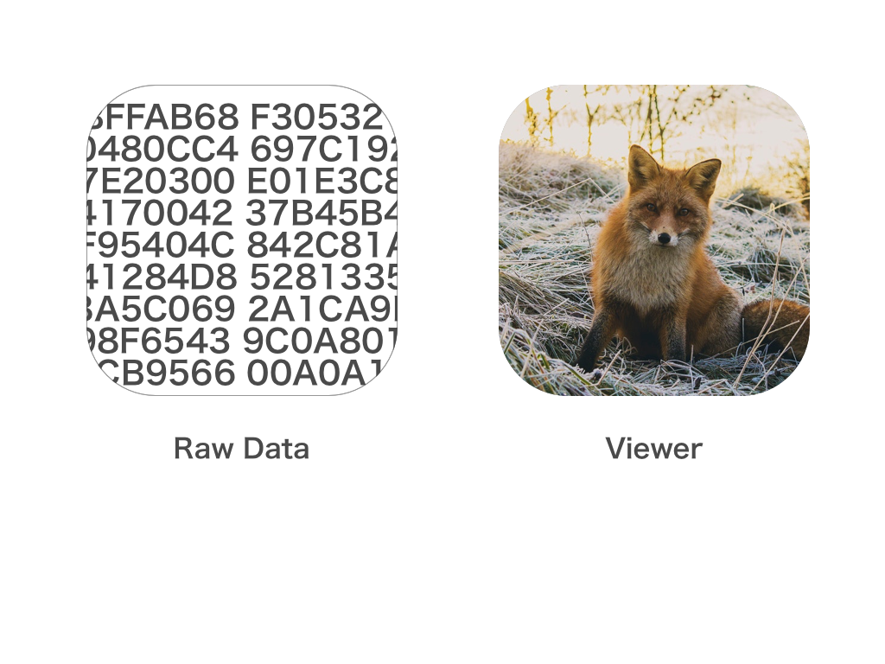

footer: 🦊
slidenumbers: true

# Pocochaにおけるアセットの管理

---

#[fit] noppe

🏢 株式会社ディー・エヌ・エー
🦊 きつねかわいい
💻 アプリ開発２０１０〜


---

# Pocochaの紹介

---
[.autoscale: true]

# アセットの例

- 画像
- 色
- 効果音
- Storyboard
- フォント
- 動画

---

# Pocochaでの画像アセット管理のルール

- Asset Literalは使わない
- 文字列でリソースにアクセスしない
- Interface builderの中では画像を設定しない
- アプリアイコンは単一ソースから生成

^ それぞれどうしてなのか、どうしているのかを解説

---

## Asset Literalは使わない

---

## Color Literal / Image Literal


`#imageLiteral(resourceName: "Facebook")`

---

## アセットの特徴

- 視聴覚に頼ることで個々を認識出来る

---

## アセットの特徴



---

## Asset Literalの問題点

- 視聴覚は信頼できない

---

## Asset Literalの問題点


---

## Asset Literalの問題点

プロジェクトの規模が大きくなるほど、類似のアセットが増える。

- 解像度の違う画像アセット
- 近似色のカラーアセット

^ なのでAsset Literalは使っていない

---

## Asset Literalの代替案

結局は名前を付けて呼び出す事がベスト
見た目＋特徴の組み合わせで、アセットを特定出来るような名前を付ける

`TriangleRed`
`TriangleLarge`

---

## 特殊なケース

`Back`などの動作名はアセットの見た目が分からないのでNG
//TODO Shareとかどうするんや

---

# 重複する名称の対策

画面が異なり、アセットも異なるが、見た目が似ているアセットがある可能性は事前に考慮しておく

`UserProfileView/TriangleLarge`
`ProfileEditView/TriangleLarge`

---

## 共通で使われるアセット

複数のビューで利用されるアセットは、`Common`などのネームスペースを切っておく

`Common/LeftArrow`

---

## ネームスペースを活用する

ビューのツリー構造に似た名称になっていくため、ネームスペースを活用する
xcassetsのネームスペースを有効にする事で重複したファイル名を利用できる。

`ProfileEdit/Triangle/Large`

---

# ネームスペースを活用する


---

# ネームスペースを活用する

```swift

// Before
let image = UIImage(named: "ProfileEditTriangleLarge")

// After
let image = UIImage(named: "ProfileEdit/Triangle/Large")
```

---

# 文字列でリソースにアクセスしない

---

# Typoをなくす

R.Swift / SwiftGen などを利用してTypoをなくす

```swift
let image = Asset.ProfileEdit.Triangle.large.image
```

---

#  Interface builderの中では画像を設定しない

---

# 存在しないアセットへのアクセス


---


---

Could not load the "ImageName" image referenced from a nib in the bundle with identifier "com.bundle.app"

---

# 存在しないアセットへの対策
Interface Builderでは画像を使わない方針

https://github.com/noppefoxwolf/inaba

---

# Storyboardに画像を設定しない場合

// intrinsic

---

# アプリアイコンは単一ソースから生成

---

AppIconGen

---

# まとめ

- Asset Literalは使わない
- 文字列でリソースにアクセスしない
- Interface builderの中では画像を設定しない
- アプリアイコンは単一ソースから生成

