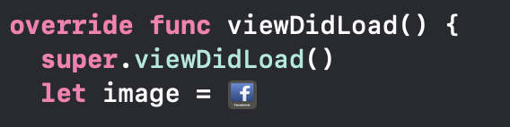
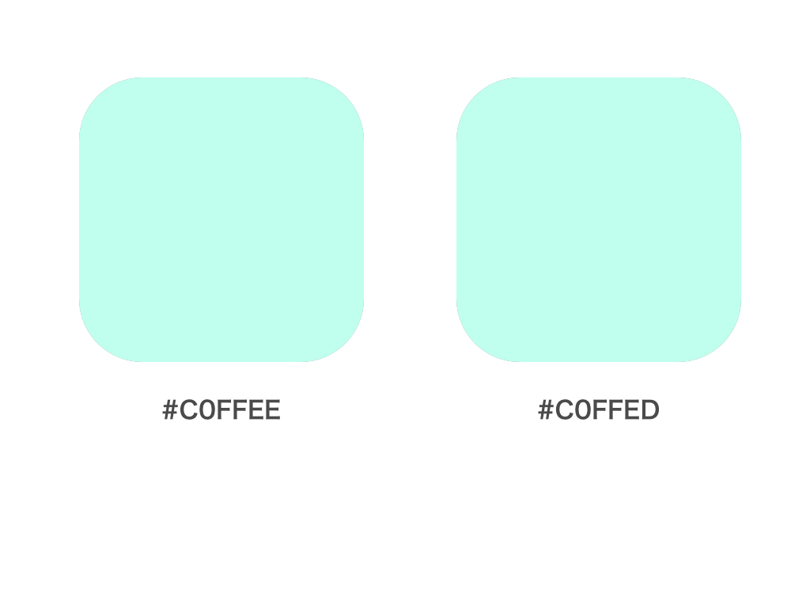
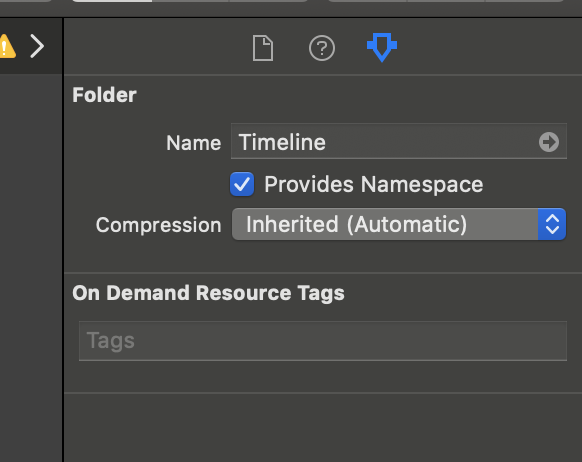
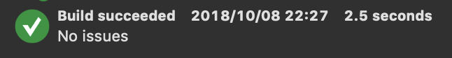
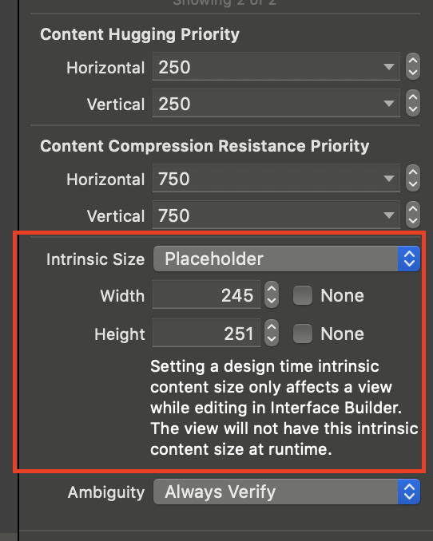
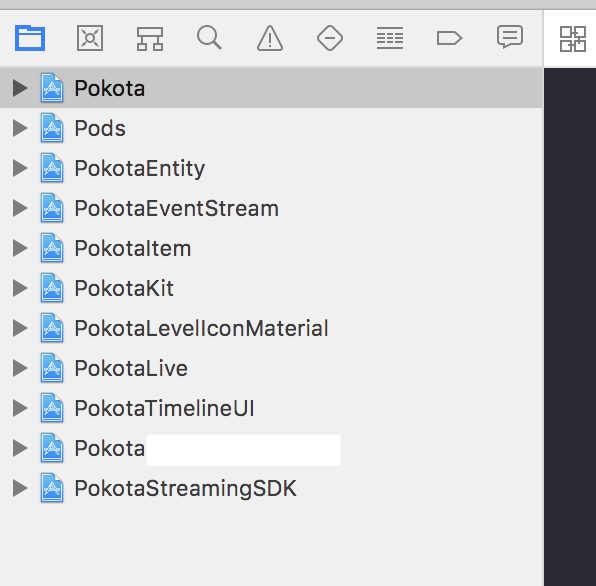

footer: 🦊
slidenumbers: true

# Pocochaにおけるアセットの管理

### potatotips \#55 noppe ( @noppefoxwolf )

---

#[fit] noppe

🏢 株式会社ディー・エヌ・エー
🦊 きつねかわいい
💻 Pococha iOSリードエンジニア


---

# Pococha

- ライブ配信アプリ

- 2017 〜

- 多彩なイベント企画を実施

- レベルに応じた演出ギミック


---
[.autoscale: true]

# アセットの例

- 画像

- 色

- Storyboard

- フォント

- ...etc

---

[.autoscale: true]

# アセットの例

- **画像**

- 色

- Storyboard

- フォント

- ...etc

^ 今日は画像アセットに関して話します

---

# Pocochaでの画像アセットのルール

---

[.autoscale: true]

# Pocochaでの画像アセットのルール

- Asset Literalは使わない
- 文字列でリソースにアクセスしない
- Interface builderの中では画像を設定しない
- アプリアイコンは単一ソースから生成
- ダミーアセットは明確にプロジェクトを分けて管理する

^ それぞれどうしてなのか、どうしているのかを解説

---

## 1.Asset Literalは使わない

---

## Color Literal / Image Literal



`#imageLiteral(resourceName: "Facebook")`

^ そもそもAssetLiteralは何かと言うと
^ 便利に見えるけどなんで使わないのか

---

## Asset Literalの問題点

- Xcode上では、アセットの違いを認識しづらい

---

## Asset Literalの問題点



---

## Asset Literalの問題点

プロジェクトの規模が大きくなるほど、類似のアセットが増える。

- 解像度の違う画像アセット
- 近似色のカラーアセット

^ なのでAsset Literalは使っていない

---

## Asset Literalの代替案

結局は名前を付けて呼び出す事がベスト
見た目＋特徴の組み合わせで、アセットを特定出来るような名前を付ける

`TriangleRed`
`TriangleLarge`

---

# 重複する名称の対策

画面が異なり、アセットも異なるが、見た目が似ているアセットがある可能性は事前に考慮しておく

`UserProfileViewTriangleLarge`
`ProfileEditViewTriangleLarge`

---

## 共通で使われるアセット

複数のビューで利用されるアセットは、`Common`を先頭につける

`CommonLeftArrow`

---

## ネームスペースを活用する

ビューのツリー構造に似た名称になっていくため、冗長なファイル名になっていく。
xcassetsのネームスペースを有効にする事でシンプルなファイル名を利用できる。

`ProfileEdit/Triangle/Large`

---

# ネームスペースを活用する



---

# ネームスペースを活用する

```swift

// Before
let image = UIImage(named: "ProfileEditTriangleLarge")

// After
let image = UIImage(named: "ProfileEdit/Triangle/Large")
```

---

# 2.文字列でリソースにアクセスしない

---

# 文字列でアセットにアクセスする問題点

```swift
let image = UIImage(named: "TypoFileName")
self.image = image! // nil exception
```

ランタイムでTypoが発覚
Pocochaでは複雑な条件で画像を出し分けするため、普通に触っていると気が付けないアセットが多く存在

^ アプリクラッシュしないから良いと言うわけではない。沢山アイテムや時間を使って上げたレベルのアイコン表示の需要度は非常に高い。

---

# Typoをなくす

R.Swift / SwiftGen などを利用してTypoをなくす

```swift
let image = Asset.ProfileEdit.Triangle.large.image
```

コンパイル時にタイポが検出可能になる

^ 動的に生成するアセット、連番アセットについては課題

---

# 3.Interface builderの中では画像を設定しない

---

# Interface builderの中で画像を設定する危険性


---



---

Could not load the "ImageName" image referenced from a nib in the bundle with identifier "com.bundle.app"

^ しかもUIImageView.imageがoptionalなのでクラッシュしない

---

# 存在しないアセットへの対策

Interface Builderでは画像を使わない方針

- ルールで禁止するのは無理

---

# 存在しないアセットへの対策

Inaba - 稲羽

https://github.com/noppefoxwolf/inaba

---

# 存在しないアセットへの対策

`$ Inaba ./Project`

```
> CaptureButton.xib
🌁 An image is specified outside the code. (icon_camera)

> NoticeView.xib
🌁 An image is specified outside the code. (notice_dialog_image)

> SignupViewController.storyboard
🌁 An image is specified outside the code. (welcome)
```

---

# Interface builderの中から画像を消す

IBから画像を消すとAutolayoutが壊れることがある

- UIImageViewはimageを設定するとその画像サイズでIntrinsic Content Sizeがつく

- 明示的にIntrinsic content sizeを設定することで画像無しでもAutolayoutを解決できる

---

# Interface builderの中から画像を消す



---

# 4.アプリアイコンは単一ソースから生成

---

# アプリアイコンの課題

画像アセットはベクターpdfからビルド時に複数解像度のラスタ画像を生成できる

何故かアプリアイコンは各解像度のラスタ画像を自前で用意しないとダメ

---

# ビルド時にアイコンを生成


https://github.com/noppefoxwolf/appicongen

---

# ビルド時にアイコンを生成


---

# ビルド時にアイコンを生成

pod 'AppIconGen'

$PODS_ROOT/AppIconGen/appicongen --input $SRCROOT/$PRODUCT_NAME/Artwork.png --xcassets $SRCROOT/$PRODUCT_NAME/Assets.xcassets/

---

# 5. ダミーアセットは明確にプロジェクトを分けて管理する

---

# ダミーアセットの課題

iOSアプリでアプリ内にデバッグメニューを表示してUIの確認をするのは良くある手法
デバッグ用のViewControllerはBuild Configurationで隠せるがアセットは隠しにくい

---

# ダミーアセットの課題

しかし、アプリにバンドルしてしまうと…

- 著作権的にマズイ画像が…

- リリース前のアイテム画像が…

- 急遽取り下げる事になった画像が…

---



機能ごとにproject管理

---


projectに機能QA用のアプリターゲットを配置

---


機能QA用のアプリのxcassetsで管理

---

# まとめ

- Asset Literalは使わない
- 文字列でリソースにアクセスしない
- Interface builderの中では画像を設定しない
- アプリアイコンは単一ソースから生成
- ダミーアセットは明確にプロジェクトを分けて管理する

---
