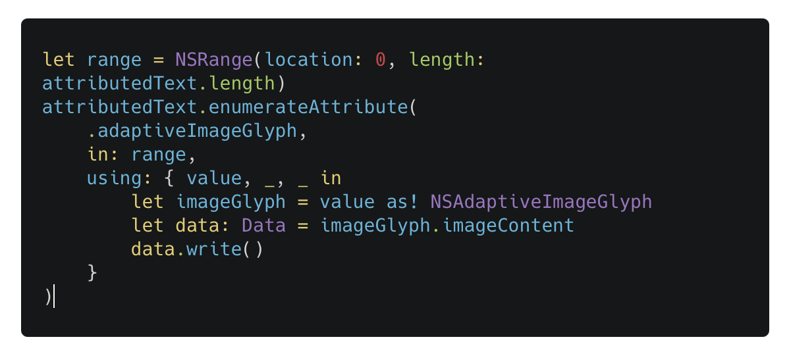
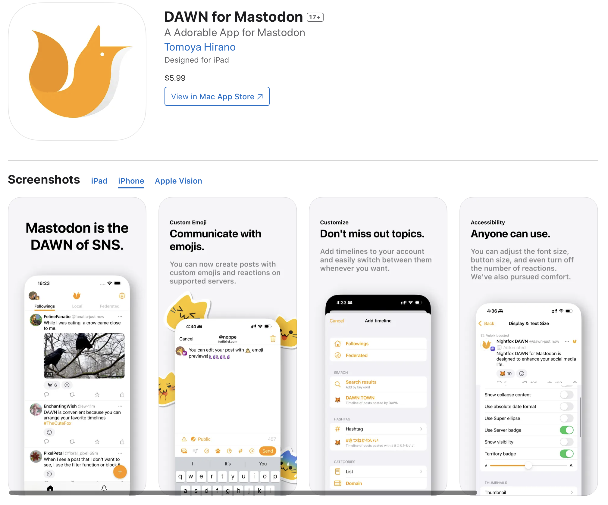

slidenumber: true

# **Spice up your notifications 🥳**

## noppe (Tomoya Hirano)

^ Hello everyone, let's get started.

---

# 1999

- NTT Docomo created 176 emojis.[^1] ☀️
- They can add feelings to messages.


^ In 1999, NTT Docomo made 176 types of emojis.
^ They show emotion simply.

[^1]: https://www.moma.org/collection/works/196070

---

# 2019

- Unicode now has over 3,000 emojis.
- This allows for more ways to express ourselves.


^ In 2019, Unicode emojis exceeded 3,000 types.
^ This allows for more expressions.

---

# 2024


^ And last year, Genmoji was introduced.

---

# Genmoji

- Apple Intelligence can create emojis.
- ♾️ emoji variations 🤯


^ Genmoji is generated emoji by Apple Intelligence.
^ The number of types is… infinite.
^ This means we can express ourselves in many ways.

---

# ♾️ ≠ All

^ But infinity doesn’t cover everything.

---

# Custom Emoji[^2]

- Users can upload images as emojis.
- This feature works on platforms like `Slack`, `Twitch`, `Discord`, `Mastodon`, and more.
- Meme emojis are also popular.


[^2]: https://slackmojis.com

^ Yes, we also use meme emojis.
^ On Slack, Twitch, Discord, Mastodon and more, Users can register their own emojis.

---

# Custom Emoji[^3]

- Custom emojis are **not** just memes.
- Emoji creaters are well-known artists in Japan.
- キツネイモリ (`Fox-Newt`) was made by my wife.


[^3]: ©kitsune-imori.lineem2018

^ Custom emojis are not just memes.
^ A lot of emoji creators are active in Japan.
^ My wife is also an emoji creator.
^ Please remember, This is a character she created herself. 
^ It's called キツネイモリ. In english, it's called Fox-Newt. 
^ Custom emojis can also show a user’s personality, such as their likes and hobbies.

---


^ Now, for today's talk, I made a messaging app.
^ You can chat with your friends using cute fox-newt emojis.

---


^ Let's try sending a message.
^ A cute fox-newt! Send!

---


^ A few minutes later, my wife received the message.

---


^ Nice! My wife got the notification.

---


^ Oh no!
^ The cute fox-newt is gone from the notification.
^ Instead, it says (Heart).
^ This is not good.
^ Is it possible to show custom emojis in notifications?

---

# Back to WWDC24.

^ OK, let's remember last year's WWDC.

---


^ This! Can you see it?

---


^ Genmoji can be shown in notifications.

---

# 🦊💡

^ Wait, I have an idea!

---

# Can  spoof as AI generated ?

^ Can custom emoji spoof as a Genmoji?
^ Let's try it!

---

# 1. Type any Genmoji into the UITextView


^ First, type a Genmoji character into the UITextView.

---

### 2. Export Genmoji data



^ And then, let's check that attributedString.
^ You can find an NSAdaptiveImageGlyph.
^ And, It has a data-property called imageContent.
^ Let’s export this data.

---

# 2. Export Genmoji data

- Genmoji is heic image data.


^ The exported data can be seen as a heic image.
^ This means Genmoji is a heic image.

---

[.code-highlight: all]
[.code-highlight: 2]

# 3. Metadata of Genmoji HEIC

```xml
<CGImageMetadata 0x103812be0> (
    tiff:DocumentName = 142D3296-51E6-40E2-AC35-0FAD3C5E965C0
    tiff:XPosition = 0/1
    tiff:TileWidth = 160
    tiff:YPosition = 0/1
    dc:description = ()
    Iptc4xmpExt:DigitalSourceType = ...
    tiff:TileLength = 160
    photoshop:Credit = Apple Image Playground
    tiff:Orientation = 1
    iio:hasXMP = True
    xmp:CreatorTool = Apple TextKit
)
```

^ Next, let’s look at the metadata of this HEIC image.
^ There are a few keys inside.
^ Which key is required for a Gemmoji?
^ It’s tiff:DocumentName.
^ That’s the key piece.

---

### 4. Make fake Genmoji with custom image


^ We'll create a heic file by UIImage and tiff:DocumentName key.
^ Set a random UUID for tiff:DocumentName.
^ Now, let's create an NSAdaptiveImageGlyph with this data.

---


^ Now, let's send it again.

---


^ Awesome! The cute fox-newt appears in the notification.
^ She’ll be so happy!

---

# You can try it!

- The source code is open-source.

https://github.com/noppefoxwolf/Zenmoji


^ The source code for this talk is open-source and called Zenmoji.
^ You can try it out!

---

## My name is Tomoya, aka noppe.

- Work at DeNA in 🇯🇵.
- iOS app developer.
- github.com/noppefoxwolf
- x.com/noppefoxwolf


^ My name is Tomoya. Call me noppe.
^ I'm a iOS app developer, and work at DeNA in Japan.

---



^ And DAWN for mastodon is my personal project.
^ This app using today's techniques a bit.
^ Please check it out!
^ Enjoy the rest of try!Swift!
^ Thank you for listening!
