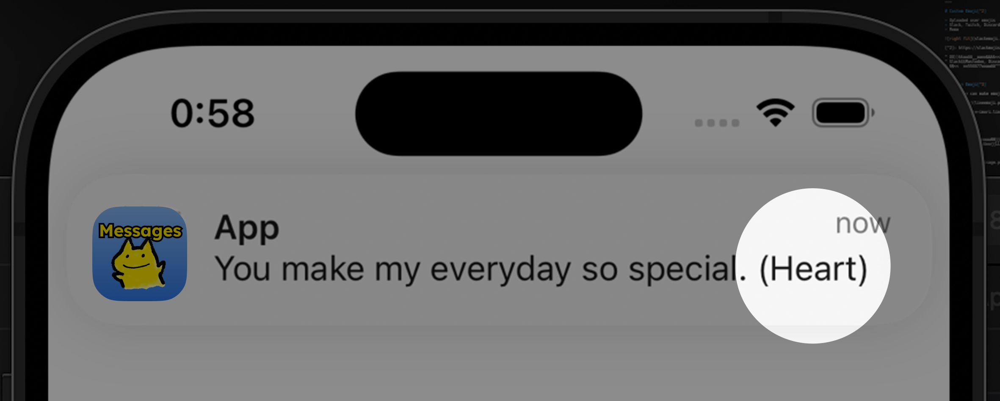
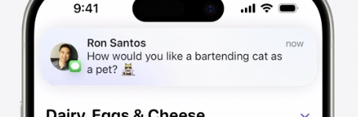

slidenumber: true

# Spice up your notifications 🥳

## noppe (Tomoya Hirano)

^ Hello everyone, let's get started right away.

---

# 1999

- NTT Docomo created 176 emojis.[^1] ☀️
- That can add emotion to messages.


^ In 1999, NTT Docomo created 176 types of emojis.
^ This can add emotion to messages.

[^1]: https://www.moma.org/collection/works/196070

---

# 2019

- Unicode now includes over 3,000 emojis.
- Allowing for a wider range of expressions.


^ In 2019, Unicode emojis exceeded 3,000 types.
^ This allows for a wider range of expressions.

---

# 2024


^ And last year, Genmoji was introduced.

---

# Genmoji

- Apple Intelligence can generate emojis.
- ♾️ emojis variations 🤯


^ Genmoji is emojis generated by Apple Intelligence.
^ The variations are… infinite.
^ This means high-context expressions are now possible.

---

# ♾️ ≠ All

^ However, as you know, infinite does not mean all.

---

# Custom Emoji[^2]

- Users can upload images as emojis.
- This feature is supported on platforms like `Slack`, `Twitch`, `Discord`, `Mastodon`, and more.
- AI is unable to generate memes.


[^2]: https://slackmojis.com

^ Yes, we also use meme emojis.
^ On Slack, Mastodon, and Discord, users can register their own emojis.

---

# Custom Emoji[^3]

- Custom emojis are **not** just memes.
- Emoji creators are well-known professionals in Japan.
- Kitsune-Imori (`Fox-Newt`) was created by my wife.


[^3]: ©kitsune-imori.lineem2018

^ Custom emojis are not just memes.
^ In Japan, many emoji creators are active.
^ My wife is also an emoji creator.
^ This is a character she created, called fox-newt.
^ Custom emojis can emphasize the individuality of users.

---


^ Now, emojis are meaningless unless sent.
^ So, for today's talk, I created a messaging app.
^ This app can send Fox-Newt emojis.

---


^ Let's try sending it right away.
^ It's a cute fox-newt. Sending!

---


^ ♪

---


^ Nice! The notification has reached the recipient.

---



^ Oh, what a surprise!
^ The cute fox-newt is no longer in the notification.
^ Instead, it says (Heart).
^ This won't do.
^ Can't we display custom emojis in notifications?

---

# Back to WWDC24.

^ OK, let's recall last year's WWDC.

---


^ This! Can you see it?

---



^ Genmoji can be displayed in notifications.

---

# 🦊💡

^ Ah, I just had a great idea.

---

# Can  spoof as AI generated ?

^ Can we disguise custom emojis as Genmoji?
^ Let's give it a try!

---

# 1. Type any Genmoji into the UITextView


^ First, type a Genmoji into the UITextView.

---

# 2. Export Genmoji data

```swift
let range = NSRange(location: 0, length: attributedText.length)
attributedText.enumerateAttribute(
    .adaptiveImageGlyph,
    in: range,
    using: { value, _, _ in
        let imageGlyph = value as! NSAdaptiveImageGlyph
        let data: Data = imageGlyph.imageContent
        data.write()
    }
)
```

^ Then, let's take a look at the Genmoji in the attributedString.
^ Genmoji is an NSAdaptiveImageGlyph.
^ It contains data called imageContent.
^ We will export this data.

---


^ The exported data can be viewed as a heic image.
^ In other words, Genmoji is a heic image.

---

[.code-highlight: all]
[.code-highlight: 2]

# 3. Metadata of Genmoji HEIC

```xml
<CGImageMetadata 0x103812be0> (
    tiff:DocumentName = 142D3296-51E6-40E2-AC35-0FAD3C5E965C0
    tiff:XPosition = 0/1
    tiff:TileWidth = 160
    tiff:YPosition = 0/1
    dc:description = ()
    Iptc4xmpExt:DigitalSourceType = ...
    tiff:TileLength = 160
    photoshop:Credit = Apple Image Playground
    tiff:Orientation = 1
    iio:hasXMP = True
    xmp:CreatorTool = Apple TextKit
)
```

^ Next, let's look at the metadata of this data.
^ There are several keys.
^ Due to time constraints, I'll give you the answer.
^ tiff:DocumentName, this is the crucial piece.
^ With this, it will be recognized as Genmoji.

---

# 4. Make fake Genmoji with custom image

```swift
func imageContent() -> Data {
    let imageContent = NSMutableData()
    let destination = CGImageDestinationCreateWithData(
        imageContent,
        NSAdaptiveImageGlyph.contentType.identifier
    )!

    let metadata = CGImageMetadataCreateMutable()
    metadata["tiff:DocumentName"] = UUID().uuidString
    
    let image = UIImage(resource: .emoji)
    destination.add(image.cgImage!, metadata)
    
    destination.finalize()
    return imageContent as Data
}
```

^ We will create a heic file by combining image data and tiff:DocumentName.
^ Set a random UUID for tiff:DocumentName.
^ Let's try creating an NSAdaptiveImageGlyph with this data.

---


^ Now, let's try sending it again.

---


^ Awesome! The cute fox-newt was displayed in the notification.
^ I'm sure my wife will be happy.

---

# Thank you for listening

https://github.com/noppefoxwolf/Zenmoji

## My name is Tomoya

- Solo iOS app developer
- DAWN for Mastodon
- WWDC24 attendee


^ This source code is published as open source under the name Zenmoji.
^ My name is Tomoya. I develop a Mastodon app.
^ Enjoy the rest of try!Swift!
^ Thank you!
