slidenumber: true

# Spice up your notifications

## noppe (Tomoya Hirano)

^ みなさんこんにちは、では早速初めていきましょう。

---

# 1999: NTT Docomo 176 Emojis [^1]

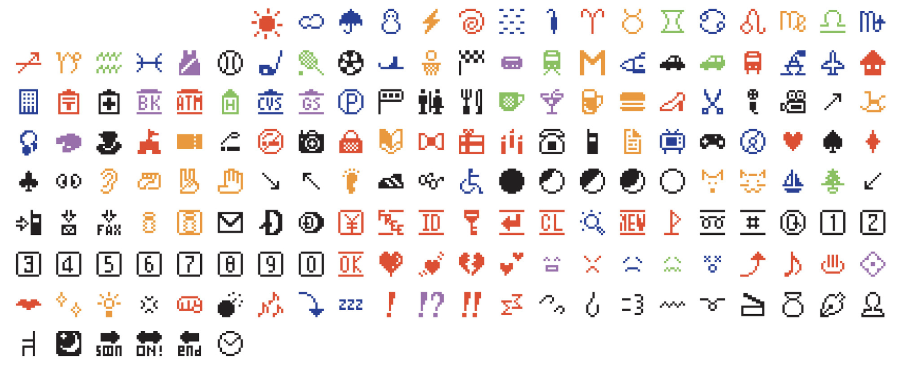

^ 1999年、NTTドコモは176種類の絵文字を作りました。

[^1]: https://www.moma.org/collection/works/196070

---

# 2019: Unocode emojis over 3000+.

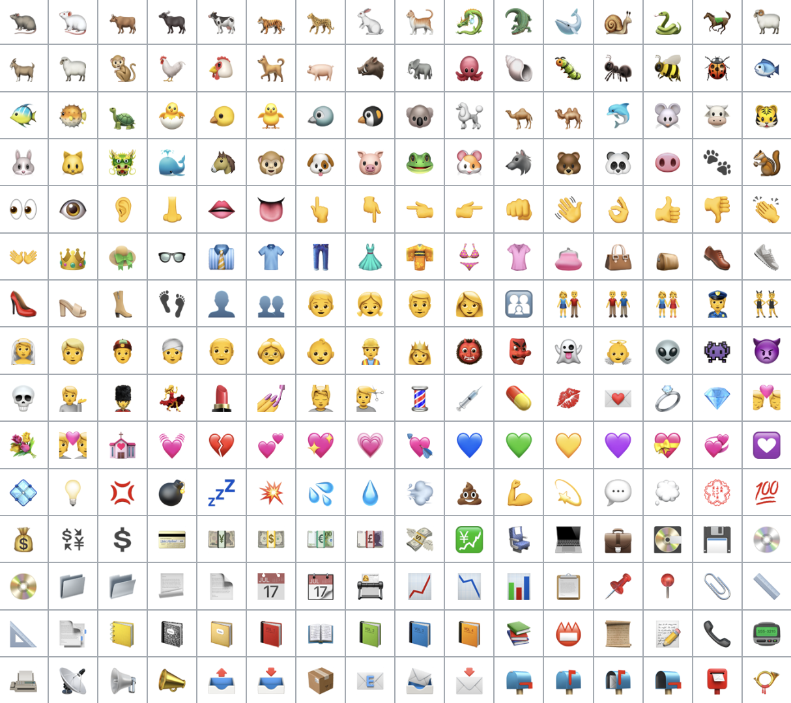

^ 2019年には、Unicodeの絵文字は3000種類を超えました。

---

# 2024

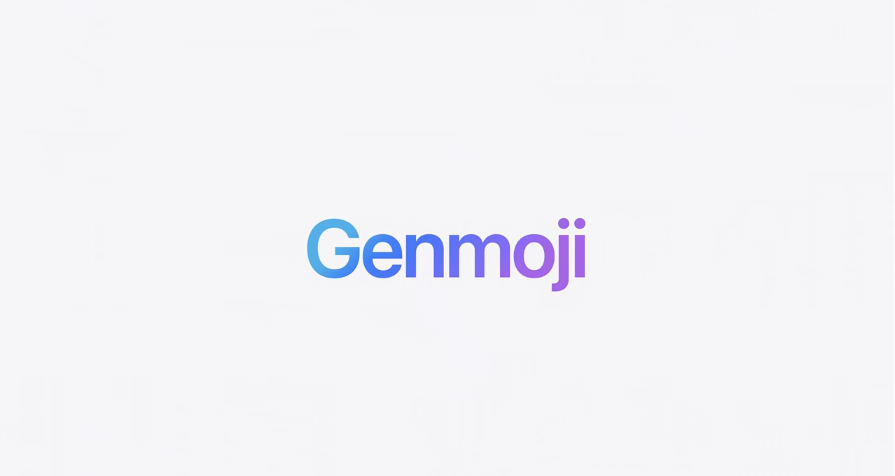

^ そして2024年、Genmojiが登場しました。

---

# Genmoji

- AI generated emojis
- ♾️ emojis types

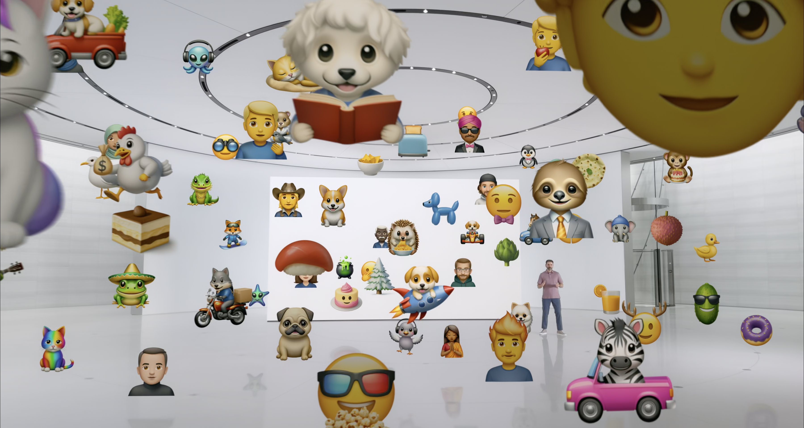


^ Genmojiは、Apple Intelligenceが生成する絵文字です。
^ 種類は…無限です。

---

# ♾️ ≠ All

^ ご存知の通り、無限とは全てではありません

---

# Custom Emoji[^2]

- Uploaded user emojis
- Slack, Twitch, Discord, Mastodon
- Meme

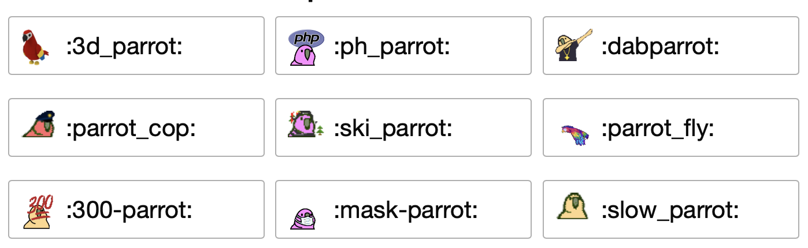

[^2]: https://slackmojis.com

^ 私たちはユニークな絵文字も使います。
^ SlackやMastodon, Discordでは、ユーザーが絵文字を登録することができます。
^ ミームの絵文字は、私も大好きです。

---

# Custom Emoji[^3]

- My wife also makes emojis
- Everyone can make emoji

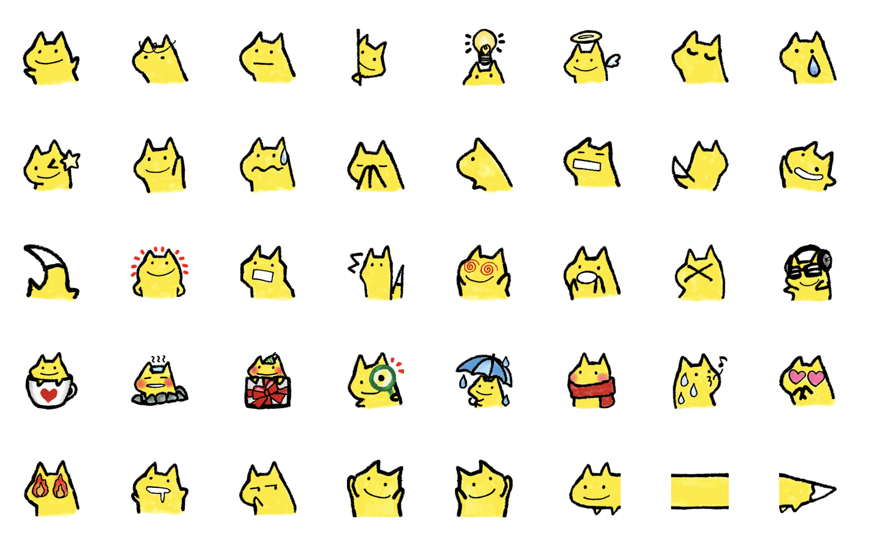

[^3]: ©kitsune-imori.lineem2018

---

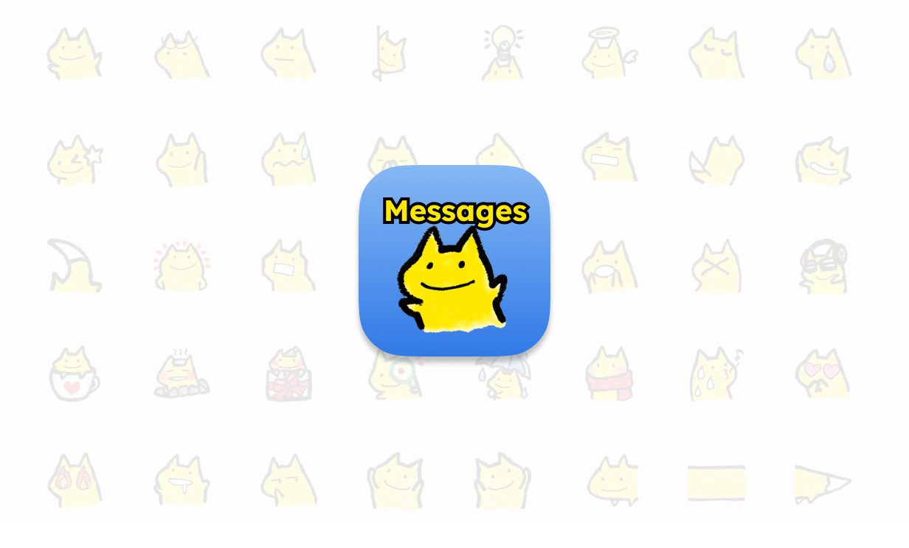

^ さて、絵文字は送信しなければ意味がありません。
^ 今日のために、私の妻が作った絵文字が使えるメッセージアプリを作りました。

---

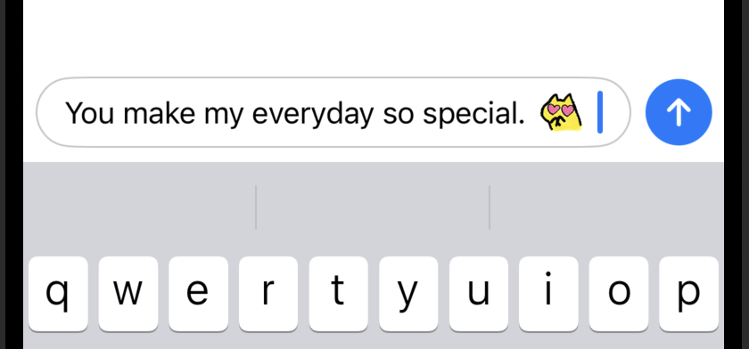

---


---

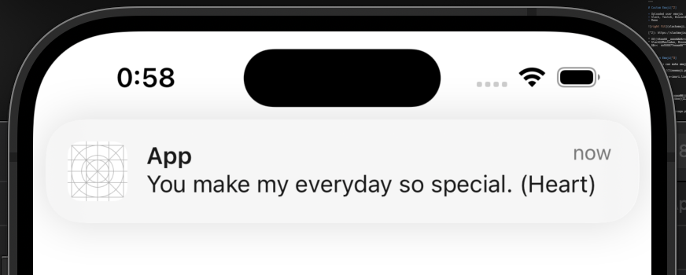

^ あぁ、なんということでしょう。
^ もう通知には、可愛らしいトカゲはいません。代わりに(OK)と書かれています。

---

# Notifications are silence?

^ 通知にカスタム絵文字を表示することは出来ないのでしょうか？
^ 今年のWWDCを思い出してみましょう。

---

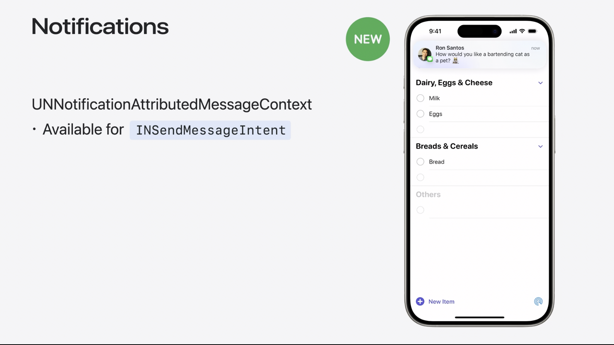

^ これです！Genmojiは通知に表示する事が出来ます。

---

# Can custom emojis spoof Genmoji?

^ カスタム絵文字を、Genmojiに装うことは出来るでしょうか？
^ 試してみましょう

---

# Extract Genmoji

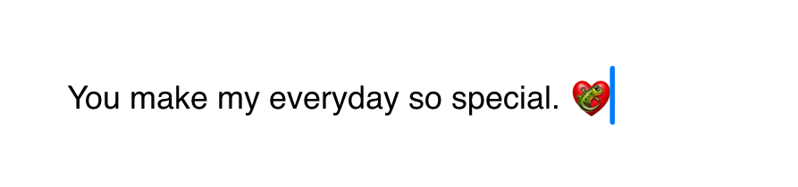

^ まずは、Genmojiを解剖してみましょう。
^ UITextViewにGenmojiをタイプします。

---

```swift
let range = NSRange(location: 0, length: attributedText.length)
attributedText.enumerateAttribute(
    .adaptiveImageGlyph,
    in: range,
    using: { value, _, _ in
        let imageGlyph = value as! NSAdaptiveImageGlyph
        let data: Data = imageGlyph.imageContent
    }
)
```

^ attributesを参照します。
^ Genmojiの正体は、NSAdaptiveImageGlyphです。

---

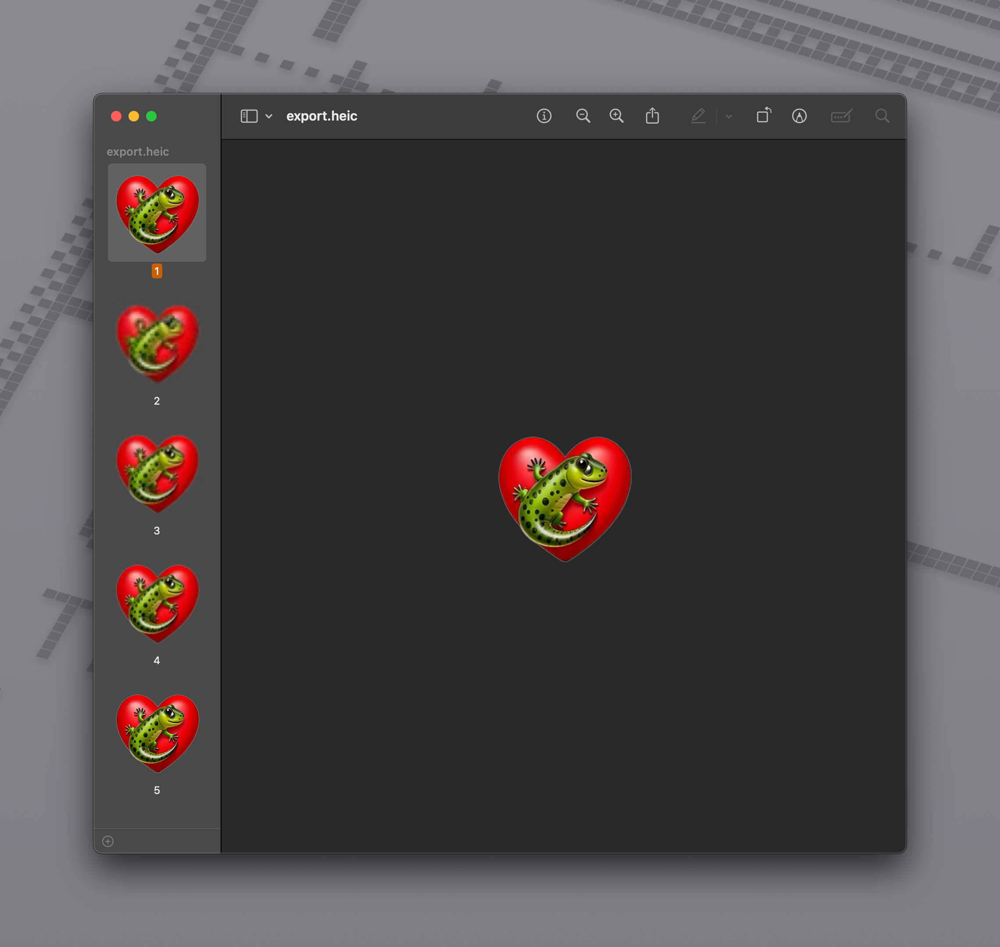

^ NSAdapativeImageGlyphのimageContentを書き出します。
^ ヘッダーを見ると、heicであると分かりました。

---

## Metadata of Genmoji HEIC

```
<CGImageMetadata 0x103812be0> (
    tiff:DocumentName = 142D3296-51E6-40E2-AC35-0FAD3C5E965C0
    tiff:XPosition = 0/1
    tiff:TileWidth = 160
    tiff:YPosition = 0/1
    dc:description = ()
    Iptc4xmpExt:DigitalSourceType = http://cv.iptc.org/newscodes/digitalsourcetype/trainedAlgorithmicMedia
    tiff:TileLength = 160
    photoshop:Credit = Apple Image Playground
    tiff:Orientation = 1
    iio:hasXMP = True
    xmp:CreatorTool = Apple TextKit
)
```

^ このデータのメタデータを見てみましょう。
^ いくつかキーがあります。時間がないので答えを言います。
^ tiff:DocumentName。これが重要です。

---

```swift
func imageContent() -> Data {
    let imageContent = NSMutableData()
    let destination = CGImageDestinationCreateWithData(
        imageContent,
        NSAdaptiveImageGlyph.contentType.identifier as CFString,
        1,
        nil
    )!
    let metadata = CGImageMetadataCreateMutable()
    CGImageMetadataSetValueWithPath(
        metadata,
        nil,
        "tiff:DocumentName" as CFString,
        UUID().uuidString as CFString
    )
    let image = UIImage(resource: ._032)
    CGImageDestinationAddImageAndMetadata(
        destination,
        image.cgImage!,
        metadata,
        nil
    )
    CGImageDestinationFinalize(destination)
    return imageContent as Data
}
```

^ 用意したイメージデータとtiff:DocumentNameを組み合わせてheicファイルを作ります。
^ このデータで、NSAdaptiveImageGlythを作ってみましょう。

---


^ ビンゴ！動きました。
^ 送信してみましょう

---

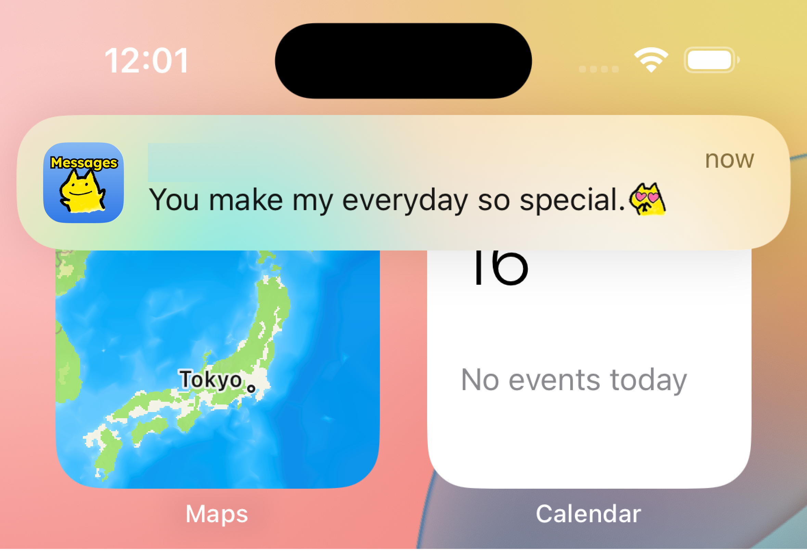

^ 通知にも表示されます。
^ 私の妻も喜んでいます。

---

# See more

https://github.com/noppefoxwolf/Zenmoji

^ 今回のコードはオープンソースとして公開しています。
^ 私の名前はTomoyaです。Mastodonアプリを開発しています。
^ この後もtry!Swiftをお楽しみください！
