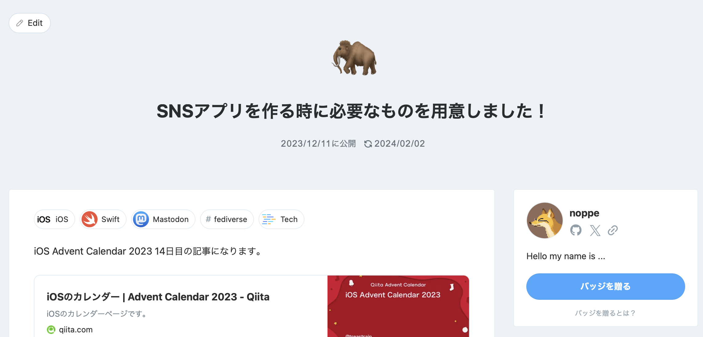

slidenumbers: true

# 既存アプリのApple Vision Pro対応した話

## visionOS Engineer オンラインLT会 vol.5

---

# noppe

- DeNA Co., Ltd.
- 𝕏: @noppefoxwolf
- mastodon: @mstdn.jp@noppefoxwolf

---

# 今日のお話

既存アプリのApple Vision Pro対応した話

---

# 既存アプリ

- DAWN for mastodon

- $2.99

- iOS, iPadOS, macOS(Catalyst)

- UIKit & SwiftUI


---

# 対応できた！

- Apple Vision Proのローンチに間に合った

- 対応期間は１週間くらい

- Susan Prescott(副社長)から感謝のメールが来る


^ スーザン・プレスコット

---

# visionOSへの対応方法

1. iPad互換

2. visionOS向けにビルド

---

# iPad互換

- 特に何もしなくても動く
- ただ、iPadアプリが動くだけ
    - 奥行きもない
    - 背景のぼやけもない
- 公開設定を変更しなければ自動的にiPadアプリとして公開される

---

# visionOS向けにビルド

- ちょっとした修正が必要
    - UIKitが動くので比較的簡単
- UIの全てがvisionOSに最適化される
- 今回はこっちに挑戦

---

# ちょっとした修正

- visionOSで動かない機能を無効化
- UIの修正
- アイコンとストア情報の準備

---

# visionOSで動かない機能を無効化

- Alternative App Icon
- ColorScheme
- App Extensions
- 対応してないライブラリの対応・除外・置換

---

# Alternative App Icon


- visionOS 1.0+

---

# Alternative App Icon


- 呼べるけど、動かない
    - 互換性のために、こういうAPIがまぁまぁありそうなので、要動作チェック

---

# ColorScheme

- アプリ内のダークモード・ライトモードの切り替えする機能
- `overrideUserInterfaceStyle`で変更は出来るが、ダークモード・ライトモードの見た目が一緒

---

# コードの除外

```
#if os(iOS)
alternativeAppIconButton()
#endif
```

- #if os(iOS) ~ #endifで囲むことでビルド時に除外できる

---

# App Extensions

Widget Extensionなどは実質動かない


---

# App Extensions

Embed Foundation ExtensionのFiltersでWidgetはフィルタする


---

# App ExtensionsはvisionOS向けにビルドすること


---

# 対応してないライブラリの対応・除外・置換


---

# 対応してないライブラリの対応・除外・置換


- TwittertextEditorを使わないように変更

---

# 対応してないライブラリの対応・除外・置換

iOSでは欲しいけど、visionOSでは使わないライブラリは

```swift
.product(
    name: "CropViewController",
    package: "TOCropViewController",
    condition: .when(platforms: [.iOS])
),
```

```swift
#if canImport(CropViewController)
...
#endif
```

---

# UIの修正

`inputAccessoryViewController`がvisionOSでは使えない

- 送信とか諸々詰め込んでいたので困った


---

# UIの修正

`UIOrnament`に実装を移した


---

# UIの修正のコツ

```swift
ornaments = [UIHostingOrnament {
    /* SwiftUI ViewBuilder */
}]
```

UIHostingOrnamentを参考に、bodyをSwiftUIで書けるようなUIを作っておくのがおすすめ

---

# アイコンとストア情報の準備

- 頑張る

---



---

# まだまだ最適化は続く

- 操作を減らしたい

---