slidenumbers: true

# 既存アプリをvisionOS対応してリリースした話

## visionOS Engineer オンラインLT会 vol.5

---

# 過去の発表

- Yahooのyamakenさんが同じテーマで過去に発表されてます
- 重複する内容[^1]は飛ばしていきます

[^1]: ref: https://speakerdeck.com/yamakentoc/ji-cun-ahuriwovisionostehirutosurukotu

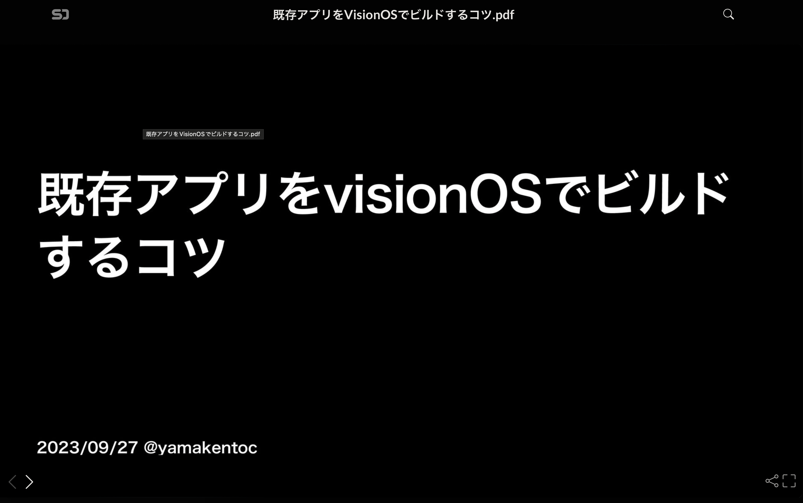

---

# noppe

- DeNA Co., Ltd.
- 𝕏: @noppefoxwolf
- mastodon: @mstdn.jp@noppefoxwolf

---

# 今日のお話

既存アプリをvisionOS対応してリリースした話

---

# 既存アプリ

- DAWN for mastodon

- $2.99

- iOS, iPadOS, macOS(Catalyst)

- Swift 5.9

- UIKit & SwiftUI

- Swift Package Manager

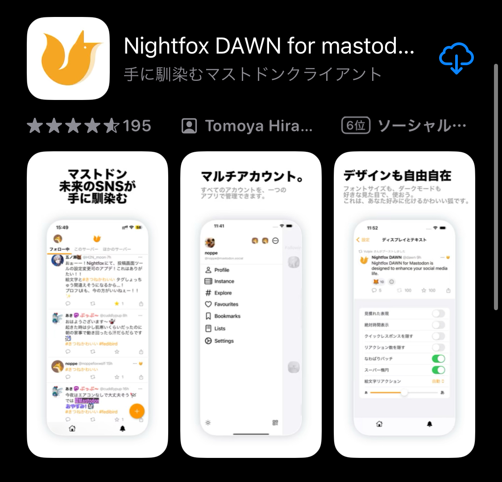

---

# 結論：対応できた

- おめでとう！！

- Apple Vision Proのローンチに間に合った

- 対応期間は１週間くらい

- Susan Prescott(副社長)から感謝のエモいメールが来た


^ スーザン・プレスコット

---

# 結論：対応できた

- おめでとう！！

- Apple Vision Proのローンチに間に合った

- 対応期間は１週間くらい

- Susan Prescott(副社長)から感謝のエモいメールが来た

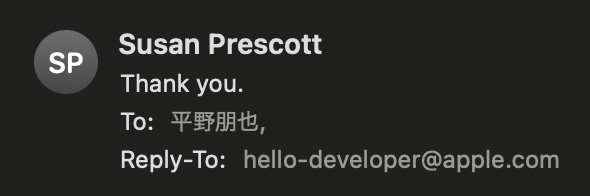

---

# visionOS対応の選択肢

1. iOS SDKでビルド

2. visionOS SDKでビルド

3. 新しく作り直す

---

# iOS SDKでビルド

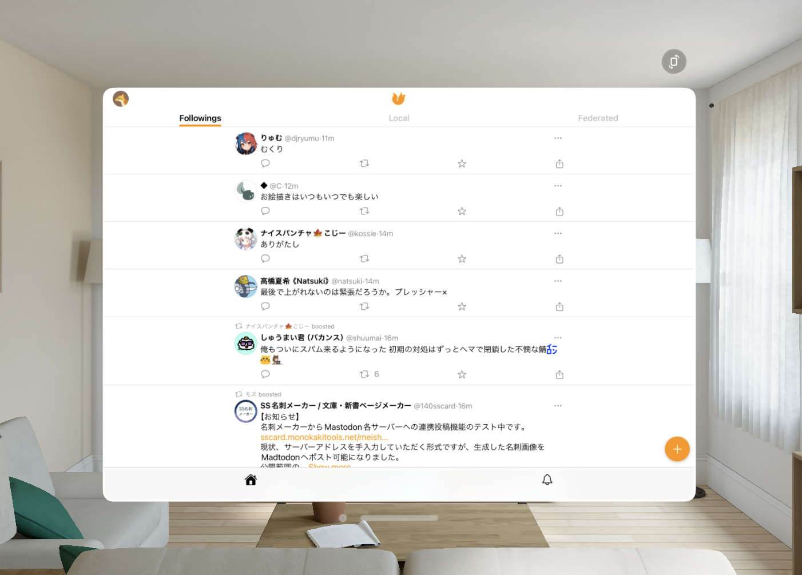

- iPadアプリとして動作する
- 公開設定を変更しなければ自動的にiPadアプリとして公開される
- ホーム画面には追加されず、Compatible Appsに入る

---

# iOS SDKでビルド

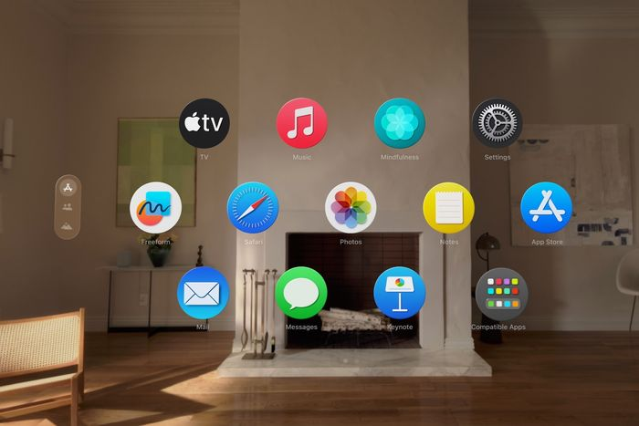

- iPadアプリとして動作する
- 公開設定を変更しなければ自動的にiPadアプリとして公開される
- ホーム画面には追加されず、Compatible Appsに入る

---

# visionOS SDKでビルド

- ちょっとした修正が必要
    - UIKitが動くので比較的簡単
- UIの全てがvisionOSに最適化される
- 今回はこっちに挑戦


---

# ちょっとした修正

- visionOSで動かない機能を無効化
- UIの修正
- アイコンとストア情報の準備

---

# visionOSで動かない機能を無効化

- Alternative App Icon
- ColorScheme
- App Extensions
- 対応してないライブラリの対応・除外・置換

---

# Alternative App Icon

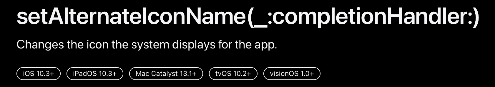

- visionOS 1.0+

---

# Alternative App Icon

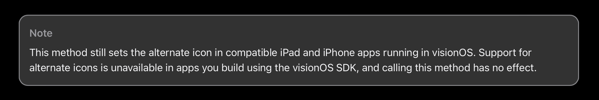

- 呼べるけど、動かない
    - 互換性のために、こういうAPIがまぁまぁありそうなので、要動作チェック

---

# ColorScheme

- アプリ内のダークモード・ライトモードの切り替えする機能があった
- `overrideUserInterfaceStyle`で変更は出来るが、ダークモード・ライトモードの見た目が一緒

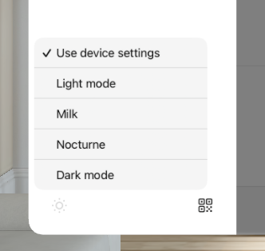

---

# コードの除外

```
#if os(iOS)
alternativeAppIconButton()
#endif
```

- #if os(iOS) ~ #endifで囲むことでビルド時に除外できる

---

# App Extensions

Widget Extensionは動かない

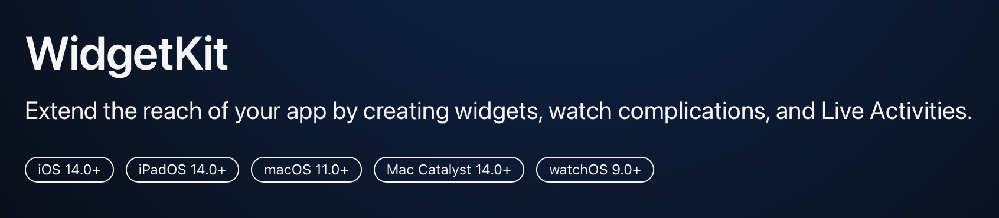

---

# App Extensions

Embed Foundation ExtensionのFiltersでWidgetはフィルタする

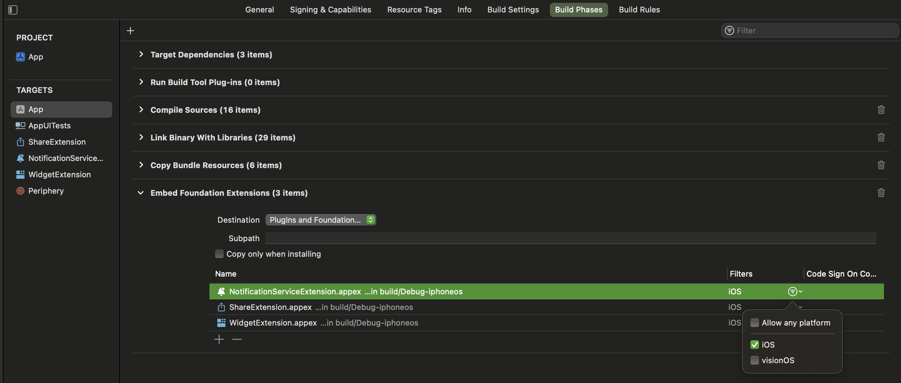

---

# App ExtensionsもvisionOS SDKでビルドすること

Designed for iPadになっていると、本体がvisionOS SDKだとコケる

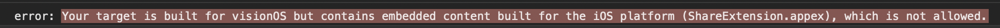


---

# 対応してないライブラリの対応・除外・置換

PR送ったりした

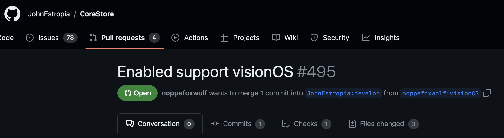

---

# 対応してないライブラリの対応・除外・置換

TwitterTextEditorも自前のコードに置き換え

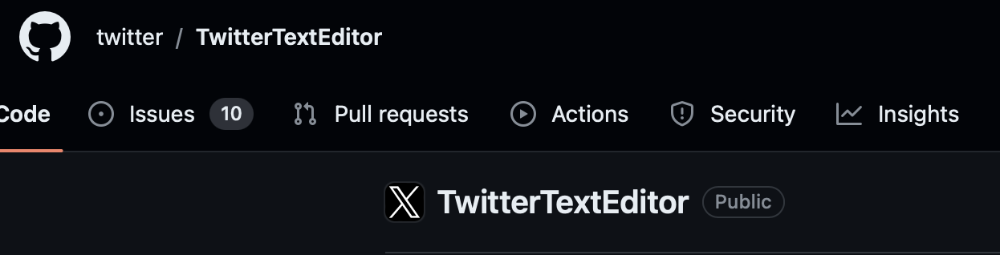

---

# 対応してないライブラリの対応・除外・置換

対応が難しそうなものは、iOSにだけ入れることもできる

```
.product(
    name: "CropViewController",
    package: "TOCropViewController",
    condition: .when(platforms: [.iOS])
),
```

```
#if canImport(CropViewController)
...
#endif
```

---

# UIの修正

キーボード上のツールバーのAPIである、`inputAccessoryView`がvisionOSでは使えない

- 送信とか諸々詰め込んでいたので困った
- 代替案を探す

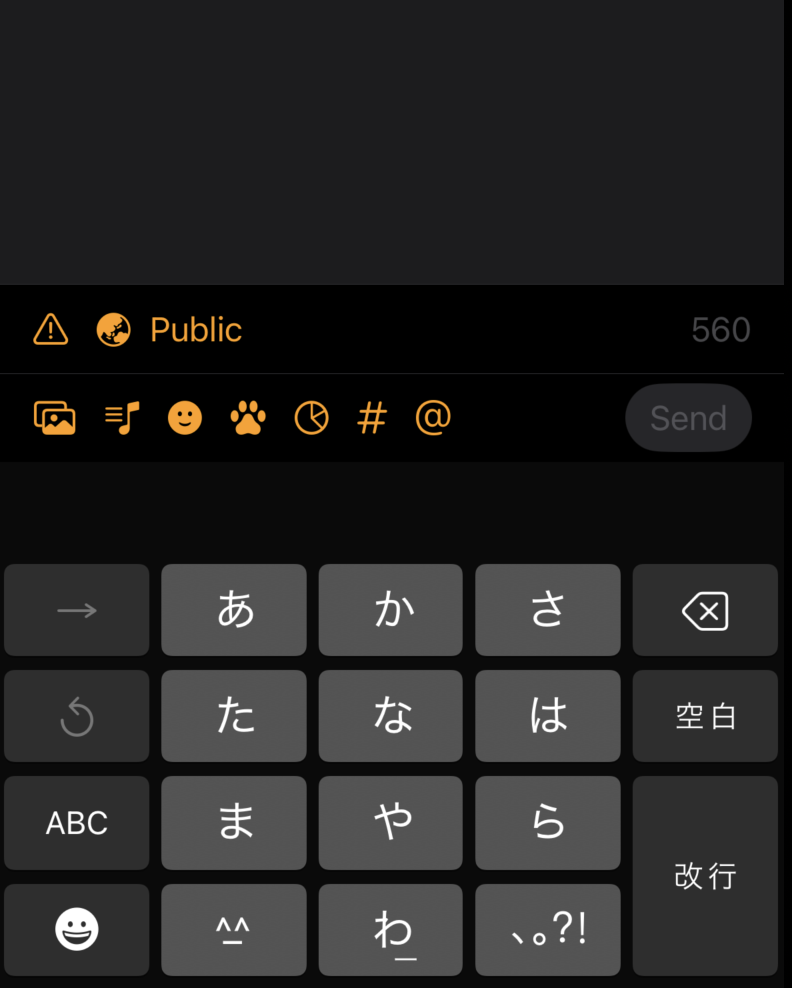

---

# UIの修正

visionOSは、`UIOrnament`に実装を移した

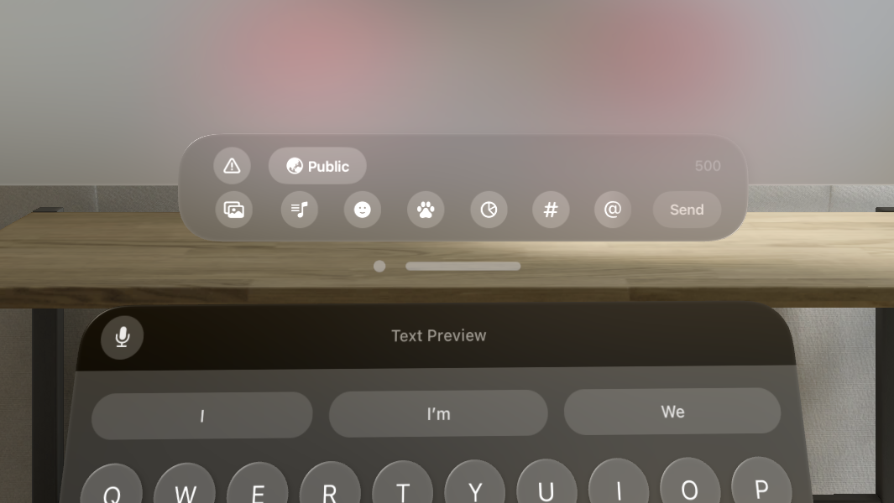

---

# UIの修正のコツ

```swift
// visionOS
ornaments = [UIHostingOrnament {
    /* SwiftUI ViewBuilder */
}]

// iOS
accessoryView = AccessoryHostingView {
    /* SwiftUI ViewBuilder */
}
```

UIHostingOrnamentを参考に、bodyをSwiftUIで書けるようなUIを作っておくと共通化できて便利

---

# 完成！

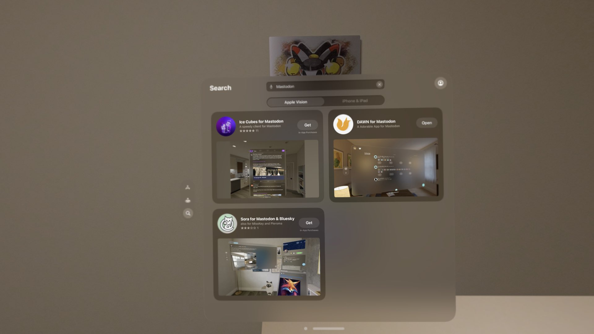

---

# まだまだ最適化は続く

- 実機で触ってみるとどんどん課題ややりたい事が見えてくる
  - 操作を減らしたい
  - 画面上のボタンを減らしたい
  - メディアを3Dで表示したい
  - なんかパフォーマンス悪い
