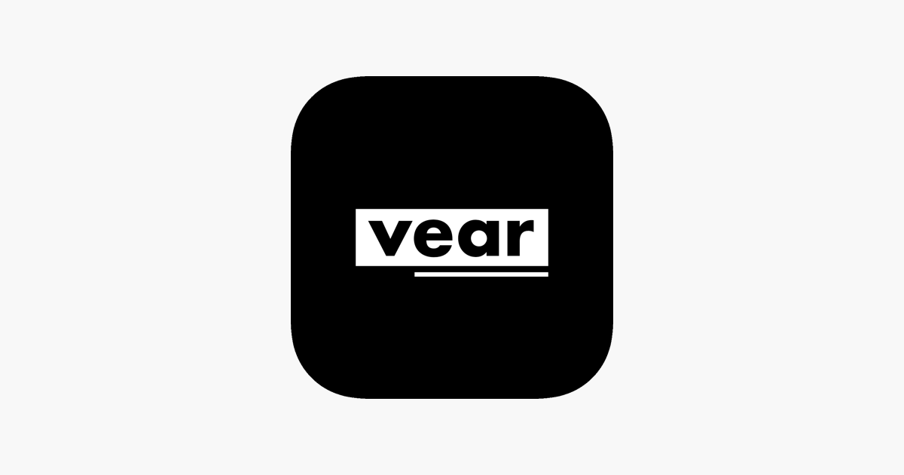
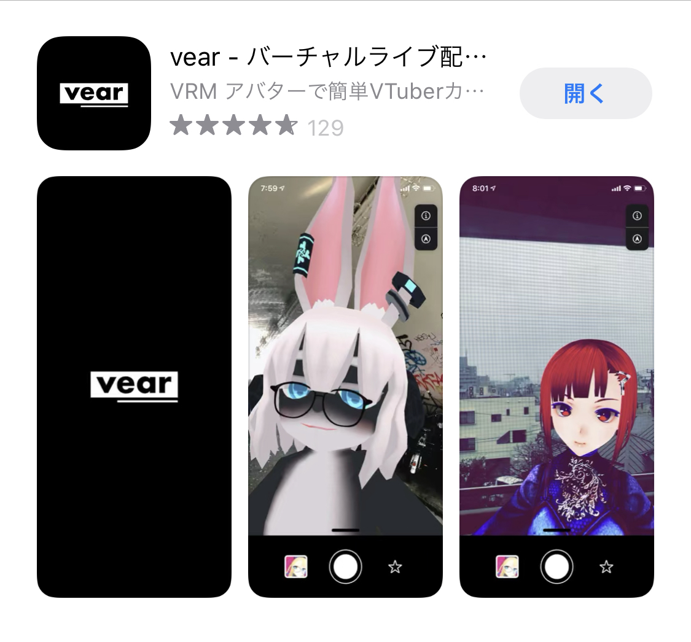
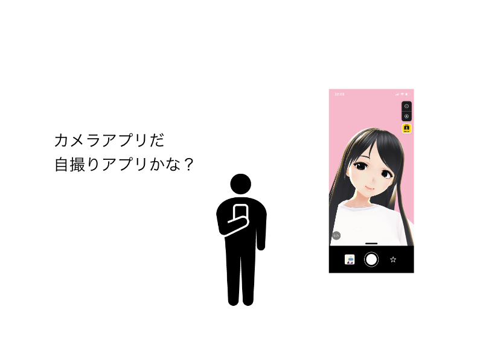
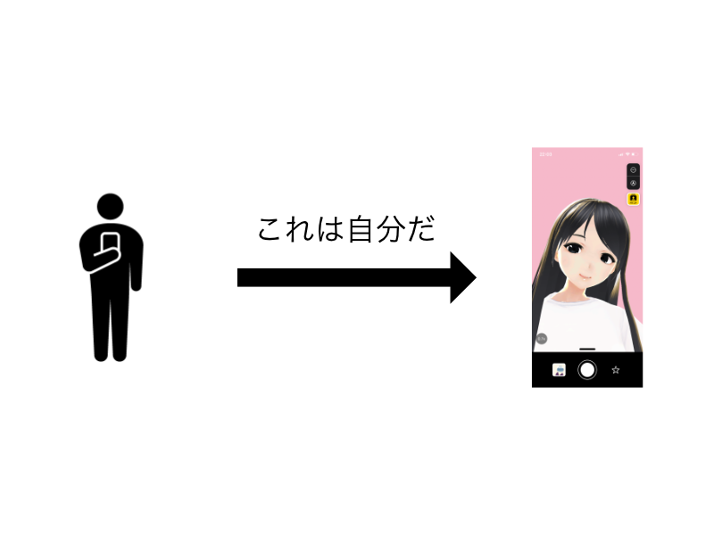
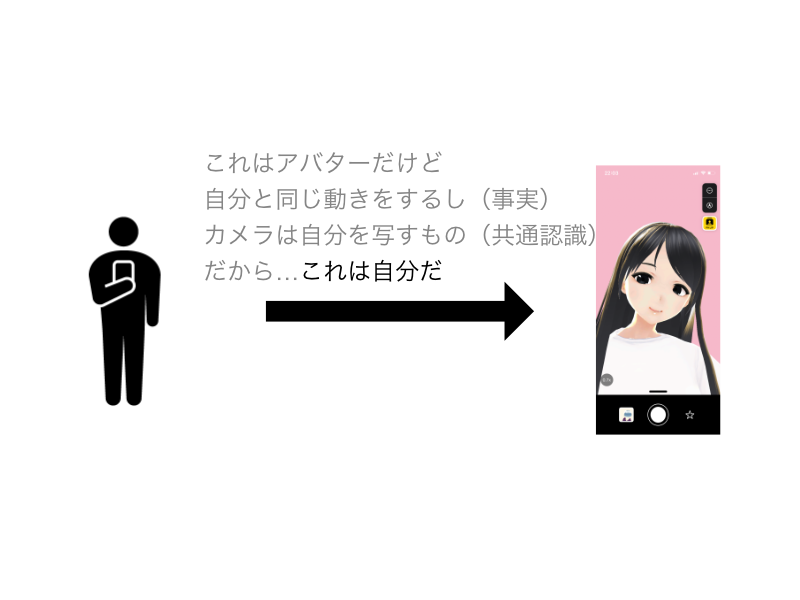
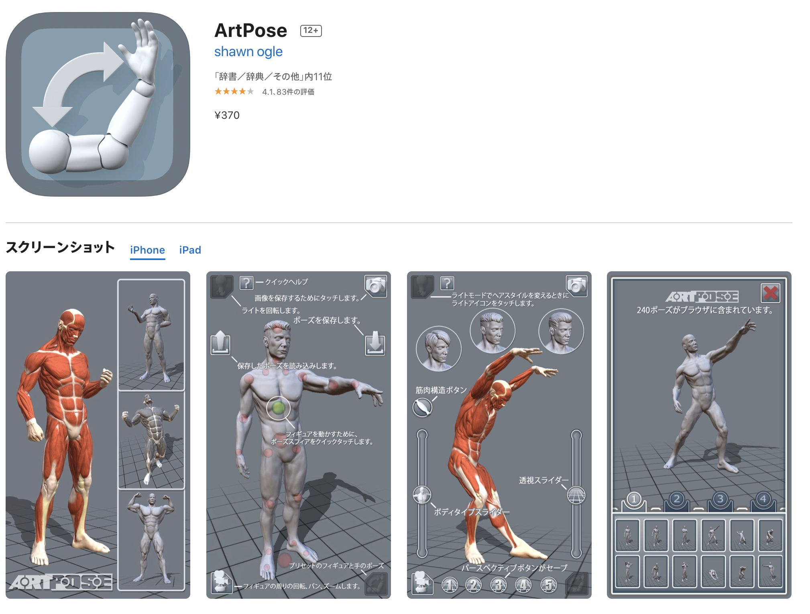
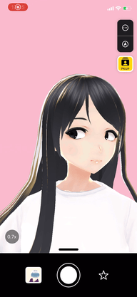
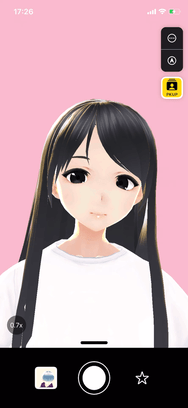
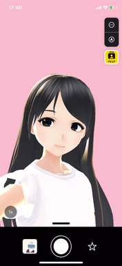
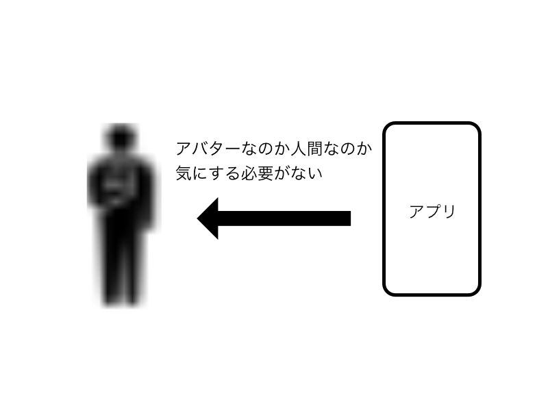

slidenumbers: true

# vearが実現するアバターによる拡張現実

## noppe xRDCC 2020 C-3

^ よろしくお願いします
^ vearが実現するアバターによる拡張現実という話をします。
^ vearというのはこの後説明しますが、2020年の初頭に自分がリリースしたアプリの名前です。
^ vearの開発を通して感じた、モバイルだからこそ提供出来た価値とその技術背景を語ります。

---

# noppe

- iOSアプリ開発者

    普段はiOSDCやtry!Swiftで登壇

    VRM勉強会実は出た事ない

- vear開発者

- きつねが好き

^ まず自己紹介
^ 仕事ではバーチャルじゃないソーシャルライブのアプリの開発とかしてる
^ きつねが好きで夜狐作った

---

# 最初に

スマホファーストなアプリに関するトークになります

VRやコンシューマとは違った世界の話だと思うので、そこも楽しんでいただければ！

---

^ 最初にvearを知らない人がほとんどだと思うので紹介します。

---

# vear

- iOS向け

- 基本機能無料

^ iOS向け、iPhoneX移行の全画面端末のみ
^ プレミアム課金あり
^ では起動直後の画面をみてみましょう
^ 実際にインストールして使ってみて欲しい

---

^ 起動するとこんな感じの画面になります。
^ さて、このスクショだけでみなさんどんなアプリだと思いますか？

---

# カメラアプリ？

^ カメラアプリ？と思った方その通りです。

---

# 自撮りアプリ？

^ 特に自分のアバターを持っている人は自撮りアプリ？と思ったかたもいるのではないでしょうか。

---

# vear

- iOS向け

- 基本機能無料

- アバターをフェイスモーフィング

- 撮影・録画・配信

^ はい、どちらも正解でvearはMimojiのようにフェイスモーフィングをして撮影・録画・配信するアプリです

---

^ ところでみなさんカメラアプリであることはパッとみてわかると思います。
^ そしてここに映っているのが、自分であることはすんなり受け入れられると思います
^ もしかしたら通話アプリかなとか思った人もいるかもしれませんが、実際使ってみればそうは思わないと思います。

---

^ このようにぱっと見て自然に理解できるようなUIにすることで、vearは現実とバーチャルの垣根を無くせるように設計しています。
^ この「自分だ」という認識は間違っていますが

---

^ このようにUIの力で自然に納得させています。
^ これは言い換えればメンタルモデルに対する現実の拡張で、ユーザーが目的の行動をするまでにアバターの存在を意識しないように設計しているということです。

---

# アバターから意識を逸らせる理由

撮影や配信といった提供したい価値にフォーカスさせるため

^ このようにアバターから意識を逸らせる理由は...

---

# アバターから意識を逸らせる理由

撮影や配信といった提供したい価値にフォーカスさせるため

- なぜアバターに意識が向いてしまうと、価値が届かなくなってしまうのか

^ ではなぜアバターに意識が向いてしまうと、価値が届かなくなってしまうのかを追っていきましょう。

---

# アバターから意識を逸らせる理由

撮影や配信といった提供したい価値にフォーカスさせるため

それは…

- 実は動かして満足してしまいがちで

- ポーズや見た目に拘ったりすると目的に到達できないから

^ これはアバターの使い方の影響が大きく絡んできます

---

アバターを使ったアプリには大きく分けて二つある

- 着ぐるみ式

- パペット式

---

# 着ぐるみ式

vearはこっち

一人称視点からアバターとシンクロして操作する

スポーツをしたり、ダンスを**したり**

https://en.wikipedia.org/wiki/Motion_capture

^ 着ぐるみ式はフルトラッキングVRとか、トラッカーを使うアプリで鏡を見ていたり自分自身が動くと一緒に動き出すことが特徴

---

# パペット式

第三者視点から操作する

アバター≠自分

ポーズを取らせたり、ダンスを**させたり**

^ パペット式は、関節をマウスで操作したりしてポーズをつけたりする

---

目的までの経路

- 着ぐるみ式
    - **動かした上で**演技や行動をする
    - 目的：野球をする ≠ 動かす

- パペット式
    - 動かすことが直接目的になっている
    - 目的：ポーズを取る = 動かす

---

着ぐるみ式の方が経路が多いので、動かすことにフォーカスさせると目的に到達できない

- 最初の画面を動く状態にしておく（重要）

---

# 着ぐるみ式の弱点

---

# 着ぐるみ式の弱点

没入感から放り出されやすい

- ただですら現実じゃないものを現実と認識させている

- 動かした通りに動かないだけで現実感が損なわれる

特にアバターをメタ視点で見せてしまうと、没入感が損なわれる

^ これらは些細な事ではあるが、納得感よりも違和感の方が多くなれば確実に起こる

---

# 没入感が損なわれると

- 関心は何をしようかでは無く、誰になろうかという点に向いてしまう

- 操作する事に思考が取られてしまう

→また目的までが遠くなってしまう…

^ 関心の話は自分のモデルとか持ってると分からないけど、ほとんどの新規ユーザーは自分のアバターをモンタージュで作りたいとか、そういう意識。それを最大限逃したかった。
^ 例えば舌を出したらピースをしますみたいなのは、操作する事に思考が取られてしまう
^ 難しい操作のゲームをやり始めた時って操作に集中しちゃう
^ 同じことがDLしてすぐに使い始められないといけないはずのアプリで起きてしまう

---

# 違和感を減らし納得感を増やす

- VRと違って、スマホアプリのライフサイクルは短いので没入しきるまでの時間が重要

^ 没入感を維持するために、とにかく違和感を減らして、納得感をふやす
^ ライフサイクル大体3~10分くらい

---

# 違和感を減らすためにしたこと

- ARKitから取れる情報はなるべく反映する
- 現実と乖離する部分は隠す
- できない事はしない

---

# ARKitから取れる情報はなるべく反映する

- 回転のみでなく、位置情報も使う

- 瞬きや視線の他に多くの情報が取れる

---

# 現実と乖離する部分は隠す

トラッキングが外れてもホームポジションに移動させたり、画面端に出しっぱなしにしない

---

# できない事はしない

遅延や実際の動きと異なると自分の動きを元にフィギュアを動かしている気持ちになってしまう。

---

# できない事はしない2

トラッキングできない全身は見せない

身体の動きが反映できないとなると、手の位置が現実と異なって違和感になる、なるべくバストアップのみが見える範囲にした

---

# 違和感をなくした後

ここに来てようやく普通のカメラアプリと同じ場所に立てます

でもこれがとても重要、なぜなら

---

^ アバターの垣根を越えればそのさきは生身の人間かアバターかの区別が不要になる
^ つまりファーストインプレッションのまま、普通のカメラアプリとして使ってもらえる。
^ 人間が自然にする動きだけを想定しておけば、成り立つようになる。
^ これの何が嬉しいかというと

---

# 人間向けカメラアプリの資産が使える

- フィルター機能

- ステッカー

- ウィンクしたら何かするとか

^ 現実のカメラアプリで発明された遊びを持ち込むことができる（過去の資産の再利用）
^ SNOWやTiktokみたいな遊び、例えばフィルター機能やアクセサリ機能

---

# 目的までの経路も気を抜かない

配信や撮影においても、違和感は減らす。

- 共通認識を上手に使う

---

# 共通認識を上手に使う

- カメラアプリらしい見た目から外れない

- スマートフォンの特性を活かす

^ iPhone持ってる人は全員カメラのUI見てる。それに寄せる

---

# 共通認識を上手に使う2

- OSのデザインに沿ったUI
    - ボタン・トグル
    - サウンド
    - アイコン

- ゲームっぽく見せない効果

- Unity as a Library

^ プラットフォームのガイドラインに添うのも大事
^ iOSの場合はHIGに添うと良い
^ これに添わないとアプリの世界観が強すぎてゲームっぽく見える
^ Unityで同じこともできるけどvearではUAAL使ってUI部分だけ

---

# バーチャルの住人に対しても気を抜かない

既に活躍しているVTuberに向けて

^ ユーザー層、ここまでライトな層向けの話
^ 既に活躍しているVTuberに向けて

---

# エピソード

^ 最初はVRMKit使った
^ MToon/SpringBoneが未実装だった
^ SpringBoneは実装したけど、MToonの実装がキツそう
^ 個人アプリでやる？コスト観点からUnityへ移行
^ Unity移行することでVRoid hubが使えるようになった

---

# 最近の流行

**パーフェクトシンク**

固定名のBlendShapeを登録してARKitの表情を同期する[^詳細]

眉とか舌とか動かせる[^ps]

- iFacialMocap

- Emosign

[^ps]:https://twitter.com/hinzka/status/1274311176273289218?s=20

[^詳細]:https://hinzka.hatenablog.com/entry/2020/08/15/145040

^ BlendShapeを大量に登録して、ARKitで撮った表情をなるべく反映させる

---

# プレミアム課金の設計

プレミアム課金は一般ユーザーから一定の距離を置きつつ自由度の高いオプションを提供する場

^ これらの試作は、バーチャルのファーストステップに対するアプローチ
^ 既にVTuberをしていたりVRCなどで遊んでいる人は多少パペット的なアプローチを取ってもシンクロすることができる

---

# まとめ

vearはいかに自然にアバターの壁を超えるかを大切にしています。

- メンタルモデルに対しても何を拡張しているのか考える

- アバターを目立たせない事で目的の価値を提供しよう

- アバターアプリは簡単に没入感が壊れがち

---

おわり

