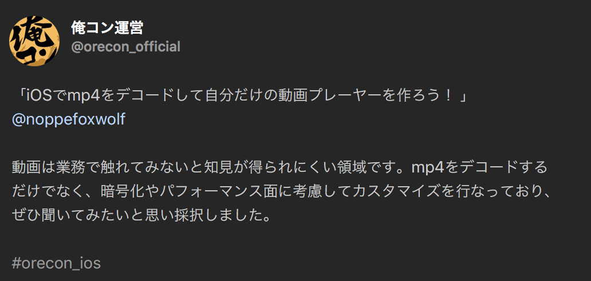
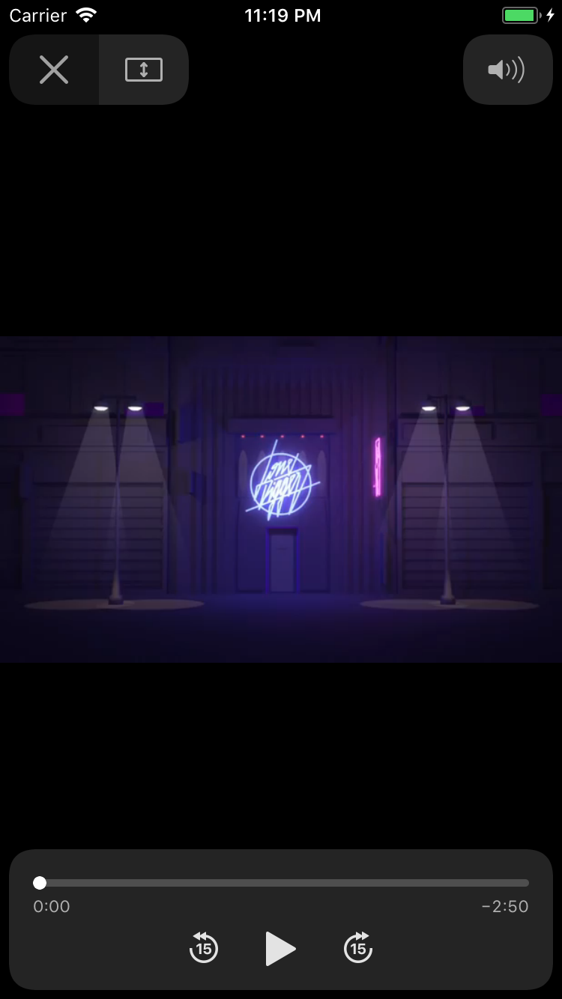
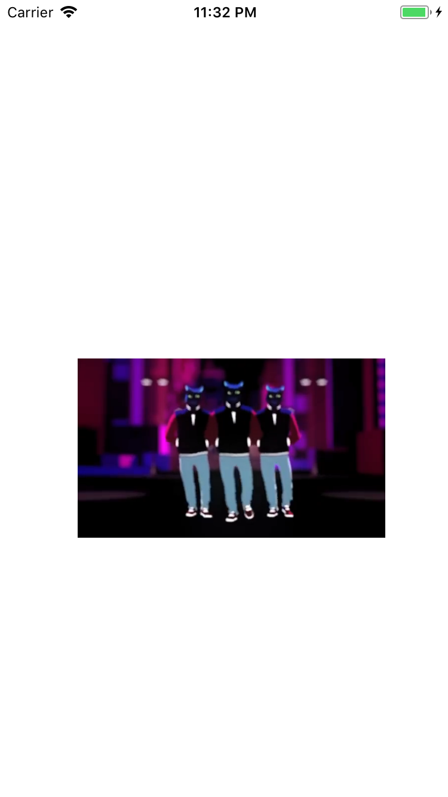
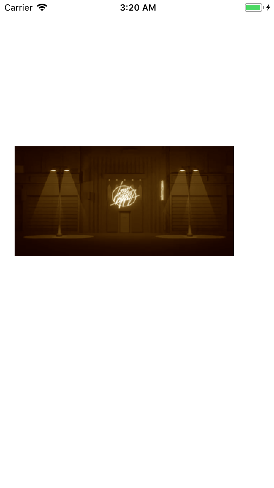
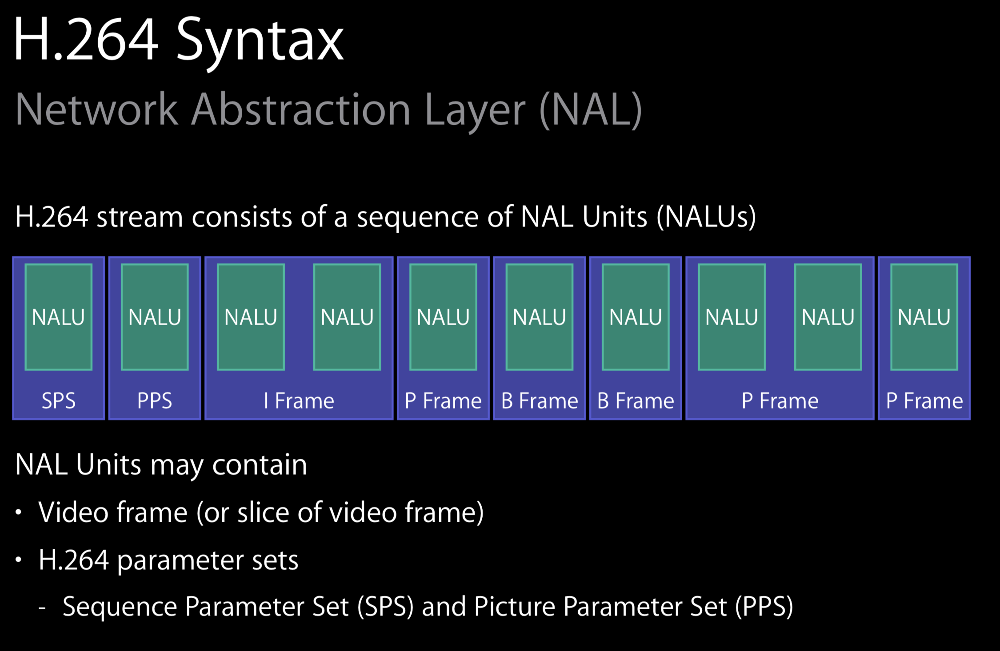

footer: \#orecon \#c 🦊
slidenumbers: true

# iOSでmp4をデコードして自分だけの動画プレーヤーを作ろう！
## 俺コン 2018 Summer / Day. 1 - C

---

# iOSDCお疲れ様でした！！

---

# ライブ配信アプリのアイテム再生をMetalで実装する事になった話

iOSDCで9/2に登壇しました

---

#[fit] noppe

🏢 株式会社ディー・エヌ・エー
🦊 きつねかわいい
💻 アプリ開発２０１０〜


---

# What is 俺コン

「採択してほしかった」「聞きたかった」トークをアンケート

めっちゃ嬉しいです😂

---



---

_動画は業務で触れてみないと知見が得られにくい領域です。_
→ 今日の話です！

_暗号化やパフォーマンス面に考慮してカスタマイズを行っており_

---

_動画は業務で触れてみないと知見が得られにくい領域です。_
→ 今日の話です！

~~_暗号化やパフォーマンス面に考慮してカスタマイズを行っており_~~
→ 今日はやりません！

---

# 一番簡単な方法

---

# AVPlayerController

- AVKit.framework

- AVPlayerを渡せば適当に再生してくれる

- iOS8.0+

---

# AVPlayerController

```swift
let vc = AVPlayerViewController()
vc.player = AVPlayer(url: url)
present(vc, animated: true, completion: nil)
```

---

[.autoscale: true]

# AVPlayerController

## 😄 

- OSやデバイスごとに最適なデザイン

- Airplayなどにもサポート

- 操作UIが提供される

## 😩

- UIのカスタマイズ性はない




---

# UIをカスタマイズしたいときは？

---

# AVPlayerLayer

- AVFoundation.framework

- AVPlayerを渡して操作

- iOS 4.0+

---

# AVPlayerLayer

```swift
let player = AVPlayer(url: url)
player.play()

let layer = AVPlayerLayer(player: player)
layer.frame = frame
view.layer.addSublayer(layer)
```

---

# AVPlayerLayer

## 😄 

- CALayerとして扱えるので柔軟

## 😩

- 特になし



---

# 特になし

---

# 特になし？

---

# AVPlayerLayerで事足りない時

- VRゴーグルで見れるようにして＾＾

- 映像から人だけ抜き出して再生したい〜

- 動画にリアルタイムでエフェクトをかけたい

---

# AVPlayerLayerで事足りない時

映像自体を歪ませたり、フィルタをかけるにはAVPlayerLayerではできない。

特にリアルタイムの処理になるほど難しい。

---

# AVAssetReader

- AVAssetReaderTrackOutputと組み合わせると毎フレームのCMSampleBufferが取れる

---

# AVAssetReader

// 仕組みを図で

---


# AVAssetReader

```swift
let asset = AVURLAsset(url: url)
let video = asset.tracks(withMediaType: .video).first!
let reader = try! AVAssetReader(asset: asset)
let output = AVAssetReaderTrackOutput(track: video)
if reader.canAdd(output) {
  reader.add(output)
}

output.copyNextSampleBuffer()
```

---

[.autoscale: true]

# AVAssetReader

描画先は自由

- UIImageView

```swift
let image = CIImage(cvPixelBuffer: pb)
imageView.image = UIImage(ciimage: image)
```

- AVSampleBufferDisplayLayer

```swift
let sb = output.copyNextSampleBuffer()
displayLayer.enqueue(sb)
```

---

[.autoscale: true]

# AVAssetReader

- Metal

```swift
CVMetalTextureCacheCreateTextureFromImage(kCFAllocatorDefault,
    textureCache,
    imageBuffer,
    nil,
    pixelFormat,
    width,
    height,
    0,
    &imageTexture)

// ~ 省略

commandBuffer.present(drawable)
commandBuffer.commit()
```

---

# AVAssetReader

## 😄 

- 毎フレームのSamplerBufferが得られる

## 😩

- 音声は別で処理



---

# これで何でも出来そう

---

# これで何でも出来そう？

---

# snapshot問題

---

# snapshot問題

ネットワークリソースのURLを指定して再生すると、起こる問題。
再生している動画リソースのスナップショットが撮れない。

---

# snapshot問題

|||
|---|---|
|snapshotViewAfterScreenUpdates|真っ暗|
|AVAssetImageGenerator|ローカルのみ|
|AVAssetReader|outputを接続できない|
|OSのスクショ|撮れる|

---

# 詰んだ

---

# 詰んでない！！！

---

# VTDecompressionSession

- VideoToolbox.framework

- iOS8.0+

- ハードウェアデコーダのインターフェイス

- デコード済みのCVPixelBufferを返す

---

# mp4の構造

// ３枚のスライド

---

# swiftでmp4をboxごとにパースする

InputStreamで4,4,boxSize - 8の順番で読み続ければOK[^1]

```swift
let stream = InputStream(url: url)
stream.open()
while stream.hasBytesAvailable {
    let size = stream.readUint32()
    let type = stream.readAscii(4)
    let data = stream.read(size - 8)
}
```

[^1]:https://github.com/noppefoxwolf/MP4BoxDumper.swift

---

# mp4の構造

```
ftyp(24)
moov(52997)
    trak(19399)
    trak(33461)
    ...
mdat(8754890)
```

構造例

---

# ftyp

4byteごとにサポートしているブランド[^2]が並ぶ
先頭は`Major Brand`、そのあとは`Compatible Brand`[^3]

```
Major Brand: mp42
Compatible Brand: isom
Compatible Brand: mp42
```

[^2]:http://www.ftyps.com

[^3]:MajorとCompatibleの間には4byte空く

---

# mdat

動画と音声の実データが格納されている。

---

# moov

多くのboxで構成されるbox
mdatのどの位置にどのデータが入っているかなども、このboxの中にあるboxで定義されている

---

[.autoscale: true]

# TIPS

FairPlay (DRM)[^4]

mdatに暗号化されたオーディオデータ
マスターキーを暗号化してコンテナに保存
マスターキーの複合キーはアカウントとHW識別子で管理

[^4]:https://developer.apple.com/streaming/fps/

^ iTunes Storeで使われる

---

# MP4から映像データを取り出す

moovに含まれる情報を元に、mdatから探す。

のですが…

---

今日は、事前に取り出したものを用意しました…

```shell
$ mp4box -raw 1 movie.mp4
Extracting MPEG-4 AVC-H264 stream to h264
```

---

# h264の構造とデコード[^5]

[^5]:https://speakerdeck.com/noppefoxwolf/video-decode-on-ios

---

[.footer: https://developer.apple.com/videos/play/wwdc2014/513/]



---

# SPS/PPS

NALユニットに存在

---

# SPS - (Sequence Parameter Set)

プロファイル、レベル

---

# PPS - (Picture Parameter Set)

ピクチャの符号化

---

# IDR Picture

- h264は、１枚の画像とその差分で数秒の映像を表現する

- IDR Pictureはその元になる１枚

- キーフレームとも言う

---


取り出し方
8byteのヘッダをパース
サイズ・タイプ
タイプを見て入れ子になっているかを判定
// 入れ子コード描きたい
http://www.mpeg.co.jp/libraries/mpeg_labo/winPC_26.html

---

ftyp
moov
    trak
mdat


mp4v/s263/avc1: ビデオ
mp4a: オーディオ

https://albel06.hatenablog.com/entry/2018/07/01/173711
https://www13.atwiki.jp/teematsu/pages/62.html

mdatからデータを取り出す

---

# aacの場合

accheaderをつけて連結

---

# h264の場合

???

---

# aacの再生


---

# 動画プレーヤ
MP4 -> 映像・音

# AVKit

AVPlayerViewController

---

# AVFounadtion

AVPlayer
AVPlayerLayer

^ AVPlayerViewControllerも内部の構造はこのようになっている
MP4 -> AVPlayer -> AVPlayerLayer
                -> sound

---

MP4 -> H264+AAC -> Decoder -> Picture+PCM -> Output

---

# H264

VideoToolbox.framework

VTDecompressSession

---

# AAC

AudioToolbox.framework

AudioFileStreamOpen

---

# mp4の分割

AAC
trakの1番目
とりあえずaacのヘッダで繋いであげれば出来上がる

h264

---

