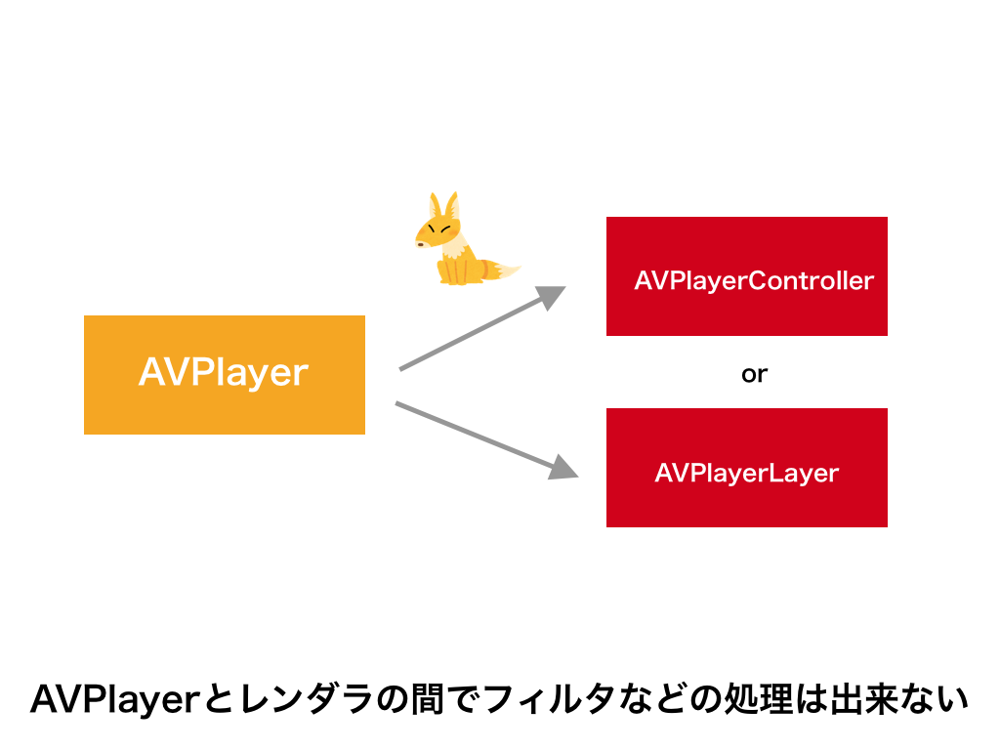
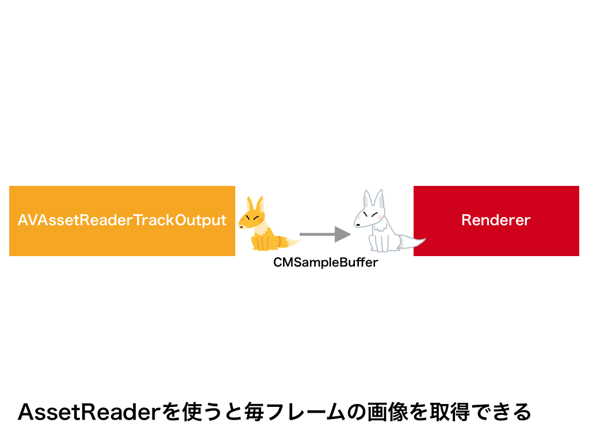
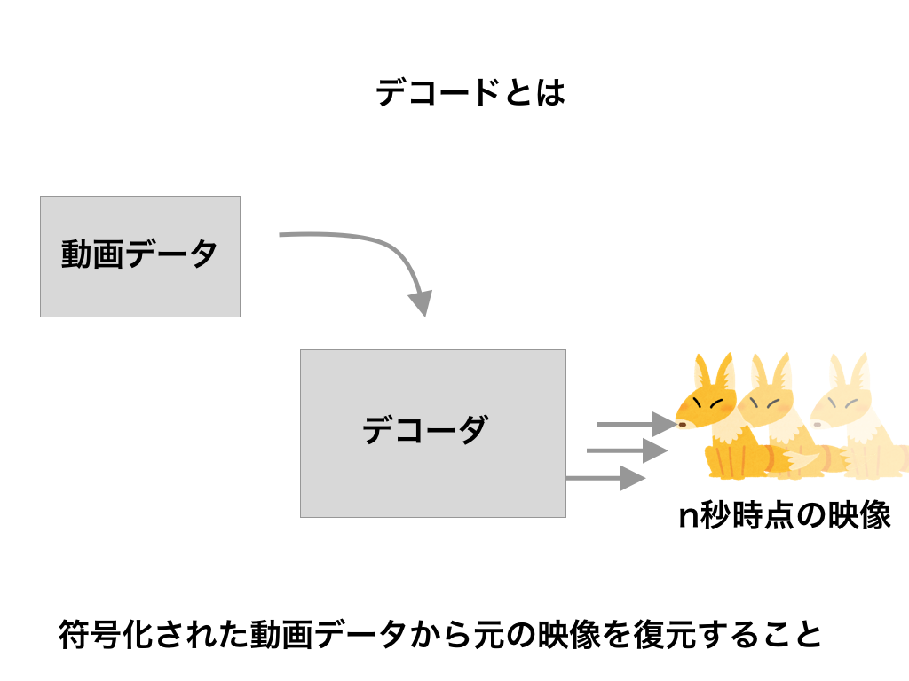
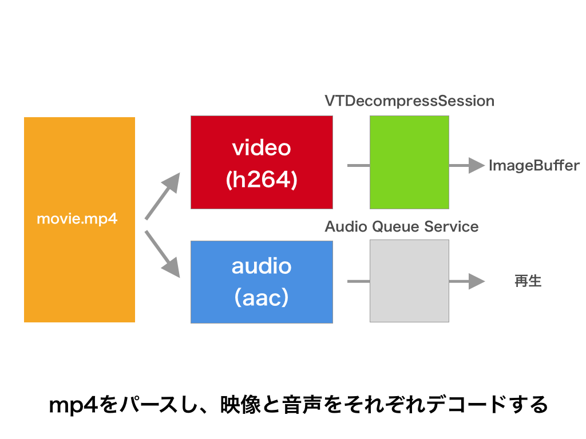
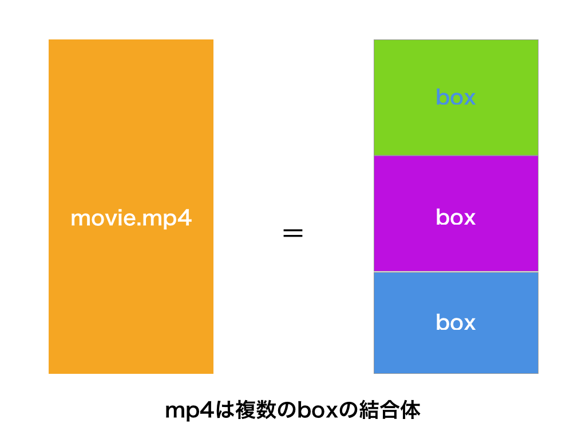
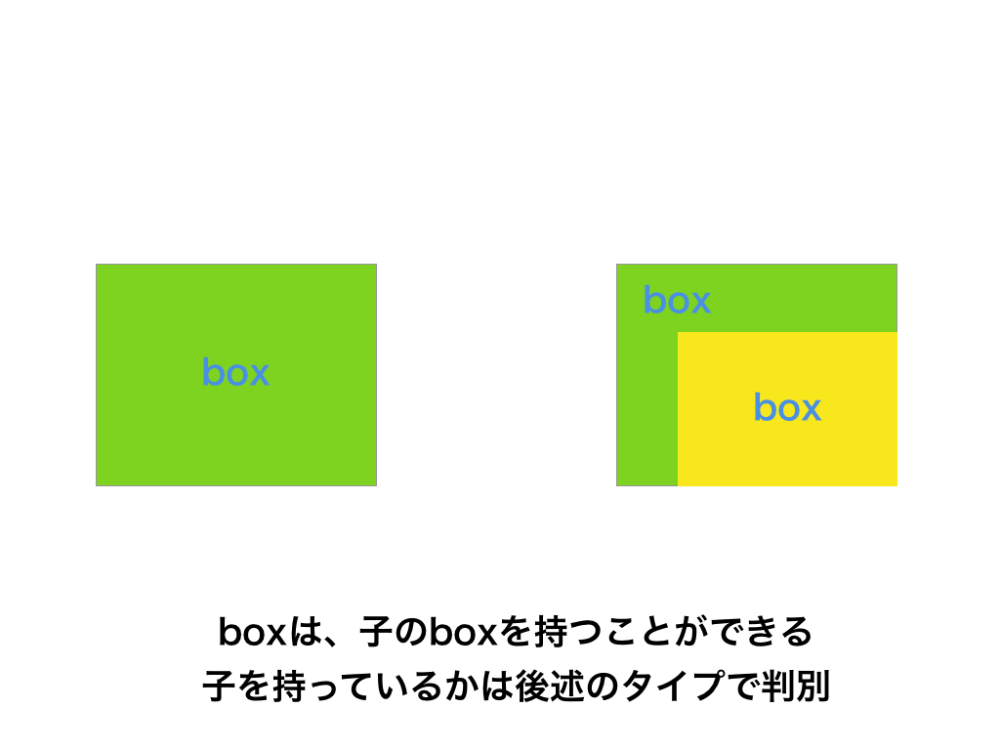
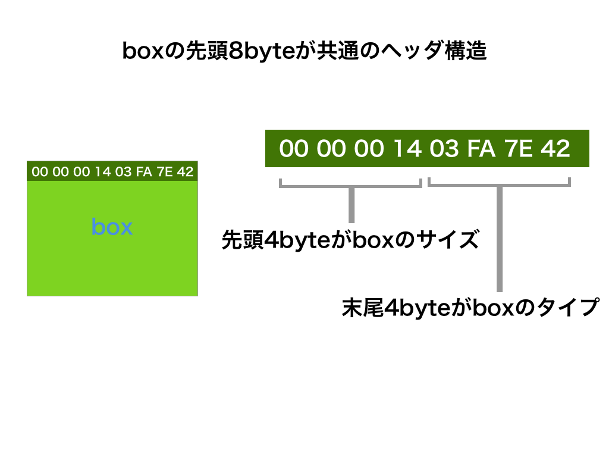
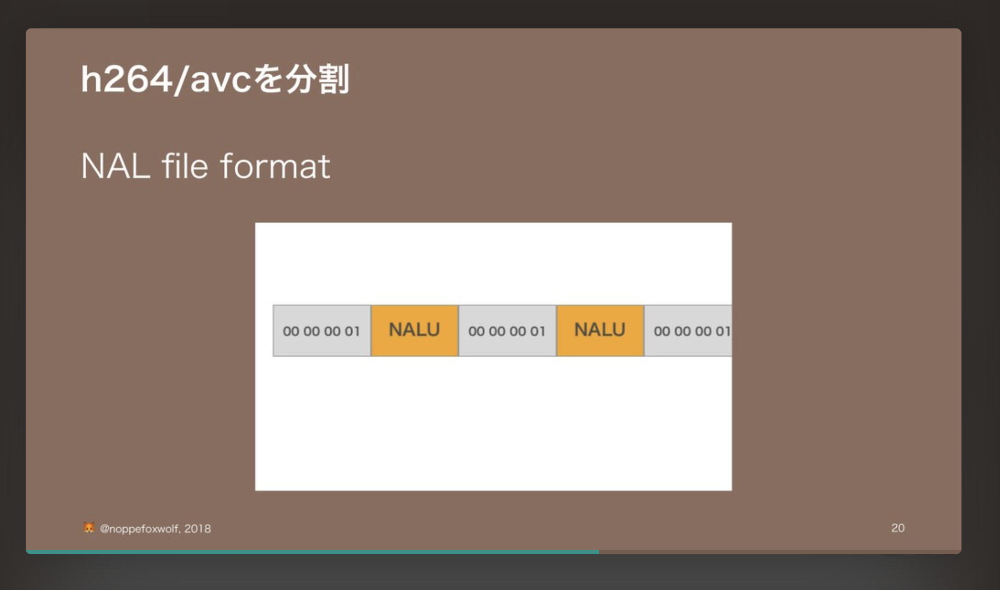
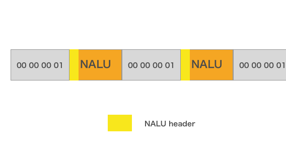

footer: \#orecon \#c 🦊
slidenumbers: true

# iOSでmp4をデコードして自分だけの動画プレーヤーを作ろう！
## 俺コン 2018 Summer / Day. 1 - C

---

# iOSDCお疲れ様でした！！

---

# ライブ配信アプリのアイテム再生をMetalで実装する事になった話

iOSDCで9月2日に登壇しました。

各方面にありがとうございます！

https://goo.gl/BYwDNB


---

#[fit] noppe

🏢 株式会社ディー・エヌ・エー
🦊 きつねかわいい
💻 アプリ開発２０１０〜
🎈 今日誕生日


---

# What is 俺コン

> 「採択してほしかった」「聞きたかった」トークをアンケート

🦊 o O (めっちゃ嬉しい😂)

---


---

_動画は業務で触れてみないと知見が得られにくい領域です。_
→ 今日の話です！

_暗号化やパフォーマンス面に考慮してカスタマイズを行っており_

---

_動画は業務で触れてみないと知見が得られにくい領域です。_
→ 今日の話です！

~~_暗号化やパフォーマンス面に考慮してカスタマイズを行っており_~~
→ 今日はやりません！

---

//アジェンダ

---

# 一番簡単な方法

---

# AVPlayerController

- AVKit.framework

- AVPlayerを渡せば適当に再生してくれる

- iOS8.0+

^ iOS8.0未満ではMPMoviePlayerControllerとか言われていたものです

---

# AVPlayerController

使い方

```swift
let vc = AVPlayerViewController()
vc.player = AVPlayer(url: url)
present(vc, animated: true, completion: nil)
```

---

[.autoscale: true]

# AVPlayerController

## 😄 

- OSやデバイスごとに最適なデザイン

- Airplayなどにもサポート

- 操作UIが提供される

## 😩

- UIや機能のカスタマイズ性はない


---

# UIをカスタマイズしたいときは？

---

# AVPlayerLayer

- AVFoundation.framework

- AVPlayerを渡して操作

- iOS 4.0+

---

# AVPlayerLayer

```swift
let player = AVPlayer(url: url)
player.play()

let layer = AVPlayerLayer(player: player)
layer.frame = frame
view.layer.addSublayer(layer)
```

---

# AVPlayerLayer

## 😄 

- CALayerとして扱えるので柔軟

## 😩

- 特になし


^ CALayerとして使えるので、UITableViewCellの中にも置けます。
^ アニメーションもかけれる

---

# 特になし

---

# 特になし？

---

# AVPlayerLayerで事足りない時

- VRゴーグルで見れるようにして＾＾

- 映像から人だけ抜き出して再生したい〜

- 動画にリアルタイムでエフェクトをかけたい

---

# AVPlayerLayerで事足りない時

映像自体を歪ませたり、フィルタをかけるにはAVPlayerLayerではできない。

特にリアルタイムの処理になるほど難しい。

---



---

# AVAssetReader

- AVAssetReaderTrackOutputと組み合わせると毎フレームのCMSampleBufferが取れる

---


# AVAssetReader

```swift
let asset = AVURLAsset(url: url)
let video = asset.tracks(withMediaType: .video).first!
let reader = try! AVAssetReader(asset: asset)
let output = AVAssetReaderTrackOutput(track: video)
if reader.canAdd(output) {
  reader.add(output)
}

output.copyNextSampleBuffer()
output.copyNextSampleBuffer()
output.copyNextSampleBuffer()
```

---



---

[.autoscale: true]

# AVAssetReader

描画先は自由

- UIImageView

```swift
let image = CIImage(cvPixelBuffer: pb)
imageView.image = UIImage(ciimage: image)
```

- AVSampleBufferDisplayLayer

```swift
let sb = output.copyNextSampleBuffer()
displayLayer.enqueue(sb)
```

---

[.autoscale: true]

# AVAssetReader

- Metal

```swift
CVMetalTextureCacheCreateTextureFromImage(kCFAllocatorDefault,
    textureCache,
    imageBuffer,
    nil,
    pixelFormat,
    width,
    height,
    0,
    &imageTexture)

// ~ 省略

commandBuffer.present(drawable)
commandBuffer.commit()
```

---

# AVAssetReader

## 😄 

- 毎フレームのSamplerBufferが得られる

## 😩

- 音声は別で処理


---

# これで何でも出来そう

---

# これで何でも出来そう？

---

# snapshot問題

---

# snapshot問題

ネットワークリソースのURLを指定して再生すると、起こる問題。
再生している動画リソースのスナップショットが撮れない。

---

# snapshot問題

|||
|---|---|
|snapshotViewAfterScreenUpdates|真っ暗|
|AVAssetImageGenerator|ローカルのみ|
|AVAssetReader|outputを接続できない|
|OSのスクショ|撮れる|

---

# 詰んだ

---

# 詰んでない！！！

---

# 自分で映像をデコードすればOK!!

---



^ ソフトウェアが扱える形式に復元すること

---

[.autoscale: true]

# TIPS

- ハードウェアデコーダ

ハードとしてチップに搭載されているデコーダ
高速にデコード可能

- ソフトウェアデコーダ

ソフトウェアで実装されたデコーダ
基本的には遅い、CPUリソースを食う
ハードウェアが対応していないコーデックを再生できる

---

# ソフトウェアデコーダの例

- brion/OGVKit

VP9/VP8などのソフトウェアデコーダが実装されている

- onevcat/APNGKit

apngをソフトウェアデコーダを使ってCGImageにデコード

---

# VTDecompressionSession

- VideoToolbox.framework

- iOS8.0+

- ハードウェアデコーダのインターフェイス

- デコード済みのCVPixelBufferを返す

^ iOSでビデオをデコードするにはこれを使います
^ デコードの前に必要な事があります。

---

[.footer: MP4のパース]



---



---



---



^ ツリー構造

---

# swiftでmp4をboxごとにパースする

InputStreamで4,4,boxSize - 8の順番で読み続ければOK[^1]
特定のboxでは、自身のboxに対して再度検索を行う

```swift
let stream = InputStream(url: url)
stream.open()
while stream.hasBytesAvailable {
    let size = stream.readUint32()
    let type = stream.readAscii(4)
    let data = stream.read(size - 8)
}
```

[^1]:https://github.com/noppefoxwolf/MP4BoxDumper.swift

---

# mp4の構造

```
ftyp(24)
moov(52997)
    trak(19399)
    trak(33461)
    ...
mdat(8754890)
```

構造例

^ ftyp/moov/mdatは大体ある

---

# ftyp

4byteごとにサポートしているブランド[^2]が並ぶ
先頭は`Major Brand`、そのあとは`Compatible Brand`[^3]

```
Major Brand: mp42
Compatible Brand: isom
Compatible Brand: mp42
```

[^2]:http://www.ftyps.com

[^3]:MajorとCompatibleの間には4byte空く

^ ブランドとは、ファイルが準拠している規格

---

# mdat

動画と音声の実データが格納されている。

---

# moov

多くのboxで構成されるbox
mdatのどの位置にどのデータが入っているかなども、このboxの中にあるboxで定義されている

---

[.autoscale: true]

# TIPS

FairPlay (DRM)[^4]

mdatに暗号化されたオーディオデータ
マスターキーを暗号化してコンテナに保存
マスターキーの複合キーはアカウントとHW識別子で管理

[^4]:https://developer.apple.com/streaming/fps/

^ iTunes Storeで使われる

---

# MP4から映像データを取り出す

moovに含まれる情報を元に、mdatから探す。

のですが…

---

今日は、事前に取り出したものを用意しました…

```shell
$ mp4box -raw 1 movie.mp4
Extracting MPEG-4 AVC-H264 stream to h264
```

---

# h264の構造とデコード[^5]

[^5]:https://speakerdeck.com/noppefoxwolf/video-decode-on-ios

---

[.footer: https://developer.apple.com/videos/play/wwdc2014/513/]


---

# 登場人物

- Iフレーム
- B / P フレーム
- SPS / PPS

これらがNALと呼ばれる構造に入って並んでいる

---

# Iフレーム

- h264は、１枚の画像とその差分で数秒の映像を表現する

- IDR Pictureはその元になる１枚

- キーフレームとも言う

---

# P / Bフレーム[^6]

- Iフレームからの差分情報

- Pが１枚から予測したスライス

- Bが２枚から予測したスライス

[^6]:(Bi-)Predictive - 予測

---

# SPS - (Sequence Parameter Set)

プロファイル、レベル

# PPS - (Picture Parameter Set)

ピクチャの符号化

^ SPSはBフレームを使うかとか、エラー補正するかとかのパラメタ
^ PPSはどういうアルゴリズムで差分を作っているかとかの情報

---

[.footer: NALの取り出し方]



---



---

# NALU header

NALの種類が書かれている

0x01~0x04 スライス
0x05 Iフレーム


---

# VTDecompressSession

実際はCのインターフェイスなので、Swiftインターフェイスを使った疑似コードで解説

---

# VTDecompressSessionの初期化

```swift
let desc: CMVideoFormatDescription = ~~
let callback = { (imageBuffer: CVImageBuffer?) in
}
let attrib = [.pixelFormat : .gbra]
let session = VTDecompressSession(desc, params, attrib, callback)
```

---

# CMVideoFormatDescription

```swift
let pps: [UInt8] = ~~
let sps: [UInt8] = ~~
let desc = CMVideoFormatDescriptionCreateFromH264ParameterSets([pps, pps])
```

---

# VTDecompressSession 

```swift
session.decodeFrame(sampleBuffer)
```

---

# デコーダに渡すSampleBuffer

```swift
let packet = (IフレームやB/Pフレーム・スライス)
let blockBuffer = CMBlockBuffer(packet)
let sampleBuffer = CMSampleBuffer(blockBuffer)
```

---

# 音周り(AudioToolbox)

---

# Audio Service Queue

---

# Audio Service Queueの初期化

```swift
let format: AudioStreamBasicDescription = ~
let callback = {

}
let audioQueue = AudioQueue(format, callback)
```

---

# AudioQueueへのenqueue

```swift
let buffer = audioQueue.allocate(size)
buffer.read(packet)
audioQueue.enqueue(buffer)
```

---

# まとめ

---

# VideoToolkitはどういう時に使うべき？

- AVKit/AVFoundationで実装出来ない時の最終兵器

- rtmpのストリーミングの表示とか

---

[.autoscale: true]

# 勉強方法

- shogo4405/HaishinKit.swift

mp4のbox構造がクラス定義されていたりするので、実装ベースで理解しやすい

- 改訂三版 H.264/AVC教科書 (インプレス標準教科書シリーズ)

符号化の話と構造の話が日本語で書いてある。少し理解してから読むと読めそう。（WIP）

---

# H264がちゃんとパース出来ているか知りたい

- ヘッダがズレていないか

- AVSampleBufferDisplayLayer

デコード前のSampleBufferを表示できるすごいやつ

---

# 続く

---

# 技術書典５

noppelab - え16

本出します！（WIP 1%）


---

# Pococha

配信サービスに興味のあるエンジニア募集中！


---

# ありがとうございました！
## 今後ともよろしくお願いします〜🦊

---